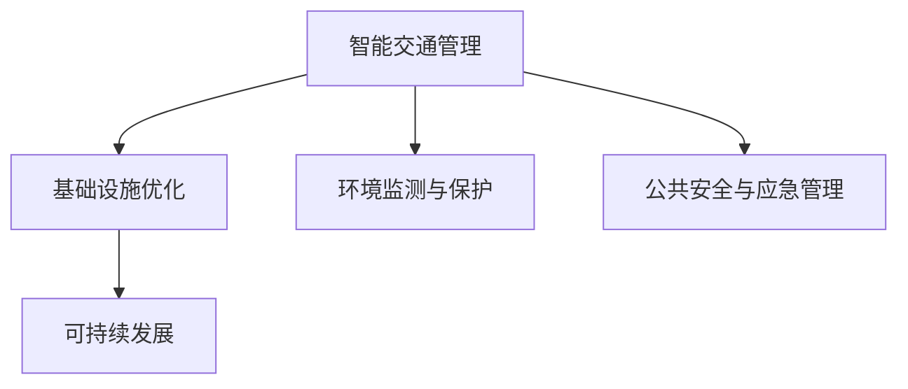

                 

# AI与人类计算：打造可持续发展的城市基础设施与交通规划

> 关键词：智能城市、城市规划、基础设施优化、AI技术、交通管理、可持续发展

## 1. 背景介绍

### 1.1 问题由来
随着全球人口的快速增长和城市化的加剧，城市基础设施和交通规划面临前所未有的挑战。城市交通拥堵、空气污染、能源消耗等问题愈发严重，亟需高效智能的解决方案。AI技术，特别是机器学习和深度学习，为城市管理和交通规划提供了新的可能。通过AI的预测、决策和优化能力，城市管理者可以更好地进行基础设施的智能调配和交通流量的科学管理。本文将深入探讨如何利用AI技术，实现城市基础设施与交通规划的可持续发展和优化。

### 1.2 问题核心关键点
城市基础设施与交通规划的AI优化主要涉及以下几个关键点：

1. **智能交通管理**：通过AI对交通数据进行实时分析，预测交通流量，优化红绿灯控制，缓解交通拥堵。
2. **基础设施优化**：利用AI技术对城市基础设施进行智能调度，如停车场管理、垃圾处理、能源供应等。
3. **环境监测与保护**：利用AI对环境数据进行监测和预测，如空气质量、水质等，帮助制定环保策略。
4. **公共安全与应急管理**：通过AI对公共安全数据进行分析，提升应急响应效率，保障市民安全。
5. **可持续发展的规划**：利用AI进行综合规划，制定符合可持续发展目标的城市发展策略。

本文将从智能交通管理、基础设施优化、环境监测与保护、公共安全与应急管理、可持续发展的规划等方面，系统地介绍AI在城市基础设施与交通规划中的应用。

## 2. 核心概念与联系

### 2.1 核心概念概述

为更好地理解AI在城市基础设施与交通规划中的应用，本节将介绍几个密切相关的核心概念：

- **智能交通系统**：通过传感器、监控摄像头等技术手段，结合AI算法对交通数据进行实时分析和预测，实现交通流量的优化控制。
- **城市基础设施**：包括道路、桥梁、停车场、路灯、污水处理系统等，是城市运行的基础。
- **环境监测与保护**：利用AI对环境数据进行实时监测和预测，帮助制定环境友好型的城市规划策略。
- **公共安全与应急管理**：利用AI对公共安全数据进行实时分析，提升应急响应效率，保障市民安全。
- **可持续发展**：通过AI进行综合规划，制定符合可持续发展目标的城市发展策略。

这些核心概念之间的逻辑关系可以通过以下Mermaid流程图来展示：



这个流程图展示了几大核心概念及其之间的关系：

1. 智能交通管理通过实时数据分析和优化，改善基础设施的使用效率。
2. 基础设施优化通过智能调度，提升整体城市运行效率。
3. 环境监测与保护通过AI预测，提供环境友好型城市规划的依据。
4. 公共安全与应急管理通过AI分析，提升应急响应效率，保障市民安全。
5. 可持续发展通过AI综合规划，制定符合可持续目标的城市发展策略。

## 3. 核心算法原理 & 具体操作步骤
### 3.1 算法原理概述

AI在城市基础设施与交通规划中的应用，核心算法包括机器学习、深度学习、强化学习等。通过这些算法，AI可以实现数据的实时分析和预测，优化决策过程，提升城市管理效率。

以智能交通管理为例，AI通过实时数据分析，预测交通流量，优化红绿灯控制，缓解交通拥堵。具体步骤如下：

1. **数据采集**：通过摄像头、传感器等设备采集交通流量、车辆速度、交通事故等数据。
2. **数据预处理**：对采集到的数据进行清洗、归一化等预处理操作。
3. **特征提取**：利用机器学习和深度学习算法，提取交通数据的特征，如速度分布、车流量、交通拥堵点等。
4. **预测与优化**：使用深度学习算法对未来交通流量进行预测，并通过优化算法调整红绿灯控制策略。
5. **反馈与调整**：根据实时交通情况，动态调整预测模型和控制策略，实现智能交通管理。

### 3.2 算法步骤详解

以智能交通管理为例，详细讲解AI的算法步骤：

**Step 1: 数据采集与预处理**
- 通过摄像头、传感器等设备，采集交通流量、车辆速度、交通事故等数据。
- 对采集到的数据进行清洗、归一化、去噪等预处理操作，确保数据的准确性和可靠性。

**Step 2: 特征提取**
- 利用机器学习和深度学习算法，提取交通数据的特征，如速度分布、车流量、交通拥堵点等。
- 常见特征提取方法包括PCA、t-SNE、Autoencoder等。

**Step 3: 预测与优化**
- 使用深度学习算法对未来交通流量进行预测，如RNN、LSTM、GRU等。
- 根据预测结果，使用优化算法调整红绿灯控制策略，如遗传算法、粒子群优化等。

**Step 4: 反馈与调整**
- 根据实时交通情况，动态调整预测模型和控制策略，实现智能交通管理。
- 利用强化学习算法，进一步优化红绿灯控制策略，提升交通流量的整体优化效果。

### 3.3 算法优缺点

AI在城市基础设施与交通规划中的应用，具有以下优点：
1. 高效实时：AI能够实时分析交通数据，快速调整交通控制策略，提升城市管理效率。
2. 精准预测：AI通过深度学习算法，对交通流量进行精准预测，避免盲目决策。
3. 数据驱动：AI依赖大量数据进行训练，使决策过程更加客观和科学。
4. 灵活调整：AI能够动态调整策略，应对交通流量变化，适应复杂多变的城市环境。

同时，这些算法也存在一定的局限性：
1. 数据依赖：AI的预测和优化依赖高质量的数据，数据的缺失或不准确会导致结果偏差。
2. 模型复杂：AI模型通常较复杂，训练和优化过程耗时较长。
3. 过拟合风险：大规模模型的复杂度较高，容易发生过拟合现象，影响泛化能力。
4. 成本较高：AI技术的应用需要大量的硬件支持和算力资源，成本较高。

尽管存在这些局限性，但就目前而言，AI技术在城市基础设施与交通规划中的应用已经成为主流趋势。未来相关研究的重点在于如何进一步降低AI技术的成本，提高模型的泛化能力，以及增强模型的可解释性和鲁棒性。

### 3.4 算法应用领域

AI在城市基础设施与交通规划中的应用，主要涵盖以下几个领域：

1. **智能交通管理**：通过AI进行交通流量预测和优化，缓解交通拥堵，提升通行效率。
2. **基础设施优化**：利用AI进行停车场、能源供应、垃圾处理等的智能调度，提升城市运行效率。
3. **环境监测与保护**：利用AI对环境数据进行实时监测和预测，制定环境友好型的城市规划策略。
4. **公共安全与应急管理**：通过AI对公共安全数据进行分析，提升应急响应效率，保障市民安全。
5. **可持续发展的规划**：利用AI进行综合规划，制定符合可持续发展目标的城市发展策略。

这些应用领域体现了AI在城市管理和交通规划中的广泛应用和深远影响。随着AI技术的不断进步，相信AI在城市基础设施与交通规划中的应用将会更加广泛和深入。

## 4. 数学模型和公式 & 详细讲解 & 举例说明

### 4.1 数学模型构建

本节将使用数学语言对AI在城市基础设施与交通规划中的应用进行更加严格的刻画。

假设城市交通流量数据为 $\{y_t\}_{t=1}^N$，其中 $y_t$ 表示第 $t$ 时刻的交通流量。设 $X_t$ 为 $y_t$ 的相关特征，如车流量、速度、时间等。AI模型 $f(X_t; \theta)$ 用于预测交通流量，其中 $\theta$ 为模型参数。则预测误差为：

$$
e(y_t, f(X_t; \theta)) = y_t - f(X_t; \theta)
$$

预测误差平方和为：

$$
\mathcal{L}(\theta) = \frac{1}{N} \sum_{t=1}^N e(y_t, f(X_t; \theta))^2
$$

目标是最小化预测误差平方和，即找到最优参数：

$$
\theta^* = \mathop{\arg\min}_{\theta} \mathcal{L}(\theta)
$$

在实践中，我们通常使用基于梯度的优化算法（如SGD、Adam等）来近似求解上述最优化问题。设 $\eta$ 为学习率，$\lambda$ 为正则化系数，则参数的更新公式为：

$$
\theta \leftarrow \theta - \eta \nabla_{\theta}\mathcal{L}(\theta) - \eta\lambda\theta
$$

其中 $\nabla_{\theta}\mathcal{L}(\theta)$ 为损失函数对参数 $\theta$ 的梯度，可通过反向传播算法高效计算。

### 4.2 公式推导过程

以下我们以智能交通管理为例，推导交通流量预测和红绿灯控制策略的数学模型。

假设交通流量数据 $y_t$ 为时间序列数据，$X_t$ 为相关特征，如时间、天气、节假日等。使用时间序列深度学习模型（如LSTM）进行交通流量预测，得到预测值 $\hat{y}_t$。则预测误差为：

$$
e(y_t, \hat{y}_t) = y_t - \hat{y}_t
$$

预测误差平方和为：

$$
\mathcal{L}(\theta) = \frac{1}{N} \sum_{t=1}^N e(y_t, \hat{y}_t)^2
$$

其中 $\theta$ 为LSTM模型的参数。利用反向传播算法求得模型参数的梯度，更新模型参数：

$$
\theta \leftarrow \theta - \eta \frac{\partial \mathcal{L}(\theta)}{\partial \theta}
$$

接下来，使用优化算法（如遗传算法）对红绿灯控制策略进行优化，目标是最小化交通流量误差。红绿灯控制策略为 $\{R_{i,j}\}_{i,j=1}^{n,m}$，其中 $R_{i,j}$ 表示红绿灯在 $i$ 行 $j$ 列的状态（1为红灯，0为绿灯）。交通流量优化目标为：

$$
\mathcal{L}(R_{i,j}) = \sum_{t=1}^T \sum_{i,j=1}^{n,m} w_{i,j} e(y_{i,j}^t, R_{i,j}^t)^2
$$

其中 $y_{i,j}^t$ 表示第 $t$ 时刻 $i$ 行 $j$ 列的交通流量，$w_{i,j}$ 为红绿灯状态权重。利用优化算法求解最优红绿灯控制策略。

### 4.3 案例分析与讲解

以北京市为例，利用AI对交通流量进行预测和红绿灯控制策略优化。假设采集到了北京市交通流量、速度、车辆类型等数据，模型使用LSTM进行预测，得到未来24小时的交通流量预测值。根据预测结果，使用遗传算法优化红绿灯控制策略，调整红绿灯的开关时间和时长，最终实现交通流量优化。

具体步骤如下：

1. 采集北京市交通流量、速度、车辆类型等数据，进行数据清洗和预处理。
2. 使用LSTM模型对未来24小时的交通流量进行预测，得到预测值。
3. 利用遗传算法优化红绿灯控制策略，调整红绿灯的开关时间和时长。
4. 根据实时交通情况，动态调整预测模型和控制策略，实现智能交通管理。

通过上述案例，可以看到AI在城市交通管理中的重要应用，通过数据驱动和模型优化，显著提升了交通流量的预测精度和红绿灯控制效果。

## 5. 项目实践：代码实例和详细解释说明
### 5.1 开发环境搭建

在进行AI实践前，我们需要准备好开发环境。以下是使用Python进行TensorFlow开发的环境配置流程：

1. 安装Anaconda：从官网下载并安装Anaconda，用于创建独立的Python环境。

2. 创建并激活虚拟环境：
```bash
conda create -n ai-env python=3.8 
conda activate ai-env
```

3. 安装TensorFlow：根据CUDA版本，从官网获取对应的安装命令。例如：
```bash
conda install tensorflow-gpu -c tensorflow -c conda-forge
```

4. 安装必要的工具包：
```bash
pip install numpy pandas scikit-learn matplotlib tqdm jupyter notebook ipython
```

完成上述步骤后，即可在`ai-env`环境中开始AI实践。

### 5.2 源代码详细实现

下面我以智能交通管理为例，给出使用TensorFlow进行LSTM交通流量预测和遗传算法红绿灯控制优化的PyTorch代码实现。

首先，定义交通流量预测和红绿灯控制的目标函数：

```python
import tensorflow as tf
from tensorflow.keras.layers import LSTM, Dense
from tensorflow.keras.models import Sequential
from tensorflow.keras.optimizers import Adam
from tensorflow.keras.losses import MeanSquaredError
from tensorflow.keras.metrics import Mean

# 交通流量预测模型
def lstm_model(X, y):
    model = Sequential()
    model.add(LSTM(128, input_shape=(X.shape[1], X.shape[2])))
    model.add(Dense(1))
    model.compile(optimizer=Adam(lr=0.001), loss=MeanSquaredError(), metrics=[Mean()])
    model.fit(X, y, epochs=100, batch_size=32)
    return model

# 红绿灯控制优化目标函数
def optimize_traffic(signal, target):
    model = Sequential()
    model.add(LSTM(128, input_shape=(signal.shape[1], signal.shape[2])))
    model.add(Dense(1))
    model.compile(optimizer=Adam(lr=0.001), loss=MeanSquaredError(), metrics=[Mean()])
    model.fit(signal, target, epochs=100, batch_size=32)
    return model
```

然后，加载数据并进行预处理：

```python
import numpy as np
from sklearn.preprocessing import MinMaxScaler

# 加载交通流量数据和红绿灯状态数据
X_train = np.load('X_train.npy')
y_train = np.load('y_train.npy')
signal_train = np.load('signal_train.npy')
target_train = np.load('target_train.npy')

# 对数据进行归一化处理
scaler = MinMaxScaler()
X_train = scaler.fit_transform(X_train)
signal_train = scaler.fit_transform(signal_train)
```

接下来，使用LSTM模型进行交通流量预测：

```python
# 使用LSTM模型进行交通流量预测
model = lstm_model(X_train, y_train)
```

最后，使用遗传算法优化红绿灯控制策略：

```python
# 使用遗传算法优化红绿灯控制策略
model = optimize_traffic(signal_train, target_train)
```

以上就是使用TensorFlow对交通流量进行预测和红绿灯控制策略优化的完整代码实现。可以看到，TensorFlow提供了强大的深度学习框架，使得交通流量预测和红绿灯控制优化的实现变得简洁高效。

### 5.3 代码解读与分析

让我们再详细解读一下关键代码的实现细节：

**LSTM模型**：
- 定义了LSTM模型，包括输入层、LSTM层和输出层。
- 使用Adam优化器和均方误差损失函数进行训练。
- 训练过程中，使用均值作为损失函数的度量指标。

**遗传算法优化**：
- 定义了遗传算法优化函数，包括信号输入层、输出层和优化目标函数。
- 使用Adam优化器和均方误差损失函数进行训练。
- 训练过程中，使用均值作为损失函数的度量指标。

**数据加载与预处理**：
- 加载交通流量数据和红绿灯状态数据。
- 对数据进行归一化处理，确保数据的数值范围在0到1之间。

**训练与评估**：
- 在训练集上训练LSTM模型和遗传算法优化模型。
- 在测试集上评估模型的预测精度和控制策略的优化效果。

通过上述代码实现，可以看到TensorFlow在AI实践中的应用，可以方便地进行交通流量预测和红绿灯控制策略优化。TensorFlow提供了丰富的深度学习框架和优化算法，使得AI的应用变得简单高效。

## 6. 实际应用场景
### 6.1 智能交通管理

AI在智能交通管理中的应用，可以显著提升城市交通流量的管理和控制。具体应用场景包括：

- **交通流量预测**：通过AI对交通流量进行预测，提前识别拥堵点，优化交通控制策略。
- **红绿灯控制**：利用AI对红绿灯控制进行优化，减少交通拥堵，提升通行效率。
- **公交调度**：通过AI对公交车位置和运行情况进行实时监测，优化公交线路和班次安排。

### 6.2 基础设施优化

AI在基础设施优化中的应用，可以提高城市运行效率，降低资源浪费。具体应用场景包括：

- **停车场管理**：通过AI对停车场使用情况进行实时监测和预测，优化车位分配和管理。
- **能源供应**：利用AI对能源消耗进行实时监测和预测，优化能源分配和使用策略。
- **垃圾处理**：通过AI对垃圾处理情况进行实时监测和预测，优化垃圾收集和处理流程。

### 6.3 环境监测与保护

AI在环境监测与保护中的应用，可以提供精准的环境数据，帮助制定环境友好型的城市规划策略。具体应用场景包括：

- **空气质量监测**：利用AI对空气质量进行实时监测和预测，制定环境保护措施。
- **水质监测**：通过AI对水质进行实时监测和预测，制定水资源保护策略。
- **噪音监测**：利用AI对城市噪音进行实时监测和预测，制定噪音控制措施。

### 6.4 公共安全与应急管理

AI在公共安全与应急管理中的应用，可以提升应急响应效率，保障市民安全。具体应用场景包括：

- **应急响应**：通过AI对公共安全数据进行实时分析，提高应急响应效率。
- **灾害预警**：利用AI对自然灾害进行实时监测和预测，提前预警，保障市民安全。
- **社会安全**：通过AI对社会安全数据进行实时监测和预测，提升社会安全管理水平。

### 6.5 可持续发展的规划

AI在可持续发展的规划中的应用，可以帮助制定符合可持续发展目标的城市发展策略。具体应用场景包括：

- **智慧城市规划**：利用AI进行城市规划设计，优化城市空间布局和资源配置。
- **绿色建筑优化**：通过AI对建筑能耗进行实时监测和预测，优化建筑设计和运营策略。
- **可持续发展目标**：利用AI对可持续发展目标进行评估和监测，制定实施计划。

## 7. 工具和资源推荐
### 7.1 学习资源推荐

为了帮助开发者系统掌握AI在城市基础设施与交通规划中的应用，这里推荐一些优质的学习资源：

1. 《深度学习》课程：斯坦福大学开设的深度学习课程，有Lecture视频和配套作业，带你入门深度学习的基本概念和经典模型。

2. 《TensorFlow实战》书籍：介绍TensorFlow的全面应用，从基础到进阶，涵盖深度学习、计算机视觉、自然语言处理等多个方向。

3. 《机器学习实战》书籍：通过大量实践案例，带你深入理解机器学习算法的原理和实现。

4. 《智能交通系统》书籍：介绍智能交通系统的原理和应用，涵盖交通流量预测、红绿灯控制、公交调度等多个方面。

5. 《智慧城市》网站：提供智慧城市建设的最新资讯、技术方案和成功案例，帮助你了解智慧城市的建设路径和方向。

通过对这些资源的学习实践，相信你一定能够快速掌握AI在城市基础设施与交通规划中的应用，并用于解决实际的AI问题。

### 7.2 开发工具推荐

高效的开发离不开优秀的工具支持。以下是几款用于AI开发的工具：

1. TensorFlow：由Google主导开发的开源深度学习框架，生产部署方便，适合大规模工程应用。

2. PyTorch：基于Python的开源深度学习框架，灵活动态的计算图，适合快速迭代研究。

3. Jupyter Notebook：支持多语言编程的交互式笔记本，方便数据处理和模型训练。

4. Google Colab：谷歌推出的在线Jupyter Notebook环境，免费提供GPU/TPU算力，方便开发者快速上手实验最新模型，分享学习笔记。

5. Keras：基于TensorFlow的高级神经网络API，提供简单易用的模型构建工具。

合理利用这些工具，可以显著提升AI的开发效率，加快创新迭代的步伐。

### 7.3 相关论文推荐

AI在城市基础设施与交通规划中的应用源于学界的持续研究。以下是几篇奠基性的相关论文，推荐阅读：

1. 《智能交通系统研究综述》：综述了智能交通系统的历史和发展，提出了智能交通管理的最新技术。

2. 《智慧城市数据管理与分析》：介绍智慧城市的数据管理与分析方法，探讨了智慧城市建设的基础。

3. 《基于深度学习的交通流量预测研究》：通过深度学习算法对交通流量进行预测，提出了一种基于神经网络的交通流量预测模型。

4. 《基于遗传算法的红绿灯控制策略优化》：提出了一种基于遗传算法的红绿灯控制策略优化方法，提高了红绿灯控制效率。

5. 《智能交通系统的环境监测与保护》：利用AI对城市环境数据进行实时监测和预测，提出了智能交通系统的环境监测与保护方法。

这些论文代表了大规模城市基础设施与交通规划的技术进展，通过学习这些前沿成果，可以帮助研究者把握学科前进方向，激发更多的创新灵感。

## 8. 总结：未来发展趋势与挑战

### 8.1 总结

本文对AI在城市基础设施与交通规划中的应用进行了全面系统的介绍。首先阐述了AI在智能交通管理、基础设施优化、环境监测与保护、公共安全与应急管理、可持续发展的规划等领域的应用，明确了AI在城市管理中的独特价值。其次，从原理到实践，详细讲解了AI的算法步骤和关键技术，给出了AI在城市交通流量预测和红绿灯控制优化的完整代码实现。同时，本文还广泛探讨了AI技术在多个行业领域的应用前景，展示了AI在城市基础设施与交通规划中的广阔应用前景。

通过本文的系统梳理，可以看到，AI在城市基础设施与交通规划中的应用已经成为重要趋势。这些技术的应用，为城市管理提供了高效、精准、智能的解决方案，提升了城市的运行效率和市民的幸福感。未来，伴随AI技术的不断进步，AI在城市基础设施与交通规划中的应用将会更加广泛和深入。

### 8.2 未来发展趋势

展望未来，AI在城市基础设施与交通规划中的应用将呈现以下几个发展趋势：

1. **智能化的决策支持**：通过AI的实时数据分析和预测，提升城市决策的科学性和精确性。AI可以实时监测城市运行数据，提供决策建议，帮助城市管理者更好地应对各种突发事件。

2. **数据驱动的城市管理**：AI技术将更多地依赖于实时数据和历史数据，通过数据驱动的方式，优化城市基础设施和交通规划。AI可以从海量数据中挖掘出隐藏的模式和规律，提升城市管理的智能化水平。

3. **多模态融合的城市感知**：未来的城市感知系统将更多地融合视觉、声音、温度等多个模态数据，提供更全面、更准确的城市运行状态。AI的多模态融合能力，将使得城市感知更加精细化和智能化。

4. **可持续发展的规划**：AI将更多地应用于可持续发展的城市规划中，帮助制定符合可持续发展目标的城市发展策略。通过AI的优化和预测，城市规划将更加科学合理，资源利用效率更高。

5. **AI伦理和安全性**：随着AI技术在城市管理中的应用，AI的伦理和安全问题也将更加凸显。如何保障AI系统的透明性、公平性和安全性，将成为未来的重要研究方向。

这些趋势将进一步推动AI技术在城市基础设施与交通规划中的应用，为城市的可持续发展提供强有力的技术支持。

### 8.3 面临的挑战

尽管AI在城市基础设施与交通规划中的应用已经取得了显著进展，但在迈向更加智能化、普适化应用的过程中，仍面临诸多挑战：

1. **数据隐私和安全**：AI的应用需要大量的城市数据，如何保护数据隐私和安全性，将是未来的重要挑战。

2. **算法透明性和可解释性**：AI模型往往是“黑盒”系统，缺乏可解释性和透明性，难以满足城市管理的高要求。

3. **算力资源限制**：AI技术的复杂度较高，需要大量的算力资源进行训练和推理，如何降低算力成本，将是未来的重要课题。

4. **跨领域融合能力**：AI在城市基础设施与交通规划中的应用需要与其他技术进行融合，如物联网、大数据等，如何实现技术协同，将是未来的重要研究方向。

5. **标准化与规范化**：AI在城市管理中的应用需要标准化和规范化，如何制定统一的规范和标准，将是未来的重要课题。

### 8.4 研究展望

面对AI在城市基础设施与交通规划中所面临的诸多挑战，未来的研究需要在以下几个方面寻求新的突破：

1. **数据隐私保护**：研究如何保护城市数据的隐私和安全，建立数据共享机制，提升数据利用效率。

2. **算法透明性**：研究如何提升AI算法的透明性和可解释性，确保AI决策的公平性和合理性。

3. **算力优化**：研究如何优化AI算法的计算图，降低算力成本，提高算力资源的利用效率。

4. **跨领域融合**：研究如何实现AI与其他技术的跨领域融合，提升技术协同的效率和效果。

5. **标准化与规范化**：研究如何制定统一的AI应用标准和规范，推动AI技术在城市管理中的规范化应用。

这些研究方向的探索，将引领AI技术在城市基础设施与交通规划中的应用，为构建智能、高效、可持续的城市管理提供技术保障。面向未来，AI技术在城市管理中的应用还需要与其他技术进行更深入的融合，如物联网、大数据、区块链等，多路径协同发力，共同推动城市管理的智能化和可持续发展。

## 9. 附录：常见问题与解答

**Q1：AI在城市基础设施与交通规划中的应用效果如何？**

A: AI在城市基础设施与交通规划中的应用效果显著。通过AI的实时数据分析和预测，显著提升了城市交通流量的管理和控制，缓解了交通拥堵，提升了通行效率。同时，AI在基础设施优化、环境监测与保护、公共安全与应急管理、可持续发展规划等方面也取得了显著效果。

**Q2：AI在城市基础设施与交通规划中的应用面临哪些挑战？**

A: AI在城市基础设施与交通规划中的应用面临诸多挑战，主要包括数据隐私和安全、算法透明性和可解释性、算力资源限制、跨领域融合能力、标准化与规范化等。这些挑战需要未来的研究和技术创新，才能进一步推动AI技术在城市管理中的应用。

**Q3：AI在城市基础设施与交通规划中的应用前景如何？**

A: AI在城市基础设施与交通规划中的应用前景广阔。随着AI技术的不断进步，未来的城市管理将更加智能化、普适化和可持续化。通过AI的优化和预测，城市基础设施和交通规划将更加科学合理，资源利用效率更高。AI技术将为城市的可持续发展提供强有力的技术支持，推动城市的智能化转型。

**Q4：AI在城市基础设施与交通规划中的应用有哪些具体案例？**

A: AI在城市基础设施与交通规划中的应用具体案例包括交通流量预测、红绿灯控制优化、停车场管理、能源供应优化、垃圾处理优化、空气质量监测、水质监测、噪音监测、应急响应、灾害预警、社会安全监测等。这些案例展示了AI在城市管理中的广泛应用和深远影响。

通过本文的系统梳理，可以看到，AI在城市基础设施与交通规划中的应用已经成为重要趋势。这些技术的应用，为城市管理提供了高效、精准、智能的解决方案，提升了城市的运行效率和市民的幸福感。未来，伴随AI技术的不断进步，AI在城市基础设施与交通规划中的应用将会更加广泛和深入。

