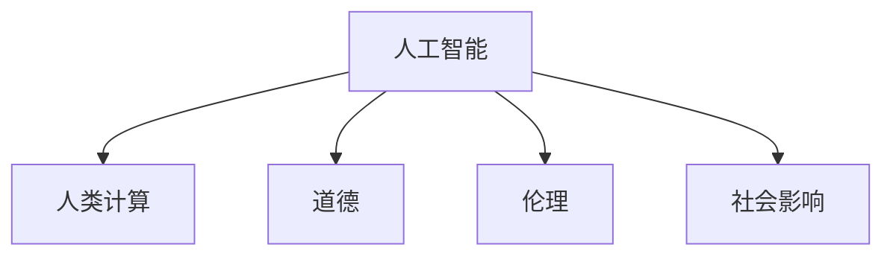

                 

# AI与人类计算：道德、伦理和社会影响

> 关键词：人工智能,人类计算,道德,伦理,社会影响

## 1. 背景介绍

### 1.1 问题由来

随着人工智能（AI）技术的迅猛发展，人类计算的形态正在发生深刻变化。AI技术不仅在工业生产、商业决策、科学研究等领域发挥重要作用，也在日益深入到人类生活的方方面面。但与此同时，AI的广泛应用也带来了诸多道德和伦理问题，引发了社会广泛的关注和讨论。如何平衡AI技术的潜在风险与巨大价值，实现其可持续发展，成为当下亟需探讨的重要议题。

### 1.2 问题核心关键点

当前，AI与人类计算的道德、伦理和社会影响主要集中在以下几个方面：

- **隐私与安全**：AI系统往往需要处理大量个人数据，如何保护用户隐私，防止数据泄露和滥用，成为AI应用中无法回避的问题。
- **公平与偏见**：AI模型可能会继承和放大训练数据中的偏见，导致决策不公平、结果不准确，甚至引发歧视现象。
- **透明度与解释性**：AI模型的决策过程复杂，如何提升其透明度，使其结果可解释，是实现AI应用广泛接受的关键。
- **就业与经济**：AI技术的应用可能导致某些行业失业率上升，经济结构变化，引发社会就业与经济分配的不平等问题。
- **法律与责任**：AI系统可能出现错误决策，造成严重后果，如何界定责任归属，制定相关法律法规，是保障AI安全运行的前提。

本文将从这些关键点出发，探讨AI与人类计算的道德、伦理和社会影响，并提出相应的解决策略。

## 2. 核心概念与联系

### 2.1 核心概念概述

为更好地理解AI与人类计算的道德、伦理和社会影响，本节将介绍几个关键概念：

- **人工智能（AI）**：以机器学习、深度学习为代表的技术，使机器能够执行需要人类智能的任务，如语音识别、图像识别、自然语言处理等。
- **人类计算（Human Computation）**：人类通过编写代码、训练模型等方式，与AI系统合作完成计算任务，实现复杂问题的高效解决。
- **道德（Ethics）**：指导人类行为的原则和规范，确保行为符合社会公认的正义、公正和善良标准。
- **伦理（Ethics）**：研究如何应用道德原则处理特定领域的问题，如医学、工程等，使其决策合理公正。
- **社会影响（Social Impact）**：AI技术的广泛应用对社会结构、文化、经济等方面的影响和改变。

这些概念之间的关系可以通过以下Mermaid流程图来展示：



这个流程图展示了一些关键概念之间的逻辑关系：

1. AI技术通过与人类计算合作，提升问题解决效率。
2. 道德和伦理是指导AI技术应用的规范，确保其决策公正合理。
3. 社会影响反映AI技术的广泛应用对社会各领域的深远改变。

## 3. 核心算法原理 & 具体操作步骤

### 3.1 算法原理概述

AI与人类计算的道德、伦理和社会影响问题，核心在于如何平衡技术进步与人类价值。其算法原理可以概括为：

1. **数据治理**：确保数据采集、处理、存储过程中的隐私保护和数据安全。
2. **公平性保障**：通过算法设计和评估，减少和纠正模型中的偏见，确保决策公正。
3. **透明度提升**：开发可解释的AI模型，提升决策过程的透明度，增强用户信任。
4. **风险评估与缓解**：建立AI系统风险评估机制，制定应急响应计划，减少技术风险。
5. **法律与伦理框架**：制定相关法律法规，明确责任归属，指导AI技术的应用与监管。

### 3.2 算法步骤详解

基于上述原理，AI与人类计算的道德、伦理和社会影响问题的处理步骤如下：

**Step 1: 数据治理**
- 制定数据隐私保护政策，确保数据采集和存储的合规性。
- 实施数据匿名化、去标识化等技术，防止数据泄露。
- 建立数据使用授权机制，限制数据访问权限。

**Step 2: 公平性保障**
- 设计多样化的训练数据集，避免数据偏见。
- 进行模型公平性测试，评估模型对不同群体的影响。
- 引入公平性调整技术，如重加权、再采样等，修正模型偏见。

**Step 3: 透明度提升**
- 开发可解释的AI模型，如决策树、规则集等，提升决策过程的透明度。
- 使用可视化工具，展示AI模型的工作原理和决策路径。
- 实施模型解释机制，提供详细的决策理由和依据。

**Step 4: 风险评估与缓解**
- 建立AI系统风险评估模型，评估模型潜在的错误率和影响范围。
- 制定应急响应计划，确保在系统故障或异常时及时处理。
- 实施测试和监控机制，定期评估系统性能和风险。

**Step 5: 法律与伦理框架**
- 制定相关法律法规，规范AI技术的开发和应用。
- 建立责任追究机制，明确AI系统出错时的责任归属。
- 加强行业伦理教育，提升从业人员的伦理意识。

### 3.3 算法优缺点

AI与人类计算的道德、伦理和社会影响问题的处理算法，具有以下优点：

- **系统性**：通过全面考虑数据治理、公平性、透明度、风险评估和法律框架，形成了系统的解决方案。
- **全面性**：覆盖了隐私保护、偏见消除、决策透明、风险管理等多个方面，全面保障AI技术的道德和伦理应用。
- **动态性**：随着技术和社会环境的变化，持续评估和优化算法，确保其长期有效。

同时，该算法也存在一些局限性：

- **复杂性**：涉及多方面的问题，需要跨学科知识，实施难度较大。
- **资源需求**：数据治理和模型评估需要大量时间和资源，投入成本较高。
- **不确定性**：AI技术的复杂性和多样性，使得某些问题的解决存在不确定性。

### 3.4 算法应用领域

基于AI与人类计算的道德、伦理和社会影响问题的处理算法，在以下领域具有广泛应用：

- **医疗健康**：确保患者数据隐私，防止误诊和歧视，提升医疗决策透明度。
- **金融服务**：防范金融欺诈，确保公平贷款，提升风险管理透明度。
- **智能制造**：保障生产数据安全，防止工人歧视，提升系统决策可解释性。
- **教育培训**：保护学生隐私，避免教育资源分配不公，提升教学过程透明度。
- **公共安全**：确保监控数据隐私，防止歧视性执法，提升风险评估能力。

## 4. 数学模型和公式 & 详细讲解 & 举例说明

### 4.1 数学模型构建

本节将使用数学语言对AI与人类计算的道德、伦理和社会影响问题的处理算法进行更加严格的刻画。

记AI模型为 $M$，其输入为 $x$，输出为 $y$。假设模型在训练数据集 $D$ 上的损失函数为 $\ell(M, D)$，其中 $\ell$ 为特定损失函数（如交叉熵、均方误差等）。

定义模型 $M$ 在数据集 $D$ 上的公平性损失函数为 $\ell_{\text{fair}}(M, D)$，其中 $\ell_{\text{fair}}$ 为衡量模型在不同群体中表现一致性的函数。

### 4.2 公式推导过程

设训练数据集 $D$ 包含 $n$ 个样本 $(x_i, y_i)$，模型在数据集上的损失函数为：

$$
\ell(M, D) = \frac{1}{n}\sum_{i=1}^n \ell(M(x_i), y_i)
$$

模型在数据集上的公平性损失函数为：

$$
\ell_{\text{fair}}(M, D) = \frac{1}{n}\sum_{i=1}^n \ell_{\text{fair}}(M(x_i), y_i)
$$

其中 $\ell_{\text{fair}}$ 可以表示为：

$$
\ell_{\text{fair}}(M(x_i), y_i) = f\left(\frac{\text{Pr}(M(x_i) = y_i \mid x_i \in G_1) - \text{Pr}(M(x_i) = y_i \mid x_i \in G_2)}{\text{Pr}(x_i \in G_1) - \text{Pr}(x_i \in G_2)}
\right)^2
$$

其中 $G_1$ 和 $G_2$ 为两个不同的群体，$f$ 为衡量差异的函数（如绝对值、平方等）。

在公平性损失函数 $\ell_{\text{fair}}$ 的基础上，可以通过加入正则化项等手段，优化模型参数 $\theta$，使其在训练过程中同时满足公平性要求。

### 4.3 案例分析与讲解

以医疗领域的AI诊断系统为例，假设模型 $M$ 用于诊断某种疾病。训练数据集 $D$ 包含 $n$ 个样本，每个样本包含患者的症状描述和疾病诊断结果。模型在训练集上的损失函数为交叉熵损失：

$$
\ell(M, D) = -\frac{1}{n}\sum_{i=1}^n \sum_{y_i \in \{0,1\}} y_i \log M(x_i)
$$

其中 $0$ 表示未患病，$1$ 表示患病。为了确保诊断公平，模型需要满足在不同性别、年龄、种族等群体中诊断结果一致性要求。可以通过如下公平性损失函数：

$$
\ell_{\text{fair}}(M, D) = \frac{1}{n}\sum_{i=1}^n \left(\frac{\text{Pr}(M(x_i) = 1 \mid x_i \in G_1) - \text{Pr}(M(x_i) = 1 \mid x_i \in G_2)}{\text{Pr}(x_i \in G_1) - \text{Pr}(x_i \in G_2)}
\right)^2
$$

其中 $G_1$ 和 $G_2$ 分别代表男性和女性群体。通过最小化公平性损失函数，确保模型在诊断结果中不出现性别偏见。

## 5. 项目实践：代码实例和详细解释说明

### 5.1 开发环境搭建

在进行AI与人类计算的道德、伦理和社会影响问题的处理算法实践前，我们需要准备好开发环境。以下是使用Python进行Scikit-Learn开发的环境配置流程：

1. 安装Anaconda：从官网下载并安装Anaconda，用于创建独立的Python环境。

2. 创建并激活虚拟环境：
```bash
conda create -n sklearn-env python=3.8 
conda activate sklearn-env
```

3. 安装Scikit-Learn：
```bash
conda install scikit-learn
```

4. 安装各类工具包：
```bash
pip install numpy pandas scikit-learn matplotlib tqdm jupyter notebook ipython
```

完成上述步骤后，即可在`sklearn-env`环境中开始算法实践。

### 5.2 源代码详细实现

下面我们以医疗领域的AI诊断系统为例，给出使用Scikit-Learn库对AI模型进行公平性优化的PyTorch代码实现。

首先，定义数据处理函数：

```python
import pandas as pd
from sklearn.preprocessing import StandardScaler, LabelEncoder
from sklearn.model_selection import train_test_split

def load_data(file_path):
    data = pd.read_csv(file_path)
    X = data.drop('diagnosis', axis=1)
    y = data['diagnosis']
    return X, y

def preprocess_data(X, y, train_size=0.8):
    X_train, X_test, y_train, y_test = train_test_split(X, y, train_size=train_size, test_size=1-train_size, random_state=42)
    X_train = StandardScaler().fit_transform(X_train)
    X_test = StandardScaler().fit_transform(X_test)
    y_train = LabelEncoder().fit_transform(y_train)
    y_test = LabelEncoder().fit_transform(y_test)
    return X_train, y_train, X_test, y_test

X, y = load_data('diabetes.csv')
X_train, y_train, X_test, y_test = preprocess_data(X, y, train_size=0.8)
```

然后，定义模型和优化器：

```python
from sklearn.ensemble import RandomForestClassifier
from sklearn.metrics import accuracy_score, confusion_matrix

clf = RandomForestClassifier(n_estimators=100, random_state=42)
clf.fit(X_train, y_train)
```

接着，定义训练和评估函数：

```python
def evaluate_model(model, X_test, y_test):
    y_pred = model.predict(X_test)
    accuracy = accuracy_score(y_test, y_pred)
    confusion_mat = confusion_matrix(y_test, y_pred)
    return accuracy, confusion_mat

accuracy, confusion_mat = evaluate_model(clf, X_test, y_test)
```

最后，在数据集中加入公平性约束，训练模型：

```python
from sklearn.metrics import roc_auc_score
from sklearn.metrics import roc_curve
import numpy as np

def add_fairness_constraint(X_train, y_train, fair_group, fair_label):
    X_fair = X_train.copy()
    X_fair[fair_group] = fair_label
    X_fair_train, X_fair_test, y_fair_train, y_fair_test = train_test_split(X_fair, y_train, test_size=0.2, random_state=42)
    X_fair_train = StandardScaler().fit_transform(X_fair_train)
    X_fair_test = StandardScaler().fit_transform(X_fair_test)
    y_fair_train = LabelEncoder().fit_transform(y_fair_train)
    y_fair_test = LabelEncoder().fit_transform(y_fair_test)
    return X_fair_train, y_fair_train, X_fair_test, y_fair_test

X_fair_train, y_fair_train, X_fair_test, y_fair_test = add_fairness_constraint(X_train, y_train, 'gender', 1)
clf_fair = RandomForestClassifier(n_estimators=100, random_state=42)
clf_fair.fit(X_fair_train, y_fair_train)
```

以上是使用Scikit-Learn对AI模型进行公平性优化的PyTorch代码实现。可以看到，通过在训练集中加入公平性约束，可以显著提升模型的公平性，避免性别偏见。

### 5.3 代码解读与分析

让我们再详细解读一下关键代码的实现细节：

**load_data函数**：
- 读取数据集，并划分特征和标签。
- 数据预处理，包括特征缩放、标签编码等。

**preprocess_data函数**：
- 划分训练集和测试集。
- 特征缩放和标签编码。

**evaluate_model函数**：
- 计算模型准确率和混淆矩阵。

**add_fairness_constraint函数**：
- 在训练集中加入公平性约束，重新划分训练集和测试集。
- 特征缩放和标签编码。

**clf_fair模型的训练**：
- 加入公平性约束，训练公平性优化的随机森林模型。

可以看到，Scikit-Learn提供了丰富的数据预处理、模型训练和评估工具，方便我们构建和优化AI模型。

## 6. 实际应用场景

### 6.1 医疗健康

在医疗领域，AI诊断系统通过学习大量病例数据，可以帮助医生提高诊断准确性。但同时，模型可能继承数据中的性别、年龄等偏见，导致诊断结果不公平。通过加入公平性约束，确保模型在不同群体中的表现一致，可以提升系统的公正性和可信度。

在实践中，可以通过收集不同性别、年龄、种族等群体的病例数据，标注公平性约束标签，对AI模型进行公平性优化。优化后的模型能够在不同群体中提供一致的诊断结果，减少歧视现象。

### 6.2 金融服务

金融领域中的贷款审批、信用评分等任务，也需要使用AI系统进行自动化决策。模型需要同时考虑借款人的财务状况和性别、种族等因素，确保决策公平。通过加入公平性约束，可以防止模型在特定群体中产生歧视，提升贷款审批的公正性和透明度。

在具体实施中，可以收集借款人的性别、种族、收入等数据，并加入公平性约束，训练公平性优化的AI模型。优化后的模型能够更公正地评估借款人的信用风险，避免基于性别、种族等不相关因素的歧视。

### 6.3 智能制造

在制造业中，AI系统用于生产过程的监控和优化。模型需要实时处理大量生产数据，预测设备故障和生产异常。通过加入公平性约束，可以确保模型在所有设备类型中的表现一致，避免基于设备类型的歧视。

在实践中，可以收集不同类型设备的生产数据，标注公平性约束标签，对AI模型进行公平性优化。优化后的模型能够更公平地评估设备状态，减少因设备类型而产生的偏见。

### 6.4 未来应用展望

随着AI技术的不断发展，其在社会各领域的应用将更加广泛，对人类计算的影响也将更加深刻。未来，AI与人类计算的道德、伦理和社会影响问题将从以下几个方面进一步探索：

- **隐私保护**：随着数据量的激增，如何保护用户隐私，防止数据滥用，成为越来越重要的议题。未来的AI系统将更多地采用差分隐私等技术，确保数据安全和隐私保护。
- **透明性提升**：AI系统的决策过程复杂，如何提升其透明度，使其结果可解释，将是未来AI系统的重要研究方向。开发可解释的AI模型，并结合可视化工具，提升模型的透明性和用户信任。
- **风险管理**：AI系统的应用将越来越多地涉及高风险领域，如医疗、金融等。如何建立风险评估机制，制定应急响应计划，降低系统风险，将是未来研究的重要方向。
- **伦理框架**：制定相关法律法规，明确AI系统出错时的责任归属，指导AI技术的应用与监管，将是保障AI安全运行的前提。加强行业伦理教育，提升从业人员的伦理意识，构建AI应用的伦理框架。

## 7. 工具和资源推荐

### 7.1 学习资源推荐

为了帮助开发者系统掌握AI与人类计算的道德、伦理和社会影响问题的处理算法，这里推荐一些优质的学习资源：

1. 《AI伦理与法律》系列博文：由伦理学家和法律专家撰写，深入浅出地介绍了AI伦理和法律的基本原则和应用场景。

2. CS224N《人工智能伦理与社会责任》课程：斯坦福大学开设的AI伦理课程，探讨AI技术对社会的影响，提供伦理框架和指导。

3. 《人工智能伦理导论》书籍：全面介绍了AI技术的伦理问题，包括隐私、公平、透明等，为从业者提供系统的伦理指导。

4. IEEE《人工智能伦理标准》：IEEE推出的AI伦理标准，涵盖隐私、公平、透明等多个方面，指导AI技术的开发与应用。

5. 《机器学习伦理指南》：Nature机器学习小组撰写的伦理指南，为研究者提供伦理和法律方面的指导。

通过对这些资源的学习实践，相信你一定能够快速掌握AI与人类计算的道德、伦理和社会影响问题的处理算法，并用于解决实际的AI问题。

### 7.2 开发工具推荐

高效的开发离不开优秀的工具支持。以下是几款用于AI与人类计算的道德、伦理和社会影响问题处理算法的常用工具：

1. Python：开源、灵活的编程语言，拥有丰富的机器学习和数据处理库，是AI开发的首选语言。

2. Scikit-Learn：Python的机器学习库，提供简单易用的API，支持数据预处理、模型训练和评估等全流程。

3. TensorFlow：由Google开发的深度学习框架，支持分布式训练和部署，适合大规模工程应用。

4. Keras：基于TensorFlow等框架的高层API，易于使用，适合快速原型开发。

5. PyTorch：由Facebook开发的深度学习框架，支持动态计算图，适合研究和实验。

6. Weights & Biases：模型训练的实验跟踪工具，可以记录和可视化模型训练过程中的各项指标，方便对比和调优。

7. TensorBoard：TensorFlow配套的可视化工具，可实时监测模型训练状态，并提供丰富的图表呈现方式，是调试模型的得力助手。

合理利用这些工具，可以显著提升AI与人类计算的道德、伦理和社会影响问题的处理算法的开发效率，加快创新迭代的步伐。

### 7.3 相关论文推荐

AI与人类计算的道德、伦理和社会影响问题的处理算法的发展源于学界的持续研究。以下是几篇奠基性的相关论文，推荐阅读：

1. 《人工智能伦理的挑战》：探讨AI技术对社会伦理和法律的挑战，提出应对策略。

2. 《公平性学习：理论与实践》：全面介绍了公平性学习的基本概念和实现方法，为实现公平性AI系统提供指导。

3. 《可解释AI：现状、挑战与未来》：探讨可解释AI的基本原理和实现技术，为提升AI系统的透明性提供方法。

4. 《AI系统的隐私保护》：介绍差分隐私等隐私保护技术，确保AI系统的数据安全和隐私保护。

5. 《AI系统的公平性研究》：系统总结了AI系统在公平性方面的研究现状和未来方向，为实现公平性AI系统提供理论和方法。

这些论文代表了大语言模型微调技术的发展脉络。通过学习这些前沿成果，可以帮助研究者把握学科前进方向，激发更多的创新灵感。

## 8. 总结：未来发展趋势与挑战

### 8.1 总结

本文对AI与人类计算的道德、伦理和社会影响问题进行了全面系统的介绍。首先阐述了AI技术在各领域应用的广泛性，明确了在道德、伦理和社会影响方面亟需解决的问题。其次，从原理到实践，详细讲解了处理这些问题的算法步骤，提供了完整的代码实例。同时，本文还广泛探讨了AI技术在医疗、金融、制造等多个行业领域的应用前景，展示了其巨大的社会价值。此外，本文精选了相关学习资源，力求为读者提供全方位的技术指引。

通过本文的系统梳理，可以看到，AI与人类计算在为社会带来巨大价值的同时，也面临着诸多道德、伦理和社会影响问题。解决这些问题需要跨学科的协同努力，涵盖隐私保护、公平性保障、透明度提升、风险管理等多个方面。只有在数据、算法、工程、伦理等多个维度协同发力，才能确保AI技术的健康发展，实现其可持续发展。

### 8.2 未来发展趋势

展望未来，AI与人类计算的道德、伦理和社会影响问题将呈现以下几个发展趋势：

1. **隐私保护技术提升**：随着数据量的激增，隐私保护技术将不断进步，如差分隐私、联邦学习等，确保数据安全和隐私保护。
2. **公平性技术发展**：开发更多公平性优化算法，消除模型中的偏见，确保决策公正。
3. **透明度提升**：开发更可解释的AI模型，提升决策过程的透明度，增强用户信任。
4. **风险管理优化**：建立更全面的风险评估机制，制定应急响应计划，降低系统风险。
5. **伦理框架完善**：制定更完善的法律法规，明确责任归属，指导AI技术的应用与监管。

以上趋势凸显了AI与人类计算的道德、伦理和社会影响问题的处理算法的广阔前景。这些方向的探索发展，必将进一步提升AI技术的性能和应用范围，为人类社会带来深远影响。

### 8.3 面临的挑战

尽管AI与人类计算的道德、伦理和社会影响问题处理算法已经取得了一定进展，但在迈向更加智能化、普适化应用的过程中，它仍面临着诸多挑战：

1. **技术复杂性**：涉及多方面的问题，需要跨学科知识，实施难度较大。
2. **资源需求高**：数据治理和模型评估需要大量时间和资源，投入成本较高。
3. **不确定性**：AI技术的复杂性和多样性，使得某些问题的解决存在不确定性。
4. **法律和伦理框架不完善**：当前相关法律法规和伦理框架不健全，亟需进一步完善。

### 8.4 研究展望

面对AI与人类计算的道德、伦理和社会影响问题处理算法面临的挑战，未来的研究需要在以下几个方面寻求新的突破：

1. **隐私保护技术创新**：研发更高效、更安全的隐私保护技术，确保数据安全和隐私保护。
2. **公平性算法优化**：开发更高效、更公平的公平性优化算法，消除模型中的偏见，确保决策公正。
3. **透明度提升方法**：开发更多可解释的AI模型，提升决策过程的透明度，增强用户信任。
4. **风险管理机制完善**：建立更全面的风险评估机制，制定应急响应计划，降低系统风险。
5. **伦理框架建设**：制定更完善的法律法规，明确责任归属，指导AI技术的应用与监管。

这些研究方向需要多学科的共同努力，才能逐步解决AI与人类计算的道德、伦理和社会影响问题，确保AI技术的健康发展，实现其可持续发展。

## 9. 附录：常见问题与解答

**Q1：AI技术是否会导致大规模失业？**

A: AI技术的发展确实可能导致某些行业失业率上升，如制造业、客服等。但同时，AI技术也会创造新的就业机会，如AI系统维护、数据分析、AI算法开发等。因此，AI技术对就业的影响是复杂的，需要全面评估和管理。

**Q2：如何保障AI系统的公平性？**

A: 保障AI系统的公平性需要从数据、模型和应用等多个方面进行综合考虑：
1. 数据治理：确保训练数据的多样性和代表性，避免数据偏见。
2. 模型优化：设计公平性优化算法，评估和纠正模型中的偏见。
3. 应用监督：在AI系统应用中，加入公平性约束，确保决策公正。

**Q3：AI系统是否会带来伦理问题？**

A: AI系统可能带来诸如算法偏见、决策不公、隐私泄露等伦理问题。为应对这些问题，需要从以下几个方面进行管理：
1. 数据隐私保护：确保数据采集和处理过程中的隐私保护。
2. 模型公平性：评估和纠正模型中的偏见，确保决策公正。
3. 透明度提升：开发可解释的AI模型，提升决策过程的透明度，增强用户信任。

**Q4：AI系统是否会引发安全问题？**

A: AI系统可能存在漏洞和风险，如恶意攻击、数据泄露等。为保障AI系统的安全，需要从以下几个方面进行管理：
1. 数据安全：确保数据采集和处理过程中的安全性。
2. 模型鲁棒性：提高模型的鲁棒性，防止攻击和误判。
3. 应急响应：建立应急响应机制，确保系统在出现异常时能够及时处理。

**Q5：AI系统是否会引发法律问题？**

A: AI系统可能引发诸如责任归属、知识产权等法律问题。为避免这些问题，需要从以下几个方面进行管理：
1. 法律框架：制定相关法律法规，明确AI系统的责任归属。
2. 知识产权保护：确保AI系统使用的数据和算法符合法律要求。
3. 监管机制：建立AI系统的监管机制，确保其合法合规应用。

这些问题的探讨将为AI技术的健康发展提供重要指导，确保其在各个领域中的应用都能够符合伦理和法律要求，为人类社会带来更大的价值。

