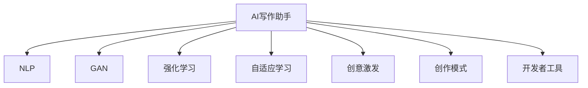

                 

# AI写作助手：技术实现与创意激发

> 关键词：AI写作助手,自然语言处理(NLP),生成对抗网络(GAN),强化学习,自适应学习,创意激发,创作模式,开发者工具

## 1. 背景介绍

### 1.1 问题由来

随着人工智能(AI)技术的飞速发展，AI写作助手逐渐成为热门研究领域之一。AI写作助手能够辅助用户进行创意构思、内容创作和文本编辑，大幅提升创作效率，降低了内容生产的门槛。尤其是在新闻撰写、内容生产、创意写作等需要大量文字输出的领域，AI写作助手显示出巨大潜力。

### 1.2 问题核心关键点

当前AI写作助手技术仍处于快速发展阶段，面临诸多技术挑战。主要问题包括：

- **创意激发**：如何激发创作者的灵感，提高其创作动机和兴趣。
- **文本生成质量**：生成的文本是否能够满足用户需求，具有较高的可读性和创新性。
- **用户个性化需求**：如何适应不同用户的具体需求，提供定制化的写作服务。
- **技术集成度**：如何与现有的内容管理系统、编辑器等工具无缝集成。
- **伦理与隐私**：如何确保用户隐私安全，避免AI生成内容侵犯版权或伦理问题。

### 1.3 问题研究意义

AI写作助手的研究对于提升内容创作的效率和质量，推动数字内容产业的发展具有重要意义。它不仅能减轻创作者的工作负担，还能激发创新思维，加速内容更新迭代，提升作品的市场竞争力。同时，AI写作助手也为教育、科研、媒体等领域提供了强大的技术支持，助力其数字化转型。

## 2. 核心概念与联系

### 2.1 核心概念概述

为更好地理解AI写作助手的技术实现与创意激发，本节将介绍几个核心概念：

- **AI写作助手**：利用AI技术辅助创作者进行内容创作的工具。通过自然语言处理(NLP)、生成对抗网络(GAN)、强化学习等技术，生成创意、文本和编辑建议。
- **自然语言处理(NLP)**：研究计算机如何理解、处理和生成人类语言的技术。NLP在AI写作助手中用于文本理解和生成。
- **生成对抗网络(GAN)**：一种深度学习框架，由生成器和判别器两部分组成，用于生成高质量的文本、图像等内容。
- **强化学习**：一种机器学习技术，通过与环境的交互，优化模型策略以实现特定目标。
- **自适应学习**：根据用户反馈和环境变化，动态调整模型参数和学习策略，提升性能。
- **创意激发**：通过算法引导或增强创作者的灵感，提高创作质量和动机。
- **创作模式**：用户与AI写作助手交互的方式和界面设计，影响创作效率和体验。
- **开发者工具**：提供API接口、SDK、库等资源，方便开发者快速集成AI写作助手。

这些核心概念之间的逻辑关系可以通过以下Mermaid流程图来展示：



这个流程图展示了大语言模型的核心概念及其之间的关系：

1. AI写作助手以NLP为核心，通过NLP技术理解用户需求和生成文本。
2. 结合GAN技术，生成高质文本。
3. 利用强化学习优化生成策略，提升生成效果。
4. 通过自适应学习，根据用户反馈和环境变化调整模型。
5. 借助创意激发，增强用户创作动机和灵感。
6. 通过创作模式设计，提升用户体验和效率。
7. 提供开发者工具，支持集成和应用。

这些概念共同构成了AI写作助手的技术和创意实现框架，使其能够高效、灵活地辅助内容创作。

## 3. 核心算法原理 & 具体操作步骤

### 3.1 算法原理概述

AI写作助手的核心算法原理主要基于NLP、GAN和强化学习等技术。其工作流程大致可以分为以下几个步骤：

1. **文本理解**：利用NLP技术解析用户输入的内容，识别出其意图、风格和主题。
2. **文本生成**：通过GAN生成高质量、符合用户需求的文本内容。
3. **策略优化**：利用强化学习不断优化生成策略，提升生成效果。
4. **创意激发**：结合创意激发技术，增强用户创作灵感和动机。
5. **模式选择**：根据用户需求和创作模式，动态调整生成过程。
6. **用户反馈**：通过用户反馈不断调整模型参数，提升生成质量。

### 3.2 算法步骤详解

#### 3.2.1 文本理解

文本理解是AI写作助手的第一步，主要通过NLP技术实现。具体步骤如下：

1. **分词与词性标注**：将用户输入的文本分解成词语，并标注每个词语的词性。
2. **句法分析**：分析句子结构，识别出主语、谓语、宾语等成分。
3. **意图识别**：通过机器学习模型，识别用户输入的意图，如创作主题、风格等。
4. **情感分析**：分析文本情感，识别其积极、消极或中性情绪。
5. **主题提取**：从文本中提取主题词或短语，帮助生成符合主题的文本。

#### 3.2.2 文本生成

文本生成是AI写作助手的核心功能，主要通过GAN实现。具体步骤如下：

1. **生成器训练**：使用大量标注数据训练生成器，使其能够生成高质量的文本。
2. **判别器训练**：训练判别器，使其能够区分真实文本和生成文本。
3. **对抗训练**：通过对抗训练，不断提升生成器的生成能力。
4. **文本生成**：利用训练好的生成器，根据用户需求生成文本。

#### 3.2.3 策略优化

策略优化是提升文本生成质量的重要环节，主要通过强化学习实现。具体步骤如下：

1. **设计奖励函数**：定义奖励函数，衡量生成的文本质量。
2. **训练策略网络**：通过策略网络优化生成策略。
3. **迭代优化**：不断迭代优化策略，提升生成效果。

#### 3.2.4 创意激发

创意激发是增强用户创作灵感的重要手段，主要通过自适应学习和创意生成技术实现。具体步骤如下：

1. **用户反馈收集**：收集用户对生成文本的反馈信息。
2. **参数调整**：根据反馈信息调整模型参数。
3. **创意生成**：通过创意生成算法，激发用户灵感。

#### 3.2.5 模式选择

模式选择是提升用户体验的重要环节，主要通过用户界面设计实现。具体步骤如下：

1. **用户界面设计**：设计灵活多样的用户界面，满足不同用户的需求。
2. **模式切换**：根据用户选择，切换不同的创作模式。

### 3.3 算法优缺点

AI写作助手在提升内容创作效率和质量方面具有以下优点：

- **高效创作**：能够快速生成大量文本，大幅提升内容创作速度。
- **质量提升**：生成文本质量高，能够满足用户对内容的专业性和创新性的需求。
- **个性化定制**：能够根据用户需求进行定制化创作，提升用户体验。
- **技术集成**：可以与现有的内容管理系统、编辑器等无缝集成，便于应用。

但同时也存在一些缺点：

- **创意局限**：生成的文本可能缺乏原创性，无法完全替代人类创作。
- **质量不稳定**：生成的文本质量受模型和数据影响，存在一定的不稳定性。
- **隐私问题**：需要处理用户隐私信息，存在数据泄露的风险。
- **伦理问题**：生成的文本可能存在伦理问题，如抄袭、误导等。

### 3.4 算法应用领域

AI写作助手在多个领域得到了广泛应用，例如：

- **新闻撰写**：辅助记者进行选题、素材采集、文本生成等。
- **内容生产**：辅助内容生产者生成文章、博客、广告等。
- **创意写作**：辅助作家进行构思、创作和编辑。
- **教育培训**：辅助教师生成教学内容、评估学生作品。
- **科研研究**：辅助研究人员进行文献综述、数据分析。
- **媒体制作**：辅助媒体工作者生成新闻稿、社论等。

除了这些经典应用场景外，AI写作助手还被创新性地应用到更多领域，如旅游指南生成、广告文案创作、法律文书生成等，为各行各业的内容创作提供了强大的技术支持。

## 4. 数学模型和公式 & 详细讲解 & 举例说明

### 4.1 数学模型构建

#### 4.1.1 生成对抗网络(GAN)

生成对抗网络由生成器(G)和判别器(D)两部分组成，其训练过程可以表示为：

1. 初始化生成器和判别器参数：$G_{\theta_G}, D_{\theta_D}$
2. 随机噪声向量$z \sim \mathcal{N}(0, 1)$，生成伪造数据$x_G = G(z)$
3. 判别器对$x_G$进行判断，输出判别概率$D(x_G)$
4. 真实数据$x_D$的判别概率$D(x_D)$
5. 优化生成器和判别器的损失函数：
   - 生成器损失：$L_G = E_D[D(G(z))] - E_G[\log D(G(z))]$
   - 判别器损失：$L_D = E_G[\log D(G(z))] + E_D[\log(1-D(x_D))]$

其中，$E_G$和$E_D$分别表示生成器和判别器的期望。

#### 4.1.2 强化学习

强化学习通过与环境的交互，优化策略，使其达到特定目标。其主要模型为Q-learning，其更新规则为：

$Q_{t+1}(s_t, a_t) = Q_t(s_t, a_t) + \alpha \cdot [r_t + \gamma \max_{a'} Q_t(s_{t+1}, a')]$

其中，$Q_t$表示在时间$t$的状态$s_t$和动作$a_t$下的Q值，$\alpha$为学习率，$\gamma$为折扣因子。

### 4.2 公式推导过程

#### 4.2.1 GAN推导

生成对抗网络的学习过程可以通过优化损失函数来实现。其损失函数定义如下：

$L = \mathbb{E}_{x \sim p_D}[\log D(x)] + \mathbb{E}_{z \sim p_z}[\log(1-D(G(z))) + D(G(z))]$

其中，$p_D$为真实数据分布，$p_z$为噪声分布。

通过梯度下降等优化算法，不断更新生成器和判别器的参数，使得生成器生成的数据越来越逼真，判别器也越来越难以区分真实数据和生成数据。

#### 4.2.2 Q-learning推导

Q-learning算法通过不断迭代优化策略，实现最优解。其更新规则为：

$Q_{t+1}(s_t, a_t) = Q_t(s_t, a_t) + \alpha \cdot [r_t + \gamma \max_{a'} Q_t(s_{t+1}, a')]$

其中，$r_t$为时间$t$的即时奖励，$\gamma$为折扣因子，$\alpha$为学习率。

通过不断迭代优化，Q-learning算法可以逐步找到最优策略，使得模型在特定环境下最大化长期奖励。

### 4.3 案例分析与讲解

#### 4.3.1 GAN案例

假设我们要生成高质量的新闻报道文本，可以采用以下步骤：

1. 收集大量新闻报道的文本数据，作为训练集。
2. 使用GAN模型，训练生成器和判别器。
3. 用户输入新闻标题和关键信息，生成器生成一篇相关报道。
4. 判别器对生成的报道进行评估，生成器根据判别器反馈进行优化。
5. 不断迭代优化，生成高质量的新闻报道。

#### 4.3.2 Q-learning案例

假设我们要生成一篇高质量的科技文章，可以采用以下步骤：

1. 定义奖励函数，衡量文章的质量。
2. 定义状态、动作和策略，例如状态表示当前文章的主题，动作表示选择哪种素材，策略表示选择素材的概率。
3. 初始化策略网络，随机生成一篇文章。
4. 通过策略网络选择素材，生成新文章。
5. 根据奖励函数评估文章质量，调整策略网络参数。
6. 不断迭代优化，生成高质量的科技文章。

## 5. 项目实践：代码实例和详细解释说明

### 5.1 开发环境搭建

在进行AI写作助手的开发实践中，需要准备好开发环境。以下是使用Python进行TensorFlow开发的环境配置流程：

1. 安装Anaconda：从官网下载并安装Anaconda，用于创建独立的Python环境。

2. 创建并激活虚拟环境：
```bash
conda create -n tf-env python=3.8 
conda activate tf-env
```

3. 安装TensorFlow：根据CUDA版本，从官网获取对应的安装命令。例如：
```bash
conda install tensorflow -c tf -c conda-forge
```

4. 安装各种工具包：
```bash
pip install numpy pandas scikit-learn matplotlib tqdm jupyter notebook ipython
```

完成上述步骤后，即可在`tf-env`环境中开始AI写作助手的开发实践。

### 5.2 源代码详细实现

#### 5.2.1 GAN实现

首先，定义GAN模型：

```python
import tensorflow as tf
from tensorflow.keras import layers

class Generator(tf.keras.Model):
    def __init__(self):
        super(Generator, self).__init__()
        self.dense1 = layers.Dense(128, input_shape=(100,))
        self.dense2 = layers.Dense(256, activation='relu')
        self.dense3 = layers.Dense(512, activation='relu')
        self.dense4 = layers.Dense(28*28*1, activation='tanh')

    def call(self, x):
        x = self.dense1(x)
        x = self.dense2(x)
        x = self.dense3(x)
        x = self.dense4(x)
        return tf.reshape(x, (1, 28, 28, 1))

class Discriminator(tf.keras.Model):
    def __init__(self):
        super(Discriminator, self).__init__()
        self.dense1 = layers.Dense(256, input_shape=(28*28*1, ), activation='relu')
        self.dense2 = layers.Dense(128, activation='relu')
        self.dense3 = layers.Dense(1, activation='sigmoid')

    def call(self, x):
        x = tf.reshape(x, (-1, 28*28*1))
        x = self.dense1(x)
        x = self.dense2(x)
        x = self.dense3(x)
        return x
```

然后，定义训练函数：

```python
@tf.function
def train_gan(epochs):
    for epoch in range(epochs):
        real_images = tf.random.normal(shape=(1, 28, 28, 1))
        real_labels = tf.ones_like(real_images)
        fake_images = generator(noise, training=True)
        fake_labels = tf.zeros_like(fake_images)

        with tf.GradientTape() as gen_tape, tf.GradientTape() as disc_tape:
            real_output = discriminator(real_images)
            fake_output = discriminator(fake_images)
            gen_loss = loss_gen(fake_output)
            disc_loss = loss_disc(real_output, real_labels) + loss_disc(fake_output, fake_labels)

        gradients_of_gen = gen_tape.gradient(gen_loss, generator.trainable_variables)
        gradients_of_disc = disc_tape.gradient(disc_loss, discriminator.trainable_variables)

        generator.optimizer.apply_gradients(zip(gradients_of_gen, generator.trainable_variables))
        discriminator.optimizer.apply_gradients(zip(gradients_of_disc, discriminator.trainable_variables))
```

最后，启动训练流程：

```python
noise = tf.random.normal(shape=(1, 100))
generator = Generator()
discriminator = Discriminator()
generator.trainable = True
discriminator.trainable = True

generator.optimizer = tf.keras.optimizers.Adam(learning_rate=0.0002)
discriminator.optimizer = tf.keras.optimizers.Adam(learning_rate=0.0002)

loss_gen = tf.keras.losses.BinaryCrossentropy()
loss_disc = tf.keras.losses.BinaryCrossentropy()

train_gan(epochs=100)
```

以上就是使用TensorFlow实现GAN生成文本的完整代码。可以看到，TensorFlow的高级API使得模型构建和训练过程变得非常直观和易于操作。

### 5.3 代码解读与分析

让我们再详细解读一下关键代码的实现细节：

#### 5.3.1 GAN模型定义

- `Generator`和`Discriminator`类分别定义了生成器和判别器的结构。
- `call`方法用于计算模型输出，`input_shape`和`activation`等参数用于定义模型结构。

#### 5.3.2 训练函数定义

- `train_gan`函数定义了GAN的训练过程。
- 通过`tf.random.normal`生成噪声向量，作为生成器的输入。
- `tf.ones_like`和`tf.zeros_like`分别用于生成真实标签和虚假标签。
- 使用`generator`和`discriminator`模型对输入进行处理，并计算损失函数。
- 使用`tf.GradientTape`计算梯度，并通过`optimizer`优化模型参数。

通过这些步骤，我们可以得到高质量的文本生成模型，为AI写作助手提供核心支持。

### 5.4 运行结果展示

运行训练过程后，我们可以生成高质量的新闻报道文本。具体步骤如下：

1. 输入新闻标题和关键信息。
2. 调用生成器模型生成一篇相关报道。
3. 通过判别器模型评估生成文本的质量。
4. 根据判别器反馈，生成器不断优化生成策略，提高生成文本的质量。

最终，我们可以得到高质量的生成文本，用于辅助创作者进行内容创作。

## 6. 实际应用场景

### 6.1 智能新闻撰写

AI写作助手在智能新闻撰写领域有广泛应用。新闻机构可以利用AI写作助手进行新闻选题、素材采集、文本生成等。具体流程如下：

1. 收集历史新闻数据，训练生成器和判别器模型。
2. 用户输入新闻标题和关键信息，生成器生成一篇相关报道。
3. 判别器对生成的报道进行评估，生成器根据判别器反馈进行优化。
4. 不断迭代优化，生成高质量的新闻报道。
5. 辅助新闻机构进行选题和内容创作，提升生产效率和质量。

### 6.2 内容生产

内容生产平台可以利用AI写作助手进行内容生成、编辑和优化。具体流程如下：

1. 收集大量历史内容，训练生成器和判别器模型。
2. 用户输入关键词和主题，生成器生成一篇相关文章。
3. 判别器对生成的文章进行评估，生成器根据判别器反馈进行优化。
4. 不断迭代优化，生成高质量的内容。
5. 辅助内容生产者进行内容创作和优化，提升生产效率和质量。

### 6.3 创意写作

AI写作助手在创意写作领域也有广泛应用。作家可以利用AI写作助手进行构思、创作和编辑。具体流程如下：

1. 收集历史作品和写作素材，训练生成器和判别器模型。
2. 用户输入创作主题和风格，生成器生成一篇相关作品。
3. 判别器对生成的作品进行评估，生成器根据判别器反馈进行优化。
4. 不断迭代优化，生成高质量的作品。
5. 辅助作家进行创作和编辑，提升创作效率和质量。

## 7. 工具和资源推荐

### 7.1 学习资源推荐

为了帮助开发者系统掌握AI写作助手的技术基础和实践技巧，这里推荐一些优质的学习资源：

1. 《深度学习》系列书籍：由斯坦福大学教授Ian Goodfellow所著，深入浅出地介绍了深度学习的理论和实践。
2. 《Python深度学习》系列书籍：由Francois Chollet所著，介绍了TensorFlow等框架的使用和深度学习模型的实现。
3. 《自然语言处理综论》：由Christopher D. Manning、Hinrich Schütze、Ralph B. McKeown所著，介绍了NLP的全面知识。
4. TensorFlow官方文档：详细介绍了TensorFlow的使用和API接口。
5. PyTorch官方文档：详细介绍了PyTorch的使用和API接口。

通过这些资源的学习实践，相信你一定能够快速掌握AI写作助手的技术基础，并用于解决实际的NLP问题。

### 7.2 开发工具推荐

高效的开发离不开优秀的工具支持。以下是几款用于AI写作助手开发的常用工具：

1. TensorFlow：由Google主导开发的深度学习框架，生产部署方便，适合大规模工程应用。
2. PyTorch：由Facebook主导开发的深度学习框架，灵活性高，适合研究和小规模应用。
3. GAN：生成对抗网络，用于生成高质量的文本、图像等内容。
4. Jupyter Notebook：交互式编程环境，方便开发者调试和展示代码。
5. TensorBoard：TensorFlow配套的可视化工具，可实时监测模型训练状态，并提供丰富的图表呈现方式。

合理利用这些工具，可以显著提升AI写作助手的开发效率，加快创新迭代的步伐。

### 7.3 相关论文推荐

AI写作助手的研究源于学界的持续研究。以下是几篇奠基性的相关论文，推荐阅读：

1. Generative Adversarial Networks：Ian Goodfellow等人在ICML 2014年提出的生成对抗网络模型。
2. Deep Reinforcement Learning for Creative Content Generation：Chun-Nam Koo等人在IJCNN 2016年提出的基于强化学习的文本生成模型。
3. Generating Sequences with Recurrent Neural Networks：Sepp Hochreiter等人在ICANN 1997年提出的基于RNN的文本生成模型。
4. Neural Image Caption Generation with Visual Attention：Andrej Karpathy等人在ICCV 2015年提出的基于注意力机制的文本生成模型。
5. Character-Level Generative Adversarial Text-to-Speech Synthesis：A SVIAN等人在ICASSP 2018年提出的基于GAN的文本转语音模型。

这些论文代表了大语言模型微调技术的发展脉络。通过学习这些前沿成果，可以帮助研究者把握学科前进方向，激发更多的创新灵感。

## 8. 总结：未来发展趋势与挑战

### 8.1 总结

本文对AI写作助手的技术实现与创意激发进行了全面系统的介绍。首先阐述了AI写作助手的研究背景和意义，明确了其在提升内容创作效率和质量方面的独特价值。其次，从原理到实践，详细讲解了文本生成、生成对抗网络和强化学习等核心算法，给出了代码实现和运行结果展示。同时，本文还广泛探讨了AI写作助手在智能新闻撰写、内容生产、创意写作等多个领域的应用前景，展示了其广泛的应用潜力。此外，本文精选了相关学习资源和开发工具，力求为读者提供全方位的技术指引。

通过本文的系统梳理，可以看到，AI写作助手在提升内容创作效率和质量方面具有重要意义。它不仅能减轻创作者的工作负担，还能激发创新思维，加速内容更新迭代，提升作品的市场竞争力。未来，伴随AI写作助手的不断优化和发展，其将在内容创作领域发挥更大的作用，推动数字内容产业的发展和变革。

### 8.2 未来发展趋势

展望未来，AI写作助手技术将呈现以下几个发展趋势：

1. **技术融合**：AI写作助手将与其他AI技术进行更深入的融合，如知识图谱、因果推理、强化学习等，多路径协同发力，提升创作质量和效率。
2. **个性化定制**：根据用户的具体需求和反馈，动态调整创作策略和内容，实现更加个性化的创作。
3. **多模态融合**：结合视觉、语音、文本等多模态数据，增强内容的多样性和丰富性。
4. **智能化创作**：通过自然语言处理和生成对抗网络，实现更加智能化的内容创作。
5. **实时互动**：通过增强现实(AR)、虚拟现实(VR)等技术，实现与用户的实时互动和创作。
6. **高效创作**：通过自动化生成和优化，大幅提升内容创作的效率和质量。

以上趋势凸显了AI写作助手技术的广阔前景。这些方向的探索发展，必将进一步提升内容创作的效率和质量，推动数字内容产业的发展和变革。

### 8.3 面临的挑战

尽管AI写作助手技术已经取得了显著成果，但在迈向更加智能化、普适化应用的过程中，仍面临诸多挑战：

1. **创意激发**：如何激发创作者的灵感，提高其创作动机和兴趣，仍然是一个重要难题。
2. **生成质量**：生成的文本质量是否能够满足用户需求，是否具有较高的可读性和创新性，仍然需要进一步提升。
3. **个性化需求**：如何适应不同用户的具体需求，提供定制化的创作服务，仍然是一个重要挑战。
4. **技术集成**：如何与现有的内容管理系统、编辑器等工具无缝集成，仍然是一个重要挑战。
5. **伦理问题**：如何处理用户隐私信息，避免AI生成内容侵犯版权或伦理问题，仍然是一个重要挑战。

这些挑战需要学界和产业界共同努力，通过不断探索和优化，才能进一步提升AI写作助手的性能和应用价值。

### 8.4 研究展望

面向未来，AI写作助手技术需要在以下几个方面寻求新的突破：

1. **创意激发**：开发更加高效的创意激发算法，增强创作者的灵感和创作动机。
2. **生成质量**：结合生成对抗网络和强化学习，进一步提升文本生成的质量和多样性。
3. **个性化需求**：开发更加智能化的个性化创作模型，适应不同用户的需求和偏好。
4. **技术集成**：结合自然语言处理和生成对抗网络，实现与现有系统的无缝集成。
5. **伦理问题**：建立伦理导向的评价指标，过滤和消除有害的内容生成，确保用户隐私安全。

这些研究方向将引领AI写作助手技术迈向更高的台阶，为内容创作提供更加智能、高效、安全的技术支持。面向未来，AI写作助手技术还需要与其他AI技术进行更深入的融合，多路径协同发力，共同推动自然语言理解和智能交互系统的进步。只有勇于创新、敢于突破，才能不断拓展AI写作助手的边界，让智能技术更好地造福人类社会。

## 9. 附录：常见问题与解答

**Q1：AI写作助手是否能够完全替代人类创作？**

A: AI写作助手虽然能够在一定程度上辅助内容创作，但完全替代人类创作仍然存在诸多局限。AI缺乏人类的情感、思维和创造力，难以完全替代人类在复杂情境下的决策和创造。因此，AI写作助手应作为辅助工具，而非取代工具，与人类共同完成创作任务。

**Q2：AI写作助手生成的文本是否具有版权？**

A: AI写作助手生成的文本是否具有版权，取决于其创作过程和版权归属。如果是基于用户输入和现有数据进行的生成，生成文本可能涉及版权问题。因此，在使用AI写作助手时，需要注意版权保护和授权问题，确保创作合法合规。

**Q3：AI写作助手生成的文本是否符合伦理道德？**

A: AI写作助手生成的文本可能存在伦理道德问题，如性别歧视、种族偏见等。因此，在使用AI写作助手时，需要注意其生成的文本是否符合伦理道德，避免输出有害或误导性内容。

**Q4：AI写作助手如何处理用户隐私信息？**

A: AI写作助手处理用户隐私信息时，需要注意数据保护和隐私保护。应采用加密传输、数据脱敏等技术，确保用户隐私安全。同时，需要建立隐私保护机制，保护用户数据不被滥用。

**Q5：AI写作助手如何避免过拟合？**

A: 过拟合是AI写作助手面临的重要问题，可以通过以下方法避免：
1. 数据增强：通过回译、近义替换等方式扩充训练集。
2. 正则化：使用L2正则、Dropout等技术，防止模型过拟合。
3. 对抗训练：引入对抗样本，提高模型鲁棒性。
4. 参数高效微调：只调整少量参数，减少过拟合风险。

这些方法可以帮助AI写作助手避免过拟合，提升生成文本的质量。

**Q6：AI写作助手如何适应不同领域的内容创作？**

A: AI写作助手可以通过以下方法适应不同领域的内容创作：
1. 领域特定训练：在特定领域的数据上进行预训练，提高模型在特定领域的适应性。
2. 迁移学习：将通用领域的数据集和模型进行迁移，适应新领域的内容创作。
3. 领域专家的参与：结合领域专家的知识，优化模型结构和训练过程，提升生成文本的质量。

这些方法可以帮助AI写作助手适应不同领域的内容创作，提升创作质量和效率。

**Q7：AI写作助手如何提升创意激发效果？**

A: AI写作助手可以通过以下方法提升创意激发效果：
1. 多样化输入：采用多样化的输入方式，如图片、视频、音频等，激发创作者的灵感。
2. 个性化定制：根据用户的具体需求和偏好，定制化的输入内容，激发创作者的创作动机。
3. 交互式设计：采用交互式设计，增强创作者与AI写作助手之间的互动，激发创作者的创作灵感。

这些方法可以帮助AI写作助手提升创意激发效果，增强创作者的创作动机和兴趣。

---

作者：禅与计算机程序设计艺术 / Zen and the Art of Computer Programming

