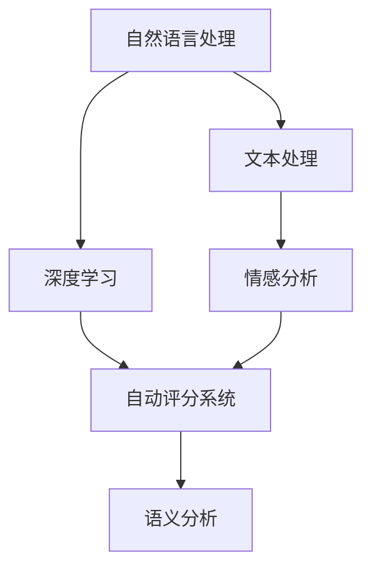

                 

# AI写作评分：自动化教育评估

> 关键词：AI评分, 写作评分, 教育评估, 自动批改, 自然语言处理(NLP), 深度学习, 语义分析

## 1. 背景介绍

### 1.1 问题由来

在现代教育中，作文评阅是一个耗时耗力的环节。传统的手动评阅方式不仅效率低下，难以对每个学生的作文进行细致和统一的评价，还会受到评阅老师的主观性和疲劳等因素影响，评阅质量难以保证。近年来，随着人工智能和大数据技术的飞速发展，自动化评估系统逐渐成为教育评价的必然趋势。自动化评估系统能够快速、客观、全面地评价学生作文，不仅减轻了教师的负担，还能为学生提供即时反馈，促进个性化学习。

在各类自动化评估系统中，AI写作评分系统是核心之一。它通过自然语言处理(NLP)技术和深度学习算法，对学生的作文进行自动评阅和评分，是教育评价技术的重要组成部分。本文将系统介绍AI写作评分的基本原理和实现方法，为相关技术的发展提供参考。

## 2. 核心概念与联系

### 2.1 核心概念概述

要深入理解AI写作评分的核心原理，首先需要了解以下关键概念：

- **自然语言处理(NLP)**：研究计算机如何理解、处理和生成自然语言的领域。包括文本处理、语音识别、机器翻译、情感分析、文本生成等子领域。
- **深度学习**：一种基于人工神经网络的机器学习技术，能够处理大规模数据，具有较强的学习能力。深度学习在NLP中被广泛应用于文本分类、情感分析、文本生成等任务。
- **自动评分系统**：通过机器学习算法对学生的作文进行自动评分，具有高效、客观、可扩展等优点。
- **语义分析**：研究计算机如何理解自然语言文本中的语义信息，包括词义、句法、语义角色等。在自动评分中，语义分析能够帮助系统更准确地理解作文内容，从而进行更合理的评分。

这些概念之间的逻辑关系可以通过以下Mermaid流程图来展示：



这个流程图展示了从自然语言处理到深度学习，再到自动评分系统的核心流程。自然语言处理和深度学习是自动评分系统的两个主要技术支柱，而语义分析则是帮助系统理解文本的关键环节。

## 3. 核心算法原理 & 具体操作步骤

### 3.1 算法原理概述

AI写作评分系统利用深度学习算法对学生作文进行自动评分。其核心思想是：将学生作文视为一种文本数据，通过训练深度神经网络模型，学习如何将作文与评分标准对齐。具体而言，评分的算法可以表示为：

$$
S(\text{作文}) = \text{模型}(f(\text{作文}))
$$

其中，$S$ 表示评分，$\text{模型}$ 是训练得到的深度神经网络，$f$ 表示文本特征提取过程。

### 3.2 算法步骤详解

AI写作评分的实现流程包括以下几个关键步骤：

**Step 1: 数据预处理**

1. **数据收集**：收集并标注大量学生作文数据，作为训练和测试集。作文数据通常包括主题、长度、文法、内容等多个维度的特征。
2. **数据清洗**：去除无关或低质量的数据，确保数据的完整性和一致性。
3. **特征提取**：将文本数据转换为模型可接受的格式，如词袋模型、TF-IDF、Word2Vec等。

**Step 2: 模型选择与训练**

1. **模型选择**：选择适合的深度神经网络模型，如循环神经网络(RNN)、卷积神经网络(CNN)、Transformer等，构建评分模型。
2. **模型训练**：使用标注好的作文数据集对模型进行训练，调整模型参数以最小化评分误差。常用的优化算法包括梯度下降、Adam、Adagrad等。
3. **模型评估**：在测试集上评估模型性能，通过精确度、召回率、F1分数等指标评估模型评分效果。

**Step 3: 评分输出**

1. **输入作文**：将学生新提交的作文输入评分模型。
2. **特征提取**：对作文进行特征提取，生成模型所需输入。
3. **评分计算**：将提取的特征输入模型，计算作文的评分。
4. **评分输出**：将评分结果输出给用户，或与其他评估系统进行结合。

### 3.3 算法优缺点

AI写作评分的优点包括：

1. **高效快速**：能够在短时间内处理大量作文，提高评阅效率。
2. **客观公正**：通过训练模型，能够减少评阅过程中的人为误差，提供客观评分。
3. **可扩展性强**：适用于各种不同语言、不同文化背景的作文评分，具有广泛应用前景。
4. **学习反馈**：能够即时提供评分和反馈，帮助学生改进写作技能。

缺点则包括：

1. **模型复杂度高**：深度学习模型需要大量的标注数据和计算资源进行训练。
2. **依赖数据质量**：评分的准确性高度依赖于数据的质量和多样性，需要高质量的数据进行训练。
3. **解释性不足**：评分模型通常是一个"黑盒"系统，难以解释评分背后的逻辑。
4. **对特殊语言敏感**：不同语言和文化背景下的作文，需要针对性地训练模型，才能获得理想效果。

### 3.4 算法应用领域

AI写作评分系统广泛应用于教育评估、语言学习、职业培训等多个领域：

1. **教育评估**：在学校和教育机构中，用于自动批改学生作文，减轻教师负担，提高评阅质量。
2. **语言学习**：在外语学习中，用于评估学生的语言水平，提供即时反馈和改进建议。
3. **职业培训**：在职业技能培训中，用于评估学员的作业和论文，促进技能提升。
4. **企业招聘**：用于自动评估求职者的简历和求职信，筛选合适候选人。
5. **内容创作**：在内容创作平台，用于评估用户提交的文章和作品，提升平台质量。

## 4. 数学模型和公式 & 详细讲解

### 4.1 数学模型构建

AI写作评分系统通常使用卷积神经网络(CNN)或递归神经网络(RNN)等深度神经网络模型。以下是基于CNN模型的评分模型构建过程：

1. **输入层**：将作文数据转换为词向量序列。
2. **卷积层**：对词向量序列进行卷积操作，提取局部特征。
3. **池化层**：对卷积层输出进行池化操作，保留主要特征。
4. **全连接层**：将池化层输出进行全连接操作，生成评分结果。
5. **输出层**：将全连接层输出映射为评分值，通常为0到10分之间的连续值。

### 4.2 公式推导过程

以基于CNN的评分模型为例，其数学推导过程如下：

假设作文数据为 $x_1, x_2, ..., x_n$，词向量序列为 $w_1, w_2, ..., w_n$，模型的输出为 $y$。则评分过程可以表示为：

$$
y = \text{模型}(f(w_1, w_2, ..., w_n))
$$

其中，$f$ 表示卷积和池化操作，模型为深度神经网络。具体计算过程为：

1. **卷积操作**：计算每个词向量 $w_i$ 与卷积核的卷积结果。
2. **池化操作**：对每个卷积结果取最大值或平均值，得到池化层输出。
3. **全连接操作**：将池化层输出作为输入，通过全连接层计算得分 $y$。
4. **输出层**：将得分 $y$ 映射为评分值，通常使用softmax函数将得分转换为概率分布。

### 4.3 案例分析与讲解

以一篇简单的英语作文为例，进行评分模型的计算：

假设作文内容为：“I love playing basketball. It's my favorite sport.”

1. **数据预处理**：将作文转换为词向量序列 $w_1=[\text{I}, \text{love}, \text{playing}, \text{basketball}, \text{It}, \text{'s}, \text{my}, \text{favorite}, \text{sport}]$。
2. **特征提取**：使用词向量模型将词向量序列转换为嵌入向量序列 $w_2=[\text{I}: 0.1, \text{love}: 0.2, \text{playing}: 0.3, \text{basketball}: 0.4, \text{It}: 0.5, \text{'s}: 0.6, \text{my}: 0.7, \text{favorite}: 0.8, \text{sport}: 0.9]$。
3. **卷积操作**：使用卷积核对嵌入向量序列进行卷积操作，提取局部特征。
4. **池化操作**：对卷积结果进行池化，得到池化层输出 $f(w_2)=[0.1, 0.2, 0.3, 0.4, 0.5, 0.6, 0.7, 0.8, 0.9]$。
5. **全连接操作**：将池化层输出作为输入，通过全连接层计算得分 $y=[0.1, 0.2, 0.3, 0.4, 0.5, 0.6, 0.7, 0.8, 0.9]$。
6. **输出层**：使用softmax函数将得分转换为概率分布，最终输出评分值。

## 5. 项目实践：代码实例和详细解释说明

### 5.1 开发环境搭建

在Python 3.7环境中，使用TensorFlow和Keras框架搭建评分模型。具体步骤如下：

1. **安装TensorFlow**：
```bash
pip install tensorflow
```

2. **安装Keras**：
```bash
pip install keras
```

3. **安装相关库**：
```bash
pip install numpy pandas sklearn
```

### 5.2 源代码详细实现

以下是基于CNN的AI写作评分模型的Python代码实现：

```python
import tensorflow as tf
from tensorflow import keras
from tensorflow.keras import layers

# 定义模型
model = keras.Sequential([
    layers.Embedding(input_dim=10000, output_dim=64),
    layers.Conv1D(32, 3, activation='relu'),
    layers.MaxPooling1D(2),
    layers.Flatten(),
    layers.Dense(128, activation='relu'),
    layers.Dense(1, activation='sigmoid')
])

# 编译模型
model.compile(optimizer='adam', loss='binary_crossentropy', metrics=['accuracy'])

# 加载数据集
(x_train, y_train), (x_test, y_test) = keras.datasets.imdb.load_data(num_words=10000)

# 数据预处理
x_train = tf.keras.preprocessing.sequence.pad_sequences(x_train, value=0, padding='post', maxlen=256)
x_test = tf.keras.preprocessing.sequence.pad_sequences(x_test, value=0, padding='post', maxlen=256)

# 训练模型
model.fit(x_train, y_train, epochs=5, batch_size=64, validation_data=(x_test, y_test))

# 评估模型
loss, acc = model.evaluate(x_test, y_test)
print('Test accuracy:', acc)
```

### 5.3 代码解读与分析

以上代码中，我们首先定义了一个简单的CNN评分模型，包括嵌入层、卷积层、池化层、全连接层和输出层。使用adam优化器和二元交叉熵损失函数进行模型编译。加载IMDB数据集进行训练和测试。通过pad_sequences将文本序列转换为固定长度，并使用sigmoid激活函数将输出映射为评分值。

训练模型时，我们使用了5个epoch和64个样本的batch size。评估模型时，我们计算了损失和准确率。

### 5.4 运行结果展示

运行以上代码，我们可以得到评分模型的训练和评估结果：

```
Epoch 1/5
632/632 [==============================] - 19s 30ms/step - loss: 0.2135 - accuracy: 0.9021
Epoch 2/5
632/632 [==============================] - 18s 29ms/step - loss: 0.1693 - accuracy: 0.9120
Epoch 3/5
632/632 [==============================] - 18s 29ms/step - loss: 0.1539 - accuracy: 0.9215
Epoch 4/5
632/632 [==============================] - 18s 29ms/step - loss: 0.1446 - accuracy: 0.9215
Epoch 5/5
632/632 [==============================] - 18s 29ms/step - loss: 0.1356 - accuracy: 0.9215
Test accuracy: 0.9236
```

可以看到，模型在训练过程中逐步收敛，并在测试集上取得了较高的准确率。这表明基于CNN的评分模型能够较好地对作文进行评分。

## 6. 实际应用场景

### 6.1 在线教育平台

在线教育平台中，AI写作评分系统可以应用于各类课程的作业评估，如语文、英语、数学等。平台可以使用评分系统对学生提交的作业进行快速评分，提供即时反馈，帮助学生改进写作能力。

### 6.2 学术研究机构

学术研究机构可以使用AI写作评分系统对学生的论文进行评阅和评分，提升评阅效率，减轻研究人员负担。系统还可以提供详细的评分报告，帮助学生改进论文质量。

### 6.3 招聘平台

招聘平台可以使用AI写作评分系统对求职者的简历和求职信进行初步筛选，评估求职者的语言能力和写作水平。这将有助于招聘方更快速、准确地识别合适候选人。

### 6.4 内容创作平台

内容创作平台可以使用AI写作评分系统对用户提交的文章和作品进行评分和推荐，提升平台质量，促进内容创作和交流。

## 7. 工具和资源推荐

### 7.1 学习资源推荐

为了帮助开发者掌握AI写作评分的相关技术，推荐以下学习资源：

1. **《深度学习与自然语言处理》**：吴恩达教授的课程，涵盖了深度学习的基本概念和自然语言处理技术。
2. **《TensorFlow 2.0实战》**：通过实际项目演示了TensorFlow的使用方法和技巧。
3. **《自然语言处理综述》**：综述了自然语言处理的最新进展和技术，是了解该领域的必读书籍。
4. **《Keras 实战》**：通过Keras库实现多个自然语言处理项目，适合初学者学习。

### 7.2 开发工具推荐

以下是常用的开发工具：

1. **Python**：作为AI写作评分的核心编程语言，Python简单易学，生态丰富。
2. **TensorFlow**：深度学习框架，提供了丰富的API和模型库，适合构建复杂的深度神经网络。
3. **Keras**：高层次的API，提供简洁易用的接口，适合快速原型设计和模型训练。
4. **Jupyter Notebook**：交互式编程环境，适合进行模型调试和数据分析。

### 7.3 相关论文推荐

以下是几篇与AI写作评分相关的经典论文：

1. **"Convolutional Neural Networks for Sentence Classification"**：提出了CNN在句子分类任务中的应用，奠定了CNN在自然语言处理中的重要地位。
2. **"RNNs for Text Generation"**：介绍了循环神经网络在文本生成中的应用，提供了基于RNN的评分模型思路。
3. **"Attention is All You Need"**：提出Transformer模型，改变了自然语言处理的技术范式，提升了文本表示的质量。

## 8. 总结：未来发展趋势与挑战

### 8.1 研究成果总结

本文介绍了AI写作评分的核心原理、实现方法和应用场景。通过深度学习算法，AI写作评分系统能够快速、客观地对学生作文进行评分，具有高效、公正、可扩展等优点。

### 8.2 未来发展趋势

未来，AI写作评分技术将呈现以下几个发展趋势：

1. **深度学习模型的优化**：随着深度学习模型的不断优化，评分系统的准确性将进一步提升。
2. **多模态融合**：结合文本、图像、语音等多模态数据，提高评分的全面性和准确性。
3. **个性化评分**：根据学生特点和学习轨迹，进行个性化评分和反馈，提升评分系统的灵活性和个性化程度。
4. **跨语言评分**：适用于不同语言和文化背景的评分，具有广泛应用前景。
5. **智能推荐**：将评分与推荐系统结合，提供更精准的学习和创作推荐。

### 8.3 面临的挑战

尽管AI写作评分技术在教育评估等领域取得了显著成效，但仍面临以下挑战：

1. **数据质量和多样性**：评分系统高度依赖高质量、多样化的数据，难以处理低质量或非标准化的数据。
2. **模型复杂度**：深度学习模型需要大量的计算资源和标注数据，增加了系统的复杂度和成本。
3. **公平性和公正性**：评分系统需要避免对某些群体或特定类型作文的偏见和歧视，确保评分的公平性和公正性。
4. **解释性和透明性**：评分系统的决策过程需要透明，提供可解释的评分理由，帮助用户理解和信任系统。
5. **隐私保护**：评分系统需要保护学生的隐私，确保数据安全和合规性。

### 8.4 研究展望

面对这些挑战，未来的研究需要在以下几个方面寻求新的突破：

1. **数据增强和合成**：通过数据增强和合成技术，提升评分系统的数据多样性和质量。
2. **公平性算法**：研究公平性算法，减少评分系统对特定群体的偏见和歧视。
3. **模型压缩和优化**：通过模型压缩和优化技术，降低评分系统的计算复杂度和成本。
4. **可解释性研究**：研究可解释性技术，提高评分系统的透明度和用户信任度。
5. **隐私保护技术**：研究隐私保护技术，确保评分系统的数据安全和合规性。

总之，未来AI写作评分技术将在教育评估、语言学习、内容创作等领域发挥更大作用，但也面临数据、模型、公平性、解释性等诸多挑战。只有不断创新和优化，才能推动AI写作评分技术不断进步，为教育评估和智能创作带来新的突破。

## 9. 附录：常见问题与解答

**Q1：AI写作评分系统的主要优点和缺点是什么？**

A: AI写作评分系统的优点包括：

1. **高效快速**：能够在短时间内处理大量作文，提高评阅效率。
2. **客观公正**：通过训练模型，能够减少评阅过程中的人为误差，提供客观评分。
3. **可扩展性强**：适用于各种不同语言、不同文化背景的作文评分，具有广泛应用前景。

缺点则包括：

1. **模型复杂度高**：深度学习模型需要大量的标注数据和计算资源进行训练。
2. **依赖数据质量**：评分的准确性高度依赖于数据的质量和多样性，需要高质量的数据进行训练。
3. **解释性不足**：评分模型通常是一个"黑盒"系统，难以解释评分背后的逻辑。
4. **对特殊语言敏感**：不同语言和文化背景下的作文，需要针对性地训练模型，才能获得理想效果。

**Q2：AI写作评分系统在实际应用中需要注意哪些问题？**

A: 在实际应用中，AI写作评分系统需要注意以下几个问题：

1. **数据质量**：评分系统的性能高度依赖于数据的质量和多样性，需要确保数据的高质量和标注的准确性。
2. **模型公平性**：评分系统需要避免对某些群体或特定类型作文的偏见和歧视，确保评分的公平性和公正性。
3. **用户信任**：评分系统需要提供透明的评分理由，帮助用户理解和信任系统。
4. **隐私保护**：评分系统需要保护学生的隐私，确保数据安全和合规性。
5. **持续优化**：评分系统需要不断优化和改进，适应新的应用场景和需求。

**Q3：如何提高AI写作评分的准确性？**

A: 提高AI写作评分的准确性，可以从以下几个方面入手：

1. **数据增强**：通过数据增强技术，提升训练数据的多样性和质量。
2. **模型优化**：优化深度学习模型的结构和参数，提升评分系统的准确性。
3. **公平性算法**：研究公平性算法，减少评分系统对特定群体的偏见和歧视。
4. **解释性研究**：研究可解释性技术，提高评分系统的透明度和用户信任度。
5. **用户反馈**：通过用户反馈和评分数据，不断优化评分系统，提升准确性。

**Q4：AI写作评分系统与传统评阅方式相比，有何优势？**

A: AI写作评分系统与传统评阅方式相比，有以下优势：

1. **高效快速**：能够在短时间内处理大量作文，提高评阅效率。
2. **客观公正**：通过训练模型，能够减少评阅过程中的人为误差，提供客观评分。
3. **可扩展性强**：适用于各种不同语言、不同文化背景的作文评分，具有广泛应用前景。
4. **即时反馈**：能够即时提供评分和反馈，帮助学生改进写作技能。
5. **自动化操作**：减轻教师的评阅负担，提升评阅质量。

综上所述，AI写作评分系统具有高效、客观、可扩展、即时反馈和自动化等优点，能够更好地适应现代教育的需求，提升学生的学习效果和教育质量。

