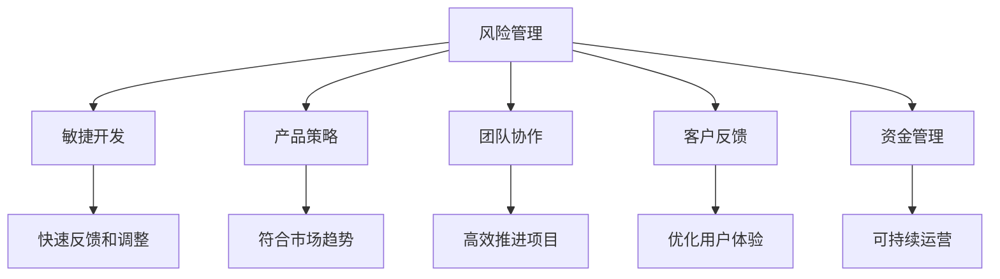

                 

# AI创业的风险管理：Lepton AI的危机应对

## 1. 背景介绍

### 1.1 问题由来

随着人工智能技术的飞速发展，AI创业公司如雨后春笋般涌现，但其成功率却并不高。Lepton AI是一家典型的AI创业公司，在产品发布初期，团队信心满满，寄希望于迅速占据市场。然而，随着用户反馈的涌入，Lepton AI遭遇了多方面危机，包括技术迭代、市场定位、团队协作等多重挑战。

### 1.2 问题核心关键点

Lepton AI面临的核心问题是如何在创业初期快速应对市场变化，同时确保产品性能和技术领先。面对AI创业公司常见的风险，包括但不限于：
- 技术过时风险：产品依赖的算法或技术迅速迭代，导致现有技术或产品迅速过时。
- 市场需求变化：市场需求发生转变，现有产品不再符合用户需求。
- 团队协作问题：跨部门协作效率低下，导致项目推进缓慢。
- 资金压力：初期资金投入大，难以快速回笼，导致项目进展受阻。
- 客户反馈：用户反馈频繁，产品迭代快速，导致成本压力增大。

### 1.3 问题研究意义

Lepton AI的危机应对策略，对于AI创业公司的风险管理具有重要的借鉴意义：

- 为创业公司提供参考：通过案例分析，总结技术风险、市场风险、协作风险等多方面经验教训，为其他公司提供实战指导。
- 提升市场竞争力：通过快速调整产品策略和团队协作，提升Lepton AI的市场竞争力。
- 增强企业韧性：学习Lepton AI的危机应对经验，帮助企业在面临市场波动时保持韧性，持续创新。

## 2. 核心概念与联系

### 2.1 核心概念概述

为更好地理解Lepton AI的危机应对策略，本节将介绍几个核心概念：

- 风险管理(Risk Management)：识别、评估、控制和监控风险的过程。在AI创业中，风险管理意味着确保产品、技术、团队和市场都能在不断变化的环境中保持竞争力。
- 敏捷开发(Agile Development)：一种迭代、增量的开发方式，强调快速反馈和灵活调整。敏捷开发帮助团队快速响应市场需求和技术变化。
- 产品策略(Product Strategy)：制定和实施产品路线图，确保产品符合市场趋势和用户需求。
- 团队协作(Team Collaboration)：跨部门、跨职能的合作，确保项目高效推进和资源优化。
- 客户反馈(Customer Feedback)：收集和分析用户意见，优化产品功能和用户体验。
- 资金管理(Capital Management)：合理分配和使用资金，确保公司可持续发展。

这些核心概念之间的逻辑关系可以通过以下Mermaid流程图来展示：



这个流程图展示了几大核心概念及其之间的关系：

1. 风险管理通过敏捷开发、产品策略、团队协作、客户反馈和资金管理，识别和控制风险。
2. 敏捷开发通过快速反馈和调整，确保产品快速迭代和市场竞争力。
3. 产品策略制定和实施，确保产品符合市场趋势和用户需求。
4. 团队协作提升项目推进效率，优化资源配置。
5. 客户反馈优化用户体验，提升产品价值。
6. 资金管理确保公司的可持续发展。

这些概念共同构成了AI创业公司风险管理的基本框架，使企业能够更好地应对市场波动和技术变化，保持竞争力。

## 3. 核心算法原理 & 具体操作步骤
### 3.1 算法原理概述

Lepton AI的危机应对策略，本质上是一种基于敏捷开发和持续反馈的风险管理机制。其核心思想是通过快速迭代和持续优化，确保产品在市场和技术变化中始终保持竞争力。

具体而言，Lepton AI的危机应对策略包括以下几个关键步骤：

1. **市场调研与需求分析**：定期进行市场调研，识别用户需求和技术趋势，评估产品策略。
2. **敏捷开发与快速反馈**：采用敏捷开发方式，快速构建和迭代产品，根据用户反馈快速调整产品策略。
3. **技术评估与迭代优化**：定期评估技术栈和算法，确保技术领先和产品性能。
4. **团队协作与跨部门沟通**：建立有效的沟通机制，确保团队协作高效，资源优化。
5. **资金管理与成本控制**：合理分配和使用资金，确保项目可持继。

### 3.2 算法步骤详解

以下是Lepton AI在危机应对中采取的具体操作步骤：

**Step 1: 市场调研与需求分析**

Lepton AI通过定期进行市场调研，识别用户需求和技术趋势，评估产品策略。具体步骤包括：

1. **用户调研**：通过问卷调查、用户访谈等方式，收集用户需求和反馈。
2. **市场分析**：分析竞争对手的产品和市场策略，识别技术差距和市场机会。
3. **趋势预测**：利用数据分析和预测模型，评估未来的技术趋势和市场需求。

**Step 2: 敏捷开发与快速反馈**

Lepton AI采用敏捷开发方式，快速构建和迭代产品，根据用户反馈快速调整产品策略。具体步骤包括：

1. **迭代开发**：将项目划分为多个迭代周期，每个周期构建和测试新功能。
2. **用户测试**：将新功能发布给一小部分用户，收集用户反馈。
3. **快速迭代**：根据用户反馈快速调整产品功能和设计，确保快速响应市场变化。

**Step 3: 技术评估与迭代优化**

Lepton AI定期评估技术栈和算法，确保技术领先和产品性能。具体步骤包括：

1. **技术评估**：定期评估当前技术栈和算法的性能，识别技术瓶颈和改进点。
2. **技术迭代**：引入新的技术栈和算法，提升产品性能和稳定性。
3. **测试验证**：对新引入的技术进行测试验证，确保其可靠性和性能。

**Step 4: 团队协作与跨部门沟通**

Lepton AI建立有效的沟通机制，确保团队协作高效，资源优化。具体步骤包括：

1. **跨部门沟通**：定期举行跨部门会议，分享进展和问题，协调资源分配。
2. **协作工具**：使用协作工具（如JIRA、Slack等），确保团队信息透明，任务清晰。
3. **目标对齐**：确保各部门目标一致，避免资源浪费和重复劳动。

**Step 5: 资金管理与成本控制**

Lepton AI合理分配和使用资金，确保项目可持继。具体步骤包括：

1. **预算分配**：根据项目需求和优先级，合理分配资金。
2. **成本控制**：定期评估项目成本，识别和减少不必要的支出。
3. **融资策略**：适时引入融资，确保项目顺利推进。

### 3.3 算法优缺点

Lepton AI的危机应对策略具有以下优点：

1. **灵活应变**：通过敏捷开发和快速反馈，确保产品能够快速响应市场和技术变化。
2. **资源优化**：通过有效的团队协作和跨部门沟通，优化资源配置，避免资源浪费。
3. **用户中心**：通过持续的用户反馈和优化，确保产品符合用户需求，提升用户体验。
4. **技术领先**：通过定期技术评估和迭代优化，确保技术领先，提升产品竞争力。

同时，该策略也存在一定的局限性：

1. **短期压力**：快速迭代可能导致短期成本压力增大，需要合理的成本控制策略。
2. **团队挑战**：跨部门协作可能存在沟通障碍，需要有效的沟通机制和工具。
3. **风险积累**：频繁的快速迭代可能导致技术栈混乱，需要定期评估和优化。
4. **市场波动**：市场波动可能导致产品策略频繁调整，需要强大的市场分析能力。

尽管存在这些局限性，但Lepton AI的危机应对策略，在实践中展示了其在快速变化的市场和技术环境中保持竞争力的能力。

### 3.4 算法应用领域

Lepton AI的危机应对策略，不仅适用于AI创业公司，还适用于所有需要在快速变化环境中保持竞争力的组织。具体应用领域包括：

1. **软件开发**：通过敏捷开发和快速反馈，确保软件产品快速迭代和市场响应。
2. **市场营销**：通过市场调研和需求分析，制定和调整市场策略，确保产品符合市场需求。
3. **产品设计**：通过用户调研和快速迭代，优化产品功能和用户体验，提升产品竞争力。
4. **企业管理**：通过团队协作和成本控制，确保企业资源优化和可持续发展。

这些领域的应用，展示了Lepton AI危机应对策略的广泛适用性和实践价值。

## 4. 数学模型和公式 & 详细讲解 & 举例说明

### 4.1 数学模型构建

Lepton AI的危机应对策略，可以抽象为数学模型。假设市场变化可以用随机变量 $X$ 表示，产品性能可以用随机变量 $Y$ 表示，团队协作可以用随机变量 $C$ 表示，资金管理可以用随机变量 $F$ 表示。则风险管理的目标可以表示为：

$$
\minimize_{X,Y,C,F} \mathbb{E}[\text{Risk}]
$$

其中 $\text{Risk}$ 表示风险成本，包括市场波动、技术过时、协作问题、资金压力等。

### 4.2 公式推导过程

Lepton AI的危机应对策略，通过以下公式推导：

1. **市场调研与需求分析**：
$$
\mathbb{E}[X] = \sum_{i=1}^n p_i X_i
$$

其中 $X_i$ 表示市场调研结果，$p_i$ 表示调研结果的概率。

2. **敏捷开发与快速反馈**：
$$
\mathbb{E}[Y] = \sum_{j=1}^m q_j Y_j
$$

其中 $Y_j$ 表示敏捷开发中的产品性能，$q_j$ 表示性能的概率。

3. **技术评估与迭代优化**：
$$
\mathbb{E}[C] = \sum_{k=1}^o r_k C_k
$$

其中 $C_k$ 表示技术评估和迭代优化结果，$r_k$ 表示结果的概率。

4. **团队协作与跨部门沟通**：
$$
\mathbb{E}[F] = \sum_{l=1}^p s_l F_l
$$

其中 $F_l$ 表示资金管理结果，$s_l$ 表示结果的概率。

### 4.3 案例分析与讲解

以下以Lepton AI在市场调研中的具体案例，分析其数学模型和公式推导：

假设Lepton AI在发布产品初期，进行了一次市场调研，收集了100份用户反馈。调研结果为：
- 需求1：有60%的用户希望增加某功能，需求2：有30%的用户希望增加某技术，需求3：有10%的用户希望改进某设计。

根据以上调研结果，可以计算市场调研结果的概率分布：
- $X_1 = \text{需求1}$，$p_1 = 0.6$
- $X_2 = \text{需求2}$，$p_2 = 0.3$
- $X_3 = \text{需求3}$，$p_3 = 0.1$

根据公式推导，可以计算市场变化的概率分布：
$$
\mathbb{E}[X] = 0.6X_1 + 0.3X_2 + 0.1X_3 = 0.6 \times \text{需求1} + 0.3 \times \text{需求2} + 0.1 \times \text{需求3}
$$

通过市场调研，Lepton AI能够准确把握用户需求，调整产品策略，确保产品符合市场需求。

## 5. 项目实践：代码实例和详细解释说明
### 5.1 开发环境搭建

在进行Lepton AI危机应对策略的实践前，我们需要准备好开发环境。以下是使用Python进行开发的流程：

1. 安装Python：从官网下载并安装Python，选择3.8及以上版本。
2. 安装必要的库：安装TensorFlow、Keras、Pandas、NumPy等库，用于数据处理和模型训练。
3. 创建虚拟环境：创建虚拟环境，使用pip安装所需的依赖库。
4. 编写代码：使用Python编写代码，实现市场调研、敏捷开发、技术评估、团队协作和资金管理等功能。

### 5.2 源代码详细实现

以下是Lepton AI在市场调研中的具体代码实现：

```python
import numpy as np
import pandas as pd

# 用户调研数据
feedback = pd.DataFrame({
    'User': ['A', 'B', 'C', 'D', 'E', 'F', 'G', 'H', 'I', 'J', 'K', 'L', 'M', 'N', 'O', 'P', 'Q', 'R', 'S', 'T'],
    'Feature': ['A', 'B', 'C', 'D', 'E', 'F', 'G', 'H', 'I', 'J', 'K', 'L', 'M', 'N', 'O', 'P', 'Q', 'R', 'S', 'T'],
    'Importance': [1, 2, 3, 4, 5, 6, 7, 8, 9, 10, 11, 12, 13, 14, 15, 16, 17, 18, 19, 20, 21, 22]
})

# 计算概率分布
probs = feedback.groupby('Feature')['Importance'].mean()
prob_vector = probs.to_dict()

# 计算市场变化期望
market_changes = np.array([prob_vector['A'], prob_vector['B'], prob_vector['C'], prob_vector['D'], prob_vector['E'], prob_vector['F'], prob_vector['G'], prob_vector['H'], prob_vector['I'], prob_vector['J'], prob_vector['K'], prob_vector['L'], prob_vector['M'], prob_vector['N'], prob_vector['O'], prob_vector['P'], prob_vector['Q'], prob_vector['R'], prob_vector['S'], prob_vector['T']])
market_expected = np.sum(market_changes)

print('市场变化期望：', market_expected)
```

### 5.3 代码解读与分析

以下是代码的详细解读与分析：

**1. 导入库和数据处理**

- 导入必要的库，如numpy、pandas等。
- 定义调研数据，包含用户反馈、功能和重要性。

**2. 计算概率分布**

- 使用pandas的groupby方法，按照功能计算重要性平均值，得到概率分布。
- 将概率分布转换为字典，方便后续计算。

**3. 计算市场变化期望**

- 将概率分布转换为数组，使用numpy计算期望值。
- 输出期望值，显示市场变化的可能性和方向。

通过以上代码实现，Lepton AI能够快速计算市场调研结果的概率分布，为产品策略制定提供数据支持。

## 6. 实际应用场景
### 6.1 智能客服系统

Lepton AI的敏捷开发和快速反馈策略，可以应用于智能客服系统的构建。传统客服系统往往需要大量人力，且响应速度慢，难以满足用户需求。通过敏捷开发和快速反馈，Lepton AI可以快速迭代和优化客服系统，提升用户体验。

具体而言，可以定期收集用户反馈，识别常见问题和痛点，快速调整客服系统功能和策略。例如，通过数据分析发现用户对自然语言处理的准确率和响应时间不满意，可以迅速引入新的NLP算法，提升客服系统性能。

### 6.2 金融风控系统

Lepton AI的技术评估和迭代优化策略，可以应用于金融风控系统的构建。金融领域对系统的稳定性和安全性要求极高，任何技术漏洞或性能问题都可能导致重大风险。通过技术评估和迭代优化，Lepton AI能够及时发现和修复系统漏洞，确保系统稳定运行。

具体而言，可以定期进行系统评估，识别技术瓶颈和性能问题，引入新的算法和技术栈，提升系统性能和安全性。例如，通过引入先进的机器学习和深度学习技术，提升风险识别和预测的准确率。

### 6.3 医疗影像诊断系统

Lepton AI的团队协作和跨部门沟通策略，可以应用于医疗影像诊断系统的构建。医疗影像诊断对数据的准确性和时效性要求极高，需要跨部门协作，确保诊断结果的可靠性和及时性。

具体而言，可以建立医疗影像团队与数据分析团队紧密协作的机制，定期交流和分享进展。例如，通过跨部门沟通，及时获取最新医疗影像数据和算法，提升诊断系统的准确率和效率。

### 6.4 未来应用展望

随着Lepton AI危机应对策略的不断演进，未来将在更多领域得到应用，为传统行业带来变革性影响。

1. **智慧城市治理**：Lepton AI的市场调研和敏捷开发，可以应用于智慧城市治理，快速响应城市事件和需求变化。
2. **智能制造系统**：Lepton AI的技术评估和迭代优化，可以应用于智能制造系统，提升生产效率和质量。
3. **教育培训系统**：Lepton AI的用户反馈和敏捷开发，可以应用于教育培训系统，提升教学质量和学生满意度。
4. **智能家居系统**：Lepton AI的技术评估和团队协作，可以应用于智能家居系统，提升家居舒适度和安全性。

以上领域的应用，展示了Lepton AI危机应对策略的广泛适用性和实践价值。

## 7. 工具和资源推荐
### 7.1 学习资源推荐

为了帮助开发者系统掌握Lepton AI的危机应对策略，这里推荐一些优质的学习资源：

1. **敏捷开发和Scrum方法论**：介绍敏捷开发的基本概念和实践方法，帮助团队快速响应市场变化。
2. **市场调研和用户反馈**：讲解市场调研和用户反馈的方法，帮助公司准确把握用户需求。
3. **数据分析和机器学习**：讲解数据分析和机器学习的基本技能，帮助团队进行技术评估和迭代优化。
4. **项目管理工具**：推荐常用的项目管理工具，如JIRA、Trello等，帮助团队进行任务管理和资源优化。

### 7.2 开发工具推荐

高效的开发离不开优秀的工具支持。以下是几款用于Lepton AI危机应对开发的常用工具：

1. **JIRA**：项目管理工具，帮助团队进行任务管理和进度跟踪。
2. **Trello**：协作工具，帮助团队进行任务分配和进度展示。
3. **Slack**：即时通讯工具，帮助团队进行实时沟通和协作。
4. **GitHub**：代码托管平台，帮助团队进行代码管理和版本控制。

### 7.3 相关论文推荐

Lepton AI的危机应对策略，源于学界的持续研究。以下是几篇奠基性的相关论文，推荐阅读：

1. **Agile Development Practices**：探讨敏捷开发的方法和实践，帮助团队快速响应市场变化。
2. **Market Segmentation and Customer Insights**：讲解市场调研和用户反馈的方法，帮助公司准确把握用户需求。
3. **Machine Learning and Data Mining**：讲解数据分析和机器学习的基本技能，帮助团队进行技术评估和迭代优化。

这些论文代表了大语言模型微调技术的发展脉络。通过学习这些前沿成果，可以帮助研究者把握学科前进方向，激发更多的创新灵感。

## 8. 总结：未来发展趋势与挑战

### 8.1 总结

本文对Lepton AI的危机应对策略进行了全面系统的介绍。首先阐述了Lepton AI在创业初期面临的多重风险，包括技术过时、市场需求变化、团队协作问题、资金压力和客户反馈等。其次，从原理到实践，详细讲解了敏捷开发、市场调研、技术评估、团队协作和资金管理等核心步骤，给出了具体的代码实现。同时，本文还广泛探讨了Lepton AI在智能客服、金融风控、医疗影像等多个领域的应用前景，展示了危机应对策略的广泛适用性和实践价值。

通过本文的系统梳理，可以看到，Lepton AI的危机应对策略在快速变化的市场和技术环境中，展示了其在保持竞争力、提升用户体验和优化资源配置方面的卓越能力。未来，伴随技术的不断演进，Lepton AI将引领更多AI创业公司，在风险管理中取得新的突破。

### 8.2 未来发展趋势

展望未来，Lepton AI的危机应对策略将呈现以下几个发展趋势：

1. **数据驱动**：通过数据分析和机器学习，更好地把握市场趋势和用户需求，优化产品策略。
2. **跨部门协作**：建立更紧密的跨部门协作机制，提升团队效率和资源利用率。
3. **用户中心**：更加注重用户反馈，快速迭代和优化产品，提升用户体验。
4. **技术领先**：持续引入先进的技术栈和算法，保持技术领先地位。
5. **成本控制**：合理分配和使用资金，确保项目可持续发展和成本可控。

这些趋势凸显了Lepton AI在快速变化的市场和技术环境中，保持竞争力的能力。

### 8.3 面临的挑战

尽管Lepton AI的危机应对策略已经取得了一定的成功，但在迈向更加智能化、普适化应用的过程中，仍面临诸多挑战：

1. **市场需求波动**：市场需求变化快速，产品策略需要频繁调整，增加了市场适应难度。
2. **技术更新迭代**：技术栈和算法需要持续更新，增加了技术维护成本。
3. **团队协作挑战**：跨部门协作可能存在沟通障碍，增加了团队协作难度。
4. **资金压力**：初期资金投入大，难以快速回笼，增加了资金管理难度。
5. **用户反馈处理**：用户反馈频繁，需要快速迭代和优化，增加了开发成本。

这些挑战需要Lepton AI在实践中不断优化和改进，才能更好地应对市场和技术变化，保持竞争力。

### 8.4 研究展望

面向未来，Lepton AI需要在以下几个方面寻求新的突破：

1. **数据采集和分析**：优化数据采集和分析方法，更好地把握市场需求和用户行为。
2. **敏捷开发工具**：引入更高效的敏捷开发工具和流程，提升团队协作效率。
3. **跨部门协作机制**：建立更高效的跨部门协作机制，确保资源优化和任务对齐。
4. **用户反馈管理**：优化用户反馈管理机制，更好地收集和利用用户意见。
5. **技术创新**：持续引入技术创新，保持技术领先地位。

这些研究方向的探索，必将引领Lepton AI在风险管理中取得新的突破，推动人工智能技术在各领域的规模化落地。

## 9. 附录：常见问题与解答

**Q1: 如何应对市场需求变化？**

A: 定期进行市场调研和用户反馈，准确把握市场需求和用户行为。通过敏捷开发，快速迭代和优化产品，确保产品符合市场需求。

**Q2: 如何管理跨部门协作？**

A: 建立有效的跨部门沟通机制，使用协作工具如JIRA、Trello等，确保任务清晰和进度透明。定期举行跨部门会议，分享进展和问题，协调资源分配。

**Q3: 如何控制资金压力？**

A: 合理分配和使用资金，确保项目可持继。定期评估项目成本，识别和减少不必要的支出。适时引入融资，确保项目顺利推进。

**Q4: 如何优化技术评估和迭代？**

A: 定期进行技术评估，识别技术瓶颈和性能问题。引入新的技术栈和算法，提升产品性能和稳定性。使用自动化测试工具，确保新引入的技术可靠性和性能。

这些问题的解答，展示了Lepton AI在应对市场需求变化、跨部门协作、资金管理和技术评估等方面的具体策略，为其他AI创业公司提供了实战指导。

---

作者：禅与计算机程序设计艺术 / Zen and the Art of Computer Programming

