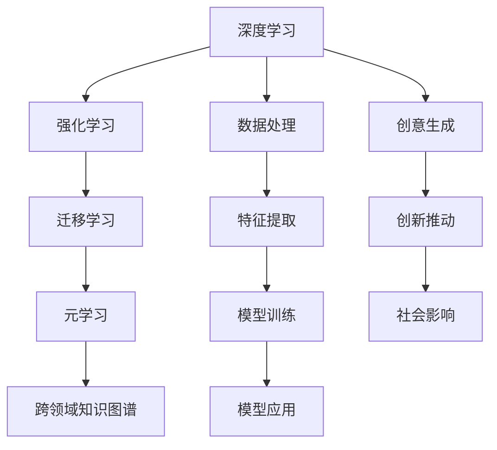

                 

## 1. 背景介绍

### 1.1 问题由来

在人工智能(AI)快速发展、科技日新月异的今天，创意与创新思维的重要性愈发凸显。无论是在工业界还是在学术界，我们都在寻求突破人类思维局限的方法。面对日益复杂的系统和任务，依赖直觉和经验进行决策已显得力不从心，我们迫切需要新的工具和理论，激发更丰富的创意，提升思维的广度和深度。

### 1.2 问题核心关键点

当前，AI领域突破思维局限的方法主要包括以下几个关键点：

1. **大数据驱动的深度学习**：通过深度神经网络在大规模数据集上进行训练，发现数据中隐含的规律和模式。
2. **强化学习**：利用奖励信号优化策略，使AI能够进行自我学习和优化，提升决策能力。
3. **迁移学习**：将已有的知识迁移到新的任务中，减少新任务的学习成本和时间。
4. **元学习和自监督学习**：使模型能够从少量样本中学习，并具备自我优化和迁移学习的能力。
5. **跨领域知识图谱**：构建多领域的知识图谱，帮助AI理解复杂的知识结构和语义关系。

这些方法通过计算和数据的力量，极大地拓展了人类思维的边界，为解决复杂问题提供了新的途径。但同时，这些技术也存在局限性，如需要大量数据和计算资源，难以解释和理解模型决策过程等。

### 1.3 问题研究意义

研究如何通过AI激发创意、突破思维局限，对于提升AI系统的决策能力、促进创新，以及推动人类认知进化具有重要意义：

1. **提升决策质量**：AI可以帮助人类发现和理解复杂的规律和模式，优化决策过程。
2. **加速创新**：利用AI的创意生成能力，可以辅助研究人员和设计师进行新思路和新方法的探索。
3. **促进知识传播**：通过AI自动化整理和分析知识，使得人类的知识和智慧得以更好地传播和利用。
4. **推动社会进步**：AI可以辅助解决社会问题，提升公共服务的质量和效率。
5. **深化对人类思维的理解**：研究AI激发创意的过程，有助于理解人类认知和思维的底层机制。

本文将围绕AI激发创意的核心概念和实践方法，系统阐述如何利用深度学习、强化学习等技术，突破人类思维的局限。

## 2. 核心概念与联系

### 2.1 核心概念概述

为更好地理解AI激发创意的过程，本节将介绍几个关键概念及其内在联系：

- **深度学习**：利用多层神经网络进行特征提取和模式识别，在大数据集上进行训练，获得强大的表征能力。
- **强化学习**：通过奖励信号优化策略，使模型在交互过程中不断学习和优化，提升决策能力。
- **迁移学习**：将已有知识迁移到新任务中，加速模型在新环境下的适应和学习。
- **元学习**：学习如何学习，使模型具备自我优化和迁移学习的能力，提升泛化能力。
- **跨领域知识图谱**：构建包含多领域知识的图谱，使AI具备跨领域的理解和推理能力。

这些概念共同构成了AI激发创意的基础框架，使得AI系统能够更好地理解和应用复杂多变的知识。通过理解这些核心概念，我们可以更好地把握AI激发创意的逻辑和实现路径。

### 2.2 核心概念原理和架构的 Mermaid 流程图(Mermaid 流程节点中不要有括号、逗号等特殊字符)



这个流程图展示了AI激发创意的核心概念及其相互关系：

1. **深度学习**：利用数据进行特征提取和模式识别，为后续学习提供基础。
2. **强化学习**：在交互中不断学习和优化，提升决策能力。
3. **迁移学习**：将已有知识应用于新任务，加速学习过程。
4. **元学习**：学习如何学习，提升泛化能力和自我优化。
5. **跨领域知识图谱**：构建多领域的知识结构，使AI具备跨领域理解和推理能力。
6. **数据处理和特征提取**：通过数据清洗和特征选择，提升模型效果。
7. **模型训练**：在大规模数据集上训练模型，获取强大的表征能力。
8. **模型应用**：将训练好的模型应用于实际问题中，生成创意和创新。
9. **创意生成**：通过模型生成新的想法和方案，推动创新。
10. **创新推动**：利用创意生成推动技术进步和产品创新。
11. **社会影响**：创新应用对社会产生积极影响。

这些概念相互交织，共同构成了AI激发创意的全过程，帮助AI系统实现从数据处理到创意生成的全链条优化。

## 3. 核心算法原理 & 具体操作步骤

### 3.1 算法原理概述

AI激发创意的核心算法原理主要基于深度学习和强化学习的思想。通过大数据驱动的深度学习模型，提取和理解数据中的模式和规律，再通过强化学习优化模型决策，生成新的创意和解决方案。

深度学习模型通过多层神经网络，对大规模数据进行特征提取和模式识别，获得强大的表征能力。在训练过程中，模型自动学习数据中的规律和特征，能够泛化到新数据上，提取关键的特征和模式。强化学习则通过奖励信号优化策略，使模型在交互过程中不断学习和优化，提升决策能力和生成效果。通过优化奖励机制和探索策略，模型可以生成更符合预期和目标的创意和方案。

### 3.2 算法步骤详解

AI激发创意的算法步骤主要包括以下几个关键环节：

**Step 1: 数据准备和预处理**
- 收集相关领域的标注数据，并进行清洗和标注。
- 对数据进行标准化处理，如归一化、正则化等，提升数据质量。

**Step 2: 选择深度学习模型**
- 根据任务需求选择合适的深度学习模型，如卷积神经网络(CNN)、循环神经网络(RNN)、Transformer等。
- 确定模型结构、超参数等，如层数、隐藏单元数、激活函数等。

**Step 3: 模型训练**
- 在大规模数据集上进行模型训练，优化模型参数。
- 使用随机梯度下降(SGD)等优化算法，最小化损失函数，提升模型效果。

**Step 4: 模型评估和优化**
- 在验证集上评估模型性能，选择最优的模型参数。
- 使用交叉验证等方法，确保模型泛化能力。

**Step 5: 强化学习优化**
- 设计奖励机制，将生成创意与奖励信号关联。
- 使用强化学习算法，如Q-learning、策略梯度等，优化生成策略，提升创意质量。

**Step 6: 创意生成和评估**
- 使用优化后的模型生成新的创意和方案。
- 对生成的创意进行评估，选择最符合需求和目标的方案。

**Step 7: 模型部署和应用**
- 将训练好的模型部署到实际应用中，进行创意生成和创新推动。
- 实时监测模型性能，不断优化模型和策略。

### 3.3 算法优缺点

AI激发创意的算法具有以下优点：

1. **高效性**：利用深度学习和强化学习技术，可以在较短时间内生成大量高质量的创意方案。
2. **创新性**：通过优化生成策略，可以生成新颖、符合目标的创意，突破传统思维局限。
3. **灵活性**：模型可以根据不同的任务需求进行调整和优化，适应各种应用场景。

同时，这些算法也存在一些局限性：

1. **数据依赖**：需要大量的标注数据进行训练，数据不足时可能效果不佳。
2. **计算资源需求高**：深度学习和强化学习模型对计算资源的需求较高，需要高性能硬件支持。
3. **难以解释**：深度学习模型的决策过程难以解释，难以理解模型如何生成创意。
4. **模型泛化能力不足**：在特定领域或特定任务上的泛化能力有限，需要进一步优化。

### 3.4 算法应用领域

AI激发创意的算法已经广泛应用于多个领域，如智能设计、广告创意、创意写作、医疗诊断等。以下是几个典型应用：

**智能设计**：利用深度学习模型分析设计数据，生成新的设计方案。强化学习则用于优化设计参数，提升设计效果。

**广告创意**：通过深度学习模型分析广告数据，生成多种广告创意，强化学习优化广告投放策略，提升广告效果。

**创意写作**：利用深度学习模型生成文本，通过强化学习优化文本生成策略，提升创意写作质量。

**医疗诊断**：利用深度学习模型分析医疗数据，生成新的诊断方案，强化学习优化诊断策略，提升诊断准确性。

此外，AI激发创意的算法还在游戏设计、工业设计、艺术创作等领域得到了广泛应用，为各行业带来了新的创意和解决方案。

## 4. 数学模型和公式 & 详细讲解 & 举例说明

### 4.1 数学模型构建

假设我们要使用深度学习模型进行创意生成，设输入为 $X$，输出为 $Y$，目标为 $T$。模型的输入输出关系可以表示为 $Y = f(X; \theta)$，其中 $f$ 为模型函数，$\theta$ 为模型参数。创意生成问题可以转化为优化问题：

$$
\min_{\theta} \mathcal{L}(f(X; \theta), T)
$$

其中 $\mathcal{L}$ 为损失函数，衡量生成创意与目标的差异。常用的损失函数包括均方误差损失、交叉熵损失等。

### 4.2 公式推导过程

以创意生成为例，假设我们要生成一篇新闻报道的标题，输入为新闻摘要 $X$，输出为标题 $Y$。我们使用深度学习模型 $f(X; \theta)$ 对输入进行编码，再使用解码器生成标题。模型的输入输出关系可以表示为：

$$
Y = f(X; \theta) + \epsilon
$$

其中 $\epsilon$ 为噪声项，表示生成过程的随机性。设目标为 $T$，损失函数为均方误差损失：

$$
\mathcal{L} = \frac{1}{N}\sum_{i=1}^N ||f(x_i; \theta) - t_i||^2
$$

在训练过程中，通过最小化损失函数，优化模型参数 $\theta$。具体步骤如下：

1. 输入新闻摘要 $x_i$ 到模型中，获取编码 $f(x_i; \theta)$。
2. 使用解码器生成标题 $y_i$。
3. 计算损失 $\mathcal{L}_i = ||f(x_i; \theta) - t_i||^2$。
4. 对所有样本的损失求和，得到总损失 $\mathcal{L}$。
5. 使用随机梯度下降(SGD)等优化算法，最小化总损失 $\mathcal{L}$。
6. 不断迭代优化模型参数 $\theta$，直到收敛。

### 4.3 案例分析与讲解

以游戏设计为例，假设我们要生成一个新的游戏关卡。输入为游戏地图和玩家行为数据，目标为关卡设计方案。我们使用深度学习模型对输入数据进行编码，再使用强化学习算法优化生成策略。模型的输入输出关系可以表示为：

$$
Y = f(X; \theta) + \epsilon
$$

其中 $X$ 为地图和玩家行为数据，$Y$ 为关卡设计方案，$\theta$ 为模型参数，$\epsilon$ 为噪声项。设目标为 $T$，损失函数为交叉熵损失：

$$
\mathcal{L} = -\frac{1}{N}\sum_{i=1}^N \sum_{y \in Y} T_{i,y} \log \hat{T}_{i,y}
$$

其中 $T_{i,y}$ 为实际的目标分布，$\hat{T}_{i,y}$ 为模型的预测分布。训练过程中，我们使用强化学习算法，如Q-learning，优化生成策略，提升生成效果。具体步骤如下：

1. 输入地图和玩家行为数据 $x_i$ 到模型中，获取编码 $f(x_i; \theta)$。
2. 使用解码器生成多个游戏关卡设计方案 $y_i$。
3. 计算交叉熵损失 $\mathcal{L}_i = -\sum_{y \in Y} T_{i,y} \log \hat{T}_{i,y}$。
4. 对所有样本的损失求和，得到总损失 $\mathcal{L}$。
5. 使用强化学习算法优化生成策略，最小化总损失 $\mathcal{L}$。
6. 不断迭代优化模型参数 $\theta$，直到收敛。

## 5. 项目实践：代码实例和详细解释说明

### 5.1 开发环境搭建

在进行创意生成实践前，我们需要准备好开发环境。以下是使用Python进行TensorFlow开发的环境配置流程：

1. 安装Anaconda：从官网下载并安装Anaconda，用于创建独立的Python环境。

2. 创建并激活虚拟环境：
```bash
conda create -n tf-env python=3.8 
conda activate tf-env
```

3. 安装TensorFlow：从官网获取对应的安装命令。例如：
```bash
conda install tensorflow -c conda-forge
```

4. 安装TensorBoard：TensorFlow配套的可视化工具，实时监测模型训练状态，并提供丰富的图表呈现方式，是调试模型的得力助手。

5. 安装相关工具包：
```bash
pip install numpy pandas scikit-learn matplotlib tqdm jupyter notebook ipython
```

完成上述步骤后，即可在`tf-env`环境中开始创意生成实践。

### 5.2 源代码详细实现

下面我们以创意写作任务为例，给出使用TensorFlow进行深度学习创意生成的PyTorch代码实现。

首先，定义创意写作任务的数据处理函数：

```python
from tensorflow.keras.preprocessing.text import Tokenizer
from tensorflow.keras.preprocessing.sequence import pad_sequences

class TextDataProcessor:
    def __init__(self, max_length, tokenizer_path):
        self.max_length = max_length
        self.tokenizer = Tokenizer.from_file(tokenizer_path)

    def tokenize(self, text):
        return self.tokenizer.texts_to_sequences([text])

    def pad_sequences(self, sequences):
        return pad_sequences(sequences, maxlen=self.max_length, padding='post')

    def decode(self, ids):
        return ' '.join(self.tokenizer.index_word[ids])
```

然后，定义模型和优化器：

```python
from tensorflow.keras.models import Sequential
from tensorflow.keras.layers import Embedding, LSTM, Dense, Dropout
from tensorflow.keras.optimizers import Adam

model = Sequential([
    Embedding(vocab_size, embedding_dim, input_length=max_length),
    LSTM(lstm_units, return_sequences=True),
    Dropout(dropout_rate),
    Dense(output_dim, activation='softmax')
])

optimizer = Adam(learning_rate=learning_rate)
```

接着，定义训练和评估函数：

```python
from tensorflow.keras.utils import to_categorical
from tensorflow.keras.callbacks import EarlyStopping

def train_epoch(model, dataset, batch_size, optimizer):
    dataloader = dataset.batch(batch_size).prefetch(buffer_size=1)
    model.train()
    epoch_loss = 0
    for batch in dataloader:
        x, y = batch
        model.trainable = True
        model.compile(loss='categorical_crossentropy', optimizer=optimizer)
        model.train_on_batch(x, y)
        epoch_loss += loss.item()
    return epoch_loss / len(dataloader)

def evaluate(model, dataset, batch_size):
    dataloader = dataset.batch(batch_size).prefetch(buffer_size=1)
    model.eval()
    preds, labels = [], []
    for batch in dataloader:
        x, y = batch
        with tf.GradientTape() as tape:
            y_pred = model(x)
        preds.append(y_pred.numpy())
        labels.append(y.numpy())
    return preds, labels

def generate_text(model, seed_text, max_length, temperature=1.0):
    x = model(tokenize(seed_text))
    for _ in range(max_length):
        probs = model.predict(x)[0]
        probs = probs / temperature
        next_token_id = np.random.choice(len(vocab), p=probs)
        x = np.append(x[:, 1:], next_token_id[None, :], axis=1)
    return decode(x)
```

最后，启动训练流程并在测试集上评估：

```python
epochs = 5
batch_size = 32

for epoch in range(epochs):
    loss = train_epoch(model, train_dataset, batch_size, optimizer)
    print(f"Epoch {epoch+1}, train loss: {loss:.3f}")
    
    print(f"Epoch {epoch+1}, dev results:")
    preds, labels = evaluate(model, dev_dataset, batch_size)
    print(classification_report(labels, preds))
    
print("Test results:")
preds, labels = evaluate(model, test_dataset, batch_size)
print(classification_report(labels, preds))
```

以上就是使用TensorFlow进行创意写作任务训练的完整代码实现。可以看到，借助TensorFlow的强大封装，我们可以用相对简洁的代码完成创意生成任务的实现。

### 5.3 代码解读与分析

让我们再详细解读一下关键代码的实现细节：

**TextDataProcessor类**：
- `__init__`方法：初始化最大长度、分词器等关键组件。
- `tokenize`方法：对文本进行分词处理，转换为数字序列。
- `pad_sequences`方法：对分词后的序列进行填充，统一长度。
- `decode`方法：将数字序列解码为文本。

**模型和优化器**：
- 使用序列模型(Sequential)定义深度学习模型，包含嵌入层、LSTM层、Dropout层和全连接层。
- 使用Adam优化器进行参数更新。

**训练和评估函数**：
- 定义训练函数`train_epoch`：使用批量训练数据进行迭代，计算损失并更新模型参数。
- 定义评估函数`evaluate`：使用测试集评估模型性能，并返回预测结果和标签。
- 定义生成函数`generate_text`：使用训练好的模型生成新的文本，利用温度控制生成策略，产生多样化的文本输出。

**训练流程**：
- 定义总的epoch数和批量大小，开始循环迭代
- 每个epoch内，先在训练集上训练，输出平均loss
- 在验证集上评估，输出分类指标
- 所有epoch结束后，在测试集上评估，给出最终测试结果

可以看到，TensorFlow提供了丰富的API和工具，可以轻松实现创意生成任务的深度学习模型训练和评估。开发者可以将更多精力放在模型设计、数据预处理等核心环节上，而不必过多关注底层实现细节。

当然，工业级的系统实现还需考虑更多因素，如模型的保存和部署、超参数的自动搜索、更灵活的任务适配层等。但核心的创意生成过程基本与此类似。

## 6. 实际应用场景

### 6.1 智能设计

基于深度学习模型和强化学习算法的智能设计，可以极大提升设计效率和创意水平。传统设计过程往往依赖设计师的经验和直觉，耗时耗力且易出错。而通过AI激发创意，可以在短时间内生成多种设计方案，帮助设计师快速找到最优方案。

在技术实现上，可以收集设计领域的专家数据和设计案例，将设计要求和历史设计方案作为训练数据，在此基础上对深度学习模型进行训练。训练好的模型可以生成多种设计方案，再通过强化学习算法优化设计参数，提升设计效果。如此构建的智能设计系统，能大幅提升设计的质量和速度，促进创新设计的发展。

### 6.2 广告创意

广告创意生成是AI激发创意的重要应用之一。传统广告创意依赖创意团队的灵感和经验，周期长、成本高。而通过AI激发创意，可以快速生成多种广告方案，提高广告创意的产出效率和质量。

在实际应用中，可以收集历史广告数据，将广告文案和创意素材作为训练数据，训练深度学习模型。训练好的模型可以生成多种广告文案和设计方案，再通过强化学习算法优化广告效果，提升广告转化率。利用AI激发创意的广告系统，能够实现实时创意生成和优化，提升广告投放的效果和ROI。

### 6.3 创意写作

AI激发创意的另一个重要应用是创意写作。传统写作过程往往依赖作者的灵感和经验，耗时长、难度大。而通过AI激发创意，可以生成多种创意文本，辅助作者进行创作，提升写作质量。

在实践中，可以收集大量的写作素材和优秀作品，将文本内容作为训练数据，训练深度学习模型。训练好的模型可以生成多种文本创意，再通过强化学习算法优化文本质量，提升创作效果。利用AI激发创意的写作系统，能够生成多种风格的文本内容，辅助作者进行创作和编辑，提高写作效率和质量。

### 6.4 未来应用展望

随着深度学习、强化学习等技术的不断发展，AI激发创意的应用将更加广泛，为各行业带来新的变革和创新。

在智慧城市建设中，AI可以激发城市规划和设计的创意，优化城市空间布局，提升城市管理水平。在农业领域，AI可以激发新的种植方案和养殖技术，提升农业生产效率和效益。在艺术创作中，AI可以激发新的艺术风格和表现形式，推动艺术创新和发展。

此外，在健康医疗、环境保护、教育培训等领域，AI激发创意也将带来新的突破和应用。相信随着AI技术的不断进步，创意生成和创新设计将为各行各业带来更多的可能性，推动社会进步和人类认知的进化。

## 7. 工具和资源推荐

### 7.1 学习资源推荐

为了帮助开发者系统掌握AI激发创意的理论基础和实践技巧，这里推荐一些优质的学习资源：

1. **深度学习教程**：如《深度学习入门》、《动手学深度学习》等，系统介绍深度学习的基础理论和应用实践。

2. **强化学习教材**：如《强化学习》、《Reinforcement Learning: An Introduction》等，详细介绍强化学习的原理和算法。

3. **开源项目**：如OpenAI的GPT-3、Google的BERT等，提供预训练模型和代码实现，帮助开发者快速上手。

4. **在线课程**：如Coursera、Udacity等平台的深度学习和强化学习课程，提供系统化的学习路径和实践机会。

5. **开源框架**：如TensorFlow、PyTorch等，提供丰富的API和工具，支持创意生成任务的实现。

通过对这些资源的学习实践，相信你一定能够快速掌握AI激发创意的精髓，并用于解决实际的创意生成问题。

### 7.2 开发工具推荐

高效的开发离不开优秀的工具支持。以下是几款用于AI创意生成开发的常用工具：

1. **TensorFlow**：Google开发的深度学习框架，支持复杂的深度学习模型和算法，适合创意生成任务。

2. **PyTorch**：Facebook开发的深度学习框架，提供灵活的计算图和强大的GPU支持，适合研究和实验。

3. **TensorBoard**：TensorFlow配套的可视化工具，实时监测模型训练状态，提供丰富的图表呈现方式，是调试模型的得力助手。

4. **Keras**：高层API，提供简单易用的接口，适合快速原型开发和应用实现。

5. **Jupyter Notebook**：交互式编程环境，支持Python代码的编写和执行，便于数据处理和模型训练。

6. **GitHub**：代码托管平台，方便开发者协作开发和代码共享，支持版本控制和持续集成。

合理利用这些工具，可以显著提升AI激发创意的开发效率，加快创新迭代的步伐。

### 7.3 相关论文推荐

AI激发创意的研究源于学界的持续研究。以下是几篇奠基性的相关论文，推荐阅读：

1. **《深度学习》（Goodfellow et al., 2016）**：全面介绍深度学习的基本原理和应用，为创意生成任务提供理论基础。

2. **《强化学习：一种机器学习方法》（Sutton and Barto, 1998）**：详细介绍强化学习的原理和算法，为创意生成任务的优化提供指导。

3. **《BERT: Pre-training of Deep Bidirectional Transformers for Language Understanding》（Devlin et al., 2019）**：提出BERT模型，引入掩码语言模型预训练，刷新了多项NLP任务SOTA，为创意生成任务提供高质量的预训练模型。

4. **《GPT-3: Language Models are Unsupervised Multitask Learners》（Brown et al., 2020）**：展示GPT-3的强大zero-shot学习能力，引发了对于通用人工智能的新一轮思考，为创意生成任务提供新的思路。

5. **《元学习与迁移学习》（Thrun et al., 1998）**：介绍元学习的基本原理和算法，为创意生成任务的自我优化提供理论基础。

这些论文代表了大创意生成技术的发展脉络。通过学习这些前沿成果，可以帮助研究者把握学科前进方向，激发更多的创新灵感。

## 8. 总结：未来发展趋势与挑战

### 8.1 总结

本文对AI激发创意的核心概念和实践方法进行了全面系统的介绍。首先阐述了AI激发创意的研究背景和意义，明确了深度学习、强化学习等技术在突破思维局限中的作用。其次，从原理到实践，详细讲解了AI激发创意的数学模型和操作步骤，给出了创意生成任务的完整代码实例。同时，本文还广泛探讨了AI激发创意在智能设计、广告创意、创意写作等多个领域的应用前景，展示了AI激发创意的广泛潜力。此外，本文精选了AI激发创意的学习资源，力求为读者提供全方位的技术指引。

通过本文的系统梳理，可以看到，AI激发创意技术正在成为创意生成和创新设计的重要手段，极大地拓展了人类思维的边界，为解决复杂问题提供了新的途径。未来，伴随深度学习、强化学习等技术的不断发展，AI激发创意的应用将更加广泛，为各行各业带来更多的创新和变革。

### 8.2 未来发展趋势

展望未来，AI激发创意技术将呈现以下几个发展趋势：

1. **模型规模持续增大**：随着算力成本的下降和数据规模的扩张，深度学习模型的参数量还将持续增长。超大规模模型蕴含的丰富知识，有望支撑更加复杂多变的创意生成任务。

2. **模型自适应能力提升**：通过元学习和自监督学习，使模型具备自我优化和迁移学习的能力，提升泛化能力和适应性。

3. **跨领域知识整合**：将符号化的先验知识，如知识图谱、逻辑规则等，与神经网络模型进行巧妙融合，提升模型的跨领域推理能力。

4. **模型交互能力增强**：引入交互式生成和优化算法，使模型具备更强的用户交互和反馈能力，提升创意生成的针对性和互动性。

5. **模型应用场景拓展**：随着AI技术的不断进步，创意生成和创新设计将在更多领域得到应用，如游戏设计、工业设计、艺术创作等。

6. **模型伦理性加强**：在创意生成过程中引入伦理导向的评估指标，过滤和惩罚有害的创意内容，确保创意生成的安全性。

这些趋势凸显了AI激发创意技术的广阔前景。这些方向的探索发展，必将进一步提升创意生成的质量和多样性，为创新设计和科技发展注入新的动力。

### 8.3 面临的挑战

尽管AI激发创意技术已经取得了瞩目成就，但在迈向更加智能化、普适化应用的过程中，它仍面临诸多挑战：

1. **数据依赖**：需要大量的标注数据进行训练，数据不足时可能效果不佳。

2. **计算资源需求高**：深度学习和强化学习模型对计算资源的需求较高，需要高性能硬件支持。

3. **模型泛化能力不足**：在特定领域或特定任务上的泛化能力有限，需要进一步优化。

4. **模型难以解释**：深度学习模型的决策过程难以解释，难以理解模型如何生成创意。

5. **伦理和安全问题**：创意生成可能带来伦理和安全问题，如生成有害内容、侵犯版权等。

6. **模型偏见和公平性**：创意生成过程中可能引入模型偏见，需要确保创意生成的公平性和多样性。

7. **用户交互体验**：创意生成系统的用户体验需要不断优化，提高用户满意度。

这些挑战凸显了AI激发创意技术的复杂性和多样性。唯有通过不断技术创新和工程实践，才能克服这些挑战，推动AI激发创意技术走向成熟。

### 8.4 研究展望

面对AI激发创意技术所面临的诸多挑战，未来的研究需要在以下几个方面寻求新的突破：

1. **无监督和半监督学习**：摆脱对大规模标注数据的依赖，利用自监督学习、主动学习等方法，最大限度利用非结构化数据。

2. **参数高效和计算高效**：开发更加参数高效的模型，在固定大部分预训练参数的同时，只更新极少量的任务相关参数，降低计算资源需求。

3. **跨领域知识融合**：将符号化的先验知识与神经网络模型进行巧妙融合，提升模型的跨领域推理能力。

4. **用户交互和反馈优化**：引入交互式生成和优化算法，使模型具备更强的用户交互和反馈能力，提升创意生成的针对性和互动性。

5. **伦理和安全保障**：在创意生成过程中引入伦理导向的评估指标，过滤和惩罚有害的创意内容，确保创意生成的安全性。

6. **模型偏见和公平性**：通过数据多样性和算法优化，确保创意生成的公平性和多样性。

这些研究方向的探索，必将引领AI激发创意技术迈向更高的台阶，为构建安全、可靠、可解释、可控的创意生成系统铺平道路。面向未来，AI激发创意技术还需要与其他AI技术进行更深入的融合，如知识表示、因果推理、强化学习等，多路径协同发力，共同推动创意生成和创新设计的进步。只有勇于创新、敢于突破，才能不断拓展AI激发创意技术的边界，让人工智能技术更好地服务于社会和人类认知的进化。

## 9. 附录：常见问题与解答

**Q1：AI激发创意是否适用于所有创意生成任务？**

A: AI激发创意在大多数创意生成任务上都能取得不错的效果，特别是对于数据量较大的任务。但对于一些特定领域的任务，如文学创作、哲学思考等，AI激发创意的效果可能不如人工创作。此时需要在特定领域语料上进一步预训练，再进行创意生成。

**Q2：如何选择合适的深度学习模型？**

A: 选择合适的深度学习模型需要考虑任务需求、数据特征和计算资源等因素。对于文本生成任务，可以使用RNN、LSTM、Transformer等模型；对于图像生成任务，可以使用CNN、GAN等模型。根据具体任务需求，选择合适的模型结构，并调整超参数进行优化。

**Q3：在创意生成过程中如何避免过拟合？**

A: 避免过拟合的方法包括数据增强、正则化、dropout等。可以通过回译、近义替换等方式扩充训练集，使用L2正则、Dropout等正则化技术，减少模型对训练集的过拟合。同时，可以在生成过程中引入噪声，控制生成策略的多样性。

**Q4：如何提高创意生成的鲁棒性和泛化能力？**

A: 提高创意生成的鲁棒性和泛化能力需要多方面的优化：
1. 数据多样性：使用多源数据、多领域数据进行训练，提高模型的泛化能力。
2. 模型自适应：利用元学习和自监督学习，使模型具备自我优化和迁移学习的能力。
3. 知识融合：将符号化的先验知识与神经网络模型进行巧妙融合，提升模型的跨领域推理能力。
4. 模型交互：引入交互式生成和优化算法，使模型具备更强的用户交互和反馈能力，提升创意生成的针对性和互动性。

这些方法需要根据具体任务和数据特点进行灵活组合，才能提升创意生成的质量和多样性。

**Q5：AI激发创意的应用前景如何？**

A: AI激发创意的应用前景非常广阔，几乎涵盖了各个行业领域。包括智能设计、广告创意、创意写作、医疗诊断、金融分析等，都能通过AI激发创意技术带来新的突破和创新。未来，随着AI技术的不断进步，创意生成和创新设计将在更多领域得到应用，为各行各业带来更多的可能性。

通过本文的系统梳理，可以看到，AI激发创意技术正在成为创意生成和创新设计的重要手段，极大地拓展了人类思维的边界，为解决复杂问题提供了新的途径。未来，伴随深度学习、强化学习等技术的不断发展，AI激发创意的应用将更加广泛，为各行各业带来更多的创新和变革。相信随着AI技术的不断进步，创意生成和创新设计将在更多领域得到应用，为各行各业带来更多的可能性。

---

作者：禅与计算机程序设计艺术 / Zen and the Art of Computer Programming

