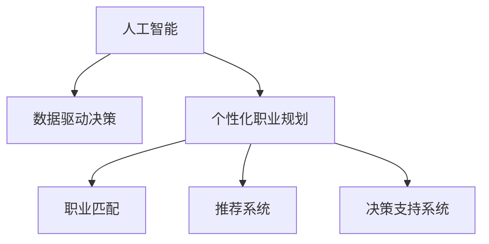

                 

# AI在个性化职业规划中的应用：匹配最佳职业

> 关键词：人工智能,个性化职业规划,职业匹配,推荐系统,数据驱动,决策支持,职业评估,人才发展

## 1. 背景介绍

### 1.1 问题由来

随着社会经济的发展和科技的进步，就业市场不断变化，职业种类和岗位要求也在不断更新。如何帮助求职者找到最适合自己的职业，成为了一个重要而迫切的问题。传统的职业咨询主要依赖个人经验和定性分析，往往难以覆盖广泛的职业选择，也无法提供科学的决策支持。而人工智能（AI）技术的引入，尤其是机器学习、深度学习等技术，为个性化职业规划带来了新的可能性。通过AI，可以基于大量的职业数据和求职者的特征，自动推荐最合适的职业，大幅提升职业匹配的科学性和准确性。

### 1.2 问题核心关键点

AI在个性化职业规划中的核心关键点主要包括：
- **数据驱动决策**：通过收集和分析大量的职业数据，挖掘其中的规律和趋势，帮助求职者做出科学、合理的职业选择。
- **个性化推荐**：利用求职者的背景、兴趣、能力等数据，生成量身定制的职业推荐，提升求职者的匹配度。
- **实时更新**：根据市场动态和求职者的反馈，持续更新职业匹配模型，确保推荐结果的实时性和有效性。
- **决策支持**：不仅提供职业推荐，还结合职业评估、发展路径规划等工具，辅助求职者进行职业决策。

## 2. 核心概念与联系

### 2.1 核心概念概述

为更好地理解AI在个性化职业规划中的应用，本节将介绍几个关键概念：

- **人工智能（AI）**：通过计算机模拟人类智能行为的技术，包括机器学习、深度学习、自然语言处理等。
- **个性化职业规划**：根据求职者的个人背景、兴趣、能力等特征，为其推荐最合适的职业。
- **职业匹配**：通过分析求职者与职业的特性，寻找最合适的匹配关系。
- **推荐系统**：根据用户的历史行为、偏好、社交关系等数据，推荐符合其需求的产品或服务。
- **数据驱动决策**：通过数据分析和挖掘，辅助决策者做出基于事实的判断。
- **决策支持系统（DSS）**：利用AI技术提供数据支持和分析工具，帮助决策者制定和执行决策。

这些概念之间的联系可以通过以下Mermaid流程图来展示：



这个流程图展示了AI技术在个性化职业规划中的主要作用流程：

1. 人工智能作为技术基础，通过数据驱动决策和个性化推荐，辅助求职者进行职业匹配。
2. 决策支持系统结合职业匹配和推荐系统，为求职者提供全方位的职业决策支持。

## 3. 核心算法原理 & 具体操作步骤
### 3.1 算法原理概述

AI在个性化职业规划中的核心算法原理主要基于推荐系统和机器学习。其核心思想是通过分析求职者的历史行为、职业数据和技能特征，构建职业推荐模型，为求职者匹配最合适的职业。

形式化地，假设求职者的特征向量为 $x \in \mathbb{R}^n$，职业库中每个职业的特征向量为 $y \in \mathbb{R}^m$。设 $C: \mathbb{R}^n \times \mathbb{R}^m \rightarrow \mathbb{R}$ 为职业匹配函数，表示求职者特征向量 $x$ 与职业特征向量 $y$ 的匹配度。则个性化职业推荐的优化目标为：

$$
\hat{y} = \mathop{\arg\min}_{y} \| C(x,y) - y \|^2
$$

其中，$y$ 表示推荐职业的特征向量，$\| \cdot \|$ 为欧几里得范数。通过最小化匹配度的平方误差，可以找到一个最优的职业推荐。

### 3.2 算法步骤详解

基于上述算法原理，AI在个性化职业规划中的具体操作步骤主要包括以下几个关键步骤：

**Step 1: 数据准备与特征提取**

- 收集大量的职业数据，包括职位名称、岗位要求、薪资水平、发展前景等。
- 收集求职者的个人信息，如学历、专业、工作经历、技能等。
- 使用自然语言处理（NLP）技术，将职业描述和求职者简历等文本数据转换为结构化特征。

**Step 2: 模型训练与职业匹配**

- 选择适合的机器学习模型，如线性回归、决策树、随机森林等，对求职者的特征和职业特征进行建模。
- 使用交叉验证等技术，优化模型参数，提升模型的准确性和泛化能力。
- 在训练集上训练模型，生成职业匹配函数 $C$，用于计算求职者与每个职业的匹配度。

**Step 3: 推荐系统设计与实现**

- 设计推荐算法，如协同过滤、基于内容的推荐、矩阵分解等，计算求职者与每个职业的匹配度。
- 使用排序算法，如TopK排序、AUC排序等，将匹配度从高到低排序，生成职业推荐列表。
- 根据求职者的反馈，动态调整推荐算法，优化推荐效果。

**Step 4: 决策支持系统集成**

- 将推荐系统与职业评估、发展路径规划等工具集成，形成决策支持系统。
- 使用可视化工具，如仪表盘、报表等，展示推荐结果和职业评估结果。
- 提供交互式接口，支持求职者查询职业信息、反馈推荐结果等操作。

### 3.3 算法优缺点

基于AI的个性化职业规划推荐系统具有以下优点：
1. **高效准确**：利用机器学习算法，可以高效地处理大量数据，提供准确的职业推荐。
2. **个性化定制**：通过分析求职者的个人背景和职业兴趣，生成量身定制的职业推荐。
3. **实时更新**：根据市场变化和求职者反馈，持续优化推荐算法，保持推荐结果的实时性和有效性。
4. **全面支持**：结合职业评估、发展路径规划等工具，为求职者提供全方位的职业决策支持。

同时，该方法也存在以下局限性：
1. **数据依赖**：推荐系统的效果很大程度上依赖于数据的质量和数量，获取高质量数据的成本较高。
2. **模型复杂性**：复杂的机器学习模型可能需要大量的计算资源和时间进行训练和优化。
3. **透明性不足**：推荐系统的决策过程缺乏可解释性，求职者难以理解其内部工作机制和推理逻辑。
4. **潜在偏见**：模型可能继承数据中的偏见和偏差，导致不公平的推荐结果。

尽管存在这些局限性，但就目前而言，AI推荐系统在个性化职业规划中的应用已经取得了显著效果，为求职者提供了科学、合理的职业选择支持。

### 3.4 算法应用领域

基于AI的个性化职业规划推荐系统在多个领域得到了广泛应用，如：

- **招聘平台**：在智联招聘、前程无忧等招聘平台上，利用AI推荐系统帮助求职者找到合适的岗位。
- **企业招聘**：一些大型企业在招聘时，使用AI推荐系统筛选简历，提升招聘效率。
- **职业咨询**：职业咨询服务机构使用AI推荐系统，帮助用户进行职业规划和选择。
- **教育培训**：在线教育平台利用AI推荐系统，推荐适合用户的培训课程和职业发展路径。

## 4. 数学模型和公式 & 详细讲解
### 4.1 数学模型构建

在AI推荐系统中，求职者的特征 $x$ 和职业特征 $y$ 通常为向量形式，表示为 $\mathbf{x} \in \mathbb{R}^n$ 和 $\mathbf{y} \in \mathbb{R}^m$。推荐系统的目标是通过一个映射函数 $f: \mathbb{R}^n \times \mathbb{R}^m \rightarrow \mathbb{R}$，计算求职者与职业的匹配度。

### 4.2 公式推导过程

假设推荐系统的目标函数为 $L(\mathbf{W}, \mathbf{b}) = \frac{1}{2} \sum_{i=1}^N (\mathbf{x}_i^T \mathbf{W} \mathbf{y}_i + \mathbf{b})^2$，其中 $\mathbf{W}$ 和 $\mathbf{b}$ 为模型的参数。则推荐系统的最小化目标为：

$$
\mathop{\min}_{\mathbf{W}, \mathbf{b}} L(\mathbf{W}, \mathbf{b})
$$

通过求解上述最小化问题，可以得到推荐模型的参数 $\mathbf{W}$ 和 $\mathbf{b}$。进一步，可以根据公式 $C(\mathbf{x}, \mathbf{y}) = \mathbf{x}^T \mathbf{W} \mathbf{y} + \mathbf{b}$ 计算求职者与职业的匹配度。

### 4.3 案例分析与讲解

以下以协同过滤算法为例，说明推荐系统的具体实现和应用。

协同过滤算法是一种基于用户行为数据的推荐方法。其核心思想是，相似的用户可能会对相似的物品有相似的偏好。因此，可以根据用户的历史行为数据，找到与当前用户相似的其他用户，并借鉴这些相似用户对物品的评分，预测当前用户对物品的评分。

假设用户集合为 $U$，物品集合为 $I$，用户 $u_i$ 对物品 $i_j$ 的评分矩阵为 $R_{ij}$。设 $\mathbf{x}_i = \sum_{j=1}^{|I|} R_{ij} \mathbf{y}_j$ 为用户 $u_i$ 的偏好向量，$\mathbf{y}_j$ 为物品 $i_j$ 的特征向量。则协同过滤算法的目标是找到一个低秩矩阵分解 $L_{ij} = \mathbf{u}_i^T \mathbf{v}_j$，其中 $\mathbf{u}_i$ 和 $\mathbf{v}_j$ 为低秩矩阵的左右奇异向量。

根据矩阵分解的目标函数 $L = \frac{1}{2} \sum_{i=1}^N \sum_{j=1}^M (R_{ij} - L_{ij})^2$，可以使用奇异值分解（SVD）算法求解。求解后得到的低秩矩阵分解结果，可以用于计算用户 $u_i$ 对物品 $i_j$ 的匹配度 $C_{ij} = \mathbf{u}_i^T \mathbf{v}_j$。

## 5. 项目实践：代码实例和详细解释说明
### 5.1 开发环境搭建

在进行AI职业推荐系统的开发前，我们需要准备好开发环境。以下是使用Python进行Scikit-learn开发的简单环境配置流程：

1. 安装Anaconda：从官网下载并安装Anaconda，用于创建独立的Python环境。

2. 创建并激活虚拟环境：
```bash
conda create -n recommendation-env python=3.8 
conda activate recommendation-env
```

3. 安装Scikit-learn：
```bash
pip install scikit-learn
```

4. 安装pandas、numpy等工具包：
```bash
pip install pandas numpy
```

5. 安装可视化工具：
```bash
pip install matplotlib seaborn
```

完成上述步骤后，即可在`recommendation-env`环境中开始推荐系统的开发。

### 5.2 源代码详细实现

下面我以基于协同过滤算法的AI推荐系统为例，给出使用Scikit-learn库进行开发的PyTorch代码实现。

首先，定义数据集和特征提取函数：

```python
import pandas as pd
from sklearn.feature_extraction.text import TfidfVectorizer
from sklearn.decomposition import TruncatedSVD

def load_data(file_path):
    df = pd.read_csv(file_path)
    return df

def extract_features(df, column_name):
    tfidf = TfidfVectorizer(max_features=2000)
    features = tfidf.fit_transform(df[column_name])
    return features, tfidf
```

然后，定义模型和优化器：

```python
from sklearn.metrics.pairwise import cosine_similarity

def train_model(features, ratings):
    svd = TruncatedSVD(n_components=100, random_state=42)
    ratings_svd = svd.fit_transform(features, ratings)
    cosine_sim = cosine_similarity(ratings_svd, ratings_svd)
    return svd, cosine_sim

def recommend_system(svd, cosine_sim, user_index, items):
    user_index = user_index.item()
    similarities = cosine_sim[user_index]
    similar_user_indices = (-similarities).argsort()[:5]
    recommendations = items[similar_user_indices]
    return recommendations
```

最后，启动推荐流程并在用户端展示推荐结果：

```python
import numpy as np

# 加载数据
data = load_data('job_data.csv')

# 提取特征
features, tfidf = extract_features(data, 'job_description')

# 构建评分矩阵
ratings = pd.DataFrame(data[['user_id', 'job_id', 'rating']])
ratings.columns = ['user_index', 'job_index', 'rating']

# 训练模型
svd, cosine_sim = train_model(features, ratings)

# 用户推荐
user_index = 0  # 假设用户为第一个用户
recommendations = recommend_system(svd, cosine_sim, user_index, ratings['job_index'])

print(f"推荐职位：{recommendations}")
```

以上代码实现了基于协同过滤算法的职业推荐系统的基本功能。可以看到，通过Scikit-learn库，开发者可以相对简单地实现职业推荐算法的构建和训练。

### 5.3 代码解读与分析

让我们再详细解读一下关键代码的实现细节：

**load_data函数**：
- 读取数据集文件，并将其转换为DataFrame格式。

**extract_features函数**：
- 使用TF-IDF算法将文本数据转换为向量形式，并使用TruncatedSVD进行低秩矩阵分解。

**train_model函数**：
- 使用TruncatedSVD进行低秩矩阵分解，并计算用户和物品之间的相似度。

**recommend_system函数**：
- 根据相似度计算，推荐与当前用户最相似的前5个用户所喜欢的职业。

**启动推荐流程**：
- 加载数据集，提取特征，训练模型，并根据用户ID推荐职业。

可以看到，Scikit-learn库在职业推荐系统的开发中提供了丰富的工具和算法支持，使得开发过程变得更加简单高效。

当然，实际应用中还需要考虑更多因素，如数据清洗、特征工程、模型优化等。但核心的算法原理和代码实现基本与此类似。

## 6. 实际应用场景
### 6.1 企业招聘

在企业招聘过程中，利用AI推荐系统可以大幅提升招聘效率和质量。传统的手工筛选简历耗时耗力，且容易产生主观偏见。而AI推荐系统可以自动筛选符合岗位要求的简历，减少人工工作量，提升筛选的客观性和准确性。

具体而言，可以将企业的岗位需求、员工评价等数据导入AI推荐系统，利用协同过滤、基于内容的推荐等算法，推荐出最符合岗位要求的候选人。同时，系统还可以结合职业评估工具，提供候选人的匹配度评分和发展潜力评估，辅助HR进行决策。

### 6.2 职业咨询服务

职业咨询服务机构可以利用AI推荐系统，帮助用户进行职业规划和选择。用户可以输入自己的学历、专业、工作经验、兴趣等信息，系统根据输入数据生成个性化的职业推荐，并结合职业评估和发展路径规划，提供全方位的职业建议。

在实际应用中，可以通过在线平台或移动应用提供AI推荐服务，用户可以通过自然语言输入，获取个性化的职业推荐。此外，系统还可以根据用户的反馈，动态调整推荐算法，提升推荐效果。

### 6.3 教育培训

在线教育平台可以利用AI推荐系统，推荐适合用户的培训课程和职业发展路径。用户可以根据自己的兴趣和需求，输入个人信息，系统生成个性化的课程推荐，并结合职业发展路径规划，提供全面的学习建议。

在实际应用中，可以通过在线课程平台或移动应用提供AI推荐服务，用户可以通过自然语言输入，获取个性化的课程推荐。此外，系统还可以根据用户的反馈，动态调整推荐算法，提升推荐效果。

## 7. 工具和资源推荐
### 7.1 学习资源推荐

为了帮助开发者系统掌握AI在个性化职业规划中的应用，这里推荐一些优质的学习资源：

1. 《Python机器学习》：由机器学习领域知名专家撰写，全面介绍了机器学习的基本概念和常用算法。

2. 《推荐系统实战》：该书详细讲解了推荐系统的设计、实现和优化方法，包含大量的代码实现和案例分析。

3. 《深度学习》课程：斯坦福大学开设的深度学习课程，涵盖深度学习的基本概念和常用算法。

4. Kaggle竞赛：Kaggle平台提供了大量的数据集和竞赛任务，可以帮助开发者练习和提升推荐算法的能力。

5. Coursera课程：Coursera平台提供大量的AI相关课程，涵盖推荐系统、自然语言处理、计算机视觉等多个领域。

通过对这些资源的学习实践，相信你一定能够快速掌握AI在个性化职业规划中的应用方法，并用于解决实际的NLP问题。

### 7.2 开发工具推荐

高效的开发离不开优秀的工具支持。以下是几款用于AI职业推荐系统开发的常用工具：

1. Scikit-learn：基于Python的机器学习库，提供丰富的算法和工具支持。

2. TensorFlow：由Google主导开发的深度学习框架，支持分布式计算和模型优化。

3. PyTorch：由Facebook主导开发的深度学习框架，支持动态计算图和模型优化。

4. Jupyter Notebook：交互式的代码编辑器，支持代码编写、数据可视化等。

5. Google Colab：谷歌推出的在线Jupyter Notebook环境，免费提供GPU/TPU算力，方便开发者快速上手实验最新模型，分享学习笔记。

合理利用这些工具，可以显著提升AI职业推荐系统的开发效率，加快创新迭代的步伐。

### 7.3 相关论文推荐

AI在个性化职业规划中的应用研究源于学界的持续研究。以下是几篇奠基性的相关论文，推荐阅读：

1. 《Collaborative Filtering for Implicit Feedback Datasets》：提出协同过滤算法，解决隐式反馈数据的问题。

2. 《The Bell-Karatzas Decomposition for Collaborative Filtering》：提出矩阵分解算法，用于推荐系统的建模。

3. 《An Empirical Evaluation of Computing Best Practices for Recommender Systems》：总结了推荐系统的经典实验方法，提供了大量实验数据和分析。

4. 《Deep Learning for Recommender Systems: A Survey and Outlook》：综述了深度学习在推荐系统中的应用，涵盖了神经网络和深度学习的基本概念和常用算法。

5. 《A Survey of Collaborative Filtering Technique》：总结了协同过滤算法的发展历程和应用场景，提供了丰富的算法实现和案例分析。

这些论文代表了大语言模型微调技术的发展脉络。通过学习这些前沿成果，可以帮助研究者把握学科前进方向，激发更多的创新灵感。

## 8. 总结：未来发展趋势与挑战
### 8.1 总结

本文对AI在个性化职业规划中的应用进行了全面系统的介绍。首先阐述了AI在个性化职业规划中的背景和意义，明确了AI推荐系统在提高职业匹配效率和准确性方面的独特价值。其次，从原理到实践，详细讲解了AI推荐系统的数学原理和关键步骤，给出了推荐系统开发的基本代码实现。同时，本文还广泛探讨了AI推荐系统在企业招聘、职业咨询、教育培训等多个领域的应用前景，展示了AI推荐系统的广阔应用空间。

通过本文的系统梳理，可以看到，AI推荐系统在个性化职业规划中的应用已经初具规模，为求职者提供了科学、合理的职业选择支持。未来，伴随AI技术的不断演进和算力资源的持续提升，AI推荐系统必将为求职者带来更为精准、个性化的职业匹配体验。

### 8.2 未来发展趋势

展望未来，AI在个性化职业规划中的应用将呈现以下几个发展趋势：

1. **深度学习的应用**：深度学习算法在职业推荐中的应用将不断增加，提升推荐系统的精度和泛化能力。

2. **多模态数据的融合**：结合文本、图像、音频等多种数据模态，提供更加全面和精准的职业推荐。

3. **实时更新和个性化**：根据市场动态和用户反馈，实时更新推荐算法，提供个性化的职业建议。

4. **伦理和安全性的保障**：注重算法公平性和透明度，避免数据偏见和隐私泄露。

5. **联邦学习的应用**：通过联邦学习技术，保护用户隐私的同时，提升推荐系统的效果。

6. **元学习和自适应学习**：通过元学习技术，使推荐系统能够快速适应新数据和新场景。

以上趋势凸显了AI推荐系统的未来发展方向，这些方向的探索发展，必将进一步提升推荐系统的性能和应用范围，为个性化职业规划带来更大的变革。

### 8.3 面临的挑战

尽管AI推荐系统在个性化职业规划中已经取得了显著效果，但在迈向更加智能化、普适化应用的过程中，它仍面临诸多挑战：

1. **数据质量和多样性**：推荐系统的效果很大程度上依赖于数据的质量和多样性，获取高质量数据和处理数据稀疏性的问题亟待解决。

2. **计算资源的限制**：深度学习算法需要大量的计算资源进行训练和优化，如何降低计算成本，提升训练效率，是推荐系统面临的重要挑战。

3. **模型透明性和可解释性**：推荐系统的决策过程缺乏可解释性，难以解释其内部工作机制和推理逻辑。如何赋予推荐系统更强的可解释性，是亟待攻克的难题。

4. **隐私和数据安全**：推荐系统需要处理大量敏感数据，如何保护用户隐私和数据安全，避免数据泄露和滥用，是推荐系统必须重视的问题。

5. **公平性和偏见**：推荐系统可能继承数据中的偏见和偏差，导致不公平的推荐结果。如何消除模型偏见，提升公平性，是推荐系统的重要研究方向。

6. **跨领域应用**：不同领域的推荐系统具有不同的特征和需求，如何构建跨领域的推荐系统，提升其在多场景中的应用效果，是推荐系统的长期目标。

正视推荐系统面临的这些挑战，积极应对并寻求突破，将使其在个性化职业规划中发挥更大的作用。相信随着学界和产业界的共同努力，这些挑战终将一一被克服，AI推荐系统必将在构建人机协同的智能时代中扮演越来越重要的角色。

### 8.4 研究展望

面对AI在个性化职业规划中面临的挑战，未来的研究需要在以下几个方面寻求新的突破：

1. **无监督和半监督学习**：摆脱对大规模标注数据的依赖，利用无监督和半监督学习范式，最大限度利用非结构化数据，实现更加灵活高效的推荐。

2. **元学习和自适应学习**：通过元学习和自适应学习技术，使推荐系统能够快速适应新数据和新场景，提升推荐系统的鲁棒性和泛化能力。

3. **多模态数据的融合**：结合文本、图像、音频等多种数据模态，提供更加全面和精准的职业推荐，提升推荐系统的准确性和实时性。

4. **联邦学习和隐私保护**：利用联邦学习技术，保护用户隐私和数据安全，同时提升推荐系统的效果。

5. **公平性和偏见消除**：开发公平性保障机制，消除数据中的偏见和偏差，提升推荐系统的公平性和可靠性。

这些研究方向的探索，必将引领AI推荐系统走向更高的台阶，为个性化职业规划带来更大的变革。面向未来，AI推荐系统还需要与其他人工智能技术进行更深入的融合，如知识表示、因果推理、强化学习等，多路径协同发力，共同推动职业规划系统的进步。只有勇于创新、敢于突破，才能不断拓展AI推荐系统的边界，让智能技术更好地造福人类社会。

## 9. 附录：常见问题与解答

**Q1：AI推荐系统在职业匹配中是否能够完全替代人工？**

A: AI推荐系统在职业匹配中可以起到重要的辅助作用，但完全替代人工还需要更多技术突破和实际应用中的验证。AI推荐系统在处理大规模数据和提供个性化推荐方面具有优势，但在理解复杂背景、进行深入的职业评估和决策支持方面，仍需要人工的介入和指导。

**Q2：AI推荐系统在实际应用中存在哪些风险？**

A: AI推荐系统在实际应用中可能存在以下风险：
1. 数据隐私风险：处理大量用户数据时，可能存在数据泄露的风险。
2. 模型偏见风险：模型可能继承数据中的偏见和偏差，导致不公平的推荐结果。
3. 推荐失效风险：在数据稀疏、新数据加入时，推荐系统可能失效，无法提供有效推荐。
4. 算法透明性不足：推荐系统的决策过程缺乏可解释性，难以解释其内部工作机制和推理逻辑。

为了应对这些风险，需要在算法设计、数据处理、系统设计等方面进行全面优化和风险管理。

**Q3：如何提升AI推荐系统的透明性和可解释性？**

A: 提升AI推荐系统的透明性和可解释性，可以采取以下措施：
1. 可视化工具：使用可视化工具展示推荐系统的决策过程和中间结果，帮助用户理解推荐结果的来源。
2. 算法透明性：选择合适的算法，使其决策过程透明，易于理解和解释。
3. 用户反馈机制：提供用户反馈机制，收集用户对推荐结果的意见，用于改进推荐算法。
4. 多角度评估：从多个角度评估推荐系统的性能和公平性，确保推荐系统的客观性和可靠性。

**Q4：AI推荐系统在职业规划中如何与企业招聘系统结合？**

A: AI推荐系统在职业规划中可以与企业招聘系统进行结合，具体步骤如下：
1. 收集企业招聘数据，包括岗位要求、员工评价等。
2. 对招聘数据进行预处理，提取特征和评分矩阵。
3. 利用AI推荐算法，生成符合岗位要求的候选人推荐。
4. 结合职业评估工具，提供候选人的匹配度评分和发展潜力评估，辅助HR进行决策。
5. 在企业招聘平台上集成推荐系统，供HR和求职者使用。

通过这些步骤，企业招聘系统可以充分利用AI推荐系统的高效性和精准性，提升招聘效率和质量。

**Q5：AI推荐系统在职业咨询中如何实现个性化推荐？**

A: AI推荐系统在职业咨询中实现个性化推荐，可以通过以下步骤：
1. 收集用户的职业咨询数据，包括学历、专业、工作经验、兴趣等信息。
2. 对用户数据进行预处理，提取特征和评分矩阵。
3. 利用AI推荐算法，生成个性化的职业推荐。
4. 结合职业评估工具，提供个性化的职业建议和发展路径规划。
5. 在职业咨询平台上集成推荐系统，供用户使用。

通过这些步骤，AI推荐系统可以为职业咨询机构提供科学的职业推荐，帮助用户进行职业规划和选择。

---

作者：禅与计算机程序设计艺术 / Zen and the Art of Computer Programming

