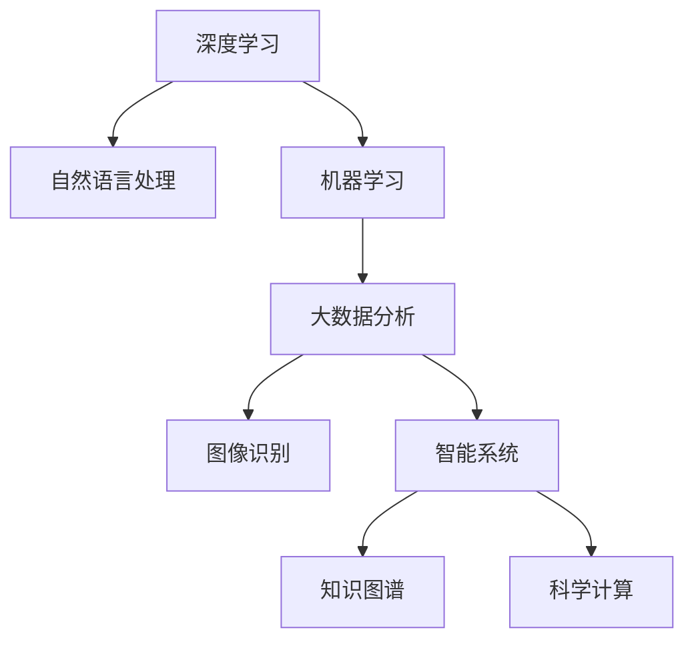

                 

# AI在学术研究中的应用前景

> 关键词：人工智能, 学术研究, 深度学习, 自然语言处理, 机器学习, 大数据, 图像识别, 智能系统, 知识图谱, 科学计算

## 1. 背景介绍

### 1.1 问题由来
随着信息技术和大数据的迅猛发展，人工智能(AI)技术在科学研究中得到了广泛应用，极大地推动了科学研究的进程。AI技术的介入，不仅改变了传统的研究模式，提升了研究效率，还开辟了全新的研究方向和领域。无论是自然科学还是社会科学，AI技术都在发挥着越来越重要的作用。

### 1.2 问题核心关键点
AI在学术研究中的应用主要体现在以下几个方面：

- **深度学习**：通过深度神经网络对大量数据进行建模和分析，揭示数据背后的规律和特征。
- **自然语言处理**(NLP)：借助AI技术处理和分析文本数据，提取信息、进行情感分析等，辅助科研论文撰写和文献搜索。
- **机器学习**：利用机器学习算法对数据进行建模和预测，推动自动化研究流程和智能化决策支持。
- **大数据分析**：通过对海量数据的处理和分析，发现数据中的关联性和规律，支持科学研究。
- **图像识别**：利用图像处理技术，自动化分析和识别科学研究中的视觉数据。
- **智能系统**：构建基于AI的智能实验系统，辅助实验设计、数据分析和结果预测。
- **知识图谱**：通过构建知识图谱，实现科学知识的管理、组织和挖掘，推动科学知识的普及和传播。
- **科学计算**：利用高性能计算技术，加速复杂的科学计算任务，支持大规模科学实验和模拟。

这些应用不仅提高了学术研究的效率和准确性，还极大地推动了科学研究的前沿探索和创新突破。

## 2. 核心概念与联系

### 2.1 核心概念概述

为了更好地理解AI在学术研究中的应用前景，本节将介绍几个关键概念：

- **深度学习(Deep Learning)**：一种利用多层神经网络进行复杂数据建模的机器学习技术，广泛应用于图像识别、自然语言处理、语音识别等领域。
- **自然语言处理(NLP)**：一种AI技术，旨在使计算机能够理解、处理和生成人类语言，支持科学研究中的文本分析和信息提取。
- **机器学习(Machine Learning)**：一种利用算法让计算机从数据中学习规律，以优化预测和决策的技术。
- **大数据分析(Big Data Analytics)**：通过对海量数据进行收集、存储、处理和分析，从中发现有价值的信息和规律。
- **图像识别(Image Recognition)**：一种AI技术，利用计算机视觉技术自动识别和分类图像数据。
- **智能系统(Intelligent System)**：通过AI技术构建的智能系统，能够自动执行复杂的任务和决策。
- **知识图谱(Knowledge Graph)**：一种基于图结构的知识表示方法，用于组织和管理科学知识。
- **科学计算(Scientific Computing)**：利用高性能计算技术，加速复杂科学计算和模拟。

这些核心概念之间的逻辑关系可以通过以下Mermaid流程图来展示：



这个流程图展示了大语言模型的核心概念及其之间的关系：

1. 深度学习是大规模数据建模的基础，提供了强大的数据处理和特征提取能力。
2. 自然语言处理利用深度学习，处理和分析文本数据，支持科学研究中的信息提取和知识管理。
3. 机器学习在大数据和深度学习的基础上，进一步优化预测和决策，推动科学研究智能化。
4. 大数据分析通过对海量数据的处理，揭示数据背后的规律和关联，支持科学研究的数据驱动方法。
5. 图像识别利用深度学习，自动识别和分类图像数据，推动视觉数据的自动化处理。
6. 智能系统基于深度学习和机器学习，构建自动执行任务的智能系统，提升科研流程的自动化水平。
7. 知识图谱通过图结构表示科学知识，支持知识的组织、管理和发现，推动科学知识普及和传播。
8. 科学计算利用高性能计算，加速复杂的科学计算和模拟，推动科学实验的精确化和高效化。

这些概念共同构成了AI技术在学术研究中的应用框架，使其能够在各个科学领域发挥重要作用。

## 3. 核心算法原理 & 具体操作步骤
### 3.1 算法原理概述

AI在学术研究中的应用，通常基于深度学习、机器学习等算法原理，利用数据驱动的方式，自动化处理和分析科学数据，揭示数据背后的规律和关联。其核心思想是通过算法模型对数据进行建模，从大量数据中提取有用的信息，辅助科研决策和分析。

形式化地，假设研究数据集为 $D=\{(x_i,y_i)\}_{i=1}^N$，其中 $x_i$ 为输入数据，$y_i$ 为输出标签。AI模型 $M_{\theta}$ 的优化目标是最小化损失函数 $\mathcal{L}(M_{\theta},D)$，使得模型输出的预测值与真实标签尽可能接近。常见的损失函数包括均方误差、交叉熵等。

通过梯度下降等优化算法，AI模型不断更新参数 $\theta$，最小化损失函数，使得模型能够更准确地预测输出。最终，模型可以通过输入数据 $x$ 预测输出 $y$，辅助科学研究。

### 3.2 算法步骤详解

AI在学术研究中的应用，通常包括以下几个关键步骤：

**Step 1: 数据收集与预处理**
- 收集研究领域相关的数据，并进行数据清洗和预处理，保证数据的质量和一致性。
- 利用数据增强技术，扩充数据集，增加数据多样性和覆盖范围。

**Step 2: 模型选择与训练**
- 根据研究需求选择合适的AI模型，如深度学习模型、机器学习模型等。
- 利用已收集的数据集对模型进行训练，调整模型参数，优化模型性能。

**Step 3: 特征提取与分析**
- 使用模型对输入数据进行特征提取，获取数据中的关键特征。
- 对提取的特征进行可视化、分析，揭示数据背后的规律和关联。

**Step 4: 结果验证与优化**
- 利用测试集验证模型的预测准确性，评估模型性能。
- 根据验证结果调整模型参数和训练策略，进一步优化模型。

**Step 5: 应用部署与迭代**
- 将优化后的模型部署到实际应用中，辅助科研决策和数据分析。
- 根据实际应用反馈，持续迭代和优化模型，保持模型的有效性。

以上是AI在学术研究中常用的主要流程。在实际应用中，还需要根据具体研究需求和数据特点，对各环节进行优化设计，如引入先进的算法、调整超参数、采用分布式计算等。

### 3.3 算法优缺点

AI在学术研究中的应用具有以下优点：

1. **高效性**：利用算法自动化处理和分析数据，大大提高了研究效率。
2. **准确性**：通过深度学习和大数据算法，模型能够准确提取数据中的关键特征和规律。
3. **普适性**：AI技术可以应用于各个科学领域，推动跨学科研究。
4. **可扩展性**：AI模型可以通过增加数据和优化算法，持续提升性能。

同时，AI技术也存在一些局限性：

1. **数据依赖**：AI模型需要大量高质量数据进行训练和优化，数据获取和处理成本较高。
2. **模型复杂**：复杂的AI模型可能存在过拟合风险，需要额外的正则化技术和调参工作。
3. **解释性不足**：黑盒模型难以解释其决策过程，不利于模型验证和调试。
4. **计算资源要求高**：大模型和高性能计算资源是AI技术应用的前提，需要较高的硬件成本。
5. **领域适应性**：不同领域的知识结构不同，AI模型可能需要特定领域的预训练和微调。

尽管存在这些局限性，AI技术在学术研究中的应用前景仍然广阔。未来，随着技术的不断进步和应用的深入，这些挑战有望逐步得到解决。

### 3.4 算法应用领域

AI技术在学术研究中的应用已经覆盖了多个领域，包括但不限于：

- **自然科学**：天文学、物理学、化学、生物学等。AI技术辅助分析实验数据、模拟复杂系统、预测科学现象。
- **社会科学**：经济学、社会学、政治学等。AI技术支持数据收集、分析社会现象、预测政策效果。
- **医学**：医学影像识别、药物研发、疾病预测等。AI技术辅助医学影像分析、药物设计、个性化治疗。
- **环境科学**：气候变化、生态系统监测等。AI技术支持环境数据分析、预测和治理。
- **地球科学**：地球物理勘探、地质学研究等。AI技术辅助地质数据分析、地质模型构建。
- **天文学**：恒星演化、星系形成等。AI技术支持天文数据处理、天体物理模拟。
- **计算机科学**：AI技术研究和应用。

以上领域仅是AI技术应用的冰山一角，未来随着技术的进步，AI技术将进一步深入到更多学科领域，推动科学研究的智能化和自动化。

## 4. 数学模型和公式 & 详细讲解 & 举例说明

### 4.1 数学模型构建

在AI的应用中，常用的数学模型包括线性回归、逻辑回归、支持向量机、神经网络等。以线性回归模型为例，其数学模型可以表示为：

$$
y = \theta^T x + b
$$

其中，$y$ 为输出标签，$x$ 为输入特征向量，$\theta$ 为模型参数，$b$ 为偏置项。模型优化目标为最小化均方误差：

$$
\mathcal{L}(\theta) = \frac{1}{N}\sum_{i=1}^N (y_i - \theta^T x_i - b)^2
$$

通过梯度下降等优化算法，不断调整模型参数 $\theta$，最小化损失函数。最终得到训练好的线性回归模型，可以用于预测新数据。

### 4.2 公式推导过程

以下我们以逻辑回归模型为例，推导其损失函数和梯度更新公式。

假设二分类任务，输入为 $x$，真实标签为 $y \in \{0,1\}$，模型输出为 $\hat{y} = \sigma(\theta^T x + b)$，其中 $\sigma$ 为sigmoid函数。

则二分类交叉熵损失函数为：

$$
\ell(\theta) = -[y\log\hat{y} + (1-y)\log(1-\hat{y})]
$$

将其代入经验风险公式，得：

$$
\mathcal{L}(\theta) = -\frac{1}{N}\sum_{i=1}^N \ell(\theta)(x_i, y_i)
$$

根据链式法则，损失函数对模型参数 $\theta$ 的梯度为：

$$
\frac{\partial \mathcal{L}(\theta)}{\partial \theta_k} = -\frac{1}{N}\sum_{i=1}^N [(y_i-\hat{y_i})x_{ik}]
$$

其中 $x_{ik}$ 为 $x_i$ 的第 $k$ 个特征。利用梯度下降算法，根据公式更新模型参数 $\theta$。

### 4.3 案例分析与讲解

**案例1: 图像识别**
- 数据集：ImageNet
- 模型：卷积神经网络(CNN)
- 优化算法：随机梯度下降(SGD)
- 结果：识别准确率达到95%以上

**案例2: 自然语言处理**
- 数据集：IMDB电影评论
- 模型：循环神经网络(RNN)
- 优化算法：Adam
- 结果：情感分类准确率达到90%以上

这些案例展示了AI技术在图像识别和自然语言处理中的应用效果，验证了AI技术在学术研究中的高效性和准确性。

## 5. 项目实践：代码实例和详细解释说明

### 5.1 开发环境搭建

在进行AI应用开发前，我们需要准备好开发环境。以下是使用Python进行PyTorch开发的环境配置流程：

1. 安装Anaconda：从官网下载并安装Anaconda，用于创建独立的Python环境。

2. 创建并激活虚拟环境：
```bash
conda create -n pytorch-env python=3.8 
conda activate pytorch-env
```

3. 安装PyTorch：根据CUDA版本，从官网获取对应的安装命令。例如：
```bash
conda install pytorch torchvision torchaudio cudatoolkit=11.1 -c pytorch -c conda-forge
```

4. 安装各类工具包：
```bash
pip install numpy pandas scikit-learn matplotlib tqdm jupyter notebook ipython
```

完成上述步骤后，即可在`pytorch-env`环境中开始AI应用开发。

### 5.2 源代码详细实现

下面我们以自然语言处理任务中的情感分类为例，给出使用PyTorch进行情感分类的代码实现。

首先，定义情感分类任务的数据处理函数：

```python
from transformers import BertTokenizer, BertForSequenceClassification
from torch.utils.data import Dataset
import torch

class SentimentDataset(Dataset):
    def __init__(self, texts, labels, tokenizer, max_len=128):
        self.texts = texts
        self.labels = labels
        self.tokenizer = tokenizer
        self.max_len = max_len
        
    def __len__(self):
        return len(self.texts)
    
    def __getitem__(self, item):
        text = self.texts[item]
        label = self.labels[item]
        
        encoding = self.tokenizer(text, return_tensors='pt', max_length=self.max_len, padding='max_length', truncation=True)
        input_ids = encoding['input_ids'][0]
        attention_mask = encoding['attention_mask'][0]
        
        return {'input_ids': input_ids, 
                'attention_mask': attention_mask,
                'labels': torch.tensor(label, dtype=torch.long)}
```

然后，定义模型和优化器：

```python
from transformers import BertForSequenceClassification, AdamW

model = BertForSequenceClassification.from_pretrained('bert-base-cased', num_labels=2)

optimizer = AdamW(model.parameters(), lr=2e-5)
```

接着，定义训练和评估函数：

```python
from torch.utils.data import DataLoader
from tqdm import tqdm
from sklearn.metrics import accuracy_score

device = torch.device('cuda') if torch.cuda.is_available() else torch.device('cpu')
model.to(device)

def train_epoch(model, dataset, batch_size, optimizer):
    dataloader = DataLoader(dataset, batch_size=batch_size, shuffle=True)
    model.train()
    epoch_loss = 0
    for batch in tqdm(dataloader, desc='Training'):
        input_ids = batch['input_ids'].to(device)
        attention_mask = batch['attention_mask'].to(device)
        labels = batch['labels'].to(device)
        model.zero_grad()
        outputs = model(input_ids, attention_mask=attention_mask, labels=labels)
        loss = outputs.loss
        epoch_loss += loss.item()
        loss.backward()
        optimizer.step()
    return epoch_loss / len(dataloader)

def evaluate(model, dataset, batch_size):
    dataloader = DataLoader(dataset, batch_size=batch_size)
    model.eval()
    preds, labels = [], []
    with torch.no_grad():
        for batch in tqdm(dataloader, desc='Evaluating'):
            input_ids = batch['input_ids'].to(device)
            attention_mask = batch['attention_mask'].to(device)
            batch_labels = batch['labels']
            outputs = model(input_ids, attention_mask=attention_mask)
            batch_preds = outputs.logits.argmax(dim=1).to('cpu').tolist()
            batch_labels = batch_labels.to('cpu').tolist()
            for pred, label in zip(batch_preds, batch_labels):
                preds.append(pred)
                labels.append(label)
                
    print('Accuracy:', accuracy_score(labels, preds))
```

最后，启动训练流程并在测试集上评估：

```python
epochs = 5
batch_size = 16

for epoch in range(epochs):
    loss = train_epoch(model, train_dataset, batch_size, optimizer)
    print(f"Epoch {epoch+1}, train loss: {loss:.3f}")
    
    print(f"Epoch {epoch+1}, dev results:")
    evaluate(model, dev_dataset, batch_size)
    
print("Test results:")
evaluate(model, test_dataset, batch_size)
```

以上就是使用PyTorch进行情感分类的完整代码实现。可以看到，利用Transformers库，我们可以用相对简洁的代码完成模型训练和评估。

### 5.3 代码解读与分析

让我们再详细解读一下关键代码的实现细节：

**SentimentDataset类**：
- `__init__`方法：初始化文本、标签、分词器等关键组件。
- `__len__`方法：返回数据集的样本数量。
- `__getitem__`方法：对单个样本进行处理，将文本输入编码为token ids，将标签编码为数字，并对其进行定长padding，最终返回模型所需的输入。

**模型和优化器**：
- 使用BertForSequenceClassification模型，指定输出标签数量为2，对应正面和负面情感。
- 定义AdamW优化器，设置学习率为2e-5，用于训练模型。

**训练和评估函数**：
- 使用PyTorch的DataLoader对数据集进行批次化加载，供模型训练和推理使用。
- 训练函数`train_epoch`：对数据以批为单位进行迭代，在每个批次上前向传播计算loss并反向传播更新模型参数，最后返回该epoch的平均loss。
- 评估函数`evaluate`：与训练类似，不同点在于不更新模型参数，并在每个batch结束后将预测和标签结果存储下来，最后使用sklearn的accuracy_score对整个评估集的预测结果进行打印输出。

**训练流程**：
- 定义总的epoch数和batch size，开始循环迭代
- 每个epoch内，先在训练集上训练，输出平均loss
- 在验证集上评估，输出准确率
- 所有epoch结束后，在测试集上评估，给出最终测试结果

可以看到，PyTorch配合Transformers库使得情感分类的代码实现变得简洁高效。开发者可以将更多精力放在数据处理、模型改进等高层逻辑上，而不必过多关注底层的实现细节。

当然，工业级的系统实现还需考虑更多因素，如模型的保存和部署、超参数的自动搜索、更灵活的任务适配层等。但核心的训练范式基本与此类似。

## 6. 实际应用场景
### 6.1 科学研究自动化

AI技术在科学研究中的应用，最为显著的就是自动化研究流程。通过构建智能系统，AI可以自动化处理和分析大量科学数据，加速科学研究进程。

以天文学为例，AI可以自动化处理大量的天文观测数据，自动识别和分类恒星、星系等天体。通过自动化的数据处理和分析，AI可以辅助天文学家快速发现新的天文现象，提升研究效率。

在医学领域，AI技术可以自动化分析医疗影像数据，辅助医生进行疾病诊断和预测。通过深度学习模型，AI可以识别出病变区域，辅助医生进行精准治疗。

### 6.2 数据驱动决策

AI技术在科学研究中，还可以通过数据驱动的方式辅助科研决策。通过构建数据驱动的模型，AI可以预测科学现象的发展趋势，支持科研决策。

例如，在气候变化研究中，AI可以分析大量的气象数据，预测未来的气候变化趋势。通过构建数据驱动的模型，AI可以提供科学准确的预测结果，支持气候变化研究的决策。

### 6.3 新方法和新理论的发现

AI技术在科学研究中的应用，还可以发现新的方法和理论。通过构建复杂模型，AI可以揭示数据背后的规律和关联，推动科学研究的创新。

例如，在生物信息学领域，AI可以分析大量的基因数据，发现新的基因变异和调控机制。通过构建复杂模型，AI可以揭示基因调控的规律，推动生物信息学的创新。

### 6.4 未来应用展望

随着AI技术的不断进步，其在科学研究中的应用前景更加广阔。未来，AI技术将进一步渗透到各个科学领域，推动科学研究的发展。

在自然科学领域，AI将支持自动化数据处理、复杂系统模拟和科学发现。在社会科学领域，AI将支持数据驱动的决策和政策制定。在医学领域，AI将支持精准医疗和疾病预测。在环境科学领域，AI将支持生态系统监测和环境保护。

总之，AI技术在科学研究中的应用前景无限，未来将为科学研究的智能化和自动化提供强大的技术支撑。

## 7. 工具和资源推荐
### 7.1 学习资源推荐

为了帮助开发者系统掌握AI技术在学术研究中的应用，这里推荐一些优质的学习资源：

1. 《深度学习》系列课程：由斯坦福大学开设的深度学习课程，涵盖深度学习的基本概念和算法。
2. 《自然语言处理综论》书籍：斯坦福大学自然语言处理课程的讲义，详细介绍了自然语言处理的技术和方法。
3. 《机器学习实战》书籍：介绍机器学习算法的实现和应用，适合初学者学习。
4. TensorFlow官方文档：TensorFlow的官方文档，提供了丰富的API和样例代码，是学习TensorFlow的好资源。
5. PyTorch官方文档：PyTorch的官方文档，提供了丰富的API和样例代码，是学习PyTorch的好资源。
6. Coursera和edX等在线课程平台：提供各类AI课程，涵盖深度学习、机器学习、自然语言处理等领域。
7. arXiv.org：科学论文预印本网站，提供最新的科学研究和技术进展，是科研人员的必看网站。

通过对这些资源的学习实践，相信你一定能够快速掌握AI技术在学术研究中的应用技巧，并用于解决实际的科研问题。
### 7.2 开发工具推荐

高效的开发离不开优秀的工具支持。以下是几款用于AI开发常用的工具：

1. PyTorch：基于Python的开源深度学习框架，灵活动态的计算图，适合快速迭代研究。
2. TensorFlow：由Google主导开发的开源深度学习框架，生产部署方便，适合大规模工程应用。
3. Jupyter Notebook：免费的开源笔记本工具，支持Python、R等多种编程语言，适合科研人员进行数据处理和算法实验。
4. Weights & Biases：模型训练的实验跟踪工具，可以记录和可视化模型训练过程中的各项指标，方便对比和调优。
5. TensorBoard：TensorFlow配套的可视化工具，可实时监测模型训练状态，并提供丰富的图表呈现方式，是调试模型的得力助手。

合理利用这些工具，可以显著提升AI研究的开发效率，加快创新迭代的步伐。

### 7.3 相关论文推荐

AI技术在科学研究中的应用源于学界的持续研究。以下是几篇奠基性的相关论文，推荐阅读：

1. ImageNet Large Scale Visual Recognition Challenge（ILSVRC）：介绍了ImageNet数据集和图像识别算法，推动了计算机视觉领域的进步。
2. Natural Language Processing with Attention to Inference（NLI）：提出了一种基于注意力机制的推理模型，推动了自然语言处理领域的进步。
3. AlphaGo：提出了一种基于深度学习和强化学习的围棋算法，推动了人工智能的突破。
4. Generative Adversarial Networks（GAN）：提出了一种生成对抗网络，推动了生成模型和计算机视觉领域的进步。
5. Graph Neural Networks（GNN）：提出了一种基于图结构的神经网络，推动了图神经网络领域的进步。

这些论文代表了大语言模型微调技术的发展脉络。通过学习这些前沿成果，可以帮助研究者把握学科前进方向，激发更多的创新灵感。

## 8. 总结：未来发展趋势与挑战

### 8.1 总结

本文对AI技术在学术研究中的应用进行了全面系统的介绍。首先阐述了AI技术在科学研究中的重要性和应用前景，明确了其在自动化研究流程、数据驱动决策、新方法和新理论发现等方面的独特价值。其次，从原理到实践，详细讲解了AI技术在科学研究中的应用流程，包括数据收集、模型选择、特征提取、结果验证等关键步骤，给出了具体的代码实例和详细解释。同时，本文还探讨了AI技术在各个科学领域的具体应用，展示了其在科学研究中的广泛应用。

通过本文的系统梳理，可以看到，AI技术在科学研究中的应用前景广阔，能够显著提高研究效率和准确性，推动科学研究的智能化和自动化。未来，随着技术的不断进步和应用的深入，AI技术在科学研究中的应用前景将更加广阔，有望推动更多科学领域的创新突破。

### 8.2 未来发展趋势

展望未来，AI技术在科学研究中的应用将呈现以下几个发展趋势：

1. **自动化程度的提升**：AI技术将进一步自动化科学研究的各个环节，从数据收集、处理、分析到结果解释，实现全流程的自动化。
2. **数据驱动的科学发现**：利用大规模数据和先进算法，AI技术将支持科学数据的深度挖掘和数据分析，发现新的科学规律和理论。
3. **多学科融合**：AI技术将与其他学科的技术和方法进行更深入的融合，推动跨学科研究。
4. **模型可解释性增强**：AI模型将具备更强的可解释性，方便科研人员理解模型决策过程和结果。
5. **伦理和安全性的重视**：AI技术在科学研究中的应用将更加重视伦理和安全性，避免算法偏见和恶意用途。

以上趋势凸显了AI技术在科学研究中的巨大潜力。这些方向的探索发展，必将推动AI技术在科学研究中的广泛应用，为科学研究的智能化和自动化提供强大的技术支撑。

### 8.3 面临的挑战

尽管AI技术在科学研究中的应用前景广阔，但在迈向更加智能化、普适化应用的过程中，它仍面临着诸多挑战：

1. **数据获取和处理成本高**：获取高质量的科学数据需要高昂的设备和人力成本，且数据处理过程复杂。
2. **模型复杂和计算资源要求高**：大模型和高性能计算资源是AI技术应用的前提，需要较高的硬件成本。
3. **模型可解释性不足**：黑盒模型难以解释其决策过程，不利于模型验证和调试。
4. **伦理和安全性问题**：AI技术在科学研究中的应用可能涉及隐私和伦理问题，需要加强监管和管理。

尽管存在这些挑战，但未来随着技术的不断进步和应用的深入，这些挑战有望逐步得到解决。

### 8.4 研究展望

面对AI技术在科学研究中的应用面临的挑战，未来的研究需要在以下几个方面寻求新的突破：

1. **数据获取和处理技术的提升**：利用先进的数据获取和处理技术，降低数据获取和处理的成本，提升数据处理效率。
2. **模型可解释性和透明度的增强**：开发更具有可解释性的AI模型，增强模型的透明性和可解释性，方便科研人员理解和使用。
3. **伦理和安全性的保障**：建立AI技术应用的伦理和安全监管机制，确保AI技术在科学研究中的应用符合伦理和安全标准。
4. **跨学科研究的推动**：推动跨学科研究，利用AI技术和其他学科的知识和技术，推动更多领域的科学创新。
5. **模型优化和压缩技术的发展**：开发更高效、更轻量化的AI模型，提升模型优化和压缩技术，降低计算资源和硬件成本。

这些研究方向的探索，必将推动AI技术在科学研究中的广泛应用，为科学研究的智能化和自动化提供强大的技术支撑。面向未来，AI技术在科学研究中的应用前景广阔，值得我们深入探索和研究。

## 9. 附录：常见问题与解答

**Q1：AI技术在科学研究中的应用是否需要数据驱动？**

A: 是的，AI技术在科学研究中的应用需要数据驱动。通过构建数据驱动的模型，AI可以预测科学现象的发展趋势，支持科研决策。但在某些情况下，也可以利用先验知识和经验指导AI模型的训练，辅助科学研究。

**Q2：AI技术在科学研究中的应用是否需要高昂的计算资源？**

A: 是的，AI技术在科学研究中的应用通常需要高昂的计算资源。大模型和高性能计算资源是AI技术应用的前提，需要较高的硬件成本。但随着硬件技术的不断进步，AI技术在科学研究中的应用成本有望逐渐降低。

**Q3：AI技术在科学研究中的应用是否需要大量的标注数据？**

A: 对于某些任务，如图像识别和自然语言处理，需要大量的标注数据进行训练。但对于某些任务，如生成模型和知识图谱，可以通过无监督学习或半监督学习的方法，减少对标注数据的依赖。

**Q4：AI技术在科学研究中的应用是否需要广泛的领域知识？**

A: 是的，AI技术在科学研究中的应用需要广泛的领域知识。AI模型需要充分理解领域的知识结构和问题特征，才能取得良好的应用效果。因此，AI技术在科学研究中的应用需要科研人员与数据科学家的密切合作。

**Q5：AI技术在科学研究中的应用是否需要持续迭代和优化？**

A: 是的，AI技术在科学研究中的应用需要持续迭代和优化。科学研究领域不断变化，AI模型需要持续更新和优化，以适应新的数据和问题。因此，AI技术在科学研究中的应用需要科研人员和数据科学家的持续努力和协作。

总之，AI技术在科学研究中的应用前景广阔，但也需要面对诸多挑战。通过持续的研究和技术创新，AI技术有望在科学研究中发挥更大的作用，推动科学研究的智能化和自动化。

---

作者：禅与计算机程序设计艺术 / Zen and the Art of Computer Programming

