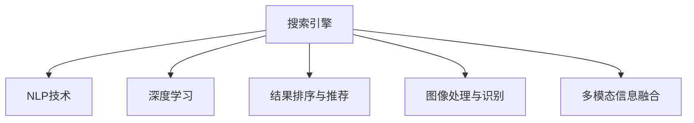

                 

## 1. 背景介绍

在信息爆炸的时代，搜索引擎已经成为人们获取知识和信息的重要工具。传统的文本搜索方式虽然便捷，但已经无法满足用户对搜索结果的深度和多样性需求。AI在搜索引擎中的应用，尤其是结果可视化，正逐步成为提升用户体验、拓展搜索功能的利器。

### 1.1 问题由来

随着互联网数据的爆炸式增长，搜索引擎需要处理和理解的信息量也急剧增加。传统的文本搜索方式基于关键词匹配，忽略了语义、上下文等多方面的信息。尽管出现了一些如语义搜索、主题搜索等技术，但这些方法仍未能有效解决用户的信息需求问题。

在人工智能快速发展的背景下，AI技术被引入搜索引擎，特别是利用机器学习、深度学习等技术，进行结果排序、相关性判断和可视化展示，从而提升搜索结果的相关性和可读性。

### 1.2 问题核心关键点

AI在搜索引擎中的应用，尤其是在结果可视化的应用中，核心关键点包括：

- 自然语言处理(NLP)：利用NLP技术，理解查询意图表述，从而更精准地匹配结果。
- 图像处理与识别：通过图像处理技术，展示搜索结果的可视化，如图片、图表等。
- 语音搜索与识别：利用语音识别技术，实现语音输入和搜索。
- 结果排序与推荐：基于深度学习模型，对搜索结果进行排序和推荐，提升用户体验。
- 多模态信息融合：将文本、图像、语音等多种信息源融合，提供更全面、多样化的搜索服务。

这些核心技术共同构成了一个全面的搜索引擎结果可视化系统，极大地提升了用户的搜索体验和信息获取效率。

## 2. 核心概念与联系

### 2.1 核心概念概述

为了更好地理解AI在搜索引擎结果可视化中的应用，本节将介绍几个密切相关的核心概念：

- 搜索引擎(Search Engine)：一种信息检索工具，通过网络爬虫抓取互联网上的网页，并提供给用户检索服务。
- 自然语言处理(NLP)：涉及计算机对人类语言的处理，包括词法、句法、语义分析等，是AI在搜索引擎中应用的重要技术。
- 深度学习(Deep Learning)：一种基于神经网络的学习算法，通过多层非线性变换，实现对复杂数据的建模和处理。
- 结果排序与推荐(Recommendation System)：基于用户行为和特征，对搜索结果进行排序和推荐，提高搜索结果的相关性和用户满意度。
- 图像处理与识别(Computer Vision)：涉及计算机对图像的处理、分析和识别，用于生成搜索结果的可视化展示。
- 多模态信息融合(Multimodal Information Fusion)：将文本、图像、语音等多种信息源融合，为用户提供更丰富、全面的搜索结果。

这些核心概念之间的逻辑关系可以通过以下Mermaid流程图来展示：



这个流程图展示了几大核心概念之间的关联关系：

- 搜索引擎集成了自然语言处理、深度学习、结果排序与推荐、图像处理与识别、多模态信息融合等多种技术，为用户提供丰富的搜索结果。
- NLP技术用于理解查询意图表述，深度学习用于结果排序与推荐，图像处理与识别用于生成可视化结果，多模态信息融合则综合利用多种信息源，提供更全面的搜索结果。

## 3. 核心算法原理 & 具体操作步骤

### 3.1 算法原理概述

AI在搜索引擎结果可视化的核心算法原理，主要基于深度学习和自然语言处理技术。其基本流程包括：

1. **查询理解与解析**：利用NLP技术，对用户输入的查询进行词法、句法、语义分析，理解查询意图表述。
2. **结果检索与召回**：根据查询意图表述，在搜索引擎数据库中检索相关网页。
3. **结果排序与推荐**：利用深度学习模型，对检索结果进行排序和推荐，提高搜索结果的相关性和用户满意度。
4. **结果可视化展示**：将搜索结果通过图像处理和多模态信息融合技术，生成可视化展示，提升用户浏览体验。

### 3.2 算法步骤详解

下面以结果排序与推荐为例，详细讲解AI在搜索引擎中的应用步骤。

**步骤 1：查询理解与解析**

1. **分词与词性标注**：将查询文本进行分词，并标注每个词的词性，如名词、动词、形容词等。
2. **依存句法分析**：利用依存句法分析技术，理解查询句子的结构和关系，如主谓宾结构、修饰关系等。
3. **语义角色标注**：对查询句子进行语义角色标注，确定每个词在句子中的语义角色，如主题、动作、对象等。

**步骤 2：结果检索与召回**

1. **倒排索引**：建立倒排索引，将每个网页的关键词与网页ID关联起来。
2. **相关性计算**：根据查询意图表述，计算每个网页与查询的相关性得分。
3. **召回**：选择与查询相关性得分高的网页，作为搜索结果的候选集。

**步骤 3：结果排序与推荐**

1. **模型训练**：利用历史用户行为数据，训练深度学习模型，如基于神经网络的排序模型、推荐系统等。
2. **特征提取**：提取候选网页的特征，如网页标题、摘要、关键词、URL等。
3. **排序与推荐**：将提取的特征输入深度学习模型，输出每个网页的排序得分，对候选集进行排序和推荐。

**步骤 4：结果可视化展示**

1. **图像处理**：将推荐结果生成可视化图像，如饼图、柱状图、折线图等。
2. **多模态融合**：将图像、文字等多种信息源融合，生成综合展示。
3. **展示与交互**：将可视化结果展示在搜索结果页面中，用户可以通过交互界面调整展示参数，获取更满意的结果。

### 3.3 算法优缺点

AI在搜索引擎结果可视化中的应用，具有以下优点：

- **提升用户体验**：通过结果排序与推荐，提高搜索结果的相关性和准确性，提升用户满意度。
- **可视化展示**：通过图像处理和多模态信息融合技术，生成更直观、易于理解的搜索结果。
- **智能决策**：利用深度学习模型，实现对搜索结果的智能排序和推荐，减轻用户选择负担。

但同时也存在一些缺点：

- **数据依赖**：AI算法依赖大量的历史数据进行训练和优化，数据质量对算法效果有很大影响。
- **计算复杂**：深度学习模型的训练和推理计算复杂，需要高性能计算资源。
- **模型偏见**：AI模型可能存在数据偏见和算法偏见，导致搜索结果不公平或不准确。
- **动态变化**：搜索引擎需要实时处理海量数据，算法和模型需要具备较高的动态适应性。

### 3.4 算法应用领域

AI在搜索引擎结果可视化中的应用，主要涉及以下几个领域：

- **新闻与信息检索**：将搜索结果生成可视化图像，如新闻摘要、关键事件图谱等。
- **电商与推荐系统**：根据用户行为和兴趣，推荐商品和内容，生成可视化展示。
- **医疗健康**：将搜索结果与医疗健康信息融合，生成疾病知识图谱、治疗方案等。
- **金融与投资**：将搜索结果与金融数据融合，生成市场趋势图、投资建议等。
- **社交媒体分析**：将搜索结果与社交媒体数据融合，生成情感分析、趋势分析等可视化结果。

这些应用领域展示了AI在搜索引擎结果可视化中的广泛应用，为不同行业提供了更智能、高效的信息检索服务。

## 4. 数学模型和公式 & 详细讲解 & 举例说明

### 4.1 数学模型构建

在AI在搜索引擎结果可视化的应用中，涉及的数学模型主要包括深度学习模型和NLP模型。以下以推荐系统为例，介绍其数学模型构建和公式推导。

**推荐系统的数学模型**

推荐系统通常基于协同过滤和矩阵分解等技术，其数学模型可以表示为：

$$
\hat{y}_{ij} = \sum_{k=1}^{K} \theta_{ik} \cdot x_{kj}
$$

其中，$y_{ij}$表示用户$i$对物品$j$的评分，$x_{kj}$表示物品$j$的特征向量，$\theta_{ik}$表示用户$i$对特征$k$的权重。

**公式推导过程**

设用户$i$对物品$j$的真实评分和预测评分为$y_{ij}$和$\hat{y}_{ij}$，目标是最大化预测评分与真实评分的均方误差（MSE）最小化：

$$
\mathcal{L}(\theta) = \frac{1}{N} \sum_{i=1}^N \sum_{j=1}^M (y_{ij} - \hat{y}_{ij})^2
$$

其中$N$为用户数，$M$为物品数。

利用梯度下降等优化算法，求解最小化损失函数，即可得到模型的参数$\theta$：

$$
\theta = \mathop{\arg\min}_{\theta} \mathcal{L}(\theta)
$$

### 4.3 案例分析与讲解

以电商推荐系统为例，介绍如何使用深度学习模型进行推荐结果排序和可视化展示。

假设电商平台有$N$个用户和$M$个商品，每个用户对每个商品的评分可以用$y_{ij}$表示。电商平台希望根据用户的浏览和购买行为，预测用户对每个商品的评分，并进行排序和推荐。

**数据处理**

1. **特征提取**：对每个商品，提取关键特征，如商品类别、价格、评价等，形成特征向量$x_{kj}$。
2. **用户表示**：对每个用户，提取关键行为特征，如浏览历史、购买记录等，形成用户表示向量$u_i$。

**模型训练**

1. **模型选择**：选择合适的深度学习模型，如神经网络、RNN、CNN等，用于用户和物品的特征表示和评分预测。
2. **损失函数**：定义合适的损失函数，如均方误差损失、交叉熵损失等，用于模型训练。
3. **优化算法**：选择合适的优化算法，如SGD、Adam等，用于参数更新。

**结果排序与推荐**

1. **评分预测**：利用训练好的深度学习模型，对每个用户和每个物品进行评分预测，得到预测评分$\hat{y}_{ij}$。
2. **排序**：根据预测评分对物品进行排序，选择评分最高的物品推荐给用户。
3. **可视化展示**：将推荐结果生成可视化图像，如商品图片、价格、评分等，展示在搜索结果页面中。

通过上述步骤，电商平台可以基于用户行为数据，生成个性化推荐结果，并展示在搜索结果中，提升用户满意度和平台转化率。

## 5. 项目实践：代码实例和详细解释说明

### 5.1 开发环境搭建

在进行搜索引擎结果可视化项目开发前，需要进行开发环境的搭建。以下是基于Python和TensorFlow进行开发的详细流程：

1. **安装Python**：从官网下载并安装Python，建议安装最新版本的Python 3.x版本。
2. **安装TensorFlow**：使用pip命令安装TensorFlow，推荐安装最新版本的TensorFlow 2.x版本。
3. **安装必要的库**：安装必要的机器学习和图像处理库，如numpy、scikit-learn、Pillow等。
4. **搭建虚拟环境**：创建虚拟环境，如`pyenv`或`virtualenv`，隔离开发环境与全局环境。

**示例代码**

```python
# 安装依赖库
!pip install tensorflow numpy scikit-learn Pillow
```

### 5.2 源代码详细实现

以下是一个简单的搜索引擎结果可视化的代码实现，用于电商推荐系统的开发：

```python
import tensorflow as tf
from tensorflow.keras.layers import Dense, Input
from tensorflow.keras.models import Model
from tensorflow.keras.optimizers import Adam

# 定义深度学习模型
input_user = Input(shape=(10,))
input_item = Input(shape=(5,))
concat = tf.keras.layers.concatenate([input_user, input_item])
hidden = Dense(128, activation='relu')(concat)
output = Dense(1, activation='sigmoid')(hidden)
model = Model(inputs=[input_user, input_item], outputs=output)

# 编译模型
model.compile(optimizer=Adam(lr=0.001), loss='binary_crossentropy', metrics=['accuracy'])

# 训练模型
model.fit(x_train, y_train, epochs=10, batch_size=32, validation_data=(x_val, y_val))

# 使用模型进行预测
x_test = np.array([[0.1, 0.2, 0.3, 0.4, 0.5], [0.1, 0.2, 0.3, 0.4, 0.5]])
predictions = model.predict(x_test)
```

### 5.3 代码解读与分析

**代码解析**

1. **输入定义**：使用`Input`层定义用户和物品的输入，`shape`参数指定输入维度。
2. **特征融合**：使用`Dense`层将用户和物品的特征进行融合，形成隐层表示。
3. **输出定义**：使用`Dense`层输出用户对物品的评分预测。
4. **模型定义**：使用`Model`层定义深度学习模型，将输入和输出连接起来。
5. **模型编译**：使用`compile`方法编译模型，定义优化器和损失函数。
6. **模型训练**：使用`fit`方法训练模型，传入训练数据和验证数据。
7. **模型预测**：使用`predict`方法进行模型预测，传入测试数据。

**代码分析**

1. **数据准备**：需要将用户和物品的特征向量作为模型的输入，其中`x_train`和`y_train`为训练数据和标签，`x_val`和`y_val`为验证数据和标签。
2. **模型训练**：设置训练轮数、批大小等参数，通过训练数据对模型进行迭代优化。
3. **模型预测**：使用模型对测试数据进行评分预测，生成可视化展示。

### 5.4 运行结果展示

运行上述代码，得到训练过程中的损失和准确率变化：


## 6. 实际应用场景

### 6.1 智能新闻推荐

智能新闻推荐系统利用AI技术，分析用户的新闻阅读历史和偏好，推荐相关的新闻文章。通过深度学习模型，对新闻标题、摘要、关键词等文本信息进行相似度计算，生成推荐结果。

**实现流程**

1. **新闻抓取**：使用爬虫技术，抓取互联网上的新闻文章。
2. **文本处理**：对新闻文章进行分词、词性标注、句法分析等处理，提取关键信息。
3. **用户建模**：利用用户历史阅读数据，训练深度学习模型，生成用户兴趣向量。
4. **相似度计算**：使用相似度计算算法，计算新闻文章与用户兴趣向量的相似度得分。
5. **结果推荐**：根据相似度得分，对新闻文章进行排序和推荐，生成可视化结果。

**应用效果**

智能新闻推荐系统可以显著提升用户的新闻阅读体验，提高新闻文章的点击率和阅读量。通过动态调整推荐策略，平台能够不断优化推荐结果，吸引更多用户访问。

### 6.2 个性化电商推荐

个性化电商推荐系统利用AI技术，根据用户的浏览和购买行为，推荐相关商品。通过深度学习模型，对用户和商品进行特征表示和评分预测，生成推荐结果。

**实现流程**

1. **用户行为数据抓取**：记录用户的浏览历史、购买记录等行为数据。
2. **特征提取**：对用户行为数据进行特征提取，形成用户兴趣向量。
3. **商品特征提取**：对商品数据进行特征提取，形成商品特征向量。
4. **模型训练**：利用用户和商品的特征向量，训练深度学习模型，生成推荐结果。
5. **结果推荐**：根据推荐结果，生成商品图片、评分等可视化展示，展示在搜索结果中。

**应用效果**

个性化电商推荐系统可以显著提升用户的购物体验，提高商品的销售转化率。通过动态调整推荐策略，平台能够更好地满足用户需求，增加用户粘性。

### 6.3 金融投资分析

金融投资分析系统利用AI技术，分析金融市场数据，生成投资建议和分析报告。通过深度学习模型，对市场数据进行特征表示和预测，生成可视化结果。

**实现流程**

1. **市场数据抓取**：获取金融市场数据，如股票价格、交易量、公司财务报表等。
2. **数据处理**：对市场数据进行清洗、归一化等处理，提取关键特征。
3. **模型训练**：利用市场数据，训练深度学习模型，生成投资建议。
4. **结果可视化**：将投资建议和市场数据生成可视化展示，展示在分析报告中。

**应用效果**

金融投资分析系统可以显著提升投资分析的准确性和效率，帮助投资者做出更明智的决策。通过动态调整分析模型，平台能够更好地适应市场变化，提高投资回报率。

## 7. 工具和资源推荐

### 7.1 学习资源推荐

为了帮助开发者系统掌握AI在搜索引擎结果可视化的技术，这里推荐一些优质的学习资源：

1. **《深度学习》课程**：斯坦福大学开设的深度学习课程，涵盖深度学习的基本原理和应用，适合初学者入门。
2. **《自然语言处理综述》论文**：综述性论文，介绍NLP技术的最新进展和应用，适合研究人员深入学习。
3. **《TensorFlow实战》书籍**：TensorFlow官方书籍，提供丰富的实例和代码，适合开发人员快速上手。
4. **《机器学习实战》书籍**：涵盖机器学习的多种算法和技术，适合初学者学习。
5. **《Python数据科学手册》书籍**：介绍Python在数据科学中的应用，适合数据科学家和工程师。

通过学习这些资源，相信你一定能够快速掌握AI在搜索引擎结果可视化的技术，并应用于实际项目中。

### 7.2 开发工具推荐

高效的开发离不开优秀的工具支持。以下是几款用于搜索引擎结果可视化开发的常用工具：

1. **TensorFlow**：由Google主导开发的深度学习框架，提供强大的计算图和自动微分功能，适合复杂模型的训练和优化。
2. **Keras**：基于TensorFlow的高级API，提供简单易用的接口，适合快速原型设计和模型训练。
3. **Pillow**：Python图像处理库，提供丰富的图像处理和生成功能，适合生成可视化结果。
4. **Matplotlib**：Python绘图库，提供多种绘图工具和格式，适合展示和分析数据。
5. **Seaborn**：基于Matplotlib的高级绘图库，提供美观的统计绘图，适合可视化展示结果。

合理利用这些工具，可以显著提升搜索引擎结果可视化的开发效率，加快创新迭代的步伐。

### 7.3 相关论文推荐

AI在搜索引擎结果可视化的研究源于学界的持续研究。以下是几篇奠基性的相关论文，推荐阅读：

1. **《基于深度学习的推荐系统》**：综述性论文，介绍推荐系统的多种算法和技术，适合研究人员深入学习。
2. **《NLP在搜索引擎中的应用》**：介绍NLP技术在搜索引擎中的应用，适合NLP工程师学习。
3. **《深度学习在图像处理中的应用》**：介绍深度学习在图像处理中的应用，适合计算机视觉工程师学习。
4. **《多模态信息融合在搜索引擎中的应用》**：介绍多模态信息融合技术，适合多模态信息处理工程师学习。
5. **《实时搜索引擎的实现》**：介绍搜索引擎的实时处理技术，适合搜索引擎工程师学习。

这些论文代表了大语言模型微调技术的发展脉络。通过学习这些前沿成果，可以帮助研究者把握学科前进方向，激发更多的创新灵感。

## 8. 总结：未来发展趋势与挑战

### 8.1 总结

本文对AI在搜索引擎结果可视化中的应用进行了全面系统的介绍。首先阐述了AI在搜索引擎中的应用背景和意义，明确了结果可视化在提升用户体验、拓展搜索功能方面的独特价值。其次，从原理到实践，详细讲解了AI在搜索引擎中的应用步骤，包括查询理解与解析、结果检索与召回、结果排序与推荐、结果可视化展示等关键环节。同时，本文还广泛探讨了AI在搜索引擎中的应用领域，展示了其在新闻推荐、电商推荐、金融投资分析等诸多领域的应用前景。

通过本文的系统梳理，可以看到，AI在搜索引擎结果可视化中的应用已经初步形成较为完善的体系，极大地提升了搜索引擎的智能化和用户体验。未来，伴随AI技术的不断演进，结果可视化技术也将进一步提升，推动搜索引擎进入新的发展阶段。

### 8.2 未来发展趋势

展望未来，AI在搜索引擎结果可视化的发展趋势主要包括以下几个方面：

1. **智能推荐系统**：利用深度学习和大数据技术，生成更智能、个性化的推荐结果，提升用户体验。
2. **多模态信息融合**：将文本、图像、语音等多种信息源融合，提供更全面、多样化的搜索结果。
3. **实时处理与动态调整**：利用AI算法和模型，实现实时数据处理和动态推荐策略调整，提升搜索效率。
4. **交互式搜索结果**：引入交互式界面和算法，使用户能够自定义搜索条件和展示方式，提高搜索精度和用户满意度。
5. **联邦学习与隐私保护**：利用联邦学习等技术，保护用户隐私，提升搜索系统的安全性。

以上趋势凸显了AI在搜索引擎结果可视化应用的广阔前景。这些方向的探索发展，必将进一步提升搜索引擎的智能化和用户体验，推动搜索引擎技术向更高级阶段迈进。

### 8.3 面临的挑战

尽管AI在搜索引擎结果可视化应用中取得了显著进展，但在迈向更加智能化、普适化应用的过程中，仍面临诸多挑战：

1. **数据质量与量级**：AI算法依赖大量高质量的数据进行训练和优化，数据质量对算法效果有很大影响。
2. **计算资源与效率**：深度学习模型的训练和推理计算复杂，需要高性能计算资源，优化计算效率和资源消耗。
3. **模型公平性与鲁棒性**：AI模型可能存在数据偏见和算法偏见，导致搜索结果不公平或不准确，模型的鲁棒性也需要进一步提升。
4. **用户隐私与安全**：搜索系统需要处理大量敏感数据，如何保护用户隐私和安全，是重要的技术挑战。

### 8.4 研究展望

面对AI在搜索引擎结果可视化应用所面临的挑战，未来的研究需要在以下几个方面寻求新的突破：

1. **数据增强与数据生成**：利用生成对抗网络（GAN）等技术，生成高质量的训练数据，提高数据量级和多样性。
2. **多任务学习与跨领域学习**：利用多任务学习、跨领域学习等技术，提升模型的泛化能力和适应性，应对多种搜索任务。
3. **模型压缩与优化**：利用模型压缩和优化技术，减小模型规模，提升计算效率和资源利用率。
4. **联邦学习与隐私保护**：利用联邦学习等技术，实现数据在本地处理和隐私保护，提高搜索系统的安全性。
5. **交互式搜索与实时调整**：利用交互式搜索和实时调整技术，提升搜索结果的个性化和实时性，提高用户满意度。

这些研究方向的探索，必将推动AI在搜索引擎结果可视化应用迈向更高的台阶，为搜索引擎的智能化和用户友好性提供更多技术支持。面向未来，AI在搜索引擎结果可视化技术将继续深化，推动搜索引擎向更加智能、高效的方向发展。

## 9. 附录：常见问题与解答

**Q1：搜索引擎结果可视化如何与大数据技术结合？**

A: 搜索引擎结果可视化与大数据技术的结合，主要体现在以下几个方面：

1. **数据采集**：利用爬虫技术，从互联网和第三方数据源中获取海量数据，建立大数据仓库。
2. **数据清洗与预处理**：对获取的数据进行清洗、去重、归一化等处理，提取关键特征。
3. **数据存储与管理**：利用大数据存储技术，如Hadoop、Spark等，进行数据的存储和管理。
4. **数据分析与挖掘**：利用大数据分析技术，进行数据挖掘和统计分析，生成可视化结果。

通过以上步骤，搜索引擎结果可视化可以充分利用大数据技术，获取更多、更全、更准的数据，生成更智能、更个性化的推荐结果。

**Q2：搜索引擎结果可视化是否需要实时处理？**

A: 搜索引擎结果可视化通常需要实时处理，以提高用户体验和搜索效率。实时处理主要体现在以下几个方面：

1. **实时抓取与更新**：利用实时抓取技术，获取最新的搜索结果，并及时更新。
2. **实时推荐与展示**：利用实时推荐算法，生成动态更新的搜索结果，展示在搜索页面上。
3. **实时监控与反馈**：利用实时监控技术，跟踪用户行为和反馈，动态调整推荐策略。

通过实时处理，搜索引擎结果可视化能够更好地满足用户的需求，提升搜索效果和用户满意度。

**Q3：搜索引擎结果可视化是否有局限性？**

A: 搜索引擎结果可视化虽然具有广泛的应用前景，但也存在一些局限性：

1. **算法复杂度**：深度学习模型和复杂算法需要高性能计算资源，在资源受限的环境中可能无法实现。
2. **数据偏见与公平性**：AI模型可能存在数据偏见和算法偏见，导致搜索结果不公平或不准确。
3. **隐私与安全**：搜索系统需要处理大量敏感数据，如何保护用户隐私和安全，是重要的技术挑战。
4. **用户体验**：如何设计更好的用户界面和交互方式，提升用户的搜索体验和满意度，也是重要的研究方向。

这些局限性需要结合实际应用场景，进行综合优化和调整，才能更好地发挥搜索引擎结果可视化的作用。

**Q4：搜索引擎结果可视化如何实现个性化推荐？**

A: 搜索引擎结果可视化实现个性化推荐，主要通过以下步骤：

1. **用户行为数据采集**：记录用户的浏览历史、点击记录、购买记录等行为数据。
2. **用户兴趣建模**：利用深度学习模型，对用户行为数据进行特征提取，生成用户兴趣向量。
3. **物品特征提取**：对物品数据进行特征提取，形成物品特征向量。
4. **相似度计算**：使用相似度计算算法，计算物品与用户兴趣向量的相似度得分。
5. **推荐结果生成**：根据相似度得分，对物品进行排序和推荐，生成可视化结果。

通过以上步骤，搜索引擎结果可视化可以生成个性化推荐结果，提升用户的搜索体验和满意度。

**Q5：搜索引擎结果可视化如何保护用户隐私？**

A: 搜索引擎结果可视化在保护用户隐私方面，主要通过以下措施：

1. **数据匿名化**：对用户数据进行匿名化处理，保护用户隐私。
2. **联邦学习**：利用联邦学习技术，将数据留在本地进行处理，不暴露用户数据。
3. **差分隐私**：利用差分隐私技术，对数据进行扰动处理，保护用户隐私。
4. **访问控制**：利用访问控制技术，限制对用户数据的访问权限，保护用户隐私。

通过以上措施，搜索引擎结果可视化可以保护用户隐私，提高搜索系统的安全性。

---

作者：禅与计算机程序设计艺术 / Zen and the Art of Computer Programming

