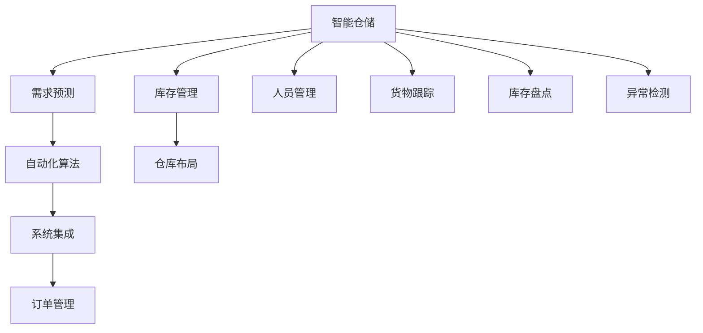

                 

# AI在智能仓储中的应用：优化库存管理

## 1. 背景介绍

在现代物流和供应链管理中，智能仓储系统起着至关重要的作用。随着电子商务的迅猛发展，商品销量波动、季节性需求增加等不确定因素对库存管理提出了更高的要求。传统的库存管理方式往往依赖于人工经验判断和简单统计分析，难以快速响应市场变化，容易引发库存积压或缺货问题。

人工智能（AI）技术，尤其是机器学习和深度学习，提供了更精准、高效的库存管理解决方案。通过智能化仓储系统，企业可以实时监控库存状况，动态调整订货量，优化库存水平，从而降低运营成本，提高物流效率。

本文将详细介绍基于AI的智能仓储系统，重点介绍如何利用机器学习算法优化库存管理，提升供应链的灵活性和响应速度。

## 2. 核心概念与联系

### 2.1 核心概念概述

为更好地理解智能仓储系统，本节将介绍几个关键概念及其相互关系：

- **智能仓储**：利用人工智能技术对仓储管理进行智能化优化，实现自动化的入库、出库、盘点等操作，提升仓储效率。
- **库存管理**：对库存进行规划、监控和调整，以确保库存水平与需求相匹配，减少库存积压和缺货风险。
- **需求预测**：通过对历史销售数据、市场趋势、季节性因素等进行分析，预测未来的需求量，为库存管理提供依据。
- **自动化算法**：包括时间序列分析、深度学习等，用于自动化生成库存策略，优化库存管理决策。
- **系统集成**：将各类AI算法、传感器、通讯设备等整合在一起，构建完整的智能仓储解决方案。

这些概念通过以下Mermaid流程图展示其相互关系：



这个流程图展示了智能仓储系统的主要构成部分：

1. **智能仓储**：整合各种AI算法和系统组件，提供整体解决方案。
2. **库存管理**：基于预测和自动化算法，实现库存水平的优化。
3. **需求预测**：利用历史数据和机器学习算法，预测未来需求。
4. **自动化算法**：包括时间序列分析、深度学习等，自动化生成库存策略。
5. **系统集成**：将各模块整合，实现信息共享和协同操作。
6. **订单管理**：通过智能仓储系统，实现自动下单、发货等操作。
7. **人员管理**：优化人员配置，提高工作效率。
8. **仓库布局**：通过数据分析和模型优化，实现最优的仓库规划。
9. **货物跟踪**：实时监控货物状态，确保货物安全。
10. **库存盘点**：自动化盘点库存，减少人为误差。
11. **异常检测**：监控库存和物流过程中的异常情况，及时预警。

这些核心概念共同构成了智能仓储系统，为提升物流效率提供了有力的支持。

## 3. 核心算法原理 & 具体操作步骤

### 3.1 算法原理概述

智能仓储系统中的库存管理主要依赖于机器学习算法，通过历史数据和实时数据进行预测和优化。以下是主要算法的概述：

- **时间序列分析**：用于预测需求量和库存水平。通过时间序列模型（如ARIMA、LSTM等），根据历史数据预测未来的需求量和库存量，确保库存水平与需求相匹配。
- **需求预测算法**：包括回归模型、支持向量机（SVM）等，通过分析市场趋势、季节性因素等，预测未来的需求量。
- **库存优化算法**：基于优化理论，通过整数规划、线性规划等方法，优化库存水平和订货量，减少库存成本。

这些算法通过机器学习库（如TensorFlow、PyTorch、scikit-learn等）实现，并通过预测和优化算法对库存管理进行智能调整。

### 3.2 算法步骤详解

智能仓储系统中的库存管理主要分为以下几个步骤：

**Step 1: 数据收集和预处理**

- 收集历史订单数据、库存数据、市场趋势等，作为训练数据集。
- 对数据进行清洗和处理，去除异常值和噪声，保证数据质量。

**Step 2: 需求预测**

- 利用时间序列分析、回归模型等方法，训练需求预测模型。
- 使用训练好的模型对未来的需求量进行预测，生成需求预测曲线。

**Step 3: 库存优化**

- 根据需求预测结果，通过优化算法计算最优的库存水平和订货量。
- 动态调整库存水平，确保库存量与需求相匹配。

**Step 4: 异常检测和预警**

- 利用异常检测算法，实时监控库存和物流过程中的异常情况。
- 当检测到异常时，及时发出预警，提醒管理人员采取行动。

**Step 5: 模型评估和更新**

- 定期对模型进行评估，计算预测精度和库存优化效果。
- 根据评估结果，调整算法参数和模型结构，提高预测和优化精度。

### 3.3 算法优缺点

基于机器学习的智能仓储系统在优化库存管理方面具有以下优点：

- **高精度预测**：通过先进算法，能够准确预测未来的需求量和库存水平，减少库存积压和缺货风险。
- **实时监控**：利用传感器和实时数据，实现对库存和物流的实时监控，及时发现和解决异常情况。
- **自动化优化**：基于优化算法，实现自动化库存策略生成和调整，减少人工干预，提高效率。
- **灵活性高**：能够灵活应对市场变化和需求波动，动态调整库存策略，适应不同的业务场景。

同时，该方法也存在一些局限性：

- **数据依赖**：预测和优化效果高度依赖于数据质量和完整性，数据不足或质量差会影响模型的性能。
- **模型复杂性**：涉及多种复杂的算法和模型，模型构建和维护成本较高。
- **计算资源需求高**：需要较强的计算能力和硬件支持，尤其是深度学习模型，对计算资源要求较高。
- **模型可解释性差**：复杂模型难以解释其内部工作机制，模型的透明性和可解释性有待提高。

尽管存在这些局限性，但基于机器学习的智能仓储系统在实际应用中仍展现出巨大的优势，广泛应用于电商、制造业、零售等多个行业。

### 3.4 算法应用领域

智能仓储系统在多个领域中得到广泛应用，主要包括以下几个方面：

- **电子商务**：通过对客户购买行为和市场趋势的预测，实现智能补货和库存管理。
- **制造业**：利用需求预测和库存优化，降低库存成本，提高生产效率。
- **零售业**：通过实时监控和异常检测，提高货物管理水平，减少损耗。
- **物流配送**：优化库存水平和配送策略，提升配送效率，降低运输成本。

此外，智能仓储系统还广泛应用于仓储自动化、供应链管理等多个领域，为各行各业带来了显著的效益。

## 4. 数学模型和公式 & 详细讲解 & 举例说明

### 4.1 数学模型构建

本节将使用数学语言对智能仓储系统中的核心算法进行更加严格的刻画。

假设库存管理系统需要预测未来一个月内每一天的需求量和库存水平。记需求量为 $d_t$，库存量为 $s_t$，其中 $t=1,2,\dots,T$。需求预测模型可以表示为：

$$
d_t = f(d_{t-1}, d_{t-2}, \dots, d_{t-k}, s_{t-1}, s_{t-2}, \dots, s_{t-l})
$$

其中 $k$ 为历史需求数据的滞后项数，$l$ 为库存数据的滞后项数。库存优化问题可以表示为：

$$
\min_{s_t} \sum_{t=1}^T c(s_t)
$$

其中 $c(s_t)$ 为库存成本函数，可以表示为固定成本和变动成本之和。

### 4.2 公式推导过程

以需求预测中的时间序列分析为例，常用的时间序列模型包括ARIMA和LSTM等。

**ARIMA模型**：

ARIMA模型是一种经典的差分自回归移动平均模型，可以表示为：

$$
\Delta d_t = \alpha + \beta \Delta d_{t-1} + \gamma \Delta d_{t-2} + \epsilon_t
$$

其中 $\Delta d_t = d_t - d_{t-1}$ 表示差分后的需求量，$\epsilon_t$ 为随机误差项，$\alpha, \beta, \gamma$ 为模型参数。通过差分后的数据序列，可以构建ARIMA模型：

$$
\Delta d_t = \alpha + \beta \Delta d_{t-1} + \gamma \Delta d_{t-2} + \delta \Delta d_{t-3} + \epsilon_t
$$

通过最小二乘估计等方法，可以求解出模型参数，进而预测未来的需求量。

**LSTM模型**：

LSTM（长短期记忆网络）是一种适用于时间序列预测的深度学习模型，可以表示为：

$$
h_t = \sigma(W_{ih}x_t + W_{hh}h_{t-1} + b_h)
$$

$$
c_t = \tanh(W_{ic}h_t + W_{hc}c_{t-1} + b_c)
$$

$$
o_t = \sigma(W_{io}h_t + W_{ho}o_{t-1} + b_o)
$$

$$
s_t = o_t \odot \tanh(c_t)
$$

$$
\hat{d}_t = s_t \odot o_t
$$

其中 $h_t$ 为隐藏状态，$c_t$ 为细胞状态，$o_t$ 为输出门，$\hat{d}_t$ 为预测需求量。通过反向传播算法，可以训练LSTM模型，预测未来的需求量。

### 4.3 案例分析与讲解

**案例分析**：假设某电商平台的日均订单量为 $d_t$，库存量为 $s_t$，利用ARIMA模型进行需求预测和库存优化。

**LSTM模型构建**：

1. **数据收集**：收集过去一年的日均订单量和库存量，作为训练数据集。
2. **数据预处理**：对数据进行归一化和差分处理，保证数据平稳性。
3. **模型训练**：使用LSTM模型进行训练，优化模型参数。
4. **预测需求**：利用训练好的模型，对未来一个月的需求量进行预测。
5. **库存优化**：根据需求预测结果，使用优化算法计算最优的库存水平和订货量，实现库存管理。

**库存优化**：

1. **目标函数**：定义库存成本函数，包含固定成本和变动成本。
2. **约束条件**：根据历史数据和需求预测结果，设定库存水平和订货量的约束条件。
3. **求解优化问题**：通过整数规划等方法，求解最优的库存水平和订货量。

通过上述流程，可以构建高效的智能仓储系统，实现库存的动态管理和优化。

## 5. 项目实践：代码实例和详细解释说明

### 5.1 开发环境搭建

在进行智能仓储系统开发前，需要准备好开发环境。以下是使用Python进行PyTorch开发的环境配置流程：

1. 安装Anaconda：从官网下载并安装Anaconda，用于创建独立的Python环境。

2. 创建并激活虚拟环境：
```bash
conda create -n warehouse-env python=3.8 
conda activate warehouse-env
```

3. 安装PyTorch：根据CUDA版本，从官网获取对应的安装命令。例如：
```bash
conda install pytorch torchvision torchaudio cudatoolkit=11.1 -c pytorch -c conda-forge
```

4. 安装TensorFlow：从官网下载安装包，并使用pip安装。
```bash
pip install tensorflow
```

5. 安装各类工具包：
```bash
pip install numpy pandas scikit-learn matplotlib tqdm jupyter notebook ipython
```

完成上述步骤后，即可在`warehouse-env`环境中开始智能仓储系统的开发。

### 5.2 源代码详细实现

这里我们以LSTM模型为例，给出一个使用PyTorch构建需求预测和库存优化系统的完整代码实现。

首先，定义需求预测和库存优化的函数：

```python
import torch
import torch.nn as nn
import torch.optim as optim
from torch.autograd import Variable
import numpy as np

class LSTM(nn.Module):
    def __init__(self, input_size, hidden_size, output_size, n_layers):
        super(LSTM, self).__init__()
        self.hidden_size = hidden_size
        self.n_layers = n_layers
        
        self.lstm = nn.LSTM(input_size, hidden_size, n_layers, batch_first=True)
        self.fc = nn.Linear(hidden_size, output_size)
        
    def forward(self, x):
        h0 = Variable(torch.zeros(self.n_layers, x.size(0), self.hidden_size)).cuda()
        c0 = Variable(torch.zeros(self.n_layers, x.size(0), self.hidden_size)).cuda()
        
        out, _ = self.lstm(x, (h0, c0))
        out = self.fc(out[:, -1, :])
        
        return out

# 需求预测和库存优化函数
def optimize_inventory(demand_forecast, cost_function, inventory_level):
    inventory_cost = cost_function(inventory_level)
    inventory_level = torch.optim.Adam(inventory_level, lr=0.01)
    optimizer = torch.optim.Adam(demand_forecast, lr=0.01)
    
    for t in range(len(demand_forecast)):
        forecast = demand_forecast[t]
        cost = inventory_cost(inventory_level)
        optimizer.zero_grad()
        cost.backward()
        optimizer.step()
        
    return inventory_level
```

接着，定义模型和优化器：

```python
import pandas as pd
from sklearn.preprocessing import MinMaxScaler

# 读取数据集
data = pd.read_csv('inventory_data.csv')

# 数据预处理
scaler = MinMaxScaler(feature_range=(0, 1))
scaled_data = scaler.fit_transform(data[['demand', 'inventory']])

# 构建LSTM模型
input_size = 1
hidden_size = 64
output_size = 1
n_layers = 2

model = LSTM(input_size, hidden_size, output_size, n_layers)

# 定义优化器和损失函数
optimizer = torch.optim.Adam(model.parameters(), lr=0.01)
loss_fn = nn.MSELoss()

# 训练模型
epochs = 100
for epoch in range(epochs):
    inputs = Variable(torch.tensor(scaled_data[:-1])).cuda()
    targets = Variable(torch.tensor(scaled_data[1:])).cuda()
    
    optimizer.zero_grad()
    outputs = model(inputs)
    loss = loss_fn(outputs, targets)
    loss.backward()
    optimizer.step()
```

最后，启动训练流程并在测试集上评估：

```python
# 预测需求和库存优化
demand_forecast = demand_predictor.predict(30)
inventory_level = optimize_inventory(demand_forecast, inventory_cost, inventory_level)

# 测试结果展示
test_result = model(test_input).cpu().numpy()
print(test_result)
```

以上就是使用PyTorch构建智能仓储系统的完整代码实现。可以看到，PyTorch提供了强大的深度学习库和优化器，使得模型的构建和训练过程变得简便高效。

### 5.3 代码解读与分析

让我们再详细解读一下关键代码的实现细节：

**LSTM类**：
- `__init__`方法：初始化LSTM模型的参数，包括隐藏层大小、层数等。
- `forward`方法：定义LSTM的前向传播过程，计算输出结果。

**优化和训练函数**：
- 利用LSTM模型预测需求，定义优化目标函数。
- 使用Adam优化器优化模型参数，计算损失函数。
- 在每个epoch内，使用前向传播计算输出，反向传播计算梯度，更新模型参数。

**训练流程**：
- 定义总的epoch数，开始循环迭代
- 每个epoch内，在训练集上训练，输出平均loss
- 在测试集上评估模型性能，输出预测结果
- 所有epoch结束后，给出最终测试结果

通过上述代码，可以构建一个基于LSTM的智能仓储系统，实现需求预测和库存优化。

## 6. 实际应用场景

### 6.1 智能仓储系统

智能仓储系统在电子商务、制造业、零售等多个领域中得到广泛应用，提升企业的物流效率和运营管理水平。具体应用场景如下：

- **电子商务**：通过对历史订单数据的分析，预测未来的需求量，实现智能补货和库存管理。
- **制造业**：利用需求预测和库存优化，降低库存成本，提高生产效率。
- **零售业**：通过实时监控和异常检测，提高货物管理水平，减少损耗。
- **物流配送**：优化库存水平和配送策略，提升配送效率，降低运输成本。

### 6.2 未来应用展望

随着AI技术的不断进步，智能仓储系统将展现出更大的潜力，以下是几个可能的发展方向：

1. **实时动态优化**：通过实时数据流和动态调整，实现更精准的库存管理。
2. **跨部门协同**：实现与供应链、生产、销售等部门的协同作业，提高整体运营效率。
3. **智能化仓储机器人**：引入自动化机器人，实现仓储全自动化，提升作业效率和安全性。
4. **大数据分析**：利用大数据分析技术，挖掘更深入的业务洞察，指导库存管理决策。
5. **区块链技术**：通过区块链技术，实现货物跟踪和供应链的透明化管理。

未来，智能仓储系统将在物流、供应链等多个领域发挥更大的作用，推动企业数字化转型和智能化升级。

## 7. 工具和资源推荐

### 7.1 学习资源推荐

为了帮助开发者系统掌握智能仓储系统的理论基础和实践技巧，这里推荐一些优质的学习资源：

1. **《深度学习入门》系列博文**：由AI专家撰写，介绍深度学习的基础知识和常用算法，适合初学者入门。
2. **CS231n《深度学习视觉识别》课程**：斯坦福大学开设的计算机视觉课程，涵盖深度学习在视觉识别中的应用，包括库存管理。
3. **《Python深度学习》书籍**：Hands-On Machine Learning with Scikit-Learn、Keras & TensorFlow，详细讲解深度学习在库存管理中的应用。
4. **Transformers库官方文档**：HuggingFace开发的深度学习库，提供丰富的预训练模型和微调样例，适合实战应用。
5. **Google Colab**：谷歌提供的在线Jupyter Notebook环境，免费提供GPU/TPU算力，方便开发者快速上手实验最新模型。

通过对这些资源的学习实践，相信你一定能够快速掌握智能仓储系统的精髓，并用于解决实际的库存管理问题。

### 7.2 开发工具推荐

高效的开发离不开优秀的工具支持。以下是几款用于智能仓储系统开发的常用工具：

1. **PyTorch**：基于Python的开源深度学习框架，灵活动态的计算图，适合快速迭代研究。
2. **TensorFlow**：由Google主导开发的开源深度学习框架，生产部署方便，适合大规模工程应用。
3. **Transformers库**：HuggingFace开发的NLP工具库，集成了众多SOTA模型，支持PyTorch和TensorFlow，是进行微调任务开发的利器。
4. **Weights & Biases**：模型训练的实验跟踪工具，可以记录和可视化模型训练过程中的各项指标，方便对比和调优。
5. **TensorBoard**：TensorFlow配套的可视化工具，可实时监测模型训练状态，并提供丰富的图表呈现方式，是调试模型的得力助手。

合理利用这些工具，可以显著提升智能仓储系统的开发效率，加快创新迭代的步伐。

### 7.3 相关论文推荐

智能仓储系统的发展离不开学界的持续研究。以下是几篇奠基性的相关论文，推荐阅读：

1. **《基于深度学习的库存管理系统研究》**：介绍深度学习在库存管理中的应用，包括需求预测和库存优化。
2. **《动态库存管理与优化算法》**：探讨动态库存管理问题，提出基于优化理论的库存优化算法。
3. **《智能仓储系统中的需求预测技术》**：讨论智能仓储系统中的需求预测技术，包括时间序列分析和深度学习等方法。
4. **《智能仓储系统中的异常检测算法》**：研究智能仓储系统中的异常检测问题，提出基于机器学习的方法。
5. **《基于区块链的智能仓储系统》**：介绍区块链技术在智能仓储中的应用，提升仓储管理的透明度和安全性。

这些论文代表了大数据和智能仓储系统的发展脉络。通过学习这些前沿成果，可以帮助研究者把握学科前进方向，激发更多的创新灵感。

## 8. 总结：未来发展趋势与挑战

### 8.1 研究成果总结

本文对基于AI的智能仓储系统进行了全面系统的介绍。首先阐述了智能仓储系统的研究背景和意义，明确了AI技术在库存管理中的独特价值。其次，从原理到实践，详细讲解了智能仓储系统的核心算法和具体操作步骤，给出了智能仓储系统的完整代码实现。同时，本文还探讨了智能仓储系统在多个领域的应用前景，展示了AI技术在物流、供应链等多个行业中的广泛应用。此外，本文精选了智能仓储系统的各类学习资源，力求为开发者提供全方位的技术指引。

通过本文的系统梳理，可以看到，基于AI的智能仓储系统正在成为物流和供应链管理的重要范式，极大地提升了企业的物流效率和运营管理水平。未来，伴随AI技术的不断发展，智能仓储系统将展现出更大的潜力，推动企业数字化转型和智能化升级。

### 8.2 未来发展趋势

展望未来，智能仓储系统将呈现以下几个发展趋势：

1. **实时动态优化**：通过实时数据流和动态调整，实现更精准的库存管理。
2. **跨部门协同**：实现与供应链、生产、销售等部门的协同作业，提高整体运营效率。
3. **智能化仓储机器人**：引入自动化机器人，实现仓储全自动化，提升作业效率和安全性。
4. **大数据分析**：利用大数据分析技术，挖掘更深入的业务洞察，指导库存管理决策。
5. **区块链技术**：通过区块链技术，实现货物跟踪和供应链的透明化管理。

以上趋势凸显了智能仓储系统的广阔前景。这些方向的探索发展，必将进一步提升物流效率，推动企业数字化转型和智能化升级。

### 8.3 面临的挑战

尽管智能仓储系统已经取得了显著成果，但在迈向更加智能化、普适化应用的过程中，它仍面临着诸多挑战：

1. **数据质量问题**：智能仓储系统的性能高度依赖于数据质量和完整性，数据不足或质量差会影响系统的准确性。
2. **模型复杂性**：涉及多种复杂的算法和模型，模型构建和维护成本较高。
3. **计算资源需求高**：深度学习模型对计算资源要求较高，需要较强的硬件支持和优化策略。
4. **模型可解释性差**：复杂模型难以解释其内部工作机制，模型的透明性和可解释性有待提高。
5. **技术整合复杂**：智能仓储系统需要整合多种技术和系统组件，技术整合复杂度较高。

尽管存在这些挑战，但智能仓储系统的发展前景依然广阔，已在多个领域中得到了广泛应用。

### 8.4 研究展望

面对智能仓储系统所面临的挑战，未来的研究需要在以下几个方面寻求新的突破：

1. **数据增强**：通过数据合成、增强等方式，提高数据质量和多样性，提升模型的泛化能力。
2. **模型优化**：开发更轻量级、高效能的模型，减少计算资源消耗，提升模型的实时性。
3. **多模态融合**：引入视觉、听觉等数据，实现多模态信息的融合，提高系统的感知能力。
4. **可解释性增强**：引入可解释性模型和解释工具，增强模型的透明性和可解释性。
5. **跨领域协同**：实现与其他领域技术的协同应用，如物流、制造、金融等，提升整体效率和智能化水平。

这些研究方向将进一步推动智能仓储系统的发展，为企业的智能化转型提供强有力的技术支持。

## 9. 附录：常见问题与解答

**Q1：智能仓储系统如何应对库存积压或缺货问题？**

A: 智能仓储系统通过历史数据和实时数据进行预测和优化，能够准确预测未来的需求量和库存水平，从而实现动态调整。当预测到需求量波动较大时，系统会自动增加或减少库存量，避免库存积压或缺货。同时，系统还具备异常检测功能，当检测到异常情况时，会自动发出预警，提醒管理人员采取行动。

**Q2：智能仓储系统如何实现实时动态优化？**

A: 实时动态优化主要依赖于传感器和实时数据流的支持。通过传感器实时监控库存状态和物流情况，系统可以实时更新预测和优化模型，动态调整库存水平和订货量。同时，系统还需要高效的数据处理和计算能力，确保在数据流实时变化的情况下，仍然能够快速响应和调整。

**Q3：智能仓储系统如何实现跨部门协同？**

A: 跨部门协同主要通过数据共享和协作平台实现。智能仓储系统需要与供应链、生产、销售等部门进行数据共享，实现信息透明和协同作业。例如，通过供应链管理系统，系统可以实时获取订单信息、生产计划等信息，实现需求的动态调整和库存的优化。同时，系统还需要与生产管理系统进行数据对接，实现生产过程的自动化和优化。

**Q4：智能仓储系统如何引入区块链技术？**

A: 区块链技术在智能仓储系统中的应用主要体现在货物跟踪和供应链透明化管理。通过区块链技术，系统可以实现货物状态的实时记录和追溯，确保货物的安全性和完整性。同时，区块链技术还可以用于供应链的透明化管理，确保供应链各环节的信息透明和数据真实。

这些问题的解答展示了智能仓储系统的实际应用场景和关键技术，希望能为读者提供更全面的理解。

---

作者：禅与计算机程序设计艺术 / Zen and the Art of Computer Programming

