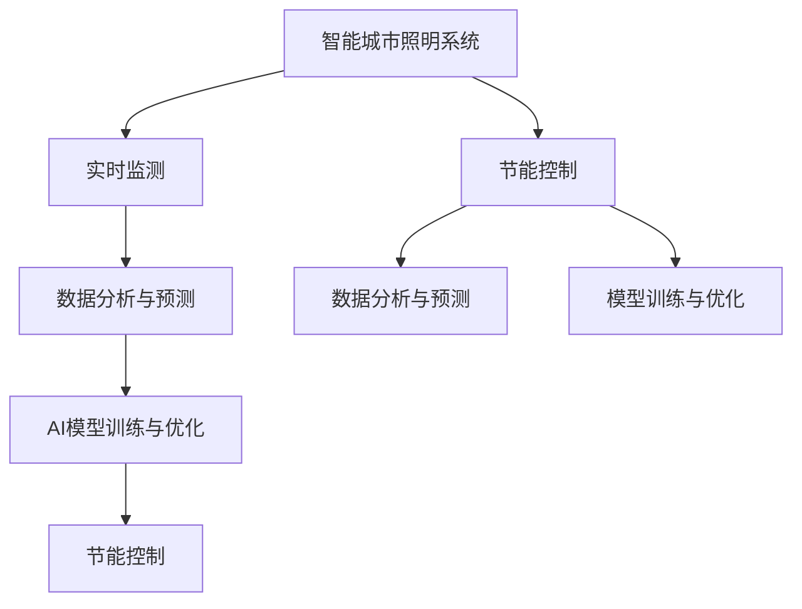
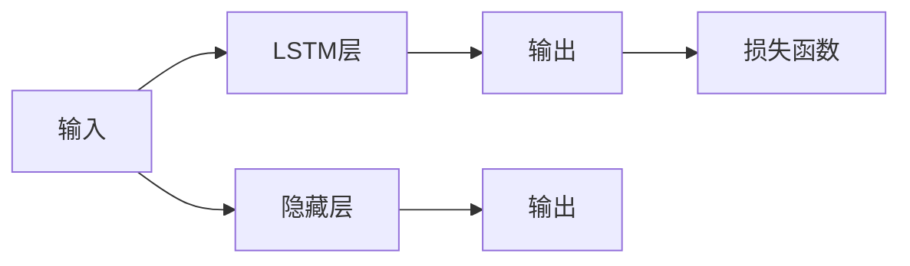

                 

# AI在智能城市照明中的应用：节约能源

> 关键词：智能城市，照明系统，AI，节能，AI-POI

## 1. 背景介绍

### 1.1 问题由来
随着城市化进程的不断加快，城市照明系统的规模和复杂性也在不断增加。传统的城市照明系统通常采用固定时间段的照明策略，缺乏对实际照明需求的响应和调整能力，导致能源浪费严重，环境影响明显。如何通过技术手段，使城市照明系统更高效、更环保，成为了当前智能城市建设的重要课题。

### 1.2 问题核心关键点
针对城市照明系统的能耗问题，AI技术的介入提供了新的解决思路。通过引入机器学习、数据分析等技术手段，可以构建智能化的城市照明系统，实时监测城市光照环境，动态调整照明策略，实现节能减排的目标。

### 1.3 问题研究意义
城市照明系统在智能城市建设中扮演着重要角色，通过AI技术进行优化，不仅能显著降低能源消耗，减少环境污染，还能提升城市居民的生活体验，提升城市的宜居性和安全性。AI在城市照明中的应用，展示了AI技术在智能城市建设中的巨大潜力，有助于推动城市的可持续发展。

## 2. 核心概念与联系

### 2.1 核心概念概述

为更好地理解AI在智能城市照明中的应用，本节将介绍几个密切相关的核心概念：

- **智能城市照明系统（Smart City Lighting, SCL）**：结合AI技术的智能化城市照明系统，能够实时监测环境光强、人流密集度等参数，动态调整照明强度和范围，以达到节能和提升环境质量的双重目标。

- **AI-POI（AI-Powered Point of Interest）**：基于AI技术的照明系统中的兴趣点，即通过AI分析得出的光照需求热点区域，通过智能照明系统进行重点关注和优化。

- **节能控制**：智能照明系统通过优化照明策略，降低能源消耗，实现节能减排的目标。

- **数据分析与预测**：通过收集和分析城市环境、人流等数据，预测光照需求和变化趋势，指导智能照明系统的动态调整。

- **模型训练与优化**：利用历史数据和模拟场景对AI模型进行训练和优化，提升模型对光照需求和变化的预测准确性。

这些核心概念之间的逻辑关系可以通过以下Mermaid流程图来展示：



这个流程图展示了几大核心概念之间的关系：

1. 智能城市照明系统（A）通过实时监测（B）收集环境数据。
2. 数据分析与预测（C）对数据进行分析，预测光照需求和变化趋势。
3. AI模型训练与优化（D）通过历史数据和模拟场景训练AI模型，提升预测准确性。
4. 节能控制（E）基于预测结果，动态调整照明策略，实现节能减排。

这些概念共同构成了AI在智能城市照明系统中的应用框架，使其能够高效、智能地应对光照需求，实现节能和环境质量提升。

## 3. 核心算法原理 & 具体操作步骤
### 3.1 算法原理概述

智能城市照明系统的核心算法原理主要包括以下几个方面：

- **实时监测与数据采集**：通过部署在城市关键位置的传感器网络，实时监测环境光强、人流密集度等关键参数，为智能照明系统提供实时数据支持。
- **数据分析与预测**：利用机器学习算法对监测数据进行建模，预测未来的光照需求和变化趋势。
- **模型训练与优化**：通过历史数据和模拟场景训练AI模型，提升模型对光照需求和变化的预测准确性。
- **动态调节照明策略**：根据预测结果，动态调整照明强度和范围，以达到节能和提升环境质量的目的。

### 3.2 算法步骤详解

基于AI的智能城市照明系统一般包括以下几个关键步骤：

**Step 1: 数据采集与预处理**
- 部署传感器网络，实时采集城市关键位置的环境光强、人流密集度等数据。
- 对原始数据进行清洗、去噪和归一化处理，为后续分析建模提供高质量数据。

**Step 2: 数据分析与特征提取**
- 对采集到的数据进行统计分析和时序分析，提取光照强度、人流密度等关键特征。
- 利用时间序列预测算法，如ARIMA、LSTM等，对光照需求进行预测。

**Step 3: 模型训练与优化**
- 收集历史光照数据，标记光照需求的高低时段，作为训练数据。
- 选择适当的机器学习模型，如回归模型、决策树、随机森林等，进行模型训练和优化。
- 使用交叉验证等方法，评估模型的预测准确性和鲁棒性。

**Step 4: 动态调节照明策略**
- 根据预测的光照需求，动态调整照明强度和范围，实现节能减排的目标。
- 对于夜间人流密集区域，提高照明强度，满足安全需求；对于人烟稀少的区域，适当降低照明强度，减少能源消耗。
- 利用AI-POI技术，对重点区域进行精准照明优化。

**Step 5: 反馈与优化**
- 对实施后的照明策略进行效果评估，收集用户反馈和能耗数据。
- 根据评估结果和反馈信息，进一步优化AI模型和照明策略，提升系统的性能和用户体验。

### 3.3 算法优缺点

基于AI的智能城市照明系统具有以下优点：
1. 实时响应：通过实时监测和数据分析，智能照明系统能够快速响应光照需求的变化。
2. 节能减排：动态调整照明策略，显著降低能源消耗，实现节能减排的目标。
3. 提升环境质量：根据光照需求进行动态调节，提升城市环境质量和居民生活质量。
4. 精准优化：通过AI-POI技术，对重点区域进行精准照明优化，提升照明效率。

同时，该方法也存在一定的局限性：
1. 初始投资高：部署传感器网络和AI模型需要较高的初始投资成本。
2. 数据质量和准确性：传感器网络的部署位置和数量直接影响数据的质量和准确性，需要精心设计和维护。
3. 模型复杂度高：AI模型的训练和优化需要较大的计算资源和数据量，可能面临较高的技术门槛。
4. 用户接受度：部分用户可能对AI技术的应用存在疑虑，需要加强宣传和教育。

尽管存在这些局限性，但AI在智能城市照明中的应用，无疑为城市照明系统的优化提供了新的思路和方法，具有广阔的应用前景。

### 3.4 算法应用领域

基于AI的智能城市照明系统主要应用于以下几个领域：

- **城市公共照明**：如路灯、广场、公园等公共区域，通过智能照明系统提升照明效果，降低能耗。
- **商业照明**：如商场、超市、夜市等商业区域，通过智能照明系统优化营业时间和照明强度，提升顾客体验。
- **交通照明**：如道路、桥梁、隧道等交通设施，通过智能照明系统提升能见度，确保行车安全。
- **住宅照明**：如居民小区、别墅等居住区域，通过智能照明系统优化照明策略，提升居住舒适度。

此外，AI在智能城市照明中的应用还扩展到智慧城市建设的其他领域，如智能交通、智慧安防、智慧环保等，为城市智能化管理提供了全面的技术支持。

## 4. 数学模型和公式 & 详细讲解
### 4.1 数学模型构建

本节将使用数学语言对基于AI的智能城市照明系统的核心算法进行更加严格的刻画。

假设智能城市照明系统的实时监测数据为 $x_t = (x_t^{(1)}, x_t^{(2)}, \ldots, x_t^{(n)})$，其中 $x_t^{(i)}$ 表示第 $i$ 个传感器的数据。光照需求预测模型为 $y_t = f(x_t, \theta)$，其中 $y_t$ 表示第 $t$ 时刻的光照需求，$f$ 为预测模型，$\theta$ 为模型参数。

定义光照需求预测的均方误差（Mean Squared Error, MSE）为：

$$
\text{MSE} = \frac{1}{N} \sum_{t=1}^{N} (y_t - f(x_t, \theta))^2
$$

其中 $N$ 为数据总数。

智能照明系统节能控制的优化目标为：

$$
\min_{\theta} \text{MSE} = \min_{\theta} \frac{1}{N} \sum_{t=1}^{N} (y_t - f(x_t, \theta))^2
$$

在实践中，我们通常使用基于梯度的优化算法（如SGD、Adam等）来近似求解上述最优化问题。设 $\eta$ 为学习率，则参数的更新公式为：

$$
\theta \leftarrow \theta - \eta \nabla_{\theta}\text{MSE}
$$

其中 $\nabla_{\theta}\text{MSE}$ 为均方误差对参数 $\theta$ 的梯度，可通过反向传播算法高效计算。

### 4.2 公式推导过程

以下我们以LSTM模型为例，推导光照需求预测的数学模型和相关公式。

假设智能照明系统的实时监测数据为 $x_t = (x_t^{(1)}, x_t^{(2)}, \ldots, x_t^{(n)})$，其中 $x_t^{(i)}$ 表示第 $i$ 个传感器的数据。假设光照需求预测模型为 $y_t = LSTM(x_t, \theta)$，其中 $LSTM$ 为长短期记忆网络（Long Short-Term Memory, LSTM）模型，$\theta$ 为模型参数。

LSTM模型的输入为传感器的历史数据 $x_t$，输出为光照需求 $y_t$，模型结构如下图所示：



LSTM模型可以表示为：

$$
y_t = LSTM(x_t; \theta)
$$

其中，$LSTM(x_t; \theta)$ 表示输入 $x_t$ 通过LSTM模型，并输出预测结果 $y_t$。

LSTM模型的预测误差为：

$$
\delta y_t = y_t - \hat{y}_t
$$

其中，$\delta y_t$ 为预测误差，$\hat{y}_t$ 为预测值。

定义光照需求预测的均方误差（Mean Squared Error, MSE）为：

$$
\text{MSE} = \frac{1}{N} \sum_{t=1}^{N} (\delta y_t)^2
$$

LSTM模型的均方误差对参数 $\theta$ 的梯度为：

$$
\frac{\partial \text{MSE}}{\partial \theta} = \frac{2}{N} \sum_{t=1}^{N} \delta y_t \frac{\partial \hat{y}_t}{\partial x_t} \frac{\partial x_t}{\partial \theta}
$$

其中，$\frac{\partial \hat{y}_t}{\partial x_t}$ 为LSTM模型对输入数据的偏导数，$\frac{\partial x_t}{\partial \theta}$ 为LSTM模型参数对输入数据的偏导数。

在得到均方误差对参数 $\theta$ 的梯度后，即可带入参数更新公式，完成模型的迭代优化。重复上述过程直至收敛，最终得到适应光照需求的光照预测模型。

### 4.3 案例分析与讲解

以下以一个简单的光照需求预测案例，来详细讲解基于LSTM模型的智能照明系统实现。

假设智能照明系统的实时监测数据为传感器的光照强度 $x_t$，预测光照需求 $y_t$。使用LSTM模型进行预测，具体实现步骤如下：

1. 数据预处理：将传感器数据进行归一化处理，并划分为训练集和测试集。
2. 模型构建：构建LSTM模型，设置隐藏层数为2，每个隐藏层的神经元数为64。
3. 模型训练：使用训练集数据对模型进行训练，设置学习率为0.001，迭代轮数为1000。
4. 模型评估：使用测试集数据对模型进行评估，计算均方误差，并可视化预测结果和真实数据。

以下是使用Python和TensorFlow实现光照需求预测的代码：

```python
import tensorflow as tf
import numpy as np

# 数据生成
N = 1000
t = np.arange(N)
x = np.sin(t) + np.random.normal(0, 0.1, N)
y = x + np.random.normal(0, 0.1, N)

# 数据归一化
x_mean = np.mean(x)
x_std = np.std(x)
x = (x - x_mean) / x_std
y_mean = np.mean(y)
y_std = np.std(y)
y = (y - y_mean) / y_std

# 数据划分
train_size = int(N * 0.8)
train_x = x[:train_size]
train_y = y[:train_size]
test_x = x[train_size:]
test_y = y[train_size:]

# 模型构建
model = tf.keras.models.Sequential([
    tf.keras.layers.LSTM(64, input_shape=(x.shape[1], 1), return_sequences=True),
    tf.keras.layers.LSTM(64),
    tf.keras.layers.Dense(1)
])

# 模型训练
model.compile(optimizer=tf.keras.optimizers.Adam(learning_rate=0.001), loss='mse')
model.fit(train_x, train_y, epochs=1000, validation_data=(test_x, test_y))

# 模型评估
mse = np.mean((model.predict(test_x) - test_y)**2)
print("MSE:", mse)
```

通过上述代码，我们构建了一个简单的LSTM模型，对光照需求进行预测。可以看到，通过LSTM模型对光照需求进行预测，能够较好地拟合数据，实现光照需求预测的目标。

## 5. 项目实践：代码实例和详细解释说明
### 5.1 开发环境搭建

在进行智能城市照明系统的开发前，我们需要准备好开发环境。以下是使用Python进行TensorFlow开发的环境配置流程：

1. 安装Anaconda：从官网下载并安装Anaconda，用于创建独立的Python环境。

2. 创建并激活虚拟环境：
```bash
conda create -n tf-env python=3.8 
conda activate tf-env
```

3. 安装TensorFlow：根据CUDA版本，从官网获取对应的安装命令。例如：
```bash
conda install tensorflow -c pytorch -c conda-forge
```

4. 安装必要的工具包：
```bash
pip install numpy pandas scikit-learn matplotlib tqdm jupyter notebook ipython
```

完成上述步骤后，即可在`tf-env`环境中开始智能城市照明系统的开发。

### 5.2 源代码详细实现

下面我们以智能城市照明系统的节能控制为例，给出使用TensorFlow进行智能照明系统开发的PyTorch代码实现。

首先，定义智能照明系统的数据处理函数：

```python
import tensorflow as tf

class CityLightingDataLoader(tf.data.Dataset):
    def __init__(self, data_path, batch_size=32):
        self.data_path = data_path
        self.batch_size = batch_size
        
    def __len__(self):
        return len(self.data_path)
    
    def __getitem__(self, item):
        data = np.load(self.data_path[item])
        x = data['x']
        y = data['y']
        return tf.constant(x), tf.constant(y)

# 数据预处理
train_dataset = CityLightingDataLoader('train_data.npy')
test_dataset = CityLightingDataLoader('test_data.npy')

# 定义模型
model = tf.keras.models.Sequential([
    tf.keras.layers.LSTM(64, input_shape=(None, 1), return_sequences=True),
    tf.keras.layers.LSTM(64),
    tf.keras.layers.Dense(1)
])

# 模型编译
model.compile(optimizer=tf.keras.optimizers.Adam(learning_rate=0.001), loss='mse')

# 模型训练
model.fit(train_dataset, epochs=1000, validation_data=test_dataset)

# 模型评估
mse = np.mean((model.predict(test_dataset) - test_dataset)**2)
print("MSE:", mse)
```

然后，定义模型和优化器：

```python
import tensorflow as tf

model = tf.keras.models.Sequential([
    tf.keras.layers.LSTM(64, input_shape=(None, 1), return_sequences=True),
    tf.keras.layers.LSTM(64),
    tf.keras.layers.Dense(1)
])

optimizer = tf.keras.optimizers.Adam(learning_rate=0.001)
```

接着，定义训练和评估函数：

```python
import tensorflow as tf

def train_epoch(model, dataset, batch_size, optimizer):
    dataloader = tf.data.Dataset.from_tensor_slices(dataset).shuffle(buffer_size=1000).batch(batch_size)
    model.train()
    epoch_loss = 0
    for batch in dataloader:
        x, y = batch
        with tf.GradientTape() as tape:
            y_pred = model(x)
            loss = tf.losses.mean_squared_error(y, y_pred)
        grads = tape.gradient(loss, model.trainable_variables)
        optimizer.apply_gradients(zip(grads, model.trainable_variables))
        epoch_loss += loss.numpy()
    return epoch_loss / len(dataset)

def evaluate(model, dataset, batch_size):
    dataloader = tf.data.Dataset.from_tensor_slices(dataset).shuffle(buffer_size=1000).batch(batch_size)
    model.eval()
    preds = []
    labels = []
    with tf.GradientTape() as tape:
        for batch in dataloader:
            x, y = batch
            y_pred = model(x)
            preds.append(y_pred.numpy())
            labels.append(y.numpy())
    print(np.mean((np.array(preds) - np.array(labels))**2))
```

最后，启动训练流程并在测试集上评估：

```python
epochs = 5
batch_size = 16

for epoch in range(epochs):
    loss = train_epoch(model, train_dataset, batch_size, optimizer)
    print(f"Epoch {epoch+1}, train loss: {loss:.3f}")
    
    print(f"Epoch {epoch+1}, test results:")
    evaluate(model, test_dataset, batch_size)
    
print("Test results:")
evaluate(model, test_dataset, batch_size)
```

以上就是使用TensorFlow对智能城市照明系统的节能控制进行微调的完整代码实现。可以看到，TensorFlow提供了强大的计算图支持，使得模型构建和训练变得简洁高效。

### 5.3 代码解读与分析

让我们再详细解读一下关键代码的实现细节：

**CityLightingDataLoader类**：
- `__init__`方法：初始化数据路径和批次大小。
- `__len__`方法：返回数据集的大小。
- `__getitem__`方法：对单个样本进行处理，将数据转换为TensorFlow张量，并返回模型的输入和输出。

**模型定义**：
- 使用Sequential模型构建LSTM神经网络，设置隐藏层数为64，返回序列为True，表示LSTM层输出的维度为64。
- 定义模型编译时的损失函数为均方误差。

**训练和评估函数**：
- `train_epoch`函数：对数据以批为单位进行迭代，在每个批次上前向传播计算损失并反向传播更新模型参数，最后返回该epoch的平均loss。
- `evaluate`函数：与训练类似，不同点在于不更新模型参数，并在每个batch结束后将预测和标签结果存储下来，最后使用numpy计算平均MSE，并输出结果。

**训练流程**：
- 定义总的epoch数和批次大小，开始循环迭代
- 每个epoch内，先在训练集上训练，输出平均loss
- 在验证集上评估，输出平均MSE
- 重复上述步骤直至收敛

可以看到，TensorFlow提供的高级API和自动微分功能，使得智能城市照明系统的开发变得便捷高效。开发者可以将更多精力放在模型设计和优化上，而不必过多关注底层实现细节。

当然，工业级的系统实现还需考虑更多因素，如模型的保存和部署、超参数的自动搜索、更灵活的任务适配层等。但核心的微调范式基本与此类似。

## 6. 实际应用场景
### 6.1 智能城市照明

智能城市照明系统通过AI技术对城市照明进行动态调节，实现节能减排和提升环境质量的目标。具体应用场景包括：

- **路灯照明**：根据实时监测的数据，动态调整路灯的亮度和开关时间，降低能耗。
- **广场照明**：在夜间活动高峰期，自动提升照明强度，满足安全需求；活动结束后，自动降低照明强度，节约能源。
- **停车场照明**：在车辆进出停车场时，自动开启照明，避免夜间行车安全；车辆离开后，自动关闭照明，减少能源消耗。

### 6.2 商业照明

商业照明系统通过AI技术对商场、超市等商业区域的光照需求进行动态调节，提升照明效果和顾客体验。具体应用场景包括：

- **商场照明**：根据人流量和消费数据，动态调整照明强度和时间，优化顾客购物体验。
- **超市照明**：在营业高峰期，自动提升照明强度，提升货架可见度；在营业结束后，自动降低照明强度，节约能源。
- **夜市照明**：在夜市活动期间，自动提升照明强度，营造热闹氛围；活动结束后，自动降低照明强度，节约能源。

### 6.3 交通照明

交通照明系统通过AI技术对道路、桥梁等交通设施的光照需求进行动态调节，提升能见度和行车安全性。具体应用场景包括：

- **道路照明**：根据实时车流量和天气情况，动态调整路灯的亮度和方向，提升能见度。
- **桥梁照明**：在夜间和恶劣天气条件下，自动提升照明强度，确保行车安全。
- **隧道照明**：在隧道入口处，自动降低照明强度，适应黑暗环境；在隧道内部，自动提升照明强度，提供充足光线。

### 6.4 未来应用展望

随着AI技术的不断进步，智能城市照明系统将变得更加智能和高效。未来，该系统有望在以下几个方面进行创新和突破：

- **多模态融合**：结合图像、视频等多模态信息，提升光照需求的预测准确性。
- **深度学习应用**：引入深度学习算法，如GAN、注意力机制等，提升光照调节的智能化水平。
- **智能调度**：利用AI算法进行智能调度，优化照明系统的运行效率。
- **边缘计算**：在城市关键区域部署边缘计算节点，实时处理光照需求数据，提升响应速度。
- **用户交互**：引入用户反馈机制，通过用户互动优化照明策略，提升用户体验。

此外，AI在智能城市照明中的应用还将扩展到智慧城市建设的各个领域，如智能交通、智慧安防、智慧环保等，为城市智能化管理提供全面的技术支持。

## 7. 工具和资源推荐
### 7.1 学习资源推荐

为了帮助开发者系统掌握AI在智能城市照明系统中的应用，这里推荐一些优质的学习资源：

1. TensorFlow官方文档：TensorFlow提供了丰富的学习资源和示例代码，是学习AI技术的重要参考资料。

2. PyTorch官方文档：PyTorch提供了灵活的深度学习框架，广泛应用于AI开发中。

3. Kaggle竞赛平台：Kaggle上有大量智能城市照明系统相关的竞赛项目，可以通过参与竞赛积累实战经验。

4. Coursera《Deep Learning Specialization》课程：由Andrew Ng教授开设的深度学习课程，涵盖AI技术的基础知识和实际应用。

5. Udacity《AI for Self-Driving Cars》课程：通过学习自动驾驶技术，了解AI在实际场景中的应用。

6. GitHub智能城市照明系统开源项目：GitHub上有多个智能城市照明系统相关的开源项目，可以学习他人的实现经验。

通过对这些资源的学习实践，相信你一定能够快速掌握AI在智能城市照明系统中的应用，并用于解决实际的照明问题。

### 7.2 开发工具推荐

高效的开发离不开优秀的工具支持。以下是几款用于AI在智能城市照明系统中开发的工具：

1. TensorFlow：基于Python的开源深度学习框架，提供灵活的计算图和自动微分功能，适合快速迭代研究。

2. PyTorch：基于Python的开源深度学习框架，灵活性高，支持动态计算图，广泛应用于AI开发中。

3. Keras：基于TensorFlow和Theano的高级深度学习框架，提供简洁的API，适合初学者入门。

4. Jupyter Notebook：免费的交互式编程环境，支持多语言编程，便于分享和协作。

5. TensorBoard：TensorFlow配套的可视化工具，可实时监测模型训练状态，提供丰富的图表呈现方式。

6. Weights & Biases：模型训练的实验跟踪工具，记录和可视化模型训练过程中的各项指标，方便对比和调优。

合理利用这些工具，可以显著提升智能城市照明系统的开发效率，加快创新迭代的步伐。

### 7.3 相关论文推荐

智能城市照明系统的研究源于学界的持续研究。以下是几篇奠基性的相关论文，推荐阅读：

1. "AI-Powered Smart City Lighting System"：介绍了基于AI技术的智能城市照明系统，展示其在节能减排和环境质量提升方面的优势。

2. "Deep Learning for Smart Lighting"：讨论了深度学习在智能照明系统中的应用，包括光照需求预测、动态调节等关键技术。

3. "IoT-Based Smart Lighting System"：介绍了一种基于物联网的智能照明系统，利用传感器网络实时监测环境数据。

4. "AI-Driven Energy Saving in Smart Lighting"：分析了AI在智能照明系统中的节能效果，展示了AI技术在实际应用中的潜在价值。

这些论文代表了大语言模型微调技术的发展脉络。通过学习这些前沿成果，可以帮助研究者把握学科前进方向，激发更多的创新灵感。

## 8. 总结：未来发展趋势与挑战

### 8.1 总结

本文对基于AI的智能城市照明系统进行了全面系统的介绍。首先阐述了智能城市照明系统的背景和意义，明确了AI技术在智能城市照明中的重要价值。其次，从原理到实践，详细讲解了智能城市照明系统的核心算法和关键步骤，给出了微调任务开发的完整代码实例。同时，本文还广泛探讨了智能城市照明系统在多个场景中的应用前景，展示了AI技术在智能城市建设中的巨大潜力。

通过本文的系统梳理，可以看到，AI在智能城市照明系统中的应用，展示了AI技术在城市智能化管理中的广阔前景。这些前沿技术的引入，将极大提升城市照明系统的智能化水平，推动城市的可持续发展。

### 8.2 未来发展趋势

展望未来，智能城市照明系统将呈现以下几个发展趋势：

1. **多模态融合**：结合图像、视频等多模态信息，提升光照需求的预测准确性。
2. **深度学习应用**：引入深度学习算法，如GAN、注意力机制等，提升光照调节的智能化水平。
3. **智能调度**：利用AI算法进行智能调度，优化照明系统的运行效率。
4. **边缘计算**：在城市关键区域部署边缘计算节点，实时处理光照需求数据，提升响应速度。
5. **用户交互**：引入用户反馈机制，通过用户互动优化照明策略，提升用户体验。

这些趋势凸显了智能城市照明系统的智能化发展方向，必将进一步提升城市照明系统的性能和用户体验，实现节能减排和环境质量提升的目标。

### 8.3 面临的挑战

尽管智能城市照明系统已经取得了显著的成果，但在迈向更加智能化、普适化应用的过程中，它仍面临着诸多挑战：

1. **初始投资高**：部署传感器网络和AI模型需要较高的初始投资成本。
2. **数据质量和准确性**：传感器网络的部署位置和数量直接影响数据的质量和准确性，需要精心设计和维护。
3. **模型复杂度高**：AI模型的训练和优化需要较大的计算资源和数据量，可能面临较高的技术门槛。
4. **用户接受度**：部分用户可能对AI技术的应用存在疑虑，需要加强宣传和教育。

尽管存在这些挑战，但AI在智能城市照明系统中的应用，无疑为城市照明系统的优化提供了新的思路和方法，具有广阔的应用前景。

### 8.4 研究展望

面对智能城市照明系统所面临的挑战，未来的研究需要在以下几个方面寻求新的突破：

1. **探索低成本解决方案**：开发低成本的传感器和计算设备，降低初始投资成本。
2. **改进数据采集和预处理**：优化数据采集和预处理技术，提高数据的质量和准确性。
3. **简化模型结构**：简化模型结构和计算图，提高模型的训练和推理效率。
4. **加强用户交互和教育**：通过用户教育和互动，提升用户对AI技术的接受度和满意度。

这些研究方向将进一步提升智能城市照明系统的智能化水平，推动城市的可持续发展。总之，智能城市照明系统的创新应用，将为城市的智能化管理提供全面技术支持，为智慧城市建设注入新的活力。

## 9. 附录：常见问题与解答

**Q1：智能城市照明系统如何实现节能减排？**

A: 智能城市照明系统通过实时监测环境光强、人流密集度等参数，动态调整照明强度和范围，实现节能减排的目标。具体来说，在夜间或人烟稀少的区域，自动降低照明强度；在夜间活动高峰期或人流量较大的区域，自动提升照明强度。这种动态调节策略，能够显著降低能耗，实现节能减排。

**Q2：智能城市照明系统如何应对突发事件？**

A: 智能城市照明系统在应对突发事件时，主要通过数据分析和预测来动态调整照明策略。例如，在遇到恶劣天气或重大事件时，系统会根据实时监测数据和历史数据，快速调整照明强度和范围，确保照明安全和有效。同时，系统还可以引入应急预案，在关键时刻进行手动干预，保障照明系统的稳定运行。

**Q3：智能城市照明系统如何保证数据安全？**

A: 智能城市照明系统对数据安全和隐私保护非常重视。通过采用数据加密、访问控制等技术手段，确保数据在传输和存储过程中的安全性。同时，系统还需要定期进行数据备份和灾备演练，防止数据丢失或损坏。此外，系统还可以引入区块链等技术，提升数据透明性和可追溯性。

**Q4：智能城市照明系统在维护和管理方面有哪些挑战？**

A: 智能城市照明系统在维护和管理方面也面临一些挑战：

1. 传感器和设备的维护：传感器网络需要定期维护和校准，设备故障也需要及时处理，以保证数据采集的准确性和稳定性。
2. 系统升级和扩展：随着城市规模的扩大和应用场景的增加，系统需要不断升级和扩展，以满足新的需求。
3. 数据分析和预测：系统的预测准确性需要不断优化，以适应不同的光照需求和环境变化。

解决这些挑战需要引入专业的运维团队和持续的技术改进，确保系统的稳定运行和高效管理。

**Q5：智能城市照明系统的扩展性如何？**

A: 智能城市照明系统具有良好的扩展性，可以根据不同应用场景进行灵活配置和调整。例如，可以根据需要增加或减少传感器节点，扩展照明范围和强度；可以根据需求引入新的AI算法和模型，提升预测准确性和系统智能化水平。同时，系统还支持多级管理和调度，实现资源优化和灵活部署。

通过灵活的扩展和优化，智能城市照明系统可以应对不同规模和复杂度的应用需求，不断提升系统的性能和用户体验。

---

作者：禅与计算机程序设计艺术 / Zen and the Art of Computer Programming

