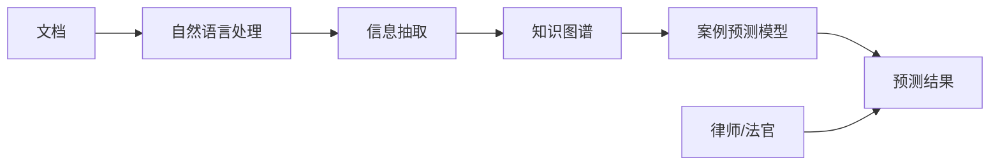

                 

# AI在法律科技中的应用：文档分析与案例预测

## 1. 背景介绍

### 1.1 问题由来
随着人工智能(AI)技术的不断成熟，其在各个领域的应用日益广泛。特别是在法律科技领域，AI技术被广泛应用于文档分析、案例预测、法律知识图谱构建等环节，大大提升了法律工作的效率和准确性。本文将详细探讨AI在法律科技中的应用，特别是文档分析和案例预测的原理与实践。

### 1.2 问题核心关键点
文档分析和案例预测是法律科技领域的两项核心任务。文档分析旨在从大量的法律文本中提取有用信息，帮助律师和法官快速理解和处理案件。案例预测则是指通过对历史案例的分析，预测案件的判决结果，辅助司法决策。AI技术在此类任务中展现了强大的潜力，但同时也面临着诸多挑战。

## 2. 核心概念与联系

### 2.1 核心概念概述

为了更好地理解文档分析和案例预测，我们先对相关核心概念进行阐述：

- **文档分析**：从法律文本中提取出有用的信息，如法规、判例、争议点等，辅助律师和法官进行案件处理。
- **案例预测**：通过对历史案例的分析，预测未来案件的判决结果，辅助司法决策。
- **自然语言处理(NLP)**：是AI在文档分析和案例预测中常用的技术，通过语言模型、文本分类、信息抽取等技术，实现对文本的自动化处理。
- **知识图谱**：利用图结构表示法律知识，构建法律领域的知识图谱，辅助文档分析和案例预测。
- **神经网络**：用于文档分析和案例预测的机器学习模型，包括卷积神经网络(CNN)、循环神经网络(RNN)、Transformer等。

这些概念之间具有紧密的联系。通过自然语言处理技术对文档进行分析，提取出有用的信息，结合知识图谱进行结构化，再通过神经网络模型进行预测，即可实现文档分析和案例预测的自动化和智能化。

### 2.2 核心概念原理和架构的 Mermaid 流程图



这个流程图展示了文档分析和案例预测的整个流程。文档首先经过自然语言处理，提取关键信息，然后通过知识图谱进行结构化，最后使用神经网络模型进行案例预测，输出预测结果供律师或法官参考。

## 3. 核心算法原理 & 具体操作步骤

### 3.1 算法原理概述
文档分析和案例预测的核心算法原理主要包括：

- **自然语言处理(NLP)**：使用语言模型、文本分类、信息抽取等技术，对文档进行自动化处理，提取有用的信息。
- **知识图谱构建**：通过实体关系抽取等技术，将文档中的关键信息转换为知识图谱，辅助文档分析和案例预测。
- **神经网络模型**：利用卷积神经网络(CNN)、循环神经网络(RNN)、Transformer等神经网络模型，对文档和案例进行分析和预测。

### 3.2 算法步骤详解

**步骤 1: 文档预处理**
- 收集需要分析的文档数据集，去除无关文本，如引言、注释等。
- 对文档进行分词、词性标注、命名实体识别等预处理操作。

**步骤 2: 信息抽取**
- 使用信息抽取模型，从文档中提取关键信息，如争议点、法规引用等。
- 信息抽取可以采用传统的基于规则的方法，或使用机器学习方法，如条件随机场(CRF)、最大熵模型等。

**步骤 3: 知识图谱构建**
- 使用实体关系抽取等技术，将提取的信息转换为知识图谱，用于结构化存储。
- 构建知识图谱可以采用基于图数据库的方法，如Neo4j、ArangoDB等。

**步骤 4: 案例预测**
- 使用神经网络模型，对已构建的知识图谱进行分析，预测案件的判决结果。
- 常用的神经网络模型包括卷积神经网络(CNN)、循环神经网络(RNN)、Transformer等。

**步骤 5: 模型评估与优化**
- 对预测结果进行评估，使用准确率、召回率、F1值等指标进行评估。
- 根据评估结果进行模型优化，如调整超参数、增加训练数据、引入新特征等。

### 3.3 算法优缺点

**优点**：
- **高效性**：AI技术能够自动处理大量文档和案例，大大提高法律工作的效率。
- **准确性**：AI技术能够通过学习历史数据，提升预测的准确性。
- **可扩展性**：AI技术能够适应各种规模的法律问题，具有较强的可扩展性。

**缺点**：
- **数据依赖**：AI模型的性能依赖于高质量的数据，数据的准确性和完整性直接影响模型的效果。
- **模型复杂度**：复杂的AI模型需要大量的计算资源和时间进行训练和优化。
- **透明度问题**：AI模型的决策过程缺乏透明度，难以解释模型的推理逻辑。

### 3.4 算法应用领域

文档分析和案例预测技术已经在多个法律科技领域得到广泛应用，包括：

- **法律文书生成**：自动生成法律文书，如合同、诉状、判决书等。
- **法律研究与分析**：通过分析大量法律文本，提取关键信息，辅助法律研究。
- **案例判决预测**：预测案件的判决结果，辅助司法决策。
- **智能合约**：通过自然语言处理技术，自动生成和分析智能合约，确保合同的法律效力。
- **法律风险评估**：通过分析法律文本，评估法律风险，提供风险管理建议。

这些应用领域展示了AI技术在法律科技中的广泛应用前景。

## 4. 数学模型和公式 & 详细讲解

### 4.1 数学模型构建

文档分析和案例预测的数学模型可以建模为以下过程：

- 文档表示：将文档表示为向量形式，用于模型训练和预测。
- 特征提取：从文档中提取关键特征，如关键词、句法结构、命名实体等。
- 模型训练：使用训练数据对模型进行训练，得到预测模型。
- 预测输出：将新文档输入预测模型，得到预测结果。

### 4.2 公式推导过程

以文档分类任务为例，我们推导其数学模型。设 $x$ 为文档向量， $y$ 为分类标签， $w$ 为模型参数。模型预测结果 $f(x)$ 为：

$$
f(x) = sigmoid(x \cdot w)
$$

其中 $sigmoid$ 函数为逻辑回归模型的激活函数。预测结果 $y_{pred}$ 为：

$$
y_{pred} = \begin{cases}
1 & f(x) \geq 0.5 \\
0 & f(x) < 0.5
\end{cases}
$$

### 4.3 案例分析与讲解

以案例预测为例，我们采用循环神经网络(RNN)进行预测。设 $X$ 为历史案例的特征向量， $Y$ 为对应的判决结果， $W$ 为模型参数。模型预测结果 $f(X)$ 为：

$$
f(X) = \sum_{i=1}^{t}w_i \cdot X_t
$$

其中 $t$ 为时间步长， $w_i$ 为模型参数。预测结果 $y_{pred}$ 为：

$$
y_{pred} = softmax(f(X))
$$

使用交叉熵损失函数对模型进行训练，最小化预测结果与真实结果之间的差异。

## 5. 项目实践：代码实例和详细解释说明

### 5.1 开发环境搭建

为了实现文档分析和案例预测，需要安装和配置以下开发环境：

- **Python**：Python 3.x 版本，建议 3.7 及以上。
- **深度学习框架**：TensorFlow、PyTorch 或 Keras。
- **自然语言处理库**：NLTK、spaCy、Stanford CoreNLP。
- **知识图谱库**：Neo4j、ArangoDB。

### 5.2 源代码详细实现

以下是一个简单的案例预测模型实现，使用 TensorFlow 框架：

```python
import tensorflow as tf
from tensorflow.keras.layers import LSTM, Dense, Embedding
from tensorflow.keras.models import Sequential

# 定义模型结构
model = Sequential()
model.add(Embedding(input_dim=vocab_size, output_dim=embedding_dim, input_length=max_len))
model.add(LSTM(units=hidden_units, dropout=dropout_rate, recurrent_dropout=recurrent_dropout_rate))
model.add(Dense(units=output_dim, activation='softmax'))

# 编译模型
model.compile(loss='categorical_crossentropy', optimizer='adam', metrics=['accuracy'])

# 训练模型
model.fit(x_train, y_train, epochs=num_epochs, batch_size=batch_size, validation_data=(x_val, y_val))
```

### 5.3 代码解读与分析

**Embedding层**：将文本表示为稠密向量，用于模型的输入。

**LSTM层**：采用长短期记忆网络，捕捉文档中的长期依赖关系，对文档进行编码。

**Dense层**：输出预测结果，使用softmax函数对结果进行归一化。

**编译和训练**：使用交叉熵损失函数进行训练，优化器为 Adam，评估指标为准确率。

### 5.4 运行结果展示

训练完成后，使用测试集进行评估：

```python
test_loss, test_acc = model.evaluate(x_test, y_test)
print('Test accuracy:', test_acc)
```

输出测试集上的准确率。

## 6. 实际应用场景

### 6.1 法律文书生成

文档生成是法律科技的重要应用之一。通过AI技术，可以根据案件描述自动生成法律文书，如合同、诉状等。这不仅提高了文书生成的效率，还减少了人为错误。

### 6.2 法律研究与分析

AI技术可以自动分析大量的法律文本，提取关键信息，如法规、判例、争议点等。这有助于律师和法官快速了解案件背景和相关法律条文。

### 6.3 案例判决预测

AI技术可以通过分析历史案例，预测未来案件的判决结果。这有助于提高司法决策的效率和准确性，减少法官的负担。

### 6.4 未来应用展望

未来，AI技术在法律科技中的应用将更加广泛，包括但不限于：

- **智能合约**：通过自然语言处理技术，自动生成和分析智能合约，确保合同的法律效力。
- **法律风险评估**：通过分析法律文本，评估法律风险，提供风险管理建议。
- **法律知识图谱**：构建法律领域的知识图谱，辅助文档分析和案例预测。
- **智能法律咨询**：使用AI技术提供智能法律咨询，解答用户的法律问题。

这些应用将进一步提升法律科技的智能化水平，提高法律工作的效率和准确性。

## 7. 工具和资源推荐

### 7.1 学习资源推荐

为了学习文档分析和案例预测的相关知识，推荐以下学习资源：

- **Coursera《Natural Language Processing with Python》课程**：由深度学习专家 Andrew Ng 授课，涵盖自然语言处理的基础知识和常用技术。
- **Stanford University《CS224N: Natural Language Processing with Deep Learning》课程**：由斯坦福大学开设，深入讲解自然语言处理和深度学习的应用。
- **《深度学习与自然语言处理》书籍**：由李航撰写，系统介绍了深度学习在自然语言处理中的应用。

### 7.2 开发工具推荐

以下是一些常用的开发工具：

- **TensorFlow**：由谷歌开发的深度学习框架，支持分布式训练和部署。
- **PyTorch**：由 Facebook 开发的深度学习框架，灵活性高，适合研究和原型开发。
- **NLTK**：自然语言处理工具包，提供了丰富的文本处理功能。
- **spaCy**：自然语言处理库，用于分词、词性标注、命名实体识别等任务。
- **Stanford CoreNLP**：由斯坦福大学开发的自然语言处理工具，支持实体识别、句法分析等任务。

### 7.3 相关论文推荐

以下是一些经典论文，推荐阅读：

- **Attention is All You Need**：提出了Transformer模型，改变了自然语言处理的研究范式。
- **BERT: Pre-training of Deep Bidirectional Transformers for Language Understanding**：提出BERT模型，提升了文档理解和信息抽取的效果。
- **A Survey on Knowledge Graphs in Law**：介绍了知识图谱在法律领域的应用现状和未来方向。
- **LSTM Network for Language Modeling**：提出LSTM模型，用于文本分类和信息抽取任务。

## 8. 总结：未来发展趋势与挑战

### 8.1 研究成果总结

文档分析和案例预测技术在法律科技中的应用已经取得了显著进展。通过自然语言处理和知识图谱技术，AI能够自动处理和分析大量的法律文本，辅助司法决策。同时，神经网络模型也提供了强大的预测能力，提升了法律工作的效率和准确性。

### 8.2 未来发展趋势

未来，文档分析和案例预测技术将继续发展，呈现以下趋势：

- **深度学习模型的演进**：卷积神经网络、Transformer等深度学习模型的不断发展，将进一步提升文档分析和案例预测的效果。
- **多模态信息的融合**：将文本、图像、视频等多模态信息进行融合，提升AI对法律文本的理解和分析能力。
- **知识图谱的构建与应用**：构建法律领域的知识图谱，实现对法律知识的结构化存储和查询，提升AI的推理能力。
- **智能合约的普及**：通过自然语言处理技术，自动生成和分析智能合约，确保合同的法律效力。

### 8.3 面临的挑战

文档分析和案例预测技术在实际应用中仍面临一些挑战：

- **数据质量问题**：法律文本的质量直接影响AI模型的效果，如何提高数据的质量和完整性是一个重要课题。
- **模型解释性问题**：AI模型的决策过程缺乏透明度，难以解释模型的推理逻辑，需要加强模型的可解释性研究。
- **法律伦理问题**：AI技术在法律中的应用可能涉及伦理和隐私问题，需要加强伦理和安全性的研究。

### 8.4 研究展望

未来，文档分析和案例预测技术需要在以下几个方面进行深入研究：

- **无监督学习**：探索无监督学习和半监督学习的方法，降低对标注数据的依赖。
- **跨领域迁移学习**：将文档分析和案例预测技术应用于其他领域，如医疗、金融等。
- **模型优化**：优化模型的计算图和推理速度，提升AI技术的实时性和可扩展性。
- **知识图谱的构建**：构建跨领域的知识图谱，实现多模态信息的融合和推理。

这些研究方向的探索将进一步推动AI技术在法律科技中的应用，为法律工作的智能化、自动化提供新的思路和方法。

## 9. 附录：常见问题与解答

**Q1：如何提高文档分析的准确性？**

A: 提高文档分析的准确性需要从数据质量和模型优化两个方面入手。

- **数据质量**：确保数据集的质量和完整性，去除无关文本，增加标注数据的数量和多样性。
- **模型优化**：使用先进的神经网络模型，如Transformer，优化模型的超参数，增加训练数据等。

**Q2：文档分析在实际应用中面临哪些挑战？**

A: 文档分析在实际应用中面临以下挑战：

- **数据隐私问题**：处理法律文本涉及隐私保护，需要确保数据的安全性和合规性。
- **模型解释性**：文档分析模型的决策过程缺乏透明度，难以解释模型的推理逻辑。
- **跨领域应用**：文档分析模型需要具备跨领域适应性，能够处理不同领域的法律文本。

**Q3：如何构建法律知识图谱？**

A: 构建法律知识图谱需要以下步骤：

- **数据收集**：收集法律领域的文本数据，如法规、判例、法律论文等。
- **实体识别**：使用实体识别工具，从文本中提取实体和关系。
- **知识融合**：将提取的知识进行融合，构建法律领域的知识图谱。
- **知识图谱存储**：使用图数据库，如Neo4j、ArangoDB，进行知识图谱的存储和查询。

通过以上步骤，可以构建一个结构化的法律知识图谱，辅助文档分析和案例预测。

**Q4：案例预测的准确性如何评估？**

A: 案例预测的准确性通常使用以下指标进行评估：

- **准确率**：预测正确的案例数占总案例数的比例。
- **召回率**：预测正确的案例数占实际正确案例数的比例。
- **F1值**：综合准确率和召回率，反映预测结果的质量。
- **混淆矩阵**：用于展示预测结果与实际结果之间的差异，提供更详细的评估信息。

通过以上指标，可以对案例预测模型的效果进行全面评估，并进行模型优化。

---

作者：禅与计算机程序设计艺术 / Zen and the Art of Computer Programming

