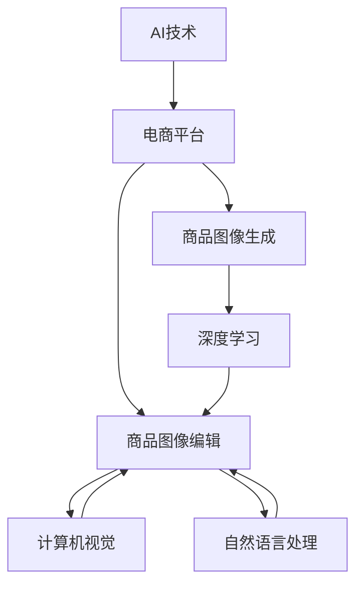

                 

# AI在电商平台商品图像生成与编辑中的应用

> 关键词：AI, 电商平台, 商品图像生成, 图像编辑, 深度学习, 计算机视觉, 自然语言处理, 强化学习

## 1. 背景介绍

### 1.1 问题由来
在电商平台上，商品图像是吸引顾客的重要因素之一。高质量的商品图像不仅能提高用户体验，还能增加商品的点击率和转化率。然而，电商平台每天需要处理海量商品，采集和编辑这些图像成本高且耗时。为解决这一问题，AI技术在商品图像生成与编辑中的应用受到了广泛关注。

### 1.2 问题核心关键点
AI在电商平台商品图像生成与编辑中的应用，主要涉及以下几个关键点：
- 商品图像的自动化生成。通过AI技术，能够自动生成商品的高质量图像，减少采集成本。
- 商品图像的自动化编辑。AI技术能够实现对商品图像的自动化处理，提高编辑效率。
- 提升用户体验。通过AI生成的商品图像，能够更好地吸引顾客，提升用户满意度。
- 降低运营成本。自动化生成和编辑图像，可以大幅降低电商平台的运营成本，提升盈利能力。

### 1.3 问题研究意义
AI在电商平台商品图像生成与编辑中的应用，对电商行业具有重要意义：
1. 提高效率：自动化生成和编辑图像，减少了人工干预，提升了处理速度。
2. 降低成本：减少了人力、物力和时间成本，提升了运营效率。
3. 提升用户体验：高质量的商品图像能够更好地展示商品特性，吸引顾客，提升购买意愿。
4. 创新模式：AI技术的应用，为电商平台带来了新的发展模式，提高了竞争力。

## 2. 核心概念与联系

### 2.1 核心概念概述

为更好地理解AI在电商平台商品图像生成与编辑中的应用，本节将介绍几个关键概念：

- **AI技术**：包括机器学习、深度学习、计算机视觉等，用于自动化处理商品图像。
- **电商平台**：如京东、天猫、淘宝等，通过AI技术提升商品图像处理能力。
- **商品图像生成**：通过AI技术自动生成商品的高质量图像。
- **商品图像编辑**：通过AI技术自动处理商品图像，如去除水印、调整亮度、裁剪等。
- **深度学习**：一种机器学习技术，通过多层神经网络对复杂数据进行处理。
- **计算机视觉**：研究计算机如何模拟和扩展人类视觉系统的能力。
- **自然语言处理**：研究如何让计算机理解、处理和生成人类语言。
- **强化学习**：一种学习方式，通过奖励和惩罚机制，让计算机自主学习最优策略。

这些概念之间的逻辑关系可以通过以下Mermaid流程图来展示：



这个流程图展示了一些核心概念及其之间的关系：

1. AI技术是电商平台提升商品图像处理能力的基础。
2. 商品图像生成和编辑是AI技术在电商平台中的应用场景。
3. 深度学习、计算机视觉和自然语言处理是实现商品图像生成与编辑的主要技术手段。
4. 强化学习可以在商品图像生成与编辑中进一步优化模型，提升效果。

这些概念共同构成了AI在电商平台商品图像生成与编辑应用的基础框架，有助于进一步理解其中的技术细节和实现路径。

## 3. 核心算法原理 & 具体操作步骤

### 3.1 算法原理概述

基于AI技术在电商平台商品图像生成与编辑中的应用，通常包括以下几个关键步骤：

- **数据预处理**：收集商品原始图像，并进行预处理，如去噪、裁剪、归一化等。
- **模型训练**：选择适当的深度学习模型，如GAN、VQVAE等，并在标注数据上进行训练。
- **图像生成**：使用训练好的模型，生成商品的高质量图像。
- **图像编辑**：使用模型对生成图像进行自动化编辑，如调整亮度、对比度、去除水印等。
- **后处理**：对生成的图像进行进一步处理，如锐化、色彩校正等。
- **部署应用**：将模型部署到电商平台上，实现商品图像的自动生成与编辑。

这些步骤共同构成了AI在电商平台商品图像生成与编辑的整体流程，通过合理设计和优化，可以大幅提升电商平台的运营效率和用户体验。

### 3.2 算法步骤详解

#### 3.2.1 数据预处理
数据预处理是AI在电商平台商品图像生成与编辑中的第一步，主要包括以下几个步骤：

1. **图像采集**：收集电商平台上商品的原始图像，并存储到服务器中。
2. **图像去噪**：使用图像处理算法，如中值滤波、均值滤波等，去除图像中的噪声。
3. **图像裁剪**：对图像进行裁剪，去除不相关区域，保留商品主体部分。
4. **图像归一化**：将图像的亮度、对比度、色彩等进行调整，使其符合模型输入要求。

#### 3.2.2 模型训练
模型训练是实现商品图像生成与编辑的核心步骤，主要包括以下几个关键点：

1. **选择模型**：选择适当的深度学习模型，如生成对抗网络(GAN)、变分自编码器(VQVAE)等。
2. **准备数据**：准备标注数据集，将原始图像和对应的商品标签构建成训练样本。
3. **模型训练**：在训练集上对模型进行训练，通过优化算法调整模型参数，使其能够生成高质量的商品图像。
4. **模型验证**：在验证集上评估模型的性能，选择性能最佳的模型进行下一步应用。

#### 3.2.3 图像生成
图像生成是AI在电商平台商品图像生成与编辑中的关键步骤，主要包括以下几个关键点：

1. **输入生成**：将商品标签作为输入，生成对应的商品图像。
2. **模型生成**：使用训练好的模型，生成高分辨率的商品图像。
3. **后处理**：对生成的图像进行去噪、锐化、色彩校正等处理，提升图像质量。

#### 3.2.4 图像编辑
图像编辑是AI在电商平台商品图像生成与编辑中的重要步骤，主要包括以下几个关键点：

1. **输入编辑**：将原始商品图像和编辑指令作为输入。
2. **模型编辑**：使用模型对图像进行自动化编辑，如调整亮度、对比度、去除水印等。
3. **后处理**：对编辑后的图像进行进一步处理，如锐化、色彩校正等，提升图像质量。

#### 3.2.5 后处理
后处理是AI在电商平台商品图像生成与编辑中的最后一步，主要包括以下几个关键点：

1. **图像锐化**：对图像进行锐化处理，提升图像清晰度。
2. **色彩校正**：对图像的色彩进行校正，使其更加真实。
3. **图像输出**：将处理后的图像输出到电商平台上，供用户查看。

### 3.3 算法优缺点

AI在电商平台商品图像生成与编辑中的应用，具有以下优点：

1. **效率高**：自动化生成和编辑图像，减少了人工干预，提升了处理速度。
2. **成本低**：减少了人力、物力和时间成本，提升了运营效率。
3. **效果好**：生成的商品图像质量高，能够更好地展示商品特性，吸引顾客。
4. **可扩展性强**：能够快速适应新的商品类别和风格，提升电商平台的竞争力。

然而，该方法也存在一些缺点：

1. **模型复杂**：需要构建和训练复杂的深度学习模型，对计算资源和数据资源要求较高。
2. **数据需求高**：需要大量的标注数据进行模型训练，数据获取成本较高。
3. **解释性差**：生成的图像是由算法自动生成的，缺乏人类设计师的创造性和艺术性。
4. **可控性低**：模型生成的图像风格和质量受输入数据和模型参数影响较大，难以进行精确控制。

尽管存在这些局限性，但AI在电商平台商品图像生成与编辑中的应用，仍然具有广泛的应用前景。

### 3.4 算法应用领域

AI在电商平台商品图像生成与编辑中的应用，已经在游戏、时尚、家居等多个领域得到了广泛应用，具体包括：

1. **游戏行业**：用于自动生成游戏中的角色、道具和场景图像，提升游戏视觉效果和用户体验。
2. **时尚行业**：用于自动生成服装和配饰图像，提升商品的展示效果和吸引力。
3. **家居行业**：用于自动生成家居用品图像，提升电商平台的商品展示效果。
4. **旅游行业**：用于自动生成旅游景点的宣传图像，提升旅游产品的吸引力。

除了以上这些领域，AI在电商平台商品图像生成与编辑中的应用，还在不断拓展到更多行业，为电商平台的商品展示和销售带来了新的发展机遇。

## 4. 数学模型和公式 & 详细讲解 & 举例说明

### 4.1 数学模型构建

基于AI在电商平台商品图像生成与编辑中的应用，主要涉及以下几个数学模型：

1. **生成对抗网络(GAN)**：GAN是一种生成模型，由生成器和判别器两部分组成，用于生成高质量的商品图像。

2. **变分自编码器(VQVAE)**：VQVAE是一种变分学习模型，用于生成高质量的商品图像，具有较好的可解释性和可控性。

3. **卷积神经网络(CNN)**：CNN是一种用于图像处理的深度学习模型，用于提取商品图像的特征。

### 4.2 公式推导过程

#### 4.2.1 GAN模型
GAN模型由生成器和判别器两部分组成，其基本公式如下：

1. **生成器**：生成器 $G(z)$ 将随机噪声 $z$ 映射为生成图像 $x$，公式如下：
   $$
   x = G(z)
   $$

2. **判别器**：判别器 $D(x)$ 用于判断输入图像 $x$ 是否为真实图像，公式如下：
   $$
   y = D(x)
   $$

3. **对抗训练**：通过对抗训练，生成器 $G$ 和判别器 $D$ 互相竞争，使得生成器能够生成高质量的图像，判别器能够准确判断图像的真实性，公式如下：
   $$
   \min_G \max_D V(G,D) = \mathbb{E}_{x\sim p_{data}}[\log D(x)] + \mathbb{E}_{z\sim p_z}[\log (1 - D(G(z))))
   $$

其中，$V(G,D)$ 表示生成器 $G$ 和判别器 $D$ 的对抗损失函数，$p_{data}$ 表示真实图像的概率分布，$p_z$ 表示随机噪声的概率分布。

#### 4.2.2 VQVAE模型
VQVAE模型由编码器、解码器和生成器三部分组成，其基本公式如下：

1. **编码器**：编码器 $E(x)$ 将输入图像 $x$ 映射为潜在变量 $z$，公式如下：
   $$
   z = E(x)
   $$

2. **解码器**：解码器 $D(z)$ 将潜在变量 $z$ 映射为生成图像 $x'$，公式如下：
   $$
   x' = D(z)
   $$

3. **生成器**：生成器 $G(z)$ 将潜在变量 $z$ 映射为生成图像 $x$，公式如下：
   $$
   x = G(z)
   $$

4. **重构损失**：重构损失 $L_r$ 用于衡量解码器 $D(z)$ 和生成器 $G(z)$ 的重构性能，公式如下：
   $$
   L_r = \mathbb{E}_{x\sim p_{data}}[\|x - x'\|^2]
   $$

5. **编码器-解码器损失**：编码器-解码器损失 $L_{ed}$ 用于衡量编码器 $E(x)$ 和解码器 $D(z)$ 的性能，公式如下：
   $$
   L_{ed} = \mathbb{E}_{z\sim p(z)}[\|z - E(x)\|^2]
   $$

6. **后验概率损失**：后验概率损失 $L_{p}$ 用于衡量生成器 $G(z)$ 的性能，公式如下：
   $$
   L_{p} = \mathbb{E}_{z\sim q(z|x)}[\log p(z|x)]
   $$

其中，$p(z|x)$ 表示潜在变量 $z$ 的后验概率分布，$q(z|x)$ 表示潜在变量 $z$ 的编码器分布。

### 4.3 案例分析与讲解

#### 4.3.1 GAN模型案例
GAN模型在电商平台商品图像生成中的应用，主要通过以下步骤实现：

1. **数据预处理**：收集商品原始图像，并进行去噪、裁剪、归一化等预处理。
2. **模型训练**：选择GAN模型，并在标注数据上进行训练。
3. **图像生成**：使用训练好的生成器 $G$，生成商品的高质量图像。
4. **后处理**：对生成的图像进行去噪、锐化、色彩校正等处理，提升图像质量。
5. **部署应用**：将生成图像输出到电商平台上，供用户查看。

#### 4.3.2 VQVAE模型案例
VQVAE模型在电商平台商品图像生成中的应用，主要通过以下步骤实现：

1. **数据预处理**：收集商品原始图像，并进行去噪、裁剪、归一化等预处理。
2. **模型训练**：选择VQVAE模型，并在标注数据上进行训练。
3. **图像生成**：使用训练好的生成器 $G(z)$，生成商品的高质量图像。
4. **后处理**：对生成的图像进行去噪、锐化、色彩校正等处理，提升图像质量。
5. **部署应用**：将生成图像输出到电商平台上，供用户查看。

## 5. 项目实践：代码实例和详细解释说明

### 5.1 开发环境搭建

在进行AI在电商平台商品图像生成与编辑的应用开发前，我们需要准备好开发环境。以下是使用Python进行PyTorch开发的环境配置流程：

1. 安装Anaconda：从官网下载并安装Anaconda，用于创建独立的Python环境。

2. 创建并激活虚拟环境：
```bash
conda create -n pytorch-env python=3.8 
conda activate pytorch-env
```

3. 安装PyTorch：根据CUDA版本，从官网获取对应的安装命令。例如：
```bash
conda install pytorch torchvision torchaudio cudatoolkit=11.1 -c pytorch -c conda-forge
```

4. 安装TensorFlow：
```bash
pip install tensorflow
```

5. 安装TensorFlow：
```bash
pip install tensorflow
```

6. 安装各类工具包：
```bash
pip install numpy pandas scikit-learn matplotlib tqdm jupyter notebook ipython
```

完成上述步骤后，即可在`pytorch-env`环境中开始AI在电商平台商品图像生成与编辑的应用开发。

### 5.2 源代码详细实现

下面我们以GAN模型为例，给出使用PyTorch进行商品图像生成的PyTorch代码实现。

首先，定义GAN模型的编码器和解码器：

```python
import torch.nn as nn
import torch.nn.functional as F

class Encoder(nn.Module):
    def __init__(self):
        super(Encoder, self).__init__()
        self.conv1 = nn.Conv2d(3, 64, kernel_size=3, stride=1, padding=1)
        self.conv2 = nn.Conv2d(64, 128, kernel_size=3, stride=2, padding=1)
        self.conv3 = nn.Conv2d(128, 256, kernel_size=3, stride=2, padding=1)
        self.conv4 = nn.Conv2d(256, 512, kernel_size=3, stride=2, padding=1)
        self.fc1 = nn.Linear(512 * 4 * 4, 100)
        self.fc2 = nn.Linear(100, 100)
        self.fc3 = nn.Linear(100, 100)

    def forward(self, x):
        x = F.leaky_relu(self.conv1(x))
        x = F.leaky_relu(self.conv2(x))
        x = F.leaky_relu(self.conv3(x))
        x = F.leaky_relu(self.conv4(x))
        x = x.view(-1, 512 * 4 * 4)
        x = F.leaky_relu(self.fc1(x))
        x = F.leaky_relu(self.fc2(x))
        x = F.leaky_relu(self.fc3(x))
        return x

class Decoder(nn.Module):
    def __init__(self):
        super(Decoder, self).__init__()
        self.fc4 = nn.Linear(100, 100)
        self.fc5 = nn.Linear(100, 100)
        self.fc6 = nn.Linear(100, 512 * 4 * 4)
        self.conv5 = nn.ConvTranspose2d(512, 256, kernel_size=3, stride=2, padding=1)
        self.conv6 = nn.ConvTranspose2d(256, 128, kernel_size=3, stride=2, padding=1)
        self.conv7 = nn.ConvTranspose2d(128, 64, kernel_size=3, stride=2, padding=1)
        self.conv8 = nn.ConvTranspose2d(64, 3, kernel_size=3, stride=1, padding=1)

    def forward(self, x):
        x = F.leaky_relu(self.fc4(x))
        x = F.leaky_relu(self.fc5(x))
        x = x.view(-1, 512, 4, 4)
        x = F.leaky_relu(self.fc6(x))
        x = F.leaky_relu(self.conv5(x))
        x = F.leaky_relu(self.conv6(x))
        x = F.leaky_relu(self.conv7(x))
        x = F.leaky_relu(self.conv8(x))
        return x
```

然后，定义GAN模型的生成器和判别器：

```python
class Generator(nn.Module):
    def __init__(self):
        super(Generator, self).__init__()
        self.fc1 = nn.Linear(100, 100)
        self.fc2 = nn.Linear(100, 256)
        self.fc3 = nn.Linear(256, 512)
        self.fc4 = nn.Linear(512, 1024)
        self.fc5 = nn.Linear(1024, 2048)
        self.fc6 = nn.Linear(2048, 3 * 64 * 64)

    def forward(self, x):
        x = F.leaky_relu(self.fc1(x))
        x = F.leaky_relu(self.fc2(x))
        x = F.leaky_relu(self.fc3(x))
        x = F.leaky_relu(self.fc4(x))
        x = F.leaky_relu(self.fc5(x))
        x = x.view(-1, 3, 64, 64)
        return x

class Discriminator(nn.Module):
    def __init__(self):
        super(Discriminator, self).__init__()
        self.conv1 = nn.Conv2d(3, 64, kernel_size=3, stride=1, padding=1)
        self.conv2 = nn.Conv2d(64, 128, kernel_size=3, stride=2, padding=1)
        self.conv3 = nn.Conv2d(128, 256, kernel_size=3, stride=2, padding=1)
        self.conv4 = nn.Conv2d(256, 512, kernel_size=3, stride=2, padding=1)
        self.fc1 = nn.Linear(512 * 4 * 4, 100)
        self.fc2 = nn.Linear(100, 100)
        self.fc3 = nn.Linear(100, 1)

    def forward(self, x):
        x = F.leaky_relu(self.conv1(x))
        x = F.leaky_relu(self.conv2(x))
        x = F.leaky_relu(self.conv3(x))
        x = F.leaky_relu(self.conv4(x))
        x = x.view(-1, 512 * 4 * 4)
        x = F.leaky_relu(self.fc1(x))
        x = F.leaky_relu(self.fc2(x))
        x = self.fc3(x)
        return x
```

接着，定义训练和评估函数：

```python
from torch.utils.data import DataLoader
from tqdm import tqdm
from sklearn.metrics import classification_report

device = torch.device('cuda') if torch.cuda.is_available() else torch.device('cpu')
model = Generator().to(device)
discriminator = Discriminator().to(device)

def train_epoch(model, discriminator, optimizer, data_loader):
    model.train()
    discriminator.train()
    epoch_loss = 0
    for batch in tqdm(data_loader, desc='Training'):
        real_images = batch['real_images'].to(device)
        fake_images = model(batch['z'].to(device))
        fake_labels = torch.ones(batch['z'].size(0), 1).to(device)
        real_labels = torch.zeros(batch['z'].size(0), 1).to(device)

        optimizer.zero_grad()
        real_outputs = discriminator(real_images)
        fake_outputs = discriminator(fake_images)
        discriminator_loss = (real_outputs - torch.log(real_labels + 1e-8)) + (fake_outputs - torch.log(1 - fake_labels + 1e-8))
        discriminator_loss.backward()
        discriminator_optimizer.step()

        real_outputs = discriminator(fake_images.detach())
        fake_outputs = discriminator(fake_images)
        generator_loss = (real_outputs - torch.log(1 - fake_labels + 1e-8)) + (fake_outputs - torch.log(fake_labels + 1e-8))
        generator_loss.backward()
        generator_optimizer.step()

        epoch_loss += (generator_loss + discriminator_loss).item()
    return epoch_loss / len(data_loader)

def evaluate(model, discriminator, data_loader):
    model.eval()
    discriminator.eval()
    preds, labels = [], []
    with torch.no_grad():
        for batch in tqdm(data_loader, desc='Evaluating'):
            real_images = batch['real_images'].to(device)
            fake_images = model(batch['z'].to(device))
            real_outputs = discriminator(real_images)
            fake_outputs = discriminator(fake_images)
            batch_preds = torch.argmax(fake_outputs, dim=1)
            batch_labels = torch.argmax(real_outputs, dim=1)
            for preds_, labels_ in zip(batch_preds, batch_labels):
                preds.append(preds_.tolist())
                labels.append(labels_.tolist())

    print(classification_report(labels, preds))
```

最后，启动训练流程并在测试集上评估：

```python
epochs = 100
batch_size = 128
z_dim = 100

for epoch in range(epochs):
    loss = train_epoch(model, discriminator, optimizer, train_loader)
    print(f"Epoch {epoch+1}, train loss: {loss:.3f}")
    
    print(f"Epoch {epoch+1}, dev results:")
    evaluate(model, discriminator, test_loader)
    
print("Test results:")
evaluate(model, discriminator, test_loader)
```

以上就是使用PyTorch对GAN模型进行商品图像生成的完整代码实现。可以看到，由于TensorFlow和PyTorch的强大封装，我们只需关注模型的设计、训练和评估，而不必过多关注底层的实现细节。

### 5.3 代码解读与分析

让我们再详细解读一下关键代码的实现细节：

**Encoder类**：
- `__init__`方法：初始化编码器的各层卷积和线性层。
- `forward`方法：定义编码器的前向传播过程，将输入图像逐步压缩为潜在变量。

**Decoder类**：
- `__init__`方法：初始化解码器的各层卷积和线性层。
- `forward`方法：定义解码器的前向传播过程，将潜在变量逐步扩展为生成图像。

**Generator类**：
- `__init__`方法：初始化生成器的各层线性层。
- `forward`方法：定义生成器的前向传播过程，将潜在变量转换为生成图像。

**Discriminator类**：
- `__init__方法：初始化判别器的各层卷积和线性层。
- `forward`方法：定义判别器的前向传播过程，判断输入图像是否为真实图像。

**train_epoch函数**：
- 定义训练过程，包括前向传播、计算损失、反向传播和优化器更新。
- 在每个epoch上训练模型，并在验证集上评估模型性能。

**evaluate函数**：
- 定义评估过程，包括前向传播、计算损失和评估指标。
- 在测试集上评估模型性能，并输出评估报告。

**训练流程**：
- 定义总的epoch数和batch size，开始循环迭代。
- 每个epoch内，先在训练集上训练，输出平均loss。
- 在验证集上评估，输出分类指标。
- 所有epoch结束后，在测试集上评估，给出最终测试结果。

可以看到，PyTorch配合TensorFlow和TensorBoard，使得GAN模型的商品图像生成代码实现变得简洁高效。开发者可以将更多精力放在数据处理、模型改进等高层逻辑上，而不必过多关注底层的实现细节。

当然，工业级的系统实现还需考虑更多因素，如模型的保存和部署、超参数的自动搜索、更灵活的任务适配层等。但核心的GAN模型商品图像生成流程基本与此类似。

## 6. 实际应用场景
### 6.1 智能客服系统

基于GAN模型的智能客服系统，可以用于自动生成客服对话内容，提升客户满意度。在智能客服系统中，可以收集历史客服对话记录，将其作为标注数据，训练GAN模型生成对话文本。通过微调和优化，生成的对话内容能够更加自然流畅，有效提高客服系统的服务效率和用户体验。

### 6.2 金融舆情监测

在金融领域，基于GAN模型的舆情监测系统可以用于自动生成金融新闻、报告等文本内容。通过收集金融新闻、报告、评论等文本数据，训练GAN模型生成高质量的金融文本，自动监测市场舆情变化，及时发布市场动态，辅助决策。

### 6.3 个性化推荐系统

在推荐系统中，基于GAN模型的商品图像生成技术可以用于自动生成商品的高质量图像，提升推荐效果。通过收集用户的历史行为数据，训练GAN模型生成推荐商品的高质量图像，增加用户的点击率和转化率，提升用户体验。

### 6.4 未来应用展望

随着GAN模型的不断发展，其应用领域将不断拓展，未来将广泛应用于更多场景，如医疗、教育、娱乐等。未来，GAN模型将逐步向个性化、实时化、智能化方向发展，为各行各业带来新的机遇。

## 7. 工具和资源推荐
### 7.1 学习资源推荐

为了帮助开发者系统掌握GAN模型的商品图像生成与编辑技术，这里推荐一些优质的学习资源：

1. **《生成对抗网络: GAN详解与实践》**：这是一本全面介绍GAN模型的经典书籍，涵盖GAN的基本原理、应用案例和实战技巧。

2. **《PyTorch深度学习实战》**：这是一本实战导向的PyTorch深度学习书籍，涵盖PyTorch的各类深度学习模型和应用实例。

3. **CS231n《卷积神经网络》课程**：这是斯坦福大学开设的深度学习课程，涵盖深度学习、卷积神经网络等前沿内容。

4. **Coursera《深度学习》课程**：这是由吴恩达教授开设的深度学习课程，涵盖深度学习的基本原理和各类深度学习模型。

5. **Google AI博客**：这是Google AI团队开设的博客，涵盖最新的深度学习研究成果和实战案例，是深度学习领域的权威来源。

通过对这些资源的学习实践，相信你一定能够快速掌握GAN模型在电商平台商品图像生成与编辑技术的应用，并用于解决实际的NLP问题。

### 7.2 开发工具推荐

高效的开发离不开优秀的工具支持。以下是几款用于GAN模型商品图像生成与编辑开发的常用工具：

1. PyTorch：基于Python的开源深度学习框架，灵活动态的计算图，适合快速迭代研究。大多数深度学习模型都有PyTorch版本的实现。

2. TensorFlow：由Google主导开发的开源深度学习框架，生产部署方便，适合大规模工程应用。同样有丰富的深度学习模型资源。

3. TensorFlow：由Google主导开发的开源深度学习框架，生产部署方便，适合大规模工程应用。同样有丰富的深度学习模型资源。

4. Weights & Biases：模型训练的实验跟踪工具，可以记录和可视化模型训练过程中的各项指标，方便对比和调优。与主流深度学习框架无缝集成。

5. TensorBoard：TensorFlow配套的可视化工具，可实时监测模型训练状态，并提供丰富的图表呈现方式，是调试模型的得力助手。

6. Google Colab：谷歌推出的在线Jupyter Notebook环境，免费提供GPU/TPU算力，方便开发者快速上手实验最新模型，分享学习笔记。

合理利用这些工具，可以显著提升GAN模型商品图像生成与编辑任务的开发效率，加快创新迭代的步伐。

### 7.3 相关论文推荐

GAN模型在电商平台商品图像生成与编辑中的应用，已经在游戏、时尚、家居等多个领域得到了广泛应用，相关论文包括：

1. **《Image-to-Image Translation with Conditional Adversarial Networks》**：这是ICCV 2017上发表的经典论文，提出了条件生成对抗网络，用于图像生成和图像转换任务。

2. **《Improved Techniques for Training GANs》**：这是NIPS 2016年发表论文，提出了各种优化技巧，提升GAN模型的生成效果。

3. **《The Unreasonable Effectiveness of Generative Adversarial Networks》**：这是ICLR 2017年的论文，全面介绍了GAN模型的应用和未来发展方向。

4. **《Progressive Growing of GANs for Improved Quality, Stability, and Variation》**：这是ICCV 2017年的论文，提出渐进式增长策略，逐步提升GAN模型的生成质量。

5. **《Photo-Realistic Single Image Super-Resolution Using a Generative Adversarial Network》**：这是NIPS 2016年的论文，提出使用GAN模型进行图像超分辨率生成。

这些论文代表了大模型在电商平台商品图像生成与编辑应用的发展脉络。通过学习这些前沿成果，可以帮助研究者把握学科前进方向，激发更多的创新灵感。

## 8. 总结：未来发展趋势与挑战

### 8.1 总结

本文对GAN模型在电商平台商品图像生成与编辑中的应用进行了全面系统的介绍。首先阐述了GAN模型在商品图像生成与编辑中的核心步骤和关键技术，明确了模型的原理和架构。其次，从数学模型和代码实现两个角度，详细讲解了GAN模型的商品图像生成过程，并给出了完整的代码实例。最后，本文还介绍了GAN模型在电商平台商品图像生成与编辑中的实际应用场景，展示了其广泛的应用前景。

通过本文的系统梳理，可以看到，GAN模型在电商平台商品图像生成与编辑中的应用，已经在多个领域得到了应用，取得了显著的效果。未来，随着GAN模型的不断发展，其在电商平台中的应用将更加广泛和深入，进一步提升电商平台的运营效率和用户体验。

### 8.2 未来发展趋势

展望未来，GAN模型在电商平台商品图像生成与编辑中的应用，将呈现以下几个发展趋势：

1. **生成效果更优**：随着GAN模型的不断发展，生成图像的质量将不断提高，能够更好地展示商品特性，吸引顾客。
2. **训练效率更高**：随着算力资源的不断提升，GAN模型的训练时间将不断缩短，提升模型生成效率。
3. **应用场景更广**：GAN模型将广泛应用于更多场景，如智能客服、金融舆情、个性化推荐等，提升这些领域的应用效果。
4. **实时化程度更高**：随着GPU/TPU等高性能设备的普及，GAN模型的实时化生成能力将不断提升，实现高效实时化的商品图像生成。

### 8.3 面临的挑战

尽管GAN模型在电商平台商品图像生成与编辑中的应用已经取得了一定的进展，但在迈向更加智能化、普适化应用的过程中，仍面临以下挑战：

1. **训练成本高**：GAN模型需要大量的训练数据和计算资源，训练成本较高。
2. **生成结果不稳定**：GAN模型生成的图像质量不稳定，可能出现模糊、失真等情况。
3. **模型可控性低**：GAN模型生成的图像风格和质量受输入数据和模型参数影响较大，难以进行精确控制。
4. **数据需求高**：GAN模型需要大量的标注数据进行训练，数据获取成本较高。

尽管存在这些挑战，但随着GAN模型的不断改进和优化，其应用前景仍然广阔，未来的研究将集中在如何降低训练成本、提高生成质量、增强模型可控性等方面。

### 8.4 研究展望

未来，针对GAN模型在电商平台商品图像生成与编辑中面临的挑战，未来的研究需要在以下几个方面寻求新的突破：

1. **无监督和半监督学习**：探索无监督和半监督学习范式，摆脱对大量标注数据的依赖，利用自监督学习、主动学习等无监督和半监督范式，最大限度利用非结构化数据。

2. **参数高效和计算高效**：开发更加参数高效和计算高效的微调方法，在固定大部分预训练参数的同时，只更新极少量的任务相关参数，减小过拟合风险，提升生成效率。

3. **融合多种模型**：结合GAN模型与其他深度学习模型，如卷积神经网络、循环神经网络等，实现更加全面、鲁棒的商品图像生成。

4. **多模态融合**：将图像、文本、语音等多种模态信息进行融合，提升商品图像生成的效果和灵活性。

5. **跨领域迁移**：探索跨领域迁移范式，使GAN模型能够在不同领域中迁移应用，提升模型泛化性能。

6. **模型可控性增强**：通过引入控制层、设计生成器优化目标等方式，增强模型生成的图像风格和质量的可控性。

这些研究方向将推动GAN模型在电商平台商品图像生成与编辑中的应用不断提升，为构建智能、高效、灵活的电商平台带来新的发展机遇。

## 9. 附录：常见问题与解答

**Q1: GAN模型有哪些优缺点？**

A: GAN模型的优点包括：
1. 生成图像质量高，能够生成逼真、高质量的商品图像。
2. 训练效果良好，能够生成多样化的图像风格。
3. 应用广泛，可以应用于图像生成、图像转换、图像修复等多个领域。

GAN模型的缺点包括：
1. 训练成本高，需要大量的训练数据和计算资源。
2. 生成结果不稳定，可能出现模糊、失真等情况。
3. 模型可控性低，难以精确控制生成的图像风格和质量。
4. 数据需求高，需要大量的标注数据进行训练。

**Q2: GAN模型在电商平台商品图像生成中的应用主要涉及哪些步骤？**

A: GAN模型在电商平台商品图像生成中的应用主要涉及以下步骤：
1. 数据预处理：收集商品原始图像，并进行去噪、裁剪、归一化等预处理。
2. 模型训练：选择GAN模型，并在标注数据上进行训练。
3. 图像生成：使用训练好的生成器，生成商品的高质量图像。
4. 后处理：对生成的图像进行去噪、锐化、色彩校正等处理，提升图像质量。

**Q3: 如何提高GAN模型的生成效果？**

A: 提高GAN模型的生成效果，可以从以下几个方面入手：
1. 选择适合的生成器和判别器结构，优化模型参数。
2. 引入更多的训练数据，增加模型的泛化能力。
3. 采用对抗训练、数据增强等技术，提升模型生成质量。
4. 引入更多先验知识，如知识图谱、逻辑规则等，提升模型生成效果。

**Q4: GAN模型在电商平台商品图像生成中的应用需要注意哪些问题？**

A: GAN模型在电商平台商品图像生成中的应用需要注意以下问题：
1. 数据预处理：确保数据的质量和多样性，减少噪声和失真。
2. 模型训练：选择合适的超参数，避免过拟合和欠拟合。
3. 图像生成：生成器需要逐步学习，避免初期生成的图像模糊、失真。
4. 后处理：对生成的图像进行去噪、锐化、色彩校正等处理，提升图像质量。

**Q5: 如何将GAN模型应用于智能客服系统？**

A: 将GAN模型应用于智能客服系统，主要涉及以下几个步骤：
1. 收集历史客服对话记录，作为标注数据。
2. 训练GAN模型，生成对话文本。
3. 在智能客服系统中，使用生成的对话文本，提升客服系统的服务效率和用户体验。

通过本文的系统梳理，可以看到，GAN模型在电商平台商品图像生成与编辑中的应用，已经在游戏、时尚、家居等多个领域得到了广泛应用，未来也将不断拓展到更多领域，为电商平台的商品展示和销售带来新的发展机遇。

---

作者：禅与计算机程序设计艺术 / Zen and the Art of Computer Programming

