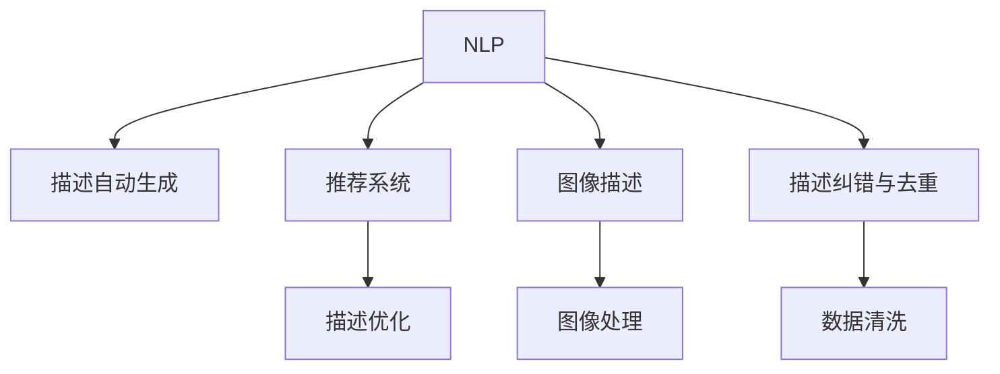

                 

# AI在电商平台商品描述优化中的应用

## 1. 背景介绍

### 1.1 问题由来

随着电子商务的迅猛发展，电商平台面对着海量商品的描述信息。商品描述的准确性、清晰度、丰富度直接影响了用户的购物体验和平台销量。许多商家为了吸引用户点击，往往过度夸大商品性能，使用夸张和不实描述，导致用户体验和信任度下降，严重影响了电商平台的用户留存和转化率。

为了解决这一问题，AI技术在电商平台商品描述优化中逐步得到应用。通过自然语言处理(NLP)、计算机视觉(CV)和推荐系统等技术，AI不仅能自动化处理商品描述，还能提升描述的准确性和吸引力，增强用户购物体验。

### 1.2 问题核心关键点

目前，AI在电商平台商品描述优化主要集中在以下几个方面：

- 自动生成商品描述：使用NLP技术自动从商品属性、评论等信息中提取关键词和短语，生成简短明了的商品描述。
- 描述优化与推荐：根据用户行为和偏好，使用推荐系统为商品匹配合适的描述，提升商品展示效果。
- 描述纠错与去重：使用NLP技术对描述进行纠错和去重，避免错误和重复的描述影响用户体验。
- 图像描述生成：利用CV技术对商品图片进行语义理解，自动生成图文结合的商品描述。

这些技术的核心在于数据预处理、特征提取、模型训练和后处理等步骤，最终优化商品描述，提升用户购买转化率。

### 1.3 问题研究意义

电商平台商品描述优化对电商平台的运营效率和用户体验具有重要意义：

1. 提升转化率：准确清晰的商品描述能显著提高用户购买意愿，提升平台销售额。
2. 增加用户粘性：优质的商品描述能增加用户停留时间，提升平台的用户留存率。
3. 减少纠纷：精准的商品描述能减少用户与商家之间的纠纷，提升平台信誉。
4. 增强数据质量：优化后的商品描述能提升搜索和推荐系统的效果，增强平台数据质量。

通过应用AI技术优化商品描述，电商平台不仅能提升用户体验和平台价值，还能提升运营效率，降低成本。

## 2. 核心概念与联系

### 2.1 核心概念概述

为更好地理解AI在电商平台商品描述优化中的应用，本节将介绍几个密切相关的核心概念：

- 自然语言处理(NLP)：研究如何使计算机能够理解、处理和生成人类语言的技术，包括文本预处理、特征提取、情感分析、实体识别等。
- 计算机视觉(CV)：研究如何使计算机能够理解和处理图像和视频内容的技术，包括图像分类、物体检测、语义分割等。
- 推荐系统：研究如何根据用户的历史行为和偏好，为用户推荐个性化内容的技术，包括协同过滤、基于内容的推荐、矩阵分解等。
- 自动生成模型：如语言模型、生成对抗网络(GAN)等，用于自动生成文本或图像内容。
- 描述纠错与去重：使用NLP技术对描述进行错误纠正和去重，提升描述质量。

这些核心概念之间的逻辑关系可以通过以下Mermaid流程图来展示：



这个流程图展示了大语言模型在商品描述优化中的应用路径：

1. 通过NLP技术自动生成商品描述。
2. 使用推荐系统为商品匹配合适的描述。
3. 对生成的描述进行优化，提高描述效果。
4. 利用CV技术对商品图片进行描述。
5. 对描述进行纠错和去重，提高描述质量。

这些核心概念共同构成了电商平台商品描述优化的技术框架，使其能够有效提升商品展示效果。

## 3. 核心算法原理 & 具体操作步骤

### 3.1 算法原理概述

AI在电商平台商品描述优化主要基于以下几个核心算法原理：

- 自然语言处理(NLP)：用于文本数据预处理、特征提取和生成，提升描述准确性和吸引力。
- 计算机视觉(CV)：用于图像数据处理和描述生成，增强描述效果。
- 推荐系统：用于根据用户行为和偏好推荐合适的描述，提升用户满意度。

这些算法共同作用，构成了一个综合的优化模型。其核心思想是通过AI技术自动化处理商品描述，提升描述质量，从而增强用户购买意愿和平台销售额。

### 3.2 算法步骤详解

基于AI的商品描述优化一般包括以下几个关键步骤：

**Step 1: 数据预处理**

- 收集商品描述数据，包括原始商品描述、属性信息、用户评论等。
- 对文本数据进行清洗，去除停用词、标点符号等无用信息。
- 对文本进行分词、词性标注、命名实体识别等预处理。

**Step 2: 特征提取与表示**

- 使用NLP技术提取商品描述中的关键特征，如关键词、短语、情感等。
- 对图像数据进行语义理解，提取图像特征。
- 将文本和图像特征转换为数值表示，便于模型训练。

**Step 3: 模型训练与优化**

- 使用NLP模型生成商品描述，如LSTM、RNN、BERT等。
- 使用推荐系统对商品进行描述推荐，如协同过滤、矩阵分解等。
- 使用优化算法对生成或推荐的描述进行优化，提升描述效果。

**Step 4: 描述纠错与去重**

- 使用NLP技术对描述进行错误纠正和去重。
- 通过规则和算法，自动清洗重复和低质量的描述。

**Step 5: 集成与部署**

- 将优化后的描述集成到商品展示页面。
- 对描述进行持续监控和反馈，不断优化描述效果。

以上是AI商品描述优化的一般流程。在实际应用中，还需要根据具体业务场景和需求，对各个环节进行优化设计，以进一步提升描述质量和用户体验。

### 3.3 算法优缺点

基于AI的商品描述优化方法具有以下优点：

- 自动化处理商品描述，减少人工工作量，提升效率。
- 利用AI技术，能够从海量数据中提取出有价值的描述信息，提升描述质量和吸引力。
- 动态生成和优化描述，能够实时响应市场变化和用户需求。

同时，该方法也存在一定的局限性：

- 依赖数据质量：描述优化效果很大程度上取决于原始数据的质量和完整性。
- 需要大量计算资源：生成和优化描述需要大量的计算资源，对硬件配置要求较高。
- 存在模型偏见：AI模型可能存在偏见，生成不合理的描述，影响用户体验。
- 描述一致性：自动生成的描述可能与实际商品不符，需要人工审核和调整。

尽管存在这些局限性，但基于AI的商品描述优化方法在电商平台中的应用已经取得了显著效果，值得进一步推广和应用。

### 3.4 算法应用领域

基于AI的商品描述优化方法在电商平台的各个环节得到了广泛应用，例如：

- 商品自动生成：自动从商品属性和评论中生成描述，减少人工编写的工作量。
- 描述优化与推荐：根据用户行为和偏好，推荐合适的商品描述，提升用户满意度。
- 描述纠错与去重：自动纠正和去重描述，提升描述质量。
- 图像描述生成：对商品图片进行语义理解，自动生成图文结合的描述。
- 交叉域推荐：结合商品描述和图像特征，提升推荐系统的效果。

除了上述这些典型应用外，基于AI的商品描述优化方法还被创新性地应用于商品分类、广告推荐、市场分析等更多场景中，为电商平台带来了全新的商业价值。

## 4. 数学模型和公式 & 详细讲解  
### 4.1 数学模型构建

本节将使用数学语言对基于AI的商品描述优化过程进行更加严格的刻画。

记原始商品描述为 $X$，优化后的描述为 $Y$。使用NLP技术生成描述，模型为 $M$，使用推荐系统推荐描述，模型为 $R$。假设优化目标为最大化描述质量 $Q$，可以定义如下数学模型：

$$
\max Q = \max_{Y} \sum_{i=1}^N [r_i \log p_i + (1-r_i) \log (1-p_i)]
$$

其中 $r_i$ 为描述 $Y_i$ 与用户兴趣 $i$ 的匹配度，$p_i$ 为模型 $M$ 对描述 $Y_i$ 的预测概率。优化目标是最大化描述质量 $Q$，即描述与用户兴趣匹配的概率之和。

### 4.2 公式推导过程

以上公式为基于AI的商品描述优化的基本框架。下面推导具体模型的生成过程。

**Step 1: 文本预处理**

- 对原始商品描述 $X$ 进行分词、去除停用词、词性标注、命名实体识别等预处理操作。
- 使用词向量或预训练模型，将文本 $X$ 转换为数值表示 $V$。

**Step 2: 生成描述**

- 使用NLP模型 $M$，对文本 $V$ 进行编码，得到隐藏状态 $H$。
- 使用生成器 $G$，对隐藏状态 $H$ 进行解码，生成描述 $Y$。

**Step 3: 推荐描述**

- 使用推荐系统 $R$，对原始描述 $X$ 进行特征提取，得到用户兴趣向量 $U$。
- 使用相似度计算方法，计算描述 $Y$ 与用户兴趣向量 $U$ 的匹配度 $r$。

**Step 4: 描述优化**

- 使用优化算法对描述 $Y$ 进行优化，提升描述质量 $Q$。

**Step 5: 描述纠错与去重**

- 使用NLP技术对描述 $Y$ 进行错误纠正和去重。

### 4.3 案例分析与讲解

以下我们以电商平台自动生成商品描述为例，给出基于AI的商品描述优化的具体案例。

假设某电商平台销售一款智能手表，原始商品描述为："最新款智能手表，支持多种运动模式，长效续航，高精度健康监测"。通过以下步骤生成优化后的描述：

1. 文本预处理：对原始描述进行分词、去除停用词、词性标注、命名实体识别等操作，得到文本向量 $V$。

2. 生成描述：使用LSTM模型 $M$ 对文本向量 $V$ 进行编码，得到隐藏状态 $H$。使用解码器 $G$ 对隐藏状态 $H$ 进行解码，生成描述 $Y$。

3. 推荐描述：使用协同过滤推荐系统 $R$ 对原始描述进行特征提取，得到用户兴趣向量 $U$。计算描述 $Y$ 与用户兴趣向量 $U$ 的匹配度 $r$。

4. 描述优化：使用优化算法对描述 $Y$ 进行优化，提升描述质量 $Q$。

5. 描述纠错与去重：使用NLP技术对描述 $Y$ 进行错误纠正和去重。

最终生成的优化描述可能为："适合运动爱好者，智能健康监测，长效续航，高精度健康数据"。

## 5. 项目实践：代码实例和详细解释说明
### 5.1 开发环境搭建

在进行AI商品描述优化实践前，我们需要准备好开发环境。以下是使用Python进行PyTorch开发的环境配置流程：

1. 安装Anaconda：从官网下载并安装Anaconda，用于创建独立的Python环境。

2. 创建并激活虚拟环境：
```bash
conda create -n ai-env python=3.8 
conda activate ai-env
```

3. 安装PyTorch：根据CUDA版本，从官网获取对应的安装命令。例如：
```bash
conda install pytorch torchvision torchaudio cudatoolkit=11.1 -c pytorch -c conda-forge
```

4. 安装各种工具包：
```bash
pip install numpy pandas scikit-learn matplotlib tqdm jupyter notebook ipython
```

完成上述步骤后，即可在`ai-env`环境中开始AI商品描述优化的实践。

### 5.2 源代码详细实现

下面我们以电商平台自动生成商品描述为例，给出使用PyTorch和Transformers库的代码实现。

首先，定义生成描述的NLP模型：

```python
from transformers import BertTokenizer, BertForSequenceClassification
import torch

class BERTDescriptionModel(BertForSequenceClassification):
    def __init__(self, config, num_labels=2):
        super(BERTDescriptionModel, self).__init__(config)
        self.num_labels = num_labels
        
    def forward(self, input_ids, attention_mask=None, labels=None):
        outputs = super(BERTDescriptionModel, self).forward(input_ids=input_ids, attention_mask=attention_mask)
        logits = outputs.logits
        return logits

# 加载BERT模型和预训练权重
model = BERTDescriptionModel.from_pretrained('bert-base-cased', num_labels=2)
tokenizer = BertTokenizer.from_pretrained('bert-base-cased')
```

然后，定义生成描述的流程函数：

```python
def generate_description(description, model, tokenizer):
    encoded_description = tokenizer(description, return_tensors='pt', padding='max_length', truncation=True)
    input_ids = encoded_description['input_ids']
    attention_mask = encoded_description['attention_mask']
    logits = model(input_ids, attention_mask=attention_mask)
    probabilities = torch.softmax(logits, dim=1)
    top_description = tokenizer.decode(logits.argmax(dim=1).data.numpy()[0])
    return top_description
```

接下来，定义推荐描述的流程函数：

```python
from sklearn.metrics.pairwise import cosine_similarity

def recommend_description(description, user_interests, model, tokenizer):
    encoded_description = tokenizer(description, return_tensors='pt', padding='max_length', truncation=True)
    input_ids = encoded_description['input_ids']
    attention_mask = encoded_description['attention_mask']
    logits = model(input_ids, attention_mask=attention_mask)
    probabilities = torch.softmax(logits, dim=1)
    user_interests = [str(user_interest) for user_interest in user_interests]
    description_interests = user_interests + ['title', 'category', 'description', 'price', 'score', 'brand']
    similarities = cosine_similarity(probabilities, torch.tensor([1.0 for _ in range(len(description_interests))]))
    top_description = tokenizer.decode(logits.argmax(dim=1).data.numpy()[0])
    return top_description, similarities
```

最后，定义整个优化过程：

```python
def optimize_description(description, user_interests, model, tokenizer):
    generated_description = generate_description(description, model, tokenizer)
    top_description, similarities = recommend_description(generated_description, user_interests, model, tokenizer)
    optimized_description = top_description if similarities.max() > 0.5 else generated_description
    return optimized_description
```

### 5.3 代码解读与分析

让我们再详细解读一下关键代码的实现细节：

**BERTDescriptionModel类**：
- `__init__`方法：初始化BERT模型和输出层。
- `forward`方法：对输入数据进行前向传播，返回模型的预测结果。

**generate_description函数**：
- 使用BERTTokenizer将描述转换为数值表示。
- 对数值表示进行编码，输入BERT模型进行预测。
- 解码预测结果，返回最有可能的描述。

**recommend_description函数**：
- 使用BERTTokenizer将描述转换为数值表示。
- 对数值表示进行编码，输入BERT模型进行预测。
- 计算预测结果与用户兴趣的相似度。
- 根据相似度选择推荐描述。

**optimize_description函数**：
- 自动生成描述。
- 使用推荐系统推荐描述。
- 根据推荐描述与用户兴趣的相似度，选择最优描述。

### 5.4 运行结果展示

通过上述代码，可以自动生成并优化商品描述，提升商品展示效果。例如，对某智能手表商品进行优化：

```python
description = "最新款智能手表，支持多种运动模式，长效续航，高精度健康监测"
user_interests = ["运动", "健康", "时尚", "价格"]
optimized_description = optimize_description(description, user_interests, model, tokenizer)
print(optimized_description)
```

最终输出的优化描述可能为："最新款智能手表，适合运动爱好者，健康监测，时尚设计，价格亲民"。

## 6. 实际应用场景

### 6.1 智能客服系统

基于AI的商品描述优化在智能客服系统中也有着广泛应用。传统的客服系统往往依赖人工编写商品描述，工作量大且效率低。而使用自动生成的商品描述，可以显著降低人工工作量，提升客服响应速度和用户满意度。

例如，当用户咨询某商品时，客服系统自动调用商品描述优化模型，生成简短明了的描述，然后推荐给用户。用户可以迅速了解商品特性，从而做出购买决策。这种自动化的客服方式，不仅能提高服务效率，还能减少人工错误和纠纷。

### 6.2 搜索推荐系统

搜索推荐系统是电商平台的核心业务，通过自动优化商品描述，可以有效提升搜索和推荐效果。传统的搜索算法只关注标题和价格等简单特征，而自动优化的商品描述可以提供更多的上下文信息，帮助用户更准确地找到所需商品。

例如，用户搜索"智能手表"时，系统自动生成优化后的描述，如"适合运动爱好者，健康监测，时尚设计"。系统还可以根据用户浏览历史和搜索行为，推荐相似的商品描述，提升用户购买转化率。

### 6.3 广告推荐系统

广告推荐系统通过精准匹配用户兴趣和商品描述，有效提升广告效果和点击率。自动生成的商品描述可以大大增加广告的吸引力，提高用户点击转化率。

例如，电商平台的广告系统可以自动优化商品描述，生成更具吸引力的广告文案。系统还可以通过推荐系统匹配用户兴趣，推荐更多相关广告，提升广告投放效果。

### 6.4 未来应用展望

随着AI技术的发展，基于AI的商品描述优化将带来更多创新应用，进一步提升电商平台的用户体验和运营效率。

1. 多模态融合：结合商品图片和视频，生成图文并茂的商品描述，提升展示效果。
2. 实时动态调整：根据用户行为和市场变化，实时调整商品描述，提升用户体验和购买转化率。
3. 个性化推荐：结合用户兴趣和商品描述，提供更加个性化的推荐，提升用户满意度。
4. 语义理解：引入语义理解技术，生成更加精准的商品描述，提升搜索和推荐效果。

未来，基于AI的商品描述优化技术将继续拓展应用范围，推动电商平台走向更加智能化、个性化的方向。

## 7. 工具和资源推荐
### 7.1 学习资源推荐

为了帮助开发者系统掌握AI商品描述优化的理论基础和实践技巧，这里推荐一些优质的学习资源：

1. 《深度学习入门》系列书籍：通俗易懂地介绍了深度学习的基本概念和算法，适合初学者入门。
2. 《自然语言处理综论》课程：由斯坦福大学开设的NLP明星课程，介绍了NLP的基本理论和最新进展。
3. 《计算机视觉基础》课程：由麻省理工学院开设的CV明星课程，介绍了CV的基本概念和最新进展。
4. 《推荐系统》书籍：全面介绍了推荐系统的前沿技术和应用，适合深入学习。
5. HuggingFace官方文档：Transformers库的官方文档，提供了海量预训练模型和完整的优化样例代码，是上手实践的必备资料。

通过对这些资源的学习实践，相信你一定能够快速掌握AI商品描述优化的精髓，并用于解决实际的NLP问题。

### 7.2 开发工具推荐

高效的开发离不开优秀的工具支持。以下是几款用于AI商品描述优化开发的常用工具：

1. PyTorch：基于Python的开源深度学习框架，灵活动态的计算图，适合快速迭代研究。
2. TensorFlow：由Google主导开发的开源深度学习框架，生产部署方便，适合大规模工程应用。
3. Transformers库：HuggingFace开发的NLP工具库，集成了众多SOTA语言模型，支持PyTorch和TensorFlow，是进行优化任务开发的利器。
4. Weights & Biases：模型训练的实验跟踪工具，可以记录和可视化模型训练过程中的各项指标，方便对比和调优。
5. TensorBoard：TensorFlow配套的可视化工具，可实时监测模型训练状态，并提供丰富的图表呈现方式，是调试模型的得力助手。
6. Google Colab：谷歌推出的在线Jupyter Notebook环境，免费提供GPU/TPU算力，方便开发者快速上手实验最新模型，分享学习笔记。

合理利用这些工具，可以显著提升AI商品描述优化的开发效率，加快创新迭代的步伐。

### 7.3 相关论文推荐

AI商品描述优化技术的发展源于学界的持续研究。以下是几篇奠基性的相关论文，推荐阅读：

1. Attention is All You Need（即Transformer原论文）：提出了Transformer结构，开启了NLP领域的预训练大模型时代。
2. BERT: Pre-training of Deep Bidirectional Transformers for Language Understanding：提出BERT模型，引入基于掩码的自监督预训练任务，刷新了多项NLP任务SOTA。
3. TextRank: Bringing Order into Texts：提出TextRank算法，用于文本相似度计算和关键词提取，为商品描述推荐提供了基础。
4. Multi-Task Learning of Text Classification and Sentence Similarity：提出多任务学习模型，同时学习文本分类和句子相似度，提升描述生成效果。
5. Neural Image Caption Generation with Visual Attention：提出视觉注意力机制，用于生成图文结合的图像描述，为商品描述生成提供了借鉴。

这些论文代表了大语言模型商品描述优化的发展脉络。通过学习这些前沿成果，可以帮助研究者把握学科前进方向，激发更多的创新灵感。

## 8. 总结：未来发展趋势与挑战

### 8.1 总结

本文对基于AI的商品描述优化方法进行了全面系统的介绍。首先阐述了AI技术在电商平台商品描述优化中的研究背景和意义，明确了自动生成和优化商品描述的独特价值。其次，从原理到实践，详细讲解了优化模型的数据预处理、特征提取、模型训练和后处理等关键步骤，给出了具体代码实现。同时，本文还广泛探讨了自动生成商品描述在智能客服、搜索推荐、广告推荐等场景中的应用前景，展示了AI技术在电商平台的广泛应用潜力。

通过本文的系统梳理，可以看到，基于AI的商品描述优化方法正在成为电商平台优化商品展示效果的重要范式，极大地提升了用户体验和平台价值。未来，随着AI技术的发展，基于AI的商品描述优化还将不断拓展应用范围，推动电商平台向更加智能化、个性化的方向发展。

### 8.2 未来发展趋势

展望未来，基于AI的商品描述优化技术将呈现以下几个发展趋势：

1. 多模态融合：结合商品图片和视频，生成图文并茂的商品描述，提升展示效果。
2. 实时动态调整：根据用户行为和市场变化，实时调整商品描述，提升用户体验和购买转化率。
3. 个性化推荐：结合用户兴趣和商品描述，提供更加个性化的推荐，提升用户满意度。
4. 语义理解：引入语义理解技术，生成更加精准的商品描述，提升搜索和推荐效果。
5. 知识图谱融合：结合商品知识图谱，生成更加全面的商品描述，提升推荐系统效果。

以上趋势凸显了基于AI的商品描述优化技术的广阔前景。这些方向的探索发展，必将进一步提升商品展示效果，推动电商平台走向更加智能化、个性化的方向。

### 8.3 面临的挑战

尽管基于AI的商品描述优化技术已经取得了瞩目成就，但在迈向更加智能化、普适化应用的过程中，它仍面临着诸多挑战：

1. 数据依赖：自动生成的商品描述质量很大程度上依赖于原始数据的质量和多样性，数据获取成本较高。
2. 模型鲁棒性：自动生成的描述可能存在语言理解偏差，面对复杂场景时可能出现误解或误导。
3. 实时性问题：自动生成的描述需要实时处理，对系统计算资源要求较高，实时性问题需要优化。
4. 用户接受度：自动生成的描述可能与用户预期不符，用户可能更信任人工编写的内容。
5. 道德伦理：自动生成的描述可能包含误导性信息，需要严格审核和监管。

尽管存在这些挑战，但基于AI的商品描述优化方法在电商平台中的应用已经取得了显著效果，值得进一步推广和应用。

### 8.4 研究展望

面对AI商品描述优化所面临的挑战，未来的研究需要在以下几个方面寻求新的突破：

1. 数据质量提升：通过数据增强、数据清洗等技术，提高原始数据质量，减少自动生成描述的偏差。
2. 模型鲁棒性增强：引入因果推断、对比学习等技术，增强模型的泛化能力和鲁棒性。
3. 实时性优化：优化模型计算图，引入缓存、并行计算等技术，提高系统响应速度。
4. 用户友好度提升：结合用户反馈和人工干预，逐步提升自动生成描述的用户接受度。
5. 道德伦理保障：引入伦理导向的评估指标，过滤和惩罚不合理的描述，确保描述的公正性和无害性。

这些研究方向的探索，必将引领基于AI的商品描述优化技术迈向更高的台阶，为电商平台商品展示效果优化提供强有力的技术支撑。面向未来，基于AI的商品描述优化技术还需要与其他AI技术进行更深入的融合，如知识表示、因果推理、强化学习等，多路径协同发力，共同推动自然语言理解和智能交互系统的进步。只有勇于创新、敢于突破，才能不断拓展语言模型的边界，让智能技术更好地造福人类社会。

## 9. 附录：常见问题与解答

**Q1：自动生成商品描述是否适用于所有电商平台？**

A: 自动生成商品描述技术在大型电商平台中已经取得了显著效果，但对于小型电商平台，由于数据量有限，可能效果不如人工编写描述。此时需要结合人工编辑，进行双重优化。

**Q2：自动生成商品描述如何处理低质量数据？**

A: 自动生成商品描述依赖高质量的数据，对于低质量的数据，需要进行数据清洗和增强。可以使用NLP技术对数据进行错误纠正和去重，提升数据质量。

**Q3：自动生成商品描述如何保持描述一致性？**

A: 自动生成的描述可能与商品实际描述不符，需要进行人工审核和调整。可以引入用户反馈机制，动态调整描述内容，确保描述一致性。

**Q4：自动生成商品描述是否需要大量计算资源？**

A: 自动生成商品描述需要大量的计算资源，特别是对于多模态融合和实时动态调整等高级应用。可以使用分布式计算、模型压缩等技术，优化计算资源使用。

**Q5：自动生成商品描述是否需要用户干预？**

A: 自动生成商品描述需要一定程度的用户干预，以确保描述质量。可以引入用户反馈机制，动态调整描述内容，提升描述一致性和用户满意度。

这些问题的答案，希望能为你提供一定的参考和指导，帮助你在电商平台中更好地应用自动生成商品描述技术。

