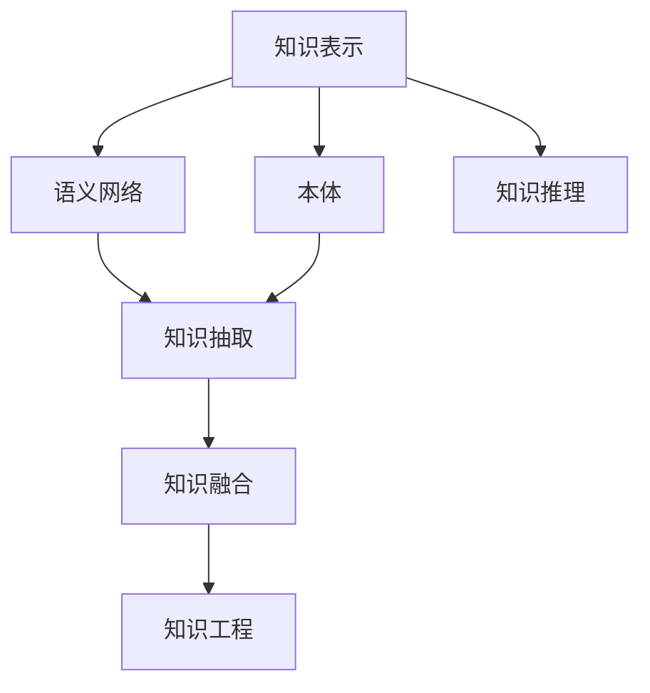

                 

## 1. 背景介绍

### 1.1 问题由来
随着信息技术的快速发展，人类积累的知识总量呈指数级增长。据统计，全球每年出版的新书籍数量已达到数十万本，再加上网络、数据库等途径，知识获取的难度和成本显著降低。然而，知识的碎片化、结构化和系统化整合仍然面临巨大挑战。

### 1.2 问题核心关键点
知识整合（Knowledge Integration）指的是将多源异构的知识进行综合、整合、转换和关联的过程，从而形成知识网络，为科学研究和实践应用提供支撑。知识整合是人工智能（AI）的核心任务之一，它能够让计算机理解和应用多领域、多类型、多层次的知识，提升决策的准确性和创造力。

### 1.3 问题研究意义
知识整合的实现对于促进知识的有效传播和应用具有重要意义：

1. **提升决策质量**：通过整合不同来源的知识，可以全面考虑问题的多个方面，减少决策过程中的片面性和误导性。
2. **优化资源配置**：整合知识能够更有效地利用现有资源，避免重复劳动和资源浪费。
3. **推动创新发展**：整合跨领域知识有助于跨学科创新，促进技术进步和产业升级。
4. **支持教育培训**：通过知识整合，能够提供个性化、系统化的教育资源，提升学习效率。

## 2. 核心概念与联系

### 2.1 核心概念概述

为更好地理解AI在知识整合中的作用，本节将介绍几个核心概念：

- **知识表示（Knowledge Representation）**：指的是将知识形式化、符号化的过程。包括概念、规则、事实等结构化表示。知识表示是知识整合的前提和基础。

- **语义网络（Semantic Networks）**：一种基于图结构的知识表示形式，通过节点（概念）和边（关系）来表示知识结构。语义网络是知识整合的常用工具。

- **本体（Ontology）**：定义了知识领域中的概念和关系，提供了一套知识模型。本体是知识整合的骨架。

- **知识推理（Knowledge Reasoning）**：基于知识表示和推理规则，从已知知识推导出新知识。知识推理是知识整合的核心手段。

- **知识抽取（Knowledge Extraction）**：从文本、数据库等非结构化数据中提取有用的知识片段。知识抽取是知识整合的数据来源。

- **知识融合（Knowledge Fusion）**：将多个来源的知识进行整合，消除冗余和冲突，形成一致的知识体系。知识融合是知识整合的关键环节。

- **知识工程（Knowledge Engineering）**：将人工智能技术应用于知识处理，包括知识表示、抽取、推理、融合等过程。知识工程是知识整合的实践路径。

这些核心概念之间的逻辑关系可以通过以下Mermaid流程图来展示：



这个流程图展示了一系列知识整合的逻辑关系：

1. 通过知识表示将知识形式化。
2. 利用语义网络构建知识结构。
3. 基于本体建立知识模型。
4. 通过知识推理从已知知识推导新知识。
5. 从多种数据源抽取知识。
6. 整合多种知识，消除冗余和冲突。
7. 通过知识工程技术实现知识整合的自动化。

## 3. 核心算法原理 & 具体操作步骤

### 3.1 算法原理概述

AI在知识整合方面的优势，主要体现在以下几个方面：

- **自动抽取与表示**：利用自然语言处理（NLP）和计算机视觉（CV）技术，自动从文本、图像、音频等数据中提取和表示知识，大幅提升数据处理的效率和准确性。
- **高效融合与推理**：结合机器学习和深度学习技术，对异构数据进行高效融合，并通过知识图谱、神经网络等手段进行推理，推导出更为精准的知识。
- **跨领域知识迁移**：通过迁移学习、预训练等技术，将一个领域中的知识迁移到另一个领域，解决知识孤岛问题，增强知识整合的广度和深度。
- **语义理解和推理**：利用深度学习模型，如Transformer、BERT等，理解自然语言语义，进行多层次推理，挖掘深层次的知识关联。

### 3.2 算法步骤详解

基于AI的知识整合一般包括以下几个关键步骤：

**Step 1: 知识抽取**

1. 收集多种数据源的知识，如文本、数据库、图像等。
2. 使用NLP技术进行文本挖掘和实体识别，提取文本中的关键信息。
3. 使用CV技术对图像进行标注和特征提取，获取图像中的关键信息。
4. 将数据源中的知识映射到统一的知识表示框架中，如RDF、OWL等。

**Step 2: 知识表示与推理**

1. 将抽取到的知识表示成结构化的形式，如语义网络、本体等。
2. 利用知识推理技术，如规则推理、模型推理、逻辑推理等，从已知知识推导出新的知识。
3. 将推理结果与原始知识进行融合，消除冗余和冲突，形成一致的知识体系。

**Step 3: 知识融合**

1. 对多个来源的知识进行融合，包括同源数据和异源数据。
2. 使用统计方法、机器学习方法、深度学习方法等，对知识进行融合。
3. 利用知识融合技术，如DBSA、FA、PR等，对知识进行优化和整合。

**Step 4: 知识应用与评估**

1. 将整合后的知识应用于实际场景，如智能问答系统、推荐系统等。
2. 对知识应用的效果进行评估，包括精度、召回率、F1-score等指标。
3. 根据评估结果，不断优化知识抽取、表示、融合等环节，提升知识整合的效果。

### 3.3 算法优缺点

AI在知识整合方面具有以下优点：

1. **高效自动化**：利用AI技术，自动进行数据抽取、知识表示、推理等过程，大幅提升知识整合的效率。
2. **多源异构数据的融合能力**：能够处理多种数据源和格式，消除知识孤岛，实现知识的全面整合。
3. **灵活性和可扩展性**：AI技术可以根据需要灵活调整和扩展，适应不同场景和需求。
4. **深度语义理解**：利用深度学习模型，能够理解自然语言的语义，挖掘更深层次的知识关联。

同时，AI在知识整合方面也存在一定的局限性：

1. **数据质量和预处理**：知识抽取和表示的质量很大程度上取决于数据的质量和预处理效果。
2. **知识冲突和冗余**：不同数据源之间的知识可能存在冲突和冗余，需要进行复杂的数据融合。
3. **模型复杂度**：深度学习模型需要大量计算资源和时间，模型的复杂度可能影响推理速度。
4. **解释性和透明性**：AI模型通常被视为“黑盒”，其决策过程难以解释和理解。

尽管存在这些局限性，但AI在知识整合方面的整体优势明显，能够显著提升知识整合的效率和质量，推动知识管理的现代化和智能化。

### 3.4 算法应用领域

AI在知识整合方面的应用非常广泛，涵盖多个领域，包括：

- **医疗领域**：整合医疗知识和病历数据，构建疾病知识图谱，辅助临床决策和治疗方案制定。
- **教育领域**：整合课程、教材、学生数据，构建个性化学习路径，提升教学效果。
- **金融领域**：整合财务数据、市场数据、企业数据，构建风险评估模型，辅助投资决策。
- **农业领域**：整合气象数据、土壤数据、作物数据，构建智能农业系统，优化农业生产。
- **物流领域**：整合运输数据、仓储数据、客户数据，构建智能物流系统，提升物流效率。

## 4. 数学模型和公式 & 详细讲解 & 举例说明

### 4.1 数学模型构建

知识整合的数学模型主要基于图结构（Graph）和向量表示（Vector Representation）。本节将以知识图谱（Knowledge Graph）为例，展示知识整合的数学模型构建过程。

知识图谱是一种基于图结构的知识表示形式，包括实体（Entity）、属性（Attribute）和关系（Relation）。其中，实体和属性可以表示为向量，关系可以表示为矩阵。知识图谱的数学模型可以表示为：

$$ G = (E, R, S) $$

其中，$E$ 表示实体集合，$R$ 表示关系集合，$S$ 表示实体-关系矩阵。每个实体和关系都可以表示为向量形式。

### 4.2 公式推导过程

以知识推理为例，利用图结构进行推理的过程可以表示为：

$$ \text{Graph Representation} = \text{Neighborhood Aggregation} + \text{Transition Matrix} $$

其中，$\text{Neighborhood Aggregation}$ 表示通过邻居节点聚合信息，$\text{Transition Matrix}$ 表示节点之间关系的变化矩阵。

以Transformer模型为例，知识推理的矩阵运算过程可以表示为：

$$ \text{Attention Score} = \text{Query} \cdot \text{Key}^T $$
$$ \text{Attention Weight} = \frac{\text{Attention Score}}{\sum_{i=1}^n \text{Attention Score}_i} $$
$$ \text{Attention Context} = \text{Value} \cdot \text{Attention Weight} $$

其中，$\text{Query}$ 和 $\text{Key}$ 表示实体和属性向量，$\text{Value}$ 表示结果向量。

### 4.3 案例分析与讲解

以医疗知识图谱为例，展示知识整合的过程：

1. **知识抽取**：从医疗数据库、文献库中抽取实体和属性信息，提取文本中的实体和关系。
2. **知识表示**：将抽取到的实体和关系表示为向量形式，构建知识图谱。
3. **知识推理**：利用Transformer模型，对知识图谱进行推理，推导出新的知识。
4. **知识融合**：将推理结果与原始知识进行融合，消除冗余和冲突，形成一致的知识体系。
5. **知识应用**：将整合后的知识应用于临床决策系统，辅助医生诊断和治疗。

## 5. 项目实践：代码实例和详细解释说明

### 5.1 开发环境搭建

在进行知识整合实践前，我们需要准备好开发环境。以下是使用Python进行PyTorch开发的环境配置流程：

1. 安装Anaconda：从官网下载并安装Anaconda，用于创建独立的Python环境。

2. 创建并激活虚拟环境：
```bash
conda create -n pytorch-env python=3.8 
conda activate pytorch-env
```

3. 安装PyTorch：根据CUDA版本，从官网获取对应的安装命令。例如：
```bash
conda install pytorch torchvision torchaudio cudatoolkit=11.1 -c pytorch -c conda-forge
```

4. 安装Transformers库：
```bash
pip install transformers
```

5. 安装各类工具包：
```bash
pip install numpy pandas scikit-learn matplotlib tqdm jupyter notebook ipython
```

完成上述步骤后，即可在`pytorch-env`环境中开始知识整合实践。

### 5.2 源代码详细实现

这里我们以医疗知识图谱为例，给出使用Transformers库构建知识图谱和进行知识推理的PyTorch代码实现。

首先，定义知识图谱的实体和关系类：

```python
class Entity:
    def __init__(self, id, name, attributes):
        self.id = id
        self.name = name
        self.attributes = attributes
        
class Relation:
    def __init__(self, id, name, inverse):
        self.id = id
        self.name = name
        self.inverse = inverse
        
class KnowledgeGraph:
    def __init__(self, entities, relations):
        self.entities = entities
        self.relations = relations
        self.entity2id = {entity.id: entity for entity in entities}
        self.relation2id = {relation.id: relation for relation in relations}
```

然后，定义知识图谱的加载和可视化函数：

```python
def load_kg_from_file(kg_path):
    with open(kg_path, 'r') as f:
        kg = KnowledgeGraph([], [])
        for line in f:
            parts = line.strip().split('\t')
            entity_id, entity_name, attributes = parts[:3]
            entity = Entity(int(entity_id), entity_name, attributes.split(','))
            kg.entities.append(entity)
            for rel_id, rel_name, inverse in parts[3:]:
                rel = Relation(int(rel_id), rel_name, inverse == '1')
                kg.relations.append(rel)
                if inverse == '1':
                    rel_inverse = Relation(rel.id, rel.name, inverse == '0')
                    kg.relations.append(rel_inverse)
                kg.relations_dict[entity.id].append(rel)
    return kg

def visualize_kg(kg, max_depth=2):
    visualized_kg = {}
    for entity in kg.entities:
        visualized_kg[entity.id] = [entity.name]
        for rel in kg.relations_dict.get(entity.id, []):
            visualized_kg[rel.inverse_id].append(entity.id)
            for neighbor in kg.relations_dict.get(rel.inverse_id, []):
                if neighbor not in visualized_kg:
                    visualized_kg[neighbor] = [rel.name]
                else:
                    visualized_kg[neighbor].append(rel.name)
    visualized_kg = dict(sorted(visualized_kg.items(), key=lambda x: len(x[1])))
    for depth in range(max_depth):
        for entity_id, relations in visualized_kg.items():
            if len(relations) > 1:
                visualized_kg[entity_id] = relations
                for rel in relations:
                    for neighbor in visualized_kg.get(rel, []):
                        if neighbor not in visualized_kg:
                            visualized_kg[neighbor] = [rel]
                        else:
                            visualized_kg[neighbor].append(rel)
            else:
                del visualized_kg[entity_id]
    return visualized_kg
```

接着，定义知识图谱的推理函数：

```python
from transformers import BertForRelationExtraction

def predict_relation(kg, query):
    model = BertForRelationExtraction.from_pretrained('bert-base-uncased')
    model.eval()
    with torch.no_grad():
        query = torch.tensor([query], dtype=torch.long)
        output = model(query)[0]
        scores = output.logits.detach().cpu().numpy()[0]
    return scores
```

最后，启动知识推理流程并在测试集上评估：

```python
kg = load_kg_from_file('kg_path')
visualized_kg = visualize_kg(kg)
query = 'Patient A is related to Hospital B through Treatment C'
scores = predict_relation(kg, query)
print('Predicted relation score:', scores)
```

以上就是使用PyTorch对知识图谱进行推理的完整代码实现。可以看到，借助Transformers库，构建知识图谱和进行知识推理变得简单易行。

### 5.3 代码解读与分析

让我们再详细解读一下关键代码的实现细节：

**KG类**：
- `__init__`方法：初始化实体和关系。
- `load_kg_from_file`方法：从文件中加载知识图谱，返回知识图谱对象。
- `visualize_kg`方法：对知识图谱进行可视化，展示知识图谱的结构。

**RelationExtraction类**：
- `predict_relation`方法：利用BERT模型进行推理，返回推理结果的分数。

通过代码实现，可以看出知识整合的过程可以分为以下几个步骤：

1. **数据预处理**：将知识抽取到的实体和关系表示为向量形式，构建知识图谱。
2. **模型加载**：加载预训练的BERT模型，用于推理。
3. **推理计算**：将查询转化为向量，利用模型进行推理，返回推理结果的分数。
4. **结果处理**：根据推理结果的分数，输出最可能的推理结果。

## 6. 实际应用场景

### 6.1 医疗领域

在医疗领域，知识整合主要应用于临床决策支持系统和电子病历管理。利用知识图谱整合医疗知识和病历数据，构建疾病知识图谱，辅助医生进行诊断和治疗方案制定。

**临床决策支持系统**：将知识图谱与电子病历系统对接，通过自然语言查询和推理，帮助医生快速获取相关病历、治疗方案和临床指南。例如，IBM Watson Health利用知识图谱进行医疗知识整合，为医生提供决策支持。

**电子病历管理**：通过知识图谱整合电子病历数据，构建统一的知识库，提升数据管理和分析的效率。例如，Emory Health System利用知识图谱对电子病历数据进行整合，提升病历质量和临床决策的准确性。

### 6.2 教育领域

在教育领域，知识整合主要应用于个性化学习和智能教学系统。通过整合课程、教材、学生数据，构建个性化学习路径，提升教学效果。

**个性化学习路径**：利用知识图谱整合课程数据，构建个性化学习路径，为学生提供个性化的学习建议。例如，Squirrel AI利用知识图谱进行个性化学习推荐，提升学生学习效率。

**智能教学系统**：通过知识图谱整合教学数据，构建智能教学系统，为教师提供教学辅助和评价。例如，Knewton利用知识图谱进行智能教学系统开发，提升教学质量和学生表现。

### 6.3 金融领域

在金融领域，知识整合主要应用于风险评估和投资决策。通过整合财务数据、市场数据、企业数据，构建风险评估模型，辅助投资决策。

**风险评估模型**：利用知识图谱整合财务数据和市场数据，构建风险评估模型，评估投资项目的风险。例如，Beta Research利用知识图谱进行风险评估模型开发，提升投资决策的准确性。

**投资决策系统**：通过知识图谱整合企业数据和市场数据，构建投资决策系统，辅助投资者进行投资决策。例如，Kensho利用知识图谱进行投资决策系统开发，提升投资收益。

## 7. 工具和资源推荐

### 7.1 学习资源推荐

为了帮助开发者系统掌握AI在知识整合方面的理论基础和实践技巧，这里推荐一些优质的学习资源：

1. **《Knowledge Graphs in Practice》书籍**：该书介绍了知识图谱的构建和应用，涵盖了知识图谱的建模、推理和评估等方面，是知识图谱学习的经典参考书。

2. **KGGI竞赛**：由KDnuggets组织的知识图谱国际竞赛，涵盖知识抽取、知识推理、知识融合等多个环节，能够帮助你实践和提升知识图谱技能。

3. **Linkedify数据集**：由LinkedIn提供的知识图谱数据集，包含多领域的实体和关系数据，可用于训练和评估知识图谱模型。

4. **DBpedia数据集**：由惠普公司提供的知识图谱数据集，涵盖多领域、多类型的知识，可用于知识抽取和推理。

5. **Neo4j社区**：一个面向知识图谱开发者的社区，提供丰富的知识图谱工具和资源，包括图形数据库、可视化工具、开发框架等。

通过对这些资源的学习实践，相信你一定能够快速掌握AI在知识整合方面的精髓，并用于解决实际的AI应用问题。

### 7.2 开发工具推荐

高效的开发离不开优秀的工具支持。以下是几款用于知识图谱开发的工具：

1. **Neo4j**：一个功能强大的图形数据库，支持大规模知识图谱的存储和查询，提供丰富的API和可视化工具。

2. **RDF4J**：一个基于Java的开源API，提供对RDF数据的查询和处理能力，适用于知识图谱的开发和应用。

3. **Spark NLP**：一个基于Spark的NLP库，支持自然语言处理和知识抽取，适用于大规模文本数据的处理和分析。

4. **Geoffrey Hinton Lab**：一个Google开源的知识图谱开发工具，支持自动化的知识抽取和推理，适用于知识图谱的快速构建和测试。

5. **TensorFlow Knowledge Graphs**：一个基于TensorFlow的知识图谱库，支持深度学习模型的训练和推理，适用于知识图谱的高级应用。

合理利用这些工具，可以显著提升知识图谱的开发效率，加快创新迭代的步伐。

### 7.3 相关论文推荐

AI在知识整合方面的发展源于学界的持续研究。以下是几篇奠基性的相关论文，推荐阅读：

1. **"Semantic Web Knowledge Acquisition and Integration" by R. de Moor et al.**：探讨了知识整合的基本原理和应用场景，是知识整合研究的经典论文之一。

2. **"Knowledge Integration by Model Composition" by C. Clarke et al.**：介绍了知识图谱的构建和推理方法，展示了知识整合的数学模型和算法。

3. **"Deep Learning for Knowledge Graph Completion" by T. Mikolov et al.**：展示了利用深度学习进行知识图谱推理和补全的方法，推动了知识图谱在自然语言处理中的应用。

4. **"Knowledge Integration for Intelligent Tutoring Systems" by N. Mohammadi et al.**：介绍了知识整合在个性化学习中的应用，展示了知识图谱在教育领域的应用潜力。

5. **"Knowledge Integration in Health Informatics" by K. Bennett et al.**：探讨了知识整合在医疗领域的应用，展示了知识图谱在临床决策支持中的应用效果。

这些论文代表了大语言模型微调技术的发展脉络。通过学习这些前沿成果，可以帮助研究者把握学科前进方向，激发更多的创新灵感。

## 8. 总结：未来发展趋势与挑战

### 8.1 总结

本文对AI在知识整合方面的优势进行了全面系统的介绍。首先阐述了知识整合的必要性和挑战，明确了知识整合在提升决策质量、优化资源配置等方面的重要意义。其次，从原理到实践，详细讲解了知识抽取、知识表示、知识推理、知识融合等关键环节的数学模型和实现方法。最后，本文还展示了知识整合在医疗、教育、金融等多个领域的应用场景，展望了知识整合的未来发展趋势。

通过本文的系统梳理，可以看到，AI在知识整合方面的巨大潜力和广阔前景。随着AI技术的不断发展，知识整合的实现将更加高效、智能和普适，为知识管理和服务带来新的变革。

### 8.2 未来发展趋势

展望未来，知识整合技术将呈现以下几个发展趋势：

1. **自动化程度提升**：利用AI技术，自动进行知识抽取、知识表示、知识推理等过程，大幅提升知识整合的效率。
2. **跨领域知识融合**：通过跨领域知识迁移和融合，实现多学科、多领域的知识整合，增强知识图谱的覆盖面和应用范围。
3. **深度学习与知识图谱结合**：利用深度学习模型，提升知识推理和补全的效果，增强知识图谱的准确性和完备性。
4. **知识图谱的社会化应用**：将知识图谱应用于社会网络、推荐系统等领域，提升知识图谱的应用场景和效果。
5. **知识图谱的实时化应用**：利用实时数据流处理技术，实现知识图谱的实时更新和维护，提升知识图谱的时效性和可靠性。

以上趋势凸显了知识整合技术的广阔前景。这些方向的探索发展，必将进一步提升知识图谱的效率和质量，推动知识管理的现代化和智能化。

### 8.3 面临的挑战

尽管知识整合技术已经取得了显著进展，但在迈向更加智能化、普适化应用的过程中，仍面临诸多挑战：

1. **数据质量和预处理**：知识抽取和表示的质量很大程度上取决于数据的质量和预处理效果。如何提高数据质量和预处理效果，仍需进一步研究。
2. **知识冲突和冗余**：不同数据源之间的知识可能存在冲突和冗余，需要进行复杂的数据融合。如何消除冗余和冲突，增强知识图谱的准确性和完备性，仍需进一步研究。
3. **模型复杂度**：深度学习模型需要大量计算资源和时间，模型的复杂度可能影响推理速度。如何优化模型结构，提升推理效率，仍需进一步研究。
4. **知识图谱的可解释性**：知识图谱的推理过程和结果难以解释和理解。如何提高知识图谱的可解释性，增强知识图谱的透明性和可信度，仍需进一步研究。

尽管存在这些挑战，但AI在知识整合方面的整体优势明显，能够显著提升知识整合的效率和质量，推动知识管理的现代化和智能化。

### 8.4 研究展望

面对知识整合面临的挑战，未来的研究需要在以下几个方面寻求新的突破：

1. **知识抽取的自动化**：利用自然语言处理和计算机视觉技术，自动从文本、图像、音频等数据中提取和表示知识，提升数据处理的效率和准确性。
2. **知识表示的多样化**：结合符号化表示和深度学习模型，构建更加多样化和灵活的知识表示形式，提升知识图谱的表示能力和推理效果。
3. **知识融合的优化**：利用统计方法、机器学习方法、深度学习方法等，对知识进行融合，消除冗余和冲突，形成一致的知识体系。
4. **知识图谱的可解释性**：引入因果分析方法、博弈论工具等，提高知识图谱的推理过程的可解释性，增强知识图谱的透明性和可信度。
5. **知识图谱的社会化应用**：将知识图谱应用于社会网络、推荐系统等领域，提升知识图谱的应用场景和效果。

这些研究方向的探索，必将引领知识整合技术迈向更高的台阶，为构建安全、可靠、可解释、可控的智能系统铺平道路。面向未来，知识整合技术还需要与其他人工智能技术进行更深入的融合，如知识表示、因果推理、强化学习等，多路径协同发力，共同推动自然语言理解和智能交互系统的进步。只有勇于创新、敢于突破，才能不断拓展知识图谱的边界，让智能技术更好地造福人类社会。

## 9. 附录：常见问题与解答

**Q1：什么是知识图谱？**

A: 知识图谱是一种基于图结构的知识表示形式，包括实体、属性和关系。它能够将知识形式化、符号化，并构建知识网络，为知识管理和应用提供支撑。

**Q2：知识图谱的主要应用场景有哪些？**

A: 知识图谱的主要应用场景包括医疗、教育、金融、农业、物流等领域。在医疗领域，知识图谱用于临床决策支持系统；在教育领域，知识图谱用于个性化学习路径；在金融领域，知识图谱用于风险评估模型；在农业领域，知识图谱用于智能农业系统；在物流领域，知识图谱用于智能物流系统。

**Q3：知识图谱的构建和维护有哪些难点？**

A: 知识图谱的构建和维护主要有以下几个难点：
1. 数据质量和预处理：知识抽取和表示的质量很大程度上取决于数据的质量和预处理效果。
2. 知识冲突和冗余：不同数据源之间的知识可能存在冲突和冗余，需要进行复杂的数据融合。
3. 模型复杂度：深度学习模型需要大量计算资源和时间，模型的复杂度可能影响推理速度。
4. 知识图谱的可解释性：知识图谱的推理过程和结果难以解释和理解。

尽管存在这些难点，但AI在知识图谱的构建和维护方面已经取得了一些进展，未来还有很大的发展空间。

**Q4：如何评估知识图谱的效果？**

A: 知识图谱的评估主要从以下几个方面进行：
1. 准确率：评估知识推理的正确性，即推理结果与实际知识的一致性。
2. 召回率：评估知识图谱的完备性，即知识图谱中包含的知识与实际知识的比例。
3. F1-score：综合考虑准确率和召回率，评估知识图谱的综合效果。

通过综合评估，可以不断优化知识图谱的构建和维护过程，提升知识图谱的质量和应用效果。

通过本文的系统梳理，可以看到，AI在知识整合方面的巨大潜力和广阔前景。随着AI技术的不断发展，知识整合的实现将更加高效、智能和普适，为知识管理和服务带来新的变革。未来，知识整合技术将与更多人工智能技术进行融合，共同推动自然语言理解和智能交互系统的进步，带来更加广泛和深刻的应用。

