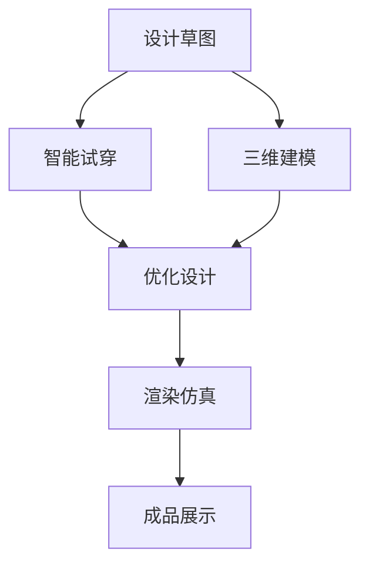

                 

# AI在虚拟时装设计中的应用：减少实体样品

> 关键词：虚拟时装设计, AI应用, 减少实体样品, 三维建模, 计算机视觉, 深度学习

## 1. 背景介绍

### 1.1 问题由来
在传统的时装设计中，设计师通常需要制作大量实体样品来展示和测试设计，这一过程不仅耗时耗力，成本高昂，而且往往需要多次试错才能得到理想的效果。而随着人工智能(AI)技术的发展，特别是计算机视觉、深度学习和三维建模技术的进步，虚拟时装设计开始崭露头角，有望彻底改变传统的服装设计和制造流程。

### 1.2 问题核心关键点
虚拟时装设计的核心在于通过AI技术，实现从概念设计到最终成衣的完全数字化流程。具体来说，主要包括以下几个关键点：
- 三维建模：将设计师的设计草图或概念图转换为三维模型。
- 渲染与仿真：对三维模型进行渲染，模拟真实的光照、材质和纹理效果。
- 智能试穿：通过虚拟试穿技术，实现对设计的快速迭代和调整。
- 自动化生成：利用AI算法自动生成设计方案，提高设计效率。

这些技术的集成，不仅可以大幅减少实体样品的制作，节省成本，还能加速设计过程，缩短上市时间。

### 1.3 问题研究意义
虚拟时装设计的推广，将对时尚产业产生深远影响：
- 降低成本：虚拟设计大幅减少实体样品的制作和测试成本。
- 加速上市：快速迭代和智能试穿使得新设计能够更快地从概念到成品。
- 提高灵活性：虚拟设计能够实现更灵活的设计和生产，满足个性化需求。
- 促进环保：减少实体样品生产，有助于环保和可持续发展。

## 2. 核心概念与联系

### 2.1 核心概念概述

为了更好地理解虚拟时装设计的过程，本节将介绍几个关键概念：

- 虚拟时装设计(Virtual Fashion Design)：指利用计算机视觉、深度学习和三维建模技术，将设计师的设计草图转换为三维模型，并进行渲染和仿真，实现完全数字化的设计流程。
- 三维建模(3D Modeling)：通过计算机生成三维几何模型，用于表示设计草图、产品原型等。
- 计算机视觉(Computer Vision)：涉及图像和视频处理技术，用于三维建模、智能试穿等环节。
- 深度学习(Deep Learning)：一种机器学习方法，通过多层神经网络模型，实现对数据的高级处理和分析。
- 三维渲染(3D Rendering)：对三维模型进行光照、材质、纹理等仿真，模拟真实世界的视觉效果。
- 智能试穿(Virtual Fitting)：通过计算机视觉和深度学习技术，实现对设计的快速迭代和调整，无需实体试穿。

这些核心概念之间的逻辑关系可以通过以下Mermaid流程图来展示：



这个流程图展示了虚拟时装设计的核心环节：从设计草图到三维建模，再到智能试穿和优化设计，最后进行渲染仿真和成品展示。

## 3. 核心算法原理 & 具体操作步骤
### 3.1 算法原理概述

虚拟时装设计的算法原理，主要包括以下几个方面：

- 三维建模：利用计算机图形学技术，将设计师的设计草图转换为三维模型。常用的技术包括：
  - 线框建模：通过二维草图生成三维几何结构。
  - 曲面建模：利用曲面拟合技术，生成光滑的曲面模型。
  - 点云建模：通过三维扫描设备捕捉实物形态，生成点云数据，用于逆向工程。

- 计算机视觉：通过图像处理和特征提取技术，实现对三维模型和图像数据的分析和理解。常用的技术包括：
  - 图像分割：将图像分为前景和背景部分，用于三维建模和智能试穿。
  - 物体检测：识别图像中的物体，用于三维建模和智能试穿。
  - 图像重建：通过多张图像重建三维模型，用于三维建模和智能试穿。

- 深度学习：利用神经网络模型，实现对三维模型和图像数据的高级处理和分析。常用的技术包括：
  - 图像生成：通过生成对抗网络(GAN)等技术，生成逼真的图像和三维模型。
  - 图像识别：通过卷积神经网络(CNN)等技术，识别图像中的物体和纹理。
  - 姿态估计：通过姿态估计模型，实现对虚拟试穿中人体的姿势预测和优化。

- 三维渲染：通过光照、材质和纹理等仿真技术，生成逼真的三维渲染效果。常用的技术包括：
  - 光线追踪：通过模拟光线与三维模型的交互，生成逼真的光照效果。
  - 材质建模：通过物理模型和反射率计算，生成逼真的材质效果。
  - 纹理贴图：通过将图像纹理映射到三维模型上，生成逼真的表面效果。

### 3.2 算法步骤详解

虚拟时装设计的算法步骤主要包括以下几个关键步骤：

**Step 1: 设计草图采集**
- 设计师使用二维绘图工具，将设计草图转换为数字文件。
- 使用OCR技术自动识别文本和颜色信息，转换为数字格式。

**Step 2: 三维建模**
- 使用三维建模软件(如Maya、Blender等)，将设计草图转换为三维模型。
- 利用逆向工程技术，通过三维扫描设备捕捉实物形态，生成点云数据。
- 使用曲面拟合和点云处理技术，生成光滑的三维几何模型。

**Step 3: 智能试穿**
- 使用计算机视觉技术，将三维模型和人体数据进行对齐和匹配。
- 通过深度学习模型，预测人体对设计的适应性和舒适度。
- 利用姿态估计技术，生成虚拟试穿的动态效果。

**Step 4: 渲染仿真**
- 使用三维渲染技术，对三维模型进行光照、材质和纹理的仿真。
- 通过多角度渲染和后期处理，生成逼真的三维渲染效果。
- 利用虚拟现实(VR)和增强现实(AR)技术，进行三维渲染效果的展示和互动。

**Step 5: 成品展示**
- 通过电子商务平台，将虚拟样品的渲染效果展示给消费者。
- 收集消费者的反馈和评论，进行设计和生产的优化。

### 3.3 算法优缺点

虚拟时装设计的算法具有以下优点：
- 效率高：大幅缩短设计和制作时间，提高设计效率。
- 成本低：减少实体样品的制作和测试成本，降低生产成本。
- 灵活性强：实现灵活的设计和生产，满足个性化需求。
- 环保性好：减少实体样品的制作，有助于环保和可持续发展。

同时，该算法也存在一些缺点：
- 技术门槛高：需要掌握复杂的计算机图形学和深度学习技术。
- 数据依赖性强：需要大量的设计草图和人体数据，数据采集成本较高。
- 渲染质量高：需要高性能的计算设备和渲染引擎，对硬件要求较高。
- 用户体验有限：虚拟试穿和渲染效果还需进一步提升，才能更好地模拟真实体验。

尽管存在这些缺点，但虚拟时装设计在提高设计效率、降低成本和环保方面具有显著优势，有望成为未来时装设计和制造的主流趋势。

### 3.4 算法应用领域

虚拟时装设计技术已经在多个领域得到应用，如：

- 时尚品牌：用于展示设计概念和产品原型，提高设计效率。
- 服装零售：通过虚拟试穿技术，提升用户体验和销售转化率。
- 影视娱乐：为电影和电视剧制作服装和道具，节省制作成本。
- 教育培训：用于虚拟时装设计课程，提供互动式学习体验。

此外，虚拟时装设计还被应用于虚拟现实、增强现实、游戏开发等多个领域，为数字娱乐和交互式体验提供了新的发展方向。

## 4. 数学模型和公式 & 详细讲解  
### 4.1 数学模型构建

虚拟时装设计的数学模型主要涉及以下几个方面：

- 三维几何建模：通过定义空间中的点、线、面等几何元素，构建三维模型。常用的数学模型包括：
  - 三角网格模型：由三角形组成的三维网格模型，用于表示曲面和几何结构。
  - 边界表示模型：通过定义边界曲线和曲面，生成光滑的三维几何模型。
  - 体素模型：通过定义体元，生成三维体积模型。

- 计算机视觉：通过图像处理和特征提取技术，实现对三维模型和图像数据的分析和理解。常用的数学模型包括：
  - 空间变换模型：通过仿射变换、透视变换等技术，对图像进行几何校正。
  - 特征提取模型：通过SIFT、SURF等技术，提取图像中的特征点。
  - 对象检测模型：通过YOLO、Faster R-CNN等技术，检测图像中的物体和边缘。

- 深度学习：利用神经网络模型，实现对三维模型和图像数据的高级处理和分析。常用的数学模型包括：
  - 卷积神经网络(CNN)：用于图像识别和分类。
  - 生成对抗网络(GAN)：用于图像生成和三维建模。
  - 循环神经网络(RNN)：用于序列数据的处理和分析。

- 三维渲染：通过光照、材质和纹理等仿真技术，生成逼真的三维渲染效果。常用的数学模型包括：
  - 物理渲染模型：通过模拟光线的物理属性，生成逼真的光照效果。
  - 材质模型：通过定义材质的反射率和折射率，生成逼真的表面效果。
  - 纹理映射模型：通过将图像纹理映射到三维模型上，生成逼真的表面效果。

### 4.2 公式推导过程

以下我们以三维渲染中的光照计算为例，推导光照模型和对应的渲染公式。

假设一个三维模型上的点 $p$，其法向量为 $n$，光源位于位置 $s$，光源强度为 $I_s$。设点 $p$ 到光源 $s$ 的距离为 $d$，光线的方向向量为 $\overrightarrow{sp}$。则点 $p$ 处接收到的光线功率 $P$ 为：

$$ P = I_s \times \frac{1}{d^2} \times \max(0, \overrightarrow{sp} \cdot n) $$

其中，$\max(0, \overrightarrow{sp} \cdot n)$ 表示光线与法向量的夹角大于 $90^\circ$ 时，光线无法照射到该点。

在三维渲染中，通过将上述公式应用于每一个像素，并进行光照计算，即可得到逼真的渲染效果。

### 4.3 案例分析与讲解

以三维渲染为例，展示一个具体的案例分析。

假设有一个三维模型，我们需要对其进行光照渲染。首先，根据光源的位置和强度，计算每个像素处接收到的光线功率。然后，根据材质的反射率和折射率，计算每个像素的颜色值。最后，将多个颜色值进行线性组合，得到最终的渲染结果。

在实际应用中，还需要考虑光照角度、材质属性、光照模型等多个因素。通过合理的渲染公式和计算策略，可以生成逼真的三维渲染效果，提升用户体验。

## 5. 项目实践：代码实例和详细解释说明
### 5.1 开发环境搭建

在进行虚拟时装设计的开发实践前，我们需要准备好开发环境。以下是使用Python进行PyTorch开发的环境配置流程：

1. 安装Anaconda：从官网下载并安装Anaconda，用于创建独立的Python环境。

2. 创建并激活虚拟环境：
```bash
conda create -n pytorch-env python=3.8 
conda activate pytorch-env
```

3. 安装PyTorch：根据CUDA版本，从官网获取对应的安装命令。例如：
```bash
conda install pytorch torchvision torchaudio cudatoolkit=11.1 -c pytorch -c conda-forge
```

4. 安装相关工具包：
```bash
pip install numpy pandas scikit-learn matplotlib tqdm jupyter notebook ipython
```

完成上述步骤后，即可在`pytorch-env`环境中开始虚拟时装设计的开发实践。

### 5.2 源代码详细实现

下面我们以三维渲染的实现为例，给出使用PyTorch和OpenCV进行的三维渲染代码实现。

首先，定义三维模型的类和函数：

```python
import torch
import numpy as np
import cv2

class TriangleMesh:
    def __init__(self, vertices, faces):
        self.vertices = vertices
        self.faces = faces
        
    def render(self, camera_position, camera上看向向量, camera上看向量, width, height):
        # 投影到屏幕
        projection_matrix = np.zeros((4, 4))
        projection_matrix[0:3, 0:3] = camera上看向量
        projection_matrix[0:3, 3] = -camera_position.dot(camera上看向量)
        
        # 计算像素坐标
        z_buffer = np.zeros((width, height))
        for face in self.faces:
            face_vertices = self.vertices[face]
            face_normal = face_vertices[0] - face_vertices[1]
            face_normal /= np.linalg.norm(face_normal)
            face_center = np.mean(face_vertices, axis=0)
            
            # 求交点
            t = np.maximum(0, (camera_position - face_center).dot(face_normal) / (-camera上看向量.dot(face_normal)))
            if t > 0:
                intersection = face_center + t * face_normal
                
                # 投影到屏幕
                screen_coord = np.dot(projection_matrix, np.append(intersection, 1))
                screen_coord = screen_coord[:3] / screen_coord[3]
                
                # 计算深度缓冲
                z_buffer[screen_coord[1], screen_coord[0]] = intersection[2]
                
        # 反投影
        depth_map = z_buffer / z_buffer.max()
        color_map = np.zeros((width, height, 3))
        for i in range(width):
            for j in range(height):
                depth = depth_map[j, i]
                if depth > 0:
                    color_map[j, i, :] = [i, j, depth]
        
        # 渲染
        color_map = cv2.flip(color_map, 1)
        color_map = (color_map - [127, 127, 127]) / 127.0 * 255.0
        color_map = color_map.astype(np.uint8)
        color_map = cv2.cvtColor(color_map, cv2.COLOR_RGB2BGR)
        
        return color_map
```

然后，定义光源的位置和强度：

```python
camera_position = np.array([0, 0, 1])
camera_look_vector = np.array([0, 0, -1])
camera_look_at = np.array([0, 0, 0])
light_position = np.array([0, 0, 0])
light_intensity = np.array([1, 1, 1])
```

接着，定义一个简单的三角形三维模型：

```python
vertices = np.array([[0, 0, 0], [1, 0, 0], [0, 1, 0]])
faces = np.array([[0, 1, 2]])
```

最后，进行渲染：

```python
width = 800
height = 600
color_map = TriangleMesh(vertices, faces).render(camera_position, camera_look_vector, camera_look_at, width, height)
cv2.imshow('rendering', color_map)
cv2.waitKey(0)
cv2.destroyAllWindows()
```

### 5.3 代码解读与分析

让我们再详细解读一下关键代码的实现细节：

**TriangleMesh类**：
- `__init__`方法：初始化三维模型的顶点和面的信息。
- `render`方法：进行三维渲染，计算屏幕坐标、深度缓冲和颜色值，并最终生成渲染结果。

**camera_position, camera_look_vector等变量**：
- 定义相机的位置、看向向量、看向量等参数，用于计算渲染效果。

**vertices, faces等数组**：
- 定义三维模型的顶点和面的信息，用于渲染计算。

**color_map生成**：
- 通过渲染函数，计算每个像素的深度缓冲和颜色值，并生成最终的渲染结果。

通过上述代码，可以看到，使用PyTorch和OpenCV进行三维渲染的基本过程。开发者可以根据具体需求，进一步优化渲染算法和模型结构，提升渲染质量和效率。

## 6. 实际应用场景
### 6.1 时尚品牌

虚拟时装设计在时尚品牌中的应用，主要是通过展示设计概念和产品原型，提升设计效率和展示效果。品牌可以在虚拟世界中，以三维模型的形式展示服装设计，实现虚拟时装秀、虚拟试穿等功能。

具体而言，品牌可以：
- 利用三维建模技术，将设计师的设计草图转换为三维模型。
- 通过智能试穿技术，展示设计在不同人体尺寸和姿势下的效果。
- 利用三维渲染技术，生成逼真的渲染效果，提升展示效果。
- 通过虚拟试穿技术，让客户在家中就能进行虚拟试穿，提高购物体验。

### 6.2 服装零售

虚拟时装设计在服装零售中的应用，主要是通过虚拟试穿技术，提升用户体验和销售转化率。零售商可以在虚拟世界中，以三维模型的形式展示服装设计，实现虚拟试穿、产品展示等功能。

具体而言，零售商可以：
- 利用三维建模技术，将服装设计转换为三维模型。
- 通过智能试穿技术，展示设计在不同人体尺寸和姿势下的效果。
- 利用三维渲染技术，生成逼真的渲染效果，提升展示效果。
- 通过虚拟试穿技术，让客户在家中就能进行虚拟试穿，提高购物体验。

### 6.3 影视娱乐

虚拟时装设计在影视娱乐中的应用，主要是通过制作服装和道具，提升影片和剧集的制作质量和视觉效果。影视制作公司可以在虚拟世界中，以三维模型的形式制作服装和道具，实现虚拟试穿、虚拟制作等功能。

具体而言，影视制作公司可以：
- 利用三维建模技术，制作服装和道具的三维模型。
- 通过智能试穿技术，展示设计在不同人体尺寸和姿势下的效果。
- 利用三维渲染技术，生成逼真的渲染效果，提升展示效果。
- 通过虚拟试穿技术，实现虚拟拍摄和制作，提升制作效率。

### 6.4 未来应用展望

随着虚拟时装设计技术的不断进步，未来将有更多创新应用出现，如：

- 虚拟时装秀：在虚拟世界中，举办大规模时装秀，展示设计师的设计成果，吸引更多关注。
- 虚拟试穿店：通过虚拟现实和增强现实技术，建立虚拟试穿店，提供实时试穿体验。
- 虚拟设计师：利用生成对抗网络等技术，生成逼真的设计师虚拟形象，进行虚拟设计展示。
- 虚拟时尚社区：在虚拟世界中，建立时尚社区，实现设计师、消费者和品牌的互动交流。

## 7. 工具和资源推荐
### 7.1 学习资源推荐

为了帮助开发者系统掌握虚拟时装设计理论基础和实践技巧，这里推荐一些优质的学习资源：

1. 《虚拟时装设计：从概念到成品》书籍：详细介绍了虚拟时装设计的基本原理和技术实现，适合入门学习。

2. 《深度学习与计算机视觉》课程：斯坦福大学开设的计算机视觉课程，涵盖了三维建模、计算机视觉和深度学习的基本概念和算法。

3. 《三维渲染技术》课程：COURSERA上的三维渲染课程，讲解了三维渲染的基本原理和常用技术。

4. 《Python深度学习》书籍：西瓜书，详细介绍了深度学习的基本原理和实现技巧。

5. 《三维建模与渲染》论文集：收录了大量三维建模和渲染的最新研究成果，适合深入研究。

通过这些资源的学习实践，相信你一定能够快速掌握虚拟时装设计的精髓，并用于解决实际的时尚问题。

### 7.2 开发工具推荐

高效的开发离不开优秀的工具支持。以下是几款用于虚拟时装设计开发的常用工具：

1. Blender：开源的三维建模软件，功能强大，易于使用，适合进行三维建模和渲染。

2. Maya：商业级的3D创作软件，广泛用于影视、游戏和动画制作，支持复杂的三维建模和渲染。

3. Unity3D：游戏引擎，支持虚拟现实和增强现实技术，适合进行虚拟试穿和虚拟环境构建。

4. OpenCV：计算机视觉库，提供丰富的图像处理和特征提取算法，适合进行三维建模和计算机视觉应用。

5. PyTorch：深度学习框架，支持GPU加速和分布式训练，适合进行深度学习应用。

合理利用这些工具，可以显著提升虚拟时装设计开发的效率，加快创新迭代的步伐。

### 7.3 相关论文推荐

虚拟时装设计技术的发展，离不开学界和产业界的持续研究。以下是几篇奠基性的相关论文，推荐阅读：

1. 《三维建模与渲染技术综述》：对三维建模和渲染技术进行了全面的综述，介绍了多种三维建模和渲染方法。

2. 《基于计算机视觉的虚拟试穿技术》：探讨了计算机视觉在虚拟试穿中的应用，实现了人体对齐和动态试穿。

3. 《基于深度学习的智能试穿系统》：利用深度学习技术，实现了对设计的快速迭代和调整，提升了设计效率。

4. 《虚拟时尚社区构建》：研究了虚拟时尚社区的构建方法，实现了设计师、消费者和品牌的互动交流。

这些论文代表了大规模时装设计技术的最新进展，通过学习这些前沿成果，可以帮助研究者把握学科前进方向，激发更多的创新灵感。

## 8. 总结：未来发展趋势与挑战

### 8.1 总结

本文对虚拟时装设计的核心算法原理和具体操作步骤进行了全面系统的介绍。首先阐述了虚拟时装设计在时尚产业中的研究背景和意义，明确了其在提高设计效率、降低成本和环保方面的重要价值。其次，从三维建模、计算机视觉、深度学习和三维渲染等方面，详细讲解了虚拟时装设计的基本原理和实现技术，给出了具体的代码实例和详细解释。最后，本文还探讨了虚拟时装设计在时尚品牌、服装零售、影视娱乐等领域的实际应用，展示了其广阔的应用前景。

通过本文的系统梳理，可以看到，虚拟时装设计技术在提高设计效率、降低成本和环保方面具有显著优势，有望成为未来时装设计和制造的主流趋势。虚拟时装设计不仅能够减少实体样品的制作，节省成本，还能加速设计过程，缩短上市时间，提升用户体验和环保效益，具有广阔的应用前景。

### 8.2 未来发展趋势

展望未来，虚拟时装设计技术将呈现以下几个发展趋势：

1. 技术进一步成熟：三维建模、计算机视觉和深度学习技术将不断进步，提升虚拟时装设计的质量。

2. 应用场景多样化：虚拟时装设计将从时尚品牌、服装零售扩展到影视娱乐、虚拟试穿等多个领域。

3. 用户交互提升：通过虚拟现实和增强现实技术，实现更加沉浸式和互动式的虚拟试穿体验。

4. 数据采集智能化：通过传感器和AI技术，实现人体尺寸和姿势的智能化采集，提升智能试穿的准确性。

5. 定制化服务普及：基于用户偏好和历史数据，生成个性化的虚拟时装设计，满足个性化需求。

6. 跨领域融合：结合虚拟现实、增强现实、物联网等技术，实现更加全面的数字化体验。

以上趋势凸显了虚拟时装设计技术的广阔前景。这些方向的探索发展，必将进一步提升虚拟时装设计的质量和用户体验，为时尚产业带来革命性变革。

### 8.3 面临的挑战

尽管虚拟时装设计技术已经取得了显著进展，但在迈向更加智能化、普适化应用的过程中，仍面临诸多挑战：

1. 技术门槛高：虚拟时装设计需要掌握复杂的计算机图形学和深度学习技术，需要大量的开发和研究投入。

2. 数据依赖性强：需要大量的三维模型和人体数据，数据采集和处理成本较高。

3. 渲染质量高：需要高性能的计算设备和渲染引擎，对硬件要求较高。

4. 用户体验有限：虚拟试穿和渲染效果还需进一步提升，才能更好地模拟真实体验。

5. 数据隐私和安全：虚拟时装设计涉及大量用户数据，需要加强数据隐私和安全保护。

6. 伦理和道德：虚拟时装设计涉及用户肖像权和版权问题，需要建立伦理和道德规范。

正视虚拟时装设计面临的这些挑战，积极应对并寻求突破，将是大规模时装设计走向成熟的必由之路。相信随着学界和产业界的共同努力，这些挑战终将一一被克服，虚拟时装设计必将在构建人机协同的智能时装设计中扮演越来越重要的角色。

### 8.4 研究展望

面对虚拟时装设计所面临的种种挑战，未来的研究需要在以下几个方面寻求新的突破：

1. 开发更加高效的三维建模算法：提升三维建模的速度和精度，降低渲染成本。

2. 引入更多先验知识：将符号化的先验知识，如知识图谱、逻辑规则等，与神经网络模型进行巧妙融合，提升智能试穿的准确性。

3. 优化渲染算法：提升渲染速度和质量，降低硬件要求。

4. 提升用户体验：通过虚拟现实和增强现实技术，实现更加沉浸式和互动式的虚拟试穿体验。

5. 加强数据隐私和安全：建立数据隐私和安全保护机制，保障用户数据安全。

6. 建立伦理和道德规范：制定虚拟时装设计的伦理和道德规范，保护用户肖像权和版权。

这些研究方向的研究，必将引领虚拟时装设计技术迈向更高的台阶，为构建安全、可靠、可解释、可控的智能时装设计系统铺平道路。面向未来，虚拟时装设计技术还需要与其他人工智能技术进行更深入的融合，如知识表示、因果推理、强化学习等，多路径协同发力，共同推动时尚产业的数字化转型升级。只有勇于创新、敢于突破，才能不断拓展虚拟时装设计的边界，让智能技术更好地造福时尚产业。

## 9. 附录：常见问题与解答

**Q1：虚拟时装设计是否适用于所有时尚品牌？**

A: 虚拟时装设计在提高设计效率、降低成本和环保方面具有显著优势，适合各类时尚品牌。但对于一些高端奢侈品品牌，需要结合品牌特点进行个性化定制，才能更好地发挥虚拟时装设计的优势。

**Q2：虚拟试穿技术是否适用于所有消费者？**

A: 虚拟试穿技术适用于大部分消费者，但需要一定的技术设备和网络环境。对于一些老年人和技术水平较低的消费者，需要进行一定的技术培训，才能更好地使用虚拟试穿功能。

**Q3：虚拟时装设计是否会取代实体设计？**

A: 虚拟时装设计可以大大提高设计效率和环保效益，但在某些情况下，实体设计仍然是必要的。例如，对于需要特殊材料和工艺的设计，实体样品仍是不可替代的。

**Q4：虚拟时装设计是否需要大量的数据采集？**

A: 虚拟时装设计需要大量的三维模型和人体数据，数据采集成本较高。但对于一些标准化产品，可以通过逆向工程和模块化设计，减少数据采集的需求。

**Q5：虚拟时装设计是否需要高性能的计算设备？**

A: 虚拟时装设计需要高性能的计算设备和渲染引擎，对硬件要求较高。但对于小型应用，可以通过云服务或移动设备，实现低成本的虚拟时装设计。

这些常见问题的解答，可以帮助开发者更好地理解虚拟时装设计的核心技术，并应用于实际的时尚项目中。

---

作者：禅与计算机程序设计艺术 / Zen and the Art of Computer Programming

