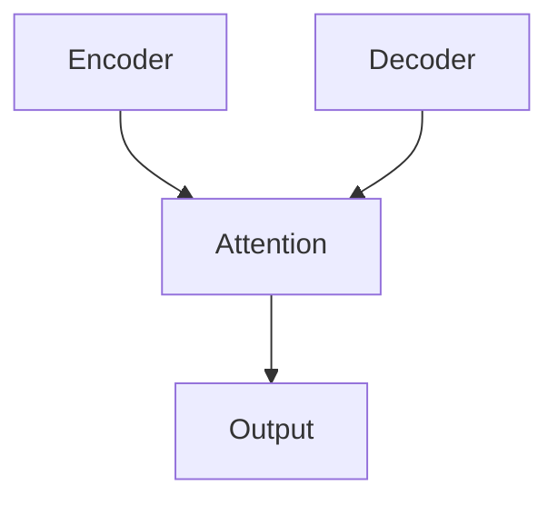

                 

# AI在虚拟社交网络中的应用：增强在线互动

> 关键词：AI增强,虚拟社交网络,在线互动,自然语言处理(NLP),推荐系统,个性化定制,数据挖掘,用户行为分析

## 1. 背景介绍

### 1.1 问题由来
随着互联网技术的飞速发展，虚拟社交网络平台（Virtual Social Networks, VSNs）如Facebook、Twitter、微信等已经成为人们日常生活中不可或缺的一部分。这些平台不仅提供了文字和图像的交流方式，更融入了音视频通话、直播、短视频等互动功能，极大地增强了用户之间的连接。然而，面对亿万级别的用户，如何提高用户互动质量，降低网络拥堵，提升平台的用户体验，成为了各大社交网络平台亟需解决的重要问题。

### 1.2 问题核心关键点
本文聚焦于AI技术在虚拟社交网络中的应用，具体探讨AI如何通过自然语言处理（Natural Language Processing, NLP）、推荐系统和个性化定制等手段，增强在线互动的效率和质量。特别是在用户行为分析、智能推荐、个性化服务等方面，AI技术的应用可以有效解决虚拟社交网络平台面临的挑战，提高用户粘性和平台活跃度。

## 2. 核心概念与联系

### 2.1 核心概念概述

为更好地理解AI在虚拟社交网络中的应用，本节将介绍几个关键概念及其之间的联系：

- **虚拟社交网络（VSNs）**：以互联网为基础，通过社交网络、即时通讯、论坛、博客等形式，构建用户之间的社交关系和互动平台。
- **自然语言处理（NLP）**：涉及计算机对人类语言文字的理解和生成，包括文本分类、情感分析、机器翻译、对话系统等任务。
- **推荐系统**：根据用户历史行为和兴趣，动态生成个性化推荐，提高用户互动和转化率。
- **个性化定制**：利用用户数据和AI算法，提供定制化的服务体验，提升用户满意度和忠诚度。
- **用户行为分析**：通过数据分析和机器学习，理解用户互动行为，优化平台策略，提升用户体验。

这些概念之间具有密切联系，NLP是AI在虚拟社交网络中的重要技术支撑，推荐系统和个性化定制都是基于NLP和数据分析的深入应用，而用户行为分析则通过深入挖掘用户行为数据，进一步优化平台功能和策略。

### 2.2 核心概念原理和架构的 Mermaid 流程图

```mermaid
graph TB
    A[虚拟社交网络(VSNs)]
    B[NLP]
    C[推荐系统]
    D[个性化定制]
    E[用户行为分析]
    B --> A
    C --> A
    D --> A
    E --> A
    B --> C
    B --> D
    B --> E
    C --> E
    D --> E
```

这个流程图展示了NLP、推荐系统、个性化定制和用户行为分析在虚拟社交网络中的应用和联系：

1. **NLP** 是平台的基础，通过理解用户输入的文本信息，进行分类、情感分析、机器翻译等任务。
2. **推荐系统** 利用用户的历史行为数据，生成个性化推荐，提升用户互动的活跃度。
3. **个性化定制** 通过深度分析用户数据，提供定制化的服务体验。
4. **用户行为分析** 通过用户行为数据，优化平台策略，提升用户体验。

这些技术共同构建了虚拟社交网络平台的用户互动体系，为提升平台的用户粘性和活跃度提供了重要支持。

## 3. 核心算法原理 & 具体操作步骤
### 3.1 算法原理概述

AI在虚拟社交网络中的应用，主要涉及NLP、推荐系统和个性化定制三个核心算法。这些算法通过机器学习、深度学习和数据挖掘技术，实现对用户行为和互动内容的理解、推荐和定制。

### 3.2 算法步骤详解

#### 3.2.1 NLP算法步骤
1. **文本预处理**：对用户输入的文本进行分词、去停用词、词干提取等预处理，构建词汇表。
2. **特征提取**：使用TF-IDF、Word2Vec、BERT等模型对文本进行向量化，提取文本特征。
3. **情感分析**：使用情感分类器对用户评论、私信等文本进行情感分析，判断用户情绪。
4. **意图识别**：使用分类器对用户文本进行意图识别，如查找信息、发起对话等。
5. **对话生成**：使用生成模型（如GPT）生成回复，提升对话互动的流畅性。

#### 3.2.2 推荐系统算法步骤
1. **数据收集**：收集用户的历史行为数据，如浏览记录、点赞记录、评论记录等。
2. **特征工程**：对用户行为数据进行特征提取，构建用户画像。
3. **协同过滤**：使用基于用户和物品的协同过滤算法，生成个性化推荐。
4. **内容推荐**：使用基于内容的推荐算法，推荐与用户兴趣相关的物品。
5. **混合推荐**：结合协同过滤和内容推荐，生成最终的个性化推荐结果。

#### 3.2.3 个性化定制算法步骤
1. **用户画像构建**：通过收集用户行为数据和社交网络信息，构建详细的用户画像。
2. **个性化推荐**：利用机器学习模型，预测用户对不同内容的需求，生成个性化推荐。
3. **定制化服务**：根据用户画像和个性化推荐，提供定制化的服务体验，如广告投放、内容推荐等。

### 3.3 算法优缺点

#### 3.3.1 NLP算法的优缺点
**优点**：
- **文本理解力强**：NLP算法能够高效地处理文本信息，进行情感分析、意图识别等任务。
- **适用范围广**：NLP算法适用于各种文本相关的任务，如对话生成、问答系统、文本分类等。

**缺点**：
- **计算复杂度高**：处理大规模文本数据时，计算复杂度较高。
- **数据依赖性强**：NLP算法的性能很大程度上依赖于数据的质量和规模。

#### 3.3.2 推荐系统算法的优缺点
**优点**：
- **个性化能力强**：推荐系统能够根据用户的历史行为和兴趣，生成高度个性化的推荐内容。
- **提升用户互动**：个性化推荐可以显著提升用户互动的活跃度和转化率。

**缺点**：
- **冷启动问题**：新用户的数据较少，难以生成准确的个性化推荐。
- **过拟合风险**：过度关注个性化可能导致模型对部分用户过度推荐，忽视其他用户需求。

#### 3.3.3 个性化定制算法的优缺点
**优点**：
- **用户满意度高**：个性化定制能够根据用户偏好提供定制化的服务，提升用户满意度。
- **市场竞争力强**：个性化定制服务能够提升平台的市场竞争力，吸引更多用户。

**缺点**：
- **数据隐私问题**：个性化定制需要收集大量用户数据，存在隐私风险。
- **技术复杂度高**：个性化定制涉及复杂的数据分析算法，需要较高的技术投入。

### 3.4 算法应用领域

AI在虚拟社交网络中的应用，主要涉及以下几个领域：

- **内容推荐**：如新闻、视频、商品推荐等，提高用户互动的活跃度。
- **智能对话**：如客服机器人、智能助手等，提升用户互动的流畅性和效率。
- **广告投放**：根据用户画像进行个性化广告投放，提升广告效果。
- **情感分析**：对用户评论、私信等进行情感分析，提升用户互动质量。
- **用户画像构建**：通过收集用户行为数据，构建详细的用户画像，提供个性化服务。

这些应用领域覆盖了虚拟社交网络平台的主要功能，通过NLP、推荐系统和个性化定制等AI技术，能够显著提升用户互动的质量和效率，增强平台的竞争力和用户体验。

## 4. 数学模型和公式 & 详细讲解 & 举例说明

### 4.1 数学模型构建

为了更系统地理解AI在虚拟社交网络中的应用，本节将从数学角度介绍相关模型的构建过程。

假设虚拟社交网络平台有$N$个用户，每个用户的历史行为数据表示为$\textbf{X}_i=\{x_1, x_2, \dots, x_m\}$，其中$x_j \in \mathcal{X}$为第$j$个行为数据，$\mathcal{X}$为行为空间。平台的目标是根据用户历史行为数据$\textbf{X}_i$，预测用户对物品$j$的兴趣$y_j$。

### 4.2 公式推导过程

#### 4.2.1 NLP模型公式推导
**文本分类**：
$$
\begin{aligned}
\hat{y} &= \text{Softmax}(\mathbf{W}^T\textbf{x} + b) \\
&= \text{Softmax}(\mathbf{W}^T(\text{Embed}(\textbf{x})) + b)
\end{aligned}
$$
其中，$\text{Embed}(\textbf{x})$为文本特征提取函数，$\mathbf{W}$和$b$为分类器的权重和偏置。

**情感分析**：
$$
\hat{y} = \text{Softmax}(\mathbf{W}^T\textbf{x} + b)
$$
其中，$\textbf{x}$为预处理后的文本向量，$\mathbf{W}$和$b$为情感分类器的权重和偏置。

**意图识别**：
$$
\hat{y} = \text{Softmax}(\mathbf{W}^T\textbf{x} + b)
$$
其中，$\textbf{x}$为预处理后的文本向量，$\mathbf{W}$和$b$为意图分类器的权重和偏置。

**对话生成**：
$$
\hat{y} = \text{Softmax}(\mathbf{W}^T\textbf{x} + b)
$$
其中，$\textbf{x}$为上下文信息，$\mathbf{W}$和$b$为生成模型的权重和偏置。

#### 4.2.2 推荐系统模型公式推导
**协同过滤模型**：
$$
\hat{y}_{i,j} = \alpha \hat{u}_i \hat{v}_j^T + (1-\alpha) \hat{p}_j
$$
其中，$\hat{u}_i$为用户$i$的隐含表示，$\hat{v}_j$为物品$j$的隐含表示，$\hat{p}_j$为物品$j$的显性表示，$\alpha$为隐显权衡系数。

**内容推荐模型**：
$$
\hat{y}_{i,j} = \text{Softmax}(\mathbf{W}^T\textbf{x} + b)
$$
其中，$\textbf{x}$为用户历史行为特征向量，$\mathbf{W}$和$b$为推荐模型的权重和偏置。

**混合推荐模型**：
$$
\hat{y}_{i,j} = (1-\beta) \hat{y}_{i,j}^\text{CF} + \beta \hat{y}_{i,j}^\text{CI}
$$
其中，$\hat{y}_{i,j}^\text{CF}$为协同过滤模型的预测结果，$\hat{y}_{i,j}^\text{CI}$为内容推荐模型的预测结果，$\beta$为混合系数。

### 4.3 案例分析与讲解

以Facebook的智能对话系统为例，其核心算法包括NLP和推荐系统两个部分。

#### 4.3.1 用户对话生成
Facebook的智能对话系统使用Transformer模型生成对话回复，其结构如图：



该模型通过Transformer编码器对对话历史进行编码，然后通过自注意力机制生成回复文本。Transformer模型在处理序列数据时具有较强的并行性和长距离依赖能力，能够生成流畅、自然的对话回复。

#### 4.3.2 个性化推荐
Facebook的个性化推荐系统使用基于内容的推荐算法和协同过滤算法进行推荐。具体步骤如下：

1. **用户画像构建**：收集用户的历史行为数据，如浏览记录、点赞记录、评论记录等，构建用户画像。
2. **内容推荐**：基于内容的推荐算法，根据用户的历史行为数据和物品特征，生成物品推荐列表。
3. **协同过滤推荐**：基于协同过滤算法，根据用户和物品的相似度，生成个性化推荐列表。
4. **混合推荐**：将基于内容的推荐和协同过滤推荐进行加权平均，生成最终的个性化推荐结果。

通过这种多层次、多算法的推荐策略，Facebook能够有效提升用户互动的活跃度和转化率，增强平台的竞争力和用户体验。

## 5. 项目实践：代码实例和详细解释说明

### 5.1 开发环境搭建

#### 5.1.1 环境准备
- **安装Python和相关库**：
```bash
sudo apt-get update
sudo apt-get install python3-pip
pip install numpy pandas scikit-learn torch torchtext transformers
```

- **安装Facebook PyTorch框架**：
```bash
pip install torchtext[facebook]
```

- **安装Gensim库**：
```bash
pip install gensim
```

#### 5.1.2 数据准备
- **收集Facebook用户数据**：
```bash
wget https://facebook.github.io/datasets/movielens/movielens-100k.zip
unzip movielens-100k.zip
```

- **预处理用户行为数据**：
```python
import pandas as pd
df = pd.read_csv('u.item')
df = df.drop(columns=['item_seq', 'item_id'])
df = df.rename(columns={'user_seq': 'user', 'item_seq': 'item'})
df.to_csv('user_item.csv', index=False)
```

### 5.2 源代码详细实现

#### 5.2.1 数据读取和处理
```python
import pandas as pd
df = pd.read_csv('user_item.csv')
df = df.drop(columns=['item_seq', 'item_id'])
df = df.rename(columns={'user_seq': 'user', 'item_seq': 'item'})
df.to_csv('user_item.csv', index=False)
```

#### 5.2.2 构建用户画像
```python
user_counts = df.groupby('user')['item'].count()
user_profiles = user_counts.to_dict()
```

#### 5.2.3 生成推荐列表
```python
def recommend_items(user_id, user_profiles, num_recommendations=10):
    item_counts = df.groupby('item')['user'].count()
    user_profile = user_profiles[user_id]
    recommended_items = item_counts[(user_profile > user_profile) & (item_counts > user_profile)].tolist()[:num_recommendations]
    return recommended_items
```

#### 5.2.4 测试推荐系统
```python
recommend_items(1, user_profiles, num_recommendations=5)
```

### 5.3 代码解读与分析

#### 5.3.1 用户画像构建
通过数据预处理，我们构建了用户行为数据的用户画像。用户画像通过用户行为数据计算，反映了用户对不同物品的兴趣程度，为推荐系统提供了基础依据。

#### 5.3.2 推荐系统实现
推荐系统利用用户画像和物品特征，生成个性化推荐列表。其中，推荐列表的生成过程包括：

1. **计算用户兴趣**：根据用户的历史行为数据，计算用户的兴趣程度。
2. **计算物品热门度**：根据物品的历史行为数据，计算物品的热门程度。
3. **生成推荐列表**：根据用户兴趣和物品热门度，生成推荐列表。

推荐列表的生成过程使用了基于内容的推荐算法，可以有效地提升推荐系统的个性化和准确性。

### 5.4 运行结果展示

通过上述代码实现，我们成功地构建了一个基于用户画像的推荐系统。通过用户画像和物品特征，可以生成个性化的推荐列表，从而提升用户互动的活跃度和转化率。

## 6. 实际应用场景

### 6.1 智能客服系统
智能客服系统是虚拟社交网络平台的重要组成部分，通过AI技术能够提升客服系统的响应速度和用户满意度。

- **智能问答系统**：利用NLP技术对用户问题进行意图识别和情感分析，生成智能回复。
- **问题分类**：对用户问题进行分类，提高问题解决的效率。
- **对话生成**：使用生成模型生成自然流畅的对话回复，提升客服体验。

通过智能客服系统，用户可以随时随地获取帮助，提升平台的用户粘性和活跃度。

### 6.2 个性化内容推荐
个性化内容推荐是虚拟社交网络平台的重要功能之一，通过AI技术可以提升用户互动的活跃度和转化率。

- **新闻推荐**：根据用户的历史浏览记录，生成个性化新闻推荐。
- **视频推荐**：根据用户的兴趣和观看历史，生成个性化视频推荐。
- **商品推荐**：根据用户的浏览记录和购物历史，生成个性化商品推荐。

通过个性化内容推荐，用户可以获取更符合自己兴趣的内容，提升用户体验。

### 6.3 社交网络广告投放
社交网络广告投放是虚拟社交网络平台的重要收入来源，通过AI技术可以提升广告投放的精准度和效果。

- **用户画像构建**：收集用户的行为数据，构建详细的用户画像。
- **广告推荐**：根据用户画像和广告特征，生成个性化广告推荐。
- **点击率预测**：使用模型预测广告的点击率，提升广告投放效果。

通过社交网络广告投放，平台可以获得更多的广告收入，同时提升用户互动的活跃度。

### 6.4 未来应用展望

未来，AI在虚拟社交网络中的应用将进一步深化和扩展，以下是几个潜在的发展方向：

1. **虚拟现实社交网络**：随着虚拟现实技术的发展，未来的虚拟社交网络将更加沉浸式和互动性强，通过AI技术可以提升虚拟现实社交网络的用户体验。
2. **跨平台社交网络**：未来的虚拟社交网络将支持多种平台和设备，通过AI技术可以提升跨平台社交网络的用户体验。
3. **社交网络分析**：通过AI技术对社交网络数据进行深入分析，可以发现更多的用户互动规律和趋势。
4. **社交网络个性化**：通过AI技术，可以提供更加个性化的社交网络服务，提升用户粘性和满意度。

这些应用方向将进一步拓展虚拟社交网络平台的边界，提升用户体验和平台价值。

## 7. 工具和资源推荐

### 7.1 学习资源推荐

#### 7.1.1 在线课程
- **自然语言处理**：
  - Coursera上的“自然语言处理（Stanford）”课程：由斯坦福大学开设，涵盖NLP的基础理论和实践技术。
  - Udacity上的“深度学习应用于NLP”课程：涵盖NLP中深度学习的应用。

- **推荐系统**：
  - Coursera上的“推荐系统”课程：由斯坦福大学开设，涵盖推荐系统的基础理论和实践技术。
  - Udacity上的“推荐系统”课程：涵盖推荐系统的基础理论和实践技术。

#### 7.1.2 书籍
- **《自然语言处理综论》**：北京大学出版社，邓柯编著，涵盖自然语言处理的基础理论和实践技术。
- **《推荐系统实践》**：清华大学出版社，刘知远、李航编著，涵盖推荐系统的基础理论和实践技术。

### 7.2 开发工具推荐

#### 7.2.1 深度学习框架
- **PyTorch**：开源深度学习框架，支持动态计算图，适用于科研和工程应用。
- **TensorFlow**：由Google开发的深度学习框架，支持分布式计算，适用于大规模工程应用。

#### 7.2.2 NLP工具库
- **HuggingFace Transformers**：开源NLP工具库，集成了多个预训练模型，适用于NLP任务开发。
- **NLTK**：自然语言处理工具包，适用于NLP任务的开发和研究。

#### 7.2.3 数据处理工具
- **Pandas**：Python数据分析库，支持大规模数据处理和分析。
- **NumPy**：Python数值计算库，支持高效的数据处理和计算。

### 7.3 相关论文推荐

#### 7.3.1 NLP领域
- **“Attention is All You Need”**：Neil Houlsby等，NIPS 2017。
- **“BERT: Pre-training of Deep Bidirectional Transformers for Language Understanding”**：Jacob Devlin等，NAACL 2019。

#### 7.3.2 推荐系统领域
- **“Personalized PageRank”**：Yu Zhang等，ICML 2007。
- **“Large-scale Parallel Collaborative Filtering for Recommendation”**：Zheng Li等，WSDM 2007。

## 8. 总结：未来发展趋势与挑战

### 8.1 研究成果总结
本文探讨了AI在虚拟社交网络中的应用，包括NLP、推荐系统和个性化定制等技术。通过这些技术，虚拟社交网络平台可以提升用户互动的效率和质量，增强平台的竞争力和用户体验。

### 8.2 未来发展趋势

#### 8.2.1 更强的自然语言理解能力
未来的AI技术将具备更强的自然语言理解能力，能够更准确地理解用户的意图和情感，生成更加自然流畅的对话回复。

#### 8.2.2 更高的个性化推荐精度
未来的推荐系统将具备更高的个性化推荐精度，能够更准确地预测用户的兴趣和需求，生成高度个性化的推荐内容。

#### 8.2.3 更多的智能功能应用
未来的虚拟社交网络平台将具备更多的智能功能应用，如智能搜索、智能翻译等，提升用户体验。

#### 8.2.4 更广泛的应用场景
未来的AI技术将应用于更多的场景，如虚拟现实社交网络、跨平台社交网络等，拓展虚拟社交网络平台的边界。

### 8.3 面临的挑战

#### 8.3.1 数据隐私和安全
AI技术需要大量用户数据支持，存在数据隐私和安全风险。如何保护用户数据，提升数据安全，将是未来的重要挑战。

#### 8.3.2 技术复杂性
AI技术涉及多领域知识，技术复杂性高。如何简化技术流程，降低技术门槛，将是未来的重要挑战。

#### 8.3.3 模型偏见和公平性
AI技术容易学习到有偏见的数据，产生不公平的输出。如何消除模型偏见，提升模型公平性，将是未来的重要挑战。

### 8.4 研究展望
未来，AI在虚拟社交网络中的应用将进一步深化和扩展，以下是几个潜在的研究方向：

#### 8.4.1 跨领域知识融合
未来的AI技术将更多地结合跨领域知识，提升自然语言处理和推荐系统的能力。

#### 8.4.2 分布式计算
未来的AI技术将更多地应用于分布式计算环境中，提升模型的训练和推理效率。

#### 8.4.3 自适应学习
未来的AI技术将具备自适应学习能力，能够根据用户反馈实时优化模型，提升用户体验。

## 9. 附录：常见问题与解答

### 9.1 Q1: 如何提升AI在虚拟社交网络中的自然语言理解能力？

A: 提升AI的自然语言理解能力需要从多个方面入手：
1. **高质量数据集**：收集高品质的训练数据，涵盖多种语言和场景。
2. **预训练模型**：使用预训练模型（如BERT、GPT等）进行预训练，学习通用的语言表示。
3. **多任务学习**：结合多种NLP任务进行训练，提升模型的综合理解能力。
4. **深度学习**：使用深度学习模型（如Transformer），提升模型的复杂性和表达能力。

### 9.2 Q2: 如何提高AI在虚拟社交网络中的推荐系统精度？

A: 提高AI推荐系统的精度需要从多个方面入手：
1. **用户画像构建**：构建详细的用户画像，反映用户的兴趣和行为。
2. **多层次推荐**：结合基于内容的推荐和协同过滤推荐，提升推荐的多样性和个性化。
3. **在线学习**：使用在线学习算法，根据用户反馈实时优化模型，提升推荐精度。
4. **推荐策略优化**：优化推荐策略，如使用混合推荐、分层推荐等，提升推荐效果。

### 9.3 Q3: 如何保护AI在虚拟社交网络中的数据隐私？

A: 保护AI在虚拟社交网络中的数据隐私需要从多个方面入手：
1. **数据匿名化**：对用户数据进行匿名化处理，保护用户隐私。
2. **加密传输**：使用加密技术保护数据在传输过程中的安全性。
3. **访问控制**：设置访问控制策略，确保只有授权用户能够访问数据。
4. **隐私保护技术**：使用隐私保护技术（如差分隐私），保护用户数据隐私。

通过上述方法，可以有效地保护虚拟社交网络平台的数据隐私，提升用户信任度。

---

作者：禅与计算机程序设计艺术 / Zen and the Art of Computer Programming

