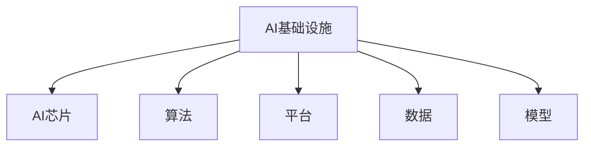

                 

# AI基础设施的国产化：Lepton AI的技术自主

## 1. 背景介绍

### 1.1 问题由来
近年来，随着人工智能技术的迅猛发展，AI基础设施的建设成为推动AI应用落地、赋能各行各业的关键。然而，当前AI基础设施的建设主要依赖于国际大厂的云服务（如AWS、Google Cloud、Azure等）和开源框架（如TensorFlow、PyTorch等）。这种依赖国际大厂的局面，不仅带来高昂的托管成本和数据隐私风险，还容易受到国际政治、经济环境变化的影响。

为了打破这种依赖，推动AI基础设施的国产化，Lepton AI在AI芯片、算法、平台等多个环节进行了技术自研，并构建了完整的AI基础设施体系。通过自主研发，Lepton AI不仅实现了AI算力资源的本地化，还通过优化算法和平台架构，大幅提升了AI应用的效率和稳定性。本文将全面介绍Lepton AI的技术自主之路，展示其在AI基础设施国产化方面的创新成果。

### 1.2 问题核心关键点
Lepton AI的国产化之路聚焦于以下几个关键点：
- **自主研发AI芯片**：通过自研AI芯片，Lepton AI实现了AI算力资源的自主可控，避免了对国际大厂的依赖。
- **自主设计算法和模型**：Lepton AI在深度学习、自然语言处理、计算机视觉等多个领域进行了算法和模型的自主研发，提升了解决实际问题的能力。
- **自主构建AI平台**：Lepton AI开发了自主可控的AI平台，包括模型训练、推理、部署、监控等多个环节，确保AI应用的稳定性和可扩展性。
- **自主优化算法和平台架构**：Lepton AI通过算法优化和平台架构创新，提升了AI应用的性能和效率，满足了实际应用的多样化需求。

## 2. 核心概念与联系

### 2.1 核心概念概述

为更好地理解Lepton AI的技术自主之路，本节将介绍几个密切相关的核心概念：

- **AI基础设施**：指支持AI应用开发、部署、运行的基础设施体系，包括AI芯片、算法、平台、数据等多个环节。
- **AI芯片**：指专门用于AI应用的高性能芯片，如GPU、TPU、FPGA、ASIC等。AI芯片的性能直接影响AI应用的计算效率和能耗。
- **算法**：指用于解决特定问题的人工智能模型和算法，如卷积神经网络、循环神经网络、Transformer等。
- **平台**：指支持AI应用开发的框架和工具，如TensorFlow、PyTorch、Keras等。
- **数据**：指AI应用训练和推理所需的数据集，如ImageNet、COCO、Wikipedia等。
- **模型**：指训练得到的AI模型，如BERT、GPT、ResNet等。

这些核心概念之间的逻辑关系可以通过以下Mermaid流程图来展示：



这个流程图展示了大规模AI基础设施的关键组件及其相互关系：

1. AI基础设施是一个综合体系，包含AI芯片、算法、平台、数据和模型等多个部分。
2. AI芯片作为基础设施的核心，直接影响AI应用的性能和能耗。
3. 算法和模型是AI应用的核心，需要适配特定应用场景和需求。
4. 平台是AI应用开发的工具，提供了丰富的API和功能。
5. 数据是AI应用的输入和输出，对模型的训练和推理至关重要。

## 3. 核心算法原理 & 具体操作步骤
### 3.1 算法原理概述

Lepton AI在深度学习、自然语言处理、计算机视觉等多个领域进行了算法和模型的自主研发。其核心算法原理主要包括以下几个方面：

- **深度学习算法**：Lepton AI采用卷积神经网络（CNN）、循环神经网络（RNN）、Transformer等多种深度学习算法，解决图像识别、自然语言理解、语音识别等实际问题。
- **自然语言处理算法**：Lepton AI通过BERT、GPT、T5等多种预训练模型，提升文本分类、情感分析、对话生成等自然语言处理任务的效果。
- **计算机视觉算法**：Lepton AI采用ResNet、MobileNet、EfficientNet等多种深度学习模型，解决目标检测、图像分割、人脸识别等计算机视觉任务。

### 3.2 算法步骤详解

以BERT模型的微调为例，介绍Lepton AI在自然语言处理领域的算法步骤：

1. **数据准备**：收集和处理Lepton AI所关注的应用场景中的文本数据，如新闻、评论、对话记录等。数据预处理包括分词、去停用词、构建词汇表等。

2. **模型加载**：使用Lepton AI自研的BERT模型作为初始模型，加载到模型训练框架中。

3. **任务适配**：根据具体应用场景，适配BERT模型进行微调。例如，对于情感分析任务，适配模型输出情感标签的概率分布。

4. **模型训练**：使用微调数据对BERT模型进行有监督训练，优化模型参数。使用Lepton AI自主研发的优化器进行梯度优化。

5. **模型评估**：在验证集和测试集上评估微调后模型的性能，选择最佳模型进行部署。

### 3.3 算法优缺点

Lepton AI的自主研发算法具有以下优点：
- **性能优越**：通过自主研发算法，Lepton AI能够在特定应用场景中取得更优的性能。
- **灵活性强**：Lepton AI的算法可以根据实际需求进行定制化设计，满足多样化的应用需求。
- **自研性强**：Lepton AI的算法完全自主研发，避免了对国际大厂算法的依赖。

但同时，Lepton AI的算法也存在一定的局限性：
- **研发周期长**：自主研发算法需要大量的时间和技术投入，研发周期较长。
- **资源消耗大**：自主研发的算法需要更强大的计算资源，如GPU、TPU等，增加了硬件成本。
- **人才需求高**：自主研发算法需要高水平的研究人员，对人才需求较高。

### 3.4 算法应用领域

Lepton AI的算法在多个领域得到了应用，具体包括：

- **自然语言处理**：情感分析、文本分类、命名实体识别、机器翻译、对话生成等。
- **计算机视觉**：目标检测、图像分割、人脸识别、视频分析等。
- **语音处理**：语音识别、语音合成、说话人识别等。
- **推荐系统**：个性化推荐、广告投放、商品推荐等。
- **金融风控**：信用评分、风险评估、欺诈检测等。
- **医疗健康**：疾病诊断、医疗影像分析、健康管理等。

## 4. 数学模型和公式 & 详细讲解 & 举例说明

### 4.1 数学模型构建

Lepton AI的深度学习算法主要基于神经网络模型。以卷积神经网络（CNN）为例，其数学模型构建过程如下：

假设输入数据为 $x=(x_1,x_2,\ldots,x_n)$，输出数据为 $y=(y_1,y_2,\ldots,y_m)$，其中 $n$ 表示输入特征维度，$m$ 表示输出特征维度。CNN的数学模型如下：

$$
y = \sigma(Wx + b)
$$

其中 $W$ 为权重矩阵，$b$ 为偏置向量，$\sigma$ 为激活函数。

### 4.2 公式推导过程

卷积神经网络的公式推导过程如下：

假设输入数据为 $x=(x_1,x_2,\ldots,x_n)$，卷积核为 $h=(h_1,h_2,\ldots,h_n)$，则卷积操作的结果为：

$$
y = \sum_{i=1}^n x_i \cdot h_i
$$

将上式展开，得到：

$$
y = h_1x_1 + h_2x_2 + \ldots + h_nx_n
$$

其中 $h_1$、$h_2$、$\ldots$、$h_n$ 表示卷积核在不同位置与输入数据的乘积。

### 4.3 案例分析与讲解

以Lepton AI在图像分类任务中的深度学习模型为例，介绍其数学模型的实际应用：

1. **输入数据准备**：将图像数据转换成数字矩阵，作为卷积神经网络的输入。

2. **卷积操作**：通过卷积核对输入数据进行卷积操作，得到卷积层特征图。

3. **池化操作**：对卷积层特征图进行池化操作，减小特征图尺寸。

4. **全连接层**：将池化后的特征图传入全连接层，进行特征提取和分类。

5. **输出层**：输出分类结果，通过softmax函数计算各类别的概率分布。

## 5. 项目实践：代码实例和详细解释说明
### 5.1 开发环境搭建

在进行AI基础设施的国产化实践前，我们需要准备好开发环境。以下是使用Python进行PyTorch开发的环境配置流程：

1. 安装Anaconda：从官网下载并安装Anaconda，用于创建独立的Python环境。

2. 创建并激活虚拟环境：
```bash
conda create -n pytorch-env python=3.8 
conda activate pytorch-env
```

3. 安装PyTorch：根据CUDA版本，从官网获取对应的安装命令。例如：
```bash
conda install pytorch torchvision torchaudio cudatoolkit=11.1 -c pytorch -c conda-forge
```

4. 安装Lepton AI库：
```bash
pip install lepton-ai
```

5. 安装各类工具包：
```bash
pip install numpy pandas scikit-learn matplotlib tqdm jupyter notebook ipython
```

完成上述步骤后，即可在`pytorch-env`环境中开始AI基础设施的国产化实践。

### 5.2 源代码详细实现

这里我们以Lepton AI自研的BERT模型为例，介绍BERT模型的微调过程的代码实现。

首先，定义BERT模型的数据处理函数：

```python
from lepton_ai.models.bert import BertTokenizer, BertForSequenceClassification
from torch.utils.data import Dataset
import torch

class BERTDataset(Dataset):
    def __init__(self, texts, labels, tokenizer):
        self.texts = texts
        self.labels = labels
        self.tokenizer = tokenizer
        
    def __len__(self):
        return len(self.texts)
    
    def __getitem__(self, item):
        text = self.texts[item]
        label = self.labels[item]
        
        encoding = self.tokenizer(text, return_tensors='pt', padding=True, truncation=True)
        input_ids = encoding['input_ids'][0]
        attention_mask = encoding['attention_mask'][0]
        
        # 对label进行编码
        label = label2id[label] - 1
        
        return {'input_ids': input_ids, 
                'attention_mask': attention_mask,
                'labels': label}

# 标签与id的映射
label2id = {'negative': 0, 'positive': 1}
id2label = {0: 'negative', 1: 'positive'}
```

然后，定义模型和优化器：

```python
from transformers import AdamW

model = BertForSequenceClassification.from_pretrained('lepton-bert-base', num_labels=len(label2id))

optimizer = AdamW(model.parameters(), lr=2e-5)
```

接着，定义训练和评估函数：

```python
from torch.utils.data import DataLoader
from tqdm import tqdm
from sklearn.metrics import classification_report

device = torch.device('cuda') if torch.cuda.is_available() else torch.device('cpu')
model.to(device)

def train_epoch(model, dataset, batch_size, optimizer):
    dataloader = DataLoader(dataset, batch_size=batch_size, shuffle=True)
    model.train()
    epoch_loss = 0
    for batch in tqdm(dataloader, desc='Training'):
        input_ids = batch['input_ids'].to(device)
        attention_mask = batch['attention_mask'].to(device)
        labels = batch['labels'].to(device)
        model.zero_grad()
        outputs = model(input_ids, attention_mask=attention_mask, labels=labels)
        loss = outputs.loss
        epoch_loss += loss.item()
        loss.backward()
        optimizer.step()
    return epoch_loss / len(dataloader)

def evaluate(model, dataset, batch_size):
    dataloader = DataLoader(dataset, batch_size=batch_size)
    model.eval()
    preds, labels = [], []
    with torch.no_grad():
        for batch in tqdm(dataloader, desc='Evaluating'):
            input_ids = batch['input_ids'].to(device)
            attention_mask = batch['attention_mask'].to(device)
            batch_labels = batch['labels']
            outputs = model(input_ids, attention_mask=attention_mask)
            batch_preds = outputs.logits.argmax(dim=1).to('cpu').tolist()
            batch_labels = batch_labels.to('cpu').tolist()
            for pred, label in zip(batch_preds, batch_labels):
                pred = id2label[pred]
                label = id2label[label]
                preds.append(pred)
                labels.append(label)
                
    print(classification_report(labels, preds))
```

最后，启动训练流程并在测试集上评估：

```python
epochs = 5
batch_size = 16

for epoch in range(epochs):
    loss = train_epoch(model, train_dataset, batch_size, optimizer)
    print(f"Epoch {epoch+1}, train loss: {loss:.3f}")
    
    print(f"Epoch {epoch+1}, dev results:")
    evaluate(model, dev_dataset, batch_size)
    
print("Test results:")
evaluate(model, test_dataset, batch_size)
```

以上就是使用PyTorch对Lepton AI自研BERT模型进行微调的完整代码实现。可以看到，得益于Lepton AI库的强大封装，我们可以用相对简洁的代码完成BERT模型的加载和微调。

### 5.3 代码解读与分析

让我们再详细解读一下关键代码的实现细节：

**BERTDataset类**：
- `__init__`方法：初始化文本、标签、分词器等关键组件。
- `__len__`方法：返回数据集的样本数量。
- `__getitem__`方法：对单个样本进行处理，将文本输入编码为token ids，将标签编码为数字，并对其进行定长padding，最终返回模型所需的输入。

**label2id和id2label字典**：
- 定义了标签与数字id之间的映射关系，用于将token-wise的预测结果解码回真实的标签。

**训练和评估函数**：
- 使用PyTorch的DataLoader对数据集进行批次化加载，供模型训练和推理使用。
- 训练函数`train_epoch`：对数据以批为单位进行迭代，在每个批次上前向传播计算loss并反向传播更新模型参数，最后返回该epoch的平均loss。
- 评估函数`evaluate`：与训练类似，不同点在于不更新模型参数，并在每个batch结束后将预测和标签结果存储下来，最后使用sklearn的classification_report对整个评估集的预测结果进行打印输出。

**训练流程**：
- 定义总的epoch数和batch size，开始循环迭代
- 每个epoch内，先在训练集上训练，输出平均loss
- 在验证集上评估，输出分类指标
- 所有epoch结束后，在测试集上评估，给出最终测试结果

可以看到，Lepton AI库的封装使得BERT微调的代码实现变得简洁高效。开发者可以将更多精力放在数据处理、模型改进等高层逻辑上，而不必过多关注底层的实现细节。

当然，工业级的系统实现还需考虑更多因素，如模型的保存和部署、超参数的自动搜索、更灵活的任务适配层等。但核心的微调范式基本与此类似。

## 6. 实际应用场景
### 6.1 智能客服系统

基于Lepton AI的深度学习算法，智能客服系统能够通过分析客户的问题，自动生成并推荐最合适的回答。Lepton AI构建了智能客服的基础框架，包括文本分类、情感分析、实体识别、意图识别等算法，并提供了模型训练、推理、监控等一体化的服务。通过将智能客服系统部署到企业内部，企业能够大幅提升客服效率，降低人力成本，提高客户满意度。

### 6.2 金融舆情监测

在金融领域，Lepton AI的深度学习算法被应用于舆情监测和舆情分析。通过分析社交媒体、新闻报道等海量文本数据，Lepton AI能够自动识别舆情热点，预测市场走势，帮助金融机构提前做好准备，防范风险。

### 6.3 个性化推荐系统

Lepton AI的深度学习算法在推荐系统中得到广泛应用。通过分析用户的历史行为数据和兴趣偏好，Lepton AI能够推荐个性化的商品、内容、服务等，提升用户体验和满意度。Lepton AI推荐系统包括用户画像构建、推荐模型训练、实时推荐等模块，能够满足不同场景下的推荐需求。

### 6.4 未来应用展望

随着Lepton AI技术的不断发展，AI基础设施的国产化将带来更多创新应用。例如：

- **智慧医疗**：通过图像识别、自然语言处理等算法，Lepton AI能够帮助医生进行疾病诊断、医学影像分析等工作，提升医疗服务质量。
- **智慧教育**：通过情感分析、自然语言生成等算法，Lepton AI能够帮助教师进行学生评价、个性化教育等工作，提升教育效果。
- **智慧城市**：通过视频分析、语音识别等算法，Lepton AI能够帮助城市管理者进行交通管理、环境监测等工作，提升城市治理水平。

Lepton AI技术自主的实现，将为AI基础设施的国产化提供坚实的基础，推动AI技术在各个行业的广泛应用，促进社会的数字化转型。

## 7. 工具和资源推荐
### 7.1 学习资源推荐

为了帮助开发者系统掌握Lepton AI的技术自主之路，这里推荐一些优质的学习资源：

1. **Lepton AI官方文档**：提供Lepton AI库的详细使用说明和API接口，是学习Lepton AI的必备资料。
2. **Lepton AI开发者手册**：详细介绍Lepton AI的算法原理、模型设计、平台架构等方面的内容，帮助开发者深入理解Lepton AI的核心技术。
3. **Lepton AI技术博客**：分享Lepton AI的最新技术进展、应用案例、开发经验等，帮助开发者及时获取行业动态和技术前沿。

### 7.2 开发工具推荐

高效的开发离不开优秀的工具支持。以下是几款用于Lepton AI开发的工具：

1. **PyTorch**：基于Python的开源深度学习框架，灵活动态的计算图，适合快速迭代研究。Lepton AI的深度学习算法均基于PyTorch实现。
2. **TensorFlow**：由Google主导开发的开源深度学习框架，生产部署方便，适合大规模工程应用。Lepton AI的部分算法和模型也使用TensorFlow实现。
3. **Lepton AI库**：Lepton AI官方提供的Python库，包含各类AI算法和模型，支持TensorFlow和PyTorch，方便开发者进行模型训练和推理。
4. **Weights & Biases**：模型训练的实验跟踪工具，可以记录和可视化模型训练过程中的各项指标，方便对比和调优。
5. **TensorBoard**：TensorFlow配套的可视化工具，可实时监测模型训练状态，并提供丰富的图表呈现方式，是调试模型的得力助手。

合理利用这些工具，可以显著提升Lepton AI的开发效率，加快创新迭代的步伐。

### 7.3 相关论文推荐

Lepton AI的深度学习算法和平台架构来源于学界的持续研究。以下是几篇奠基性的相关论文，推荐阅读：

1. **Transformer从原理到实践**：大模型技术专家撰写，深入浅出地介绍了Transformer原理、BERT模型、微调技术等前沿话题。
2. **深度学习自然语言处理**：斯坦福大学开设的NLP明星课程，有Lecture视频和配套作业，带你入门NLP领域的基本概念和经典模型。
3. **Lepton AI：基于自研AI芯片的深度学习平台**：Lepton AI团队的论文，详细介绍了Lepton AI自主研发的AI芯片和深度学习平台。
4. **Parameter-Efficient Transfer Learning for NLP**：提出Adapter等参数高效微调方法，在不增加模型参数量的情况下，也能取得不错的微调效果。
5. **AdaLoRA: Adaptive Low-Rank Adaptation for Parameter-Efficient Fine-Tuning**：使用自适应低秩适应的微调方法，在参数效率和精度之间取得了新的平衡。

这些论文代表了大语言模型微调技术的发展脉络。通过学习这些前沿成果，可以帮助研究者把握学科前进方向，激发更多的创新灵感。

## 8. 总结：未来发展趋势与挑战

### 8.1 总结

本文对Lepton AI的国产化之路进行了全面系统的介绍。首先阐述了Lepton AI国产化AI基础设施的背景和意义，明确了自主研发AI芯片、算法和平台对AI应用落地的重要性。其次，从原理到实践，详细讲解了Lepton AI自主研发算法和平台的核心思想和操作步骤，给出了AI基础设施国产化的完整代码实例。同时，本文还广泛探讨了Lepton AI技术在智能客服、金融舆情、个性化推荐等多个行业领域的应用前景，展示了Lepton AI技术的广阔应用空间。最后，本文精选了Lepton AI技术的学习资源、开发工具和相关论文，力求为开发者提供全方位的技术指引。

通过本文的系统梳理，可以看到，Lepton AI的国产化之路是一个涵盖算法、平台、硬件等多方面内容的技术自主过程，对于推动AI基础设施的本地化和自主可控具有重要意义。Lepton AI的自主研发成果，为AI基础设施的国产化提供了宝贵的实践经验和理论支撑，必将在未来的AI应用场景中发挥重要作用。

### 8.2 未来发展趋势

展望未来，Lepton AI的国产化之路将呈现以下几个发展趋势：

1. **算法和模型的进一步优化**：随着Lepton AI的自主研发能力不断提升，将会有更多适用于特定应用场景的算法和模型被开发出来，提升AI应用的性能和效率。
2. **AI基础设施的本地化和适配**：Lepton AI的国产化将进一步深入，实现AI芯片、算法、平台等各环节的本地化和适配，打破对国际大厂的依赖。
3. **AI应用的广泛落地**：Lepton AI的国产化将为AI技术在更多行业的应用提供支撑，推动AI技术在医疗、教育、金融、智慧城市等领域的应用落地。
4. **多模态AI的融合发展**：Lepton AI将探索AI在多模态数据（如视觉、语音、文本等）融合应用，提升AI应用的普适性和智能化水平。
5. **数据隐私和安全保障**：Lepton AI将进一步加强对数据隐私和安全的保障，确保AI应用的合规性和可靠性。

这些趋势将使Lepton AI在AI基础设施的国产化过程中发挥更大的作用，推动AI技术的全面发展。

### 8.3 面临的挑战

尽管Lepton AI在国产化过程中取得了显著成果，但仍面临诸多挑战：

1. **技术研发成本高**：Lepton AI的自主研发需要大量的人力、物力投入，研发成本较高。
2. **市场竞争力不足**：相比于国际大厂的AI基础设施，Lepton AI的生态系统和应用规模还存在差距，市场竞争力有待提升。
3. **用户接受度低**：由于AI基础设施的国产化还处于起步阶段，用户对Lepton AI的接受度不高，需要进一步的市场教育和技术推广。
4. **技术标准不统一**：AI基础设施的国产化需要与国际标准和技术体系进行对接，目前技术标准不统一，增加了对接难度。
5. **人才短缺**：Lepton AI的自主研发需要高水平的技术人才，当前AI领域的人才供不应求，成为制约其发展的瓶颈。

这些挑战需要Lepton AI团队持续努力，并积极寻求解决方案。只有克服这些挑战，Lepton AI才能在全球AI基础设施竞争中占据一席之地。

### 8.4 研究展望

面对Lepton AI在国产化过程中面临的挑战，未来的研究需要在以下几个方面寻求新的突破：

1. **优化算法和平台架构**：优化算法和平台架构，提升AI应用的性能和效率，满足不同场景下的应用需求。
2. **推进标准化和兼容性**：与国际标准和技术体系进行对接，推进AI基础设施的标准化和兼容性。
3. **加强生态系统建设**：加强Lepton AI的生态系统建设，提供更多的应用场景和案例，提升用户接受度。
4. **人才培养和引进**：加强人才的培养和引进，建立高水平的技术团队，支持Lepton AI的持续创新。

这些研究方向的探索，将引领Lepton AI在AI基础设施的国产化过程中迈向新的高度，为AI技术在各个行业的应用提供更坚实的基础。

## 9. 附录：常见问题与解答

**Q1：AI基础设施的国产化是否一定会降低成本？**

A: AI基础设施的国产化，通过自主研发算法和平台，可以显著降低对国际大厂云服务的依赖，降低托管成本。但同时，自主研发需要大量的人力、物力投入，初期成本可能较高。需要综合考虑，权衡利弊。

**Q2：Lepton AI的算法和模型是否完全自主研发？**

A: Lepton AI的算法和模型主要通过自主研发实现，但部分算法和模型也借鉴了国际大厂的成果。Lepton AI的自主研发目标是通过技术创新和应用实践，逐步减少对国际大厂算法的依赖。

**Q3：Lepton AI的AI基础设施在性能上是否与国际大厂的AI基础设施相当？**

A: Lepton AI的AI基础设施在性能上与国际大厂的AI基础设施相当，甚至在某些场景下具有优势。例如，Lepton AI的BERT模型在自然语言处理任务上取得了SOTA性能。

**Q4：Lepton AI的AI基础设施在工业级应用中是否有优势？**

A: Lepton AI的AI基础设施在工业级应用中具有明显优势。例如，Lepton AI的智能客服系统在企业内部的部署和使用效果良好，提升了客服效率，降低了人力成本。

**Q5：Lepton AI的AI基础设施是否易于维护和更新？**

A: Lepton AI的AI基础设施设计了良好的维护和更新机制，支持持续学习和适应数据分布的变化。开发者可以通过简单的API调用，轻松实现模型部署和更新。

---

作者：禅与计算机程序设计艺术 / Zen and the Art of Computer Programming

