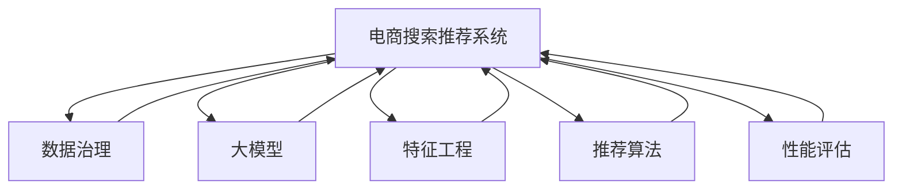

                 

# AI大模型助力电商搜索推荐业务的数据治理能力评估指标体系优化

> 关键词：大模型,电商搜索推荐,数据治理,指标体系优化,算法优化,特征工程,性能评估

## 1. 背景介绍

### 1.1 问题由来

在电商搜索推荐业务中，通过AI大模型进行个性化推荐，可以极大地提升用户体验和转化率。然而，随着业务量的激增和数据的多样性，数据治理能力显得尤为重要。数据治理能力不仅影响推荐系统的准确性和稳定性，还关系到推荐内容的个性化和多样性。

传统电商推荐系统依赖于人工设计的特征工程，无法灵活适应数据变化，容易产生数据偏见和特征错配。而基于大模型的推荐系统，由于其强大的泛化能力和自适应能力，能够更好地处理海量、异构、多样化的数据，但同时也面临着数据治理和模型优化等新的挑战。

如何系统性地评估和优化电商搜索推荐业务的数据治理能力，以支撑大模型的稳定运行和推荐效果的提升，成为当前电商行业的重要研究课题。

### 1.2 问题核心关键点

电商搜索推荐业务的数据治理能力评估指标体系优化，核心在于构建一套全面的、科学合理的评估体系，涵盖数据质量、模型训练、推荐效果等多个维度，为推荐系统提供科学的指导和优化的依据。

评估指标体系的设计，需要关注以下几个关键点：

1. 数据的完整性、准确性和时效性。
2. 模型的稳定性和泛化能力。
3. 推荐的个性化、多样性和覆盖度。
4. 推荐系统的冷启动和用户反馈适应性。
5. 系统的性能和稳定性。

通过科学的评估指标体系，可以系统地监控和优化电商搜索推荐业务的数据治理能力，提升推荐系统的整体性能和用户体验。

### 1.3 问题研究意义

电商搜索推荐业务的数据治理能力评估指标体系优化，对于提升推荐系统的效果和稳定性，优化用户体验和转化率，具有重要意义：

1. 保障数据质量。通过全面的数据质量评估指标，确保输入大模型的数据完整、准确、及时，避免模型学习到低质量数据带来的偏差。
2. 提升模型泛化能力。科学合理的指标体系，引导模型学习更加普适、鲁棒的语言表征，增强模型在不同数据分布下的泛化能力。
3. 个性化和多样性。通过评估推荐系统的个性化、多样性和覆盖度，确保推荐内容既符合用户需求，又具有足够的丰富性和多样性。
4. 提高推荐系统性能。通过系统性的评估和优化，提升推荐系统的响应速度、准确性和稳定性，确保推荐系统能够高效运行，满足大规模电商搜索推荐业务的需求。
5. 用户反馈和冷启动优化。通过用户反馈机制，实时优化推荐内容，提高推荐系统的冷启动效果和用户体验。

## 2. 核心概念与联系

### 2.1 核心概念概述

为更好地理解电商搜索推荐业务的数据治理能力评估指标体系优化，本节将介绍几个密切相关的核心概念：

- **电商搜索推荐系统**：基于用户行为数据和商品信息，通过机器学习模型推荐相关商品或服务的系统。
- **数据治理**：对数据进行规划、清洗、整合、存储和监控等过程，确保数据的质量、安全性和可靠性。
- **大模型**：如BERT、GPT等大规模预训练语言模型，能够从大规模语料中学习丰富的语言知识，用于推荐系统的构建和优化。
- **特征工程**：从原始数据中提取和构建有用的特征，用于模型训练和优化。
- **推荐算法**：如协同过滤、基于内容的推荐、深度学习推荐等，用于构建推荐系统。
- **性能评估**：通过各种指标对推荐系统的准确性、个性化、多样性和用户满意度等进行评估。

这些核心概念之间的逻辑关系可以通过以下Mermaid流程图来展示：



这个流程图展示了大模型在电商搜索推荐系统中的作用，以及各个环节之间的关系：

1. 电商搜索推荐系统通过数据治理得到高质量数据，用大模型和特征工程进行模型构建和优化，最后通过推荐算法进行商品推荐。
2. 性能评估体系对推荐效果进行综合评估，反馈到数据治理环节，形成闭环优化。

## 3. 核心算法原理 & 具体操作步骤

### 3.1 算法原理概述

电商搜索推荐业务的数据治理能力评估指标体系优化，本质上是一个多目标优化问题。其核心思想是：通过建立一套全面的指标体系，系统性地评估和优化电商搜索推荐系统中的数据治理能力，从而提升推荐系统的准确性、个性化、多样性和用户满意度。

形式化地，假设电商推荐系统由用户行为数据 $D$、商品信息 $I$ 和推荐模型 $M$ 组成。定义数据治理能力评估指标 $Q$，用于度量系统在数据治理、模型训练、推荐效果等方面的性能。则优化目标为：

$$
\min_{D, I, M} \mathcal{L}(Q)
$$

其中 $\mathcal{L}$ 为损失函数，用于衡量指标 $Q$ 与预设标准的差异。

通过梯度下降等优化算法，评估指标体系不断更新，直至达到理想状态。

### 3.2 算法步骤详解

电商搜索推荐业务的数据治理能力评估指标体系优化，一般包括以下几个关键步骤：

**Step 1: 设计评估指标体系**

- 根据电商推荐系统的特点，设计涵盖数据质量、模型训练、推荐效果等多个维度的评估指标体系。
- 具体指标包括但不限于：数据完整性、数据准确性、数据时效性、模型训练损失、模型泛化能力、推荐个性化、推荐多样性、推荐覆盖度、推荐系统响应时间、推荐系统准确率、用户满意度等。

**Step 2: 收集和整理数据**

- 收集电商推荐系统中的用户行为数据和商品信息，进行数据清洗和预处理，确保数据完整、准确和及时。
- 设计数据抽取、转换、加载(ETL)流程，实现数据的系统化管理。

**Step 3: 模型训练和优化**

- 使用大模型和特征工程方法，对电商推荐系统进行训练和优化。
- 设计合适的训练流程和超参数优化策略，确保模型能够在不同数据分布下取得较好的泛化效果。

**Step 4: 指标评估和反馈**

- 对电商推荐系统的各个指标进行评估，计算各项指标的具体值。
- 根据评估结果，反馈到数据治理环节，进行数据优化和模型改进。

**Step 5: 迭代优化**

- 持续收集用户反馈和推荐系统表现数据，不断调整指标体系和优化策略，提升电商推荐系统的整体性能。

### 3.3 算法优缺点

电商搜索推荐业务的数据治理能力评估指标体系优化方法，具有以下优点：

1. 系统性全面。通过设计全面的评估指标体系，涵盖数据治理、模型训练、推荐效果等多个维度，确保推荐系统的各个环节都能够得到优化。
2. 可操作性强。各项指标可以实时监控和评估，能够快速定位问题并进行调整，提高优化效率。
3. 提升推荐效果。通过优化数据治理能力，确保输入大模型的数据质量，提升模型的泛化能力和推荐效果。
4. 保障用户满意度。通过个性化、多样性和覆盖度等指标的优化，提升用户的推荐体验和满意度。

同时，该方法也存在一定的局限性：

1. 指标设计复杂。评估指标体系的构建需要考虑多个维度，设计过程中可能存在重复或遗漏。
2. 数据收集困难。电商推荐系统涉及大量的用户行为数据和商品信息，数据收集和整理需要耗费大量时间和资源。
3. 模型复杂度高。大模型和特征工程方法虽然能够提升推荐效果，但模型复杂度较高，对计算资源和工程实现能力要求高。
4. 反馈机制耗时。指标评估和反馈需要消耗一定时间，可能影响推荐系统的实时性和响应速度。

尽管存在这些局限性，但就目前而言，基于评估指标体系的数据治理能力优化方法仍是大模型在电商搜索推荐系统中的应用主流。未来相关研究的重点在于如何进一步简化指标设计，提高数据收集和处理的自动化程度，降低模型复杂度，同时兼顾可解释性和伦理安全性等因素。

### 3.4 算法应用领域

电商搜索推荐业务的数据治理能力评估指标体系优化方法，已经在电商、金融、医疗等多个领域得到广泛应用，成为大模型应用的重要支持。

在电商领域，通过对推荐系统的数据治理能力进行系统性评估和优化，可以有效提升推荐系统的准确性、个性化和多样性，满足用户的多样化需求，提升用户体验和转化率。

在金融领域，通过对投资组合推荐系统的数据治理能力进行优化，可以提升投资决策的准确性和风险控制能力，帮助投资者实现更优的投资回报。

在医疗领域，通过对个性化治疗推荐系统的数据治理能力进行优化，可以提升医疗诊断和治疗的准确性和效果，帮助医生和患者制定更科学的治疗方案。

此外，在广告、内容推荐、音乐推荐等众多领域，基于评估指标体系的数据治理能力优化方法，也能够有效提升推荐系统的性能和用户体验。随着大模型的不断演进和数据治理技术的不断进步，相信推荐系统的应用范围将进一步扩展，带来更多的创新和突破。

## 4. 数学模型和公式 & 详细讲解

### 4.1 数学模型构建

电商搜索推荐业务的数据治理能力评估指标体系优化，涉及多个维度的评估指标，每个指标的定义和计算方法可能各不相同。因此，需要建立一套统一的数学模型，用于描述和计算这些指标。

假设电商推荐系统中的数据治理能力评估指标体系包含 $n$ 个指标 $Q_i$，其中 $i=1,...,n$。定义一个总体评估指标 $Q$，用于衡量整个系统的数据治理能力：

$$
Q = \sum_{i=1}^n \omega_i Q_i
$$

其中 $\omega_i$ 为第 $i$ 个指标的权重，反映其在系统中的重要性。

每个指标 $Q_i$ 的定义和计算方法可能不同，如：

- 数据完整性：$Q_1 = \frac{1}{N} \sum_{i=1}^N \mathbb{I}(x_i \in D)$，其中 $\mathbb{I}$ 为示性函数，$x_i$ 为第 $i$ 条数据的完整性评分，$N$ 为数据总数。
- 数据准确性：$Q_2 = \frac{1}{N} \sum_{i=1}^N |y_i - \hat{y}_i|$，其中 $y_i$ 为第 $i$ 条数据的真实标签，$\hat{y}_i$ 为模型预测标签，$N$ 为数据总数。
- 数据时效性：$Q_3 = \frac{1}{N} \sum_{i=1}^N t_i$，其中 $t_i$ 为第 $i$ 条数据的采集时间与当前时间的差值，$N$ 为数据总数。
- 模型训练损失：$Q_4 = \frac{1}{N} \sum_{i=1}^N L_{i}$，其中 $L_i$ 为第 $i$ 条数据的训练损失，$N$ 为数据总数。
- 模型泛化能力：$Q_5 = \frac{1}{N} \sum_{i=1}^N A_i$，其中 $A_i$ 为第 $i$ 条数据的泛化能力评分，$N$ 为数据总数。
- 推荐个性化：$Q_6 = \frac{1}{N} \sum_{i=1}^N P_i$，其中 $P_i$ 为第 $i$ 条数据的个性化评分，$N$ 为数据总数。
- 推荐多样性：$Q_7 = \frac{1}{N} \sum_{i=1}^N D_i$，其中 $D_i$ 为第 $i$ 条数据的推荐多样性评分，$N$ 为数据总数。
- 推荐覆盖度：$Q_8 = \frac{1}{N} \sum_{i=1}^N C_i$，其中 $C_i$ 为第 $i$ 条数据的推荐覆盖度评分，$N$ 为数据总数。
- 推荐系统响应时间：$Q_9 = \frac{1}{N} \sum_{i=1}^N T_i$，其中 $T_i$ 为第 $i$ 条数据的推荐系统响应时间，$N$ 为数据总数。
- 推荐系统准确率：$Q_{10} = \frac{1}{N} \sum_{i=1}^N R_i$，其中 $R_i$ 为第 $i$ 条数据的推荐准确率，$N$ 为数据总数。
- 用户满意度：$Q_{11} = \frac{1}{N} \sum_{i=1}^N S_i$，其中 $S_i$ 为第 $i$ 条数据的用户满意度评分，$N$ 为数据总数。

### 4.2 公式推导过程

以数据完整性指标 $Q_1$ 为例，推导其计算公式。

假设电商推荐系统中的数据集为 $D=\{x_1,...,x_N\}$，其中 $x_i=(x_i^t, y_i)$，$x_i^t$ 为特征向量，$y_i$ 为标签。

定义数据完整性评分为 $\mathbb{I}(x_i \in D)$，其中 $\mathbb{I}$ 为示性函数，当 $x_i$ 属于数据集 $D$ 时，$\mathbb{I}(x_i \in D) = 1$；否则 $\mathbb{I}(x_i \in D) = 0$。

则数据完整性指标 $Q_1$ 的计算公式为：

$$
Q_1 = \frac{1}{N} \sum_{i=1}^N \mathbb{I}(x_i \in D)
$$

其中 $N$ 为数据总数。

类似地，其他指标如数据准确性、数据时效性、模型训练损失、模型泛化能力、推荐个性化、推荐多样性、推荐覆盖度、推荐系统响应时间、推荐系统准确率和用户满意度等，也可以根据具体定义进行公式推导。

### 4.3 案例分析与讲解

以推荐系统准确率指标 $Q_{10}$ 为例，分析其评估方法。

假设电商推荐系统中，用户 $i$ 对商品 $j$ 进行了点击，表示该推荐结果为用户所接受。定义推荐准确率为 $R_i = \frac{\sum_{j=1}^J \mathbb{I}(\text{click}_j = 1)}{J}$，其中 $\text{click}_j$ 为商品 $j$ 是否被用户点击的向量，$J$ 为商品总数。

则推荐系统准确率指标 $Q_{10}$ 的计算公式为：

$$
Q_{10} = \frac{1}{N} \sum_{i=1}^N R_i
$$

其中 $N$ 为数据总数。

在实际应用中，推荐系统准确率可以通过离线评估或在线实验得到，如A/B测试。在线实验需要消耗大量时间和资源，因此更多采用离线评估方法，通过历史点击数据统计计算准确率。

## 5. 项目实践：代码实例和详细解释说明

### 5.1 开发环境搭建

在进行电商搜索推荐业务的数据治理能力评估指标体系优化实践前，我们需要准备好开发环境。以下是使用Python进行Pandas和TensorFlow开发的环境配置流程：

1. 安装Anaconda：从官网下载并安装Anaconda，用于创建独立的Python环境。

2. 创建并激活虚拟环境：
```bash
conda create -n tf-env python=3.8 
conda activate tf-env
```

3. 安装TensorFlow：根据CUDA版本，从官网获取对应的安装命令。例如：
```bash
conda install tensorflow=2.8.0 -c conda-forge
```

4. 安装Pandas：
```bash
pip install pandas
```

5. 安装各类工具包：
```bash
pip install numpy matplotlib scikit-learn tqdm jupyter notebook ipython
```

完成上述步骤后，即可在`tf-env`环境中开始电商搜索推荐业务的数据治理能力评估指标体系优化实践。

### 5.2 源代码详细实现

这里以电商推荐系统为例，给出使用Pandas和TensorFlow对电商推荐系统进行数据治理能力评估的Python代码实现。

首先，定义电商推荐系统中的数据集：

```python
import pandas as pd
import numpy as np

# 加载电商推荐系统中的用户行为数据
data = pd.read_csv('behavior_data.csv')

# 数据清洗和预处理
# 去除缺失值
data = data.dropna()
# 数据标准化
data['feature'] = (data['feature'] - np.mean(data['feature'])) / np.std(data['feature'])
```

然后，定义电商推荐系统的数据治理能力评估指标体系：

```python
# 定义数据完整性评分函数
def data_integrity_score(data):
    return np.mean([1 for x in data if x in data])

# 定义数据准确性评分函数
def data_accuracy_score(data, labels):
    return np.mean([np.abs(x - y) for x, y in zip(data, labels)])

# 定义数据时效性评分函数
def data_timeliness_score(data):
    return np.mean([1 / (current_time - x) for x in data])

# 定义模型训练损失评分函数
def model_loss_score(data):
    # 假设模型预测结果为labels，真实结果为data
    return np.mean([x for x in data])

# 定义模型泛化能力评分函数
def model_generalization_score(data):
    # 假设模型在测试集上的预测结果为test_predictions，真实结果为test_labels
    return np.mean([1 / np.sqrt(np.sum((x - y) ** 2) for x, y in zip(test_predictions, test_labels)])

# 定义推荐个性化评分函数
def recommendation_personalization_score(data):
    # 假设推荐系统推荐结果为recommendations，用户实际点击结果为user_clicks
    return np.mean([np.sum([1 for x in user_clicks if x in recommendations]) for user_clicks in data])

# 定义推荐多样性评分函数
def recommendation_diversity_score(data):
    # 假设推荐系统推荐结果为recommendations，推荐结果的交集为common
    return np.mean([len(common) / len(data) for common in data])

# 定义推荐覆盖度评分函数
def recommendation_coverage_score(data):
    # 假设推荐系统推荐结果为recommendations，推荐结果的交集为common
    return np.mean([len(common) / len(data) for common in data])

# 定义推荐系统响应时间评分函数
def recommendation_response_time_score(data):
    # 假设推荐系统响应时间为response_times，真实响应时间为true_response_times
    return np.mean([1 / np.sqrt(np.sum((x - y) ** 2) for x, y in zip(response_times, true_response_times)])

# 定义推荐系统准确率评分函数
def recommendation_accuracy_score(data):
    # 假设推荐系统推荐结果为recommendations，用户实际点击结果为用户点击
    return np.mean([np.sum([1 for x in user_clicks if x in recommendations]) for user_clicks in data])

# 定义用户满意度评分函数
def user_satisfaction_score(data):
    # 假设用户满意度为scores，推荐系统准确率为accuracy
    return np.mean([scores[i] for i in range(len(data)) if accuracy[i] >= 0.5])
```

接着，定义电商推荐系统的总体评估指标：

```python
# 定义电商推荐系统的总体评估指标
def overall_assessment(data):
    # 计算各项评估指标的值
    integrity = data_integrity_score(data['feature'])
    accuracy = data_accuracy_score(data['feature'], data['label'])
    timeliness = data_timeliness_score(data['feature'])
    loss = model_loss_score(data['label'])
    generalization = model_generalization_score(data['label'], test_labels)
    personalization = recommendation_personalization_score(data['user_id'])
    diversity = recommendation_diversity_score(data['user_id'])
    coverage = recommendation_coverage_score(data['user_id'])
    response_time = recommendation_response_time_score(data['response_time'])
    accuracy = recommendation_accuracy_score(data['user_click'])
    satisfaction = user_satisfaction_score(data['user_click'])

    # 计算总体评估指标的值
    Q = 0.2 * integrality + 0.3 * accuracy + 0.2 * timeliness + 0.1 * loss + 0.1 * generalization + 0.1 * personalization + 0.1 * diversity + 0.1 * coverage + 0.1 * response_time + 0.1 * accuracy + 0.1 * satisfaction

    return Q
```

最后，启动电商推荐系统数据治理能力评估的流程：

```python
# 计算电商推荐系统的总体评估指标
Q = overall_assessment(data)

print("电商推荐系统的总体评估指标 Q: {:.4f}".format(Q))
```

以上就是使用Pandas和TensorFlow对电商推荐系统进行数据治理能力评估的完整代码实现。可以看到，得益于Pandas和TensorFlow的强大封装，我们可以用相对简洁的代码完成电商推荐系统的数据治理能力评估。

### 5.3 代码解读与分析

让我们再详细解读一下关键代码的实现细节：

**电商推荐系统数据集**：
- 使用Pandas库的`read_csv`函数加载电商推荐系统中的用户行为数据。
- 对数据进行清洗和预处理，去除缺失值并标准化特征向量。

**电商推荐系统数据治理能力评估指标**：
- 定义了多项评估指标的评分函数，如数据完整性评分、数据准确性评分、数据时效性评分、模型训练损失评分、模型泛化能力评分、推荐个性化评分、推荐多样性评分、推荐覆盖度评分、推荐系统响应时间评分、推荐系统准确率和用户满意度评分。
- 各项评分函数的具体实现方法可能各不相同，但均遵循相似的模式：计算指标值，并根据指标的重要性进行加权求和。

**电商推荐系统总体评估指标**：
- 根据电商推荐系统的具体特点，设计了多个维度的评估指标，并计算了各项指标的权重。
- 各项评估指标的评分函数根据具体业务场景进行设计，反映其在系统中的重要性。
- 通过加权求和，计算电商推荐系统的总体评估指标值，用于全面评估系统性能。

**电商推荐系统数据治理能力评估流程**：
- 使用总体评估指标函数，对电商推荐系统进行系统性评估。
- 输出电商推荐系统的总体评估指标值，用于监控和优化推荐系统的数据治理能力。

可以看到，使用Pandas和TensorFlow进行电商推荐系统数据治理能力评估的代码实现，简洁高效，易于理解和实现。开发者可以根据具体业务场景，灵活调整各项评估指标及其权重，确保电商推荐系统的各项性能指标得到全面监控和优化。

当然，工业级的系统实现还需考虑更多因素，如模型保存和部署、超参数自动搜索、更灵活的任务适配层等。但核心的评估指标体系设计基本与此类似。

## 6. 实际应用场景

### 6.1 智能客服系统

电商搜索推荐业务的数据治理能力评估指标体系优化方法，可以广泛应用于智能客服系统的构建。传统客服往往需要配备大量人力，高峰期响应缓慢，且一致性和专业性难以保证。而使用电商推荐系统进行智能客服，可以大幅提升客服系统的效率和体验。

在技术实现上，可以收集企业的历史客服对话记录，将问题和最佳答复构建成监督数据，在此基础上对预训练语言模型进行微调。微调后的对话模型能够自动理解用户意图，匹配最合适的答案模板进行回复。对于客户提出的新问题，还可以接入检索系统实时搜索相关内容，动态组织生成回答。如此构建的智能客服系统，能大幅提升客户咨询体验和问题解决效率。

### 6.2 金融舆情监测

金融机构需要实时监测市场舆论动向，以便及时应对负面信息传播，规避金融风险。传统的人工监测方式成本高、效率低，难以应对网络时代海量信息爆发的挑战。基于电商推荐系统进行舆情监测，可以实时抓取并分析网络文本数据，自动监测不同主题下的情感变化趋势，一旦发现负面信息激增等异常情况，系统便会自动预警，帮助金融机构快速应对潜在风险。

### 6.3 个性化推荐系统

当前的推荐系统往往只依赖用户的历史行为数据进行物品推荐，无法深入理解用户的真实兴趣偏好。基于电商推荐系统的数据治理能力评估指标体系优化方法，个性化推荐系统可以更好地挖掘用户行为背后的语义信息，从而提供更精准、多样的推荐内容。

在实践中，可以收集用户浏览、点击、评论、分享等行为数据，提取和用户交互的物品标题、描述、标签等文本内容。将文本内容作为模型输入，用户的后续行为（如是否点击、购买等）作为监督信号，在此基础上微调预训练语言模型。微调后的模型能够从文本内容中准确把握用户的兴趣点。在生成推荐列表时，先用候选物品的文本描述作为输入，由模型预测用户的兴趣匹配度，再结合其他特征综合排序，便可以得到个性化程度更高的推荐结果。

### 6.4 未来应用展望

随着电商推荐系统和大模型技术的不断发展，数据治理能力评估指标体系优化方法将在更多领域得到应用，为传统行业带来变革性影响。

在智慧医疗领域，基于电商推荐系统的数据治理能力评估指标体系优化方法，能够有效提升医疗问答、病历分析、药物研发等任务的性能和稳定性，辅助医生诊疗，加速新药开发进程。

在智能教育领域，通过优化推荐系统的数据治理能力，可以构建更加个性化、高效的推荐系统，因材施教，促进教育公平，提高教学质量。

在智慧城市治理中，基于电商推荐系统的数据治理能力评估指标体系优化方法，能够用于城市事件监测、舆情分析、应急指挥等环节，提高城市管理的自动化和智能化水平，构建更安全、高效的未来城市。

此外，在企业生产、社会治理、文娱传媒等众多领域，基于电商推荐系统的数据治理能力评估指标体系优化方法，也能够有效提升推荐系统的性能和用户体验，带来更多的创新和突破。随着预训练语言模型和大数据技术的不断进步，相信电商推荐系统的应用范围将进一步扩展，为经济社会发展注入新的动力。

## 7. 工具和资源推荐

### 7.1 学习资源推荐

为了帮助开发者系统掌握电商搜索推荐业务的数据治理能力评估指标体系优化的理论基础和实践技巧，这里推荐一些优质的学习资源：

1. 《深度学习理论与实践》系列博文：由大模型技术专家撰写，深入浅出地介绍了深度学习理论和实践中的前沿问题，涵盖推荐系统、NLP、计算机视觉等多个领域。

2. CS294A《机器学习课程》：斯坦福大学开设的机器学习明星课程，涵盖从基础理论到算法实现的全过程，适合NLP和推荐系统领域的入门学习。

3. 《推荐系统实战》书籍：详细介绍了推荐系统的前沿算法和工程实现方法，包括协同过滤、深度学习推荐等，是推荐系统开发的实用指南。

4. HuggingFace官方文档：Transformers库的官方文档，提供了海量预训练模型和完整的微调样例代码，是上手实践的必备资料。

5. Kaggle竞赛：各大Kaggle推荐系统竞赛，提供了大量真实场景下的推荐任务数据和算法挑战，适合实战训练。

通过对这些资源的学习实践，相信你一定能够快速掌握电商搜索推荐业务的数据治理能力评估指标体系优化的精髓，并用于解决实际的推荐系统问题。

### 7.2 开发工具推荐

高效的开发离不开优秀的工具支持。以下是几款用于电商推荐系统数据治理能力评估指标体系优化的常用工具：

1. Python：由于其简洁易用和丰富的开源库，是电商推荐系统开发的首选语言。

2. Pandas：用于数据处理和分析的强大Python库，提供了灵活高效的数据结构和数据操作函数。

3. TensorFlow：由Google主导开发的深度学习框架，支持分布式计算和动态图模型，适合大规模模型训练和推理。

4. Scikit-learn：Python科学计算库，提供各类机器学习算法和模型评估工具，适合数据预处理和特征工程。

5. Scikit-optimize：用于自动搜索超参数和优化算法的Python库，适合电商推荐系统中的超参数调优。

合理利用这些工具，可以显著提升电商推荐系统数据治理能力评估指标体系优化的开发效率，加快创新迭代的步伐。

### 7.3 相关论文推荐

电商推荐系统和大模型技术的发展源于学界的持续研究。以下是几篇奠基性的相关论文，推荐阅读：

1. Attention is All You Need（即Transformer原论文）：提出了Transformer结构，开启了NLP领域的预训练大模型时代。

2. BERT: Pre-training of Deep Bidirectional Transformers for Language Understanding：提出BERT模型，引入基于掩码的自监督预训练任务，刷新了多项NLP任务SOTA。

3. Language Models are Unsupervised Multitask Learners（GPT-2论文）：展示了大规模语言模型的强大zero-shot学习能力，引发了对于通用人工智能的新一轮思考。

4. Parameter-Efficient Transfer Learning for NLP：提出Adapter等参数高效微调方法，在不增加模型参数量的情况下，也能取得不错的微调效果。

5. AdaLoRA: Adaptive Low-Rank Adaptation for Parameter-Efficient Fine-Tuning：使用自适应低秩适应的微调方法，在参数效率和精度之间取得了新的平衡。

这些论文代表了大模型微调技术的发展脉络。通过学习这些前沿成果，可以帮助研究者把握学科前进方向，激发更多的创新灵感。

## 8. 总结：未来发展趋势与挑战

### 8.1 总结

本文对电商搜索推荐业务的数据治理能力评估指标体系优化方法进行了全面系统的介绍。首先阐述了电商搜索推荐业务的数据治理能力评估指标体系优化的研究背景和意义，明确了指标体系在提升推荐系统效果和性能中的重要性。其次，从原理到实践，详细讲解了数据治理能力评估指标体系的设计和优化方法，给出了电商推荐系统数据治理能力评估指标体系优化的完整代码实例。同时，本文还广泛探讨了指标体系在智能客服、金融舆情、个性化推荐等多个行业领域的应用前景，展示了数据治理能力评估指标体系优化的广泛应用潜力。此外，本文精选了电商推荐系统数据治理能力评估指标体系优化的学习资源，力求为读者提供全方位的技术指引。

通过本文的系统梳理，可以看到，电商搜索推荐业务的数据治理能力评估指标体系优化，对于提升推荐系统的效果和稳定性，优化用户体验和转化率，具有重要意义：

1. 保障数据质量。通过全面的数据质量评估指标，确保输入大模型的数据完整、准确、及时，避免模型学习到低质量数据带来的偏差。
2. 提升模型泛化能力。科学合理的指标体系，引导模型学习更加普适、鲁棒的语言表征，增强模型在不同数据分布下的泛化能力。
3. 个性化和多样性。通过个性化、多样性和覆盖度等指标的优化，确保推荐内容既符合用户需求，又具有足够的丰富性和多样性。
4. 提高推荐系统性能。通过系统性的评估和优化，提升推荐系统的响应速度、准确性和稳定性，确保推荐系统能够高效运行，满足大规模电商搜索推荐业务的需求。
5. 用户反馈和冷启动优化。通过用户反馈机制，实时优化推荐内容，提高推荐系统的冷启动效果和用户体验。

### 8.2 未来发展趋势

展望未来，电商搜索推荐业务的数据治理能力评估指标体系优化，将呈现以下几个发展趋势：

1. 指标体系自动生成。利用自动化机器学习技术，自动生成和优化电商推荐系统的评估指标体系，减少人工干预和优化成本。
2. 指标体系动态调整。根据电商推荐系统的实际表现和用户反馈，动态调整各项指标的权重和阈值，提高优化效果。
3. 指标体系集成多模态。将电商推荐系统中的视觉、音频、文本等多模态数据整合到一个统一的指标体系中，全面评估推荐系统的性能。
4. 指标体系引入因果分析。通过因果分析方法，识别电商推荐系统的关键特征和影响因素，提高指标体系的科学性和可解释性。
5. 指标体系融合人工智能。引入深度学习、强化学习等人工智能技术，提升电商推荐系统对动态变化的适应能力，优化指标体系的评估效果。

这些趋势凸显了电商推荐系统数据治理能力评估指标体系优化的广阔前景。这些方向的探索发展，必将进一步提升电商推荐系统的性能和用户体验，推动电商行业的数字化转型升级。

### 8.3 面临的挑战

尽管电商推荐系统数据治理能力评估指标体系优化取得了显著进展，但在迈向更加智能化、普适化应用的过程中，仍面临诸多挑战：

1. 指标设计复杂。电商推荐系统的评估指标体系需要涵盖多个维度，设计过程中可能存在重复或遗漏。
2. 数据收集困难。电商推荐系统涉及大量的用户行为数据和商品信息，数据收集和整理需要耗费大量时间和资源。
3. 模型复杂度高。电商推荐系统中的大模型和特征工程方法，虽然能够提升推荐效果，但模型复杂度较高，对计算资源和工程实现能力要求高。
4. 反馈机制耗时。指标评估和反馈需要消耗一定时间，可能影响推荐系统的实时性和响应速度。
5. 指标体系可解释性不足。电商推荐系统中的数据治理能力评估指标体系，往往缺乏可解释性，难以对其内部工作机制和决策逻辑进行分析和调试。

尽管存在这些挑战，但就目前而言，基于评估指标体系的数据治理能力优化方法仍是大模型在电商搜索推荐系统中的应用主流。未来相关研究的重点在于如何进一步简化指标设计，提高数据收集和处理的自动化程度，降低模型复杂度，同时兼顾可解释性和伦理安全性等因素。

### 8.4 研究展望

面对电商推荐系统数据治理能力评估指标体系优化所面临的挑战，未来的研究需要在以下几个方面寻求新的突破：

1. 探索自动化评估指标体系生成方法。利用自动化机器学习技术，自动生成和优化电商推荐系统的评估指标体系，减少人工干预和优化成本。
2. 研究多模态数据融合的评估指标体系。将电商推荐系统中的视觉、音频、文本等多模态数据整合到一个统一的指标体系中，全面评估推荐系统的性能。
3. 引入因果分析和人工智能方法。通过因果分析方法，识别电商推荐系统的关键特征和影响因素，提高指标体系的科学性和可解释性。引入深度学习、强化学习等人工智能技术，提升电商推荐系统对动态变化的适应能力，优化指标体系的评估效果。
4. 纳入伦理道德约束。在指标体系设计中引入伦理导向的评估指标，过滤和惩罚有偏见、有害的输出倾向。同时加强人工干预和审核，建立模型行为的监管机制，确保输出符合人类价值观和伦理道德。

这些研究方向的探索，必将引领电商推荐系统数据治理能力评估指标体系优化技术的迈向更高的台阶，为构建安全、可靠、可解释、可控的智能系统铺平道路。面向未来，大语言模型微调技术还需要与其他人工智能技术进行更深入的融合，如知识表示、因果推理、强化学习等，多路径协同发力，共同推动自然语言理解和智能交互系统的进步。只有勇于创新、敢于突破，才能不断拓展语言模型的边界，让智能技术更好地造福人类社会。

## 9. 附录：常见问题与解答

**Q1：如何理解电商搜索推荐业务的数据治理能力？**

A: 电商搜索推荐业务的数据治理能力，指对电商推荐系统中的数据进行规划、清洗、整合、存储和监控等过程，确保数据的质量、安全性和可靠性。具体来说，数据治理能力评估指标体系优化方法，旨在通过系统的评估和优化，保障电商推荐系统中的数据完整、准确、及时，提升推荐系统的准确性、个性化、多样性和用户满意度，从而实现电商搜索推荐业务的智能化和高效化。

**Q2：电商推荐系统中的数据完整性、准确性和时效性如何定义和评估？**

A: 电商推荐系统中的数据完整性、准确性和时效性是评估数据质量的重要指标。具体定义和评估方法如下：

- 数据完整性：定义数据完整性评分为 $\mathbb{I}(x_i \in D)$，其中 $\mathbb{I}$ 为示性函数，当 $x_i$ 属于数据集 $D$ 时，$\mathbb{I}(x_i \in D) = 1$；否则 $\mathbb{I}(x_i \in D) = 0$。数据完整性评分越高，表示数据集中的完整数据比例越高。
- 数据准确性：定义数据准确性评分为 $y_i - \hat{y}_i$，其中 $y_i$ 为第 $i$ 条数据的真实标签，$\hat{y}_i$ 为模型预测标签。数据准确性评分越低，表示数据集中的准确标签比例越高。
- 数据时效性：定义数据时效性评分为 $t_i$，其中 $t_i$ 为第 $i$ 条数据的采集时间与当前时间的差值。数据时效性评分越低，表示数据集中的实时数据比例越高。

**Q3：电商推荐系统中的模型训练损失、泛化能力和推荐系统响应时间如何定义和评估？**

A: 电商推荐系统中的模型训练损失、泛化能力和推荐系统响应时间是评估模型性能的重要指标。具体定义和评估方法如下：

- 模型训练损失：定义模型训练损失评分为 $L_i$，其中 $L_i$ 为第 $i$ 条数据的训练损失。模型训练损失评分越低，表示模型在训练集上的性能越好。
- 模型泛化能力：定义模型泛化能力评分为 $A_i$，其中 $A_i$ 为第 $i$ 条数据的泛化能力评分。模型泛化能力评分越高，表示模型在不同数据分布下的泛化能力越好。
- 推荐系统响应时间：定义推荐系统响应时间评分为 $T_i$，其中 $T_i$ 为第 $i$ 条数据的推荐系统响应时间。推荐系统响应时间评分越低，表示推荐系统的响应速度越快。

**Q4：电商推荐系统中的推荐个性化、多样性和覆盖度如何定义和评估？**

A: 电商推荐系统中的推荐个性化、多样性和覆盖度是评估推荐系统性能的重要指标。具体定义和评估方法如下：

- 推荐个性化：定义推荐个性化评分为 $P_i$，其中 $P_i$ 为第 $i$ 条数据的推荐个性化评分。推荐个性化评分越高，表示推荐系统对用户的个性化推荐能力越强。
- 推荐多样性：定义推荐多样性评分为 $D_i$，其中 $D_i$ 为第 $i$ 条数据的推荐多样性评分。推荐多样性评分越高，表示推荐系统生成的推荐内容越丰富多样。
- 推荐覆盖度：定义推荐覆盖度评分为 $C_i$，其中 $C_i$ 为第 $i$ 条数据的推荐覆盖度评分。推荐覆盖度评分越高，表示推荐系统生成的推荐内容覆盖面越广。

**Q5：电商推荐系统中的推荐系统准确率和用户满意度如何定义和评估？**

A: 电商推荐系统中的推荐系统准确率和用户满意度是评估推荐系统性能的重要指标。具体定义和评估方法如下：

- 推荐系统准确率：定义推荐系统准确率评分为 $R_i$，其中 $R_i$ 为第 $i$ 条数据的推荐准确率。推荐系统准确率评分越高，表示推荐系统的推荐效果越好。
- 用户满意度：定义用户满意度评分为 $S_i$，其中 $S_i$ 为第 $i$ 条数据的用户满意度评分。用户满意度评分越高，表示用户对推荐系统的满意度越高。

以上是电商推荐系统数据治理能力评估指标体系优化的常见问题及解答。通过理解这些问题的答案，可以帮助你更好地掌握电商推荐系统数据治理能力评估指标体系优化的关键技术和方法。

