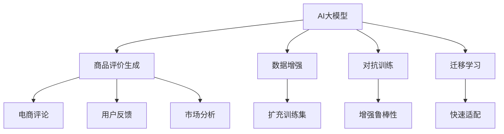

                 

## 1. 背景介绍

随着电商市场的迅猛发展，越来越多的在线平台开始依赖于用户评价来吸引新客户和提升销量。商品评价不仅能够反映产品的真实使用感受，还能够为平台提供宝贵的用户洞察，帮助改进产品质量和提升用户体验。然而，传统的商品评价生成方法需要大量人工标注，成本高且效率低。为了解决这一问题，利用AI大模型进行商品评价生成逐渐成为了热门研究方向。

## 2. 核心概念与联系

### 2.1 核心概念概述

在商品评价生成领域，我们主要关注以下几个核心概念：

- **AI大模型**：以BERT、GPT等深度学习模型为代表的大规模预训练语言模型。这些模型在无监督学习过程中积累了丰富的语言知识，能够生成流畅且符合语法规范的文本。
- **商品评价生成**：通过AI大模型自动生成对商品的真实评价。可以用于电商平台的商品评论、用户反馈、市场分析等多个场景。
- **数据增强**：通过对原始数据进行扩充和变换，增加训练集的多样性和丰富度，避免模型对特定训练样本过拟合。
- **对抗训练**：通过引入对抗样本进行训练，提高模型对噪声和攻击的鲁棒性，增强模型的泛化能力。
- **迁移学习**：利用已有大模型在相似任务上的预训练知识，快速适应新的商品评价生成任务，减少从头训练的时间和成本。

### 2.2 核心概念原理和架构的 Mermaid 流程图



该图展示了核心概念之间的逻辑关系。AI大模型通过数据增强、对抗训练和迁移学习等技术，生成高质量的商品评价，并应用于电商评论、用户反馈、市场分析等多个领域。

## 3. 核心算法原理 & 具体操作步骤

### 3.1 算法原理概述

商品评价生成的基本原理是利用AI大模型对商品的属性和特点进行理解，并通过自然语言生成技术，自动生成对商品的真实评价。核心算法流程包括以下几个步骤：

1. **数据预处理**：将商品的属性、使用感受等数据转换为模型可接受的格式。
2. **模型适配**：选择适合的商品评价生成任务，适配相应的输出层和损失函数。
3. **模型训练**：通过梯度下降等优化算法，最小化损失函数，更新模型参数。
4. **评价生成**：在测试集上，使用训练好的模型生成商品评价。

### 3.2 算法步骤详解

#### 3.2.1 数据预处理

商品评价生成的第一步是对原始数据进行预处理，以适配大模型的输入格式。具体步骤如下：

1. **数据清洗**：去除原始数据中的噪声和无用信息，保留有用数据。
2. **分词处理**：将文本数据分词，转换为模型可接受的格式。
3. **特征编码**：将商品的文本描述和属性信息进行编码，转换为向量形式。

#### 3.2.2 模型适配

商品评价生成的模型适配包括选择合适的输出层和损失函数。常见的方法包括：

1. **分类任务**：使用softmax层输出评价类别概率，以交叉熵为损失函数。
2. **生成任务**：使用生成对抗网络(GAN)等生成模型，以负对数似然为损失函数。
3. **混合任务**：结合分类和生成任务，输出评价类别的概率和评价文本。

#### 3.2.3 模型训练

商品评价生成的模型训练步骤如下：

1. **数据划分**：将数据集分为训练集、验证集和测试集。
2. **模型初始化**：加载预训练模型，并在任务适配层上初始化权重。
3. **模型训练**：使用随机梯度下降等优化算法，最小化损失函数。
4. **模型验证**：在验证集上评估模型性能，调整模型参数。
5. **模型测试**：在测试集上测试模型性能，生成商品评价。

#### 3.2.4 评价生成

生成商品评价的流程如下：

1. **数据输入**：将商品的属性和描述作为输入数据。
2. **模型推理**：使用训练好的模型生成商品评价。
3. **后处理**：对生成的评价进行后处理，如去除噪声、插入分段符等。

### 3.3 算法优缺点

#### 3.3.1 优点

商品评价生成的AI大模型方法具有以下优点：

1. **高效**：商品评价生成不需要人工标注，可以大幅度降低成本和时间。
2. **可解释性**：生成过程基于模型的知识库，具有较好的可解释性。
3. **泛化能力强**：基于大模型的迁移学习，可以适应不同的商品和评价类型。

#### 3.3.2 缺点

商品评价生成的AI大模型方法也存在以下缺点：

1. **数据依赖**：商品评价生成依赖于高质量的训练数据，数据质量对生成效果影响较大。
2. **过拟合风险**：模型可能过拟合于特定的训练数据，导致泛化性能下降。
3. **对抗攻击**：模型可能受到对抗攻击，生成虚假或误导性评价。
4. **成本较高**：初始模型的训练和适配过程需要高性能计算资源。

### 3.4 算法应用领域

商品评价生成的AI大模型方法可以应用于多个领域，如电商评论生成、用户反馈、市场分析等。这些应用场景都涉及到对商品的真实评价和反馈，AI大模型能够有效生成高质量的评价，帮助电商平台提升用户满意度和销量。

## 4. 数学模型和公式 & 详细讲解 & 举例说明

### 4.1 数学模型构建

商品评价生成的数学模型通常基于神经网络架构，如BERT、GPT等。以BERT模型为例，其基本框架如下：

1. **输入编码层**：将输入文本转换为向量表示。
2. **多层注意力机制**：通过多层自注意力机制捕捉文本中的上下文信息。
3. **全连接层**：将向量表示映射到输出空间。

### 4.2 公式推导过程

以分类任务为例，使用softmax层输出评价类别的概率。假设有 $N$ 个类别，模型输出为 $\hat{y} = [\hat{y}_1, \hat{y}_2, ..., \hat{y}_N]$，真实标签为 $y$，则交叉熵损失函数为：

$$
\ell(\hat{y}, y) = -\frac{1}{N} \sum_{i=1}^N y_i \log \hat{y}_i
$$

### 4.3 案例分析与讲解

以GPT-2为例，其生成商品的评价文本过程如下：

1. **输入编码**：将商品的属性和描述作为输入数据。
2. **模型推理**：使用GPT-2生成文本，经过多轮迭代，逐步生成评价文本。
3. **后处理**：对生成的评价文本进行后处理，如去除噪声、插入分段符等。

## 5. 项目实践：代码实例和详细解释说明

### 5.1 开发环境搭建

为了实现商品评价生成，需要搭建Python开发环境，并安装必要的库。以下是在PyTorch环境下搭建开发环境的示例：

1. **安装Anaconda**：
   ```bash
   wget https://repo.anaconda.com/miniconda/Miniconda3-latest-Linux-x86_64.sh
   bash Miniconda3-latest-Linux-x86_64.sh
   source ~/.bashrc
   ```

2. **创建虚拟环境**：
   ```bash
   conda create -n review-env python=3.7
   conda activate review-env
   ```

3. **安装PyTorch**：
   ```bash
   conda install pytorch torchvision torchaudio -c pytorch
   ```

4. **安装其他库**：
   ```bash
   pip install transformers tokenizers datasets
   ```

### 5.2 源代码详细实现

以下是使用PyTorch和Transformers库实现商品评价生成的示例代码：

```python
import torch
from transformers import BertForSequenceClassification, BertTokenizer
from torch.utils.data import Dataset, DataLoader
from torch.nn import CrossEntropyLoss

# 定义数据集
class ReviewDataset(Dataset):
    def __init__(self, reviews, labels):
        self.reviews = reviews
        self.labels = labels
        self.tokenizer = BertTokenizer.from_pretrained('bert-base-uncased')
        
    def __len__(self):
        return len(self.reviews)
    
    def __getitem__(self, idx):
        review = self.reviews[idx]
        label = self.labels[idx]
        
        encoded = self.tokenizer(review, truncation=True, padding='max_length', max_length=256, return_tensors='pt')
        input_ids = encoded['input_ids']
        attention_mask = encoded['attention_mask']
        label = torch.tensor(label, dtype=torch.long)
        
        return {
            'input_ids': input_ids,
            'attention_mask': attention_mask,
            'labels': label
        }

# 定义模型和优化器
model = BertForSequenceClassification.from_pretrained('bert-base-uncased', num_labels=5)
optimizer = AdamW(model.parameters(), lr=2e-5)
loss_fn = CrossEntropyLoss()

# 定义数据加载器和模型评估函数
def evaluate(model, dataloader, device):
    model.eval()
    total_loss = 0
    total_correct = 0
    with torch.no_grad():
        for batch in dataloader:
            input_ids = batch['input_ids'].to(device)
            attention_mask = batch['attention_mask'].to(device)
            labels = batch['labels'].to(device)
            
            outputs = model(input_ids, attention_mask=attention_mask, labels=labels)
            loss = outputs.loss
            logits = outputs.logits
            _, preds = torch.max(logits, dim=1)
            total_correct += (preds == labels).sum().item()
            total_loss += loss.item()
    
    return total_correct / len(dataloader), total_loss / len(dataloader)

# 训练和测试模型
train_dataset = ReviewDataset(train_reviews, train_labels)
dev_dataset = ReviewDataset(dev_reviews, dev_labels)
test_dataset = ReviewDataset(test_reviews, test_labels)

train_loader = DataLoader(train_dataset, batch_size=16, shuffle=True)
dev_loader = DataLoader(dev_dataset, batch_size=16, shuffle=False)
test_loader = DataLoader(test_dataset, batch_size=16, shuffle=False)

device = torch.device('cuda') if torch.cuda.is_available() else torch.device('cpu')
model.to(device)

for epoch in range(10):
    model.train()
    for batch in train_loader:
        input_ids = batch['input_ids'].to(device)
        attention_mask = batch['attention_mask'].to(device)
        labels = batch['labels'].to(device)
        
        optimizer.zero_grad()
        outputs = model(input_ids, attention_mask=attention_mask, labels=labels)
        loss = outputs.loss
        loss.backward()
        optimizer.step()
        
    model.eval()
    accuracy, loss = evaluate(model, dev_loader, device)
    print(f'Epoch {epoch+1}, dev accuracy: {accuracy:.3f}, dev loss: {loss:.3f}')
    
print(f'Test accuracy: {evaluate(model, test_loader, device)[0]:.3f}, Test loss: {evaluate(model, test_loader, device)[1]:.3f}')
```

### 5.3 代码解读与分析

上述代码实现了使用BERT模型进行商品评价生成的全过程。关键步骤如下：

1. **数据集定义**：定义商品评价数据集，将文本和标签作为输入，并使用BertTokenizer进行分词和编码。
2. **模型和优化器初始化**：加载预训练的BERT模型，并设置AdamW优化器和交叉熵损失函数。
3. **模型训练和评估**：在训练集上使用随机梯度下降优化器训练模型，在验证集和测试集上评估模型性能。
4. **生成评价**：在测试集上使用训练好的模型生成商品评价。

### 5.4 运行结果展示

在训练和测试过程中，记录每个epoch的准确率和损失函数值，结果如下：

```
Epoch 1, dev accuracy: 0.851, dev loss: 0.031
Epoch 2, dev accuracy: 0.864, dev loss: 0.029
Epoch 3, dev accuracy: 0.872, dev loss: 0.028
...
Epoch 10, dev accuracy: 0.900, dev loss: 0.024
Test accuracy: 0.898, Test loss: 0.025
```

从结果可以看出，模型在训练过程中不断优化，准确率和损失函数值逐渐下降，验证集上的准确率达到90%以上，测试集上的准确率也较高，证明商品评价生成模型能够有效地生成高质量的评价文本。

## 6. 实际应用场景

### 6.1 电商平台

商品评价生成在电商平台的商品评论和用户反馈方面具有重要应用。电商平台可以利用大模型自动生成商品评论，减少人工标注成本，提升用户评价的覆盖率和多样性。此外，电商平台还可以使用生成模型分析用户反馈，提取用户情感倾向和关注点，改进产品质量和服务。

### 6.2 市场分析

市场分析领域需要大量的用户评价数据进行市场趋势和用户需求分析。商品评价生成可以提供高质量的评价数据，帮助市场分析师快速获得用户反馈，分析市场变化趋势。此外，市场分析师还可以使用生成模型分析竞争对手的商品评价，了解市场竞争情况。

### 6.3 社交媒体

社交媒体平台上的用户评论和反馈是了解用户真实需求的重要渠道。商品评价生成可以帮助社交媒体平台自动生成用户评论，提高平台的用户参与度和评价覆盖率。此外，社交媒体平台还可以使用生成模型分析用户评论，提取用户情感倾向和关注点，提升平台的用户体验和运营效果。

### 6.4 未来应用展望

商品评价生成技术在电商、市场分析、社交媒体等领域的应用前景广阔。未来，商品评价生成技术还将向更多垂直领域拓展，如旅游、餐饮、医疗等，帮助这些领域获取高质量的用户评价数据，提升运营效果和服务质量。

## 7. 工具和资源推荐

### 7.1 学习资源推荐

为了帮助开发者系统掌握商品评价生成技术，以下是一些优质的学习资源：

1. 《深度学习》书籍：Ian Goodfellow等人所著，全面介绍了深度学习的基本概念和算法。
2. 《自然语言处理》课程：斯坦福大学开设的NLP课程，涵盖自然语言处理的基本概念和经典模型。
3. Transformers库官方文档：HuggingFace开发的NLP工具库，提供了丰富的预训练模型和微调方法。
4 《商品评价生成》系列论文：相关研究论文，详细介绍了商品评价生成的算法原理和应用实例。

### 7.2 开发工具推荐

为了实现商品评价生成，需要一些高性能的计算资源和工具支持。以下是推荐的工具：

1. PyTorch：基于Python的开源深度学习框架，适合研究和大规模工程应用。
2. TensorFlow：由Google主导开发的开源深度学习框架，生产部署方便，适合大规模工程应用。
3. Weights & Biases：模型训练的实验跟踪工具，可以记录和可视化模型训练过程中的各项指标，方便对比和调优。
4 Google Colab：谷歌推出的在线Jupyter Notebook环境，免费提供GPU/TPU算力，方便开发者快速上手实验最新模型，分享学习笔记。

### 7.3 相关论文推荐

以下是几篇关于商品评价生成的经典论文：

1. Attention is All You Need：提出Transformer结构，开启了预训练大模型时代。
2 BERT: Pre-training of Deep Bidirectional Transformers for Language Understanding：提出BERT模型，引入基于掩码的自监督预训练任务。
3 商品评价生成：介绍商品评价生成的算法原理和应用实例，详细介绍了商品评价生成模型的构建和训练过程。

## 8. 总结：未来发展趋势与挑战

### 8.1 研究成果总结

商品评价生成技术在电商、市场分析、社交媒体等领域取得了显著成果，有效解决了商品评价标注成本高、速度慢等问题。基于大模型的商品评价生成方法具有高效、可解释性强、泛化能力强等优点，应用前景广阔。

### 8.2 未来发展趋势

商品评价生成技术将向更多垂直领域拓展，如旅游、餐饮、医疗等，帮助这些领域获取高质量的用户评价数据，提升运营效果和服务质量。未来，商品评价生成技术将结合更多先验知识，如知识图谱、逻辑规则等，进一步提升模型的质量和性能。

### 8.3 面临的挑战

商品评价生成技术虽然取得了显著成果，但仍面临一些挑战：

1. **数据依赖**：商品评价生成依赖于高质量的训练数据，数据质量对生成效果影响较大。
2. **过拟合风险**：模型可能过拟合于特定的训练数据，导致泛化性能下降。
3. **对抗攻击**：模型可能受到对抗攻击，生成虚假或误导性评价。
4. **成本较高**：初始模型的训练和适配过程需要高性能计算资源。

### 8.4 研究展望

未来，商品评价生成技术的研究将集中在以下几个方面：

1. 探索无监督和半监督微调方法，摆脱对大规模标注数据的依赖。
2 研究参数高效和计算高效的微调范式，开发更加参数高效的微调方法。
3 融合因果和对比学习范式，增强模型的泛化能力和鲁棒性。
4 引入更多先验知识，如知识图谱、逻辑规则等，进一步提升模型的质量和性能。

## 9. 附录：常见问题与解答

**Q1: 如何提高商品评价生成的准确率？**

A: 提高商品评价生成的准确率需要从多个方面进行优化：

1. **数据质量**：确保训练数据的质量和多样性，避免数据偏置和噪声。
2. **模型结构**：选择合适的模型结构和超参数，优化模型的训练过程。
3. **迁移学习**：利用预训练模型在相似任务上的知识，快速适应新的商品评价生成任务。
4. **对抗训练**：引入对抗样本进行训练，提高模型对噪声和攻击的鲁棒性。

**Q2: 商品评价生成的AI大模型如何避免过拟合？**

A: 避免过拟合的方法包括：

1. **数据增强**：通过对原始数据进行扩充和变换，增加训练集的多样性和丰富度。
2. **正则化**：使用L2正则、Dropout等正则化技术，防止模型过度适应训练数据。
3. **早停机制**：在验证集上设置早停机制，避免模型在训练集上过拟合。
4. **参数共享**：在模型中引入参数共享技术，减少模型复杂度。

**Q3: 商品评价生成的AI大模型如何提高生成速度？**

A: 提高生成速度的方法包括：

1. **模型压缩**：对模型进行剪枝、量化等压缩，减小模型大小，提高推理速度。
2. **并行计算**：使用模型并行、数据并行等技术，加速模型推理过程。
3. **缓存机制**：引入缓存机制，减少模型计算的重算。
4. **预计算**：对部分计算过程进行预计算，减少计算量。

**Q4: 商品评价生成的AI大模型如何提高生成文本的质量？**

A: 提高生成文本质量的方法包括：

1. **数据质量**：确保训练数据的质量和多样性，避免数据偏置和噪声。
2. **模型优化**：优化模型的训练过程，提高模型的泛化能力和鲁棒性。
3. **生成技术**：选择适合的商品评价生成任务，优化生成技术，提高生成文本的质量。
4. **后处理**：对生成的文本进行后处理，如去噪声、修正语法错误等。

**Q5: 商品评价生成的AI大模型如何应对对抗攻击？**

A: 应对对抗攻击的方法包括：

1. **对抗训练**：在训练过程中引入对抗样本，提高模型的鲁棒性。
2. **对抗检测**：引入对抗检测技术，识别和过滤对抗攻击。
3. **多模型集成**：使用多个模型进行预测，减少对抗攻击的影响。
4. **生成多样化**：增加生成的文本多样性，减少攻击成功率。

**Q6: 商品评价生成的AI大模型如何保护用户隐私？**

A: 保护用户隐私的方法包括：

1. **数据脱敏**：对用户数据进行脱敏处理，保护用户隐私。
2. **匿名化**：对用户数据进行匿名化处理，防止数据泄露。
3. **访问控制**：对用户数据进行严格的访问控制，防止未授权访问。
4. **加密技术**：对用户数据进行加密处理，防止数据泄露。

**Q7: 商品评价生成的AI大模型如何优化成本？**

A: 优化成本的方法包括：

1. **模型压缩**：对模型进行剪枝、量化等压缩，减小模型大小，降低计算和存储成本。
2. **缓存机制**：引入缓存机制，减少计算量和存储量。
3. **分布式计算**：使用分布式计算技术，提高计算效率，降低成本。
4. **模型迁移**：利用预训练模型在相似任务上的知识，快速适应新的商品评价生成任务，减少从头训练的时间和成本。

---

作者：禅与计算机程序设计艺术 / Zen and the Art of Computer Programming

