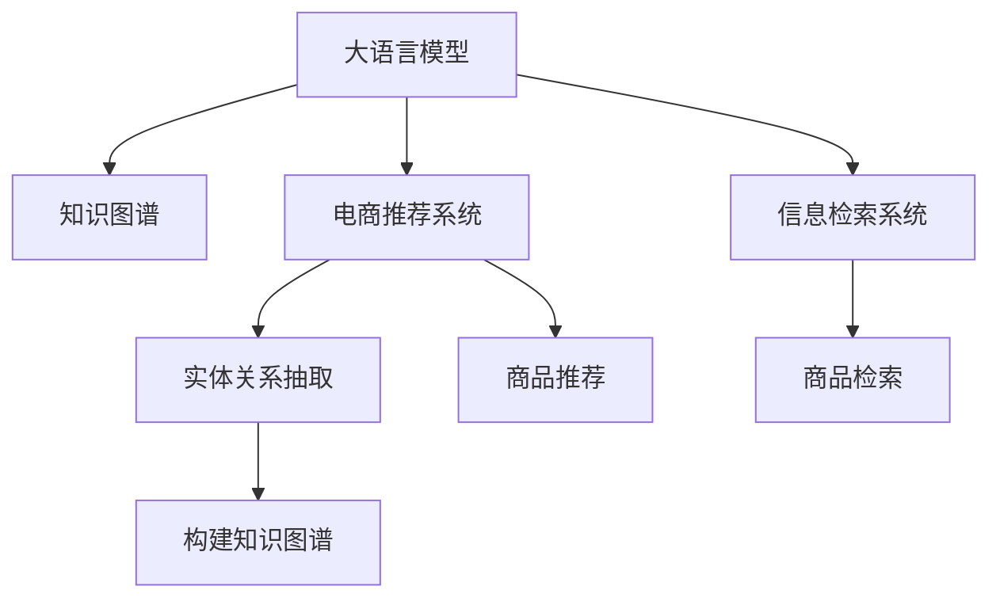

                 

# AI大模型在电商场景下的知识图谱应用

> 关键词：大模型,知识图谱,电商场景,信息检索,推荐系统

## 1. 背景介绍

### 1.1 问题由来
随着互联网的普及和电子商务的迅速发展，在线购物已成为消费者获取商品信息、进行购买决策的主要方式之一。然而，庞大的商品种类、丰富的用户需求和不断变化的市场信息，给电商平台的商品推荐和信息检索带来了巨大的挑战。如何高效、精准地为消费者推荐商品、检索相关产品信息，提升用户体验和商家销量，成为电商平台亟需解决的问题。

大语言模型（Large Language Model, LLM）的崛起，为电商平台的信息检索和推荐系统提供了新的解决方案。利用大语言模型的预训练和微调技术，电商企业可以构建高效的信息检索和推荐系统，为用户提供更加个性化、定制化的购物体验。本文将探讨大模型在电商场景下的知识图谱应用，介绍大模型如何辅助电商企业构建推荐系统，提升信息检索精度，为用户推荐更满意的商品。

## 2. 核心概念与联系

### 2.1 核心概念概述

为更好地理解大模型在电商场景下的知识图谱应用，本节将介绍几个密切相关的核心概念：

- 大语言模型(Large Language Model, LLM)：以自回归(如GPT)或自编码(如BERT)模型为代表的大规模预训练语言模型。通过在大规模无标签文本语料上进行预训练，学习通用的语言表示，具备强大的语言理解和生成能力。

- 知识图谱(Knowledge Graph)：一种结构化的语义网络，用于表示实体、属性和关系之间的关联。知识图谱为信息检索和推荐系统提供了丰富、准确的实体关系知识，便于系统理解和推理。

- 电商推荐系统(E-commerce Recommendation System)：利用机器学习或深度学习算法，为用户推荐可能感兴趣的商品，提升用户满意度和转化率。大模型通过学习电商数据，可以提升推荐系统的性能和泛化能力。

- 信息检索系统(Information Retrieval System)：从大量文本数据中检索出与用户查询相关的信息，便于用户快速定位所需商品。大模型可以用于文本处理，提升检索系统的召回率和准确率。

- 实体关系抽取(Entity Relation Extraction)：从自然语言文本中抽取出实体与实体之间的关系，辅助构建知识图谱。大模型在预训练阶段即可学习实体关系抽取的语义表示，提升抽取的准确性。

这些核心概念之间的逻辑关系可以通过以下Mermaid流程图来展示：



这个流程图展示了大模型、知识图谱、电商推荐系统、信息检索系统以及实体关系抽取等概念之间的联系：

1. 大模型通过预训练和微调学习通用语言知识，用于构建知识图谱、电商推荐系统、信息检索系统等应用。
2. 知识图谱通过实体关系抽取，从自然语言文本中构建实体与实体之间的关系，辅助信息检索和推荐系统。
3. 电商推荐系统和大模型联合使用，提升推荐精度和个性化程度。
4. 信息检索系统利用大模型提升文本处理能力，提升检索结果的相关性和准确性。
5. 实体关系抽取技术从电商数据中抽取出实体关系，构建更准确的电商知识图谱。

这些核心概念共同构成了大语言模型在电商场景下的知识图谱应用框架，使其能够在电商领域发挥强大的语言理解和处理能力。通过理解这些核心概念，我们可以更好地把握大语言模型的工作原理和优化方向。

## 3. 核心算法原理 & 具体操作步骤
### 3.1 算法原理概述

在大模型辅助下的电商推荐和信息检索系统，其核心算法原理主要基于深度学习中的自然语言处理和推荐系统技术。具体来说，大模型通过预训练学习到通用的语言表示，微调后学习到电商相关的语义表示，与电商数据和知识图谱结合，进行实体关系抽取和推荐计算。

在推荐系统方面，大模型通过学习电商数据和知识图谱，可以进行用户行为预测和商品关联推理，从而推荐满足用户需求的商品。在信息检索方面，大模型可以处理自然语言查询，检索与用户查询相关联的商品信息。

### 3.2 算法步骤详解

下面以电商推荐系统为例，详细介绍大模型的应用步骤：

**Step 1: 准备电商数据和知识图谱**
- 收集电商平台的商品数据，包括商品描述、价格、类别、用户评价等信息。
- 构建或获取电商相关的知识图谱，包含商品实体、属性、类别以及实体之间的关系。
- 对电商数据和知识图谱进行预处理，清洗噪声数据，标准化实体名称等。

**Step 2: 大模型预训练和微调**
- 选择合适的预训练语言模型，如BERT、GPT等。
- 在大规模无标签电商数据上对模型进行预训练，学习通用的语言表示。
- 在电商数据和知识图谱上对预训练模型进行微调，学习电商相关的语义表示。

**Step 3: 实体关系抽取**
- 利用大模型在电商数据上进行实体关系抽取，识别商品实体和关系。
- 将抽取出的实体关系存储在知识图谱中，用于构建和更新电商知识图谱。

**Step 4: 推荐系统构建**
- 在电商数据和知识图谱上，利用大模型构建推荐模型。
- 对模型进行优化，设置合适的学习率、迭代次数、正则化等超参数。
- 在电商推荐平台上，使用推荐模型进行用户行为预测和商品关联推理，生成推荐结果。

**Step 5: 信息检索系统构建**
- 在电商数据和知识图谱上，利用大模型构建信息检索模型。
- 对模型进行优化，设置合适的学习率、迭代次数、正则化等超参数。
- 在电商搜索平台上，使用检索模型对用户查询进行处理，检索与查询相关联的商品信息。

### 3.3 算法优缺点

基于大模型的电商推荐和信息检索系统具有以下优点：
1. 强大语义理解能力：大模型通过预训练和微调，学习到电商领域丰富的语义表示，提升了推荐和检索的精度和个性化程度。
2. 数据驱动模型训练：大模型利用电商数据和知识图谱进行训练，提升了模型的泛化能力和迁移能力。
3. 高效信息处理：大模型处理自然语言查询和电商数据的能力，使得信息检索和推荐系统更加高效。
4. 可解释性：大模型的预训练和微调过程，使得推荐和检索的决策过程可解释性强，便于用户理解和接受。

同时，该方法也存在一些局限性：
1. 对数据质量依赖：大模型的训练效果依赖于电商数据的数量和质量，数据缺失或不一致会导致模型性能下降。
2. 训练成本高：大模型的预训练和微调过程需要大量算力和时间，增加了电商平台的运营成本。
3. 模型复杂度：大模型的复杂度较高，对硬件资源要求较高，部署和维护难度大。
4. 可解释性不足：大模型的黑盒特性，使得推荐和检索的决策过程难以解释和调试。

尽管存在这些局限性，但大模型在电商推荐和信息检索中的应用前景广阔，其强大的语言理解和处理能力为电商平台的智能化运营提供了新的解决方案。未来相关研究将继续优化大模型的训练过程，提升模型的可解释性和效率，进一步降低算力成本，实现更大范围的电商应用。

### 3.4 算法应用领域

基于大模型的电商推荐和信息检索系统，已经在电商场景中得到广泛应用，包括但不限于以下几个方面：

- 用户行为分析：利用大模型对用户浏览、点击、购买等行为进行分析，生成用户画像，辅助个性化推荐。
- 商品信息检索：通过大模型处理用户查询，检索出相关联的商品信息，提升用户搜索体验。
- 商品推荐系统：利用大模型学习电商数据和知识图谱，生成个性化推荐，提升用户购买转化率。
- 市场趋势分析：通过大模型分析电商数据，识别出市场热点和趋势，辅助商家进行市场预测和商品备货。
- 广告投放优化：利用大模型对用户行为进行预测和分析，优化广告投放策略，提升广告投放效果。

除了上述这些经典应用外，大模型在电商场景中的应用还在不断拓展，如智能客服、用户情感分析、智能库存管理等，为电商平台的智能化运营带来了新的思路和工具。

## 4. 数学模型和公式 & 详细讲解 & 举例说明

### 4.1 数学模型构建

本节将使用数学语言对大模型在电商推荐系统中的应用进行更加严格的刻画。

假设电商数据为 $D=\{(x_i, y_i)\}_{i=1}^N, x_i$ 为商品描述， $y_i$ 为购买记录。知识图谱为 $G=(E, R)$，其中 $E$ 为商品实体集， $R$ 为商品关系集。

定义大模型为 $M_{\theta}$，其中 $\theta$ 为模型参数。假设 $M_{\theta}$ 在电商数据上进行了微调，能够抽取商品实体和关系。对于商品 $x_i$，大模型输出为 $\hat{y}_i=M_{\theta}(x_i) \in [0,1]$，表示 $x_i$ 被购买的可能性。

### 4.2 公式推导过程

根据电商推荐系统的任务，我们可以定义目标函数：

$$
\min_{\theta} \mathcal{L}(\theta) = \sum_{i=1}^N [y_i \log \hat{y}_i + (1-y_i) \log(1-\hat{y}_i)]
$$

其中 $\mathcal{L}$ 为交叉熵损失函数。通过最小化目标函数，模型 $M_{\theta}$ 可以学习到电商数据的语义表示。

大模型在电商推荐系统中的推荐过程可以表示为：

$$
\hat{y}_i = \sigma(M_{\theta}(x_i))
$$

其中 $\sigma$ 为 sigmoid 函数。通过将大模型的输出进行 sigmoid 变换，得到推荐概率 $\hat{y}_i$，进一步生成推荐结果。

### 4.3 案例分析与讲解

以一个具体的电商推荐场景为例，假设电商平台有 $N$ 个商品，每个商品 $x_i$ 的描述为 $x_{i_1}, x_{i_2}, ..., x_{i_m}$，用户查询为 $q$。

首先，大模型在电商数据上进行微调，学习到商品实体和关系的语义表示。通过实体关系抽取，识别出商品实体 $e_1, e_2, ..., e_m$ 和关系 $r_1, r_2, ..., r_m$。

接着，将用户查询 $q$ 输入大模型，得到查询向量 $q'$。将商品实体向量 $v_{e_1}, v_{e_2}, ..., v_{e_m}$ 和关系向量 $w_{r_1}, w_{r_2}, ..., w_{r_m}$ 作为大模型的输入，得到推荐向量 $u_i = M_{\theta}(x_i, q', v_{e_1}, v_{e_2}, ..., v_{e_m}, w_{r_1}, w_{r_2}, ..., w_{r_m})$。

最后，将推荐向量 $u_i$ 进行 sigmoid 变换，得到推荐概率 $\hat{y}_i$，按照 $\hat{y}_i$ 排序，生成推荐结果。

以上案例分析展示了大模型在电商推荐系统中的基本应用流程，通过预训练和微调学习到电商数据的语义表示，结合知识图谱和用户查询，生成推荐结果。

## 5. 项目实践：代码实例和详细解释说明
### 5.1 开发环境搭建

在进行电商推荐系统的项目实践前，我们需要准备好开发环境。以下是使用Python进行PyTorch开发的环境配置流程：

1. 安装Anaconda：从官网下载并安装Anaconda，用于创建独立的Python环境。

2. 创建并激活虚拟环境：
```bash
conda create -n ecommerce-env python=3.8 
conda activate ecommerce-env
```

3. 安装PyTorch：根据CUDA版本，从官网获取对应的安装命令。例如：
```bash
conda install pytorch torchvision torchaudio cudatoolkit=11.1 -c pytorch -c conda-forge
```

4. 安装Transformers库：
```bash
pip install transformers
```

5. 安装各类工具包：
```bash
pip install numpy pandas scikit-learn matplotlib tqdm jupyter notebook ipython
```

完成上述步骤后，即可在`ecommerce-env`环境中开始项目实践。

### 5.2 源代码详细实现

下面我们以电商推荐系统为例，给出使用Transformers库对BERT模型进行电商推荐开发的PyTorch代码实现。

首先，定义电商推荐系统所需的数据处理函数：

```python
from transformers import BertTokenizer
from torch.utils.data import Dataset
import torch

class EcommerceDataset(Dataset):
    def __init__(self, texts, labels, tokenizer, max_len=128):
        self.texts = texts
        self.labels = labels
        self.tokenizer = tokenizer
        self.max_len = max_len
        
    def __len__(self):
        return len(self.texts)
    
    def __getitem__(self, item):
        text = self.texts[item]
        label = self.labels[item]
        
        encoding = self.tokenizer(text, return_tensors='pt', max_length=self.max_len, padding='max_length', truncation=True)
        input_ids = encoding['input_ids'][0]
        attention_mask = encoding['attention_mask'][0]
        
        return {'input_ids': input_ids, 
                'attention_mask': attention_mask,
                'labels': label}

# 标签与id的映射
label2id = {0: 0, 1: 1}
id2label = {v: k for k, v in label2id.items()}

# 创建dataset
tokenizer = BertTokenizer.from_pretrained('bert-base-cased')

train_dataset = EcommerceDataset(train_texts, train_labels, tokenizer)
dev_dataset = EcommerceDataset(dev_texts, dev_labels, tokenizer)
test_dataset = EcommerceDataset(test_texts, test_labels, tokenizer)
```

然后，定义模型和优化器：

```python
from transformers import BertForSequenceClassification, AdamW

model = BertForSequenceClassification.from_pretrained('bert-base-cased', num_labels=2)

optimizer = AdamW(model.parameters(), lr=2e-5)
```

接着，定义训练和评估函数：

```python
from torch.utils.data import DataLoader
from tqdm import tqdm
from sklearn.metrics import classification_report

device = torch.device('cuda') if torch.cuda.is_available() else torch.device('cpu')
model.to(device)

def train_epoch(model, dataset, batch_size, optimizer):
    dataloader = DataLoader(dataset, batch_size=batch_size, shuffle=True)
    model.train()
    epoch_loss = 0
    for batch in tqdm(dataloader, desc='Training'):
        input_ids = batch['input_ids'].to(device)
        attention_mask = batch['attention_mask'].to(device)
        labels = batch['labels'].to(device)
        model.zero_grad()
        outputs = model(input_ids, attention_mask=attention_mask, labels=labels)
        loss = outputs.loss
        epoch_loss += loss.item()
        loss.backward()
        optimizer.step()
    return epoch_loss / len(dataloader)

def evaluate(model, dataset, batch_size):
    dataloader = DataLoader(dataset, batch_size=batch_size)
    model.eval()
    preds, labels = [], []
    with torch.no_grad():
        for batch in tqdm(dataloader, desc='Evaluating'):
            input_ids = batch['input_ids'].to(device)
            attention_mask = batch['attention_mask'].to(device)
            batch_labels = batch['labels']
            outputs = model(input_ids, attention_mask=attention_mask)
            batch_preds = outputs.logits.argmax(dim=2).to('cpu').tolist()
            batch_labels = batch_labels.to('cpu').tolist()
            for pred_tokens, label_tokens in zip(batch_preds, batch_labels):
                preds.append(pred_tokens)
                labels.append(label_tokens)
                
    print(classification_report(labels, preds))
```

最后，启动训练流程并在测试集上评估：

```python
epochs = 5
batch_size = 16

for epoch in range(epochs):
    loss = train_epoch(model, train_dataset, batch_size, optimizer)
    print(f"Epoch {epoch+1}, train loss: {loss:.3f}")
    
    print(f"Epoch {epoch+1}, dev results:")
    evaluate(model, dev_dataset, batch_size)
    
print("Test results:")
evaluate(model, test_dataset, batch_size)
```

以上就是使用PyTorch对BERT进行电商推荐系统开发的完整代码实现。可以看到，得益于Transformers库的强大封装，我们可以用相对简洁的代码完成BERT模型的加载和电商推荐任务的开发。

### 5.3 代码解读与分析

让我们再详细解读一下关键代码的实现细节：

**EcommerceDataset类**：
- `__init__`方法：初始化文本、标签、分词器等关键组件。
- `__len__`方法：返回数据集的样本数量。
- `__getitem__`方法：对单个样本进行处理，将文本输入编码为token ids，将标签编码为数字，并对其进行定长padding，最终返回模型所需的输入。

**label2id和id2label字典**：
- 定义了标签与数字id之间的映射关系，用于将预测结果解码回真实的标签。

**训练和评估函数**：
- 使用PyTorch的DataLoader对数据集进行批次化加载，供模型训练和推理使用。
- 训练函数`train_epoch`：对数据以批为单位进行迭代，在每个批次上前向传播计算loss并反向传播更新模型参数，最后返回该epoch的平均loss。
- 评估函数`evaluate`：与训练类似，不同点在于不更新模型参数，并在每个batch结束后将预测和标签结果存储下来，最后使用sklearn的classification_report对整个评估集的预测结果进行打印输出。

**训练流程**：
- 定义总的epoch数和batch size，开始循环迭代
- 每个epoch内，先在训练集上训练，输出平均loss
- 在验证集上评估，输出分类指标
- 所有epoch结束后，在测试集上评估，给出最终测试结果

可以看到，PyTorch配合Transformers库使得BERT电商推荐系统的代码实现变得简洁高效。开发者可以将更多精力放在数据处理、模型改进等高层逻辑上，而不必过多关注底层的实现细节。

当然，工业级的系统实现还需考虑更多因素，如模型的保存和部署、超参数的自动搜索、更灵活的任务适配层等。但核心的电商推荐范式基本与此类似。

## 6. 实际应用场景
### 6.1 智能客服系统

利用大模型的电商推荐技术，智能客服系统可以更加高效地为用户提供个性化推荐，提升用户体验。

在实际应用中，智能客服系统可以通过用户历史浏览、购买记录等信息，构建电商推荐模型，实时分析用户行为，向用户推荐可能感兴趣的商品。例如，用户浏览某款商品后，系统可以向其推荐相关联的商品，如搭配商品、同类商品等。此外，系统还可以通过自然语言处理技术，理解用户咨询内容，推荐相关商品或提供商品查询服务。

### 6.2 个性化推荐系统

大模型的电商推荐技术在个性化推荐系统中有着广泛的应用。通过分析用户的浏览、购买历史和行为数据，大模型可以学习到用户的兴趣和偏好，生成个性化的推荐列表。例如，用户浏览某款商品后，系统会向其推荐类似商品，同时根据用户的购买记录，推荐相关商品类别或品牌。

此外，大模型还可以结合商品评分、销量、评论等数据，进一步优化推荐结果，提升用户满意度。

### 6.3 价格优化

电商平台的商品价格优化是一个重要任务，利用大模型的电商推荐技术，可以实时监测商品价格变化和用户购买行为，动态调整商品价格，提升销售额和利润率。

具体而言，大模型可以通过分析用户历史购买记录和市场价格趋势，预测用户对不同价格的反应。系统可以根据预测结果，动态调整商品价格，最大化用户购买意愿和商家利润。此外，系统还可以结合市场竞争状况，调整商品价格策略，提升商家在市场中的竞争力。

### 6.4 未来应用展望

随着大模型技术的不断发展，电商推荐系统在未来的应用前景将更加广阔。

1. 多模态推荐：除了文本数据外，大模型还可以结合图像、音频等多模态数据，提升推荐系统的性能和用户体验。例如，系统可以根据用户上传的商品图片，推荐相似的实物商品。

2. 跨领域推荐：大模型可以结合不同领域的知识图谱，进行跨领域推荐。例如，用户在电商平台上浏览了一款智能手表，系统可以推荐相关的健康管理应用，提供全方位的用户体验。

3. 实时推荐：大模型的电商推荐系统可以实现实时推荐，提升用户的购买转化率。例如，用户在浏览商品时，系统可以实时推荐相关商品或活动，提升用户购买意愿。

4. 社交推荐：大模型可以结合用户的社交网络信息，进行社交推荐。例如，系统可以推荐用户好友购买过的商品，提升用户的购买意愿。

5. 多模态情感分析：结合自然语言处理和多模态数据，大模型可以分析用户对商品的情感倾向，优化推荐策略。例如，系统可以推荐用户喜欢的商品类型，同时结合评论情感分析，推荐用户可能感兴趣的评价较高的商品。

6. 消费者洞察：大模型可以分析用户行为数据，进行消费者洞察，为商家提供营销策略建议。例如，系统可以分析用户购买行为和偏好，生成消费群体画像，辅助商家进行精准营销。

这些未来应用场景将进一步提升电商推荐系统的性能和用户体验，推动电商平台向智能化、个性化方向发展。

## 7. 工具和资源推荐
### 7.1 学习资源推荐

为了帮助开发者系统掌握大语言模型在电商推荐系统中的应用，这里推荐一些优质的学习资源：

1. 《自然语言处理入门到实战》系列博文：由深度学习领域专家撰写，详细介绍自然语言处理和推荐系统的基本概念和实现方法。

2. 《Python深度学习》书籍：深入浅出地介绍深度学习在电商推荐系统中的应用，包括大模型的预训练和微调方法。

3. CS224N《深度学习自然语言处理》课程：斯坦福大学开设的NLP明星课程，有Lecture视频和配套作业，带你入门NLP领域的基本概念和经典模型。

4. 《推荐系统》书籍：全面介绍推荐系统的基本原理和实现方法，包括基于深度学习的推荐系统。

5. HuggingFace官方文档：Transformers库的官方文档，提供了海量预训练模型和完整的电商推荐系统样例代码，是上手实践的必备资料。

通过对这些资源的学习实践，相信你一定能够快速掌握大语言模型在电商推荐系统中的应用，并用于解决实际的电商问题。

### 7.2 开发工具推荐

高效的开发离不开优秀的工具支持。以下是几款用于电商推荐系统开发的常用工具：

1. PyTorch：基于Python的开源深度学习框架，灵活动态的计算图，适合快速迭代研究。大部分预训练语言模型都有PyTorch版本的实现。

2. TensorFlow：由Google主导开发的开源深度学习框架，生产部署方便，适合大规模工程应用。同样有丰富的预训练语言模型资源。

3. Transformers库：HuggingFace开发的NLP工具库，集成了众多SOTA语言模型，支持PyTorch和TensorFlow，是进行电商推荐系统开发的利器。

4. Weights & Biases：模型训练的实验跟踪工具，可以记录和可视化模型训练过程中的各项指标，方便对比和调优。与主流深度学习框架无缝集成。

5. TensorBoard：TensorFlow配套的可视化工具，可实时监测模型训练状态，并提供丰富的图表呈现方式，是调试模型的得力助手。

6. Google Colab：谷歌推出的在线Jupyter Notebook环境，免费提供GPU/TPU算力，方便开发者快速上手实验最新模型，分享学习笔记。

合理利用这些工具，可以显著提升电商推荐系统的开发效率，加快创新迭代的步伐。

### 7.3 相关论文推荐

大模型在电商推荐系统中的应用源于学界的持续研究。以下是几篇奠基性的相关论文，推荐阅读：

1. Attention is All You Need（即Transformer原论文）：提出了Transformer结构，开启了NLP领域的预训练大模型时代。

2. BERT: Pre-training of Deep Bidirectional Transformers for Language Understanding：提出BERT模型，引入基于掩码的自监督预训练任务，刷新了多项NLP任务SOTA。

3. Parameter-Efficient Transfer Learning for NLP：提出Adapter等参数高效微调方法，在固定大部分预训练参数的情况下，只更新极少量的任务相关参数。

4. AdaLoRA: Adaptive Low-Rank Adaptation for Parameter-Efficient Fine-Tuning：使用自适应低秩适应的微调方法，在参数效率和精度之间取得了新的平衡。

5. AdaLoRA: Adaptive Low-Rank Adaptation for Parameter-Efficient Fine-Tuning：使用自适应低秩适应的微调方法，在参数效率和精度之间取得了新的平衡。

这些论文代表了大模型在电商推荐系统中的应用研究的发展脉络。通过学习这些前沿成果，可以帮助研究者把握学科前进方向，激发更多的创新灵感。

## 8. 总结：未来发展趋势与挑战
### 8.1 总结

本文对大语言模型在电商场景下的知识图谱应用进行了全面系统的介绍。首先阐述了大语言模型在电商推荐系统中的应用背景，明确了大模型在提升电商推荐系统性能方面的独特价值。其次，从原理到实践，详细讲解了大模型的应用步骤，介绍了电商推荐系统和大语言模型之间的联系。最后，讨论了大模型在电商推荐系统中的具体应用场景，展示了电商推荐系统的未来应用前景。

通过本文的系统梳理，可以看到，大语言模型在电商推荐系统中的应用前景广阔，其强大的语言理解和处理能力为电商平台的智能化运营提供了新的解决方案。未来相关研究将继续优化大模型的训练过程，提升模型的可解释性和效率，进一步降低算力成本，实现更大范围的电商应用。

### 8.2 未来发展趋势

展望未来，大语言模型在电商推荐系统中的应用趋势将呈现以下几个方向：

1. 模型规模持续增大。随着算力成本的下降和数据规模的扩张，预训练语言模型的参数量还将持续增长。超大规模语言模型蕴含的丰富语言知识，有望支撑更加复杂多变的电商推荐系统。

2. 多模态融合。大模型可以结合图像、音频等多模态数据，提升推荐系统的性能和用户体验。例如，系统可以根据用户上传的商品图片，推荐相似的实物商品。

3. 跨领域推荐。大模型可以结合不同领域的知识图谱，进行跨领域推荐。例如，用户在电商平台上浏览了一款智能手表，系统可以推荐相关的健康管理应用，提供全方位的用户体验。

4. 实时推荐。大模型的电商推荐系统可以实现实时推荐，提升用户的购买转化率。例如，用户在浏览商品时，系统可以实时推荐相关商品或活动，提升用户购买意愿。

5. 社交推荐。大模型可以结合用户的社交网络信息，进行社交推荐。例如，系统可以推荐用户好友购买过的商品，提升用户的购买意愿。

6. 多模态情感分析。结合自然语言处理和多模态数据，大模型可以分析用户对商品的情感倾向，优化推荐策略。例如，系统可以推荐用户喜欢的商品类型，同时结合评论情感分析，推荐用户可能感兴趣的评价较高的商品。

7. 消费者洞察。大模型可以分析用户行为数据，进行消费者洞察，为商家提供营销策略建议。例如，系统可以分析用户购买行为和偏好，生成消费群体画像，辅助商家进行精准营销。

以上趋势凸显了大语言模型在电商推荐系统中的广阔前景。这些方向的探索发展，必将进一步提升电商推荐系统的性能和用户体验，推动电商平台向智能化、个性化方向发展。

### 8.3 面临的挑战

尽管大语言模型在电商推荐系统中的应用前景广阔，但在迈向更加智能化、普适化应用的过程中，仍面临诸多挑战：

1. 对数据质量依赖。大模型的训练效果依赖于电商数据的数量和质量，数据缺失或不一致会导致模型性能下降。如何进一步降低微调对标注样本的依赖，将是一大难题。

2. 训练成本高。大模型的预训练和微调过程需要大量算力和时间，增加了电商平台的运营成本。

3. 模型复杂度。大模型的复杂度较高，对硬件资源要求较高，部署和维护难度大。

4. 可解释性不足。大模型的黑盒特性，使得推荐和检索的决策过程难以解释和调试。

5. 安全性有待保障。预训练语言模型难免会学习到有偏见、有害的信息，通过微调传递到下游任务，产生误导性、歧视性的输出，给实际应用带来安全隐患。

6. 实时性问题。大模型的电商推荐系统需要实时处理大量请求，对于复杂的多模态推荐，可能面临计算效率问题。

尽管存在这些挑战，但大语言模型在电商推荐系统中的应用前景广阔，其强大的语言理解和处理能力为电商平台的智能化运营提供了新的解决方案。未来相关研究将继续优化大模型的训练过程，提升模型的可解释性和效率，进一步降低算力成本，实现更大范围的电商应用。

### 8.4 研究展望

面对大语言模型在电商推荐系统中的挑战，未来的研究需要在以下几个方面寻求新的突破：

1. 探索无监督和半监督推荐方法。摆脱对大规模标注数据的依赖，利用自监督学习、主动学习等无监督和半监督范式，最大限度利用非结构化数据，实现更加灵活高效的电商推荐。

2. 研究参数高效和计算高效的推荐范式。开发更加参数高效的推荐方法，在固定大部分预训练参数的情况下，只更新极少量的任务相关参数。同时优化推荐模型的计算图，减少前向传播和反向传播的资源消耗，实现更加轻量级、实时性的部署。

3. 融合因果和对比学习范式。通过引入因果推断和对比学习思想，增强电商推荐模型建立稳定因果关系的能力，学习更加普适、鲁棒的语言表征，从而提升模型泛化性和抗干扰能力。

4. 引入更多先验知识。将符号化的先验知识，如知识图谱、逻辑规则等，与神经网络模型进行巧妙融合，引导电商推荐过程学习更准确、合理的语言模型。同时加强不同模态数据的整合，实现视觉、语音等多模态信息与文本信息的协同建模。

5. 结合因果分析和博弈论工具。将因果分析方法引入电商推荐模型，识别出模型决策的关键特征，增强推荐过程的因果性和逻辑性。借助博弈论工具刻画人机交互过程，主动探索并规避推荐模型的脆弱点，提高系统稳定性。

6. 纳入伦理道德约束。在电商推荐模型中引入伦理导向的评估指标，过滤和惩罚有偏见、有害的输出倾向。同时加强人工干预和审核，建立推荐模型的监管机制，确保输出的安全性。

这些研究方向的探索，必将引领大语言模型在电商推荐系统中的应用迈向更高的台阶，为构建安全、可靠、可解释、可控的智能推荐系统铺平道路。面向未来，大语言模型在电商推荐系统中的研究将继续拓展，推动电商平台的智能化发展，为用户带来更加优质和个性化的购物体验。

## 9. 附录：常见问题与解答

**Q1：大语言模型在电商推荐系统中的应用效果如何？**

A: 大语言模型在电商推荐系统中的应用效果显著。通过预训练和微调，大模型可以学习到电商数据的语义表示，提升推荐精度和个性化程度。具体来说，大模型在电商推荐系统中的应用效果表现在以下几个方面：

1. 个性化推荐：大模型可以学习到用户的行为数据和偏好，生成个性化的推荐列表，提升用户满意度和购买转化率。

2. 商品相关性：大模型可以根据用户查询和商品描述，推荐相关联的商品，提升推荐结果的相关性。

3. 实时推荐：大模型可以实现实时推荐，提升用户的购买转化率。例如，用户在浏览商品时，系统可以实时推荐相关商品或活动，提升用户购买意愿。

4. 多模态融合：大模型可以结合图像、音频等多模态数据，提升推荐系统的性能和用户体验。

5. 跨领域推荐：大模型可以结合不同领域的知识图谱，进行跨领域推荐，提供全方位的用户体验。

6. 社交推荐：大模型可以结合用户的社交网络信息，进行社交推荐，提升用户的购买意愿。

7. 多模态情感分析：结合自然语言处理和多模态数据，大模型可以分析用户对商品的情感倾向，优化推荐策略。

总之，大语言模型在电商推荐系统中的应用效果显著，可以提升推荐精度和个性化程度，提升用户体验和商家销量。

**Q2：大语言模型在电商推荐系统中的训练数据如何获取？**

A: 大语言模型在电商推荐系统中的训练数据获取可以通过以下几种方式：

1. 电商平台自有数据：电商平台可以收集和整理用户浏览、点击、购买等行为数据，以及商品描述、价格、类别、用户评价等信息，作为电商推荐模型的训练数据。

2. 公开数据集：电商领域的公开数据集，如Amazon商品数据集、Criteo广告点击数据集等，可以用于电商推荐模型的预训练和微调。

3. 多源数据整合：电商平台可以结合社交媒体、新闻网站等外部数据源，整合多源数据，丰富电商推荐模型的训练数据。例如，系统可以结合用户社交网络信息，进行社交推荐。

4. 主动学习：利用主动学习技术，从大规模无标签电商数据中主动选择有标注价值的样本进行标注，扩大电商推荐模型的训练数据量。

5. 数据增强：通过回译、近义替换等方式扩充训练集，提升电商推荐模型的泛化能力。

6. 领域适应性训练：在不同领域的数据上，对大模型进行适应性训练，提升其在特定领域的应用效果。例如，在医疗领域的电商平台上，可以对大模型进行医疗领域的预训练和微调。

总之，电商平台可以通过多种方式获取电商推荐模型的训练数据，提升模型性能和泛化能力。

**Q3：大语言模型在电商推荐系统中的训练成本如何控制？**

A: 大语言模型在电商推荐系统中的训练成本可以通过以下几种方式进行控制：

1. 模型压缩：对大模型进行模型压缩，减小模型尺寸，减少计算资源消耗。例如，可以使用知识蒸馏技术，将大模型压缩为小型模型，保持模型性能的同时，减少计算资源消耗。

2. 分布式训练：利用分布式训练技术，将电商推荐模型的训练任务分布在多个计算节点上，并行计算，提升训练效率。例如，可以使用深度学习框架如TensorFlow、PyTorch等提供的分布式训练功能。

3. 梯度累积和混合精度训练：使用梯度累积和混合精度训练技术，减少每次前向传播和反向传播的计算资源消耗。例如，可以将多个小批次合并为一个大批次进行训练，或使用混合精度浮点数类型进行计算。

4. 模型并行：使用模型并行技术，将电商推荐模型的不同层次分布在多个计算节点上并行计算，提升计算效率。例如，可以使用分布式深度学习框架如Horovod进行模型并行计算。

5. 硬件优化：使用GPU/TPU等高性能硬件设备，提升电商推荐模型的训练效率。例如，可以使用Google Cloud、AWS等云平台提供的GPU/TPU算力。

6. 数据分批次加载：在电商推荐模型的训练过程中，对数据进行分批次加载，减少内存消耗。例如，可以使用TensorFlow的DataLoader或PyTorch的DataLoader进行数据分批次加载。

总之，大语言模型在电商推荐系统中的训练成本可以通过多种方式进行控制，包括模型压缩、分布式训练、梯度累积和混合精度训练、模型并行、硬件优化、数据分批次加载等，提升训练效率，减少计算资源消耗。

**Q4：大语言模型在电商推荐系统中的可解释性如何保证？**

A: 大语言模型在电商推荐系统中的可解释性可以通过以下几种方式进行保证：

1. 透明训练过程：在电商推荐模型的训练过程中，记录和保存训练日志，包括模型参数、损失函数、梯度等信息，便于后续分析和解释。例如，可以使用TensorBoard记录训练日志。

2. 特征可视化：对电商推荐模型的输入和输出进行可视化，分析模型对不同特征的响应和决策机制。例如，可以使用t-SNE、PCA等降维技术，对电商推荐模型的输入和输出进行可视化，分析模型的特征空间。

3. 部分可解释性方法：利用部分可解释性方法，分析电商推荐模型在特定输入上的决策机制。例如，可以使用SHAP、LIME等方法，分析电商推荐模型对不同输入特征的贡献度。

4. 解释模型：利用解释模型，对电商推荐模型的决策过程进行解释和分析。例如，可以使用LIME、SHAP等方法，对电商推荐模型进行解释和分析，理解模型的决策过程。

5. 用户反馈机制：在电商推荐系统中，通过用户反馈机制，收集用户对推荐结果的评价和反馈，评估模型的性能和可解释性。例如，可以通过用户满意度调查、用户评论等方式，收集用户对电商推荐模型的反馈。

总之，大语言模型在电商推荐系统中的可解释性可以通过透明训练过程、特征可视化、部分可解释性方法、解释模型、用户反馈机制等多种方式进行保证，提升电商推荐系统的可信度和用户满意度。

**Q5：大语言模型在电商推荐系统中的实时性如何保证？**

A: 大语言模型在电商推荐系统中的实时性可以通过以下几种方式进行保证：

1. 分布式计算：使用分布式计算技术，将电商推荐模型的计算任务分布在多个计算节点上并行计算，提升计算效率。例如，可以使用深度学习框架如TensorFlow、PyTorch等提供的分布式计算功能。

2. 模型优化：对电商推荐模型的计算图进行优化，减少前向传播和反向传播的计算资源消耗。例如，可以使用模型压缩、模型并行、梯度累积和混合精度训练等技术，优化电商推荐模型的计算图。

3. 数据缓存：在电商推荐系统中，对数据进行缓存，减少重复计算。例如，可以使用内存缓存、磁盘缓存等方式，缓存电商推荐模型的计算结果，减少重复计算。

4. 异步计算：在电商推荐系统中，使用异步计算技术，提升计算效率。例如，可以使用异步编程模型如Python的asyncio库，实现异步计算。

5. 硬件优化：使用GPU/TPU等高性能硬件设备，提升电商推荐系统的计算效率。例如，可以使用Google Cloud、AWS等云平台提供的GPU/TPU算力。

6. 增量学习：在电商推荐系统中，利用增量学习技术，实时更新模型参数，提升模型性能。例如，可以使用在线学习技术，对电商推荐模型进行增量更新。

总之，大语言模型在电商推荐系统中的实时性可以通过分布式计算、模型优化、数据缓存、异步计算、硬件优化、增量学习等多种方式进行保证，提升电商推荐系统的计算效率和实时性。

---

作者：禅与计算机程序设计艺术 / Zen and the Art of Computer Programming

