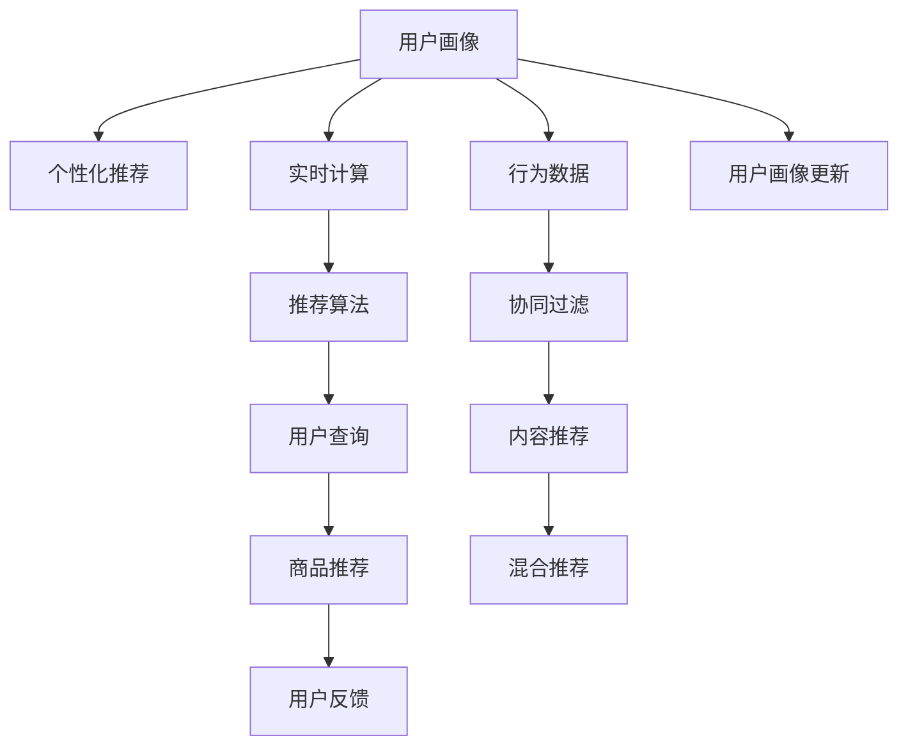

                 

# AI大模型在电商实时个性化中的应用与挑战

> 关键词：电商, 个性化推荐, 实时, AI大模型, 数据挖掘, 用户体验

## 1. 背景介绍

### 1.1 问题由来
随着电商行业竞争的日趋激烈，提高用户留存率和转化率成为商家们亟待解决的问题。传统的静态推荐系统已难以满足用户需求，个性化推荐系统逐渐成为电商运营的核心。通过实时分析用户行为和偏好，为每位用户推荐最相关的商品，可以显著提升用户体验和转化率。而AI大模型，凭借其强大的学习能力和大数据处理能力，成为构建个性化推荐系统的理想选择。

### 1.2 问题核心关键点
个性化推荐系统需要解决的核心问题包括：
- 实时性：系统需要能够即时响应用户的查询，推荐最新、最相关的商品。
- 准确性：推荐结果应与用户实际购买行为高度一致，避免误导用户。
- 可扩展性：推荐系统需要支持海量用户的实时查询，确保高效稳定。
- 可解释性：用户应能够理解推荐结果的生成逻辑，提升信任度。
- 安全性：保护用户隐私，避免过度收集和不当使用用户数据。

本文章将重点探讨如何使用AI大模型在电商领域实现个性化推荐，并分析其面临的挑战与对策。

## 2. 核心概念与联系

### 2.1 核心概念概述

为更好地理解AI大模型在电商个性化推荐中的应用，本节将介绍几个密切相关的核心概念：

- AI大模型：以深度神经网络为代表的大型预训练语言模型，如GPT、BERT等。通过在大规模数据上预训练，学习通用的语言表示，具备强大的语义理解和生成能力。

- 个性化推荐系统：利用用户行为数据和模型预测，为用户推荐相关商品的系统。通过实时分析用户行为，实现个性化推荐，提升用户体验和转化率。

- 实时计算：指在用户请求到达时，即时计算并返回推荐结果的计算模式。与批处理计算相比，实时计算对系统延迟和吞吐量有更高的要求。

- 推荐算法：包括协同过滤、内容推荐、混合推荐等，用于计算用户-商品关联和相似度，生成推荐列表。

- 用户画像：基于用户行为数据，构建的包含用户兴趣、偏好、历史购买记录等信息的虚拟人物模型，用于指导推荐模型的训练和推荐决策。

这些核心概念之间的逻辑关系可以通过以下Mermaid流程图来展示：



这个流程图展示了个性化推荐系统的主要组成部分：

1. 用户画像通过用户行为数据构建，用于指导推荐模型。
2. 实时计算在用户查询时即时计算，提供推荐结果。
3. 推荐算法用于计算用户和商品的相关性和相似度。
4. 商品推荐根据算法输出，生成推荐列表。
5. 用户反馈用于进一步优化推荐系统，形成良性循环。

## 3. 核心算法原理 & 具体操作步骤
### 3.1 算法原理概述

基于AI大模型的个性化推荐系统，其核心思想是利用大模型的强大语义理解能力，结合实时用户行为数据，为每位用户生成个性化的推荐结果。具体而言，系统首先根据用户画像和实时查询，在大模型上进行推理，得到用户对于不同商品的兴趣预测。然后，根据预测结果，结合商品属性和用户行为数据，生成推荐列表。

数学上，假设用户画像为 $u$，商品为 $i$，用户的兴趣预测为 $p(u,i)$，则推荐列表可以表示为：

$$
\text{RecList}(u) = \text{TopK}(p(u, i) \cdot f_i)
$$

其中 $f_i$ 为商品 $i$ 的属性向量，$\text{TopK}$ 表示选择与 $u$ 兴趣预测得分最高的前 $K$ 个商品。

### 3.2 算法步骤详解

基于AI大模型的个性化推荐系统主要包含以下几个关键步骤：

**Step 1: 数据准备**
- 收集用户行为数据，如浏览历史、点击记录、购买记录等。
- 从电商平台收集商品数据，包括商品ID、属性、价格等信息。
- 对用户和商品数据进行预处理，如归一化、去重等。

**Step 2: 用户画像构建**
- 基于用户行为数据，构建用户画像 $u$，包含用户兴趣、偏好、历史行为等信息。
- 使用协同过滤、内容推荐等算法，进一步优化用户画像，提高预测准确度。

**Step 3: 大模型推理**
- 将用户画像和实时查询输入AI大模型，得到用户对于不同商品的兴趣预测 $p(u, i)$。
- 使用向量表示将商品属性和用户画像向量拼接，形成输入向量。
- 使用大模型进行推理，得到预测向量 $p(u, i)$，即用户对商品的兴趣得分。

**Step 4: 推荐列表生成**
- 根据用户画像和实时查询，结合大模型的预测结果，计算用户对不同商品的兴趣得分。
- 根据得分排序，选择得分最高的前 $K$ 个商品，生成推荐列表。
- 返回推荐列表给用户，并进行后续的反馈处理。

**Step 5: 反馈处理**
- 收集用户对推荐结果的反馈，如点击、购买、跳过等行为。
- 根据反馈更新用户画像和商品数据，提高模型预测的准确性。
- 使用A/B测试等方法，评估推荐效果，进一步优化模型参数。

### 3.3 算法优缺点

基于AI大模型的个性化推荐系统具有以下优点：
1. 高效灵活：AI大模型可以实时计算用户兴趣，适应不同用户和商品的变化。
2. 全面精准：大模型的语义理解能力可以捕捉用户深层兴趣，提升推荐准确性。
3. 可扩展性强：系统可以处理海量用户和商品数据，支持高并发查询。
4. 可解释性好：用户可以理解推荐结果的生成逻辑，增加信任感。

同时，该方法也存在一些缺点：
1. 数据需求高：需要大规模用户行为和商品数据，采集和处理成本较高。
2. 模型复杂：AI大模型需要较强的计算资源，训练和推理效率较低。
3. 偏差风险：大模型可能会学习到平台偏见，影响推荐公正性。
4. 隐私问题：用户行为数据和模型预测涉及隐私问题，需要妥善处理。

## 4. 数学模型和公式 & 详细讲解  
### 4.1 数学模型构建

假设用户行为数据为 $D=\{(u_i, v_i)\}_{i=1}^N$，其中 $u_i$ 为第 $i$ 个用户的画像向量，$v_i$ 为用户的兴趣向量。商品属性数据为 $I=\{i_j\}_{j=1}^M$，其中 $i_j$ 为第 $j$ 个商品的属性向量。用户和商品之间的关联矩阵为 $X=\{(x_{i,j})\}_{i=1}^N, j=1,...,M$，其中 $x_{i,j}$ 表示用户 $i$ 对商品 $j$ 的兴趣得分。

推荐系统可以表示为以下矩阵形式：

$$
X = X_u \cdot X_i^T
$$

其中 $X_u$ 为用户画像矩阵，$X_i$ 为商品属性矩阵。

### 4.2 公式推导过程

为了最大化推荐效果，我们需要优化目标函数 $J$：

$$
J = \text{MSE}(X, X_u \cdot X_i^T)
$$

其中 $\text{MSE}$ 表示均方误差。通过梯度下降等优化算法，最小化目标函数 $J$，得到最优的用户画像矩阵 $X_u$ 和商品属性矩阵 $X_i$。

优化过程如下：

$$
\min_{X_u, X_i} J = \min_{X_u, X_i} \text{MSE}(X, X_u \cdot X_i^T)
$$

通过求解上述优化问题，可以得到用户画像矩阵和商品属性矩阵的更新公式：

$$
X_u \leftarrow X_u - \eta \cdot \nabla_{X_u}J
$$

$$
X_i \leftarrow X_i - \eta \cdot \nabla_{X_i}J
$$

其中 $\eta$ 为学习率，$\nabla_{X_u}J$ 和 $\nabla_{X_i}J$ 分别为用户画像和商品属性矩阵的梯度。

### 4.3 案例分析与讲解

假设我们有一个电商平台的个性化推荐系统，用户画像矩阵 $X_u$ 和商品属性矩阵 $X_i$ 如表所示：

| 用户ID | 兴趣得分 |
| ------ | -------- |
| 1001   | 0.8      |
| 1002   | 0.7      |
| 1003   | 0.6      |
| ...    | ...      |

| 商品ID | 属性得分 |
| ------ | -------- |
| 1001   | 0.9      |
| 1002   | 0.8      |
| 1003   | 0.7      |
| ...    | ...      |

我们可以使用上述优化公式，不断迭代更新用户画像矩阵和商品属性矩阵，最终得到最优的推荐结果。

## 5. 项目实践：代码实例和详细解释说明
### 5.1 开发环境搭建

在进行AI大模型在电商实时个性化推荐的应用开发前，我们需要准备好开发环境。以下是使用Python进行TensorFlow和TensorFlow-Serving开发的流程：

1. 安装TensorFlow：从官网下载并安装TensorFlow，可以使用conda或pip进行安装。

   ```bash
   conda install tensorflow -c conda-forge
   ```

   或

   ```bash
   pip install tensorflow
   ```

2. 安装TensorFlow-Serving：从官网下载并安装TensorFlow-Serving。

   ```bash
   git clone https://github.com/tensorflow/serving.git
   cd serving
   make -j8
   sudo ./bin/start_tensorflow_server --port=8500 --model_name=my_model
   ```

3. 安装TensorBoard：用于可视化模型训练过程。

   ```bash
   pip install tensorboard
   ```

4. 安装TensorFlow-Serving API：用于构建API接口，方便模型部署和调用。

   ```bash
   pip install tensorflow_serving.apis
   ```

完成上述步骤后，即可在TensorFlow和TensorFlow-Serving环境下进行个性化推荐系统的开发和部署。

### 5.2 源代码详细实现

下面我们以基于BERT模型的电商个性化推荐系统为例，给出TensorFlow的代码实现。

首先，定义商品数据和用户行为数据：

```python
import tensorflow as tf
import tensorflow_serving.apis as apis

# 商品数据
商品ID = [1001, 1002, 1003]
商品属性得分 = [0.9, 0.8, 0.7]

# 用户行为数据
用户ID = [1001, 1002, 1003]
用户兴趣得分 = [0.8, 0.7, 0.6]
```

接着，定义用户画像矩阵和商品属性矩阵：

```python
# 用户画像矩阵
X_u = tf.keras.layers.Input(shape=(2,), name='X_u')
X_u = tf.keras.layers.Dense(64, activation='relu')(X_u)
X_u = tf.keras.layers.Dense(64, activation='relu')(X_u)
X_u = tf.keras.layers.Dense(2, activation='softmax')(X_u)

# 商品属性矩阵
X_i = tf.keras.layers.Input(shape=(2,), name='X_i')
X_i = tf.keras.layers.Dense(64, activation='relu')(X_i)
X_i = tf.keras.layers.Dense(64, activation='relu')(X_i)
X_i = tf.keras.layers.Dense(2, activation='softmax')(X_i)
```

然后，定义推荐矩阵的计算过程：

```python
# 推荐矩阵
X = tf.keras.layers.Dot(axes=[1, 1])([X_u, X_i])
```

最后，定义优化过程：

```python
# 优化器
optimizer = tf.keras.optimizers.Adam()

# 定义损失函数
loss = tf.keras.losses.MeanSquaredError()

# 定义训练过程
@tf.function
def train_step(X_u, X_i):
    with tf.GradientTape() as tape:
        X_u = X_u.assign_add(optimizer * tape.gradient(X_u, [X_u]))
        X_i = X_i.assign_add(optimizer * tape.gradient(X_i, [X_i]))
    return loss(X, X_u * X_i)

# 训练过程
epochs = 1000
for epoch in range(epochs):
    for i in range(len(商品ID)):
        X_u_input = tf.constant([用户兴趣得分[i]], dtype=tf.float32)
        X_i_input = tf.constant([商品属性得分[i]], dtype=tf.float32)
        loss = train_step(X_u_input, X_i_input)
        print(f"Epoch {epoch+1}, loss: {loss.numpy():.4f}")
```

在模型训练完成后，可以将模型导出并部署到TensorFlow-Serving中进行实时推荐。

## 6. 实际应用场景

### 6.1 智能推荐系统

在电商平台上，基于AI大模型的个性化推荐系统可以为用户实时推荐商品，提升用户体验和购买转化率。例如，用户浏览某商品页面时，系统可以基于用户画像和实时查询，生成个性化的商品推荐列表，让用户快速找到自己感兴趣的商品。

### 6.2 行为分析系统

除了推荐商品，AI大模型还可以用于电商行为分析。通过实时分析用户点击、浏览、购买等行为，系统可以识别用户兴趣和行为模式，及时调整推荐策略，提升用户体验。例如，对于频繁购买特定类别的用户，系统可以推荐该类别的其他商品，满足用户的潜在需求。

### 6.3 需求预测系统

AI大模型还可以用于电商需求预测。通过分析历史销售数据和用户行为数据，模型可以预测未来一段时间内的商品需求量，帮助电商平台进行库存管理和生产调度。例如，根据用户搜索历史和点击行为，预测某商品的未来销量，避免缺货或库存积压。

### 6.4 未来应用展望

随着AI大模型技术的不断进步，电商实时个性化推荐系统将在更多场景中得到应用，为电商运营带来新的变革：

- 多模态推荐：结合图像、语音等多模态数据，提升推荐系统的智能化水平。
- 联邦学习：通过联邦学习技术，保护用户隐私的同时，实现跨平台协同推荐。
- 动态定价：基于用户行为和商品需求，实时调整商品价格，提升销售收益。
- 内容生成：使用生成模型生成商品介绍和用户评价，丰富电商平台的展示效果。
- 商品测评：基于用户反馈，生成商品测评，提升商品推荐可信度。

## 7. 工具和资源推荐

### 7.1 学习资源推荐

为了帮助开发者系统掌握AI大模型在电商推荐系统中的应用，这里推荐一些优质的学习资源：

1. TensorFlow官方文档：官方文档是学习TensorFlow的最佳资源，提供了丰富的教程和API参考。

2. TensorFlow-Serving官方文档：官方文档介绍了TensorFlow-Serving的部署和使用，是部署模型和API接口的重要参考。

3. Google AI的电商推荐系统系列：Google AI团队发布了多篇关于电商推荐系统的论文和实现代码，涵盖了多模态推荐、联邦学习等前沿技术。

4. 《TensorFlow实战Google深度学习框架》书籍：由TensorFlow核心开发者编写，系统介绍了TensorFlow的部署、调参和优化方法。

5. 《深度学习与TensorFlow》书籍：介绍深度学习原理和TensorFlow的使用方法，适合初学者入门。

通过学习这些资源，相信你一定能够快速掌握AI大模型在电商推荐系统中的应用，并用于解决实际的电商问题。

### 7.2 开发工具推荐

高效的开发离不开优秀的工具支持。以下是几款用于AI大模型在电商推荐系统开发的常用工具：

1. Jupyter Notebook：轻量级的数据分析和模型训练工具，支持Python环境，适合快速迭代实验。

2. Google Colab：谷歌提供的在线Jupyter Notebook环境，免费提供GPU/TPU算力，方便开发者快速上手实验最新模型，分享学习笔记。

3. TensorFlow-Serving：用于部署和调用AI大模型的API接口，支持高并发查询和实时推荐。

4. TensorBoard：用于可视化模型训练过程，实时监测模型性能和优化效果。

5. KubeFlow：谷歌开源的机器学习平台，支持分布式训练和模型部署，适合大规模生产环境。

合理利用这些工具，可以显著提升AI大模型在电商推荐系统的开发效率，加快创新迭代的步伐。

### 7.3 相关论文推荐

AI大模型和电商推荐系统的发展源于学界的持续研究。以下是几篇奠基性的相关论文，推荐阅读：

1. Attention is All You Need：提出了Transformer结构，开启了NLP领域的预训练大模型时代。

2. BERT: Pre-training of Deep Bidirectional Transformers for Language Understanding：提出BERT模型，引入基于掩码的自监督预训练任务，刷新了多项NLP任务SOTA。

3. Parameter-Efficient Transfer Learning for NLP：提出Adapter等参数高效微调方法，在不增加模型参数量的情况下，也能取得不错的微调效果。

4. Deep Collaborative Filtering with Personalized Attention for Recommendation Systems：提出基于注意力机制的协同过滤推荐算法，提升了推荐系统的准确性。

5. Deep Neural Networks for Adaptive Contextualized Sentiment Analysis：提出基于BERT的情感分析模型，在电商推荐系统中得到了广泛应用。

这些论文代表了大语言模型在电商推荐系统中的应用脉络。通过学习这些前沿成果，可以帮助研究者把握学科前进方向，激发更多的创新灵感。

## 8. 总结：未来发展趋势与挑战

### 8.1 总结

本文对AI大模型在电商实时个性化推荐系统中的应用进行了全面系统的介绍。首先阐述了电商推荐系统在提升用户体验和购买转化率方面的重要性，明确了AI大模型在推荐系统中的关键作用。其次，从原理到实践，详细讲解了基于AI大模型的个性化推荐系统的核心算法和操作步骤，给出了电商推荐系统的完整代码实现。同时，本文还广泛探讨了AI大模型在电商推荐系统中的应用场景和未来展望，展示了其在电商运营中的巨大潜力。此外，本文精选了AI大模型在电商推荐系统的各类学习资源，力求为读者提供全方位的技术指引。

通过本文的系统梳理，可以看到，基于AI大模型的个性化推荐系统正在成为电商运营的重要技术手段，极大地提升了用户购物体验和平台销售业绩。未来，伴随AI大模型的持续演进，电商推荐系统也将不断迭代优化，为电商行业带来新的变革。

### 8.2 未来发展趋势

展望未来，AI大模型在电商推荐系统中的发展将呈现以下几个趋势：

1. 多模态推荐：结合图像、语音等多模态数据，提升推荐系统的智能化水平。

2. 联邦学习：通过联邦学习技术，保护用户隐私的同时，实现跨平台协同推荐。

3. 实时定价：基于用户行为和商品需求，实时调整商品价格，提升销售收益。

4. 内容生成：使用生成模型生成商品介绍和用户评价，丰富电商平台的展示效果。

5. 商品测评：基于用户反馈，生成商品测评，提升商品推荐可信度。

6. 跨领域应用：将推荐系统应用到更多垂直领域，如金融、医疗等，提升多领域的用户满意度和运营效率。

以上趋势凸显了AI大模型在电商推荐系统中的广阔前景。这些方向的探索发展，必将进一步提升电商推荐系统的性能和应用范围，为电商行业带来新的突破。

### 8.3 面临的挑战

尽管AI大模型在电商推荐系统中取得了显著效果，但在迈向更加智能化、普适化应用的过程中，仍面临诸多挑战：

1. 数据需求高：需要大规模用户行为和商品数据，采集和处理成本较高。

2. 模型复杂：AI大模型需要较强的计算资源，训练和推理效率较低。

3. 偏差风险：大模型可能会学习到平台偏见，影响推荐公正性。

4. 隐私问题：用户行为数据和模型预测涉及隐私问题，需要妥善处理。

5. 动态变化：电商平台的商品和用户行为随时变化，需要实时更新模型。

6. 安全性：保护用户隐私，避免过度收集和不当使用用户数据。

正视电商推荐系统面临的这些挑战，积极应对并寻求突破，将是大语言模型在电商推荐系统中的关键。相信随着学界和产业界的共同努力，这些挑战终将一一被克服，AI大模型在电商推荐系统中的表现也将不断提升。

### 8.4 研究展望

面对AI大模型在电商推荐系统中面临的挑战，未来的研究需要在以下几个方面寻求新的突破：

1. 探索高效的数据采集和处理技术，降低数据需求和采集成本。

2. 开发更加高效的模型和算法，提升训练和推理效率。

3. 引入更多先验知识，如知识图谱、逻辑规则等，提高模型解释性和可信度。

4. 利用联邦学习等技术，保护用户隐私和数据安全。

5. 引入动态更新机制，提升模型对用户行为和市场变化的适应性。

6. 结合其他AI技术，如强化学习、生成模型等，进一步提升推荐系统的智能化和可靠性。

这些研究方向将推动AI大模型在电商推荐系统中的不断进步，为电商行业带来更多创新和价值。

## 9. 附录：常见问题与解答

**Q1：AI大模型在电商推荐系统中是否存在过拟合风险？**

A: AI大模型存在过拟合风险，尤其是在数据量不足的情况下。为了降低过拟合风险，可以采用以下策略：

1. 数据增强：通过回译、近义替换等方式扩充训练集。

2. 正则化：使用L2正则、Dropout等防止模型过度适应训练数据。

3. 早停机制：在验证集上监测模型性能，当性能不再提升时停止训练。

4. 交叉验证：将数据集分为训练集和验证集，交替进行训练和验证，提升模型泛化性能。

5. 多模型集成：训练多个模型，取平均输出，抑制过拟合。

通过这些策略，可以有效降低AI大模型在电商推荐系统中的过拟合风险，提升模型的泛化性能。

**Q2：AI大模型在电商推荐系统中如何进行实时计算？**

A: AI大模型在电商推荐系统中的实时计算，可以通过TensorFlow-Serving等框架实现。具体步骤如下：

1. 将训练好的模型导出为TensorFlow SavedModel格式。

2. 使用TensorFlow-Serving部署模型，设置API接口。

3. 在电商平台上部署API接口，实时接收用户查询。

4. 调用API接口，根据用户查询生成推荐结果，返回给用户。

通过TensorFlow-Serving，AI大模型可以高效地进行实时计算，满足电商平台的查询需求。

**Q3：AI大模型在电商推荐系统中如何进行模型更新？**

A: AI大模型在电商推荐系统中的模型更新，可以通过在线学习（Online Learning）和联邦学习（Federated Learning）等技术实现。具体步骤如下：

1. 在线学习：根据实时用户行为数据，在线更新模型参数，提升模型实时性。

2. 联邦学习：将用户数据分布在多个设备上，分别训练本地模型，然后将本地模型参数聚合，生成全局模型。

3. 使用在线学习或联邦学习，不断更新模型，使其适应新的用户行为和市场变化。

通过在线学习或联邦学习，AI大模型在电商推荐系统中的模型可以不断更新，提升推荐系统的动态性和适应性。

---

作者：禅与计算机程序设计艺术 / Zen and the Art of Computer Programming

