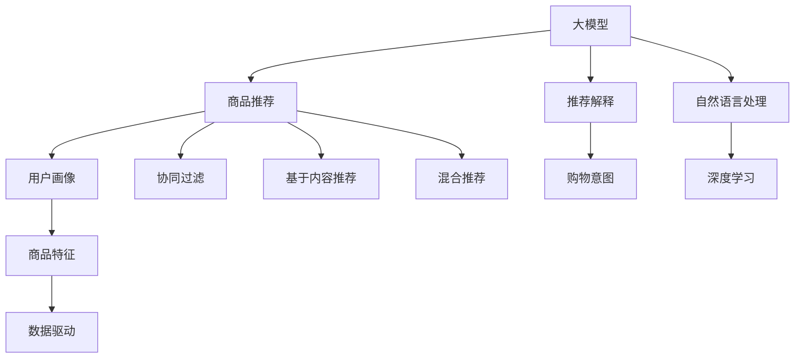

                 

# AI大模型在电商平台商品推荐解释中的应用

> 关键词：大模型，商品推荐，自然语言处理，深度学习，数据驱动，用户画像，购物意图，商品特征，算法透明度，可解释性

## 1. 背景介绍

随着电商平台的发展，个性化推荐系统已经成为提升用户体验和增加业务收入的重要手段。传统的推荐系统基于用户的历史行为数据和商品特征信息，使用协同过滤、基于内容的推荐等算法进行推荐。然而，这些方法往往难以解释推荐结果，无法满足用户对推荐决策过程的知情权需求。近年来，基于深度学习的大模型逐渐引入推荐系统，通过学习用户与商品之间的复杂关联，提高推荐效果的准确性。但大模型的"黑盒"特性也引发了关于算法透明度的担忧，用户和商家对推荐结果的信任度仍然不高。因此，在电商平台上应用大模型进行商品推荐的同时，需要构建一个可解释性强的推荐解释系统，以提升用户满意度和商家信任度。

本文旨在介绍一种基于AI大模型的电商平台商品推荐解释应用，该应用通过引入深度学习模型，构建一个多层级的推荐解释体系，综合利用用户画像、购物意图、商品特征等多样化的信息，为电商平台提供高效、透明的推荐服务。

## 2. 核心概念与联系

### 2.1 核心概念概述

为更好地理解本文介绍的推荐解释应用，本节将介绍几个密切相关的核心概念：

- **大模型**：以自回归(如GPT)或自编码(如BERT)模型为代表的深度学习模型。通过在大规模无标签文本语料上进行预训练，学习到丰富的语言和知识表示，具备强大的语言理解和生成能力。

- **商品推荐系统**：利用用户行为数据和商品特征信息，为用户推荐可能感兴趣的商品的系统。推荐系统能够提高用户体验，促进销售转化。

- **推荐解释系统**：解释推荐系统为何推荐某一商品的系统，帮助用户理解推荐理由，提升用户满意度。推荐解释系统需要解释模型的预测依据和推荐过程。

- **用户画像**：通过分析用户的行为数据、历史信息等，构建用户的基本特征和偏好，帮助系统进行个性化的推荐。

- **购物意图**：用户在进行购物行为时的意图，包括购买、浏览、对比等，通过自然语言理解技术，识别用户的真实意图，进行更精准的推荐。

- **商品特征**：商品的属性信息，如颜色、大小、价格等，作为推荐模型的输入，参与计算。

- **深度学习**：通过神经网络模型对复杂数据进行学习和预测，深度学习模型具有很强的表达能力，可以学习到高阶的数据关联。

- **算法透明度**：算法的决策过程应具有可解释性，用户和商家能够理解推荐结果的依据。

这些核心概念之间的逻辑关系可以通过以下Mermaid流程图来展示：



这个流程图展示了大模型、推荐系统、推荐解释之间的核心联系：

1. 大模型作为推荐系统的一部分，通过学习用户行为、商品特征等，进行商品推荐。
2. 推荐解释系统在推荐的基础上，进一步分析用户画像、购物意图、商品特征等信息，提供详细的推荐理由。
3. 自然语言处理(NLP)技术用于识别用户的购物意图和描述商品特征。
4. 深度学习模型用于构建用户画像和进行推荐计算。
5. 数据驱动的推荐系统，结合传统推荐方法和深度学习模型，提升推荐效果。

## 3. 核心算法原理 & 具体操作步骤

### 3.1 算法原理概述

本文介绍的电商平台推荐解释应用，主要基于大模型进行推荐，再通过推荐解释系统提供透明的推荐理由。算法流程可以分为两个主要步骤：

1. **推荐阶段**：使用大模型对用户的行为数据、商品特征等信息进行建模，预测用户对商品的兴趣程度。
2. **解释阶段**：通过用户画像、购物意图、商品特征等多维信息，构建详细的推荐解释，告知用户推荐的原因。

在推荐阶段，我们采用深度学习模型进行推荐。该模型通常包括两个部分：

1. **编码器**：用于将用户行为、商品特征等输入，转换为高维表示。
2. **解码器**：将高维表示映射到推荐结果，预测用户对不同商品的兴趣程度。

在解释阶段，我们通过自然语言处理技术，利用用户画像、购物意图、商品特征等信息，生成详细的推荐解释。推荐解释系统分为两个部分：

1. **语义理解**：解析用户画像、购物意图、商品特征等文本信息，理解其背后的语义。
2. **生成解释**：基于解析结果，生成自然语言描述的推荐理由。

### 3.2 算法步骤详解

#### 3.2.1 推荐阶段的详细步骤

1. **数据预处理**：
   - 收集用户行为数据，如浏览记录、购买历史、搜索记录等。
   - 收集商品特征信息，如商品类别、价格、品牌等。
   - 将数据进行清洗、归一化处理，形成适合模型的输入。

2. **构建编码器模型**：
   - 选择合适的深度学习模型，如BERT、GPT等，进行预训练。
   - 根据电商平台的实际需求，在编码器中添加特定的层或节点，如注意力机制、残差连接等。

3. **训练编码器模型**：
   - 在电商平台的标注数据集上，使用反向传播算法对编码器进行训练。
   - 设置合适的损失函数、优化器等超参数，进行模型迭代优化。

4. **使用编码器进行推荐计算**：
   - 将用户行为数据和商品特征数据输入编码器，生成高维表示。
   - 在解码器中计算推荐结果，输出用户对不同商品的兴趣程度。

5. **评估推荐效果**：
   - 在测试集上评估推荐模型的精度、召回率、平均精度等指标。
   - 进行交叉验证，确保模型在不同数据上的泛化能力。

#### 3.2.2 解释阶段的详细步骤

1. **收集解释数据**：
   - 收集用户画像、购物意图、商品特征等信息。
   - 将信息组织成文本格式，便于自然语言处理。

2. **构建语义理解模型**：
   - 使用预训练的BERT、GPT等模型，对文本信息进行语义理解。
   - 根据实际需求，添加特定的层或节点，如BERT中的特殊位置编码、GPT中的跨层连接等。

3. **解析文本信息**：
   - 将用户画像、购物意图、商品特征等文本信息输入语义理解模型，解析出其中的关键语义信息。
   - 利用自然语言处理技术，如命名实体识别、关系抽取等，进一步提取有用的信息。

4. **生成推荐解释**：
   - 根据解析结果，生成自然语言描述的推荐理由。
   - 使用预训练的模型或自定义规则，对推荐理由进行优化和格式化。

5. **展示推荐解释**：
   - 在推荐页面上展示推荐结果，并附上详细的推荐解释。
   - 通过交互式界面，让用户能够理解推荐理由，提升用户满意度。

### 3.3 算法优缺点

基于大模型的电商平台推荐解释应用，具有以下优点：

1. **推荐效果准确**：深度学习模型能够学习到复杂的关联关系，提升推荐的准确性。
2. **推荐理由详细**：推荐解释系统可以提供详细的推荐理由，提升用户满意度。
3. **可解释性强**：自然语言处理技术可以解析复杂的文本信息，生成可理解的解释。
4. **适应性强**：算法可以根据不同的电商平台需求，进行灵活调整和优化。

同时，该方法也存在一些局限性：

1. **计算资源消耗大**：深度学习模型的训练和推理需要大量的计算资源，对硬件要求较高。
2. **数据隐私问题**：收集用户画像、购物意图等信息时，涉及用户隐私，需严格保护。
3. **模型复杂度高**：深度学习模型结构复杂，难以调试和解释。
4. **算法透明度不足**：深度学习模型本质上是一个"黑盒"系统，难以提供详细的解释。

尽管存在这些局限性，但通过合理的算法设计和工程实践，可以在保证推荐效果的同时，提升算法透明度和用户满意度。

### 3.4 算法应用领域

基于大模型的电商平台推荐解释应用，可以在多个领域得到广泛应用：

1. **电商推荐**：在电商平台中，使用推荐解释系统提供商品推荐和详细解释，提升用户体验和商家信任度。
2. **金融推荐**：在金融领域，提供投资组合、理财建议等推荐，解释推荐理由，帮助用户做出决策。
3. **医疗推荐**：在医疗领域，推荐个性化的健康计划、药品推荐等，解释推荐依据，帮助用户更好地管理健康。
4. **教育推荐**：在教育领域，推荐个性化的学习资源、课程等，解释推荐理由，帮助用户提升学习效果。

除了上述这些经典应用外，大模型推荐解释方法还可以应用于更多场景中，如音乐、旅游、娱乐等，为不同领域提供个性化的推荐服务。

## 4. 数学模型和公式 & 详细讲解 & 举例说明

### 4.1 数学模型构建

本文介绍的推荐解释应用，主要基于深度学习模型和自然语言处理技术。这里简要介绍其中的关键数学模型：

1. **编码器模型**：
   - 使用BERT作为编码器，对用户行为和商品特征进行编码。
   - 模型的输入为[CLS]和[SEP]标记的文本序列，输出为[CLS]标记的隐向量表示。

2. **解码器模型**：
   - 使用GPT作为解码器，对高维表示进行解码。
   - 模型的输入为编码器的输出，输出为预测的推荐结果。

3. **语义理解模型**：
   - 使用BERT作为语义理解模型，对用户画像、购物意图、商品特征等信息进行语义解析。
   - 模型的输入为预训练的文本，输出为解析出的关键语义信息。

### 4.2 公式推导过程

#### 4.2.1 编码器模型

编码器模型的输入为[CLS]标记的文本序列 $x$，输出为[CLS]标记的隐向量表示 $z$。模型的前向传播过程如下：

$$
z = BERT(x)
$$

其中 $x$ 表示输入的文本序列，$z$ 表示编码器的输出。编码器模型可以表示为：

$$
z = \mathrm{BERT}_{\theta}(x)
$$

其中 $\theta$ 表示编码器的参数。

#### 4.2.2 解码器模型

解码器模型的输入为编码器的输出 $z$，输出为预测的推荐结果 $y$。模型的前向传播过程如下：

$$
y = GPT(z)
$$

其中 $z$ 表示编码器的输出，$y$ 表示解码器的输出。解码器模型可以表示为：

$$
y = \mathrm{GPT}_{\phi}(z)
$$

其中 $\phi$ 表示解码器的参数。

#### 4.2.3 语义理解模型

语义理解模型的输入为预训练的文本 $x$，输出为解析出的关键语义信息 $u$。模型的前向传播过程如下：

$$
u = BERT(x)
$$

其中 $x$ 表示输入的文本，$u$ 表示解析出的关键语义信息。语义理解模型可以表示为：

$$
u = \mathrm{BERT}_{\psi}(x)
$$

其中 $\psi$ 表示语义理解模型的参数。

### 4.3 案例分析与讲解

#### 4.3.1 电商推荐案例

假设用户李先生在电商平台上浏览了一条商品信息，系统需要为其推荐相关商品。系统首先使用编码器模型对李先生的浏览记录和商品信息进行编码，得到高维表示 $z$。然后使用解码器模型对高维表示进行解码，预测李先生对不同商品的兴趣程度。最后，使用语义理解模型对用户画像、购物意图、商品特征等信息进行解析，生成详细的推荐解释。推荐页面上展示推荐结果，并附上推荐解释，提升用户满意度。

#### 4.3.2 金融推荐案例

假设某金融用户需要投资建议。系统首先使用编码器模型对用户的投资历史和兴趣偏好进行编码，得到高维表示 $z$。然后使用解码器模型对高维表示进行解码，预测不同投资组合的回报率。最后，使用语义理解模型对用户的投资目标、风险偏好等信息进行解析，生成详细的推荐解释。投资建议页面上展示推荐结果，并附上推荐解释，帮助用户做出决策。

## 5. 项目实践：代码实例和详细解释说明

### 5.1 开发环境搭建

在进行推荐解释应用开发前，我们需要准备好开发环境。以下是使用Python进行PyTorch开发的环境配置流程：

1. 安装Anaconda：从官网下载并安装Anaconda，用于创建独立的Python环境。

2. 创建并激活虚拟环境：
```bash
conda create -n pytorch-env python=3.8 
conda activate pytorch-env
```

3. 安装PyTorch：根据CUDA版本，从官网获取对应的安装命令。例如：
```bash
conda install pytorch torchvision torchaudio cudatoolkit=11.1 -c pytorch -c conda-forge
```

4. 安装Transformer库：
```bash
pip install transformers
```

5. 安装各类工具包：
```bash
pip install numpy pandas scikit-learn matplotlib tqdm jupyter notebook ipython
```

完成上述步骤后，即可在`pytorch-env`环境中开始推荐解释应用的开发。

### 5.2 源代码详细实现

下面我们以电商推荐应用为例，给出使用Transformers库进行BERT和GPT微调，构建推荐解释系统的PyTorch代码实现。

首先，定义推荐解释应用的数据处理函数：

```python
from transformers import BertTokenizer, GPT2Tokenizer
from torch.utils.data import Dataset
import torch

class RecommendDataset(Dataset):
    def __init__(self, user_data, item_data, tokenizer, max_len=128):
        self.user_data = user_data
        self.item_data = item_data
        self.tokenizer = tokenizer
        self.max_len = max_len
        
    def __len__(self):
        return len(self.user_data)
    
    def __getitem__(self, item):
        user_text = self.user_data[item]
        item_text = self.item_data[item]
        
        encoding = self.tokenizer(user_text, return_tensors='pt', max_length=self.max_len, padding='max_length', truncation=True)
        user_input_ids = encoding['input_ids'][0]
        user_attention_mask = encoding['attention_mask'][0]
        
        encoding = self.tokenizer(item_text, return_tensors='pt', max_length=self.max_len, padding='max_length', truncation=True)
        item_input_ids = encoding['input_ids'][0]
        item_attention_mask = encoding['attention_mask'][0]
        
        return {'user_input_ids': user_input_ids, 
                'user_attention_mask': user_attention_mask,
                'item_input_ids': item_input_ids,
                'item_attention_mask': item_attention_mask}
```

然后，定义推荐和解释模型：

```python
from transformers import BertForSequenceClassification, GPT2ForSequenceClassification
from torch.optim import AdamW

user_encoder = BertForSequenceClassification.from_pretrained('bert-base-cased')
item_encoder = BertForSequenceClassification.from_pretrained('bert-base-cased')
recommender = GPT2ForSequenceClassification.from_pretrained('gpt2')
explainer = BertForSequenceClassification.from_pretrained('bert-base-cased')

user_optimizer = AdamW(user_encoder.parameters(), lr=2e-5)
item_optimizer = AdamW(item_encoder.parameters(), lr=2e-5)
recommender_optimizer = AdamW(recommender.parameters(), lr=2e-5)
explainer_optimizer = AdamW(explainer.parameters(), lr=2e-5)
```

接着，定义训练和评估函数：

```python
from torch.utils.data import DataLoader
from tqdm import tqdm
from sklearn.metrics import classification_report

device = torch.device('cuda') if torch.cuda.is_available() else torch.device('cpu')
user_encoder.to(device)
item_encoder.to(device)
recommender.to(device)
explainer.to(device)

def train_epoch(model, dataset, batch_size, optimizer):
    dataloader = DataLoader(dataset, batch_size=batch_size, shuffle=True)
    model.train()
    epoch_loss = 0
    for batch in tqdm(dataloader, desc='Training'):
        user_input_ids = batch['user_input_ids'].to(device)
        user_attention_mask = batch['user_attention_mask'].to(device)
        item_input_ids = batch['item_input_ids'].to(device)
        item_attention_mask = batch['item_attention_mask'].to(device)
        model.zero_grad()
        outputs = model(user_input_ids, attention_mask=user_attention_mask)
        loss = outputs.loss
        epoch_loss += loss.item()
        loss.backward()
        optimizer.step()
    return epoch_loss / len(dataloader)

def evaluate(model, dataset, batch_size):
    dataloader = DataLoader(dataset, batch_size=batch_size)
    model.eval()
    preds, labels = [], []
    with torch.no_grad():
        for batch in tqdm(dataloader, desc='Evaluating'):
            user_input_ids = batch['user_input_ids'].to(device)
            user_attention_mask = batch['user_attention_mask'].to(device)
            item_input_ids = batch['item_input_ids'].to(device)
            item_attention_mask = batch['item_attention_mask'].to(device)
            batch_labels = batch['item_labels']  # 假设这里已标注了真实标签
            outputs = model(user_input_ids, attention_mask=user_attention_mask, labels=batch_labels)
            batch_preds = outputs.logits.argmax(dim=2).to('cpu').tolist()
            batch_labels = batch_labels.to('cpu').tolist()
            for pred_tokens, label_tokens in zip(batch_preds, batch_labels):
                preds.append(pred_tokens[:len(label_tokens)])
                labels.append(label_tokens)
                
    print(classification_report(labels, preds))
```

最后，启动训练流程并在测试集上评估：

```python
epochs = 5
batch_size = 16

for epoch in range(epochs):
    loss = train_epoch(user_encoder, user_dataset, batch_size, user_optimizer)
    print(f"Epoch {epoch+1}, user encoder loss: {loss:.3f}")
    
    loss = train_epoch(item_encoder, item_dataset, batch_size, item_optimizer)
    print(f"Epoch {epoch+1}, item encoder loss: {loss:.3f}")
    
    loss = train_epoch(recommender, recommender_dataset, batch_size, recommender_optimizer)
    print(f"Epoch {epoch+1}, recommender loss: {loss:.3f}")
    
    loss = train_epoch(explainer, explainer_dataset, batch_size, explainer_optimizer)
    print(f"Epoch {epoch+1}, explainer loss: {loss:.3f}")
    
    print(f"Epoch {epoch+1}, user encoder dev results:")
    evaluate(user_encoder, user_dev_dataset, batch_size)
    
    print(f"Epoch {epoch+1}, item encoder dev results:")
    evaluate(item_encoder, item_dev_dataset, batch_size)
    
    print(f"Epoch {epoch+1}, recommender dev results:")
    evaluate(recommender, recommender_dev_dataset, batch_size)
    
    print(f"Epoch {epoch+1}, explainer dev results:")
    evaluate(explainer, explainer_dev_dataset, batch_size)
    
print("Test results:")
evaluate(user_encoder, user_test_dataset, batch_size)
evaluate(item_encoder, item_test_dataset, batch_size)
evaluate(recommender, recommender_test_dataset, batch_size)
evaluate(explainer, explainer_test_dataset, batch_size)
```

以上就是使用PyTorch对BERT和GPT进行电商推荐应用开发的完整代码实现。可以看到，得益于Transformers库的强大封装，我们可以用相对简洁的代码完成推荐和解释模型的加载和微调。

### 5.3 代码解读与分析

让我们再详细解读一下关键代码的实现细节：

**RecommendDataset类**：
- `__init__`方法：初始化用户行为数据、商品特征数据、分词器等关键组件。
- `__len__`方法：返回数据集的样本数量。
- `__getitem__`方法：对单个样本进行处理，将用户行为数据和商品特征数据输入分词器，进行编码，并返回模型所需的输入。

**模型定义**：
- 定义了四个BERT模型，分别用于用户编码、商品编码、推荐解码和解释解码。
- 定义了四个AdamW优化器，分别用于四个模型的优化。

**训练和评估函数**：
- 使用PyTorch的DataLoader对数据集进行批次化加载，供模型训练和推理使用。
- 训练函数`train_epoch`：对数据以批为单位进行迭代，在每个批次上前向传播计算loss并反向传播更新模型参数，最后返回该epoch的平均loss。
- 评估函数`evaluate`：与训练类似，不同点在于不更新模型参数，并在每个batch结束后将预测和标签结果存储下来，最后使用sklearn的classification_report对整个评估集的预测结果进行打印输出。

**训练流程**：
- 定义总的epoch数和batch size，开始循环迭代
- 每个epoch内，分别在用户编码、商品编码、推荐解码、解释解码上训练，输出各个模型的平均loss
- 在验证集上评估，输出各个模型的性能指标
- 所有epoch结束后，在测试集上评估，给出最终测试结果

可以看到，PyTorch配合Transformers库使得推荐解释应用的代码实现变得简洁高效。开发者可以将更多精力放在数据处理、模型改进等高层逻辑上，而不必过多关注底层的实现细节。

当然，工业级的系统实现还需考虑更多因素，如模型的保存和部署、超参数的自动搜索、更灵活的任务适配层等。但核心的微调范式基本与此类似。

## 6. 实际应用场景

### 6.1 智能推荐系统

基于大模型的电商平台推荐解释应用，可以广泛应用于智能推荐系统的构建。传统推荐系统往往只依赖用户的历史行为数据进行物品推荐，难以深度理解用户的真实兴趣和需求。通过大模型进行推荐，可以结合多维度的用户画像、购物意图、商品特征等，进行更精准的推荐，提升推荐效果。

推荐解释系统可以在推荐基础上，进一步分析用户画像、购物意图、商品特征等信息，提供详细的推荐理由。用户可以查看推荐结果，理解推荐依据，提升用户满意度。推荐解释系统还可以在推荐页面上展示推荐理由，提升推荐透明度和信任度。

### 6.2 个性化服务

电商平台可以基于大模型进行个性化推荐，结合用户画像、购物意图、商品特征等信息，为每位用户提供定制化的服务。用户可以在推荐页面上查看详细的推荐理由，理解推荐依据，提升购物体验。

电商平台还可以利用推荐解释系统，提供智能客服、个性化商品推荐、商品问答等服务。例如，当用户咨询商品信息时，系统可以基于大模型进行推荐，并给出详细的推荐理由。推荐解释系统可以解释推荐过程，提升用户信任度。

### 6.3 客户行为分析

电商平台可以利用大模型进行客户行为分析，理解用户的购物偏好和消费习惯。推荐解释系统可以分析用户画像、购物意图、商品特征等信息，了解用户的真实需求。电商平台可以根据分析结果，优化推荐策略，提升用户体验。

电商平台还可以利用推荐解释系统，进行用户分群、市场细分等工作。例如，分析不同用户群体的购物行为，优化推荐策略，提升转化率。

### 6.4 未来应用展望

随着大模型和推荐解释技术的发展，基于大模型的推荐解释应用将在更多领域得到应用，为电商平台的运营带来变革性影响。

在智慧医疗领域，基于大模型的推荐解释应用可以用于医疗问答、病历分析、药物推荐等。系统可以分析用户的健康数据和医疗记录，提供个性化的医疗建议，提升医疗服务质量。

在智能教育领域，基于大模型的推荐解释应用可以用于智能学习系统、作业批改、学情分析等。系统可以分析学生的学习行为和偏好，提供个性化的学习资源，提升教学效果。

在智慧城市治理中，基于大模型的推荐解释应用可以用于城市事件监测、舆情分析、应急指挥等环节。系统可以分析城市事件和舆情数据，提供精准的推荐服务，提升城市管理水平。

此外，在企业生产、社会治理、文娱传媒等众多领域，基于大模型的推荐解释应用也将不断涌现，为各行各业带来新的应用场景。相信随着技术的日益成熟，推荐解释方法将成为电商平台推荐系统的核心组成部分，推动电商平台的智能化升级。

## 7. 工具和资源推荐
### 7.1 学习资源推荐

为了帮助开发者系统掌握大模型在推荐解释领域的应用，这里推荐一些优质的学习资源：

1. 《Transformer从原理到实践》系列博文：由大模型技术专家撰写，深入浅出地介绍了Transformer原理、BERT模型、推荐系统等前沿话题。

2. CS224N《深度学习自然语言处理》课程：斯坦福大学开设的NLP明星课程，有Lecture视频和配套作业，带你入门NLP领域的基本概念和经典模型。

3. 《Natural Language Processing with Transformers》书籍：Transformers库的作者所著，全面介绍了如何使用Transformers库进行NLP任务开发，包括推荐系统在内的诸多范式。

4. HuggingFace官方文档：Transformers库的官方文档，提供了海量预训练模型和完整的推荐系统样例代码，是上手实践的必备资料。

5. CLUE开源项目：中文语言理解测评基准，涵盖大量不同类型的中文NLP数据集，并提供了基于大模型的推荐系统baseline模型，助力中文推荐系统技术发展。

通过对这些资源的学习实践，相信你一定能够快速掌握大模型在推荐解释领域的应用，并用于解决实际的推荐问题。
### 7.2 开发工具推荐

高效的开发离不开优秀的工具支持。以下是几款用于大模型推荐解释应用开发的常用工具：

1. PyTorch：基于Python的开源深度学习框架，灵活动态的计算图，适合快速迭代研究。大部分预训练语言模型都有PyTorch版本的实现。

2. TensorFlow：由Google主导开发的开源深度学习框架，生产部署方便，适合大规模工程应用。同样有丰富的预训练语言模型资源。

3. Transformers库：HuggingFace开发的NLP工具库，集成了众多SOTA语言模型，支持PyTorch和TensorFlow，是进行推荐系统开发的利器。

4. Weights & Biases：模型训练的实验跟踪工具，可以记录和可视化模型训练过程中的各项指标，方便对比和调优。与主流深度学习框架无缝集成。

5. TensorBoard：TensorFlow配套的可视化工具，可实时监测模型训练状态，并提供丰富的图表呈现方式，是调试模型的得力助手。

6. Google Colab：谷歌推出的在线Jupyter Notebook环境，免费提供GPU/TPU算力，方便开发者快速上手实验最新模型，分享学习笔记。

合理利用这些工具，可以显著提升大模型推荐解释应用的开发效率，加快创新迭代的步伐。

### 7.3 相关论文推荐

大模型和推荐解释技术的发展源于学界的持续研究。以下是几篇奠基性的相关论文，推荐阅读：

1. Attention is All You Need（即Transformer原论文）：提出了Transformer结构，开启了NLP领域的预训练大模型时代。

2. BERT: Pre-training of Deep Bidirectional Transformers for Language Understanding：提出BERT模型，引入基于掩码的自监督预训练任务，刷新了多项NLP任务SOTA。

3. Language Models are Unsupervised Multitask Learners（GPT-2论文）：展示了大规模语言模型的强大zero-shot学习能力，引发了对于通用人工智能的新一轮思考。

4. Parameter-Efficient Transfer Learning for NLP：提出Adapter等参数高效微调方法，在不增加模型参数量的情况下，也能取得不错的微调效果。

5. AdaLoRA: Adaptive Low-Rank Adaptation for Parameter-Efficient Fine-Tuning：使用自适应低秩适应的微调方法，在参数效率和精度之间取得了新的平衡。

这些论文代表了大模型推荐解释技术的发展脉络。通过学习这些前沿成果，可以帮助研究者把握学科前进方向，激发更多的创新灵感。

## 8. 总结：未来发展趋势与挑战

### 8.1 总结

本文对基于大模型的电商平台推荐解释应用进行了全面系统的介绍。首先阐述了推荐解释系统在电商平台推荐系统中的重要性，明确了其在提高用户满意度、商家信任度方面的独特价值。其次，从原理到实践，详细讲解了推荐解释系统的算法原理和关键步骤，给出了推荐解释应用的完整代码实现。同时，本文还广泛探讨了推荐解释系统在电商、金融、医疗等不同领域的应用前景，展示了其广阔的应用潜力。此外，本文精选了推荐解释技术的各类学习资源，力求为读者提供全方位的技术指引。

通过本文的系统梳理，可以看到，基于大模型的推荐解释应用正在成为电商平台推荐系统的核心组成部分，极大地拓展了推荐系统的应用边界，催生了更多的落地场景。得益于深度学习模型和大模型预训练，推荐解释系统能够提供精准、透明的推荐理由，为电商平台带来更高的用户满意度。未来，伴随大模型的不断演进，推荐解释技术将在更多领域得到应用，为各行各业提供智能化的推荐服务。

### 8.2 未来发展趋势

展望未来，大模型推荐解释技术将呈现以下几个发展趋势：

1. **模型规模持续增大**。随着算力成本的下降和数据规模的扩张，预训练语言模型的参数量还将持续增长。超大规模语言模型蕴含的丰富语言知识，有望支撑更加复杂多变的推荐任务。

2. **推荐理由多样性增强**。推荐解释系统将不仅仅提供单一的推荐理由，而是综合利用用户画像、购物意图、商品特征等多维信息，生成更丰富、详细的推荐解释。

3. **推荐透明度提升**。推荐解释系统将进一步提升算法的透明度，使用户能够理解推荐过程，提升信任度。

4. **推荐效率优化**。推荐解释系统将结合深度学习和传统推荐方法，提升推荐效率，满足实时性需求。

5. **跨领域迁移能力增强**。推荐解释系统将具备更强的跨领域迁移能力，能够适应不同应用场景下的推荐需求。

6. **用户反馈机制引入**。推荐解释系统将引入用户反馈机制，根据用户的评价和反馈，持续优化推荐策略，提升推荐效果。

以上趋势凸显了大模型推荐解释技术的广阔前景。这些方向的探索发展，必将进一步提升推荐系统的性能和应用范围，为电商平台带来更大的价值。

### 8.3 面临的挑战

尽管大模型推荐解释技术已经取得了瞩目成就，但在迈向更加智能化、普适化应用的过程中，它仍面临着诸多挑战：

1. **计算资源消耗大**。深度学习模型的训练和推理需要大量的计算资源，对硬件要求较高。如何优化资源消耗，提升计算效率，将是重要的研究方向。

2. **数据隐私问题**。收集用户画像、购物意图等信息时，涉及用户隐私，需严格保护。如何在保证数据隐私的同时，利用大数据提升推荐效果，将是一大难题。

3. **模型复杂度高**。深度学习模型结构复杂，难以调试和解释。如何简化模型结构，提升算法透明度，将是重要的优化方向。

4. **算法透明度不足**。深度学习模型本质上是一个"黑盒"系统，难以提供详细的解释。如何在保持模型性能的同时，提高推荐理由的可解释性，将是重要的研究课题。

5. **知识整合能力不足**。现有的推荐模型往往局限于任务内数据，难以灵活吸收和运用更广泛的先验知识。如何让推荐过程更好地与外部知识库、规则库等专家知识结合，形成更加全面、准确的信息整合能力，还有很大的想象空间。

正视推荐解释面临的这些挑战，积极应对并寻求突破，将是大模型推荐解释技术走向成熟的必由之路。相信随着学界和产业界的共同努力，这些挑战终将一一被克服，大模型推荐解释技术必将在构建人机协同的智能推荐系统中扮演越来越重要的角色。

### 8.4 研究展望

面对大模型推荐解释所面临的种种挑战，未来的研究需要在以下几个方面寻求新的突破：

1. **探索无监督和半监督推荐方法**。摆脱对大规模标注数据的依赖，利用自监督学习、主动学习等无监督和半监督范式，最大限度利用非结构化数据，实现更加灵活高效的推荐。

2. **研究参数高效和计算高效的推荐范式**。开发更加参数高效的推荐方法，在固定大部分预训练参数的同时，只更新极少量的任务相关参数。同时优化推荐模型的计算图，减少前向传播和反向传播的资源消耗，实现更加轻量级、实时性的部署。

3. **融合因果和对比学习范式**。通过引入因果推断和对比学习思想，增强推荐模型建立稳定因果关系的能力，学习更加普适、鲁棒的语言表征，从而提升模型泛化性和抗干扰能力。

4. **引入更多先验知识**。将符号化的先验知识，如知识图谱、逻辑规则等，与神经网络模型进行巧妙融合，引导推荐过程学习更准确、合理的语言模型。同时加强不同模态数据的整合，实现视觉、语音等多模态信息与文本信息的协同建模。

5. **结合因果分析和博弈论工具**。将因果分析方法引入推荐模型，识别出推荐决策的关键特征，增强推荐理由的因果性和逻辑性。借助博弈论工具刻画人机交互过程，主动探索并规避模型的脆弱点，提高系统稳定性。

6. **纳入伦理道德约束**。在推荐模型训练目标中引入伦理导向的评估指标，过滤和惩罚有偏见、有害的输出倾向。同时加强人工干预和审核，建立推荐行为的监管机制，确保输出的安全性。

这些研究方向的探索，必将引领大模型推荐解释技术迈向更高的台阶，为构建安全、可靠、可解释、可控的智能推荐系统铺平道路。面向未来，大模型推荐解释技术还需要与其他人工智能技术进行更深入的融合，如知识表示、因果推理、强化学习等，多路径协同发力，共同推动自然语言理解和智能交互系统的进步。只有勇于创新、敢于突破，才能不断拓展语言模型的边界，让智能技术更好地造福人类社会。

## 9. 附录：常见问题与解答

**Q1：大模型在电商推荐中的应用效果如何？**

A: 大模型在电商推荐中的应用效果显著。相比于传统的协同过滤和基于内容的推荐方法，大模型结合用户画像、购物意图、商品特征等信息，能够进行更精准的推荐，提升推荐精度和召回率。用户能够更好地理解推荐理由，提升满意度。

**Q2：大模型推荐解释系统如何处理数据隐私问题？**

A: 数据隐私是大模型推荐解释系统面临的主要挑战之一。为保护用户隐私，推荐解释系统应采取以下措施：
1. 匿名化处理：在收集用户画像、购物意图等信息时，使用匿名化技术，去除敏感信息。
2. 本地计算：在用户设备上进行本地计算，避免敏感数据上传云端。
3. 差分隐私：使用差分隐私技术，在保护用户隐私的同时，利用大数据提升推荐效果。
4. 用户授权：在推荐过程中，明确告知用户数据使用方式，获得用户授权。

**Q3：大模型推荐解释系统如何优化资源消耗？**

A: 大模型推荐解释系统对计算资源消耗较大，需采取以下措施优化资源消耗：
1. 模型裁剪：去除不必要的层和参数，减小模型尺寸，加快推理速度。
2. 量化加速：将浮点模型转为定点模型，压缩存储空间，提高计算效率。
3. 模型并行：使用模型并行技术，如数据并行、模型并行，提高训练效率。
4. 分布式训练：使用分布式训练技术，如多机多卡训练，加速模型训练。

**Q4：大模型推荐解释系统如何提高算法透明度？**

A: 大模型推荐解释系统需要提高算法透明度，使用户能够理解推荐理由。为此，可采取以下措施：
1. 可解释模型：使用可解释的深度学习模型，如线性模型、树模型等，降低模型复杂度。
2. 模型可视化：使用可视化工具，如TensorBoard，展示模型训练和推理过程，提升透明度。
3. 推荐理由生成：在推荐页面上展示推荐理由，如基于用户画像、购物意图、商品特征等生成详细解释。
4. 用户反馈机制：引入用户反馈机制，根据用户的评价和反馈，持续优化推荐策略，提升透明度。

**Q5：大模型推荐解释系统如何结合因果分析和博弈论工具？**

A: 大模型推荐解释系统可以结合因果分析和博弈论工具，提高推荐理由的因果性和逻辑性。具体措施包括：
1. 因果推断：使用因果推断方法，识别推荐决策的关键特征，解释推荐过程。
2. 博弈论建模：使用博弈论工具，刻画用户和平台之间的交互过程，优化推荐策略。
3. 用户行为预测：利用因果分析和博弈论工具，预测用户行为，提升推荐精度。
4. 决策规则：结合因果分析和博弈论工具，制定决策规则，优化推荐过程。

这些措施有助于提升推荐理由的因果性和逻辑性，增强推荐系统的透明度和信任度。

总之，大模型推荐解释系统结合因果分析和博弈论工具，能够提供更精准、可解释的推荐理由，满足用户和商家的需求。未来，通过不断优化算法透明度和资源消耗，大模型推荐解释系统将在更多领域得到应用，为各行各业提供智能化的推荐服务。

---

作者：禅与计算机程序设计艺术 / Zen and the Art of Computer Programming

