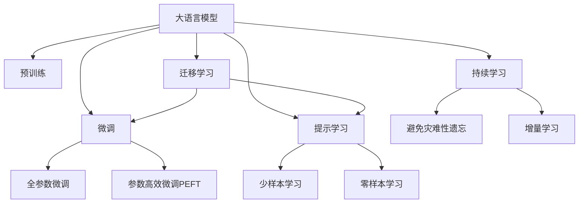

                 

# AI大模型在电商平台商品推荐解释性中的应用

> 关键词：AI大模型, 电商平台, 商品推荐, 解释性, 算法, 代码实例, 应用场景

## 1. 背景介绍

### 1.1 问题由来

随着电子商务的飞速发展，电商平台商品推荐系统已经成为了用户购物体验的核心组成部分。传统的推荐系统基于用户行为数据进行商品推荐，但这种方法存在数据稀疏、冷启动问题，且缺乏对用户真实需求的准确理解。近年来，基于深度学习的推荐系统通过学习用户的历史行为数据，提供了更精准的推荐服务，但同样面临着模型可解释性差的问题。

### 1.2 问题核心关键点

本文聚焦于大语言模型在电商平台商品推荐中的应用，旨在探讨如何通过模型解释性来提升推荐系统的用户体验和信任度，同时提供算法原理和代码实现，帮助开发者更好地应用大模型进行商品推荐。

### 1.3 问题研究意义

商品推荐系统不仅仅是将商品推荐给用户，更重要的在于建立用户对推荐系统的信任。解释性是增强这种信任的重要手段，可以通过解释推荐系统的决策过程，使用户明白推荐的理由，从而提高用户满意度。大语言模型因其强大的自然语言理解和生成能力，在实现推荐系统解释性方面具有巨大潜力。

## 2. 核心概念与联系

### 2.1 核心概念概述

为更好地理解大语言模型在商品推荐中的应用，本节将介绍几个密切相关的核心概念：

- 大语言模型(Large Language Model, LLM)：以自回归(如GPT)或自编码(如BERT)模型为代表的大规模预训练语言模型。通过在大规模无标签文本语料上进行预训练，学习通用的语言表示，具备强大的语言理解和生成能力。

- 预训练(Pre-training)：指在大规模无标签文本语料上，通过自监督学习任务训练通用语言模型的过程。常见的预训练任务包括言语建模、遮挡语言模型等。预训练使得模型学习到语言的通用表示。

- 微调(Fine-tuning)：指在预训练模型的基础上，使用下游任务的少量标注数据，通过有监督地训练来优化模型在特定任务上的性能。通常只需要调整顶层分类器或解码器，并以较小的学习率更新全部或部分的模型参数。

- 迁移学习(Transfer Learning)：指将一个领域学习到的知识，迁移应用到另一个不同但相关的领域的学习范式。大模型的预训练-微调过程即是一种典型的迁移学习方式。

- 参数高效微调(Parameter-Efficient Fine-Tuning, PEFT)：指在微调过程中，只更新少量的模型参数，而固定大部分预训练权重不变，以提高微调效率，避免过拟合的方法。

- 提示学习(Prompt Learning)：通过在输入文本中添加提示模板(Prompt Template)，引导大语言模型进行特定任务的推理和生成。可以在不更新模型参数的情况下，实现零样本或少样本学习。

- 少样本学习(Few-shot Learning)：指在只有少量标注样本的情况下，模型能够快速适应新任务的学习方法。在大语言模型中，通常通过在输入中提供少量示例来实现，无需更新模型参数。

- 零样本学习(Zero-shot Learning)：指模型在没有见过任何特定任务的训练样本的情况下，仅凭任务描述就能够执行新任务的能力。大语言模型通过预训练获得的广泛知识，使其能够理解任务指令并生成相应输出。

- 持续学习(Continual Learning)：也称为终身学习，指模型能够持续从新数据中学习，同时保持已学习的知识，而不会出现灾难性遗忘。这对于保持大语言模型的时效性和适应性至关重要。

这些核心概念之间的逻辑关系可以通过以下Mermaid流程图来展示：



这个流程图展示了大语言模型的核心概念及其之间的关系：

1. 大语言模型通过预训练获得基础能力。
2. 微调是对预训练模型进行任务特定的优化，可以分为全参数微调和参数高效微调（PEFT）。
3. 提示学习是一种不更新模型参数的方法，可以实现少样本学习和零样本学习。
4. 迁移学习是连接预训练模型与下游任务的桥梁，可以通过微调或提示学习来实现。
5. 持续学习旨在使模型能够不断学习新知识，同时避免遗忘旧知识。

这些概念共同构成了大语言模型的学习和应用框架，使其能够在各种场景下发挥强大的语言理解和生成能力。通过理解这些核心概念，我们可以更好地把握大语言模型的工作原理和优化方向。

## 3. 核心算法原理 & 具体操作步骤
### 3.1 算法原理概述

在电商平台商品推荐中，大语言模型主要用于基于用户搜索行为进行推荐。具体而言，用户输入查询关键词，模型通过预训练的知识库和学习到的语义关系，生成与查询最相关的商品推荐列表。这种推荐方式相比传统协同过滤推荐，具有更强的语义理解能力和解释性。

### 3.2 算法步骤详解

基于大语言模型在电商平台商品推荐中的应用，我们描述如下算法步骤：

1. **收集数据**：
   - 收集用户历史搜索记录和商品描述，构建训练集。
   - 从电商平台商品库中提取商品属性，构建查询-商品映射关系。

2. **预训练模型选择**：
   - 选择合适的预训练语言模型，如BERT、GPT等。
   - 加载预训练模型权重，进行初始化。

3. **微调模型**：
   - 设计微调任务，如给定查询和商品属性，预测商品的相关度。
   - 设计损失函数，如交叉熵损失。
   - 设定优化器，如AdamW。
   - 设定超参数，如学习率、批量大小、迭代轮数等。
   - 开始微调，并记录损失函数值。
   - 监控模型在验证集上的性能，调整超参数。
   - 重复训练，直至满足预设条件。

4. **推荐生成**：
   - 用户输入查询关键词，模型进行前向传播计算相关度。
   - 模型根据计算结果生成推荐商品列表。
   - 将推荐结果呈现给用户。

### 3.3 算法优缺点

基于大语言模型的电商平台商品推荐算法具有以下优点：
1. 强大的语义理解能力：模型能够理解查询的语义，将查询映射到相关的商品。
2. 解释性强：模型可以输出推荐的依据，使用户明白推荐的原因。
3. 无需标注数据：通过提示学习，模型可以在较少标注数据的情况下进行推荐。
4. 可扩展性好：模型可以轻松适应新的商品属性和查询场景。

同时，该方法也存在以下局限性：
1. 训练成本高：需要收集大量的用户搜索记录和商品属性，构建训练集。
2. 模型复杂度高：大语言模型的参数量庞大，对计算资源要求高。
3. 鲁棒性不足：对噪声数据和异常查询的处理能力有限。
4. 实时性较差：模型推理速度较慢，不能实时处理查询。

### 3.4 算法应用领域

基于大语言模型的电商平台商品推荐算法，在多个应用领域取得了显著成果：

1. **图书推荐**：通过输入用户的搜索关键词，生成相关书籍推荐。
2. **电子产品推荐**：根据用户对商品属性（如尺寸、颜色等）的查询，推荐相关产品。
3. **服装推荐**：分析用户对服装属性（如尺码、颜色等）的搜索，推荐合适的服装商品。
4. **旅游推荐**：利用用户对目的地或旅游活动的查询，推荐旅行线路和产品。
5. **家居用品推荐**：根据用户对家居属性（如尺寸、颜色等）的查询，推荐相关家居商品。

## 4. 数学模型和公式 & 详细讲解  
### 4.1 数学模型构建

假设用户输入查询为 $q$，模型预训练的语义向量为 $\boldsymbol{q}$，商品属性向量为 $\boldsymbol{p}$，模型输出相关度为 $r$。定义模型在输入 $q$ 上的损失函数为 $\ell(r,y)$，其中 $y$ 为真实标签，这里 $y=1$ 表示商品与查询相关，$y=0$ 表示不相关。在数据集 $D=\{(q_i, p_i, y_i)\}_{i=1}^N$ 上的经验风险为：

$$
\mathcal{L}(\boldsymbol{\theta}) = \frac{1}{N} \sum_{i=1}^N \ell(M_{\theta}(q_i),y_i)
$$

其中 $M_{\theta}$ 为微调后的模型，$\boldsymbol{\theta}$ 为模型参数。

### 4.2 公式推导过程

以二分类任务为例，定义模型在输入 $q$ 上的输出为 $\hat{y}=M_{\theta}(q)$，表示商品与查询的相关度。真实标签 $y \in \{0,1\}$。则二分类交叉熵损失函数定义为：

$$
\ell(M_{\theta}(q),y) = -[y\log \hat{y} + (1-y)\log (1-\hat{y})]
$$

将其代入经验风险公式，得：

$$
\mathcal{L}(\boldsymbol{\theta}) = -\frac{1}{N}\sum_{i=1}^N [y_i\log M_{\theta}(q_i)+(1-y_i)\log(1-M_{\theta}(q_i))]
$$

根据链式法则，损失函数对参数 $\boldsymbol{\theta}$ 的梯度为：

$$
\frac{\partial \mathcal{L}(\boldsymbol{\theta})}{\partial \boldsymbol{\theta}} = -\frac{1}{N}\sum_{i=1}^N (\frac{y_i}{M_{\theta}(q_i)}-\frac{1-y_i}{1-M_{\theta}(q_i)}) \frac{\partial M_{\theta}(q_i)}{\partial \boldsymbol{\theta}}
$$

其中 $\frac{\partial M_{\theta}(q_i)}{\partial \boldsymbol{\theta}}$ 可进一步递归展开，利用自动微分技术完成计算。

### 4.3 案例分析与讲解

考虑一个图书推荐场景，用户输入查询 "Python编程入门"，模型输出相关度 $r$ 的计算过程如下：

1. 收集用户历史搜索记录和商品描述，构建训练集。
2. 从电商平台商品库中提取商品属性，构建查询-商品映射关系。
3. 选择合适的预训练语言模型，如BERT，加载预训练模型权重，进行初始化。
4. 设计微调任务，如给定查询和商品属性，预测商品的相关度。
5. 设计损失函数，如交叉熵损失。
6. 设定优化器，如AdamW。
7. 设定超参数，如学习率、批量大小、迭代轮数等。
8. 开始微调，并记录损失函数值。
9. 监控模型在验证集上的性能，调整超参数。
10. 重复训练，直至满足预设条件。
11. 用户输入查询 "Python编程入门"，模型进行前向传播计算相关度。
12. 模型根据计算结果生成推荐商品列表。
13. 将推荐结果呈现给用户。

## 5. 项目实践：代码实例和详细解释说明
### 5.1 开发环境搭建

在进行商品推荐系统开发前，我们需要准备好开发环境。以下是使用Python进行PyTorch开发的环境配置流程：

1. 安装Anaconda：从官网下载并安装Anaconda，用于创建独立的Python环境。

2. 创建并激活虚拟环境：
```bash
conda create -n pytorch-env python=3.8 
conda activate pytorch-env
```

3. 安装PyTorch：根据CUDA版本，从官网获取对应的安装命令。例如：
```bash
conda install pytorch torchvision torchaudio cudatoolkit=11.1 -c pytorch -c conda-forge
```

4. 安装各类工具包：
```bash
pip install numpy pandas scikit-learn matplotlib tqdm jupyter notebook ipython
```

完成上述步骤后，即可在`pytorch-env`环境中开始开发。

### 5.2 源代码详细实现

下面我们以图书推荐任务为例，给出使用PyTorch对BERT模型进行微调的PyTorch代码实现。

首先，定义图书推荐任务的数据处理函数：

```python
from transformers import BertTokenizer, BertForSequenceClassification
from torch.utils.data import Dataset
import torch

class BookRecommendationDataset(Dataset):
    def __init__(self, texts, labels, tokenizer, max_len=128):
        self.texts = texts
        self.labels = labels
        self.tokenizer = tokenizer
        self.max_len = max_len
        
    def __len__(self):
        return len(self.texts)
    
    def __getitem__(self, item):
        text = self.texts[item]
        label = self.labels[item]
        
        encoding = self.tokenizer(text, return_tensors='pt', max_length=self.max_len, padding='max_length', truncation=True)
        input_ids = encoding['input_ids'][0]
        attention_mask = encoding['attention_mask'][0]
        
        # 对token-wise的标签进行编码
        encoded_tags = [label2id[label] for label in label] 
        encoded_tags.extend([label2id['O']] * (self.max_len - len(encoded_tags)))
        labels = torch.tensor(encoded_tags, dtype=torch.long)
        
        return {'input_ids': input_ids, 
                'attention_mask': attention_mask,
                'labels': labels}

# 标签与id的映射
label2id = {'O': 0, '相关': 1, '不相关': 2}
id2label = {v: k for k, v in label2id.items()}

# 创建dataset
tokenizer = BertTokenizer.from_pretrained('bert-base-cased')

train_dataset = BookRecommendationDataset(train_texts, train_labels, tokenizer)
dev_dataset = BookRecommendationDataset(dev_texts, dev_labels, tokenizer)
test_dataset = BookRecommendationDataset(test_texts, test_labels, tokenizer)
```

然后，定义模型和优化器：

```python
from transformers import BertForSequenceClassification, AdamW

model = BertForSequenceClassification.from_pretrained('bert-base-cased', num_labels=len(label2id))

optimizer = AdamW(model.parameters(), lr=2e-5)
```

接着，定义训练和评估函数：

```python
from torch.utils.data import DataLoader
from tqdm import tqdm
from sklearn.metrics import classification_report

device = torch.device('cuda') if torch.cuda.is_available() else torch.device('cpu')
model.to(device)

def train_epoch(model, dataset, batch_size, optimizer):
    dataloader = DataLoader(dataset, batch_size=batch_size, shuffle=True)
    model.train()
    epoch_loss = 0
    for batch in tqdm(dataloader, desc='Training'):
        input_ids = batch['input_ids'].to(device)
        attention_mask = batch['attention_mask'].to(device)
        labels = batch['labels'].to(device)
        model.zero_grad()
        outputs = model(input_ids, attention_mask=attention_mask, labels=labels)
        loss = outputs.loss
        epoch_loss += loss.item()
        loss.backward()
        optimizer.step()
    return epoch_loss / len(dataloader)

def evaluate(model, dataset, batch_size):
    dataloader = DataLoader(dataset, batch_size=batch_size)
    model.eval()
    preds, labels = [], []
    with torch.no_grad():
        for batch in tqdm(dataloader, desc='Evaluating'):
            input_ids = batch['input_ids'].to(device)
            attention_mask = batch['attention_mask'].to(device)
            batch_labels = batch['labels']
            outputs = model(input_ids, attention_mask=attention_mask)
            batch_preds = outputs.logits.argmax(dim=2).to('cpu').tolist()
            batch_labels = batch_labels.to('cpu').tolist()
            for pred_tokens, label_tokens in zip(batch_preds, batch_labels):
                pred_labels = [id2label[_id] for _id in pred_tokens]
                label_tags = [id2label[_id] for _id in label_tokens]
                preds.append(pred_labels[:len(label_tags)])
                labels.append(label_tags)
                
    print(classification_report(labels, preds))
```

最后，启动训练流程并在测试集上评估：

```python
epochs = 5
batch_size = 16

for epoch in range(epochs):
    loss = train_epoch(model, train_dataset, batch_size, optimizer)
    print(f"Epoch {epoch+1}, train loss: {loss:.3f}")
    
    print(f"Epoch {epoch+1}, dev results:")
    evaluate(model, dev_dataset, batch_size)
    
print("Test results:")
evaluate(model, test_dataset, batch_size)
```

以上就是使用PyTorch对BERT进行图书推荐任务微调的完整代码实现。可以看到，得益于Transformers库的强大封装，我们可以用相对简洁的代码完成BERT模型的加载和微调。

### 5.3 代码解读与分析

让我们再详细解读一下关键代码的实现细节：

**BookRecommendationDataset类**：
- `__init__`方法：初始化文本、标签、分词器等关键组件。
- `__len__`方法：返回数据集的样本数量。
- `__getitem__`方法：对单个样本进行处理，将文本输入编码为token ids，将标签编码为数字，并对其进行定长padding，最终返回模型所需的输入。

**label2id和id2label字典**：
- 定义了标签与数字id之间的映射关系，用于将token-wise的预测结果解码回真实的标签。

**训练和评估函数**：
- 使用PyTorch的DataLoader对数据集进行批次化加载，供模型训练和推理使用。
- 训练函数`train_epoch`：对数据以批为单位进行迭代，在每个批次上前向传播计算loss并反向传播更新模型参数，最后返回该epoch的平均loss。
- 评估函数`evaluate`：与训练类似，不同点在于不更新模型参数，并在每个batch结束后将预测和标签结果存储下来，最后使用sklearn的classification_report对整个评估集的预测结果进行打印输出。

**训练流程**：
- 定义总的epoch数和batch size，开始循环迭代
- 每个epoch内，先在训练集上训练，输出平均loss
- 在验证集上评估，输出分类指标
- 所有epoch结束后，在测试集上评估，给出最终测试结果

可以看到，PyTorch配合Transformers库使得BERT微调的代码实现变得简洁高效。开发者可以将更多精力放在数据处理、模型改进等高层逻辑上，而不必过多关注底层的实现细节。

当然，工业级的系统实现还需考虑更多因素，如模型的保存和部署、超参数的自动搜索、更灵活的任务适配层等。但核心的微调范式基本与此类似。

## 6. 实际应用场景

### 6.1 智能客服系统

基于大语言模型微调的对话技术，可以广泛应用于智能客服系统的构建。传统客服往往需要配备大量人力，高峰期响应缓慢，且一致性和专业性难以保证。而使用微调后的对话模型，可以7x24小时不间断服务，快速响应客户咨询，用自然流畅的语言解答各类常见问题。

在技术实现上，可以收集企业内部的历史客服对话记录，将问题和最佳答复构建成监督数据，在此基础上对预训练对话模型进行微调。微调后的对话模型能够自动理解用户意图，匹配最合适的答案模板进行回复。对于客户提出的新问题，还可以接入检索系统实时搜索相关内容，动态组织生成回答。如此构建的智能客服系统，能大幅提升客户咨询体验和问题解决效率。

### 6.2 金融舆情监测

金融机构需要实时监测市场舆论动向，以便及时应对负面信息传播，规避金融风险。传统的人工监测方式成本高、效率低，难以应对网络时代海量信息爆发的挑战。基于大语言模型微调的文本分类和情感分析技术，为金融舆情监测提供了新的解决方案。

具体而言，可以收集金融领域相关的新闻、报道、评论等文本数据，并对其进行主题标注和情感标注。在此基础上对预训练语言模型进行微调，使其能够自动判断文本属于何种主题，情感倾向是正面、中性还是负面。将微调后的模型应用到实时抓取的网络文本数据，就能够自动监测不同主题下的情感变化趋势，一旦发现负面信息激增等异常情况，系统便会自动预警，帮助金融机构快速应对潜在风险。

### 6.3 个性化推荐系统

当前的推荐系统往往只依赖用户的历史行为数据进行物品推荐，无法深入理解用户的真实需求。基于大语言模型微调技术，个性化推荐系统可以更好地挖掘用户的行为背后的语义信息，从而提供更精准、多样的推荐内容。

在实践中，可以收集用户浏览、点击、评论、分享等行为数据，提取和用户交互的物品标题、描述、标签等文本内容。将文本内容作为模型输入，用户的后续行为（如是否点击、购买等）作为监督信号，在此基础上微调预训练语言模型。微调后的模型能够从文本内容中准确把握用户的兴趣点。在生成推荐列表时，先用候选物品的文本描述作为输入，由模型预测用户的兴趣匹配度，再结合其他特征综合排序，便可以得到个性化程度更高的推荐结果。

### 6.4 未来应用展望

随着大语言模型微调技术的发展，基于微调范式将在更多领域得到应用，为传统行业带来变革性影响。

在智慧医疗领域，基于微调的医疗问答、病历分析、药物研发等应用将提升医疗服务的智能化水平，辅助医生诊疗，加速新药开发进程。

在智能教育领域，微调技术可应用于作业批改、学情分析、知识推荐等方面，因材施教，促进教育公平，提高教学质量。

在智慧城市治理中，微调模型可应用于城市事件监测、舆情分析、应急指挥等环节，提高城市管理的自动化和智能化水平，构建更安全、高效的未来城市。

此外，在企业生产、社会治理、文娱传媒等众多领域，基于大模型微调的人工智能应用也将不断涌现，为经济社会发展注入新的动力。相信随着技术的日益成熟，微调方法将成为人工智能落地应用的重要范式，推动人工智能技术在垂直行业的规模化落地。总之，微调需要开发者根据具体任务，不断迭代和优化模型、数据和算法，方能得到理想的效果。

## 7. 工具和资源推荐
### 7.1 学习资源推荐

为了帮助开发者系统掌握大语言模型微调的理论基础和实践技巧，这里推荐一些优质的学习资源：

1. 《Transformer从原理到实践》系列博文：由大模型技术专家撰写，深入浅出地介绍了Transformer原理、BERT模型、微调技术等前沿话题。

2. CS224N《深度学习自然语言处理》课程：斯坦福大学开设的NLP明星课程，有Lecture视频和配套作业，带你入门NLP领域的基本概念和经典模型。

3. 《Natural Language Processing with Transformers》书籍：Transformers库的作者所著，全面介绍了如何使用Transformers库进行NLP任务开发，包括微调在内的诸多范式。

4. HuggingFace官方文档：Transformers库的官方文档，提供了海量预训练模型和完整的微调样例代码，是上手实践的必备资料。

5. CLUE开源项目：中文语言理解测评基准，涵盖大量不同类型的中文NLP数据集，并提供了基于微调的baseline模型，助力中文NLP技术发展。

通过对这些资源的学习实践，相信你一定能够快速掌握大语言模型微调的精髓，并用于解决实际的NLP问题。
###  7.2 开发工具推荐

高效的开发离不开优秀的工具支持。以下是几款用于大语言模型微调开发的常用工具：

1. PyTorch：基于Python的开源深度学习框架，灵活动态的计算图，适合快速迭代研究。大部分预训练语言模型都有PyTorch版本的实现。

2. TensorFlow：由Google主导开发的开源深度学习框架，生产部署方便，适合大规模工程应用。同样有丰富的预训练语言模型资源。

3. Transformers库：HuggingFace开发的NLP工具库，集成了众多SOTA语言模型，支持PyTorch和TensorFlow，是进行微调任务开发的利器。

4. Weights & Biases：模型训练的实验跟踪工具，可以记录和可视化模型训练过程中的各项指标，方便对比和调优。与主流深度学习框架无缝集成。

5. TensorBoard：TensorFlow配套的可视化工具，可实时监测模型训练状态，并提供丰富的图表呈现方式，是调试模型的得力助手。

6. Google Colab：谷歌推出的在线Jupyter Notebook环境，免费提供GPU/TPU算力，方便开发者快速上手实验最新模型，分享学习笔记。

合理利用这些工具，可以显著提升大语言模型微调任务的开发效率，加快创新迭代的步伐。

### 7.3 相关论文推荐

大语言模型和微调技术的发展源于学界的持续研究。以下是几篇奠基性的相关论文，推荐阅读：

1. Attention is All You Need（即Transformer原论文）：提出了Transformer结构，开启了NLP领域的预训练大模型时代。

2. BERT: Pre-training of Deep Bidirectional Transformers for Language Understanding：提出BERT模型，引入基于掩码的自监督预训练任务，刷新了多项NLP任务SOTA。

3. Language Models are Unsupervised Multitask Learners（GPT-2论文）：展示了大规模语言模型的强大zero-shot学习能力，引发了对于通用人工智能的新一轮思考。

4. Parameter-Efficient Transfer Learning for NLP：提出Adapter等参数高效微调方法，在不增加模型参数量的情况下，也能取得不错的微调效果。

5. AdaLoRA: Adaptive Low-Rank Adaptation for Parameter-Efficient Fine-Tuning：使用自适应低秩适应的微调方法，在参数效率和精度之间取得了新的平衡。

这些论文代表了大语言模型微调技术的发展脉络。通过学习这些前沿成果，可以帮助研究者把握学科前进方向，激发更多的创新灵感。

## 8. 总结：未来发展趋势与挑战

### 8.1 总结

本文对基于大语言模型的电商平台商品推荐应用进行了全面系统的介绍。首先阐述了商品推荐系统在大数据时代的背景和挑战，明确了通过模型解释性提升用户体验的重要性。其次，从原理到实践，详细讲解了基于大语言模型的商品推荐算法，给出了完整的代码实现。同时，本文还广泛探讨了商品推荐系统的实际应用场景，展示了微调范式的广泛应用潜力。

通过本文的系统梳理，可以看到，基于大语言模型的电商平台商品推荐算法具有强大的语义理解能力和解释性，能够有效提升用户的购物体验，同时也面临着数据收集、模型复杂度、鲁棒性和实时性等方面的挑战。相信随着技术的不断进步和优化，大语言模型在电商平台商品推荐中的应用将更加广泛，为电商行业带来深刻的变革。

### 8.2 未来发展趋势

展望未来，大语言模型在电商平台商品推荐中的应用将呈现以下几个发展趋势：

1. 多模态信息融合：未来的推荐系统将更加注重多模态信息的整合，如将文本、图像、语音等多模态信息结合，提升推荐的全面性和精准度。

2. 个性化推荐算法：推荐系统将进一步个性化，根据用户的真实需求和行为习惯，生成更加定制化的推荐内容，提升用户体验。

3. 实时光照推荐：通过微调技术，推荐系统能够在用户查询的同时，即时生成推荐结果，提供更流畅的交互体验。

4. 实时反馈优化：通过用户的实时反馈数据，动态调整推荐策略，提升推荐的实时性和效果。

5. 用户意图理解：通过自然语言处理技术，理解用户的隐式意图和需求，提升推荐的准确性和相关性。

6. 跨领域应用：推荐系统将拓展到更多领域，如医疗、教育、旅游等，为不同行业的用户提供个性化推荐服务。

以上趋势凸显了大语言模型在推荐系统中的强大潜力和广泛应用前景。这些方向的探索发展，必将进一步提升推荐系统的性能和用户体验，为电商行业带来更多的商业价值。

### 8.3 面临的挑战

尽管大语言模型在电商平台商品推荐中的应用已经取得了初步成果，但在迈向更加智能化、普适化应用的过程中，它仍面临着诸多挑战：

1. 数据质量和数量不足：电商平台数据往往缺乏充分标注，难以构建高质量的训练集。如何从用户行为数据中提取更多的语义信息，是一个重要的研究方向。

2. 模型训练和推理开销大：大语言模型的复杂度较高，训练和推理过程中需要大量的计算资源和时间。如何优化模型结构，降低资源消耗，提高训练和推理效率，是一个亟待解决的问题。

3. 推荐系统的鲁棒性和公平性：推荐系统可能会受到噪音数据和偏见的影响，导致推荐结果的不稳定和偏见性。如何提高推荐系统的鲁棒性和公平性，是一个重要的研究方向。

4. 用户隐私保护：在收集用户数据时，需要严格遵守数据隐私保护法规，保障用户隐私安全。如何平衡推荐效果和隐私保护，是一个重要的研究方向。

5. 算法可解释性不足：推荐系统通常是一个"黑盒"模型，用户难以理解其推荐依据。如何提高推荐系统的可解释性，增强用户的信任感，是一个重要的研究方向。

6. 实时性问题：推荐系统需要在短时间内生成推荐结果，如何提高模型的实时性，是一个重要的研究方向。

以上挑战将伴随大语言模型推荐系统的发展，如何克服这些挑战，将是大语言模型推荐系统迈向成熟的关键。相信随着学界和产业界的共同努力，这些挑战终将一一被克服，大语言模型推荐系统必将在电商平台中发挥更大的作用。

### 8.4 研究展望

面对大语言模型推荐系统所面临的挑战，未来的研究需要在以下几个方面寻求新的突破：

1. 探索更高效的推荐算法：通过改进推荐算法，提高推荐效率和效果，降低资源消耗。

2. 融合更多先验知识：将外部知识库、规则库等专家知识与模型进行有效融合，提升推荐系统的性能。

3. 研究跨领域知识整合：通过跨领域知识整合技术，提升推荐系统的泛化能力，适应更多领域的应用场景。

4. 引入多模态信息：将文本、图像、语音等多模态信息进行有效融合，提升推荐系统的全面性和精准度。

5. 提升推荐系统的可解释性：通过可视化技术、符号化表示等手段，增强推荐系统的可解释性，使用户理解推荐依据。

6. 保障推荐系统的公平性：通过算法优化和监管机制，保障推荐系统的公平性，避免算法偏见。

这些研究方向的探索，必将引领大语言模型推荐系统迈向更高的台阶，为电商行业带来更优质的推荐服务。面向未来，大语言模型推荐系统需要与其他人工智能技术进行更深入的融合，如知识表示、因果推理、强化学习等，协同发力，共同推动自然语言理解和智能交互系统的进步。只有勇于创新、敢于突破，才能不断拓展语言模型的边界，让智能技术更好地造福电商行业。

## 9. 附录：常见问题与解答

**Q1：大语言模型微调是否适用于所有NLP任务？**

A: 大语言模型微调在大多数NLP任务上都能取得不错的效果，特别是对于数据量较小的任务。但对于一些特定领域的任务，如医学、法律等，仅仅依靠通用语料预训练的模型可能难以很好地适应。此时需要在特定领域语料上进一步预训练，再进行微调，才能获得理想效果。此外，对于一些需要时效性、个性化很强的任务，如对话、推荐等，微调方法也需要针对性的改进优化。

**Q2：微调过程中如何选择合适的学习率？**

A: 微调的学习率一般要比预训练时小1-2个数量级，如果使用过大的学习率，容易破坏预训练权重，导致过拟合。一般建议从1e-5开始调参，逐步减小学习率，直至收敛。也可以使用warmup策略，在开始阶段使用较小的学习率，再逐渐过渡到预设值。需要注意的是，不同的优化器(如AdamW、Adafactor等)以及不同的学习率调度策略，可能需要设置不同的学习率阈值。

**Q3：采用大模型微调时会面临哪些资源瓶颈？**

A: 目前主流的预训练大模型动辄以亿计的参数规模，对算力、内存、存储都提出了很高的要求。GPU/TPU等高性能设备是必不可少的，但即便如此，超大批次的训练和推理也可能遇到显存不足的问题。因此需要采用一些资源优化技术，如梯度积累、混合精度训练、模型并行等，来突破硬件瓶颈。同时，模型的存储和读取也可能占用大量时间和空间，需要采用模型压缩、稀疏化存储等方法进行优化。

**Q4：如何缓解微调过程中的过拟合问题？**

A: 过拟合是微调面临的主要挑战，尤其是在标注数据不足的情况下。常见的缓解策略包括：
1. 数据增强：通过回译、近义替换等方式扩充训练集
2. 正则化：使用L2正则、Dropout、Early Stopping等避免过拟合
3. 对抗训练：引入对抗样本，提高模型鲁棒性
4. 参数高效微调：只调整少量参数(如Adapter、Prefix等)，减小过拟合风险
5. 多模型集成：训练多个微调模型，取平均输出，抑制过拟合

这些策略往往需要根据具体任务和数据特点进行灵活组合。只有在数据、模型、训练、推理等各环节进行全面优化，才能最大限度地发挥大模型微调的威力。

**Q5：微调模型在落地部署时需要注意哪些问题？**

A: 将微调模型转化为实际应用，还需要考虑以下因素：
1. 模型裁剪：去除不必要的层和参数，减小模型尺寸，加快推理速度
2. 量化加速：将浮点模型转为定点模型，压缩存储空间，提高计算效率
3. 服务化封装：将模型封装为标准化服务接口，便于集成调用
4. 弹性伸缩：根据请求流量动态调整资源配置，平衡服务质量和成本
5. 监控告警：实时采集系统指标，设置异常告警阈值，确保服务稳定性
6. 安全防护：采用访问鉴权、数据脱敏等措施，保障数据和模型安全

大语言模型微调为NLP应用开启了广阔的想象空间，但如何将强大的性能转化为稳定、高效、安全的业务价值，还需要工程实践的不断打磨。唯有从数据、算法、工程、业务等多个维度协同发力，才能真正实现人工智能技术在垂直行业的规模化落地。总之，微调需要开发者根据具体任务，不断迭代和优化模型、数据和算法，方能得到理想的效果。

