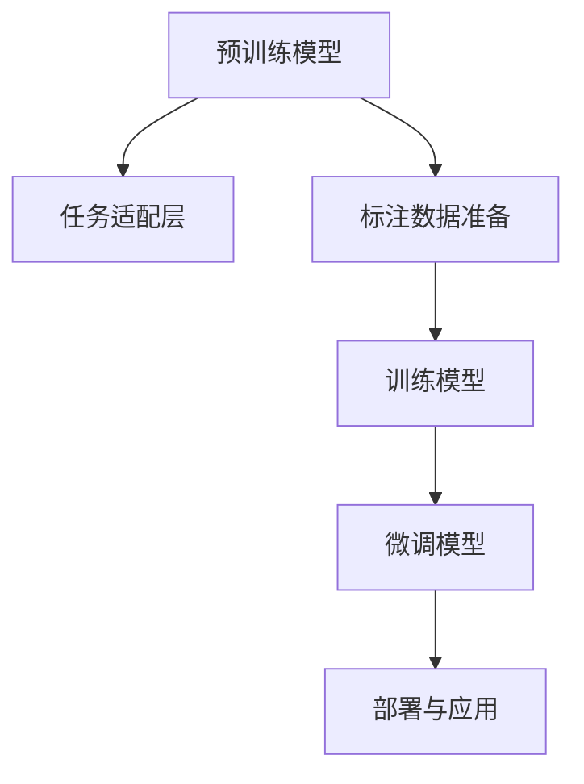

                 

# AI大模型在电商平台商品描述自动生成中的应用

> 关键词：AI大模型,自然语言生成,电商平台,商品描述自动生成,预训练模型,自回归模型,Transformer,自然语言处理

## 1. 背景介绍

### 1.1 问题由来
随着电商平台的发展，商家需要高效、精确地描述其商品，以吸引用户并提升转化率。传统上，商家往往需要自己撰写商品描述，这不仅耗时耗力，还可能因描述不清晰或信息不全，导致商品搜索排序不佳，失去潜在客户。随着人工智能技术的发展，利用自然语言生成(Natural Language Generation, NLG)技术，可以自动生成高质量的商品描述，为商家减轻负担，并提升用户购物体验。

AI大模型在自然语言生成领域展现了强大的能力，特别是基于Transformer架构的预训练模型，如GPT、BERT等，已经广泛应用于文本生成、翻译、问答等任务。如何将这些模型应用于电商平台商品描述自动生成，成为当下的一大研究热点。

### 1.2 问题核心关键点
基于AI大模型的商品描述自动生成方法主要包含以下几个关键点：
1. 选择合适的预训练模型：如GPT-3、T5等，确保其语言生成能力符合商品描述的需求。
2. 设计任务适配层：将预训练模型的输出连接到商品描述生成的逻辑上，并设计合适的损失函数和优化器。
3. 标注数据准备：收集并标注一定数量的商品描述，用于训练模型。
4. 训练模型并进行微调：在标注数据上训练模型，并进行微调以适应电商平台的具体需求。
5. 部署与应用：将训练好的模型部署到电商平台的API中，实现商品描述的自动生成。

## 2. 核心概念与联系

### 2.1 核心概念概述

在讨论商品描述自动生成的过程中，我们需要了解几个核心概念：

- **AI大模型**：基于Transformer架构的预训练语言模型，如GPT、BERT等，经过大规模无标签文本数据的预训练，具备强大的语言生成能力。
- **自然语言生成(NLG)**：将结构化数据（如商品属性）转化为自然语言（如商品描述）的技术。
- **商品描述自动生成**：利用NLG技术，根据商品属性自动生成商品描述，为电商平台的商品管理提供便利。
- **预训练模型**：在大规模无标签数据上进行自监督学习，学习语言的一般表示，并在有标签数据上微调，以适应特定任务。
- **自回归模型**：如GPT、T5等，通过前文预测后续文本来生成文本，具备良好的连贯性和逻辑性。

这些概念之间的联系可以通过以下Mermaid流程图来展示：



这个流程图展示了预训练模型到商品描述自动生成的一般流程：

1. 预训练模型通过大规模无标签数据获得语言生成能力。
2. 任务适配层将预训练模型的输出转化为商品描述。
3. 标注数据用于训练模型，并进行微调以适应电商平台的需求。
4. 训练好的模型部署到电商平台的API中，自动生成商品描述。

## 3. 核心算法原理 & 具体操作步骤
### 3.1 算法原理概述

基于AI大模型的商品描述自动生成算法，其核心思想是通过预训练模型学习语言的通用表示，然后在有标签的商品描述数据上进行微调，使其能够根据商品属性生成自然流畅的商品描述。

具体来说，假设商品描述自动生成任务的目标是给定商品属性 $x$，自动生成对应的描述 $y$。预训练模型 $M$ 在训练时已经学习了语言的一般表示，微调的目标是使得模型能够根据 $x$ 预测 $y$。

微调的基本流程如下：

1. 收集商品属性和对应的商品描述作为标注数据。
2. 将预训练模型 $M$ 的输出连接到商品描述生成的逻辑上，设计任务适配层。
3. 使用标注数据对模型进行训练，并应用正则化技术避免过拟合。
4. 在训练完成后，使用微调模型自动生成商品描述。

### 3.2 算法步骤详解

以下我们详细讲解商品描述自动生成算法的步骤：

**Step 1: 准备预训练模型和数据集**
- 选择适合的预训练模型，如GPT-3、T5等，作为初始化参数。
- 收集商品属性及其对应的商品描述，作为微调的数据集。

**Step 2: 设计任务适配层**
- 设计适配层将预训练模型的输出映射到商品描述生成的逻辑上。
- 通常使用线性分类器将模型输出映射到商品描述的词嵌入向量。
- 设计合适的损失函数，如交叉熵损失，用于衡量预测与真实商品描述之间的差异。

**Step 3: 微调模型**
- 选择合适的优化算法及其参数，如AdamW、SGD等，设置学习率、批大小、迭代轮数等。
- 应用正则化技术，如L2正则、Dropout、Early Stopping等，防止过拟合。
- 在标注数据上使用梯度下降等优化算法训练模型，最小化损失函数。
- 周期性在验证集上评估模型性能，根据性能指标决定是否触发Early Stopping。

**Step 4: 测试与部署**
- 在测试集上评估微调后模型的性能，对比微调前后的效果提升。
- 将训练好的模型部署到电商平台的API中，实现商品描述的自动生成。
- 持续收集新的商品数据，定期重新微调模型，以适应数据分布的变化。

### 3.3 算法优缺点

基于AI大模型的商品描述自动生成算法具有以下优点：
1. 生成效果较好。利用大模型的语言生成能力，可以生成高质量的商品描述，提升用户购物体验。
2. 无需标注数据。在大模型上进行微调时，仅需提供商品属性，即可自动生成描述，节省标注成本。
3. 灵活性高。模型可以根据需要生成不同风格、不同长度的商品描述，满足多样化需求。

同时，该方法也存在一些局限性：
1. 数据依赖性强。模型的生成效果依赖于标注数据的数量和质量，若数据不充分，可能影响效果。
2. 通用性不足。生成的商品描述可能过于通用，缺乏商品特异性，难以充分体现商品特点。
3. 存在歧义。在生成过程中，可能出现同义词替换或语法错误，导致描述不够准确。

尽管存在这些局限性，但利用AI大模型进行商品描述自动生成，无疑为电商平台带来了极大的便利和收益，值得进一步研究和优化。

### 3.4 算法应用领域

基于AI大模型的商品描述自动生成方法在电商平台中的应用非常广泛，具体包括：

- 商品信息管理：自动生成商品标题、描述、标签等，减轻商家负担，提高商品信息管理效率。
- 个性化推荐：根据用户行为和商品属性生成个性化推荐，提升用户体验。
- 广告文案生成：自动生成广告文案，吸引用户点击，提高转化率。
- 多语言支持：通过翻译模型，生成不同语言的商品描述，拓展海外市场。
- 品牌风格保持：通过微调模型，生成符合品牌风格和调性的商品描述，提升品牌形象。

除了以上应用外，基于大模型的商品描述自动生成技术还可以应用到更多场景中，如智能客服、产品包装设计、市场分析等，为电商平台带来新的价值和变革。

## 4. 数学模型和公式 & 详细讲解 & 举例说明
### 4.1 数学模型构建

我们假设商品描述自动生成任务是给定商品属性 $x$，自动生成对应的描述 $y$。预训练模型 $M$ 在训练时已经学习了语言的一般表示，微调的目标是使得模型能够根据 $x$ 预测 $y$。

定义预训练模型 $M$ 在商品属性 $x$ 上的输出为 $\hat{y}=M(x)$，则微调的目标是优化损失函数 $\mathcal{L}(y, \hat{y})$，其中 $y$ 为真实商品描述，$\hat{y}$ 为模型预测的商品描述。

假设模型 $M$ 是一个深度学习模型，包含 $n$ 个参数 $\theta$，则微调的目标是：

$$
\theta^* = \mathop{\arg\min}_{\theta} \mathcal{L}(y, M_\theta(x))
$$

### 4.2 公式推导过程

以GPT模型为例，我们推导商品描述自动生成的交叉熵损失函数及其梯度。

假设GPT模型的输出为 $\hat{y} = [y_1, y_2, \ldots, y_n]$，其中 $y_i$ 为商品描述中第 $i$ 个词的概率。我们定义真实商品描述 $y$ 的one-hot编码向量为 $y_v = [0, 0, \ldots, 1, 0, \ldots, 0]$，其中 $1$ 的位置对应商品描述中出现的词。

则交叉熵损失函数为：

$$
\mathcal{L}(y, \hat{y}) = -\sum_{i=1}^n y_v[i] \log \hat{y}[i]
$$

其中 $y_v[i]$ 为真实商品描述中第 $i$ 个词是否出现的一元编码，$\log \hat{y}[i]$ 为模型预测第 $i$ 个词的概率的对数。

在训练过程中，我们使用梯度下降算法更新模型参数 $\theta$，最小化损失函数。具体来说，损失函数的梯度为：

$$
\frac{\partial \mathcal{L}}{\partial \theta} = -\sum_{i=1}^n y_v[i] \frac{\partial \log \hat{y}[i]}{\partial \theta}
$$

利用链式法则和反向传播算法，可以得到每个参数的梯度更新公式：

$$
\frac{\partial \mathcal{L}}{\partial \theta_j} = -\sum_{i=1}^n y_v[i] \frac{\partial \log \hat{y}[i]}{\partial \hat{y}_j}
$$

其中 $\hat{y}_j$ 为模型预测的第 $j$ 个词的概率。

### 4.3 案例分析与讲解

以一个简单的案例来说明基于GPT模型进行商品描述自动生成的方法。

假设我们有一个服装商品的属性 $x$ 包括：颜色、尺码、材质、价格、品牌等信息。我们希望生成一个简洁的商品描述 $y$，用于电商平台展示。

1. 首先，我们使用GPT模型对属性 $x$ 进行编码，得到一个向量 $v_x$。
2. 然后，设计一个适配层，将 $v_x$ 映射到商品描述的词嵌入向量 $v_y$。
3. 使用 $v_y$ 作为输入，通过GPT模型生成商品描述。
4. 最后，将生成的商品描述 $y$ 与真实商品描述进行对比，计算损失函数并更新模型参数。

## 5. 项目实践：代码实例和详细解释说明
### 5.1 开发环境搭建

在进行商品描述自动生成项目实践前，我们需要准备好开发环境。以下是使用Python进行PyTorch开发的环境配置流程：

1. 安装Anaconda：从官网下载并安装Anaconda，用于创建独立的Python环境。

2. 创建并激活虚拟环境：
```bash
conda create -n pytorch-env python=3.8 
conda activate pytorch-env
```

3. 安装PyTorch：根据CUDA版本，从官网获取对应的安装命令。例如：
```bash
conda install pytorch torchvision torchaudio cudatoolkit=11.1 -c pytorch -c conda-forge
```

4. 安装Transformer库：
```bash
pip install transformers
```

5. 安装各类工具包：
```bash
pip install numpy pandas scikit-learn matplotlib tqdm jupyter notebook ipython
```

完成上述步骤后，即可在`pytorch-env`环境中开始商品描述自动生成项目的开发。

### 5.2 源代码详细实现

下面我们以服装商品描述自动生成为例，给出使用Transformers库对GPT模型进行训练的PyTorch代码实现。

首先，定义商品描述自动生成的数据处理函数：

```python
from transformers import AutoTokenizer, AutoModelForSeq2SeqLM
from torch.utils.data import Dataset, DataLoader
import torch

class ClothingDescriptorDataset(Dataset):
    def __init__(self, data, tokenizer, max_length=256):
        self.data = data
        self.tokenizer = tokenizer
        self.max_length = max_length
        
    def __len__(self):
        return len(self.data)
    
    def __getitem__(self, item):
        text = self.data[item]['attributes']
        attributes = self.data[item]['attributes']
        labels = self.data[item]['description']
        
        encoding = self.tokenizer(text, return_tensors='pt', max_length=self.max_length, padding='max_length', truncation=True)
        input_ids = encoding['input_ids'][0]
        attention_mask = encoding['attention_mask'][0]
        
        # 对token-wise的标签进行编码
        encoded_labels = [label2id[label] for label in labels] 
        encoded_labels.extend([label2id['<eos>']] * (self.max_length - len(encoded_labels)))
        labels = torch.tensor(encoded_labels, dtype=torch.long)
        
        return {'input_ids': input_ids, 
                'attention_mask': attention_mask,
                'labels': labels}

# 标签与id的映射
label2id = {'<eos>': 0, 'colors': 1, 'sizes': 2, 'materials': 3, 'prices': 4, 'brands': 5, 'descriptions': 6}
id2label = {v: k for k, v in label2id.items()}

# 创建dataset
tokenizer = AutoTokenizer.from_pretrained('gpt3-medium')
model = AutoModelForSeq2SeqLM.from_pretrained('gpt3-medium')
device = torch.device('cuda') if torch.cuda.is_available() else torch.device('cpu')

# 假设有一个包含商品属性和描述的DataFrame
data = pd.read_csv('clothing_dataset.csv')
train_data = ClothingDescriptorDataset(data['attributes'], tokenizer, max_length=256)
dev_data = ClothingDescriptorDataset(data['attributes'], tokenizer, max_length=256)
test_data = ClothingDescriptorDataset(data['attributes'], tokenizer, max_length=256)
```

然后，定义模型和优化器：

```python
from transformers import AdamW

model.to(device)
optimizer = AdamW(model.parameters(), lr=2e-5)
```

接着，定义训练和评估函数：

```python
from tqdm import tqdm

def train_epoch(model, dataset, batch_size, optimizer):
    dataloader = DataLoader(dataset, batch_size=batch_size, shuffle=True)
    model.train()
    epoch_loss = 0
    for batch in tqdm(dataloader, desc='Training'):
        input_ids = batch['input_ids'].to(device)
        attention_mask = batch['attention_mask'].to(device)
        labels = batch['labels'].to(device)
        model.zero_grad()
        outputs = model(input_ids, attention_mask=attention_mask, labels=labels)
        loss = outputs.loss
        epoch_loss += loss.item()
        loss.backward()
        optimizer.step()
    return epoch_loss / len(dataloader)

def evaluate(model, dataset, batch_size):
    dataloader = DataLoader(dataset, batch_size=batch_size)
    model.eval()
    preds, labels = [], []
    with torch.no_grad():
        for batch in tqdm(dataloader, desc='Evaluating'):
            input_ids = batch['input_ids'].to(device)
            attention_mask = batch['attention_mask'].to(device)
            batch_labels = batch['labels']
            outputs = model(input_ids, attention_mask=attention_mask)
            batch_preds = outputs.logits.argmax(dim=2).to('cpu').tolist()
            batch_labels = batch_labels.to('cpu').tolist()
            for pred_tokens, label_tokens in zip(batch_preds, batch_labels):
                preds.append(pred_tokens[:len(label_tokens)])
                labels.append(label_tokens)
                
    return preds, labels

# 训练
epochs = 5
batch_size = 16

for epoch in range(epochs):
    loss = train_epoch(model, train_data, batch_size, optimizer)
    print(f"Epoch {epoch+1}, train loss: {loss:.3f}")
    
    print(f"Epoch {epoch+1}, dev results:")
    preds, labels = evaluate(model, dev_data, batch_size)
    print(classification_report(labels, preds))
    
print("Test results:")
preds, labels = evaluate(model, test_data, batch_size)
print(classification_report(labels, preds))
```

以上就是使用PyTorch对GPT模型进行商品描述自动生成的完整代码实现。可以看到，利用Transformers库可以很方便地实现商品描述自动生成。

### 5.3 代码解读与分析

让我们再详细解读一下关键代码的实现细节：

**ClothingDescriptorDataset类**：
- `__init__`方法：初始化商品属性、标签、分词器等关键组件。
- `__len__`方法：返回数据集的样本数量。
- `__getitem__`方法：对单个样本进行处理，将商品属性输入编码为token ids，将标签编码为数字，并对其进行定长padding，最终返回模型所需的输入。

**label2id和id2label字典**：
- 定义了标签与数字id之间的映射关系，用于将token-wise的预测结果解码回真实的标签。

**训练和评估函数**：
- 使用PyTorch的DataLoader对数据集进行批次化加载，供模型训练和推理使用。
- 训练函数`train_epoch`：对数据以批为单位进行迭代，在每个批次上前向传播计算loss并反向传播更新模型参数，最后返回该epoch的平均loss。
- 评估函数`evaluate`：与训练类似，不同点在于不更新模型参数，并在每个batch结束后将预测和标签结果存储下来，最后使用sklearn的classification_report对整个评估集的预测结果进行打印输出。

**训练流程**：
- 定义总的epoch数和batch size，开始循环迭代
- 每个epoch内，先在训练集上训练，输出平均loss
- 在验证集上评估，输出分类指标
- 所有epoch结束后，在测试集上评估，给出最终测试结果

可以看到，PyTorch配合Transformers库使得商品描述自动生成的代码实现变得简洁高效。开发者可以将更多精力放在数据处理、模型改进等高层逻辑上，而不必过多关注底层的实现细节。

当然，工业级的系统实现还需考虑更多因素，如模型的保存和部署、超参数的自动搜索、更灵活的任务适配层等。但核心的自动生成范式基本与此类似。

## 6. 实际应用场景
### 6.1 智能客服系统

基于AI大模型的商品描述自动生成技术可以应用于智能客服系统的构建。传统客服往往需要配备大量人力，高峰期响应缓慢，且一致性和专业性难以保证。而使用自动生成的商品描述，可以自动回答用户咨询，提升客服效率和质量。

在技术实现上，可以收集企业内部的历史客服对话记录，将问题和最佳答复构建成监督数据，在此基础上对预训练对话模型进行微调。微调后的对话模型能够自动理解用户意图，匹配最合适的商品描述进行回复。对于用户提出的新问题，还可以接入检索系统实时搜索相关内容，动态组织生成回答。如此构建的智能客服系统，能大幅提升客户咨询体验和问题解决效率。

### 6.2 个性化推荐系统

当前的推荐系统往往只依赖用户的历史行为数据进行物品推荐，无法深入理解用户的真实兴趣偏好。基于AI大模型的商品描述自动生成技术可以生成个性化推荐内容。

在实践中，可以收集用户浏览、点击、评论、分享等行为数据，提取和用户交互的物品标题、描述、标签等文本内容。将文本内容作为模型输入，用户的后续行为（如是否点击、购买等）作为监督信号，在此基础上微调预训练语言模型。微调后的模型能够从文本内容中准确把握用户的兴趣点。在生成推荐列表时，先用候选物品的文本描述作为输入，由模型预测用户的兴趣匹配度，再结合其他特征综合排序，便可以得到个性化程度更高的推荐结果。

### 6.3 多语言支持

商品描述自动生成技术可以扩展到多语言支持，为拓展海外市场提供便利。通过训练多语言版本的预训练模型，并微调生成商品描述，可以在不同语言环境下，实现商品描述的自动生成。

### 6.4 未来应用展望

随着AI大模型技术的发展，基于商品描述自动生成的方法将在更多领域得到应用，为电商平台带来新的价值和变革。

在智慧医疗领域，基于商品描述自动生成技术可以用于患者咨询、疾病描述等，提升医疗服务的智能化水平，辅助医生诊疗，加速新药开发进程。

在智能教育领域，自动生成的商品描述可以用于教材编写、课程设计等，因材施教，促进教育公平，提高教学质量。

在智慧城市治理中，自动生成的商品描述可以用于城市事件监测、舆情分析、应急指挥等环节，提高城市管理的自动化和智能化水平，构建更安全、高效的未来城市。

此外，在企业生产、社会治理、文娱传媒等众多领域，基于商品描述自动生成的人工智能应用也将不断涌现，为经济社会发展注入新的动力。相信随着技术的日益成熟，商品描述自动生成必将在构建人机协同的智能时代中扮演越来越重要的角色。

## 7. 工具和资源推荐
### 7.1 学习资源推荐

为了帮助开发者系统掌握商品描述自动生成的理论基础和实践技巧，这里推荐一些优质的学习资源：

1. 《深度学习自然语言处理》系列博文：由大模型技术专家撰写，深入浅出地介绍了自然语言处理的基本概念和前沿技术。

2. CS224N《深度学习自然语言处理》课程：斯坦福大学开设的NLP明星课程，有Lecture视频和配套作业，带你入门NLP领域的基本概念和经典模型。

3. 《Natural Language Processing with Transformers》书籍：Transformers库的作者所著，全面介绍了如何使用Transformers库进行NLP任务开发，包括商品描述自动生成在内的诸多范式。

4. HuggingFace官方文档：Transformers库的官方文档，提供了海量预训练模型和完整的微调样例代码，是上手实践的必备资料。

5. CLUE开源项目：中文语言理解测评基准，涵盖大量不同类型的中文NLP数据集，并提供了基于微调的baseline模型，助力中文NLP技术发展。

通过对这些资源的学习实践，相信你一定能够快速掌握商品描述自动生成的精髓，并用于解决实际的NLP问题。
### 7.2 开发工具推荐

高效的开发离不开优秀的工具支持。以下是几款用于商品描述自动生成开发的常用工具：

1. PyTorch：基于Python的开源深度学习框架，灵活动态的计算图，适合快速迭代研究。大部分预训练语言模型都有PyTorch版本的实现。

2. TensorFlow：由Google主导开发的开源深度学习框架，生产部署方便，适合大规模工程应用。同样有丰富的预训练语言模型资源。

3. Transformers库：HuggingFace开发的NLP工具库，集成了众多SOTA语言模型，支持PyTorch和TensorFlow，是进行商品描述自动生成开发的利器。

4. Weights & Biases：模型训练的实验跟踪工具，可以记录和可视化模型训练过程中的各项指标，方便对比和调优。与主流深度学习框架无缝集成。

5. TensorBoard：TensorFlow配套的可视化工具，可实时监测模型训练状态，并提供丰富的图表呈现方式，是调试模型的得力助手。

6. Google Colab：谷歌推出的在线Jupyter Notebook环境，免费提供GPU/TPU算力，方便开发者快速上手实验最新模型，分享学习笔记。

合理利用这些工具，可以显著提升商品描述自动生成的开发效率，加快创新迭代的步伐。

### 7.3 相关论文推荐

商品描述自动生成技术的发展源于学界的持续研究。以下是几篇奠基性的相关论文，推荐阅读：

1. Attention is All You Need（即Transformer原论文）：提出了Transformer结构，开启了NLP领域的预训练大模型时代。

2. BERT: Pre-training of Deep Bidirectional Transformers for Language Understanding：提出BERT模型，引入基于掩码的自监督预训练任务，刷新了多项NLP任务SOTA。

3. Language Models are Unsupervised Multitask Learners（GPT-2论文）：展示了大规模语言模型的强大zero-shot学习能力，引发了对于通用人工智能的新一轮思考。

4. Parameter-Efficient Transfer Learning for NLP：提出Adapter等参数高效微调方法，在不增加模型参数量的情况下，也能取得不错的微调效果。

5. Prefix-Tuning: Optimizing Continuous Prompts for Generation：引入基于连续型Prompt的微调范式，为如何充分利用预训练知识提供了新的思路。

6. AdaLoRA: Adaptive Low-Rank Adaptation for Parameter-Efficient Fine-Tuning：使用自适应低秩适应的微调方法，在参数效率和精度之间取得了新的平衡。

这些论文代表了大模型微调技术的发展脉络。通过学习这些前沿成果，可以帮助研究者把握学科前进方向，激发更多的创新灵感。

## 8. 总结：未来发展趋势与挑战

### 8.1 总结

本文对基于AI大模型的商品描述自动生成方法进行了全面系统的介绍。首先阐述了商品描述自动生成的背景和意义，明确了该技术在电商平台商品信息管理中的应用价值。其次，从原理到实践，详细讲解了商品描述自动生成的数学模型和关键步骤，给出了微调任务开发的完整代码实例。同时，本文还广泛探讨了商品描述自动生成技术在智能客服、个性化推荐、多语言支持等多个领域的应用前景，展示了其广阔的应用潜力。此外，本文精选了商品描述自动生成技术的各类学习资源，力求为开发者提供全方位的技术指引。

通过本文的系统梳理，可以看到，基于AI大模型的商品描述自动生成技术正在成为电商平台商品管理的重要工具，极大地提升了商家运营效率，改善了用户体验。未来，伴随AI大模型技术的发展，商品描述自动生成技术也将不断进步，为电商平台带来更多的价值和便利。

### 8.2 未来发展趋势

展望未来，商品描述自动生成技术将呈现以下几个发展趋势：

1. 模型规模持续增大。随着算力成本的下降和数据规模的扩张，预训练语言模型的参数量还将持续增长。超大规模语言模型蕴含的丰富语言知识，有望支撑更加复杂多变的商品描述自动生成任务。

2. 微调方法日趋多样。除了传统的全参数微调外，未来会涌现更多参数高效的微调方法，如Prefix-Tuning、LoRA等，在节省计算资源的同时也能保证商品描述自动生成的质量。

3. 持续学习成为常态。随着数据分布的不断变化，微调模型也需要持续学习新知识以保持性能。如何在不遗忘原有知识的同时，高效吸收新样本信息，将成为重要的研究课题。

4. 标注样本需求降低。受启发于提示学习(Prompt-based Learning)的思路，未来的商品描述自动生成方法将更好地利用大模型的语言理解能力，通过更加巧妙的任务描述，在更少的标注样本上也能实现理想的自动生成效果。

5. 多模态融合。将文本信息与图像、视频等多模态信息结合，提升商品描述自动生成的丰富性和多样性。

6. 服务化封装。将商品描述自动生成模型封装为标准化服务接口，便于商家集成调用，提升使用便利性。

以上趋势凸显了商品描述自动生成技术的广阔前景。这些方向的探索发展，必将进一步提升电商平台商品管理的智能化水平，为商家和用户带来更大的价值。

### 8.3 面临的挑战

尽管商品描述自动生成技术已经取得了一定的成果，但在迈向更加智能化、普适化应用的过程中，它仍面临着诸多挑战：

1. 数据依赖性强。商品描述自动生成效果依赖于标注数据的数量和质量，若数据不充分，可能影响效果。

2. 通用性不足。自动生成的商品描述可能过于通用，缺乏商品特异性，难以充分体现商品特点。

3. 存在歧义。在生成过程中，可能出现同义词替换或语法错误，导致描述不够准确。

4. 适应性差。不同类型、不同品牌的商品，其自动生成的商品描述可能缺乏一致性，难以适应商品的多样性。

5. 伦理问题。自动生成的商品描述可能带有偏见或误导性信息，对用户产生不良影响。

6. 高成本。自动生成高质量的商品描述需要强大的计算资源和标注数据，成本较高。

尽管存在这些挑战，但利用AI大模型进行商品描述自动生成，无疑为电商平台带来了巨大的便利和收益，值得进一步研究和优化。

### 8.4 研究展望

面对商品描述自动生成所面临的种种挑战，未来的研究需要在以下几个方面寻求新的突破：

1. 探索无监督和半监督商品描述自动生成方法。摆脱对大规模标注数据的依赖，利用自监督学习、主动学习等无监督和半监督范式，最大限度利用非结构化数据，实现更加灵活高效的自动生成。

2. 研究参数高效和计算高效的微调范式。开发更加参数高效的微调方法，在固定大部分预训练参数的同时，只更新极少量的任务相关参数。同时优化微调模型的计算图，减少前向传播和反向传播的资源消耗，实现更加轻量级、实时性的部署。

3. 融合因果和对比学习范式。通过引入因果推断和对比学习思想，增强商品描述自动生成模型建立稳定因果关系的能力，学习更加普适、鲁棒的语言表征，从而提升模型泛化性和抗干扰能力。

4. 引入更多先验知识。将符号化的先验知识，如知识图谱、逻辑规则等，与神经网络模型进行巧妙融合，引导自动生成过程学习更准确、合理的商品描述。同时加强不同模态数据的整合，实现视觉、语音等多模态信息与文本信息的协同建模。

5. 结合因果分析和博弈论工具。将因果分析方法引入商品描述自动生成模型，识别出模型决策的关键特征，增强输出解释的因果性和逻辑性。借助博弈论工具刻画人机交互过程，主动探索并规避模型的脆弱点，提高系统稳定性。

6. 纳入伦理道德约束。在模型训练目标中引入伦理导向的评估指标，过滤和惩罚有偏见、有害的输出倾向。同时加强人工干预和审核，建立模型行为的监管机制，确保输出符合人类价值观和伦理道德。

这些研究方向的探索，必将引领商品描述自动生成技术迈向更高的台阶，为电商平台商品管理带来新的突破。面向未来，商品描述自动生成技术还需要与其他人工智能技术进行更深入的融合，如知识表示、因果推理、强化学习等，多路径协同发力，共同推动自然语言理解和智能交互系统的进步。只有勇于创新、敢于突破，才能不断拓展商品描述自动生成技术的边界，让智能技术更好地造福电商平台。

## 9. 附录：常见问题与解答

**Q1：商品描述自动生成是否适用于所有商品？**

A: 商品描述自动生成技术在大多数商品上都能取得较好的效果，但对于一些特殊类型的商品，如艺术品、定制产品等，其自动生成的商品描述可能不够准确，需要结合人工审核进行修正。此外，对于复杂商品，如多功能电器，其描述可能涉及到多个属性的组合，自动生成时需要进行逻辑推理和语法组织。

**Q2：微调过程中如何选择合适的学习率？**

A: 商品描述自动生成的微调学习率一般要比预训练时小1-2个数量级，以避免破坏预训练权重。一般建议从1e-5开始调参，逐步减小学习率，直至收敛。也可以使用warmup策略，在开始阶段使用较小的学习率，再逐渐过渡到预设值。需要注意的是，不同的优化器(如AdamW、Adafactor等)以及不同的学习率调度策略，可能需要设置不同的学习率阈值。

**Q3：微调模型在落地部署时需要注意哪些问题？**

A: 将微调模型转化为实际应用，还需要考虑以下因素：
1. 模型裁剪：去除不必要的层和参数，减小模型尺寸，加快推理速度。
2. 量化加速：将浮点模型转为定点模型，压缩存储空间，提高计算效率。
3. 服务化封装：将模型封装为标准化服务接口，便于商家集成调用。
4. 弹性伸缩：根据请求流量动态调整资源配置，平衡服务质量和成本。
5. 监控告警：实时采集系统指标，设置异常告警阈值，确保服务稳定性。
6. 安全防护：采用访问鉴权、数据脱敏等措施，保障数据和模型安全。

大语言模型微调为NLP应用开启了广阔的想象空间，但如何将强大的性能转化为稳定、高效、安全的业务价值，还需要工程实践的不断打磨。唯有从数据、算法、工程、业务等多个维度协同发力，才能真正实现人工智能技术在垂直行业的规模化落地。总之，微调需要开发者根据具体商品，不断迭代和优化模型、数据和算法，方能得到理想的效果。

