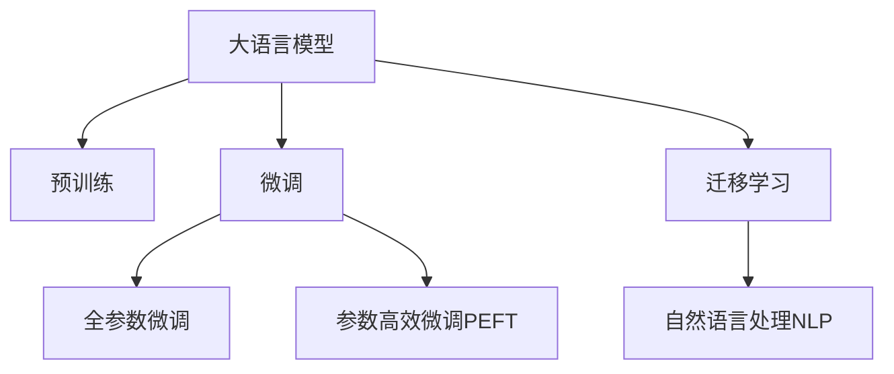

                 

# AI大模型在电商平台用户反馈分析中的应用

## 1. 背景介绍

随着电子商务的蓬勃发展，电商平台的用户反馈分析变得日益重要。通过深入分析用户评论、评分等反馈数据，电商平台可以及时发现产品质量和服务缺陷，优化产品和服务，提升用户体验，增强用户粘性。传统的反馈分析方法依赖于人工标注和规则匹配，存在成本高、效率低、主观性强等问题。而随着人工智能技术，特别是大模型和自然语言处理（NLP）技术的进步，电商平台可以借助AI大模型实现自动化、精准化的用户反馈分析。

### 1.1 问题由来

用户反馈分析的核心在于从用户生成的文本数据中提取有价值的信息，并将其转化为可操作的业务决策。传统的用户反馈分析方法依赖于人工标注，需要耗费大量人力和物力，且存在主观性强、精度低等问题。随着电商平台数据量的激增，传统方法已难以满足业务需求。

近年来，大语言模型如GPT、BERT等在自然语言处理领域取得了突破性进展，具备了强大的语言理解能力。利用这些模型，可以从海量用户反馈数据中自动抽取和归纳信息，为电商平台提供更精准、高效的用户反馈分析解决方案。

### 1.2 问题核心关键点

AI大模型在用户反馈分析中的应用，主要涉及以下几个关键点：

- **数据处理与清洗**：需要将原始用户评论、评分等反馈数据进行预处理和清洗，去除噪音和无关信息。
- **模型训练与微调**：需要在大规模标注数据上预训练大模型，并根据任务需求进行微调，使其能够自动抽取和归纳用户反馈信息。
- **结果分析和应用**：需要开发自动化的分析和应用系统，将模型输出的信息转化为可执行的业务策略和建议。

这些关键点共同构成了AI大模型在电商平台用户反馈分析中的应用框架。

## 2. 核心概念与联系

### 2.1 核心概念概述

为更好地理解AI大模型在用户反馈分析中的应用，本节将介绍几个关键概念：

- **大语言模型(Large Language Model, LLM)**：如GPT、BERT等，通过在海量文本数据上进行预训练，学习语言知识和常识，具备强大的语言理解和生成能力。
- **预训练(Pre-training)**：指在大规模无标签文本数据上，通过自监督学习任务训练通用语言模型的过程。常见的预训练任务包括掩码语言模型、自回归语言模型等。
- **微调(Fine-tuning)**：指在预训练模型的基础上，使用下游任务的少量标注数据，通过有监督地训练优化模型在该任务上的性能。
- **迁移学习(Transfer Learning)**：指将一个领域学习到的知识，迁移应用到另一个相关领域的学习范式。预训练-微调过程即是一种典型的迁移学习方式。
- **自然语言处理(NLP)**：涉及文本的自动化处理，包括文本分类、命名实体识别、情感分析、机器翻译等任务。

这些核心概念之间的逻辑关系可以通过以下Mermaid流程图来展示：



这个流程图展示了大语言模型的核心概念及其之间的关系：

1. 大语言模型通过预训练获得基础能力。
2. 微调是对预训练模型进行任务特定的优化，可以分为全参数微调和参数高效微调（PEFT）。
3. 自然语言处理是大模型应用的典型场景，涵盖文本分类、情感分析、命名实体识别等任务。
4. 迁移学习是连接预训练模型与下游任务的桥梁，可以通过微调或迁移学习来实现。

这些概念共同构成了大语言模型在用户反馈分析中的应用框架，使其能够在各种场景下发挥强大的语言理解和生成能力。通过理解这些核心概念，我们可以更好地把握AI大模型在用户反馈分析中的应用逻辑和优化方向。

## 3. 核心算法原理 & 具体操作步骤
### 3.1 算法原理概述

AI大模型在用户反馈分析中的应用，本质上是利用NLP技术对用户反馈数据进行处理、分析和应用的过程。其核心思想是：将大语言模型作为强大的"特征提取器"，通过预训练获取语言的通用表示，再通过微调学习特定任务（如情感分析、实体识别等）的表示，从而实现对用户反馈的自动化分析。

形式化地，假设大语言模型为 $M_{\theta}$，其中 $\theta$ 为模型参数。给定用户反馈数据集 $D=\{(x_i,y_i)\}_{i=1}^N, x_i \in \mathcal{X}, y_i \in \mathcal{Y}$，用户反馈分析的目标是找到新的模型参数 $\hat{\theta}$，使得：

$$
\hat{\theta}=\mathop{\arg\min}_{\theta} \mathcal{L}(M_{\theta},D)
$$

其中 $\mathcal{L}$ 为针对任务 $T$ 设计的损失函数，用于衡量模型预测输出与真实标签之间的差异。常见的损失函数包括交叉熵损失、均方误差损失等。

通过梯度下降等优化算法，微调过程不断更新模型参数 $\theta$，最小化损失函数 $\mathcal{L}$，使得模型输出逼近真实标签。由于 $\theta$ 已经通过预训练获得了较好的初始化，因此即便在小型数据集 $D$ 上进行微调，也能较快收敛到理想的模型参数 $\hat{\theta}$。

### 3.2 算法步骤详解

AI大模型在用户反馈分析中的应用，通常包括以下几个关键步骤：

**Step 1: 数据处理与清洗**
- 收集用户反馈数据，包括评论、评分、投诉等文本数据。
- 对数据进行清洗，去除噪音、特殊符号和无关信息。
- 将清洗后的文本数据转化为模型所需的格式，如分词、词向量表示等。

**Step 2: 模型预训练**
- 使用大规模无标签文本数据，对预训练模型 $M_{\theta}$ 进行预训练，学习语言的通用表示。
- 预训练模型可以是通用的，如BERT、GPT，也可以是在特定领域预训练的模型，如医疗、法律等。

**Step 3: 微调模型**
- 根据用户反馈分析的具体任务需求，选择合适的输出层和损失函数。
- 在用户反馈数据集 $D$ 上，对预训练模型 $M_{\theta}$ 进行微调，优化模型在该任务上的性能。
- 设置合适的学习率、批大小、迭代轮数等超参数。

**Step 4: 结果分析与应用**
- 在测试集上评估微调后模型 $M_{\hat{\theta}}$ 的性能，对比微调前后的精度提升。
- 使用微调后的模型对新样本进行推理预测，集成到实际的应用系统中。
- 持续收集新的用户反馈数据，定期重新微调模型，以适应数据分布的变化。

以上是AI大模型在用户反馈分析中的一般流程。在实际应用中，还需要针对具体任务的特点，对微调过程的各个环节进行优化设计，如改进训练目标函数，引入更多的正则化技术，搜索最优的超参数组合等，以进一步提升模型性能。

### 3.3 算法优缺点

AI大模型在用户反馈分析中的应用，具有以下优点：

- **自动化与高效性**：大模型能够自动处理大规模文本数据，大幅提高分析和处理效率。
- **精度与泛化能力**：通过预训练和微调，模型能够学习到语言的通用表示，并适应特定任务的泛化能力。
- **灵活性与可扩展性**：模型可以通过简单地修改输出层和损失函数，适配多种反馈分析任务。

同时，该方法也存在一定的局限性：

- **数据依赖**：微调的效果很大程度上取决于标注数据的质量和数量，获取高质量标注数据的成本较高。
- **过拟合风险**：在标注数据量较小的情况下，微调模型容易过拟合，泛化性能降低。
- **解释性不足**：微调模型通常缺乏可解释性，难以对其推理逻辑进行分析和调试。
- **复杂性高**：模型训练和微调需要大量的计算资源和算力支持，部署和维护成本较高。

尽管存在这些局限性，但就目前而言，AI大模型在用户反馈分析中的应用仍是最主流的方法。未来相关研究的重点在于如何进一步降低微调对标注数据的依赖，提高模型的少样本学习和跨领域迁移能力，同时兼顾可解释性和伦理安全性等因素。

### 3.4 算法应用领域

AI大模型在用户反馈分析中的应用，已经涵盖了用户评论情感分析、实体识别、产品推荐等多个NLP任务。具体包括：

- **用户评论情感分析**：分析用户对商品的情感倾向，判断评论为正面、负面或中性。
- **实体识别**：从用户评论中识别出商品名称、品牌、价格等实体信息。
- **情感预测**：根据用户评论预测商品销量和用户满意度。
- **用户意图分析**：从用户评论中分析用户的购买意图和需求。
- **产品推荐**：基于用户反馈，生成个性化推荐内容，提升用户购物体验。

除了上述这些经典任务外，AI大模型在用户反馈分析的应用也在不断拓展，如舆情监测、投诉处理、客服响应等，为电商平台提供更智能、更高效的解决方案。

## 4. 数学模型和公式 & 详细讲解 & 举例说明
### 4.1 数学模型构建

本节将使用数学语言对AI大模型在用户反馈分析中的应用进行更加严格的刻画。

记用户反馈数据集为 $D=\{(x_i,y_i)\}_{i=1}^N, x_i \in \mathcal{X}, y_i \in \mathcal{Y}$。其中 $\mathcal{X}$ 为输入空间，$\mathcal{Y}$ 为输出空间，$x_i$ 为用户评论文本，$y_i$ 为评论的情感标签。

定义模型 $M_{\theta}$ 在输入 $x$ 上的输出为 $\hat{y}=M_{\theta}(x) \in [0,1]$，表示模型预测评论为正面的概率。真实标签 $y \in \{0,1\}$。则二分类交叉熵损失函数定义为：

$$
\ell(M_{\theta}(x),y) = -[y\log \hat{y} + (1-y)\log (1-\hat{y})]
$$

将其代入经验风险公式，得：

$$
\mathcal{L}(\theta) = -\frac{1}{N}\sum_{i=1}^N [y_i\log M_{\theta}(x_i)+(1-y_i)\log(1-M_{\theta}(x_i))]
$$

根据链式法则，损失函数对参数 $\theta_k$ 的梯度为：

$$
\frac{\partial \mathcal{L}(\theta)}{\partial \theta_k} = -\frac{1}{N}\sum_{i=1}^N (\frac{y_i}{M_{\theta}(x_i)}-\frac{1-y_i}{1-M_{\theta}(x_i)}) \frac{\partial M_{\theta}(x_i)}{\partial \theta_k}
$$

其中 $\frac{\partial M_{\theta}(x_i)}{\partial \theta_k}$ 可进一步递归展开，利用自动微分技术完成计算。

### 4.2 公式推导过程

以下我们以二分类任务为例，推导交叉熵损失函数及其梯度的计算公式。

假设模型 $M_{\theta}$ 在输入 $x$ 上的输出为 $\hat{y}=M_{\theta}(x) \in [0,1]$，表示模型预测评论为正面的概率。真实标签 $y \in \{0,1\}$。则二分类交叉熵损失函数定义为：

$$
\ell(M_{\theta}(x),y) = -[y\log \hat{y} + (1-y)\log (1-\hat{y})]
$$

将其代入经验风险公式，得：

$$
\mathcal{L}(\theta) = -\frac{1}{N}\sum_{i=1}^N [y_i\log M_{\theta}(x_i)+(1-y_i)\log(1-M_{\theta}(x_i))]
$$

根据链式法则，损失函数对参数 $\theta_k$ 的梯度为：

$$
\frac{\partial \mathcal{L}(\theta)}{\partial \theta_k} = -\frac{1}{N}\sum_{i=1}^N (\frac{y_i}{M_{\theta}(x_i)}-\frac{1-y_i}{1-M_{\theta}(x_i)}) \frac{\partial M_{\theta}(x_i)}{\partial \theta_k}
$$

其中 $\frac{\partial M_{\theta}(x_i)}{\partial \theta_k}$ 可进一步递归展开，利用自动微分技术完成计算。

在得到损失函数的梯度后，即可带入参数更新公式，完成模型的迭代优化。重复上述过程直至收敛，最终得到适应用户反馈分析任务的最优模型参数 $\theta^*$。

### 4.3 案例分析与讲解

为了更好地理解AI大模型在用户反馈分析中的应用，以下给出一个具体的案例分析：

**案例：电商平台用户评论情感分析**

假设某电商平台收集了10000条用户评论，标签为正面、负面、中性。使用BERT作为预训练模型，在其基础上进行微调，构建情感分析模型。微调过程中，使用标签为正面的评论作为正类，标签为负面的评论作为负类，对BERT模型进行二分类微调。

**数据处理与清洗**：
- 收集电商平台用户评论数据，去除噪音和无关信息，如广告、链接等。
- 对评论文本进行分词，转化为BERT所需的格式。

**模型预训练**：
- 使用大规模无标签评论数据对BERT模型进行预训练。
- 预训练过程可以使用通用的预训练任务，如掩码语言模型。

**微调模型**：
- 使用微调后的BERT模型，在标注数据上继续微调，优化情感分析任务。
- 设置合适的学习率、批大小、迭代轮数等超参数。

**结果分析与应用**：
- 在测试集上评估微调后模型的性能，对比微调前后的精度提升。
- 使用微调后的模型对新评论进行情感预测，集成到实际的商品推荐系统中。

通过这个案例，可以看到，AI大模型在用户反馈分析中的应用，通过预训练和微调过程，能够高效地处理大规模文本数据，实现情感分析任务。未来的用户反馈分析将更多地依赖于AI技术，以提高效率和准确性。

## 5. 项目实践：代码实例和详细解释说明
### 5.1 开发环境搭建

在进行用户反馈分析任务开发前，我们需要准备好开发环境。以下是使用Python进行PyTorch开发的环境配置流程：

1. 安装Anaconda：从官网下载并安装Anaconda，用于创建独立的Python环境。

2. 创建并激活虚拟环境：
```bash
conda create -n pytorch-env python=3.8 
conda activate pytorch-env
```

3. 安装PyTorch：根据CUDA版本，从官网获取对应的安装命令。例如：
```bash
conda install pytorch torchvision torchaudio cudatoolkit=11.1 -c pytorch -c conda-forge
```

4. 安装Transformers库：
```bash
pip install transformers
```

5. 安装各类工具包：
```bash
pip install numpy pandas scikit-learn matplotlib tqdm jupyter notebook ipython
```

完成上述步骤后，即可在`pytorch-env`环境中开始用户反馈分析任务的开发。

### 5.2 源代码详细实现

下面我们以用户评论情感分析任务为例，给出使用Transformers库对BERT模型进行微调的PyTorch代码实现。

首先，定义情感分析任务的数据处理函数：

```python
from transformers import BertTokenizer
from torch.utils.data import Dataset
import torch

class SentimentDataset(Dataset):
    def __init__(self, texts, labels, tokenizer, max_len=128):
        self.texts = texts
        self.labels = labels
        self.tokenizer = tokenizer
        self.max_len = max_len
        
    def __len__(self):
        return len(self.texts)
    
    def __getitem__(self, item):
        text = self.texts[item]
        label = self.labels[item]
        
        encoding = self.tokenizer(text, return_tensors='pt', max_length=self.max_len, padding='max_length', truncation=True)
        input_ids = encoding['input_ids'][0]
        attention_mask = encoding['attention_mask'][0]
        
        # 对label进行编码
        encoded_label = [label2id[label] for label in self.labels] 
        encoded_label.extend([label2id['O']] * (self.max_len - len(encoded_label)))
        labels = torch.tensor(encoded_label, dtype=torch.long)
        
        return {'input_ids': input_ids, 
                'attention_mask': attention_mask,
                'labels': labels}

# 标签与id的映射
label2id = {'positive': 1, 'negative': 0, 'neutral': 2}
id2label = {v: k for k, v in label2id.items()}

# 创建dataset
tokenizer = BertTokenizer.from_pretrained('bert-base-cased')

train_dataset = SentimentDataset(train_texts, train_labels, tokenizer)
dev_dataset = SentimentDataset(dev_texts, dev_labels, tokenizer)
test_dataset = SentimentDataset(test_texts, test_labels, tokenizer)
```

然后，定义模型和优化器：

```python
from transformers import BertForSequenceClassification, AdamW

model = BertForSequenceClassification.from_pretrained('bert-base-cased', num_labels=len(label2id))

optimizer = AdamW(model.parameters(), lr=2e-5)
```

接着，定义训练和评估函数：

```python
from torch.utils.data import DataLoader
from tqdm import tqdm
from sklearn.metrics import classification_report

device = torch.device('cuda') if torch.cuda.is_available() else torch.device('cpu')
model.to(device)

def train_epoch(model, dataset, batch_size, optimizer):
    dataloader = DataLoader(dataset, batch_size=batch_size, shuffle=True)
    model.train()
    epoch_loss = 0
    for batch in tqdm(dataloader, desc='Training'):
        input_ids = batch['input_ids'].to(device)
        attention_mask = batch['attention_mask'].to(device)
        labels = batch['labels'].to(device)
        model.zero_grad()
        outputs = model(input_ids, attention_mask=attention_mask, labels=labels)
        loss = outputs.loss
        epoch_loss += loss.item()
        loss.backward()
        optimizer.step()
    return epoch_loss / len(dataloader)

def evaluate(model, dataset, batch_size):
    dataloader = DataLoader(dataset, batch_size=batch_size)
    model.eval()
    preds, labels = [], []
    with torch.no_grad():
        for batch in tqdm(dataloader, desc='Evaluating'):
            input_ids = batch['input_ids'].to(device)
            attention_mask = batch['attention_mask'].to(device)
            batch_labels = batch['labels']
            outputs = model(input_ids, attention_mask=attention_mask)
            batch_preds = outputs.logits.argmax(dim=2).to('cpu').tolist()
            batch_labels = batch_labels.to('cpu').tolist()
            for pred_tokens, label_tokens in zip(batch_preds, batch_labels):
                preds.append(pred_tokens[:len(label_tokens)])
                labels.append(label_tokens)
                
    print(classification_report(labels, preds))
```

最后，启动训练流程并在测试集上评估：

```python
epochs = 5
batch_size = 16

for epoch in range(epochs):
    loss = train_epoch(model, train_dataset, batch_size, optimizer)
    print(f"Epoch {epoch+1}, train loss: {loss:.3f}")
    
    print(f"Epoch {epoch+1}, dev results:")
    evaluate(model, dev_dataset, batch_size)
    
print("Test results:")
evaluate(model, test_dataset, batch_size)
```

以上就是使用PyTorch对BERT进行用户评论情感分析任务微调的完整代码实现。可以看到，得益于Transformers库的强大封装，我们可以用相对简洁的代码完成BERT模型的加载和微调。

### 5.3 代码解读与分析

让我们再详细解读一下关键代码的实现细节：

**SentimentDataset类**：
- `__init__`方法：初始化文本、标签、分词器等关键组件。
- `__len__`方法：返回数据集的样本数量。
- `__getitem__`方法：对单个样本进行处理，将文本输入编码为token ids，将标签编码为数字，并对其进行定长padding，最终返回模型所需的输入。

**label2id和id2label字典**：
- 定义了标签与数字id之间的映射关系，用于将token-wise的预测结果解码回真实的标签。

**训练和评估函数**：
- 使用PyTorch的DataLoader对数据集进行批次化加载，供模型训练和推理使用。
- 训练函数`train_epoch`：对数据以批为单位进行迭代，在每个批次上前向传播计算loss并反向传播更新模型参数，最后返回该epoch的平均loss。
- 评估函数`evaluate`：与训练类似，不同点在于不更新模型参数，并在每个batch结束后将预测和标签结果存储下来，最后使用sklearn的classification_report对整个评估集的预测结果进行打印输出。

**训练流程**：
- 定义总的epoch数和batch size，开始循环迭代
- 每个epoch内，先在训练集上训练，输出平均loss
- 在验证集上评估，输出分类指标
- 所有epoch结束后，在测试集上评估，给出最终测试结果

可以看到，PyTorch配合Transformers库使得BERT微调的代码实现变得简洁高效。开发者可以将更多精力放在数据处理、模型改进等高层逻辑上，而不必过多关注底层的实现细节。

当然，工业级的系统实现还需考虑更多因素，如模型的保存和部署、超参数的自动搜索、更灵活的任务适配层等。但核心的微调范式基本与此类似。

## 6. 实际应用场景
### 6.1 智能客服系统

基于AI大模型的用户反馈分析技术，可以广泛应用于智能客服系统的构建。传统客服往往需要配备大量人力，高峰期响应缓慢，且一致性和专业性难以保证。而使用AI大模型进行分析，可以实时监测客户反馈，快速响应客户咨询，用自然流畅的语言解答各类常见问题。

在技术实现上，可以收集企业内部的历史客服对话记录，将问题和最佳答复构建成监督数据，在此基础上对预训练分析模型进行微调。微调后的模型能够自动理解用户意图，匹配最合适的答案模板进行回复。对于客户提出的新问题，还可以接入检索系统实时搜索相关内容，动态组织生成回答。如此构建的智能客服系统，能大幅提升客户咨询体验和问题解决效率。

### 6.2 金融舆情监测

金融机构需要实时监测市场舆论动向，以便及时应对负面信息传播，规避金融风险。传统的人工监测方式成本高、效率低，难以应对网络时代海量信息爆发的挑战。基于AI大模型的情感分析技术，为金融舆情监测提供了新的解决方案。

具体而言，可以收集金融领域相关的新闻、报道、评论等文本数据，并对其进行情感标注。在此基础上对预训练语言模型进行微调，使其能够自动判断文本属于何种情感倾向。将微调后的模型应用到实时抓取的网络文本数据，就能够自动监测不同情感倾向下的舆情变化趋势，一旦发现负面信息激增等异常情况，系统便会自动预警，帮助金融机构快速应对潜在风险。

### 6.3 个性化推荐系统

当前的推荐系统往往只依赖用户的历史行为数据进行物品推荐，无法深入理解用户的真实兴趣偏好。基于AI大模型的情感分析和实体识别技术，个性化推荐系统可以更好地挖掘用户行为背后的语义信息，从而提供更精准、多样的推荐内容。

在实践中，可以收集用户浏览、点击、评论、分享等行为数据，提取和用户交互的物品标题、描述、标签等文本内容。将文本内容作为模型输入，用户的后续行为（如是否点击、购买等）作为监督信号，在此基础上微调预训练语言模型。微调后的模型能够从文本内容中准确把握用户的兴趣点。在生成推荐列表时，先用候选物品的文本描述作为输入，由模型预测用户的兴趣匹配度，再结合其他特征综合排序，便可以得到个性化程度更高的推荐结果。

### 6.4 未来应用展望

随着AI大模型和情感分析技术的不断发展，基于情感分析的用户反馈分析方法将在更多领域得到应用，为传统行业带来变革性影响。

在智慧医疗领域，基于情感分析的医患交流分析，可以辅助医生了解患者情绪，提升医疗服务质量。在社交媒体分析中，情感分析可以监测用户情绪变化，预警潜在的负面舆情。在政治舆情分析中，情感分析可以识别选举舆情，预测选举结果。在客户满意度分析中，情感分析可以评估客户对产品或服务的满意度，指导企业改进。

此外，在教育、广告、娱乐等众多领域，基于情感分析的用户反馈分析技术也将不断涌现，为各行业带来新的商业价值和社会效益。相信随着技术的日益成熟，情感分析将为构建人机协同的智能社会提供新的技术路径，进一步推动AI技术在实际应用中的落地。

## 7. 工具和资源推荐
### 7.1 学习资源推荐

为了帮助开发者系统掌握AI大模型在用户反馈分析中的应用，这里推荐一些优质的学习资源：

1. 《Transformer from Pre-training to Application》系列博文：由大模型技术专家撰写，深入浅出地介绍了Transformer原理、BERT模型、情感分析等前沿话题。

2. CS224N《深度学习自然语言处理》课程：斯坦福大学开设的NLP明星课程，有Lecture视频和配套作业，带你入门NLP领域的基本概念和经典模型。

3. 《Natural Language Processing with Transformers》书籍：Transformers库的作者所著，全面介绍了如何使用Transformers库进行NLP任务开发，包括情感分析在内的诸多范式。

4. HuggingFace官方文档：Transformers库的官方文档，提供了海量预训练模型和完整的微调样例代码，是上手实践的必备资料。

5. EMNLP论文集：自然语言处理领域最具影响力的国际会议论文集，包含大量情感分析等相关论文，带你深入理解前沿研究成果。

通过对这些资源的学习实践，相信你一定能够快速掌握AI大模型在用户反馈分析中的应用精髓，并用于解决实际的NLP问题。
###  7.2 开发工具推荐

高效的开发离不开优秀的工具支持。以下是几款用于AI大模型微调开发的常用工具：

1. PyTorch：基于Python的开源深度学习框架，灵活动态的计算图，适合快速迭代研究。大部分预训练语言模型都有PyTorch版本的实现。

2. TensorFlow：由Google主导开发的开源深度学习框架，生产部署方便，适合大规模工程应用。同样有丰富的预训练语言模型资源。

3. Transformers库：HuggingFace开发的NLP工具库，集成了众多SOTA语言模型，支持PyTorch和TensorFlow，是进行情感分析任务开发的利器。

4. Weights & Biases：模型训练的实验跟踪工具，可以记录和可视化模型训练过程中的各项指标，方便对比和调优。与主流深度学习框架无缝集成。

5. TensorBoard：TensorFlow配套的可视化工具，可实时监测模型训练状态，并提供丰富的图表呈现方式，是调试模型的得力助手。

6. Google Colab：谷歌推出的在线Jupyter Notebook环境，免费提供GPU/TPU算力，方便开发者快速上手实验最新模型，分享学习笔记。

合理利用这些工具，可以显著提升AI大模型在用户反馈分析任务的开发效率，加快创新迭代的步伐。

### 7.3 相关论文推荐

AI大模型和情感分析技术的发展源于学界的持续研究。以下是几篇奠基性的相关论文，推荐阅读：

1. Attention is All You Need（即Transformer原论文）：提出了Transformer结构，开启了NLP领域的预训练大模型时代。

2. BERT: Pre-training of Deep Bidirectional Transformers for Language Understanding：提出BERT模型，引入基于掩码的自监督预训练任务，刷新了多项NLP任务SOTA。

3. Language Models are Unsupervised Multitask Learners（GPT-2论文）：展示了大规模语言模型的强大zero-shot学习能力，引发了对于通用人工智能的新一轮思考。

4. Multi-Granularity Model Fusion for Enhanced Opinion Mining：提出多粒度模型融合方法，通过融合不同粒度的语义信息，提升情感分析的精度和鲁棒性。

5. An Open-Source Toolkit for Fine-Grained Sentiment Analysis：开源情感分析工具包，提供多种预训练模型和微调示例，助力情感分析任务的开发。

这些论文代表了大语言模型和情感分析技术的发展脉络。通过学习这些前沿成果，可以帮助研究者把握学科前进方向，激发更多的创新灵感。

## 8. 总结：未来发展趋势与挑战
### 8.1 总结

本文对AI大模型在电商平台用户反馈分析中的应用进行了全面系统的介绍。首先阐述了用户反馈分析的核心逻辑和AI大模型的应用价值，明确了模型预训练和微调在提升情感分析性能方面的重要性。其次，从原理到实践，详细讲解了情感分析的数学模型和关键步骤，给出了情感分析任务开发的完整代码实例。同时，本文还广泛探讨了情感分析技术在智能客服、金融舆情、个性化推荐等多个领域的应用前景，展示了情感分析技术的广阔前景。

通过本文的系统梳理，可以看到，AI大模型在用户反馈分析中的应用，通过预训练和微调过程，能够高效地处理大规模文本数据，实现情感分析任务。未来的用户反馈分析将更多地依赖于AI技术，以提高效率和准确性。

### 8.2 未来发展趋势

展望未来，AI大模型在用户反馈分析中的应用将呈现以下几个发展趋势：

1. **多模态融合**：未来的用户反馈分析将更多地结合图像、视频等多模态数据，通过融合不同模态的信息，提升分析的全面性和准确性。

2. **实时性增强**：随着算力资源的提升和模型压缩技术的进步，未来的情感分析系统将具备更高的实时性和响应速度，能够实时监测用户反馈，快速调整业务策略。

3. **知识图谱集成**：未来的情感分析将更多地结合知识图谱，通过语义搜索和推理，提升对复杂场景的分析和理解能力。

4. **自适应学习**：未来的情感分析模型将具备自适应学习能力，能够根据用户反馈的动态变化，实时调整模型参数，适应新场景和新用户。

5. **多任务联合优化**：未来的情感分析将更多地采用多任务联合优化策略，通过联合训练不同任务，提升模型的泛化能力和整体性能。

以上趋势凸显了AI大模型在用户反馈分析中的潜力和前景。这些方向的探索发展，必将进一步提升情感分析系统的性能和应用范围，为构建智能社会提供新的技术路径。

### 8.3 面临的挑战

尽管AI大模型在用户反馈分析中的应用已经取得了显著进展，但在迈向更加智能化、普适化应用的过程中，它仍面临以下挑战：

1. **标注成本高**：情感分析模型的训练和微调需要大量的标注数据，获取高质量标注数据的成本较高。如何进一步降低对标注数据的依赖，利用无监督和半监督方法进行训练，将是一大难题。

2. **模型泛化能力差**：当前情感分析模型在标注数据量较小的情况下，泛化性能较差。如何提高模型在不同场景和数据分布下的泛化能力，增强模型的稳健性，是未来的研究方向。

3. **推理效率低**：大规模预训练语言模型尽管精度高，但在实际部署时往往面临推理速度慢、内存占用大等效率问题。如何优化模型结构，提升推理速度，优化资源占用，将是重要的优化方向。

4. **模型可解释性不足**：情感分析模型通常缺乏可解释性，难以解释其内部工作机制和决策逻辑。如何赋予模型更强的可解释性，提供更加透明和可信的分析结果，将是重要的研究方向。

5. **安全性和隐私保护**：情感分析模型可能学习到敏感信息，如何保护用户隐私，防止数据滥用，是未来的重要课题。

这些挑战需要学界和产业界共同努力，通过创新技术和新算法的不断涌现，才能逐步克服。只有不断突破这些难题，才能让AI大模型在用户反馈分析中发挥更大的作用，构建更加安全、高效、可信的智能系统。

### 8.4 研究展望

面向未来，情感分析技术的研究将在以下几个方向寻求新的突破：

1. **无监督和半监督学习**：探索无监督和半监督学习范式，摆脱对大规模标注数据的依赖，利用无监督和半监督方法进行训练。

2. **多任务联合优化**：结合多任务联合优化策略，通过联合训练不同任务，提升模型的泛化能力和整体性能。

3. **知识图谱集成**：将知识图谱与情感分析模型相结合，通过语义搜索和推理，提升对复杂场景的分析和理解能力。

4. **自适应学习**：开发自适应学习能力，根据用户反馈的动态变化，实时调整模型参数，适应新场景和新用户。

5. **多模态融合**：结合图像、视频等多模态数据，通过融合不同模态的信息，提升情感分析的全面性和准确性。

6. **实时性增强**：提升模型的实时性和响应速度，实现实时监测用户反馈，快速调整业务策略。

这些研究方向的探索，必将引领情感分析技术迈向更高的台阶，为构建智能社会提供新的技术路径。面向未来，情感分析技术还需要与其他人工智能技术进行更深入的融合，如知识表示、因果推理、强化学习等，多路径协同发力，共同推动智能交互系统的进步。只有勇于创新、敢于突破，才能不断拓展情感分析的边界，让AI技术更好地造福人类社会。

## 9. 附录：常见问题与解答

**Q1：AI大模型在用户反馈分析中如何处理噪音和无关信息？**

A: 在数据处理阶段，可以采用多种技术去除噪音和无关信息，如文本清洗、正则表达式匹配、停用词过滤等。同时，可以利用多粒度分析技术，只关注对情感分析有贡献的关键信息，忽略掉次要内容。

**Q2：AI大模型在情感分析中如何避免过拟合？**

A: 为了避免过拟合，可以采用以下策略：
1. 数据增强：通过回译、近义替换等方式扩充训练集。
2. 正则化：使用L2正则、Dropout等技术避免过拟合。
3. 对抗训练：引入对抗样本，提高模型鲁棒性。
4. 参数高效微调：只更新少量任务相关参数，减小过拟合风险。

**Q3：AI大模型在情感分析中如何提高泛化能力？**

A: 提高情感分析模型的泛化能力，可以从以下几个方面入手：
1. 增加数据量：获取更多的标注数据，尤其是不同领域和场景下的数据。
2. 引入噪声数据：通过合成噪声数据，增强模型的泛化能力。
3. 多任务联合优化：联合训练多个相关任务，提升模型的泛化性能。
4. 自适应学习：开发自适应学习能力，根据用户反馈的动态变化，实时调整模型参数。

**Q4：AI大模型在情感分析中如何提高实时性？**

A: 提高情感分析模型的实时性，可以通过以下措施：
1. 模型压缩：通过剪枝、量化等技术，减小模型尺寸，加速推理速度。
2. 多模态融合：结合图像、视频等多模态数据，提升分析的全面性和准确性。
3. 分布式训练：利用分布式计算技术，加速模型的训练和推理过程。
4. 硬件加速：利用GPU/TPU等硬件加速，提高模型的计算效率。

**Q5：AI大模型在情感分析中如何保证数据隐私？**

A: 保护用户数据隐私，可以采用以下措施：
1. 数据匿名化：对用户数据进行匿名化处理，去除敏感信息。
2. 差分隐私：在数据处理过程中引入差分隐私技术，保护用户隐私。
3. 访问控制：采用访问控制技术，限制模型对数据的访问权限。
4. 联邦学习：在模型训练过程中，采用联邦学习技术，保护用户数据的隐私。

通过这些措施，可以有效地保护用户隐私，确保情感分析模型的安全性和可靠性。在实际应用中，保护用户隐私是情感分析系统设计的重要一环，需要开发者给予足够的重视。

