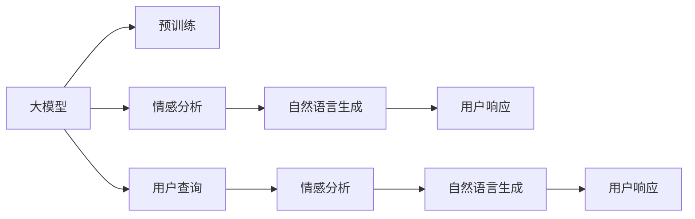

                 

# AI大模型在电商平台用户情感分析与响应中的作用

## 1. 背景介绍

在数字化转型加速的今天，电商平台已经成为了用户获取商品信息、进行消费决策的重要平台。然而，庞大的用户群体意味着成倍增长的客户支持需求。传统的客户服务模式往往依赖人工客服，无法全天候、无间断地处理大量查询，且响应速度、一致性和专业性难以保证。这不仅提高了运营成本，也影响了用户体验和品牌形象。

近年来，基于人工智能的自然语言处理技术迅速发展，为电商平台提供了新的客户支持解决方案——使用AI大模型进行用户情感分析与响应。借助自然语言理解、自然语言生成等能力，大模型能够自动分析用户反馈，识别出其中的情感倾向，并生成符合语境的回复。

本博客将系统地介绍大模型在用户情感分析与响应中的作用，包括技术原理、实现步骤、实际应用案例，并展望未来发展的方向。

## 2. 核心概念与联系

### 2.1 核心概念概述

在介绍大模型在电商平台用户情感分析与响应中的作用之前，首先需要了解几个核心概念：

- **大模型**：指基于大规模语料预训练的深度学习模型，如BERT、GPT等，具有强大的语言理解和生成能力。

- **情感分析**：指通过自然语言处理技术，自动分析文本中的情感倾向（正面、负面、中性），是用户支持系统的重要组成部分。

- **自然语言生成**：指基于用户反馈生成的回复，通常用于自动客服和虚拟助理系统。

- **电商平台**：指以在线销售商品和服务为主要业务的商业平台，如亚马逊、淘宝等。

- **用户响应**：指自动客服系统对用户查询的回复，旨在提升用户体验和系统响应效率。

这些概念之间的联系可通过以下Mermaid流程图来展示：



这个流程图展示了从用户查询到自动回复的全流程：

1. 用户查询输入。
2. 大模型进行预训练。
3. 利用情感分析技术分析用户查询情感倾向。
4. 使用自然语言生成技术生成合适的回复。
5. 回复输出给用户。

以下各节将详细讲解大模型在各环节中的应用。

## 3. 核心算法原理 & 具体操作步骤

### 3.1 算法原理概述

大模型在电商平台用户情感分析与响应中的作用，主要体现在以下几个算法原理上：

1. **情感分类模型训练**：使用大规模标注数据训练大模型，使其能够自动分类用户反馈的情感。
2. **自然语言生成模型训练**：使用训练好的大模型生成自然流畅、符合语境的回复。
3. **用户响应模型集成**：将情感分类和自然语言生成模型集成，实现自动客服系统。

### 3.2 算法步骤详解

下面详细介绍大模型在电商平台用户情感分析与响应中的具体操作步骤：

**Step 1: 数据准备**
- 收集电商平台的用户反馈数据，如评论、评分、询问等。
- 对数据进行标注，如将评论情感标注为正面、负面、中性等类别。
- 划分训练集、验证集和测试集。

**Step 2: 模型预训练**
- 选择合适的大模型架构，如BERT、GPT等。
- 在大规模无标签文本语料上进行预训练，学习通用的语言表示。
- 将预训练模型保存，以备后续微调使用。

**Step 3: 情感分类模型微调**
- 在情感标注数据上，使用小批量随机梯度下降(SGD)等优化算法对大模型进行微调。
- 冻结模型底层参数，仅微调顶层分类器，减少计算资源消耗。
- 选择适当的损失函数，如交叉熵损失，并设置合适的学习率、批大小、迭代轮数等。

**Step 4: 自然语言生成模型微调**
- 在用户查询和回复数据上，继续使用小批量随机梯度下降对大模型进行微调。
- 在生成回复时，可以使用Transformer等架构，并结合自回归或自编码技术。
- 通过加入正则化技术，如Dropout、L2正则等，防止模型过拟合。

**Step 5: 用户响应模型集成**
- 将情感分类模型和自然语言生成模型集成，构建自动客服系统。
- 系统可以实时接收用户查询，自动进行情感分析，并生成回复。
- 对于复杂的查询，可以引入人工客服进行干预。

### 3.3 算法优缺点

**优点**：
- **高效性**：大模型能够自动处理大量用户查询，提升响应效率。
- **一致性**：大模型输出的回复一致性高，不受人工情绪影响。
- **可扩展性**：可以处理多语言、多领域的用户反馈，适应性强。

**缺点**：
- **高成本**：预训练和微调模型需要大量的计算资源和时间。
- **依赖数据**：模型效果依赖于标注数据的质量和数量，标注成本较高。
- **可解释性差**：大模型作为黑盒模型，难以解释其内部决策过程。

### 3.4 算法应用领域

大模型在电商平台用户情感分析与响应中的作用广泛，应用于以下领域：

1. **自动客服**：处理常见问题，提升响应速度和一致性。
2. **用户反馈分析**：分析用户评价，发现服务问题，改进商品质量。
3. **个性化推荐**：根据用户情感反馈推荐商品，提升用户体验。
4. **知识图谱构建**：将用户反馈中的信息结构化，构建知识图谱。
5. **营销策略优化**：分析用户情感数据，优化营销策略和广告投放。

## 4. 数学模型和公式 & 详细讲解 & 举例说明

### 4.1 数学模型构建

情感分类模型和自然语言生成模型可以分别用以下公式表示：

- 情感分类模型：$\mathcal{M} = \mathcal{M}^{cat} + \mathcal{M}^{gen}$
- 自然语言生成模型：$\mathcal{M}^{gen} = \mathcal{M}^{enc} + \mathcal{M}^{dec}$

其中，$\mathcal{M}^{cat}$表示情感分类模型，$\mathcal{M}^{gen}$表示自然语言生成模型，$\mathcal{M}^{enc}$表示编码器，$\mathcal{M}^{dec}$表示解码器。

### 4.2 公式推导过程

情感分类模型的损失函数通常为交叉熵损失：

$$
\mathcal{L}^{cat} = -\frac{1}{N}\sum_{i=1}^N \sum_{j=1}^C y_{ij}\log p_{ij}
$$

其中，$N$为样本数量，$C$为情感类别数，$y_{ij}$为第$i$个样本在第$j$个类别的标签，$p_{ij}$为模型对第$i$个样本在第$j$个类别的预测概率。

自然语言生成模型的损失函数通常为负对数似然损失：

$$
\mathcal{L}^{gen} = -\frac{1}{N}\sum_{i=1}^N \log p(x_i|y_i)
$$

其中，$p(x_i|y_i)$为模型对第$i$个样本的生成概率。

### 4.3 案例分析与讲解

以下以用户评论情感分析为例，展示情感分类模型的具体实现：

1. **数据准备**：收集用户评论数据，标注情感类别。
2. **模型微调**：使用BERT模型作为情感分类模型，固定预训练参数，仅微调顶层分类器。
3. **评估与优化**：在验证集上评估模型性能，调整超参数。
4. **应用部署**：将训练好的模型集成到自动客服系统中，实时处理用户评论。

## 5. 项目实践：代码实例和详细解释说明

### 5.1 开发环境搭建

在进行大模型应用开发前，需要准备以下开发环境：

1. 安装Python、PyTorch、TensorFlow等深度学习框架。
2. 安装必要的NLP库，如NLTK、spaCy等。
3. 下载预训练大模型，如BERT、GPT等。
4. 准备训练和测试数据集。

### 5.2 源代码详细实现

以下是一个使用BERT模型进行情感分类的代码实现示例：

```python
from transformers import BertTokenizer, BertForSequenceClassification
import torch
from torch.utils.data import DataLoader
from sklearn.metrics import accuracy_score

# 数据准备
tokenizer = BertTokenizer.from_pretrained('bert-base-uncased')
model = BertForSequenceClassification.from_pretrained('bert-base-uncased', num_labels=3)
device = torch.device('cuda' if torch.cuda.is_available() else 'cpu')

# 定义数据加载器
def load_data(path):
    with open(path, 'r') as f:
        data = f.readlines()
    texts = [line.strip() for line in data]
    labels = [int(label) for label in data]
    encoding = tokenizer(texts, return_tensors='pt', padding='max_length', truncation=True)
    input_ids = encoding['input_ids'].to(device)
    attention_mask = encoding['attention_mask'].to(device)
    labels = torch.tensor(labels).to(device)
    return DataLoader(Dataset(input_ids, attention_mask, labels), batch_size=16)

train_loader = load_data('train.txt')
val_loader = load_data('val.txt')
test_loader = load_data('test.txt')

# 模型训练
model.to(device)
optimizer = torch.optim.Adam(model.parameters(), lr=2e-5)
criterion = torch.nn.CrossEntropyLoss()
epochs = 5

for epoch in range(epochs):
    model.train()
    total_loss = 0
    for batch in train_loader:
        inputs = {key: val.to(device) for key, val in batch.items()}
        outputs = model(**inputs)
        loss = criterion(outputs.logits, batch['labels'])
        loss.backward()
        optimizer.step()
        total_loss += loss.item()
    
    model.eval()
    total_correct = 0
    total_eval = 0
    with torch.no_grad():
        for batch in val_loader:
            inputs = {key: val.to(device) for key, val in batch.items()}
            outputs = model(**inputs)
            logits = outputs.logits
            preds = logits.argmax(dim=1)
            total_correct += (preds == batch['labels']).sum().item()
            total_eval += preds.size(0)
    
    val_acc = total_correct / total_eval
    print(f'Epoch {epoch+1}, val acc: {val_acc:.4f}')

# 模型测试
model.eval()
total_correct = 0
total_test = 0
with torch.no_grad():
    for batch in test_loader:
        inputs = {key: val.to(device) for key, val in batch.items()}
        outputs = model(**inputs)
        logits = outputs.logits
        preds = logits.argmax(dim=1)
        total_correct += (preds == batch['labels']).sum().item()
        total_test += preds.size(0)

test_acc = total_correct / total_test
print(f'Test acc: {test_acc:.4f}')
```

### 5.3 代码解读与分析

**数据加载器**：
- 使用NLTK库读取文本数据，并通过BertTokenizer对文本进行分词和编码。
- 使用PyTorch DataLoader将数据集分批次加载到模型中。

**模型训练**：
- 将模型和优化器加载到GPU上。
- 使用Adam优化器和交叉熵损失函数进行模型微调。
- 在每个epoch结束后，在验证集上评估模型性能，并记录当前验证集上的准确率。

**模型测试**：
- 在测试集上评估模型性能，计算测试集上的准确率。

## 6. 实际应用场景

### 6.1 自动客服系统

自动客服系统是大模型在电商平台用户情感分析与响应中的典型应用场景。通过情感分类和自然语言生成技术，自动客服系统可以自动分析用户查询，并提供相应的回答。这不仅显著提高了响应速度，还减少了人工客服的负担，提升了用户体验。

### 6.2 用户反馈分析

用户反馈数据通常包含大量的情感信息，通过情感分析，电商平台可以及时发现服务问题，进行改进。例如，如果大量用户对某商品给出负面评价，可以立即启动问题排查和应对措施。

### 6.3 个性化推荐

用户的评论和评分数据可以用于构建推荐系统，通过情感分析，更好地理解用户的偏好。例如，对于对某个商品给出正面评价的用户，可以推荐相似的商品。

### 6.4 营销策略优化

通过情感分析，电商平台可以了解用户对某类产品的整体情感倾向，优化广告投放策略。例如，如果用户对某类商品普遍持正面情感，可以加大该类商品的推广力度。

### 6.5 情感监控

情感监控可以帮助电商平台实时监测舆论动态，及时发现负面信息。例如，如果某产品的用户普遍持负面情感，可以迅速采取措施，缓解不良影响。

## 7. 工具和资源推荐

### 7.1 学习资源推荐

1. **《自然语言处理综论》**：介绍NLP的全面理论基础和算法实现。
2. **Coursera《深度学习专项课程》**：由斯坦福大学Andrew Ng教授讲授，涵盖深度学习的基础和实践。
3. **Kaggle竞赛**：通过参与NLP相关的竞赛，实践数据处理和模型训练技能。
4. **《PyTorch深度学习入门》**：详解PyTorch的NLP应用，包括模型构建、训练和部署。

### 7.2 开发工具推荐

1. **PyTorch**：基于Python的开源深度学习框架，灵活动态的计算图，适合快速迭代研究。
2. **TensorFlow**：由Google主导开发的开源深度学习框架，生产部署方便，适合大规模工程应用。
3. **HuggingFace Transformers库**：提供了预训练模型和微调样例，简化开发流程。
4. **Jupyter Notebook**：用于编写和运行Python代码，支持多核并行计算。

### 7.3 相关论文推荐

1. **Attention is All You Need**：介绍Transformer架构，推动预训练大模型的发展。
2. **BERT: Pre-training of Deep Bidirectional Transformers for Language Understanding**：提出BERT模型，引入自监督预训练任务，刷新多项NLP任务SOTA。
3. **XLNet: Generalized Autoregressive Pretraining for Language Understanding**：提出XLNet模型，提升预训练大模型的性能。
4. **GPT-3: Language Models are Unsupervised Multitask Learners**：展示GPT-3模型的强大zero-shot学习能力。
5. **GPT-3的缺陷与改进**：分析GPT-3模型的局限性，并提出改进方案。

## 8. 总结：未来发展趋势与挑战

### 8.1 研究成果总结

本文从技术原理、实现步骤和实际应用三个方面，系统地介绍了大模型在电商平台用户情感分析与响应中的作用。通过情感分类模型和自然语言生成模型的微调，实现了自动客服系统，提升了用户体验和响应效率。未来，随着大模型技术的发展，用户情感分析与响应将变得更加智能和高效。

### 8.2 未来发展趋势

1. **多模态情感分析**：结合图像、视频等多模态数据，提升情感分析的准确性。
2. **实时情感监控**：实时分析用户反馈，及时发现和处理问题。
3. **跨领域情感分析**：将情感分析技术应用于更多领域，如医疗、金融等。
4. **深度学习与规则结合**：结合深度学习和规则引擎，实现更精确的情感分类。
5. **隐私保护**：保护用户隐私，避免敏感信息泄露。

### 8.3 面临的挑战

1. **数据隐私保护**：保护用户隐私，避免敏感信息泄露。
2. **模型的可解释性**：大模型作为黑盒模型，难以解释其内部决策过程。
3. **计算资源消耗**：预训练和微调模型需要大量的计算资源和时间。
4. **模型的鲁棒性**：模型面对域外数据时，泛化性能往往大打折扣。
5. **模型的可靠性**：确保模型输出的可靠性，避免误导性、歧视性的输出。

### 8.4 研究展望

未来，需要在以下几个方面进行深入研究：

1. **跨领域情感分析**：将情感分析技术应用于更多领域，如医疗、金融等。
2. **多模态情感分析**：结合图像、视频等多模态数据，提升情感分析的准确性。
3. **实时情感监控**：实时分析用户反馈，及时发现和处理问题。
4. **深度学习与规则结合**：结合深度学习和规则引擎，实现更精确的情感分类。
5. **隐私保护**：保护用户隐私，避免敏感信息泄露。

总之，大模型在电商平台用户情感分析与响应中的作用将日益重要，未来随着技术的不断进步，其应用场景将更加广泛，带来的价值也将更加巨大。

## 9. 附录：常见问题与解答

### Q1: 大模型在电商平台用户情感分析与响应中的作用是什么？

A: 大模型在电商平台用户情感分析与响应中的作用主要体现在以下几个方面：

1. **自动客服**：通过情感分类和自然语言生成技术，自动客服系统可以自动分析用户查询，并提供相应的回答，提升响应速度和一致性。
2. **用户反馈分析**：通过情感分析，电商平台可以及时发现服务问题，进行改进。
3. **个性化推荐**：通过情感分析，更好地理解用户的偏好，提升个性化推荐效果。
4. **营销策略优化**：通过情感分析，了解用户对某类产品的整体情感倾向，优化广告投放策略。
5. **情感监控**：实时监测舆论动态，及时发现负面信息，采取措施缓解不良影响。

### Q2: 如何选择合适的预训练模型进行微调？

A: 选择合适的预训练模型进行微调，需要考虑以下几个方面：

1. **任务类型**：不同的预训练模型适用于不同的NLP任务，如BERT适用于分类任务，GPT适用于生成任务。
2. **数据规模**：预训练模型参数量较大，适合大规模数据集进行微调。
3. **计算资源**：预训练模型计算资源消耗较大，需要考虑硬件设备。
4. **任务领域**：特定领域的预训练模型，如医学、法律等，可能更适用于特定任务。

### Q3: 情感分类模型的训练步骤是什么？

A: 情感分类模型的训练步骤如下：

1. **数据准备**：收集用户评论数据，标注情感类别。
2. **模型微调**：使用BERT模型作为情感分类模型，固定预训练参数，仅微调顶层分类器。
3. **评估与优化**：在验证集上评估模型性能，调整超参数。
4. **应用部署**：将训练好的模型集成到自动客服系统中，实时处理用户评论。

### Q4: 自然语言生成模型的训练步骤是什么？

A: 自然语言生成模型的训练步骤如下：

1. **数据准备**：收集用户查询和回复数据。
2. **模型微调**：使用预训练模型进行微调，生成自然流畅、符合语境的回复。
3. **评估与优化**：在验证集上评估模型性能，调整超参数。
4. **应用部署**：将训练好的模型集成到自动客服系统中，实时处理用户查询。

### Q5: 如何在实际应用中提升情感分析模型的性能？

A: 在实际应用中，可以通过以下方式提升情感分析模型的性能：

1. **数据增强**：通过回译、近义替换等方式扩充训练集。
2. **正则化技术**：使用L2正则、Dropout、Early Stopping等防止模型过拟合。
3. **模型集成**：结合多个模型，取平均输出，提高模型鲁棒性。
4. **多任务学习**：通过多任务学习，共享模型参数，提升性能。
5. **迁移学习**：在特定领域进行迁移学习，提高模型泛化能力。

总之，通过不断优化数据、模型和算法，可以有效提升情感分析模型的性能，提升用户体验和系统响应效率。

---

作者：禅与计算机程序设计艺术 / Zen and the Art of Computer Programming

