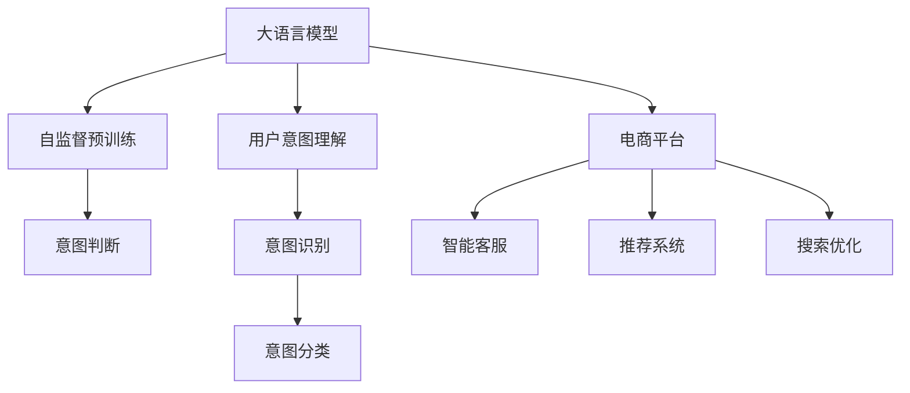

                 

# AI大模型在电商平台用户意图理解中的应用

> 关键词：大语言模型,用户意图理解,电商平台,自然语言处理,NLP

## 1. 背景介绍

在电商平台的运营中，精准理解用户意图是提升用户体验和销售转化的关键。传统的用户意图理解方法依赖于规则匹配和人工标注，成本高、效率低，且对多样化的用户表达方式适应性较差。随着人工智能技术的发展，尤其是大语言模型的崛起，用户意图理解领域迎来了新的突破。

大语言模型通过在大规模无标签文本上自监督预训练，学习到丰富的语言表示和先验知识。在此基础上，结合少量有标签数据进行微调，可以显著提升模型对用户表达方式的多样性和复杂性的理解能力。电商平台可以利用大模型快速构建意图理解系统，实现智能客服、推荐系统、搜索优化等功能，大幅提升平台的用户体验和运营效率。

## 2. 核心概念与联系

### 2.1 核心概念概述

为更好地理解大模型在电商平台用户意图理解中的应用，本节将介绍几个核心概念：

- 大语言模型(Large Language Model, LLM)：指通过大规模自监督预训练学习到的通用语言表示模型，如BERT、GPT-3等。
- 用户意图理解(User Intent Recognition, UIR)：指通过用户输入的自然语言，自动判断用户的真实需求和行为意图。
- 电商平台(e-Commerce Platform)：指通过互联网提供商品交易服务的平台，如淘宝、京东、亚马逊等。
- 自然语言处理(Natural Language Processing, NLP)：指利用计算机科学和语言学的知识，使计算机能够理解和生成人类语言的技术。
- 模型微调(Fine-Tuning)：指在大模型上使用特定任务的数据进行有监督训练，优化模型性能的过程。

这些核心概念之间的逻辑关系可以通过以下Mermaid流程图来展示：



这个流程图展示了大语言模型、意图理解、电商平台以及相关应用之间的关系：

1. 大语言模型通过大规模预训练学习到语言表示和先验知识。
2. 电商平台可以利用大模型构建意图理解系统，实现智能客服、推荐系统、搜索优化等功能。
3. 意图理解系统通过理解用户输入，自动判断意图，分类出具体的需求。
4. 意图分类结果可以用于驱动电商平台的应用功能，提升用户体验。

## 3. 核心算法原理 & 具体操作步骤
### 3.1 算法原理概述

用户意图理解的本质是从自然语言文本中提取用户需求和行为意图的过程。大语言模型可以通过自监督预训练学习到语言表示和先验知识，然后通过微调针对特定任务进行优化。以电商平台为例，假设用户输入为一段文本，大模型的输出为意图识别结果，即用户需求。

大模型在预训练时已经学习了语言表示和关联，因此在微调时可以针对特定电商平台的意图识别任务进行优化。假设电商平台的用户意图可以分为若干类，如查询商品、询问客服、评价商品、投诉等，则可以通过有标签的训练数据集，对大模型进行微调。微调过程通过优化模型参数，使得模型输出更加接近于正确的意图分类。

### 3.2 算法步骤详解

大语言模型在电商平台用户意图理解中的应用，一般包括以下关键步骤：

**Step 1: 数据准备**

- 收集电商平台的用户的交互数据，包括聊天记录、搜索记录、评论等，标注为不同意图类别。
- 对数据进行清洗和标准化处理，去除无用信息，保留有用的意图信息。
- 将数据划分为训练集、验证集和测试集，用于模型训练、调参和最终评估。

**Step 2: 模型选择和微调**

- 选择合适的预训练语言模型，如BERT、GPT等。
- 根据电商平台的意图类别，设计合适的任务适配层，如分类头、预测头等。
- 在训练集上对模型进行微调，使用适当的优化算法（如AdamW、SGD）和超参数（如学习率、批大小）进行优化。
- 在验证集上评估模型性能，根据表现调整参数和策略。
- 在测试集上评估最终模型性能，对比微调前后的效果。

**Step 3: 意图识别**

- 将用户输入文本作为模型输入，使用微调后的模型进行意图识别。
- 根据模型输出，判断用户意图，并提取相关特征。
- 将识别结果反馈给电商平台应用，驱动后续的业务逻辑。

### 3.3 算法优缺点

大语言模型在电商平台用户意图理解中的应用，具有以下优点：

1. **泛化能力强**：大模型已经在大规模无标签数据上进行了预训练，具备较强的泛化能力，能够适应多种不同的用户表达方式。
2. **训练数据需求低**：相对于传统的方法，大模型在少量有标签数据上进行微调即可取得良好效果，降低了数据标注和处理的成本。
3. **处理速度快**：大模型通常采用并行计算，推理速度较快，能够实时处理用户的意图查询。
4. **应用场景广泛**：可以应用于智能客服、推荐系统、搜索优化等多个电商平台的业务场景中。

同时，大语言模型也存在以下缺点：

1. **资源消耗大**：大模型通常需要较大的计算资源和存储空间，可能对部分中小型电商平台的资源配置提出挑战。
2. **模型复杂度高**：大模型的参数量较大，结构复杂，可能存在过拟合的风险。
3. **可解释性不足**：大模型的内部工作机制较为复杂，难以解释其决策过程，可能影响模型在业务场景中的可接受度。

### 3.4 算法应用领域

大语言模型在电商平台用户意图理解中的应用，主要涵盖以下几个方面：

- **智能客服**：通过理解用户查询和问题，自动提供相应的解决方案，提升客服响应效率和满意度。
- **推荐系统**：根据用户意图，推荐最相关的商品和内容，提升用户体验和转化率。
- **搜索优化**：通过理解用户查询意图，优化搜索算法，提升搜索精度和速度。
- **内容推荐**：根据用户兴趣和行为，生成个性化的内容推荐，提升用户粘性和活跃度。

## 4. 数学模型和公式 & 详细讲解 & 举例说明

### 4.1 数学模型构建

假设电商平台的用户意图分为 $N$ 类，记为 $U = \{u_1, u_2, ..., u_N\}$。用户输入的文本为 $x$，大模型预训练后的输出为 $h(x)$，任务适配层的输出为 $\hat{y} = \text{Softmax}(W^T h(x) + b)$。其中，$W$ 和 $b$ 为可训练的权重和偏置。

微调目标函数为交叉熵损失函数：

$$
\mathcal{L}(\theta) = -\frac{1}{N} \sum_{i=1}^N y_i \log \hat{y}_i
$$

其中，$y_i$ 为输入文本 $x$ 的真实意图类别，$\hat{y}_i$ 为模型对输入文本的意图预测。

### 4.2 公式推导过程

根据上述定义，交叉熵损失函数可以表示为：

$$
\mathcal{L}(\theta) = -\frac{1}{N} \sum_{i=1}^N y_i \log \sum_{j=1}^N \exp(\hat{y}_j W^T h(x) + \hat{y}_j b)
$$

其中，$\text{Softmax}$ 函数的作用是将 $h(x)$ 映射到 $U$ 中的概率分布。

最小化损失函数 $\mathcal{L}(\theta)$ 等价于最大化模型预测的对数似然：

$$
\max_{\theta} \sum_{i=1}^N y_i \log \hat{y}_i
$$

对模型参数 $\theta$ 进行梯度下降优化，更新模型参数。

### 4.3 案例分析与讲解

假设电商平台有如下用户输入文本和对应的意图类别：

| 文本样本             | 意图类别 |
|------------------|-------|
| 请问你们有哪些连衣裙？   | 查询商品 |
| 怎么退货？           | 询问客服 |
| 这个商品怎么样？     | 评价商品 |
| 我想投诉！           | 投诉 |

对于这些样本，可以将其作为训练数据，对大模型进行微调。假设微调后的模型在测试集上的精度为90%，则模型在电商平台的意图理解应用中，准确率较高，能够较好地理解用户输入。

## 5. 项目实践：代码实例和详细解释说明
### 5.1 开发环境搭建

在进行电商平台用户意图理解的大模型微调实践前，需要准备相应的开发环境。以下是使用Python进行PyTorch开发的环境配置流程：

1. 安装Anaconda：从官网下载并安装Anaconda，用于创建独立的Python环境。
2. 创建并激活虚拟环境：
```bash
conda create -n pytorch-env python=3.8 
conda activate pytorch-env
```

3. 安装PyTorch：根据CUDA版本，从官网获取对应的安装命令。例如：
```bash
conda install pytorch torchvision torchaudio cudatoolkit=11.1 -c pytorch -c conda-forge
```

4. 安装Transformer库：
```bash
pip install transformers
```

5. 安装各类工具包：
```bash
pip install numpy pandas scikit-learn matplotlib tqdm jupyter notebook ipython
```

完成上述步骤后，即可在`pytorch-env`环境中开始微调实践。

### 5.2 源代码详细实现

这里我们以电商平台的用户意图理解任务为例，使用BERT模型进行微调。首先，定义意图分类数据集：

```python
from transformers import BertTokenizer
from torch.utils.data import Dataset
import torch

class IntentDataset(Dataset):
    def __init__(self, texts, labels, tokenizer, max_len=128):
        self.texts = texts
        self.labels = labels
        self.tokenizer = tokenizer
        self.max_len = max_len
        
    def __len__(self):
        return len(self.texts)
    
    def __getitem__(self, item):
        text = self.texts[item]
        label = self.labels[item]
        
        encoding = self.tokenizer(text, return_tensors='pt', max_length=self.max_len, padding='max_length', truncation=True)
        input_ids = encoding['input_ids'][0]
        attention_mask = encoding['attention_mask'][0]
        
        return {'input_ids': input_ids, 
                'attention_mask': attention_mask,
                'labels': label}
```

然后，定义模型和优化器：

```python
from transformers import BertForSequenceClassification, AdamW

model = BertForSequenceClassification.from_pretrained('bert-base-cased', num_labels=4)

optimizer = AdamW(model.parameters(), lr=2e-5)
```

接着，定义训练和评估函数：

```python
from torch.utils.data import DataLoader
from tqdm import tqdm
from sklearn.metrics import classification_report

device = torch.device('cuda') if torch.cuda.is_available() else torch.device('cpu')
model.to(device)

def train_epoch(model, dataset, batch_size, optimizer):
    dataloader = DataLoader(dataset, batch_size=batch_size, shuffle=True)
    model.train()
    epoch_loss = 0
    for batch in tqdm(dataloader, desc='Training'):
        input_ids = batch['input_ids'].to(device)
        attention_mask = batch['attention_mask'].to(device)
        labels = batch['labels'].to(device)
        model.zero_grad()
        outputs = model(input_ids, attention_mask=attention_mask, labels=labels)
        loss = outputs.loss
        epoch_loss += loss.item()
        loss.backward()
        optimizer.step()
    return epoch_loss / len(dataloader)

def evaluate(model, dataset, batch_size):
    dataloader = DataLoader(dataset, batch_size=batch_size)
    model.eval()
    preds, labels = [], []
    with torch.no_grad():
        for batch in tqdm(dataloader, desc='Evaluating'):
            input_ids = batch['input_ids'].to(device)
            attention_mask = batch['attention_mask'].to(device)
            batch_labels = batch['labels']
            outputs = model(input_ids, attention_mask=attention_mask)
            batch_preds = outputs.logits.argmax(dim=1).to('cpu').tolist()
            batch_labels = batch_labels.to('cpu').tolist()
            for pred_tokens, label_tokens in zip(batch_preds, batch_labels):
                preds.append(pred_tokens[:len(label_tokens)])
                labels.append(label_tokens)
                
    print(classification_report(labels, preds))
```

最后，启动训练流程并在测试集上评估：

```python
epochs = 5
batch_size = 16

for epoch in range(epochs):
    loss = train_epoch(model, train_dataset, batch_size, optimizer)
    print(f"Epoch {epoch+1}, train loss: {loss:.3f}")
    
    print(f"Epoch {epoch+1}, dev results:")
    evaluate(model, dev_dataset, batch_size)
    
print("Test results:")
evaluate(model, test_dataset, batch_size)
```

以上就是使用PyTorch对BERT进行电商平台用户意图理解任务微调的完整代码实现。可以看到，得益于Transformers库的强大封装，我们可以用相对简洁的代码完成BERT模型的加载和微调。

### 5.3 代码解读与分析

让我们再详细解读一下关键代码的实现细节：

**IntentDataset类**：
- `__init__`方法：初始化文本、标签、分词器等关键组件。
- `__len__`方法：返回数据集的样本数量。
- `__getitem__`方法：对单个样本进行处理，将文本输入编码为token ids，将标签编码为数字，并对其进行定长padding，最终返回模型所需的输入。

**标签与id的映射**：
- 定义了意图与数字id之间的映射关系，用于将token-wise的预测结果解码回真实的意图。

**训练和评估函数**：
- 使用PyTorch的DataLoader对数据集进行批次化加载，供模型训练和推理使用。
- 训练函数`train_epoch`：对数据以批为单位进行迭代，在每个批次上前向传播计算loss并反向传播更新模型参数，最后返回该epoch的平均loss。
- 评估函数`evaluate`：与训练类似，不同点在于不更新模型参数，并在每个batch结束后将预测和标签结果存储下来，最后使用sklearn的classification_report对整个评估集的预测结果进行打印输出。

**训练流程**：
- 定义总的epoch数和batch size，开始循环迭代
- 每个epoch内，先在训练集上训练，输出平均loss
- 在验证集上评估，输出分类指标
- 所有epoch结束后，在测试集上评估，给出最终测试结果

可以看到，PyTorch配合Transformers库使得BERT微调的代码实现变得简洁高效。开发者可以将更多精力放在数据处理、模型改进等高层逻辑上，而不必过多关注底层的实现细节。

当然，工业级的系统实现还需考虑更多因素，如模型的保存和部署、超参数的自动搜索、更灵活的任务适配层等。但核心的微调范式基本与此类似。

## 6. 实际应用场景
### 6.1 智能客服系统

智能客服系统在电商平台中扮演着重要角色。通过用户意图理解，智能客服可以快速响应客户咨询，提供个性化解决方案，提升客户满意度。

智能客服系统通常包含意图识别、对话管理、回答生成等多个子系统。其中，意图识别系统通过理解用户输入，自动判断意图类别，驱动后续的对话管理策略和回答生成逻辑。

以淘宝客服为例，通过大语言模型微调构建的意图理解系统，可以自动分析用户输入，判断是询问商品、退货、投诉等，从而驱动相应的对话管理策略和回答生成逻辑。例如，对于询问商品的用户，可以自动跳转到商品推荐页面；对于投诉的用户，可以自动转接到人工客服。

### 6.2 推荐系统

推荐系统通过理解用户意图，生成个性化的商品推荐，提升用户体验和转化率。传统推荐系统依赖用户历史行为数据，难以充分考虑用户的兴趣和需求。而利用大语言模型微调，推荐系统可以更好地理解用户表达方式，提升推荐的准确性和多样性。

具体而言，电商平台可以利用大模型微调构建的意图理解系统，对用户的查询和搜索记录进行分析，识别出用户的兴趣点，从而生成更精准的商品推荐。例如，用户查询“连衣裙”时，推荐系统可以自动分析用户的意图，推荐不同类型的连衣裙，提升用户的购买意愿。

### 6.3 搜索优化

搜索优化通过理解用户查询意图，优化搜索算法，提升搜索精度和速度。传统搜索算法通常依赖规则匹配，难以适应复杂的查询表达方式。而利用大语言模型微调，搜索优化可以更好地理解用户的查询意图，提供更准确的搜索结果。

具体而言，电商平台可以利用大模型微调构建的意图理解系统，对用户的查询进行分析和解析，自动匹配相关商品，提升搜索体验。例如，用户查询“高品质鞋子”时，搜索优化系统可以自动分析用户的意图，匹配高质量的鞋子商品，提升用户的搜索满意度。

### 6.4 未来应用展望

随着大语言模型和微调方法的不断发展，基于意图理解的技术将在更多领域得到应用，为电商平台的运营带来新的变革。

在智慧物流领域，基于意图理解的技术可以提升物流配送的自动化和智能化水平，构建更高效、更可靠的系统。例如，智能仓库可以通过理解用户的物流需求，自动匹配最优的物流方案，提升物流效率。

在智能制造领域，基于意图理解的技术可以提升生产线的自动化和智能化水平，构建更灵活、更敏捷的系统。例如，智能工厂可以通过理解用户的制造需求，自动调整生产计划，提升生产效率。

总之，大语言模型在电商平台用户意图理解中的应用，将开启更多的应用场景，为电商平台的运营带来更深刻的变革。相信伴随技术的持续演进，基于意图理解的技术将不断拓展应用边界，推动电商平台的数字化转型。

## 7. 工具和资源推荐
### 7.1 学习资源推荐

为了帮助开发者系统掌握大语言模型在电商平台用户意图理解中的应用，这里推荐一些优质的学习资源：

1. 《自然语言处理综述》系列博文：由大模型技术专家撰写，深入浅出地介绍了NLP领域的核心概念和技术，涵盖用户意图理解等前沿话题。

2. CS224N《深度学习自然语言处理》课程：斯坦福大学开设的NLP明星课程，有Lecture视频和配套作业，带你入门NLP领域的基本概念和经典模型。

3. 《自然语言处理实战》书籍：涵盖了NLP领域的经典模型和实践方法，包括用户意图理解等实用技术。

4. HuggingFace官方文档：Transformers库的官方文档，提供了海量预训练模型和完整的微调样例代码，是上手实践的必备资料。

5. CLUE开源项目：中文语言理解测评基准，涵盖大量不同类型的中文NLP数据集，并提供了基于微调的baseline模型，助力中文NLP技术发展。

通过对这些资源的学习实践，相信你一定能够快速掌握大语言模型在电商平台用户意图理解中的应用精髓，并用于解决实际的NLP问题。
### 7.2 开发工具推荐

高效的开发离不开优秀的工具支持。以下是几款用于电商平台用户意图理解的大模型微调开发的常用工具：

1. PyTorch：基于Python的开源深度学习框架，灵活动态的计算图，适合快速迭代研究。大部分预训练语言模型都有PyTorch版本的实现。

2. TensorFlow：由Google主导开发的开源深度学习框架，生产部署方便，适合大规模工程应用。同样有丰富的预训练语言模型资源。

3. Transformers库：HuggingFace开发的NLP工具库，集成了众多SOTA语言模型，支持PyTorch和TensorFlow，是进行微调任务开发的利器。

4. Weights & Biases：模型训练的实验跟踪工具，可以记录和可视化模型训练过程中的各项指标，方便对比和调优。与主流深度学习框架无缝集成。

5. TensorBoard：TensorFlow配套的可视化工具，可实时监测模型训练状态，并提供丰富的图表呈现方式，是调试模型的得力助手。

6. Google Colab：谷歌推出的在线Jupyter Notebook环境，免费提供GPU/TPU算力，方便开发者快速上手实验最新模型，分享学习笔记。

合理利用这些工具，可以显著提升电商平台用户意图理解任务的开发效率，加快创新迭代的步伐。

### 7.3 相关论文推荐

大语言模型和用户意图理解技术的发展源于学界的持续研究。以下是几篇奠基性的相关论文，推荐阅读：

1. Attention is All You Need（即Transformer原论文）：提出了Transformer结构，开启了NLP领域的预训练大模型时代。

2. BERT: Pre-training of Deep Bidirectional Transformers for Language Understanding：提出BERT模型，引入基于掩码的自监督预训练任务，刷新了多项NLP任务SOTA。

3. Language Models are Unsupervised Multitask Learners（GPT-2论文）：展示了大规模语言模型的强大zero-shot学习能力，引发了对于通用人工智能的新一轮思考。

4. Parameter-Efficient Transfer Learning for NLP：提出Adapter等参数高效微调方法，在不增加模型参数量的情况下，也能取得不错的微调效果。

5. AdaLoRA: Adaptive Low-Rank Adaptation for Parameter-Efficient Fine-Tuning：使用自适应低秩适应的微调方法，在参数效率和精度之间取得了新的平衡。

这些论文代表了大语言模型和用户意图理解技术的发展脉络。通过学习这些前沿成果，可以帮助研究者把握学科前进方向，激发更多的创新灵感。

## 8. 总结：未来发展趋势与挑战

### 8.1 总结

本文对大语言模型在电商平台用户意图理解中的应用进行了全面系统的介绍。首先阐述了大语言模型和用户意图理解的研究背景和意义，明确了用户意图理解在电商平台中的重要性和应用前景。其次，从原理到实践，详细讲解了大模型微调的数学原理和关键步骤，给出了电商平台用户意图理解任务的大模型微调代码实现。同时，本文还广泛探讨了意图理解系统在智能客服、推荐系统、搜索优化等多个电商平台业务场景中的应用，展示了大模型微调的广泛适用性。

通过本文的系统梳理，可以看到，大语言模型微调在电商平台用户意图理解中的应用前景广阔，可以显著提升电商平台的运营效率和用户体验。未来，伴随大语言模型和微调方法的持续演进，基于意图理解的技术将不断拓展应用边界，推动电商平台的数字化转型。

### 8.2 未来发展趋势

展望未来，大语言模型在电商平台用户意图理解中的应用将呈现以下几个发展趋势：

1. **模型规模持续增大**：随着算力成本的下降和数据规模的扩张，预训练语言模型的参数量还将持续增长。超大规模语言模型蕴含的丰富语言知识，有望支撑更加复杂多变的用户意图识别任务。

2. **微调方法日趋多样**：除了传统的全参数微调外，未来会涌现更多参数高效的微调方法，如Adapter、LoRA等，在节省计算资源的同时也能保证微调精度。

3. **多模态融合**：目前的意图理解系统主要依赖文本数据，未来会进一步拓展到图像、语音等多模态数据融合，实现更全面、准确的用户意图理解。

4. **实时性和可解释性提升**：随着硬件技术的进步和算法优化，未来的意图理解系统将能够实时处理用户查询，并提升模型的可解释性，增强用户信任。

5. **跨平台适配**：未来的意图理解系统将具备跨平台适配能力，适应不同电商平台的业务场景，提升平台的通用性和扩展性。

### 8.3 面临的挑战

尽管大语言模型在电商平台用户意图理解中的应用已经取得了显著进展，但在迈向更加智能化、普适化应用的过程中，仍面临诸多挑战：

1. **标注成本高**：虽然微调降低了数据标注的需求，但对于长尾应用场景，仍然需要大量高质量的标注数据，标注成本较高。如何进一步降低微调对标注样本的依赖，将是一大难题。

2. **模型鲁棒性不足**：当前模型面对域外数据时，泛化性能往往大打折扣。如何提高模型的鲁棒性，避免过拟合和灾难性遗忘，还需要更多理论和实践的积累。

3. **推理效率低**：大规模语言模型虽然精度高，但在实际部署时往往面临推理速度慢、内存占用大等效率问题。如何优化模型结构和推理过程，提高推理速度和资源利用率，将是重要的优化方向。

4. **可解释性不足**：当前模型的内部工作机制较为复杂，难以解释其决策过程，可能影响模型在业务场景中的可接受度。如何增强模型的可解释性，提高用户信任度，将是亟待解决的问题。

5. **安全性问题**：预训练语言模型可能学习到有害信息，传递到意图理解系统中，产生误导性、歧视性的输出。如何从数据和算法层面确保模型的安全性，将是重要的研究方向。

### 8.4 研究展望

面对大语言模型在电商平台用户意图理解应用中面临的挑战，未来的研究需要在以下几个方面寻求新的突破：

1. **无监督和半监督学习**：探索利用无监督和半监督学习范式，降低对标注数据的依赖，最大化利用非结构化数据，提升模型的泛化能力。

2. **参数高效微调**：开发更加参数高效的微调方法，在固定大部分预训练参数的同时，只更新极少量的任务相关参数，提升模型的轻量化和实时性。

3. **多模态融合**：将图像、语音等多模态信息与文本信息进行协同建模，提升意图理解系统的全面性和准确性。

4. **因果分析和博弈论工具**：引入因果分析和博弈论工具，增强模型的决策逻辑和稳定性，避免过拟合和误导性输出。

5. **模型压缩和优化**：通过模型压缩、稀疏化存储等技术，优化模型的推理速度和资源占用，提升系统的效率和可扩展性。

6. **跨领域知识迁移**：将符号化的先验知识，如知识图谱、逻辑规则等，与神经网络模型进行巧妙融合，提升模型的知识整合能力和推理能力。

7. **跨平台适配**：开发跨平台适配的意图理解系统，提升平台的通用性和扩展性，支持更多业务场景的应用。

这些研究方向的探索，必将引领大语言模型在电商平台用户意图理解中的应用迈向更高的台阶，为电商平台的数字化转型提供更强大的技术支撑。面向未来，大语言模型和意图理解技术还需要与其他人工智能技术进行更深入的融合，如知识表示、因果推理、强化学习等，多路径协同发力，共同推动电商平台的技术进步和业务创新。

## 9. 附录：常见问题与解答

**Q1：电商平台用户意图理解为什么需要大语言模型？**

A: 电商平台用户意图的表达方式多样，涉及商品、客服、评价等多个场景，传统的规则匹配和人工标注方法难以适应复杂多变的用户表达方式。大语言模型通过大规模无标签数据的自监督预训练，学习到丰富的语言表示和先验知识，可以更好地理解用户输入，提升意图识别的准确性和泛化能力。

**Q2：电商平台用户意图理解中的大模型如何微调？**

A: 电商平台用户意图理解中的大模型微调，主要包括以下步骤：
1. 收集电商平台的用户交互数据，标注为不同意图类别。
2. 选择适合的大语言模型，如BERT、GPT等，进行微调。
3. 在训练集上对模型进行微调，使用适当的优化算法和超参数进行优化。
4. 在验证集上评估模型性能，根据表现调整参数和策略。
5. 在测试集上评估最终模型性能，对比微调前后的效果。

**Q3：电商平台用户意图理解中的大模型微调需要注意哪些问题？**

A: 电商平台用户意图理解中的大模型微调，需要注意以下问题：
1. 数据标注成本高，如何降低对标注数据的依赖，提高模型的泛化能力。
2. 模型鲁棒性不足，如何提高模型对域外数据的泛化能力，避免过拟合和灾难性遗忘。
3. 推理效率低，如何优化模型结构和推理过程，提高系统的实时性和资源利用率。
4. 可解释性不足，如何增强模型的可解释性，提高用户信任度。
5. 安全性问题，如何确保模型的安全性，避免有害信息的传递。

**Q4：电商平台用户意图理解中的大模型微调有哪些应用场景？**

A: 电商平台用户意图理解中的大模型微调，主要应用于以下场景：
1. 智能客服系统：通过理解用户查询和问题，自动提供相应的解决方案，提升客服响应效率和满意度。
2. 推荐系统：根据用户意图，推荐最相关的商品和内容，提升用户体验和转化率。
3. 搜索优化：通过理解用户查询意图，优化搜索算法，提升搜索精度和速度。
4. 内容推荐：根据用户兴趣和行为，生成个性化的内容推荐，提升用户粘性和活跃度。

**Q5：电商平台用户意图理解中的大模型微调有哪些优势？**

A: 电商平台用户意图理解中的大模型微调，具有以下优势：
1. 泛化能力强：大模型已经在大规模无标签数据上进行了预训练，具备较强的泛化能力，能够适应多种不同的用户表达方式。
2. 训练数据需求低：相对于传统的方法，大模型在少量有标签数据上进行微调即可取得良好效果，降低了数据标注和处理的成本。
3. 处理速度快：大模型通常采用并行计算，推理速度较快，能够实时处理用户的意图查询。
4. 应用场景广泛：可以应用于智能客服、推荐系统、搜索优化等多个电商平台的业务场景中。

**Q6：电商平台用户意图理解中的大模型微调有哪些挑战？**

A: 电商平台用户意图理解中的大模型微调，面临以下挑战：
1. 标注成本高：虽然微调降低了数据标注的需求，但对于长尾应用场景，仍然需要大量高质量的标注数据，标注成本较高。
2. 模型鲁棒性不足：当前模型面对域外数据时，泛化性能往往大打折扣。如何提高模型的鲁棒性，避免过拟合和灾难性遗忘，还需要更多理论和实践的积累。
3. 推理效率低：大规模语言模型虽然精度高，但在实际部署时往往面临推理速度慢、内存占用大等效率问题。
4. 可解释性不足：当前模型的内部工作机制较为复杂，难以解释其决策过程，可能影响模型在业务场景中的可接受度。
5. 安全性问题：预训练语言模型可能学习到有害信息，传递到意图理解系统中，产生误导性、歧视性的输出。

**Q7：电商平台用户意图理解中的大模型微调有哪些未来发展趋势？**

A: 电商平台用户意图理解中的大模型微调，未来发展趋势包括：
1. 模型规模持续增大：随着算力成本的下降和数据规模的扩张，预训练语言模型的参数量还将持续增长。
2. 微调方法日趋多样：开发更加参数高效的微调方法，在固定大部分预训练参数的同时，只更新极少量的任务相关参数，提升模型的轻量化和实时性。
3. 多模态融合：将图像、语音等多模态信息与文本信息进行协同建模，提升意图理解系统的全面性和准确性。
4. 实时性和可解释性提升：随着硬件技术的进步和算法优化，未来的意图理解系统将能够实时处理用户查询，并提升模型的可解释性，增强用户信任。
5. 跨平台适配：开发跨平台适配的意图理解系统，提升平台的通用性和扩展性，支持更多业务场景的应用。

**Q8：电商平台用户意图理解中的大模型微调有哪些建议？**

A: 电商平台用户意图理解中的大模型微调，建议如下：
1. 选择合适的预训练语言模型，根据应用场景进行微调。
2. 在训练集上对模型进行微调，使用适当的优化算法和超参数进行优化。
3. 在验证集上评估模型性能，根据表现调整参数和策略。
4. 在测试集上评估最终模型性能，对比微调前后的效果。
5. 优化模型结构和推理过程，提高系统的实时性和资源利用率。
6. 引入因果分析和博弈论工具，增强模型的决策逻辑和稳定性。
7. 开发跨平台适配的意图理解系统，提升平台的通用性和扩展性。

**Q9：电商平台用户意图理解中的大模型微调有哪些注意事项？**

A: 电商平台用户意图理解中的大模型微调，需要注意以下事项：
1. 数据标注成本高，如何降低对标注数据的依赖，提高模型的泛化能力。
2. 模型鲁棒性不足，如何提高模型对域外数据的泛化能力，避免过拟合和灾难性遗忘。
3. 推理效率低，如何优化模型结构和推理过程，提高系统的实时性和资源利用率。
4. 可解释性不足，如何增强模型的可解释性，提高用户信任度。
5. 安全性问题，如何确保模型的安全性，避免有害信息的传递。

通过本文的系统梳理，相信你一定能够快速掌握大语言模型在电商平台用户意图理解中的应用精髓，并用于解决实际的NLP问题。

---

作者：禅与计算机程序设计艺术 / Zen and the Art of Computer Programming

