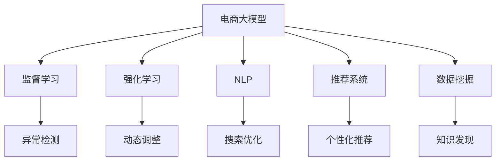

                 

# AI大模型在电商平台用户行为异常检测中的作用

> 关键词：电商、用户行为、异常检测、AI大模型、监督学习、强化学习、NLP、推荐系统、数据挖掘

## 1. 背景介绍

### 1.1 问题由来
随着电商市场的快速发展和消费者行为的日益复杂，用户行为异常检测（User Behavior Anomaly Detection, UBAD）成为了电商平台保障用户安全和维护交易秩序的关键任务。然而，传统的基于规则和统计方法的异常检测系统，往往需要大量的人工干预，难以适应不断变化的消费场景。

近年来，随着人工智能技术的不断突破，特别是深度学习和大模型技术的迅猛发展，基于AI大模型的用户行为异常检测方法开始受到广泛关注。大模型如BERT、GPT-3、Transformers等，通过在海量数据上进行预训练，学习到丰富的语义表示和模式识别能力，能够自动化、高效地捕捉用户行为中的异常模式，为电商平台提供了一个更智能、更灵活的解决方案。

### 1.2 问题核心关键点
大模型在电商领域的应用，主要围绕以下几个核心关键点展开：

1. **多维度数据融合**：电商平台的用户行为数据包括点击、浏览、购买、评价等多个维度，传统方法难以综合利用。大模型能够整合多源数据，提取共性和关联性特征，提升异常检测的全面性和准确性。
2. **实时性**：电商平台对异常检测的实时性要求较高，大模型在训练和推理上的高效性能，确保了系统能够快速响应用户行为变化。
3. **自适应性**：电商平台的用户行为随时间变化显著，大模型能够通过持续学习和更新，逐步适应用户行为的新模式。
4. **泛化能力**：大模型通过大规模数据预训练，具备较强的泛化能力，能够在不同的用户群体和场景下进行有效检测。

### 1.3 问题研究意义
AI大模型在电商平台用户行为异常检测中的应用，具有以下几方面的重要意义：

1. **提升安全性**：及时检测并应对异常行为，保障平台和用户的安全，防止欺诈、恶意行为等风险。
2. **优化用户体验**：识别异常用户行为，进行干预和引导，提高用户满意度和转化率。
3. **促进公平交易**：通过自动化检测，确保交易环境的公平公正，避免人为干扰。
4. **辅助决策**：结合用户行为数据和业务规则，为电商平台的运营决策提供数据支持，提升运营效率。
5. **加速技术迭代**：AI大模型的持续学习能力，使得异常检测模型能够不断优化，保持领先地位。

## 2. 核心概念与联系

### 2.1 核心概念概述

为更好地理解AI大模型在电商平台用户行为异常检测中的应用，本节将介绍几个密切相关的核心概念：

- **电商大模型(E-commerce Large Model)**：指针对电商场景专门设计或微调的深度学习模型，用于处理电商用户行为数据，包括用户点击、浏览、购买、评价等行为。
- **用户行为异常检测(UBAD)**：指在电商平台中，通过模型识别并标记用户行为中的异常模式，以便及时采取措施应对。
- **监督学习(Supervised Learning)**：指使用有标注数据训练模型，使其能够预测新样本标签的范式。
- **强化学习(Reinforcement Learning)**：指通过与环境交互，逐步优化模型策略，使其在特定任务上表现更好的学习范式。
- **自然语言处理(Natural Language Processing, NLP)**：指利用AI技术处理和分析自然语言数据，提取语义和语法信息，应用于电商搜索、推荐、客服等场景。
- **推荐系统(Recommendation System)**：指通过分析用户历史行为和偏好，提供个性化的商品推荐，提升用户体验和转化率。
- **数据挖掘(Data Mining)**：指从大量数据中提取有用信息和知识的过程，包括聚类、分类、关联规则挖掘等。

这些核心概念之间的逻辑关系可以通过以下Mermaid流程图来展示：



这个流程图展示了大模型的核心概念及其之间的关系：

1. 大模型通过监督学习、强化学习等手段，从电商用户行为数据中学习异常模式。
2. 自然语言处理技术被用于处理电商文本数据，提取用户行为中的语义信息。
3. 推荐系统和大模型结合，提供个性化的商品推荐，提升用户满意度。
4. 数据挖掘技术用于分析和挖掘用户行为中的潜在模式和关联规则。
5. 异常检测模型在监督学习基础上，进一步通过强化学习动态优化，提升检测精度。

这些概念共同构成了电商平台用户行为异常检测的技术框架，使得AI大模型能够在该场景下发挥强大的应用潜力。

## 3. 核心算法原理 & 具体操作步骤

### 3.1 算法原理概述

基于AI大模型的电商平台用户行为异常检测方法，通常结合了监督学习和强化学习的优点，通过多源数据融合、实时性增强、自适应优化和泛化能力提升，实现高效精准的异常检测。

形式化地，假设电商平台的用户行为数据为 $D=\{(x_i,y_i)\}_{i=1}^N$，其中 $x_i$ 表示用户行为序列，$y_i$ 表示是否为异常行为（二分类问题）。假设训练集 $D$ 已经标注，目标是通过大模型 $M_{\theta}$ 预测新样本 $x$ 的异常行为概率 $p(y|x)$。监督学习范式下的目标是最小化预测误差，即：

$$
\hat{\theta}=\mathop{\arg\min}_{\theta} \mathcal{L}(M_{\theta},D)
$$

其中 $\mathcal{L}$ 为交叉熵损失函数，$M_{\theta}$ 为参数为 $\theta$ 的大模型。

在强化学习范式下，异常检测模型通过与电商平台的运营环境交互，不断调整策略以最大化收益（如用户满意度）。该过程可以形式化表示为：

$$
\hat{\theta}=\mathop{\arg\max}_{\theta} R(\theta) = \mathop{\arg\max}_{\theta} \sum_{i=1}^N \log p(y_i|x_i,\theta)
$$

其中 $R(\theta)$ 为模型在历史数据上的累积收益，$\log p(y_i|x_i,\theta)$ 为模型对历史数据中每个样本的预测损失。

### 3.2 算法步骤详解

基于AI大模型的电商平台用户行为异常检测方法一般包括以下几个关键步骤：

**Step 1: 数据预处理**
- 收集电商用户行为数据，包括点击、浏览、购买、评价等多个维度的行为记录。
- 对数据进行清洗和归一化处理，去除噪声和异常值，确保数据质量。

**Step 2: 模型选择与设计**
- 根据电商场景特点，选择合适的预训练模型（如BERT、GPT等），进行微调或自训练。
- 设计合适的输入特征和输出目标，如将用户行为序列作为输入，二分类标签作为输出。

**Step 3: 监督学习训练**
- 使用标注好的数据集进行模型训练，采用交叉熵等损失函数。
- 设置合适的学习率、批大小、迭代轮数等超参数，进行梯度下降等优化算法。

**Step 4: 强化学习优化**
- 在电商运营环境中，对异常检测模型进行在线强化学习，不断调整模型参数以提升检测精度。
- 利用A/B测试、多臂老虎机等策略，评估不同策略的效果，选择最优策略。

**Step 5: 模型评估与部署**
- 在验证集上评估模型性能，包括准确率、召回率、F1分数等指标。
- 将训练好的模型部署到电商平台的实时监控系统中，进行实时异常检测和预警。
- 定期更新模型，重新训练以适应新的用户行为模式。

以上是基于AI大模型的电商平台用户行为异常检测的一般流程。在实际应用中，还需要针对具体场景进行优化设计，如引入更多特征、选择合适的损失函数、动态调整策略等。

### 3.3 算法优缺点

基于AI大模型的电商平台用户行为异常检测方法具有以下优点：

1. **高效性**：大模型具有高效的推理能力，能够在电商平台的实时监控环境中快速响应异常检测需求。
2. **泛化能力强**：大模型通过大规模数据预训练，具备较强的泛化能力，能够适应不同用户群体的行为模式。
3. **自适应性强**：通过强化学习，异常检测模型能够不断适应电商平台的环境变化，保持检测效果的稳定性。
4. **集成性强**：大模型能够与电商平台现有的推荐系统、搜索优化等功能无缝集成，提升整体系统性能。

同时，该方法也存在一定的局限性：

1. **数据需求量大**：电商平台的异常检测需要大量标注数据进行监督学习，获取高质量标注数据的成本较高。
2. **计算资源消耗大**：大模型的训练和推理需要大量计算资源，对硬件设施要求较高。
3. **模型复杂度高**：大模型的结构和参数较多，增加了模型复杂性和调试难度。
4. **可解释性差**：大模型的决策过程较难解释，难以进行透明的异常检测和干预。

尽管存在这些局限性，但AI大模型在电商平台用户行为异常检测中的应用仍然展现出巨大的潜力，其高效性和泛化能力有望解决传统方法难以应对的问题，为电商平台带来更智能、更安全的用户行为监控体验。

### 3.4 算法应用领域

基于AI大模型的电商平台用户行为异常检测方法，已经在多个电商场景中得到了应用，包括但不限于以下几个领域：

- **反欺诈检测**：识别并阻止恶意下单、虚假支付等欺诈行为，保障交易安全。
- **风险管理**：监控用户账户活动，识别并拦截异常行为，减少经济损失。
- **市场监管**：监控商品评价和评论，检测并处理虚假评论和恶意操作，维护市场公平。
- **客户服务**：分析用户反馈，识别并解决用户不满和问题，提升客户满意度。
- **个性化推荐**：结合用户行为和异常检测结果，提供更精准的商品推荐，提升用户体验。

除了上述这些典型场景外，AI大模型在电商领域的应用还有待进一步探索，如智能客服、智能仓储等场景，未来有望带来更多创新和突破。

## 4. 数学模型和公式 & 详细讲解

### 4.1 数学模型构建

在电商平台用户行为异常检测中，我们通常使用监督学习范式，通过标注数据训练异常检测模型。假设电商平台用户行为数据为 $D=\{(x_i,y_i)\}_{i=1}^N$，其中 $x_i$ 表示用户行为序列，$y_i$ 表示是否为异常行为（二分类问题）。

定义模型 $M_{\theta}$ 在输入 $x$ 上的预测概率为 $p(y|x,\theta)$，目标是最小化经验风险：

$$
\mathcal{L}(\theta) = -\frac{1}{N}\sum_{i=1}^N y_i\log p(y_i|x_i,\theta) + (1-y_i)\log (1-p(y_i|x_i,\theta))
$$

在强化学习范式下，异常检测模型通过与电商平台的运营环境交互，不断调整策略以最大化收益 $R(\theta)$。该过程可以形式化表示为：

$$
R(\theta) = \sum_{i=1}^N \log p(y_i|x_i,\theta)
$$

在实际应用中，我们通常使用基于深度学习的异常检测模型，如BERT、LSTM、GRU等，进行监督学习和强化学习训练。

### 4.2 公式推导过程

以下我们以BERT模型为例，推导监督学习和强化学习中的异常检测公式。

**监督学习中的交叉熵损失函数**：
假设模型 $M_{\theta}$ 在输入 $x$ 上的预测概率为 $p(y|x,\theta)$，则二分类交叉熵损失函数为：

$$
\ell(M_{\theta}(x),y) = -[y\log p(y|x,\theta) + (1-y)\log (1-p(y|x,\theta))]
$$

将其代入经验风险公式，得：

$$
\mathcal{L}(\theta) = -\frac{1}{N}\sum_{i=1}^N [y_i\log p(y_i|x_i,\theta)+(1-y_i)\log(1-p(y_i|x_i,\theta))]
$$

**强化学习中的累积收益函数**：
假设模型 $M_{\theta}$ 在输入 $x$ 上的预测概率为 $p(y|x,\theta)$，则模型在历史数据上的累积收益为：

$$
R(\theta) = \sum_{i=1}^N \log p(y_i|x_i,\theta)
$$

在实际应用中，我们通常使用基于深度学习的异常检测模型，如BERT、LSTM、GRU等，进行监督学习和强化学习训练。

### 4.3 案例分析与讲解

以电商平台的用户行为异常检测为例，使用BERT模型进行异常检测的流程如下：

1. **数据准备**：收集电商平台用户行为数据，包括点击、浏览、购买、评价等多个维度的行为记录，进行清洗和归一化处理。
2. **模型训练**：选择合适的预训练BERT模型，进行微调或自训练。设计合适的输入特征和输出目标，如将用户行为序列作为输入，二分类标签作为输出。
3. **监督学习训练**：使用标注好的数据集进行模型训练，采用交叉熵等损失函数。设置合适的学习率、批大小、迭代轮数等超参数，进行梯度下降等优化算法。
4. **强化学习优化**：在电商运营环境中，对异常检测模型进行在线强化学习，不断调整模型参数以提升检测精度。利用A/B测试、多臂老虎机等策略，评估不同策略的效果，选择最优策略。
5. **模型评估与部署**：在验证集上评估模型性能，包括准确率、召回率、F1分数等指标。将训练好的模型部署到电商平台的实时监控系统中，进行实时异常检测和预警。
6. **持续学习**：定期更新模型，重新训练以适应新的用户行为模式。

## 5. 项目实践：代码实例和详细解释说明

### 5.1 开发环境搭建

在进行异常检测实践前，我们需要准备好开发环境。以下是使用Python进行PyTorch开发的环境配置流程：

1. 安装Anaconda：从官网下载并安装Anaconda，用于创建独立的Python环境。

2. 创建并激活虚拟环境：
```bash
conda create -n ecommerce-env python=3.8 
conda activate ecommerce-env
```

3. 安装PyTorch：根据CUDA版本，从官网获取对应的安装命令。例如：
```bash
conda install pytorch torchvision torchaudio cudatoolkit=11.1 -c pytorch -c conda-forge
```

4. 安装Transformers库：
```bash
pip install transformers
```

5. 安装各类工具包：
```bash
pip install numpy pandas scikit-learn matplotlib tqdm jupyter notebook ipython
```

完成上述步骤后，即可在`ecommerce-env`环境中开始异常检测实践。

### 5.2 源代码详细实现

下面我以用户行为异常检测为例，给出使用Transformers库对BERT模型进行异常检测的PyTorch代码实现。

首先，定义异常检测任务的数据处理函数：

```python
from transformers import BertTokenizer
from torch.utils.data import Dataset
import torch

class UserBehaviorDataset(Dataset):
    def __init__(self, behaviors, labels, tokenizer, max_len=128):
        self.behaviors = behaviors
        self.labels = labels
        self.tokenizer = tokenizer
        self.max_len = max_len
        
    def __len__(self):
        return len(self.behaviors)
    
    def __getitem__(self, item):
        behavior = self.behaviors[item]
        label = self.labels[item]
        
        encoding = self.tokenizer(behavior, return_tensors='pt', max_length=self.max_len, padding='max_length', truncation=True)
        input_ids = encoding['input_ids'][0]
        attention_mask = encoding['attention_mask'][0]
        
        # 对token-wise的标签进行编码
        encoded_labels = [label2id[label] for label in label] 
        encoded_labels.extend([label2id['normal']] * (self.max_len - len(encoded_labels)))
        labels = torch.tensor(encoded_labels, dtype=torch.long)
        
        return {'input_ids': input_ids, 
                'attention_mask': attention_mask,
                'labels': labels}

# 标签与id的映射
label2id = {'normal': 0, 'abnormal': 1}
id2label = {v: k for k, v in label2id.items()}

# 创建dataset
tokenizer = BertTokenizer.from_pretrained('bert-base-cased')

train_dataset = UserBehaviorDataset(train_behaviors, train_labels, tokenizer)
dev_dataset = UserBehaviorDataset(dev_behaviors, dev_labels, tokenizer)
test_dataset = UserBehaviorDataset(test_behaviors, test_labels, tokenizer)
```

然后，定义模型和优化器：

```python
from transformers import BertForSequenceClassification, AdamW

model = BertForSequenceClassification.from_pretrained('bert-base-cased', num_labels=len(label2id))

optimizer = AdamW(model.parameters(), lr=2e-5)
```

接着，定义训练和评估函数：

```python
from torch.utils.data import DataLoader
from tqdm import tqdm
from sklearn.metrics import classification_report

device = torch.device('cuda') if torch.cuda.is_available() else torch.device('cpu')
model.to(device)

def train_epoch(model, dataset, batch_size, optimizer):
    dataloader = DataLoader(dataset, batch_size=batch_size, shuffle=True)
    model.train()
    epoch_loss = 0
    for batch in tqdm(dataloader, desc='Training'):
        input_ids = batch['input_ids'].to(device)
        attention_mask = batch['attention_mask'].to(device)
        labels = batch['labels'].to(device)
        model.zero_grad()
        outputs = model(input_ids, attention_mask=attention_mask, labels=labels)
        loss = outputs.loss
        epoch_loss += loss.item()
        loss.backward()
        optimizer.step()
    return epoch_loss / len(dataloader)

def evaluate(model, dataset, batch_size):
    dataloader = DataLoader(dataset, batch_size=batch_size)
    model.eval()
    preds, labels = [], []
    with torch.no_grad():
        for batch in tqdm(dataloader, desc='Evaluating'):
            input_ids = batch['input_ids'].to(device)
            attention_mask = batch['attention_mask'].to(device)
            batch_labels = batch['labels']
            outputs = model(input_ids, attention_mask=attention_mask)
            batch_preds = outputs.logits.argmax(dim=2).to('cpu').tolist()
            batch_labels = batch_labels.to('cpu').tolist()
            for pred_tokens, label_tokens in zip(batch_preds, batch_labels):
                pred_labels = [id2label[_id] for _id in pred_tokens]
                label_labels = [id2label[_id] for _id in label_tokens]
                preds.append(pred_labels[:len(label_labels)])
                labels.append(label_labels)
                
    print(classification_report(labels, preds))
```

最后，启动训练流程并在测试集上评估：

```python
epochs = 5
batch_size = 16

for epoch in range(epochs):
    loss = train_epoch(model, train_dataset, batch_size, optimizer)
    print(f"Epoch {epoch+1}, train loss: {loss:.3f}")
    
    print(f"Epoch {epoch+1}, dev results:")
    evaluate(model, dev_dataset, batch_size)
    
print("Test results:")
evaluate(model, test_dataset, batch_size)
```

以上就是使用PyTorch对BERT进行用户行为异常检测任务的完整代码实现。可以看到，得益于Transformers库的强大封装，我们可以用相对简洁的代码完成BERT模型的加载和训练。

### 5.3 代码解读与分析

让我们再详细解读一下关键代码的实现细节：

**UserBehaviorDataset类**：
- `__init__`方法：初始化行为序列、标签、分词器等关键组件。
- `__len__`方法：返回数据集的样本数量。
- `__getitem__`方法：对单个样本进行处理，将行为序列输入编码为token ids，将标签编码为数字，并对其进行定长padding，最终返回模型所需的输入。

**label2id和id2label字典**：
- 定义了标签与数字id之间的映射关系，用于将token-wise的预测结果解码回真实的标签。

**训练和评估函数**：
- 使用PyTorch的DataLoader对数据集进行批次化加载，供模型训练和推理使用。
- 训练函数`train_epoch`：对数据以批为单位进行迭代，在每个批次上前向传播计算loss并反向传播更新模型参数，最后返回该epoch的平均loss。
- 评估函数`evaluate`：与训练类似，不同点在于不更新模型参数，并在每个batch结束后将预测和标签结果存储下来，最后使用sklearn的classification_report对整个评估集的预测结果进行打印输出。

**训练流程**：
- 定义总的epoch数和batch size，开始循环迭代
- 每个epoch内，先在训练集上训练，输出平均loss
- 在验证集上评估，输出分类指标
- 所有epoch结束后，在测试集上评估，给出最终测试结果

可以看到，PyTorch配合Transformers库使得BERT异常检测的代码实现变得简洁高效。开发者可以将更多精力放在数据处理、模型改进等高层逻辑上，而不必过多关注底层的实现细节。

当然，工业级的系统实现还需考虑更多因素，如模型的保存和部署、超参数的自动搜索、更灵活的任务适配层等。但核心的异常检测范式基本与此类似。

## 6. 实际应用场景
### 6.1 智能客服系统

基于AI大模型的用户行为异常检测，可以应用于智能客服系统的构建。传统客服往往需要配备大量人力，高峰期响应缓慢，且一致性和专业性难以保证。而使用异常检测模型，可以实时监控客服行为，及时识别并处理异常交互，提升客服效率和质量。

在技术实现上，可以收集客服系统的通话记录、聊天记录等数据，将用户行为序列作为输入，标注正常和异常行为作为输出，在此基础上对预训练模型进行微调。微调后的模型能够自动理解用户意图，检测异常行为，自动进行干预或报警，确保客服系统的稳定运行。

### 6.2 金融舆情监测

金融机构需要实时监测市场舆论动向，以便及时应对负面信息传播，规避金融风险。传统的人工监测方式成本高、效率低，难以应对网络时代海量信息爆发的挑战。基于AI大模型的异常检测模型，为金融舆情监测提供了新的解决方案。

具体而言，可以收集金融领域相关的新闻、报道、评论等文本数据，并对其进行主题标注和情感标注。在此基础上对预训练语言模型进行微调，使其能够自动判断文本属于何种主题，情感倾向是正面、中性还是负面。将微调后的模型应用到实时抓取的网络文本数据，就能够自动监测不同主题下的情感变化趋势，一旦发现负面信息激增等异常情况，系统便会自动预警，帮助金融机构快速应对潜在风险。

### 6.3 个性化推荐系统

当前的推荐系统往往只依赖用户的历史行为数据进行物品推荐，无法深入理解用户的真实兴趣偏好。基于AI大模型的异常检测模型，可以进一步挖掘用户行为中的异常模式，识别出可能存在偏好的异常行为，为推荐系统提供更多的用户兴趣点。

在实践中，可以收集用户浏览、点击、购买、评价等行为数据，提取和用户交互的物品标题、描述、标签等文本内容。将文本内容作为模型输入，用户的后续行为（如是否点击、购买等）作为监督信号，在此基础上微调预训练语言模型。微调后的模型能够从文本内容中准确把握用户的兴趣点。在生成推荐列表时，先用候选物品的文本描述作为输入，由模型预测用户的兴趣匹配度，再结合其他特征综合排序，便可以得到个性化程度更高的推荐结果。

### 6.4 未来应用展望

随着AI大模型和异常检测方法的不断发展，基于异常检测范式将在更多领域得到应用，为传统行业带来变革性影响。

在智慧医疗领域，基于异常检测的医疗问答、病历分析、药物研发等应用将提升医疗服务的智能化水平，辅助医生诊疗，加速新药开发进程。

在智能教育领域，异常检测技术可应用于作业批改、学情分析、知识推荐等方面，因材施教，促进教育公平，提高教学质量。

在智慧城市治理中，异常检测模型可应用于城市事件监测、舆情分析、应急指挥等环节，提高城市管理的自动化和智能化水平，构建更安全、高效的未来城市。

此外，在企业生产、社会治理、文娱传媒等众多领域，基于AI大模型的异常检测技术也将不断涌现，为经济社会发展注入新的动力。相信随着技术的日益成熟，异常检测方法将成为人工智能落地应用的重要范式，推动人工智能技术在垂直行业的规模化落地。总之，异常检测需要开发者根据具体任务，不断迭代和优化模型、数据和算法，方能得到理想的效果。

## 7. 工具和资源推荐
### 7.1 学习资源推荐

为了帮助开发者系统掌握AI大模型在电商平台用户行为异常检测的理论基础和实践技巧，这里推荐一些优质的学习资源：

1. 《Transformer from Principals to Practice》系列博文：由大模型技术专家撰写，深入浅出地介绍了Transformer原理、BERT模型、异常检测技术等前沿话题。

2. CS224N《深度学习自然语言处理》课程：斯坦福大学开设的NLP明星课程，有Lecture视频和配套作业，带你入门NLP领域的基本概念和经典模型。

3. 《Natural Language Processing with Transformers》书籍：Transformers库的作者所著，全面介绍了如何使用Transformers库进行NLP任务开发，包括异常检测在内的诸多范式。

4. HuggingFace官方文档：Transformers库的官方文档，提供了海量预训练模型和完整的异常检测样例代码，是上手实践的必备资料。

5. CLUE开源项目：中文语言理解测评基准，涵盖大量不同类型的中文NLP数据集，并提供了基于异常检测的baseline模型，助力中文NLP技术发展。

通过对这些资源的学习实践，相信你一定能够快速掌握AI大模型在电商平台异常检测的应用精髓，并用于解决实际的NLP问题。
###  7.2 开发工具推荐

高效的开发离不开优秀的工具支持。以下是几款用于AI大模型异常检测开发的常用工具：

1. PyTorch：基于Python的开源深度学习框架，灵活动态的计算图，适合快速迭代研究。大部分预训练语言模型都有PyTorch版本的实现。

2. TensorFlow：由Google主导开发的开源深度学习框架，生产部署方便，适合大规模工程应用。同样有丰富的预训练语言模型资源。

3. Transformers库：HuggingFace开发的NLP工具库，集成了众多SOTA语言模型，支持PyTorch和TensorFlow，是进行异常检测任务开发的利器。

4. Weights & Biases：模型训练的实验跟踪工具，可以记录和可视化模型训练过程中的各项指标，方便对比和调优。与主流深度学习框架无缝集成。

5. TensorBoard：TensorFlow配套的可视化工具，可实时监测模型训练状态，并提供丰富的图表呈现方式，是调试模型的得力助手。

6. Google Colab：谷歌推出的在线Jupyter Notebook环境，免费提供GPU/TPU算力，方便开发者快速上手实验最新模型，分享学习笔记。

合理利用这些工具，可以显著提升AI大模型异常检测任务的开发效率，加快创新迭代的步伐。

### 7.3 相关论文推荐

AI大模型和异常检测技术的发展源于学界的持续研究。以下是几篇奠基性的相关论文，推荐阅读：

1. Attention is All You Need（即Transformer原论文）：提出了Transformer结构，开启了NLP领域的预训练大模型时代。

2. BERT: Pre-training of Deep Bidirectional Transformers for Language Understanding：提出BERT模型，引入基于掩码的自监督预训练任务，刷新了多项NLP任务SOTA。

3. Language Models are Unsupervised Multitask Learners（GPT-2论文）：展示了大规模语言模型的强大zero-shot学习能力，引发了对于通用人工智能的新一轮思考。

4. Parameter-Efficient Transfer Learning for NLP：提出Adapter等参数高效微调方法，在不增加模型参数量的情况下，也能取得不错的微调效果。

5. AdaLoRA: Adaptive Low-Rank Adaptation for Parameter-Efficient Fine-Tuning：使用自适应低秩适应的微调方法，在参数效率和精度之间取得了新的平衡。

6. Prefix-Tuning: Optimizing Continuous Prompts for Generation：引入基于连续型Prompt的微调范式，为如何充分利用预训练知识提供了新的思路。

这些论文代表了大模型和异常检测技术的发展脉络。通过学习这些前沿成果，可以帮助研究者把握学科前进方向，激发更多的创新灵感。

## 8. 总结：未来发展趋势与挑战

### 8.1 总结

本文对基于AI大模型的电商平台用户行为异常检测方法进行了全面系统的介绍。首先阐述了AI大模型和异常检测技术的研究背景和意义，明确了异常检测在电商平台用户行为监控中的重要价值。其次，从原理到实践，详细讲解了监督学习、强化学习在异常检测中的应用，给出了异常检测任务开发的完整代码实例。同时，本文还广泛探讨了异常检测方法在智能客服、金融舆情、个性化推荐等多个电商场景中的应用前景，展示了异常检测范式的巨大潜力。此外，本文精选了异常检测技术的各类学习资源，力求为读者提供全方位的技术指引。

通过本文的系统梳理，可以看到，基于AI大模型的异常检测方法正在成为电商平台监控系统的核心技术，极大地提升了平台的安全性和用户体验。未来，伴随预训练语言模型和异常检测方法的持续演进，基于异常检测范式必将在更多领域得到应用，为各行各业带来新的变革。

### 8.2 未来发展趋势

展望未来，AI大模型在电商平台异常检测中的应用将呈现以下几个发展趋势：

1. **多模态融合**：电商平台的用户行为数据不仅包含文本信息，还包括图像、语音、视频等多模态数据。未来的异常检测模型将能够整合多源数据，提取共性和关联性特征，提升检测精度和泛化能力。

2. **动态调整**：异常检测模型能够实时地根据电商平台的运营环境变化，动态调整策略，提升检测效果。基于强化学习的方法，可以实现更灵活、自适应的异常检测。

3. **模型压缩**：随着AI大模型的参数量不断增长，其在电商平台的实时部署面临计算资源和存储空间的限制。未来的异常检测模型将通过模型压缩、量化等技术，提升模型效率，满足实时性需求。

4. **知识图谱集成**：将符号化的先验知识，如知识图谱、逻辑规则等，与神经网络模型进行巧妙融合，增强异常检测模型的因果推断能力和泛化能力。

5. **因果推理**：结合因果分析方法，识别出异常检测过程中因果关系的关键特征，增强模型的可解释性和决策可靠性。

6. **自监督学习**：利用无监督学习技术，从大量非标注数据中学习异常模式，减少对标注数据的需求，提升模型的泛化性和鲁棒性。

以上趋势凸显了AI大模型在电商平台异常检测中的未来潜力。这些方向的探索发展，必将进一步提升异常检测模型的性能和应用范围，为电商平台带来更智能、更安全的用户行为监控体验。

### 8.3 面临的挑战

尽管AI大模型在电商平台异常检测中的应用取得了显著成效，但在迈向更加智能化、普适化应用的过程中，仍面临以下挑战：

1. **数据质量与标注成本**：异常检测需要大量高质量标注数据进行监督学习，标注成本较高。如何高效获取和利用标注数据，是异常检测技术进一步发展的关键。

2. **计算资源消耗**：AI大模型的训练和推理需要大量计算资源，对硬件设施要求较高。如何在保证精度的情况下，优化模型结构，降低计算消耗，是异常检测技术在实际应用中需要解决的问题。

3. **模型可解释性**：异常检测模型的决策过程较难解释，难以进行透明的异常检测和干预。如何提高模型的可解释性，是异常检测技术发展的方向之一。

4. **模型鲁棒性**：异常检测模型面临多变的电商运营环境，如何提高模型的鲁棒性，避免对数据分布的过拟合，是异常检测技术需要解决的挑战。

5. **数据隐私保护**：异常检测需要收集和处理大量的用户行为数据，如何保护用户隐私和数据安全，是异常检测技术发展的难点之一。

6. **模型公平性**：异常检测模型容易受到训练数据中偏见的影响，如何设计公平、无偏见的异常检测模型，是异常检测技术发展的目标之一。

这些挑战需要多方共同努力，通过技术创新和政策引导，才能逐步解决，推动AI大模型在电商平台异常检测中的广泛应用。

### 8.4 研究展望

面对AI大模型异常检测所面临的种种挑战，未来的研究需要在以下几个方面寻求新的突破：

1. **无监督学习和半监督学习**：探索利用无监督和半监督学习技术，从大量非标注数据中学习异常模式，减少对标注数据的需求，提升模型的泛化性和鲁棒性。

2. **模型压缩与优化**：开发更加参数高效和计算高效的异常检测模型，通过模型压缩、量化等技术，提升模型效率，满足实时性需求。

3. **因果推理与强化学习**：结合因果分析方法和强化学习技术，增强异常检测模型的因果推断能力和自适应性，提高检测精度和鲁棒性。

4. **多模态数据融合**：探索多模态数据融合技术，整合电商平台的文本、图像、语音、视频等多源数据，提取共性和关联性特征，提升异常检测的全面性和准确性。

5. **知识图谱集成**：将符号化的先验知识，如知识图谱、逻辑规则等，与神经网络模型进行巧妙融合，增强异常检测模型的因果推断能力和泛化能力。

6. **自适应与动态调整**：探索自适应学习技术，使异常检测模型能够实时地根据电商平台的运营环境变化，动态调整策略，提升检测效果。

7. **模型公平性与可解释性**：研究设计公平、无偏见的异常检测模型，增强模型的可解释性，提升异常检测的透明性和可靠性。

这些研究方向的发展，将引领AI大模型在电商平台异常检测技术迈向更高的台阶，为电商平台带来更智能、更安全的用户行为监控体验。

## 9. 附录：常见问题与解答

**Q1：AI大模型在电商平台异常检测中的应用是否会引入隐私风险？**

A: AI大模型在电商平台异常检测中的应用，需要收集和处理大量的用户行为数据，这可能会涉及用户隐私和数据安全问题。为避免隐私风险，可以采用差分隐私、联邦学习等技术，确保用户数据的安全性和匿名性。同时，需遵守相关法律法规，如GDPR、CCPA等，确保数据处理的合法性和合规性。

**Q2：异常检测模型如何评估和优化？**

A: 异常检测模型的评估通常包括准确率、召回率、F1分数、ROC曲线等指标。在电商场景中，模型评估可以采用A/B测试、交叉验证等方法。模型优化可以通过超参数调优、模型压缩、特征工程等手段，提高模型性能和实时性。

**Q3：异常检测模型如何应对动态环境？**

A: 电商平台的用户行为随时间变化显著，异常检测模型需要具备动态调整能力，以应对环境变化。基于强化学习的方法，可以在电商平台的运营环境中，不断调整模型参数，提升检测精度和实时性。同时，采用多臂老虎机策略，可以有效应对电商平台的流量波动和用户行为变化。

**Q4：异常检测模型如何与推荐系统结合？**

A: 异常检测模型可以与推荐系统结合，通过识别异常行为，及时干预和引导用户，提高推荐系统的个性化和精准度。具体而言，可以通过对异常用户的行为进行分析和调整，优化推荐算法，提高推荐效果。

**Q5：异常检测模型是否会受到数据分布的影响？**

A: 异常检测模型会受到训练数据分布的影响，特别是在数据不平衡的情况下，容易产生偏差。为应对数据分布变化，可以采用自适应学习技术，使模型能够根据电商平台的运营环境变化，动态调整策略，提升检测效果。同时，通过数据增强、正则化等技术，增强模型的鲁棒性。

这些问题的解答，希望能够帮助开发者更好地理解AI大模型在电商平台异常检测中的应用，并有效应对实际应用中的挑战。

