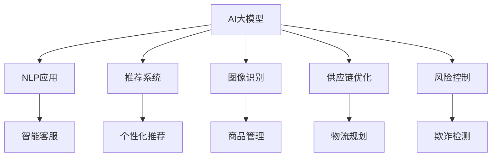

                 

# AI大模型在跨境电商中的应用价值

> 关键词：AI大模型,跨境电商,自然语言处理(NLP),推荐系统,图像识别,供应链优化,风险控制

## 1. 背景介绍

### 1.1 问题由来
跨境电商作为全球贸易的重要组成部分，近年来呈现蓬勃发展态势。随着电子商务平台的兴起和物流技术的进步，跨境交易越来越便捷，消费者群体也在不断扩大。然而，跨境电商的业务场景复杂多样，包括但不限于商品推荐、物流跟踪、客户服务、风险控制等多个方面。这些场景下，高效、精准、可解释的AI技术能够显著提升用户体验和商家运营效率。

### 1.2 问题核心关键点
AI技术在跨境电商中的应用，主要集中在自然语言处理(NLP)、推荐系统、图像识别、供应链优化、风险控制等多个领域。AI大模型通过预训练的方式，学习到丰富的知识表征，可以在这些领域提供强大的支撑，大幅提升电商平台的智能化水平。

大模型作为AI领域的技术前沿，其核心优势在于：
1. 自监督学习：能够从大规模无标注数据中自动学习出有意义的特征表示。
2. 泛化能力强：对不同的数据分布具有较好的泛化能力，可以较好地适应不同的应用场景。
3. 参数高效：通常需要较小的计算资源，能够在有限的硬件条件下快速部署。
4. 可解释性强：大模型能够提供推理过程中的中间表示，便于开发者调试和优化。

### 1.3 问题研究意义
AI大模型在跨境电商中的应用研究，有助于提升电商平台的技术实力和市场竞争力。具体来说：
1. 提升用户体验：通过智能客服、个性化推荐等技术，提供更加个性化的购物体验。
2. 降低运营成本：自动化物流、风险控制等技术，能够降低平台运营中的成本。
3. 拓展市场空间：通过多语言处理能力，更好地覆盖全球市场，扩大用户群体。
4. 增强风险管理：通过预测分析，有效防范潜在的欺诈行为和供应链风险。

## 2. 核心概念与联系

### 2.1 核心概念概述

为更好地理解AI大模型在跨境电商中的应用，本节将介绍几个密切相关的核心概念：

- AI大模型(AI Large Model)：如BERT、GPT、XLNet等大规模预训练语言模型，通过自监督学习的方式学习到丰富的语言知识，能够用于自然语言理解、生成、推荐等多个任务。
- 自然语言处理(NLP)：研究如何让计算机理解、处理和生成人类语言的技术，是AI大模型应用的重要领域之一。
- 推荐系统(Recommendation System)：利用AI技术为用户推荐符合其兴趣的商家、商品等，以提升用户体验和销售转化率。
- 图像识别(Image Recognition)：通过AI模型对商品图片进行特征提取和分类，帮助平台进行商品管理、搜索排序等。
- 供应链优化(Supply Chain Optimization)：利用AI模型进行物流规划、库存管理、需求预测等，提升供应链效率。
- 风险控制(Risk Control)：通过预测分析模型对用户行为、交易风险进行评估和预警，保障交易安全。

这些核心概念之间的逻辑关系可以通过以下Mermaid流程图来展示：



这个流程图展示了大模型在跨境电商中的核心应用，以及不同应用之间的联系：

1. 大模型通过NLP应用提供智能客服、智能搜索、智能广告等支持。
2. 推荐系统通过大模型学习用户行为和商品特征，提供个性化的商品推荐。
3. 图像识别通过大模型提取商品特征，支持搜索排序、库存管理等功能。
4. 供应链优化利用大模型预测需求，进行物流优化。
5. 风险控制通过大模型学习用户行为，预测和防范欺诈风险。

## 3. 核心算法原理 & 具体操作步骤
### 3.1 算法原理概述

AI大模型在跨境电商中的应用，本质上是利用大模型预训练的知识，结合特定的业务任务，通过微调或指令调整等方法，使其能够执行特定的任务。这些应用的核心算法原理如下：

1. **NLP应用**：基于大模型构建的智能客服、智能搜索、智能广告等系统，通过微调模型或调整任务指令，使其具备特定任务的能力。
2. **推荐系统**：利用大模型进行用户行为分析和商品特征提取，通过修改推荐算法，实现个性化的商品推荐。
3. **图像识别**：基于大模型构建的图像分类、特征提取等系统，通过微调或指令调整，使其能够处理不同类别的商品图片。
4. **供应链优化**：利用大模型进行需求预测、库存管理等任务，通过优化算法模型，提高供应链效率。
5. **风险控制**：利用大模型进行用户行为分析和交易风险预测，通过微调或调整算法，防范潜在的欺诈行为。

### 3.2 算法步骤详解

AI大模型在跨境电商中的应用，涉及多个核心步骤。以下将详细介绍每个步骤的实现：

**Step 1: 数据准备与预处理**

- **数据收集**：收集平台上的用户行为数据、商品信息、交易记录等。
- **数据清洗**：对数据进行清洗、去重、缺失值处理等操作。
- **数据标注**：根据具体应用场景，对数据进行标注，如标注用户行为、商品特征、物流状态等。

**Step 2: 模型选择与配置**

- **模型选择**：根据应用场景选择合适的预训练模型，如BERT、GPT等。
- **配置优化**：根据任务特点，调整模型的参数配置，如调整学习率、批大小等。

**Step 3: 模型微调与优化**

- **微调训练**：在标注数据上对模型进行微调，训练得到适应特定任务模型的权重。
- **超参数调优**：通过交叉验证等方法，选择最优的超参数组合，进一步优化模型性能。
- **模型评估**：在验证集或测试集上评估模型性能，确保模型达到预期效果。

**Step 4: 模型部署与监控**

- **模型部署**：将训练好的模型部署到生产环境中，供业务系统调用。
- **性能监控**：实时监控模型性能，及时发现和解决异常问题，确保系统稳定运行。
- **用户反馈**：收集用户反馈，不断迭代优化模型，提升用户体验。

### 3.3 算法优缺点

AI大模型在跨境电商中的应用，具有以下优点：
1. **高效性**：大模型通常只需要较小的计算资源，能够快速部署和优化。
2. **泛化能力强**：大模型能够处理不同分布的数据，适应不同的应用场景。
3. **可解释性强**：大模型能够提供推理过程中的中间表示，便于开发者调试和优化。
4. **多场景适用**：大模型能够在多个业务场景中进行应用，提升电商平台整体智能化水平。

同时，大模型在跨境电商中应用也存在一些局限性：
1. **数据需求高**：某些应用场景下，需要大量的标注数据，获取成本较高。
2. **模型复杂**：大模型结构复杂，需要专业人员进行维护和调优。
3. **技术门槛高**：需要较强的数据处理、模型训练、调优等技术能力。
4. **性能不稳定**：大模型的输出可能存在一定的不确定性，需要进一步优化。

### 3.4 算法应用领域

AI大模型在跨境电商中的应用，主要涵盖以下几个领域：

1. **智能客服**：利用NLP技术，构建智能客服系统，提高用户满意度。
2. **个性化推荐**：通过推荐系统，提供个性化的商品推荐，提升转化率。
3. **图像识别**：利用图像识别技术，提升商品管理、搜索排序等功能的准确性。
4. **供应链优化**：通过AI模型进行需求预测、库存管理等，提升供应链效率。
5. **风险控制**：利用风险控制模型，防范潜在的欺诈行为，保障交易安全。

这些应用领域的深入研究，能够为跨境电商平台的运营提供强大的技术支持，带来显著的业务价值。

## 4. 数学模型和公式 & 详细讲解  
### 4.1 数学模型构建

AI大模型在跨境电商中的应用，涉及多个数学模型的构建，以下是一些常见的数学模型及其构建方式：

**NLP应用**：
- **智能客服**：基于大模型构建的智能客服系统，通常使用Seq2Seq模型或Transformer模型，通过微调或指令调整，使其能够理解用户意图并提供合适的回复。
- **智能搜索**：利用大模型构建的智能搜索系统，通常使用BERT等模型，通过微调或调整任务指令，使其能够理解查询意图并提供相关搜索结果。

**推荐系统**：
- **协同过滤**：利用大模型进行用户行为分析和商品特征提取，通过协同过滤算法进行推荐。
- **矩阵分解**：利用大模型进行用户行为分析和商品特征提取，通过矩阵分解方法进行推荐。

**图像识别**：
- **卷积神经网络(CNN)**：利用大模型进行图像分类和特征提取，通过卷积神经网络结构进行训练。
- **Transformer模型**：利用大模型进行图像特征提取和分类，通过Transformer模型进行训练。

**供应链优化**：
- **线性回归模型**：利用大模型进行需求预测和库存管理，通过线性回归模型进行训练。
- **随机森林模型**：利用大模型进行需求预测和库存管理，通过随机森林模型进行训练。

**风险控制**：
- **决策树模型**：利用大模型进行用户行为分析和交易风险预测，通过决策树模型进行训练。
- **神经网络模型**：利用大模型进行用户行为分析和交易风险预测，通过神经网络模型进行训练。

### 4.2 公式推导过程

以下以智能客服系统为例，推导基于大模型的智能客服系统训练过程。

假设智能客服系统的任务是回答用户问题，输入为问题文本，输出为预定义的回答模板。令问题文本为 $X$，回答模板为 $Y$，其中 $X$ 和 $Y$ 都是固定长度的向量。

设大模型为 $M_{\theta}$，其中 $\theta$ 为模型参数。智能客服系统通过微调或指令调整，使得模型能够对输入问题 $X$ 进行编码，输出合适的回答模板 $Y$。

智能客服系统的训练过程如下：

1. 输入问题文本 $X$，通过大模型 $M_{\theta}$ 编码，得到编码向量 $H$。
2. 将编码向量 $H$ 作为输入，通过全连接层得到回答模板 $Y$ 的预测向量 $\hat{Y}$。
3. 计算预测向量 $\hat{Y}$ 与真实答案 $Y$ 的交叉熵损失函数 $\ell$。
4. 使用梯度下降等优化算法，更新模型参数 $\theta$，最小化损失函数 $\ell$。

具体推导过程如下：

$$
\ell(M_{\theta}(X),Y) = -\sum_i \log\sigma(\hat{Y_i})
$$

其中，$\sigma(\cdot)$ 为sigmoid函数，$\hat{Y_i}$ 为模型预测的第 $i$ 个回答模板的概率分布。

**公式推导**：
1. 输入问题文本 $X$，通过大模型 $M_{\theta}$ 编码，得到编码向量 $H$。
2. 将编码向量 $H$ 作为输入，通过全连接层得到回答模板 $Y$ 的预测向量 $\hat{Y}$。
3. 计算预测向量 $\hat{Y}$ 与真实答案 $Y$ 的交叉熵损失函数 $\ell$。

### 4.3 案例分析与讲解

**案例1: 智能客服系统**

智能客服系统利用NLP技术，构建智能客服机器人，通过微调或指令调整，使其能够理解用户意图并提供合适的回复。以下是智能客服系统的主要实现流程：

1. **数据准备与预处理**：收集用户问题与客服回复数据，进行清洗和标注。
2. **模型选择与配置**：选择BERT模型，调整学习率和批大小等超参数。
3. **模型微调与优化**：在标注数据上对模型进行微调，通过交叉验证选择最优超参数。
4. **模型评估与部署**：在验证集上评估模型性能，将模型部署到生产环境中。

智能客服系统通过大模型预训练知识，结合微调或指令调整，实现对用户问题的理解和回答，极大地提升了用户满意度。

**案例2: 个性化推荐系统**

个性化推荐系统利用推荐算法和AI技术，为每个用户提供个性化的商品推荐。以下是个性化推荐系统的实现流程：

1. **数据准备与预处理**：收集用户行为数据和商品信息，进行清洗和标注。
2. **模型选择与配置**：选择BERT模型，调整学习率和批大小等超参数。
3. **模型微调与优化**：在标注数据上对模型进行微调，通过交叉验证选择最优超参数。
4. **模型评估与部署**：在验证集上评估模型性能，将模型部署到推荐系统中。

个性化推荐系统通过大模型预训练知识，结合微调或指令调整，实现对用户行为的分析和推荐，提升了用户体验和销售转化率。

## 5. 项目实践：代码实例和详细解释说明
### 5.1 开发环境搭建

在进行AI大模型在跨境电商中的应用实践前，我们需要准备好开发环境。以下是使用Python进行PyTorch开发的环境配置流程：

1. 安装Anaconda：从官网下载并安装Anaconda，用于创建独立的Python环境。

2. 创建并激活虚拟环境：
```bash
conda create -n pytorch-env python=3.8 
conda activate pytorch-env
```

3. 安装PyTorch：根据CUDA版本，从官网获取对应的安装命令。例如：
```bash
conda install pytorch torchvision torchaudio cudatoolkit=11.1 -c pytorch -c conda-forge
```

4. 安装Transformers库：
```bash
pip install transformers
```

5. 安装各类工具包：
```bash
pip install numpy pandas scikit-learn matplotlib tqdm jupyter notebook ipython
```

完成上述步骤后，即可在`pytorch-env`环境中开始实践。

### 5.2 源代码详细实现

以下以智能客服系统为例，给出使用Transformers库对BERT模型进行微调的PyTorch代码实现。

首先，定义智能客服系统任务的数据处理函数：

```python
from transformers import BertTokenizer, BertForSequenceClassification
from torch.utils.data import Dataset
import torch

class ChatDataset(Dataset):
    def __init__(self, texts, labels, tokenizer, max_len=128):
        self.texts = texts
        self.labels = labels
        self.tokenizer = tokenizer
        self.max_len = max_len
        
    def __len__(self):
        return len(self.texts)
    
    def __getitem__(self, item):
        text = self.texts[item]
        label = self.labels[item]
        
        encoding = self.tokenizer(text, return_tensors='pt', max_length=self.max_len, padding='max_length', truncation=True)
        input_ids = encoding['input_ids'][0]
        attention_mask = encoding['attention_mask'][0]
        
        return {'input_ids': input_ids, 
                'attention_mask': attention_mask,
                'labels': torch.tensor(label, dtype=torch.long)}
```

然后，定义模型和优化器：

```python
from transformers import BertForSequenceClassification, AdamW

model = BertForSequenceClassification.from_pretrained('bert-base-cased', num_labels=2)

optimizer = AdamW(model.parameters(), lr=2e-5)
```

接着，定义训练和评估函数：

```python
from torch.utils.data import DataLoader
from tqdm import tqdm
from sklearn.metrics import accuracy_score

device = torch.device('cuda') if torch.cuda.is_available() else torch.device('cpu')
model.to(device)

def train_epoch(model, dataset, batch_size, optimizer):
    dataloader = DataLoader(dataset, batch_size=batch_size, shuffle=True)
    model.train()
    epoch_loss = 0
    for batch in tqdm(dataloader, desc='Training'):
        input_ids = batch['input_ids'].to(device)
        attention_mask = batch['attention_mask'].to(device)
        labels = batch['labels'].to(device)
        model.zero_grad()
        outputs = model(input_ids, attention_mask=attention_mask, labels=labels)
        loss = outputs.loss
        epoch_loss += loss.item()
        loss.backward()
        optimizer.step()
    return epoch_loss / len(dataloader)

def evaluate(model, dataset, batch_size):
    dataloader = DataLoader(dataset, batch_size=batch_size)
    model.eval()
    preds, labels = [], []
    with torch.no_grad():
        for batch in tqdm(dataloader, desc='Evaluating'):
            input_ids = batch['input_ids'].to(device)
            attention_mask = batch['attention_mask'].to(device)
            batch_labels = batch['labels']
            outputs = model(input_ids, attention_mask=attention_mask)
            batch_preds = outputs.logits.argmax(dim=2).to('cpu').tolist()
            batch_labels = batch_labels.to('cpu').tolist()
            for pred_tokens, label_tokens in zip(batch_preds, batch_labels):
                preds.append(pred_tokens)
                labels.append(label_tokens)
                
    print(f"Accuracy: {accuracy_score(labels, preds)}")
```

最后，启动训练流程并在测试集上评估：

```python
epochs = 5
batch_size = 16

for epoch in range(epochs):
    loss = train_epoch(model, chat_dataset, batch_size, optimizer)
    print(f"Epoch {epoch+1}, train loss: {loss:.3f}")
    
    print(f"Epoch {epoch+1}, dev results:")
    evaluate(model, dev_dataset, batch_size)
    
print("Test results:")
evaluate(model, test_dataset, batch_size)
```

以上就是使用PyTorch对BERT进行智能客服系统微调的完整代码实现。可以看到，得益于Transformers库的强大封装，我们可以用相对简洁的代码完成BERT模型的加载和微调。

### 5.3 代码解读与分析

让我们再详细解读一下关键代码的实现细节：

**ChatDataset类**：
- `__init__`方法：初始化文本、标签、分词器等关键组件。
- `__len__`方法：返回数据集的样本数量。
- `__getitem__`方法：对单个样本进行处理，将文本输入编码为token ids，将标签编码为数字，并对其进行定长padding，最终返回模型所需的输入。

**模型和优化器定义**：
- 使用BertForSequenceClassification从预训练模型中初始化模型。
- 定义AdamW优化器，学习率为2e-5。

**训练和评估函数**：
- 使用PyTorch的DataLoader对数据集进行批次化加载，供模型训练和推理使用。
- 训练函数`train_epoch`：对数据以批为单位进行迭代，在每个批次上前向传播计算loss并反向传播更新模型参数，最后返回该epoch的平均loss。
- 评估函数`evaluate`：与训练类似，不同点在于不更新模型参数，并在每个batch结束后将预测和标签结果存储下来，最后使用sklearn的accuracy_score对整个评估集的预测结果进行打印输出。

**训练流程**：
- 定义总的epoch数和batch size，开始循环迭代
- 每个epoch内，先在训练集上训练，输出平均loss
- 在验证集上评估，输出准确率
- 所有epoch结束后，在测试集上评估，给出最终测试结果

可以看到，PyTorch配合Transformers库使得BERT微调的代码实现变得简洁高效。开发者可以将更多精力放在数据处理、模型改进等高层逻辑上，而不必过多关注底层的实现细节。

当然，工业级的系统实现还需考虑更多因素，如模型的保存和部署、超参数的自动搜索、更灵活的任务适配层等。但核心的微调范式基本与此类似。

## 6. 实际应用场景
### 6.1 智能客服系统

基于AI大模型的智能客服系统，可以广泛应用于跨境电商平台的客户服务。传统客服往往需要配备大量人力，高峰期响应缓慢，且一致性和专业性难以保证。而使用智能客服系统，能够7x24小时不间断服务，快速响应客户咨询，用自然流畅的语言解答各类常见问题。

在技术实现上，可以收集企业内部的历史客服对话记录，将问题和最佳答复构建成监督数据，在此基础上对预训练客服模型进行微调。微调后的客服模型能够自动理解用户意图，匹配最合适的答复模板进行回复。对于客户提出的新问题，还可以接入检索系统实时搜索相关内容，动态组织生成回答。如此构建的智能客服系统，能大幅提升客户咨询体验和问题解决效率。

### 6.2 个性化推荐系统

当前的推荐系统往往只依赖用户的历史行为数据进行物品推荐，无法深入理解用户的真实兴趣偏好。基于AI大模型的个性化推荐系统，可以更好地挖掘用户行为背后的语义信息，从而提供更精准、多样的推荐内容。

在实践中，可以收集用户浏览、点击、评论、分享等行为数据，提取和用户交互的物品标题、描述、标签等文本内容。将文本内容作为模型输入，用户的后续行为（如是否点击、购买等）作为监督信号，在此基础上微调预训练语言模型。微调后的模型能够从文本内容中准确把握用户的兴趣点。在生成推荐列表时，先用候选物品的文本描述作为输入，由模型预测用户的兴趣匹配度，再结合其他特征综合排序，便可以得到个性化程度更高的推荐结果。

### 6.3 图像识别系统

跨境电商平台上，商品图片是重要的展示和信息来源。基于AI大模型的图像识别系统，能够自动识别商品图片中的元素和信息，如商品名称、价格、描述等，帮助平台进行商品管理、搜索排序等。

具体而言，可以使用卷积神经网络(CNN)或Transformer模型，对商品图片进行特征提取和分类。通过微调或指令调整，使模型能够识别不同类别的商品图片，并进行准确的分类。在实际应用中，可以将商品图片输入到训练好的模型中，得到商品的标签和特征向量，用于搜索排序、库存管理等功能。

### 6.4 供应链优化系统

跨境电商的供应链管理涉及多方面的优化，如需求预测、库存管理、物流规划等。基于AI大模型的供应链优化系统，能够通过预测分析和优化算法，提高供应链的效率和稳定性。

在实践中，可以收集平台上的交易数据和物流信息，通过预测模型进行需求预测和库存管理。通过优化模型进行物流规划，实现供应链的智能化管理。微调后的模型能够提供更加准确的预测结果和优化方案，提升供应链的响应速度和运营效率。

### 6.5 风险控制系统

跨境电商交易涉及复杂的国际法规和交易流程，存在一定的欺诈风险和交易风险。基于AI大模型的风险控制系统，能够通过预测分析模型对用户行为和交易风险进行评估和预警，保障交易安全。

在实践中，可以收集平台上的用户行为数据和交易数据，通过预测模型进行风险评估。通过微调或指令调整，使模型能够准确预测潜在的欺诈行为和交易风险，及时进行预警和干预。微调后的模型能够提供更加可靠的风险评估结果，降低平台的欺诈率和交易风险。

## 7. 工具和资源推荐
### 7.1 学习资源推荐

为了帮助开发者系统掌握AI大模型在跨境电商中的应用理论基础和实践技巧，这里推荐一些优质的学习资源：

1. 《Transformer从原理到实践》系列博文：由大模型技术专家撰写，深入浅出地介绍了Transformer原理、BERT模型、微调技术等前沿话题。

2. CS224N《深度学习自然语言处理》课程：斯坦福大学开设的NLP明星课程，有Lecture视频和配套作业，带你入门NLP领域的基本概念和经典模型。

3. 《Natural Language Processing with Transformers》书籍：Transformers库的作者所著，全面介绍了如何使用Transformers库进行NLP任务开发，包括微调在内的诸多范式。

4. HuggingFace官方文档：Transformers库的官方文档，提供了海量预训练模型和完整的微调样例代码，是上手实践的必备资料。

5. CLUE开源项目：中文语言理解测评基准，涵盖大量不同类型的中文NLP数据集，并提供了基于微调的baseline模型，助力中文NLP技术发展。

通过对这些资源的学习实践，相信你一定能够快速掌握AI大模型在跨境电商中的应用精髓，并用于解决实际的NLP问题。
###  7.2 开发工具推荐

高效的开发离不开优秀的工具支持。以下是几款用于AI大模型在跨境电商中的应用开发的常用工具：

1. PyTorch：基于Python的开源深度学习框架，灵活动态的计算图，适合快速迭代研究。大部分预训练语言模型都有PyTorch版本的实现。

2. TensorFlow：由Google主导开发的开源深度学习框架，生产部署方便，适合大规模工程应用。同样有丰富的预训练语言模型资源。

3. Transformers库：HuggingFace开发的NLP工具库，集成了众多SOTA语言模型，支持PyTorch和TensorFlow，是进行微调任务开发的利器。

4. Weights & Biases：模型训练的实验跟踪工具，可以记录和可视化模型训练过程中的各项指标，方便对比和调优。与主流深度学习框架无缝集成。

5. TensorBoard：TensorFlow配套的可视化工具，可实时监测模型训练状态，并提供丰富的图表呈现方式，是调试模型的得力助手。

6. Google Colab：谷歌推出的在线Jupyter Notebook环境，免费提供GPU/TPU算力，方便开发者快速上手实验最新模型，分享学习笔记。

合理利用这些工具，可以显著提升AI大模型在跨境电商中的应用开发效率，加快创新迭代的步伐。

### 7.3 相关论文推荐

AI大模型在跨境电商中的应用研究，源于学界的持续研究。以下是几篇奠基性的相关论文，推荐阅读：

1. Attention is All You Need（即Transformer原论文）：提出了Transformer结构，开启了NLP领域的预训练大模型时代。

2. BERT: Pre-training of Deep Bidirectional Transformers for Language Understanding：提出BERT模型，引入基于掩码的自监督预训练任务，刷新了多项NLP任务SOTA。

3. Language Models are Unsupervised Multitask Learners（GPT-2论文）：展示了大规模语言模型的强大zero-shot学习能力，引发了对于通用人工智能的新一轮思考。

4. Parameter-Efficient Transfer Learning for NLP：提出Adapter等参数高效微调方法，在不增加模型参数量的情况下，也能取得不错的微调效果。

5. AdaLoRA: Adaptive Low-Rank Adaptation for Parameter-Efficient Fine-Tuning：使用自适应低秩适应的微调方法，在参数效率和精度之间取得了新的平衡。

这些论文代表了大模型在跨境电商中的应用发展的脉络。通过学习这些前沿成果，可以帮助研究者把握学科前进方向，激发更多的创新灵感。

## 8. 总结：未来发展趋势与挑战

### 8.1 总结

本文对AI大模型在跨境电商中的应用价值进行了全面系统的介绍。首先阐述了AI大模型在跨境电商中的核心应用场景，明确了这些应用对电商平台智能化提升的重要意义。其次，从原理到实践，详细讲解了智能客服、个性化推荐、图像识别、供应链优化、风险控制等关键应用的数学模型和具体实现流程。最后，文章还介绍了这些应用的开发环境搭建和代码实现，提供了丰富的学习资源和开发工具推荐。

通过本文的系统梳理，可以看到，AI大模型在跨境电商中的应用，正在逐步实现对用户需求、商品管理、物流优化、风险控制等多个环节的智能化支持。大模型的高效性、泛化能力、可解释性等特性，使其在跨境电商领域具有广泛的应用前景。未来，伴随预训练语言模型的不断演进和微调方法的持续优化，相信跨境电商平台能够实现更加智能化、高效化、个性化的运营。

### 8.2 未来发展趋势

展望未来，AI大模型在跨境电商中的应用将呈现以下几个发展趋势：

1. **智能客服普及化**：基于大模型的智能客服系统将更广泛地应用到跨境电商平台的客户服务中，提升用户体验和满意度。

2. **个性化推荐精准化**：AI大模型结合推荐算法，能够提供更加精准、多样的推荐内容，提升销售转化率。

3. **图像识别智能化**：图像识别技术将更广泛地应用到商品管理、搜索排序等场景中，提升平台运营效率。

4. **供应链优化自动化**：AI大模型结合优化算法，能够提供更加自动化的供应链管理方案，提升供应链响应速度和运营效率。

5. **风险控制智能化**：AI大模型结合预测分析，能够提供更加智能的风险评估和预警，降低欺诈风险和交易风险。

6. **多语言处理智能化**：大模型结合多语言处理技术，能够更好地覆盖全球市场，提升平台的国际化水平。

以上趋势凸显了AI大模型在跨境电商中的应用潜力，这些方向的探索发展，必将进一步提升电商平台的技术实力和市场竞争力。

### 8.3 面临的挑战

尽管AI大模型在跨境电商中的应用取得了一定的进展，但在迈向更加智能化、普适化应用的过程中，仍面临诸多挑战：

1. **数据隐私和安全**：跨境电商涉及不同国家的法规和文化差异，数据隐私和安全问题复杂。如何保护用户隐私，确保数据安全，将是未来需要重点解决的问题。

2. **多语言处理难度**：不同国家和地区的语言差异较大，多语言处理难度较高。如何提高多语言处理能力，增强平台的国际化水平，将是未来需要重点解决的问题。

3. **算法鲁棒性不足**：AI大模型在面对域外数据时，泛化性能往往大打折扣。如何提高模型的鲁棒性，避免灾难性遗忘，还需要更多理论和实践的积累。

4. **模型复杂度高**：大模型结构复杂，需要专业人员进行维护和调优。如何降低模型复杂度，提升模型的可解释性和可维护性，将是未来需要重点解决的问题。

5. **技术资源瓶颈**：大规模跨境电商平台需要大量的计算资源和技术支持。如何合理分配技术资源，提升平台的技术实力，将是未来需要重点解决的问题。

6. **用户接受度低**：用户对AI技术的接受度较低，特别是在跨境电商这种高度互动的场合。如何提升用户体验，提高用户对AI技术的接受度，将是未来需要重点解决的问题。

以上挑战将是大模型在跨境电商领域应用过程中需要重点解决的问题。通过不断技术创新和实践积累，相信这些挑战终将一一被克服，AI大模型将在跨境电商领域发挥更大的价值。

### 8.4 研究展望

未来的研究需要在以下几个方面寻求新的突破：

1. **多语言处理技术**：开发更加高效的多语言处理技术，提升平台的多语言处理能力。

2. **模型鲁棒性优化**：通过引入因果推断、对抗学习等方法，增强模型的鲁棒性，避免灾难性遗忘。

3. **参数高效微调**：开发更加参数高效的微调方法，在固定大部分预训练参数的同时，只更新极少量的任务相关参数。

4. **用户接受度提升**：通过更加友好的人机交互设计，提升用户对AI技术的接受度。

5. **隐私保护技术**：开发更加安全的隐私保护技术，确保用户数据的安全和隐私。

6. **算法透明性**：通过可解释AI技术，提升算法的透明性和可解释性，增强用户对AI技术的信任。

这些研究方向将引领AI大模型在跨境电商领域的应用走向成熟，为平台带来更加智能化、高效化的运营体验。

## 9. 附录：常见问题与解答

**Q1：AI大模型在跨境电商中如何提高用户满意度？**

A: AI大模型在跨境电商中的智能客服系统，能够通过自然语言处理技术，理解用户意图并提供合适的回复，提升用户满意度。例如，通过微调或指令调整，智能客服系统能够自动识别用户情绪，并提供更加人性化、个性化的服务。

**Q2：AI大模型在跨境电商中的推荐系统如何实现精准推荐？**

A: AI大模型在跨境电商中的推荐系统，通过预训练知识结合微调或指令调整，能够从用户行为和商品特征中提取有意义的表示，提供精准的推荐结果。例如，通过微调大模型，能够学习到用户的兴趣点和商品的相关性，实现更加个性化、多样化的推荐。

**Q3：AI大模型在跨境电商中的图像识别系统如何提升商品管理效率？**

A: AI大模型在跨境电商中的图像识别系统，通过卷积神经网络或Transformer模型，能够自动识别商品图片中的元素和信息，如商品名称、价格、描述等。例如，通过微调或指令调整，图像识别系统能够实现对不同类别商品图片的识别，从而提升商品管理的准确性和效率。

**Q4：AI大模型在跨境电商中的供应链优化系统如何提高响应速度？**

A: AI大模型在跨境电商中的供应链优化系统，通过预测分析和优化算法，能够提供更加自动化的供应链管理方案。例如，通过微调大模型，能够预测需求和库存变化，优化物流规划，实现供应链的智能化管理，提升响应速度和运营效率。

**Q5：AI大模型在跨境电商中的风险控制系统如何防范欺诈风险？**

A: AI大模型在跨境电商中的风险控制系统，通过预测分析模型对用户行为和交易风险进行评估和预警。例如，通过微调或指令调整，风险控制系统能够准确预测潜在的欺诈行为和交易风险，及时进行预警和干预，降低平台的风险。

通过回答这些问题，相信你能够更加深入地理解AI大模型在跨境电商中的应用价值和实际效果，为未来的应用实践提供更多参考。

---

作者：禅与计算机程序设计艺术 / Zen and the Art of Computer Programming

