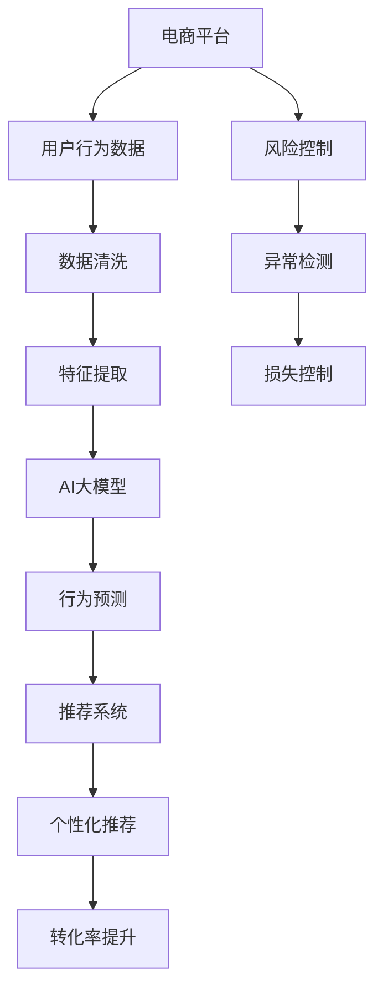

                 

# AI大模型如何优化电商平台的转化漏斗

> 关键词：电商平台, 转化漏斗, 用户行为分析, 机器学习, 深度学习, 强化学习, AI大模型

## 1. 背景介绍

随着电子商务的蓬勃发展，电商平台需要不断优化用户体验，提升转化率，增加销售额。用户从进入平台到完成购买，经过了复杂多变的转化漏斗，包含浏览、添加商品、加入购物车、完成支付等多个关键阶段。优化这一过程，是电商平台运营的核心任务之一。近年来，大模型如BERT、GPT等在自然语言处理(NLP)领域取得了巨大突破，吸引了众多研究者和企业将其应用于电商平台的运营优化中。本文将探讨AI大模型如何通过优化电商平台的转化漏斗，提升用户转化率，创造更多商业价值。

## 2. 核心概念与联系

### 2.1 核心概念概述

为更好地理解AI大模型在电商平台转化漏斗中的应用，本文将介绍几个关键概念：

- **电商平台**：指通过互联网提供商品展示、销售和售后服务等服务的平台，如淘宝、京东等。
- **转化漏斗**：指用户从进入电商平台到完成购买的复杂流程，包含浏览、添加到购物车、结算等多个阶段，各阶段的用户流失率影响最终转化率。
- **用户行为分析**：指通过分析用户浏览、点击、购买等行为，了解用户偏好和需求，优化电商平台的用户体验。
- **机器学习**：指通过训练算法，使机器能够从数据中学习规律，自动进行分类、预测等任务。
- **深度学习**：一种特殊形式的机器学习，通过多层神经网络实现对复杂数据的建模和预测。
- **强化学习**：通过试错，逐步优化决策策略，适用于多步决策过程，如电商平台的用户行为优化。
- **AI大模型**：指经过大规模数据预训练的通用模型，如BERT、GPT等，具备强大的自然语言处理能力。

这些概念之间的联系主要体现在，AI大模型通过机器学习和深度学习技术，分析用户行为，预测用户意图，从而优化电商平台的转化漏斗，提升转化率。具体应用包括：

- **用户行为分析**：AI大模型可以从文本数据中提取用户行为特征，帮助电商平台了解用户偏好。
- **转化率预测**：通过分析历史用户数据，预测用户是否会完成购买，从而优化用户购物路径。
- **个性化推荐**：AI大模型根据用户行为和偏好，生成个性化商品推荐，提升用户满意度。
- **风险控制**：通过分析用户行为，检测异常交易，降低电商平台的风险损失。

### 2.2 核心概念原理和架构的 Mermaid 流程图



这个流程图展示了AI大模型在电商平台转化漏斗优化中的关键环节：

1. 电商平台收集用户行为数据。
2. 数据清洗处理，去除无效和噪声数据。
3. 特征提取，生成模型输入。
4. AI大模型进行行为预测和推荐生成。
5. 个性化推荐和转化率提升。
6. 风险控制和异常检测，减少损失。

## 3. 核心算法原理 & 具体操作步骤

### 3.1 算法原理概述

AI大模型在电商平台转化漏斗中的应用，主要基于以下算法原理：

- **行为预测**：通过分析用户历史行为数据，预测用户是否会完成购买。
- **推荐生成**：根据用户偏好和行为，生成个性化商品推荐。
- **模型训练**：使用用户行为数据训练模型，预测用户转化概率。
- **多臂老虎机**：模拟用户多步决策过程，优化点击、加入购物车、完成支付等行为。
- **强化学习**：通过不断试错，优化推荐策略，提升用户体验。

这些算法的核心在于，通过分析和预测用户行为，优化电商平台的转化漏斗，提升用户转化率。

### 3.2 算法步骤详解

AI大模型优化电商平台转化漏斗的主要步骤如下：

**Step 1: 数据收集与预处理**
- 收集电商平台用户的历史行为数据，如浏览记录、点击次数、添加商品记录等。
- 对数据进行清洗处理，去除无效和噪声数据。
- 提取关键特征，生成模型输入。

**Step 2: 模型训练与调参**
- 选择合适的模型架构和优化器，如BERT、GPT等，进行模型训练。
- 设定学习率、批大小、迭代轮数等超参数，进行模型调参。
- 使用交叉验证等方法，评估模型性能。

**Step 3: 行为预测与推荐生成**
- 将预处理后的数据输入模型，预测用户行为。
- 生成个性化商品推荐，展示给用户。
- 使用A/B测试等方法，评估推荐效果。

**Step 4: 转化率提升与风险控制**
- 分析用户行为，预测用户是否会完成购买。
- 优化用户购物路径，减少流失率。
- 检测异常交易，降低风险损失。

**Step 5: 模型部署与监控**
- 将训练好的模型部署到生产环境。
- 实时监控模型性能，及时调整参数。
- 定期更新模型，保持高性能。

### 3.3 算法优缺点

AI大模型在电商平台转化漏斗优化中的主要优点包括：

- **精准预测**：大模型可以从文本数据中提取丰富特征，预测用户行为。
- **个性化推荐**：根据用户行为，生成个性化推荐，提升用户体验。
- **优化路径**：分析用户购物路径，优化转化漏斗。
- **实时调整**：根据实时数据，实时调整模型参数，适应用户需求。

然而，大模型也存在一些缺点：

- **计算资源需求高**：大模型需要大量计算资源进行训练和推理。
- **数据质量依赖**：模型效果依赖于数据质量，低质量数据会导致预测准确度下降。
- **模型复杂度**：模型结构复杂，训练和推理速度较慢。
- **模型可解释性不足**：大模型往往是"黑盒"系统，难以解释内部决策机制。

### 3.4 算法应用领域

AI大模型在电商平台转化漏斗优化中的应用领域包括：

- **个性化推荐**：生成个性化商品推荐，提升用户满意度。
- **行为预测**：预测用户是否会完成购买，优化转化路径。
- **风险控制**：检测异常交易，降低电商平台风险。
- **用户留存**：分析用户行为，提升用户留存率。
- **广告投放**：优化广告投放策略，提高广告效果。

这些应用领域展示了AI大模型在电商平台运营中的巨大潜力。

## 4. 数学模型和公式 & 详细讲解 & 举例说明

### 4.1 数学模型构建

本文将使用数学语言对AI大模型在电商平台转化漏斗中的应用进行严格刻画。

记电商平台用户数量为 $N$，历史行为数据为 $X=\{x_1, x_2, ..., x_N\}$，用户是否完成购买的标签为 $Y=\{y_1, y_2, ..., y_N\}$。定义行为预测模型为 $f: X \rightarrow [0,1]$，其中 $f(x_i)$ 表示用户 $i$ 完成购买的概率。

定义模型训练损失函数为 $\mathcal{L}=\frac{1}{N} \sum_{i=1}^N [y_i \log f(x_i) + (1-y_i) \log(1-f(x_i))]$。使用交叉熵损失，最小化预测值与真实标签之间的差异。

### 4.2 公式推导过程

以二分类问题为例，推导行为预测模型的损失函数和梯度计算公式。

定义模型 $f(x_i)$ 为二分类模型，预测用户 $i$ 是否会完成购买。则行为预测的交叉熵损失函数为：

$$
\mathcal{L}=\frac{1}{N} \sum_{i=1}^N [-y_i \log f(x_i) - (1-y_i) \log(1-f(x_i))]
$$

根据链式法则，损失函数对模型参数 $\theta$ 的梯度为：

$$
\frac{\partial \mathcal{L}}{\partial \theta} = -\frac{1}{N} \sum_{i=1}^N \left(\frac{y_i}{f(x_i)} - \frac{1-y_i}{1-f(x_i)}\right) \frac{\partial f(x_i)}{\partial \theta}
$$

其中 $\frac{\partial f(x_i)}{\partial \theta}$ 为模型对输入数据的梯度，通过反向传播计算得到。

在得到损失函数的梯度后，即可带入参数更新公式，完成模型的迭代优化。重复上述过程直至收敛，最终得到适应电商平台转化漏斗的优化模型。

### 4.3 案例分析与讲解

以下以电商平台个性化推荐系统为例，详细解读AI大模型在实际应用中的具体实现。

假设电商平台的商品数据为 $\mathcal{I}$，用户行为数据为 $\mathcal{B}$，用户的个性化推荐模型为 $g: \mathcal{B} \times \mathcal{I} \rightarrow [0,1]$。定义推荐损失函数为 $\mathcal{L}_{rec}=\frac{1}{N} \sum_{i=1}^N [-\log g(x_i, i)]$，其中 $g(x_i, i)$ 表示用户 $i$ 对商品 $i$ 的推荐概率。

通过训练推荐模型，生成个性化商品推荐列表，展示给用户。用户点击商品 $i$ 的概率为 $p_i = g(x_i, i)$。

## 5. 项目实践：代码实例和详细解释说明

### 5.1 开发环境搭建

在进行电商平台个性化推荐系统的开发时，首先需要准备好开发环境。以下是使用Python进行PyTorch开发的环境配置流程：

1. 安装Anaconda：从官网下载并安装Anaconda，用于创建独立的Python环境。

2. 创建并激活虚拟环境：
```bash
conda create -n pytorch-env python=3.8 
conda activate pytorch-env
```

3. 安装PyTorch：根据CUDA版本，从官网获取对应的安装命令。例如：
```bash
conda install pytorch torchvision torchaudio cudatoolkit=11.1 -c pytorch -c conda-forge
```

4. 安装TensorFlow：使用以下命令安装TensorFlow。
```bash
pip install tensorflow
```

5. 安装Transformers库：
```bash
pip install transformers
```

6. 安装各类工具包：
```bash
pip install numpy pandas scikit-learn matplotlib tqdm jupyter notebook ipython
```

完成上述步骤后，即可在`pytorch-env`环境中开始开发。

### 5.2 源代码详细实现

下面以电商平台个性化推荐系统为例，给出使用PyTorch和Transformers库的代码实现。

首先，定义推荐系统中的模型类 `RecommendationModel`：

```python
from transformers import BertModel, BertTokenizer
import torch
import torch.nn as nn
import torch.nn.functional as F

class RecommendationModel(nn.Module):
    def __init__(self, embed_size, num_classes):
        super(RecommendationModel, self).__init__()
        self.bert_model = BertModel.from_pretrained('bert-base-uncased', output_hidden_states=True)
        self.fc = nn.Linear(embed_size, num_classes)
        self.sigmoid = nn.Sigmoid()

    def forward(self, inputs):
        output = self.bert_model(inputs)
        features = output.last_hidden_state[:, 0, :]
        logits = self.fc(features)
        return self.sigmoid(logits)
```

然后，定义数据预处理函数 `preprocess`：

```python
def preprocess(texts):
    tokenizer = BertTokenizer.from_pretrained('bert-base-uncased')
    inputs = tokenizer(texts, return_tensors='pt')
    inputs['attention_mask'] = inputs['attention_mask'].to(torch.long)
    return inputs
```

接着，定义训练和评估函数 `train` 和 `evaluate`：

```python
def train(model, data_loader, optimizer, device):
    model.train()
    total_loss = 0
    for batch in data_loader:
        input_ids = batch['input_ids'].to(device)
        attention_mask = batch['attention_mask'].to(device)
        labels = batch['labels'].to(device)
        optimizer.zero_grad()
        outputs = model(input_ids, attention_mask=attention_mask)
        loss = F.binary_cross_entropy_with_logits(outputs, labels)
        loss.backward()
        optimizer.step()
        total_loss += loss.item()
    return total_loss / len(data_loader)

def evaluate(model, data_loader, device):
    model.eval()
    total_pred = 0
    total_true = 0
    for batch in data_loader:
        input_ids = batch['input_ids'].to(device)
        attention_mask = batch['attention_mask'].to(device)
        labels = batch['labels'].to(device)
        outputs = model(input_ids, attention_mask=attention_mask)
        preds = outputs >= 0.5
        total_pred += preds.sum().item()
        total_true += labels.sum().item()
    return total_pred / total_true
```

最后，启动训练流程并在测试集上评估：

```python
epochs = 5
batch_size = 16
device = torch.device('cuda') if torch.cuda.is_available() else torch.device('cpu')

model = RecommendationModel(embed_size=768, num_classes=1)
optimizer = torch.optim.Adam(model.parameters(), lr=1e-5)

train_loader = DataLoader(train_dataset, batch_size=batch_size, shuffle=True)
test_loader = DataLoader(test_dataset, batch_size=batch_size, shuffle=False)

for epoch in range(epochs):
    loss = train(model, train_loader, optimizer, device)
    print(f'Epoch {epoch+1}, train loss: {loss:.3f}')
    
    print(f'Epoch {epoch+1}, test acc: {evaluate(model, test_loader, device)}')
    
print('All epochs completed.')
```

### 5.3 代码解读与分析

让我们再详细解读一下关键代码的实现细节：

**RecommendationModel类**：
- `__init__`方法：初始化模型，包括Bert模型和线性层。
- `forward`方法：定义模型前向传播过程，提取BERT输出的最后一个隐藏状态作为特征，通过全连接层生成推荐概率。

**preprocess函数**：
- 使用BertTokenizer分词并生成BERT输入，设置注意力掩码，转换为模型所需的张量格式。

**train和evaluate函数**：
- 在训练函数中，将数据输入模型，计算损失并反向传播更新参数。
- 在评估函数中，将数据输入模型，计算预测结果并与真实标签对比，统计准确度。

通过上述代码实现，我们可以构建一个基于BERT模型的电商平台个性化推荐系统。在实际应用中，还需要进一步优化模型结构、调整超参数、引入更多特征等，以提升推荐效果。

## 6. 实际应用场景

### 6.1 智能推荐系统

基于AI大模型的电商平台个性化推荐系统，可以显著提升用户购物体验，增加用户粘性和购买转化率。通过分析用户历史行为，预测用户偏好，生成个性化商品推荐，引导用户完成购买。例如，淘宝、京东等电商平台上，常常通过个性化推荐来提升用户转化率。

**具体实现**：
- 收集用户浏览、点击、购买等行为数据。
- 使用大模型提取用户行为特征。
- 训练推荐模型，生成个性化商品推荐。
- 实时更新推荐列表，优化用户购物体验。

### 6.2 购物路径优化

电商平台的转化漏斗包含了多个关键阶段，如浏览、添加商品、加入购物车、完成支付等。通过分析用户在这些阶段的行为，优化购物路径，减少流失率，提升转化率。

**具体实现**：
- 收集用户行为数据，如浏览路径、点击次数、加入购物车行为等。
- 使用大模型分析用户行为，预测是否会完成购买。
- 根据预测结果，优化用户购物路径，如在关键节点推送优惠券、提醒用户支付等。

### 6.3 风险控制

电商平台的风险控制是一个重要环节，防止异常交易行为，保护平台和用户利益。通过分析用户行为，检测异常交易，及时采取措施，减少风险损失。

**具体实现**：
- 收集用户交易数据，如交易金额、交易频率等。
- 使用大模型检测异常交易行为，如检测用户是否有异常购买行为。
- 根据检测结果，及时采取措施，如冻结账户、拒绝交易等。

### 6.4 未来应用展望

未来，AI大模型在电商平台转化漏斗优化中的应用将更加广泛和深入：

1. **多模态融合**：结合视觉、音频等多模态数据，提升用户购物体验。
2. **实时预测**：利用实时数据，实现实时预测和实时调整，提高转化率。
3. **跨平台优化**：优化跨平台购物路径，提升多渠道购物体验。
4. **个性化推荐**：结合用户行为和历史数据，生成更精准的个性化推荐。
5. **智能客服**：结合自然语言处理技术，实现智能客服和智能推荐，提升用户满意度。

## 7. 工具和资源推荐

### 7.1 学习资源推荐

为了帮助开发者系统掌握AI大模型在电商平台转化漏斗中的应用，这里推荐一些优质的学习资源：

1. **《深度学习》课程**：斯坦福大学开设的深度学习课程，涵盖深度学习基础和应用，包括自然语言处理和推荐系统。
2. **《机器学习实战》书籍**：适合入门读者，通过实战项目讲解机器学习算法和应用，包含推荐系统和电商平台优化。
3. **Transformers官方文档**：Transformer库的官方文档，提供了模型搭建和微调的全过程。
4. **PaddlePaddle官方文档**：PaddlePaddle深度学习框架的官方文档，包含模型训练和优化方法。
5. **论文和博客**：查阅相关的研究论文和博客，了解最新的算法和应用进展。

通过学习这些资源，相信你一定能够快速掌握AI大模型在电商平台转化漏斗优化中的精髓，并用于解决实际的NLP问题。

### 7.2 开发工具推荐

高效的开发离不开优秀的工具支持。以下是几款用于AI大模型在电商平台转化漏斗中应用的常用工具：

1. **PyTorch**：基于Python的开源深度学习框架，灵活易用，适合深度学习模型的构建和训练。
2. **TensorFlow**：由Google主导的深度学习框架，支持大规模分布式训练，适合工业级应用。
3. **Transformers**：HuggingFace开发的NLP工具库，集成了多个SOTA模型，方便模型微调和应用。
4. **TensorBoard**：TensorFlow配套的可视化工具，可以实时监测模型训练状态，提供丰富的图表。
5. **Weights & Biases**：模型训练的实验跟踪工具，记录和可视化模型训练过程中的各项指标。
6. **Amazon SageMaker**：AWS提供的深度学习平台，支持模型训练和部署，适合企业级应用。

合理利用这些工具，可以显著提升AI大模型在电商平台转化漏斗中的开发效率，加快创新迭代的步伐。

### 7.3 相关论文推荐

AI大模型在电商平台转化漏斗中的应用是一个前沿研究方向，以下是几篇奠基性的相关论文，推荐阅读：

1. **《深度学习在电商平台个性化推荐中的应用》**：探讨深度学习模型在电商推荐系统中的应用。
2. **《电商平台行为预测与转化率优化》**：研究电商平台用户行为预测和转化率提升的方法。
3. **《强化学习在电商平台购物路径优化中的应用》**：探讨强化学习模型在电商平台购物路径优化中的作用。
4. **《多模态数据融合在电商平台推荐系统中的应用》**：研究多模态数据融合在电商平台推荐系统中的应用。
5. **《电商平台用户行为分析与风险控制》**：研究电商平台用户行为分析与风险控制的方法。

这些论文代表了大模型在电商平台应用的发展脉络，通过学习这些前沿成果，可以帮助研究者把握学科前进方向，激发更多的创新灵感。

## 8. 总结：未来发展趋势与挑战

### 8.1 总结

本文对AI大模型在电商平台转化漏斗中的应用进行了全面系统的介绍。首先阐述了电商平台和转化漏斗的关键概念，明确了AI大模型优化转化漏斗的独特价值。其次，从原理到实践，详细讲解了AI大模型在电商平台转化漏斗中的应用步骤，给出了模型搭建和微调的完整代码实例。同时，本文还广泛探讨了AI大模型在电商平台中的多个应用场景，展示了其巨大的应用潜力。

通过本文的系统梳理，可以看到，AI大模型在电商平台优化中已经展现出强大的能力，不仅提升了用户转化率，还为电商平台带来了显著的商业价值。未来，伴随技术的不断进步，AI大模型在电商平台中的应用将更加广泛和深入。

### 8.2 未来发展趋势

展望未来，AI大模型在电商平台中的应用将呈现以下几个发展趋势：

1. **多模态融合**：结合视觉、音频等多模态数据，提升用户购物体验。
2. **实时预测**：利用实时数据，实现实时预测和实时调整，提高转化率。
3. **跨平台优化**：优化跨平台购物路径，提升多渠道购物体验。
4. **个性化推荐**：结合用户行为和历史数据，生成更精准的个性化推荐。
5. **智能客服**：结合自然语言处理技术，实现智能客服和智能推荐，提升用户满意度。
6. **数据隐私保护**：加强用户数据隐私保护，确保数据安全。

这些趋势凸显了AI大模型在电商平台中的广阔前景，未来的研究将在模型效果、实时性、安全性等方面进一步提升。

### 8.3 面临的挑战

尽管AI大模型在电商平台中的应用已经取得了显著成效，但在迈向更加智能化、普适化应用的过程中，它仍面临着诸多挑战：

1. **计算资源需求高**：大模型需要大量计算资源进行训练和推理。
2. **数据质量依赖**：模型效果依赖于数据质量，低质量数据会导致预测准确度下降。
3. **模型复杂度**：模型结构复杂，训练和推理速度较慢。
4. **模型可解释性不足**：大模型往往是"黑盒"系统，难以解释内部决策机制。
5. **用户隐私保护**：电商平台需要保护用户隐私，防止数据泄露。

### 8.4 研究展望

面对AI大模型在电商平台中应用所面临的挑战，未来的研究需要在以下几个方面寻求新的突破：

1. **模型压缩与优化**：开发更加轻量级的模型结构，提高推理效率。
2. **数据增强与预处理**：使用数据增强和预处理方法，提升数据质量。
3. **模型可解释性**：研究模型的可解释性方法，帮助理解模型决策机制。
4. **用户隐私保护**：开发隐私保护技术，确保用户数据安全。
5. **多模态数据融合**：研究多模态数据的融合方法，提升用户体验。

这些研究方向将推动AI大模型在电商平台中的应用不断深入，为电商平台的运营优化和用户体验提升提供新的动力。总之，AI大模型在电商平台中的研究与应用方兴未艾，未来必将带来更多创新和突破。

## 9. 附录：常见问题与解答

**Q1：电商平台的转化率主要由哪些因素决定？**

A: 电商平台的转化率主要由以下因素决定：
1. **商品质量**：商品的品质和价值是转化率的基础。
2. **用户体验**：用户浏览、购物和支付的体验，直接影响转化率。
3. **推荐系统**：推荐系统的精准度和个性化程度，影响用户购物意愿。
4. **价格策略**：价格策略和促销活动，吸引用户购买。
5. **用户信任**：用户对平台的信任程度，影响购买决策。

**Q2：如何评估AI大模型在电商平台中的效果？**

A: 评估AI大模型在电商平台中的效果，可以从以下几个方面进行：
1. **准确度**：模型预测用户行为与实际行为的一致性。
2. **个性化推荐度**：推荐列表的个性化程度，用户满意度。
3. **用户转化率**：用户完成购买的比例，转化效果。
4. **推荐召回率**：推荐列表中包含用户感兴趣商品的比例。
5. **风险控制效果**：异常交易的检测和处理效果，降低风险损失。

**Q3：如何优化电商平台的转化漏斗？**

A: 优化电商平台的转化漏斗，可以从以下几个方面进行：
1. **数据收集**：收集用户行为数据，建立数据仓库。
2. **模型训练**：选择合适的模型架构和优化器，进行模型训练。
3. **特征提取**：提取关键特征，生成模型输入。
4. **行为预测**：预测用户行为，优化推荐策略。
5. **个性化推荐**：根据用户行为和偏好，生成个性化推荐。
6. **实时调整**：根据实时数据，实时调整模型参数。

**Q4：如何确保电商平台的用户隐私安全？**

A: 确保电商平台的用户隐私安全，可以从以下几个方面进行：
1. **数据匿名化**：对用户数据进行匿名化处理，防止数据泄露。
2. **加密技术**：使用加密技术保护用户数据，防止数据窃取。
3. **访问控制**：设置严格的访问控制机制，限制数据访问权限。
4. **隐私协议**：制定隐私协议，保护用户隐私权益。
5. **隐私保护算法**：开发隐私保护算法，确保数据安全。

通过本文的系统梳理，可以看到，AI大模型在电商平台转化漏斗中的应用已经展现出巨大的潜力，未来的研究和应用将进一步推动电商平台的技术进步和用户体验的提升。相信在学界和产业界的共同努力下，AI大模型将在电商平台中发挥更大的作用，为电商平台的运营优化和用户满意度的提升提供新的动力。

---

作者：禅与计算机程序设计艺术 / Zen and the Art of Computer Programming

