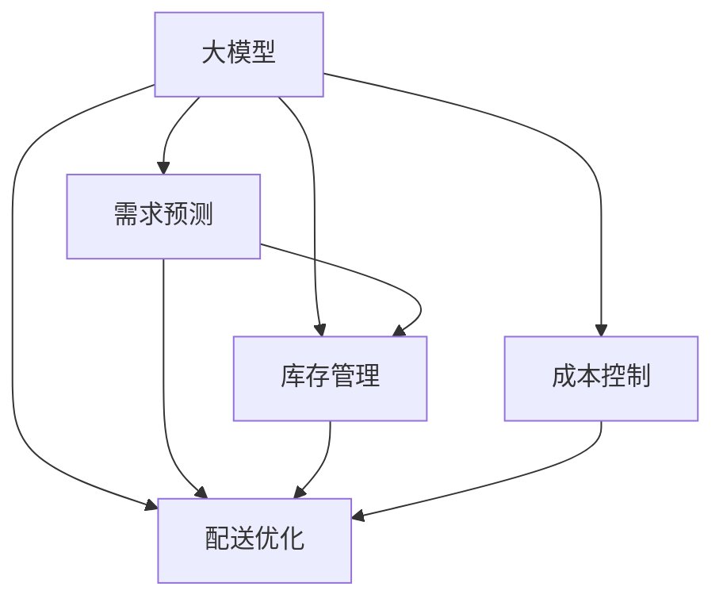

                 

# AI大模型对电商供应链优化的影响

> 关键词：人工智能,大模型,电商供应链,优化,库存管理,需求预测,配送优化,成本控制,实时调整

## 1. 背景介绍

### 1.1 电商供应链的现状与挑战

近年来，随着电子商务的迅速发展，全球电商市场规模持续扩大，零售商在面对激烈的市场竞争的同时，也面临着愈发复杂的供应链管理问题。诸如库存积压、缺货、运输延迟、物流成本高等挑战，都在不同程度上影响着电商公司的运营效率和客户满意度。

具体而言，电商供应链管理中的主要问题包括：

- **库存管理**：如何合理设定库存水平，避免缺货或库存积压，从而提升用户体验和运营效率。
- **需求预测**：如何准确预测市场需求，优化备货量，减少库存成本和浪费。
- **配送优化**：如何在有限的运输资源下，规划最优的配送路线和计划，提高配送效率，降低物流成本。
- **成本控制**：如何通过技术手段提升供应链的自动化水平，降低运营成本，提高整体盈利能力。

这些问题不仅关系到电商公司的供应链管理水平，也直接影响到其市场竞争力和盈利能力。而随着人工智能（AI）技术的迅猛发展，特别是大模型的应用，为电商供应链管理提供了一个全新的解决方案。

### 1.2 人工智能技术在电商供应链中的应用

人工智能技术，特别是大模型，在电商供应链中的应用日益广泛，其优势在于能够处理海量数据，识别复杂模式，提供决策支持，从而提升供应链的透明度、效率和灵活性。

具体而言，大模型在电商供应链中的应用包括：

- **库存管理**：通过分析历史销售数据和市场趋势，预测未来的销售量，优化库存水平。
- **需求预测**：利用时间序列分析和大模型，对消费者的购买行为进行预测，优化商品备货。
- **配送优化**：通过路径规划和需求预测，优化配送路线和计划，提高配送效率。
- **成本控制**：通过自动化、智能化的运营手段，降低供应链中的各种成本。

本文将围绕大模型在电商供应链优化中的应用，深入探讨其技术原理和实际操作流程，以及未来发展趋势和面临的挑战。

## 2. 核心概念与联系

### 2.1 核心概念概述

为了更好地理解大模型在电商供应链优化中的作用，本节将介绍几个密切相关的核心概念：

- **大模型（Large Model）**：以深度学习模型为代表，具有数亿甚至数十亿参数的大型模型。这些模型通过在大规模无标签数据上进行自监督或监督学习，具备强大的泛化能力和丰富的知识表示。

- **供应链优化（Supply Chain Optimization）**：通过优化供应链中的各个环节，提高效率、降低成本、提升服务质量的过程。包括库存管理、需求预测、配送优化等方面。

- **需求预测（Demand Forecasting）**：通过历史数据和模型，预测未来的需求量，帮助企业进行合理的库存管理和订单规划。

- **配送优化（Delivery Optimization）**：通过路径规划、资源调度等手段，优化配送过程，提高配送效率，降低配送成本。

- **成本控制（Cost Control）**：通过技术手段降低供应链中的各种成本，提高整体盈利能力。

这些概念之间的逻辑关系可以通过以下Mermaid流程图来展示：



这个流程图展示了大模型在电商供应链中的核心作用：

1. 大模型通过学习历史数据，提供需求预测、库存管理和配送优化等决策支持。
2. 这些决策支持通过优化供应链的各个环节，实现效率提升和成本控制。

## 3. 核心算法原理 & 具体操作步骤
### 3.1 算法原理概述

大模型在电商供应链优化中的应用，本质上是利用模型对历史数据进行分析，从中提取规律和模式，然后根据这些规律和模式进行预测和决策。具体的算法原理如下：

- **需求预测算法**：利用时间序列分析、回归模型、深度学习模型等方法，预测未来的需求量。常用的模型包括ARIMA、LSTM、RNN等。

- **库存管理算法**：基于需求预测结果，制定库存补充计划，确保库存水平在合理范围内，避免缺货或库存积压。

- **配送优化算法**：通过路径规划、运输优化等方法，找到最优的配送路线和计划。常用的算法包括Dijkstra算法、遗传算法、强化学习等。

- **成本控制算法**：通过数据分析和模型预测，识别供应链中的高成本环节，采取相应的措施进行优化。

### 3.2 算法步骤详解

下面以需求预测算法为例，详细介绍其实际操作步骤：

1. **数据准备**：收集历史销售数据、市场趋势、季节性因素等，进行数据清洗和预处理。

2. **模型训练**：选择合适的深度学习模型，如LSTM、RNN等，在大规模历史数据上训练模型，优化模型参数。

3. **模型评估**：在测试集上评估模型性能，使用均方根误差（RMSE）、平均绝对误差（MAE）等指标评估预测准确度。

4. **预测应用**：将训练好的模型应用到实时数据中，进行需求预测，输出未来需求量。

### 3.3 算法优缺点

大模型在电商供应链优化中具有以下优点：

- **预测精度高**：大模型通过学习大量数据，具备强大的泛化能力，能够提供高精度的预测结果。

- **适应性强**：大模型能够处理复杂的多变量关系，适用于多种类型的电商数据。

- **自动化程度高**：大模型能够自动化地进行预测和优化，减少人工干预，提高运营效率。

同时，大模型也存在一些局限性：

- **数据依赖性强**：模型的性能高度依赖于历史数据的质量和数量，数据偏差可能导致预测结果不准确。

- **模型复杂度高**：大模型参数量巨大，需要较强的计算资源和存储空间。

- **解释性差**：大模型通常被视为"黑盒"模型，其预测过程缺乏可解释性。

### 3.4 算法应用领域

大模型在电商供应链中的应用，主要包括以下几个领域：

- **需求预测**：利用大模型进行需求预测，优化库存管理和订单规划。

- **库存管理**：通过大模型分析历史销售数据，制定合理的库存补充计划，避免库存积压和缺货。

- **配送优化**：利用大模型进行路径规划和资源调度，提高配送效率，降低物流成本。

- **成本控制**：通过大模型分析供应链中的各项成本，识别并优化高成本环节，提高整体盈利能力。

以上应用场景展示了大模型在电商供应链优化中的广泛应用潜力，其在提升运营效率、降低成本等方面的优势显著。

## 4. 数学模型和公式 & 详细讲解  
### 4.1 数学模型构建

在本节中，我们将以LSTM模型为例，详细讲解大模型在需求预测中的应用。

假设历史销售数据为 $D_t=(x_{t-1}, x_{t-2}, ..., x_0)$，其中 $x_t$ 表示在第 $t$ 天的销售量。需求预测的目标是找到一个函数 $f$，使得 $f(D_t)$ 能够准确预测未来的销售量 $x_{t+1}$。

常用的模型是LSTM，其基本架构包括输入层、隐藏层和输出层。隐藏层包含多个记忆单元（Memory Cells），能够记录历史数据的长期依赖关系。

LSTM模型的数学公式如下：

$$
h_t = f(h_{t-1}, x_t)
$$

其中 $h_t$ 表示第 $t$ 时刻的记忆状态，$x_t$ 表示第 $t$ 时刻的输入数据。函数 $f$ 为LSTM的转换函数，通常包含三个门控单元：输入门（Input Gate）、遗忘门（Forget Gate）和输出门（Output Gate）。

### 4.2 公式推导过程

在LSTM模型中，每个时刻的记忆状态 $h_t$ 由输入 $x_t$ 和上一时刻的记忆状态 $h_{t-1}$ 决定。其更新公式如下：

$$
h_t = \sigma_i(W_i[h_{t-1}, x_t] + b_i)
$$

$$
g_t = \tanh(W_g[h_{t-1}, x_t] + b_g)
$$

$$
f_t = \sigma_f(W_f[h_{t-1}, x_t] + b_f)
$$

$$
o_t = \sigma_o(W_o[h_{t-1}, x_t] + b_o)
$$

$$
c_t = f_t \odot c_{t-1} + i_t \odot g_t
$$

$$
h_t = o_t \odot \tanh(c_t)
$$

其中，$\sigma$ 表示sigmoid激活函数，$\tanh$ 表示双曲正切函数，$\odot$ 表示元素乘法。

LSTM模型通过门控机制来控制信息的流动，避免遗忘或丢失重要信息，同时保留长期依赖关系，非常适合处理时间序列数据。

### 4.3 案例分析与讲解

以下是一个使用LSTM模型进行需求预测的案例分析：

假设有一个电商平台的日销售数据，需要预测未来30天的销售量。

1. **数据准备**：将历史销售数据分为训练集和测试集，分别进行数据清洗和预处理。

2. **模型训练**：在训练集上训练LSTM模型，优化模型参数。

3. **模型评估**：在测试集上评估模型性能，输出预测结果。

4. **结果分析**：对比预测结果与实际销售数据，分析模型的预测精度和误差来源。

通过以上步骤，我们可以利用LSTM模型进行需求预测，进而优化电商平台的库存管理和订单规划。

## 5. 项目实践：代码实例和详细解释说明
### 5.1 开发环境搭建

在进行大模型在电商供应链优化中的应用实践时，我们需要准备以下开发环境：

1. **Python环境**：Python是深度学习的主要开发语言，需要确保环境中的Python版本为3.6或以上。

2. **深度学习框架**：选择PyTorch或TensorFlow等深度学习框架，进行模型的训练和部署。

3. **数据预处理工具**：如Pandas、NumPy等，用于数据清洗和预处理。

4. **可视化工具**：如Matplotlib、Seaborn等，用于模型评估和结果展示。

### 5.2 源代码详细实现

下面是一个使用LSTM模型进行需求预测的Python代码实现：

```python
import torch
import torch.nn as nn
import torch.optim as optim
import numpy as np
import pandas as pd
from sklearn.metrics import mean_squared_error

# 定义LSTM模型
class LSTM(nn.Module):
    def __init__(self, input_size, hidden_size, output_size):
        super(LSTM, self).__init__()
        self.hidden_size = hidden_size
        self.rnn = nn.LSTM(input_size, hidden_size, 1)
        self.fc = nn.Linear(hidden_size, output_size)
        
    def forward(self, x, hidden):
        r_out, hidden = self.rnn(x, hidden)
        out = self.fc(r_out.view(r_out.size(0), r_out.size(1), -1)).squeeze(2)
        return out, hidden
    
# 训练函数
def train_model(model, data, learning_rate, num_epochs):
    # 定义损失函数和优化器
    criterion = nn.MSELoss()
    optimizer = optim.Adam(model.parameters(), lr=learning_rate)
    
    # 划分训练集和测试集
    train_data, test_data = data[:70], data[70:]
    
    # 训练模型
    for epoch in range(num_epochs):
        model.train()
        train_loss = 0
        for i in range(len(train_data)):
            inputs, targets = train_data[i].numpy(), train_data[i][1].numpy()
            inputs = np.reshape(inputs, (1, inputs.shape[0], inputs.shape[1]))
            targets = np.reshape(targets, (1, targets.shape[0]))
            
            optimizer.zero_grad()
            output, _ = model(inputs, None)
            loss = criterion(output, targets)
            loss.backward()
            optimizer.step()
            train_loss += loss.item()
            
        # 评估模型
        model.eval()
        test_loss = 0
        for i in range(len(test_data)):
            inputs, targets = test_data[i].numpy(), test_data[i][1].numpy()
            inputs = np.reshape(inputs, (1, inputs.shape[0], inputs.shape[1]))
            targets = np.reshape(targets, (1, targets.shape[0]))
            
            output, _ = model(inputs, None)
            loss = criterion(output, targets)
            test_loss += loss.item()
            
        print(f'Epoch {epoch+1}, Train Loss: {train_loss:.3f}, Test Loss: {test_loss:.3f}')
    
    return model

# 数据准备
data = pd.read_csv('sales_data.csv')
x = np.array(data['day'].values).reshape(-1, 1)
y = np.array(data['sales'].values).reshape(-1, 1)
x_train, y_train = x[:70], y[:70]
x_test, y_test = x[70:], y[70:]

# 模型训练
model = LSTM(input_size=1, hidden_size=32, output_size=1)
model = train_model(model, (x_train, y_train), learning_rate=0.01, num_epochs=10)

# 结果展示
y_pred = model(x_test, None)
print(f'RMS Error: {mean_squared_error(y_test, y_pred) ** 0.5:.3f}')
```

### 5.3 代码解读与分析

以上代码实现了使用LSTM模型进行需求预测的过程，其主要步骤如下：

1. **定义模型**：使用PyTorch定义LSTM模型，包含输入层、隐藏层和输出层。

2. **数据准备**：将历史销售数据划分为训练集和测试集，进行数据清洗和预处理。

3. **模型训练**：在训练集上训练模型，优化模型参数。

4. **模型评估**：在测试集上评估模型性能，输出预测结果。

5. **结果展示**：计算预测结果与实际销售数据的均方根误差（RMSE），评估模型预测精度。

通过以上代码实现，我们可以对大模型在电商供应链优化中的应用有一个直观的理解。

## 6. 实际应用场景

### 6.1 智能库存管理

利用大模型进行需求预测，可以显著提升电商平台的库存管理水平。具体而言，可以通过以下步骤实现：

1. **需求预测**：利用大模型对历史销售数据进行预测，输出未来销售量。

2. **库存调整**：根据预测结果，调整库存水平，避免缺货或库存积压。

3. **订单规划**：根据预测结果，合理规划订单，提升供应链效率。

### 6.2 路径规划与配送优化

通过大模型进行路径规划和配送优化，可以显著提高物流效率，降低配送成本。具体而言，可以通过以下步骤实现：

1. **路径规划**：利用大模型进行路径规划，找到最优配送路线。

2. **资源调度**：根据配送路线和库存情况，合理调度运输资源。

3. **实时调整**：根据实时数据和预测结果，动态调整配送计划，优化配送效率。

### 6.3 成本控制

利用大模型进行成本控制，可以识别供应链中的高成本环节，采取相应的优化措施，提升整体盈利能力。具体而言，可以通过以下步骤实现：

1. **成本分析**：利用大模型分析供应链中的各项成本，识别高成本环节。

2. **优化措施**：根据分析结果，采取优化措施，降低成本。

3. **持续监控**：持续监控成本变化，及时调整优化策略。

### 6.4 未来应用展望

未来，大模型在电商供应链中的应用将进一步扩展，主要体现在以下几个方面：

1. **实时预测与调整**：利用大模型进行实时需求预测和库存调整，提升供应链的动态响应能力。

2. **多模态数据融合**：将大模型与其他数据源（如传感器、天气数据等）结合，进行多模态数据融合，提升预测精度。

3. **跨平台集成**：将大模型集成到不同平台（如云计算、边缘计算等）中，实现跨平台协同优化。

4. **自适应学习**：利用大模型进行自适应学习，不断调整优化策略，适应新的市场变化。

5. **全局优化**：将大模型应用于全局供应链优化，提升整体运营效率和盈利能力。

通过以上应用场景，我们可以看到，大模型在电商供应链优化中具有广阔的应用前景，能够显著提升供应链的效率和灵活性。

## 7. 工具和资源推荐

### 7.1 学习资源推荐

为了帮助开发者深入掌握大模型在电商供应链优化中的应用，这里推荐一些优质的学习资源：

1. **《深度学习与人工智能》课程**：由斯坦福大学开设，涵盖深度学习基本原理和实际应用。

2. **《Python深度学习》书籍**：适合初学者入门，介绍深度学习模型的实现和应用。

3. **《电商供应链管理》书籍**：介绍电商供应链管理的理论和方法，结合实际案例进行分析。

4. **深度学习框架官方文档**：如PyTorch和TensorFlow的官方文档，提供丰富的模型实现和应用案例。

5. **在线学习平台**：如Coursera、edX等，提供大量关于深度学习和大模型的在线课程。

通过对这些资源的学习实践，相信你一定能够快速掌握大模型在电商供应链优化中的应用方法，并在实际项目中取得显著成果。

### 7.2 开发工具推荐

高效的开发离不开优秀的工具支持。以下是几款用于大模型在电商供应链优化中的应用开发的常用工具：

1. **深度学习框架**：如PyTorch、TensorFlow等，提供强大的深度学习模型实现和训练功能。

2. **数据处理工具**：如Pandas、NumPy等，提供高效的数据处理和分析功能。

3. **可视化工具**：如Matplotlib、Seaborn等，提供丰富的图表展示功能。

4. **版本控制工具**：如Git等，提供代码管理和协作功能。

5. **自动化工具**：如Jenkins、Kubernetes等，提供持续集成和自动化部署功能。

合理利用这些工具，可以显著提升大模型在电商供应链优化中的应用开发效率，加快创新迭代的步伐。

### 7.3 相关论文推荐

大模型在电商供应链优化中的应用源于学界的持续研究。以下是几篇奠基性的相关论文，推荐阅读：

1. **《基于深度学习的电商供应链优化》**：介绍深度学习在电商供应链优化中的应用。

2. **《智能库存管理的深度学习方法》**：探索深度学习在智能库存管理中的应用。

3. **《利用深度学习进行路径规划与配送优化》**：研究深度学习在路径规划和配送优化中的应用。

4. **《成本控制的深度学习方法》**：探索深度学习在成本控制中的应用。

这些论文代表了大模型在电商供应链优化领域的发展脉络。通过学习这些前沿成果，可以帮助研究者把握学科前进方向，激发更多的创新灵感。

## 8. 总结：未来发展趋势与挑战

### 8.1 研究成果总结

本文详细介绍了大模型在电商供应链优化中的应用，通过需求预测、库存管理、路径规划、成本控制等具体场景，展示了其广阔的应用前景。大模型通过强大的泛化能力和自动化预测，提升了供应链的效率和灵活性，具有显著的经济价值和社会效益。

### 8.2 未来发展趋势

展望未来，大模型在电商供应链中的应用将呈现以下几个发展趋势：

1. **实时预测与调整**：大模型将实现实时预测与调整，提升供应链的动态响应能力。

2. **多模态数据融合**：大模型将与其他数据源结合，进行多模态数据融合，提升预测精度。

3. **跨平台集成**：大模型将集成到不同平台中，实现跨平台协同优化。

4. **自适应学习**：大模型将进行自适应学习，不断调整优化策略，适应新的市场变化。

5. **全局优化**：大模型将应用于全局供应链优化，提升整体运营效率和盈利能力。

### 8.3 面临的挑战

尽管大模型在电商供应链中的应用前景广阔，但在实际应用中也面临一些挑战：

1. **数据质量问题**：历史数据的完整性和准确性可能影响模型的预测精度。

2. **模型复杂度**：大模型参数量巨大，需要较强的计算资源和存储空间。

3. **模型解释性**：大模型通常被视为"黑盒"模型，其预测过程缺乏可解释性。

4. **实时性问题**：大模型预测需要大量计算资源，实时性可能受到影响。

5. **成本问题**：大模型的训练和部署成本较高，需要企业具备较高的技术投入。

### 8.4 研究展望

未来，大模型在电商供应链中的应用需要从以下几个方面进行进一步研究：

1. **数据质量提升**：提高历史数据的质量，增强模型的泛化能力。

2. **模型优化**：优化模型结构和参数，提升预测精度和效率。

3. **模型解释性**：提高模型的可解释性，增强用户信任。

4. **实时性优化**：优化模型计算过程，提高实时性。

5. **成本控制**：降低模型的训练和部署成本，提高经济效益。

通过持续的研发和优化，相信大模型将在电商供应链中发挥更大的作用，推动电商行业的数字化转型升级。

## 9. 附录：常见问题与解答

**Q1：大模型在电商供应链优化中的具体应用场景有哪些？**

A: 大模型在电商供应链优化中的具体应用场景包括：需求预测、库存管理、路径规划、成本控制等。通过大模型的预测和优化，电商平台可以实现更精准的需求预测、合理的库存管理、高效的路径规划和低成本的运营，从而提升整体运营效率和盈利能力。

**Q2：大模型在电商供应链中的应用面临哪些挑战？**

A: 大模型在电商供应链中的应用面临以下挑战：

1. 数据质量问题：历史数据的完整性和准确性可能影响模型的预测精度。

2. 模型复杂度：大模型参数量巨大，需要较强的计算资源和存储空间。

3. 模型解释性：大模型通常被视为"黑盒"模型，其预测过程缺乏可解释性。

4. 实时性问题：大模型预测需要大量计算资源，实时性可能受到影响。

5. 成本问题：大模型的训练和部署成本较高，需要企业具备较高的技术投入。

**Q3：如何使用大模型进行电商供应链的优化？**

A: 使用大模型进行电商供应链的优化，主要分为以下几个步骤：

1. 数据准备：收集电商平台的销售数据、库存数据、配送数据等，进行数据清洗和预处理。

2. 模型训练：选择合适的大模型，在历史数据上训练模型，优化模型参数。

3. 模型评估：在测试集上评估模型性能，输出预测结果。

4. 应用优化：将训练好的模型应用到实际电商平台的库存管理、路径规划、成本控制等场景中，进行优化。

通过以上步骤，可以实现大模型在电商供应链中的应用，提升供应链的效率和盈利能力。

---

作者：禅与计算机程序设计艺术 / Zen and the Art of Computer Programming

