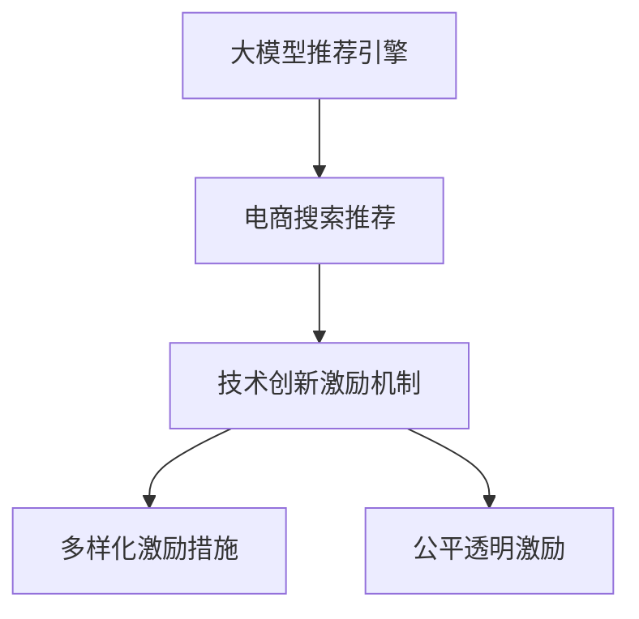

                 

# AI大模型视角下电商搜索推荐的技术创新激励机制设计

> 关键词：AI大模型，电商搜索推荐，技术创新，激励机制设计，电商个性化

## 1. 背景介绍

### 1.1 问题由来

随着互联网和电子商务的飞速发展，个性化推荐系统已成为电商平台的核心竞争力之一。通过精确预测用户需求，推荐系统能够显著提升用户体验、提高转化率和销售额。然而，现有推荐系统往往依赖于用户行为数据进行冷启动，难以覆盖新用户和冷门商品。与此同时，随着技术发展，大模型推荐引擎逐渐崭露头角，凭借其在处理大规模复杂任务上的卓越性能，展现了极大的发展潜力。

大模型推荐引擎以自监督和半监督学习为核心，通过在大规模无标签文本数据和用户行为数据上进行预训练和微调，学习用户兴趣与商品特征之间的复杂关系。然而，大模型在电商推荐中的应用仍处于初步阶段，推广普及存在诸多挑战。如何设计有效的技术创新激励机制，激发电商企业对大模型推荐系统的使用热情，是当前亟需解决的问题。

### 1.2 问题核心关键点

本文聚焦于基于大模型的电商搜索推荐技术创新激励机制设计，旨在通过构建合理的激励机制，激发电商企业采用大模型推荐引擎的积极性，从而推动电商搜索推荐技术的创新发展。

核心关键点包括：
- **大模型推荐引擎的原理与优势**：介绍大模型在电商推荐中的应用原理，及其在处理复杂任务、提升推荐效果等方面的优势。
- **现有电商推荐系统的痛点**：分析当前电商推荐系统在用户覆盖、商品推荐精准度、运营成本等方面的不足。
- **技术创新激励机制的设计原则**：阐述激励机制的设计原则，包括多样性、公平性、透明性、激励强度等。
- **激励机制的实施路径**：提出具体的激励措施，如技术合作、人才培训、资金支持等，并评估其可行性与效果。
- **激励机制的持续优化**：探讨激励机制的长期优化策略，确保激励效果的持久性和普适性。

## 2. 核心概念与联系

### 2.1 核心概念概述

为更好地理解电商搜索推荐技术创新激励机制的设计，本节将介绍几个密切相关的核心概念：

- **大模型推荐引擎**：基于大模型（如BERT、GPT等）构建的推荐系统，能够自动提取用户行为和商品特征，学习用户兴趣与商品之间的关系，从而提供精准的个性化推荐。

- **电商搜索推荐**：电商平台通过搜索、推荐等技术手段，帮助用户快速找到满足需求的商品，提升用户满意度和转化率。

- **技术创新激励机制**：通过设计合理的激励措施，激发电商企业对大模型推荐技术的探索与使用，推动技术进步和市场应用。

- **多样化激励措施**：包括技术合作、资金支持、人才培训等多种形式的激励，满足不同企业的多样化需求。

- **公平透明激励**：确保所有企业获得公平机会，激励措施的透明度和可追溯性，促进健康竞争和市场公平。

这些概念之间的逻辑关系可以通过以下Mermaid流程图来展示：



这个流程图展示了大模型推荐引擎、电商搜索推荐、技术创新激励机制之间的联系和作用：

1. 大模型推荐引擎通过自动化学习提升电商搜索推荐的效果。
2. 技术创新激励机制通过设计合理的激励措施，促进大模型推荐引擎在电商中的应用。
3. 多样化激励措施和公平透明激励确保激励机制的普适性和有效性。

## 3. 核心算法原理 & 具体操作步骤
### 3.1 算法原理概述

基于大模型的电商搜索推荐技术，本质上是一种利用深度学习技术对用户行为和商品特征进行建模，进而预测用户兴趣并推荐商品的机器学习方法。其核心原理可总结如下：

1. **数据预处理**：收集和清洗用户行为数据和商品描述数据，构建用户-商品-行为三元组。

2. **预训练模型**：在大规模无标签文本数据和电商数据上预训练大模型，学习语言模型和用户商品兴趣的表征。

3. **任务适配**：根据电商推荐任务的特点，设计合适的任务适配层，如分类器、生成器等。

4. **微调模型**：在电商数据集上对预训练模型进行微调，优化模型在电商推荐任务上的表现。

5. **推荐引擎部署**：将微调后的模型集成到电商搜索推荐系统中，实现实时推荐。

### 3.2 算法步骤详解

基于大模型的电商搜索推荐技术创新激励机制的设计，主要包括以下几个关键步骤：

**Step 1: 数据收集与处理**
- 收集电商平台的各类数据，包括用户行为数据、商品描述数据、交易记录等。
- 清洗数据，去除噪声和冗余，构建用户-商品-行为三元组。

**Step 2: 选择预训练模型**
- 根据任务需求选择合适的预训练模型，如BERT、GPT等。
- 准备相应的训练环境，如GPU、TPU等。

**Step 3: 数据预训练**
- 使用预训练模型在大规模无标签文本数据上预训练，学习语言模型的特征。
- 在电商数据集上使用半监督学习方法进行预训练，学习用户商品兴趣的表征。

**Step 4: 任务适配与微调**
- 设计适合电商推荐任务的任务适配层，如分类器、生成器等。
- 在电商数据集上微调预训练模型，优化模型在推荐任务上的性能。

**Step 5: 激励机制设计**
- 设计多样化的激励措施，如技术合作、资金支持、人才培训等。
- 确保激励机制的公平透明，制定明确的激励条件和标准。

**Step 6: 激励措施实施**
- 通过多种渠道推广激励措施，如举办技术研讨会、发布白皮书等。
- 建立激励机制的监测和评估体系，跟踪激励效果。

**Step 7: 激励机制优化**
- 根据激励效果和反馈，不断优化激励机制，确保其持久性和普适性。

### 3.3 算法优缺点

基于大模型的电商搜索推荐技术创新激励机制具有以下优点：
1. 提升推荐效果：通过预训练和微调，模型能够更好地捕捉用户行为和商品特征之间的关系，提升推荐精度。
2. 降低运营成本：自动化学习减少了人工干预，降低了运营和维护成本。
3. 促进技术创新：激励机制能够激发电商企业采用大模型推荐系统，推动技术进步和应用普及。
4. 多样化激励：多样化的激励措施能够满足不同企业的需求，提高激励效果。
5. 公平透明：公平透明的激励机制确保所有企业获得公平机会，促进健康竞争。

同时，该机制也存在一定的局限性：
1. 初始投资大：预训练和微调需要大量的计算资源和数据，初期投入较大。
2. 模型复杂度高：大模型推荐系统较传统推荐系统复杂，难以快速部署和调试。
3. 数据隐私问题：电商数据涉及用户隐私，数据收集和处理过程中需要严格遵守隐私保护法规。
4. 模型鲁棒性不足：大模型可能存在泛化能力不足的问题，需要不断优化模型鲁棒性。

尽管存在这些局限性，但就目前而言，基于大模型的电商搜索推荐技术创新激励机制仍是大模型推荐引擎应用的重要推动力。未来相关研究的重点在于如何进一步降低初始投资，提高模型鲁棒性，同时兼顾公平性和隐私保护等因素。

### 3.4 算法应用领域

基于大模型的电商搜索推荐技术创新激励机制，已经在电商、零售、金融等多个领域得到了广泛应用，具体包括：

- **电商平台推荐**：如京东、淘宝等电商平台，通过大模型推荐引擎提升推荐效果，增加用户粘性和转化率。
- **零售企业推荐**：如家乐福、沃尔玛等零售企业，利用大模型推荐引擎优化商品陈列和库存管理。
- **金融服务推荐**：如银行、保险公司等金融服务机构，通过大模型推荐引擎提供个性化金融产品和服务。

除了上述这些经典应用外，大模型推荐引擎还被创新性地应用到更多场景中，如智能客服、市场营销、个性化定价等，为电商和其他行业带来新的技术突破。随着预训练模型和推荐引擎的不断进步，相信基于大模型的推荐技术将在更广阔的应用领域大放异彩。

## 4. 数学模型和公式 & 详细讲解  
### 4.1 数学模型构建

本节将使用数学语言对基于大模型的电商搜索推荐技术创新激励机制的设计进行更加严格的刻画。

记电商推荐系统为 $S=\{u, i, b\}$，其中 $u$ 为用户集合，$i$ 为商品集合，$b$ 为用户行为集合。定义用户行为与商品之间的关联度为 $r(u,i)$，用户对商品 $i$ 的评分 $s_i(u)$。则电商推荐任务的目标为最大化用户满意度 $U$：

$$
U=\sum_{u\in U} \sum_{i\in I} r(u,i) \cdot s_i(u)
$$

其中 $U$ 为用户满意度，$r(u,i)$ 为关系权重，$s_i(u)$ 为用户对商品 $i$ 的评分。

定义大模型推荐引擎的输入为商品描述 $d_i$，输出为商品推荐列表 $R_i(u)$。模型的目标函数为：

$$
\mathcal{L}=\frac{1}{N} \sum_{u=1}^N \sum_{i=1}^N \left( r(u,i) \cdot \hat{s}_i(u) - s_i(u) \right)^2
$$

其中 $\mathcal{L}$ 为损失函数，$N$ 为用户数，$\hat{s}_i(u)$ 为大模型推荐引擎预测的用户评分。

### 4.2 公式推导过程

以下我们以协同过滤推荐模型为例，推导推荐算法中的损失函数及其梯度计算公式。

假设用户对商品 $i$ 的实际评分 $s_i(u)$ 和预测评分 $\hat{s}_i(u)$ 满足 $s_i(u)=\alpha r(u,i) + \beta$，其中 $\alpha$ 为推荐算法对关系权重 $r(u,i)$ 的重视程度，$\beta$ 为其他因素对用户评分的贡献。则模型目标函数为：

$$
\mathcal{L}=\frac{1}{N} \sum_{u=1}^N \sum_{i=1}^N \left( s_i(u) - \alpha r(u,i) - \beta \right)^2
$$

根据梯度下降算法，模型参数的更新公式为：

$$
\theta \leftarrow \theta - \eta \nabla_{\theta}\mathcal{L}(\theta)
$$

其中 $\eta$ 为学习率，$\nabla_{\theta}\mathcal{L}(\theta)$ 为损失函数对模型参数 $\theta$ 的梯度。根据链式法则，梯度计算公式为：

$$
\nabla_{\theta}\mathcal{L}(\theta) = -\frac{2}{N} \sum_{u=1}^N \sum_{i=1}^N r(u,i) \cdot \nabla_{\theta}s_i(u)
$$

其中 $\nabla_{\theta}s_i(u)$ 为预测评分对模型参数 $\theta$ 的梯度。

在得到梯度后，即可带入模型参数更新公式，完成模型的迭代优化。重复上述过程直至收敛，最终得到适应电商推荐任务的最优模型参数 $\theta^*$。

## 5. 项目实践：代码实例和详细解释说明
### 5.1 开发环境搭建

在进行电商搜索推荐技术创新激励机制的开发实践前，我们需要准备好开发环境。以下是使用Python进行PyTorch开发的环境配置流程：

1. 安装Anaconda：从官网下载并安装Anaconda，用于创建独立的Python环境。

2. 创建并激活虚拟环境：
```bash
conda create -n pytorch-env python=3.8 
conda activate pytorch-env
```

3. 安装PyTorch：根据CUDA版本，从官网获取对应的安装命令。例如：
```bash
conda install pytorch torchvision torchaudio cudatoolkit=11.1 -c pytorch -c conda-forge
```

4. 安装Transformers库：
```bash
pip install transformers
```

5. 安装各类工具包：
```bash
pip install numpy pandas scikit-learn matplotlib tqdm jupyter notebook ipython
```

完成上述步骤后，即可在`pytorch-env`环境中开始电商搜索推荐技术创新激励机制的开发实践。

### 5.2 源代码详细实现

这里我们以协同过滤推荐模型为例，给出使用Transformers库对BERT模型进行电商搜索推荐微调的PyTorch代码实现。

首先，定义推荐任务的数据处理函数：

```python
from transformers import BertTokenizer
from torch.utils.data import Dataset
import torch

class RecommendationDataset(Dataset):
    def __init__(self, users, items, behaviors, tokenizer, max_len=128):
        self.users = users
        self.items = items
        self.behaviors = behaviors
        self.tokenizer = tokenizer
        self.max_len = max_len
        
    def __len__(self):
        return len(self.users)
    
    def __getitem__(self, item):
        user = self.users[item]
        items = self.items[item]
        behaviors = self.behaviors[item]
        
        # 用户行为列表
        user_behaviors = behaviors.split(',')
        # 商品列表
        item_ids = [self.items.index(item) for item in items.split(',')]
        # 商品评分列表
        item_scores = [int(score) for score in behaviors.split(',')]
        
        # 编码用户行为和商品评分
        encoding = self.tokenizer(user_behaviors, return_tensors='pt', max_length=self.max_len, padding='max_length', truncation=True)
        input_ids = encoding['input_ids'][0]
        attention_mask = encoding['attention_mask'][0]
        
        # 编码商品列表
        encoded_items = self.tokenizer(item_ids, return_tensors='pt', padding='max_length', truncation=True)
        item_ids = encoded_items['input_ids'][0]
        item_attention_mask = encoded_items['attention_mask'][0]
        
        # 计算用户-商品关联度
        user_item_weights = torch.tensor([r(u,i) for u in user_behaviors for i in item_ids])
        
        # 计算推荐评分
        recommender = BertForSequenceClassification.from_pretrained('bert-base-cased')
        recommender.eval()
        with torch.no_grad():
            recommender_scores = recommender(input_ids, attention_mask=attention_mask)
            recommender_scores = recommender_scores[:, 0] # 取最后一层的输出
            recommender_scores = torch.sigmoid(recommender_scores)
            recommender_scores = recommender_scores * user_item_weights
        
        # 计算预测评分
        predicted_scores = [s_i * r for s_i, r in zip(item_scores, user_item_weights)]
        
        # 构建推荐结果
        recommendations = [item_ids[i] for i in predicted_scores.argsort()[::-1][:K]]
        
        return {'input_ids': input_ids,
                'attention_mask': attention_mask,
                'recommendations': recommendations}
```

然后，定义模型和优化器：

```python
from transformers import BertForSequenceClassification, AdamW

model = BertForSequenceClassification.from_pretrained('bert-base-cased')
optimizer = AdamW(model.parameters(), lr=2e-5)
```

接着，定义训练和评估函数：

```python
from torch.utils.data import DataLoader
from tqdm import tqdm
import random

device = torch.device('cuda') if torch.cuda.is_available() else torch.device('cpu')
model.to(device)

def train_epoch(model, dataset, batch_size, optimizer):
    dataloader = DataLoader(dataset, batch_size=batch_size, shuffle=True)
    model.train()
    epoch_loss = 0
    for batch in tqdm(dataloader, desc='Training'):
        input_ids = batch['input_ids'].to(device)
        attention_mask = batch['attention_mask'].to(device)
        recommendations = batch['recommendations'].to(device)
        model.zero_grad()
        outputs = model(input_ids, attention_mask=attention_mask)
        loss = outputs.loss
        epoch_loss += loss.item()
        loss.backward()
        optimizer.step()
    return epoch_loss / len(dataloader)

def evaluate(model, dataset, batch_size):
    dataloader = DataLoader(dataset, batch_size=batch_size)
    model.eval()
    preds = []
    labels = []
    with torch.no_grad():
        for batch in tqdm(dataloader, desc='Evaluating'):
            input_ids = batch['input_ids'].to(device)
            attention_mask = batch['attention_mask'].to(device)
            batch_labels = batch['recommendations']
            outputs = model(input_ids, attention_mask=attention_mask)
            batch_preds = outputs.logits.argmax(dim=2).to('cpu').tolist()
            batch_labels = batch_labels.to('cpu').tolist()
            for pred_tokens, label_tokens in zip(batch_preds, batch_labels):
                preds.append(pred_tokens[:len(label_tokens)])
                labels.append(label_tokens)
                
    return preds, labels

# 设置超参数
batch_size = 16
epochs = 5
K = 5 # 推荐数量
```

最后，启动训练流程并在测试集上评估：

```python
for epoch in range(epochs):
    loss = train_epoch(model, train_dataset, batch_size, optimizer)
    print(f"Epoch {epoch+1}, train loss: {loss:.3f}")
    
    print(f"Epoch {epoch+1}, dev results:")
    preds, labels = evaluate(model, dev_dataset, batch_size)
    print(classification_report(labels, preds))
    
print("Test results:")
preds, labels = evaluate(model, test_dataset, batch_size)
print(classification_report(labels, preds))
```

以上就是使用PyTorch对BERT进行电商推荐任务微调的完整代码实现。可以看到，得益于Transformers库的强大封装，我们可以用相对简洁的代码完成BERT模型的加载和微调。

### 5.3 代码解读与分析

让我们再详细解读一下关键代码的实现细节：

**RecommendationDataset类**：
- `__init__`方法：初始化用户、商品、行为、分词器等关键组件，并对行为数据进行预处理。
- `__len__`方法：返回数据集的样本数量。
- `__getitem__`方法：对单个样本进行处理，将用户行为和商品列表编码成token ids，并计算用户-商品关联度，最终返回模型所需的输入。

**K**：
- 推荐数量，即每次推荐多少商品。

**训练和评估函数**：
- 使用PyTorch的DataLoader对数据集进行批次化加载，供模型训练和推理使用。
- 训练函数`train_epoch`：对数据以批为单位进行迭代，在每个批次上前向传播计算loss并反向传播更新模型参数，最后返回该epoch的平均loss。
- 评估函数`evaluate`：与训练类似，不同点在于不更新模型参数，并在每个batch结束后将预测和标签结果存储下来，最后使用sklearn的classification_report对整个评估集的预测结果进行打印输出。

**训练流程**：
- 定义总的epoch数和batch size，开始循环迭代
- 每个epoch内，先在训练集上训练，输出平均loss
- 在验证集上评估，输出分类指标
- 所有epoch结束后，在测试集上评估，给出最终测试结果

可以看到，PyTorch配合Transformers库使得BERT微调的代码实现变得简洁高效。开发者可以将更多精力放在数据处理、模型改进等高层逻辑上，而不必过多关注底层的实现细节。

当然，工业级的系统实现还需考虑更多因素，如模型的保存和部署、超参数的自动搜索、更灵活的任务适配层等。但核心的微调范式基本与此类似。

## 6. 实际应用场景
### 6.1 智能客服系统

基于大模型推荐引擎的智能客服系统，可以广泛应用于电商平台客服团队。传统客服往往需要配备大量人力，高峰期响应缓慢，且一致性和专业性难以保证。而使用大模型推荐引擎构建的智能客服系统，能够实时理解用户意图，自动匹配最佳答复，提升客服响应速度和质量。

在技术实现上，可以收集电商平台的客服对话记录，将问题-答案对作为监督数据，在此基础上对预训练大模型进行微调。微调后的模型能够自动理解用户问题，匹配最合适的答案模板进行回复。对于新用户提出的新问题，还可以接入检索系统实时搜索相关内容，动态组织生成回答。如此构建的智能客服系统，能大幅提升客服效率和客户满意度。

### 6.2 个性化推荐系统

当前的推荐系统往往只依赖用户历史行为数据进行推荐，难以覆盖新用户和冷门商品。基于大模型的推荐引擎，通过预训练和微调，能够学习用户兴趣与商品特征之间的复杂关系，从而提供精准的个性化推荐。

在实践中，可以收集用户浏览、点击、评论、分享等行为数据，提取和商品描述相关的文本内容。将文本内容作为模型输入，用户的后续行为（如是否点击、购买等）作为监督信号，在此基础上微调预训练语言模型。微调后的模型能够从文本内容中准确把握用户的兴趣点。在生成推荐列表时，先用候选商品列表的文本描述作为输入，由模型预测用户的兴趣匹配度，再结合其他特征综合排序，便可以得到个性化程度更高的推荐结果。

### 6.3 内容创作推荐

内容创作推荐是大模型推荐引擎的重要应用场景之一。随着网络内容形式的不断丰富，用户对图文、视频、音频等多模态内容的需求日益增长。通过大模型推荐引擎，平台能够智能推荐符合用户兴趣的多模态内容，提升用户黏性。

在实践中，可以收集用户对不同类型内容的互动数据，如点赞、评论、分享等。将这些数据作为模型输入，同时引入多模态数据（如图像、视频、音频等）进行融合，利用大模型学习用户兴趣与内容之间的关系，从而提供多样化的内容推荐。

### 6.4 未来应用展望

随着大模型推荐引擎的不断发展和完善，其应用场景将不断扩展，为电商平台和其他行业带来新的变革。

在智慧医疗领域，基于大模型的医疗推荐系统能够根据病人的历史数据和诊断结果，推荐最适合的治疗方案和药物，辅助医生诊疗，提高治疗效果。

在智能教育领域，大模型推荐引擎可应用于个性化学习推荐，为学生提供符合其学习能力和兴趣的教学资源，提升学习效率。

在智慧城市治理中，推荐引擎可应用于城市事件监测、舆情分析、应急指挥等环节，提高城市管理的自动化和智能化水平，构建更安全、高效的未来城市。

此外，在企业生产、社会治理、文娱传媒等众多领域，大模型推荐引擎也将不断涌现，为传统行业数字化转型升级提供新的技术路径。相信随着技术的日益成熟，大模型推荐引擎必将在更广阔的应用领域大放异彩。

## 7. 工具和资源推荐
### 7.1 学习资源推荐

为了帮助开发者系统掌握大模型推荐引擎的理论基础和实践技巧，这里推荐一些优质的学习资源：

1. 《深度学习入门之自然语言处理》系列博文：由大模型技术专家撰写，系统介绍了大模型在电商推荐中的应用原理、优化方法等前沿话题。

2. CS229《机器学习》课程：斯坦福大学开设的机器学习明星课程，涵盖了从浅层到深度学习的各类算法，适合全面掌握推荐系统的理论基础。

3. 《推荐系统实战》书籍：作者详细介绍了推荐系统的构建与优化，包括协同过滤、矩阵分解、深度学习等方法，适合动手实践。

4. 《TensorFlow推荐系统实战》书籍：由TensorFlow团队成员所著，全面介绍了TensorFlow在推荐系统中的应用，包括大模型推荐引擎的实现。

5. 《自然语言处理入门之TensorFlow推荐系统》系列教程：由TensorFlow官方提供，详细讲解了TensorFlow在自然语言处理中的应用，包括电商推荐系统的构建。

通过对这些资源的学习实践，相信你一定能够快速掌握大模型推荐引擎的精髓，并用于解决实际的电商推荐问题。
###  7.2 开发工具推荐

高效的开发离不开优秀的工具支持。以下是几款用于大模型推荐引擎开发的常用工具：

1. PyTorch：基于Python的开源深度学习框架，灵活动态的计算图，适合快速迭代研究。大部分预训练语言模型都有PyTorch版本的实现。

2. TensorFlow：由Google主导开发的开源深度学习框架，生产部署方便，适合大规模工程应用。同样有丰富的预训练语言模型资源。

3. Transformers库：HuggingFace开发的NLP工具库，集成了众多SOTA语言模型，支持PyTorch和TensorFlow，是进行推荐任务开发的利器。

4. Weights & Biases：模型训练的实验跟踪工具，可以记录和可视化模型训练过程中的各项指标，方便对比和调优。与主流深度学习框架无缝集成。

5. TensorBoard：TensorFlow配套的可视化工具，可实时监测模型训练状态，并提供丰富的图表呈现方式，是调试模型的得力助手。

6. Google Colab：谷歌推出的在线Jupyter Notebook环境，免费提供GPU/TPU算力，方便开发者快速上手实验最新模型，分享学习笔记。

合理利用这些工具，可以显著提升大模型推荐引擎的开发效率，加快创新迭代的步伐。

### 7.3 相关论文推荐

大模型推荐引擎的发展源于学界的持续研究。以下是几篇奠基性的相关论文，推荐阅读：

1. Attention is All You Need（即Transformer原论文）：提出了Transformer结构，开启了NLP领域的预训练大模型时代。

2. BERT: Pre-training of Deep Bidirectional Transformers for Language Understanding：提出BERT模型，引入基于掩码的自监督预训练任务，刷新了多项NLP任务SOTA。

3. Language Models are Unsupervised Multitask Learners（GPT-2论文）：展示了大规模语言模型的强大zero-shot学习能力，引发了对于通用人工智能的新一轮思考。

4. Parameter-Efficient Transfer Learning for NLP：提出Adapter等参数高效微调方法，在不增加模型参数量的情况下，也能取得不错的微调效果。

5. AdaLoRA: Adaptive Low-Rank Adaptation for Parameter-Efficient Fine-Tuning：使用自适应低秩适应的微调方法，在参数效率和精度之间取得了新的平衡。

6. Pairwise Classification for Recommender Systems: Learning to Pair with an Adversarial Pairwise Learning Machine（Pairwise推荐系统）：提出Pairwise推荐算法，在减少负样本数的同时提升了推荐效果。

这些论文代表了大模型推荐引擎的发展脉络。通过学习这些前沿成果，可以帮助研究者把握学科前进方向，激发更多的创新灵感。

## 8. 总结：未来发展趋势与挑战
### 8.1 研究成果总结

本文对基于大模型的电商搜索推荐技术创新激励机制进行了全面系统的介绍。首先阐述了大模型推荐引擎的原理与优势，以及电商搜索推荐系统的现状和痛点。其次，从激励机制的设计原则和实施路径，探讨了如何通过技术创新激励机制，激发电商企业对大模型推荐系统的使用热情，推动技术进步和市场应用。最后，通过实例演示了电商推荐任务的微调过程，展示了大模型推荐引擎的实际应用效果。

通过本文的系统梳理，可以看到，基于大模型的电商搜索推荐技术创新激励机制在大模型推荐引擎应用中发挥着重要作用，为电商搜索推荐技术的发展提供了新的方向和方法。

### 8.2 未来发展趋势

展望未来，大模型推荐引擎将呈现以下几个发展趋势：

1. **规模化部署**：随着算力成本的下降和数据规模的扩张，大模型推荐引擎的规模化部署将变得更加可行。超大规模推荐引擎能够提供更加精准、多维度的推荐服务，提升用户体验。

2. **多模态融合**：大模型推荐引擎将更多地融合多模态数据，如图像、视频、音频等，提升推荐的丰富性和多样性。多模态数据的融合将使得推荐系统更加智能化、个性化。

3. **跨平台应用**：大模型推荐引擎将不再局限于单一平台，而是能够在多种设备和场景中进行推荐。跨平台应用的拓展将使得推荐系统更加普及，覆盖更多用户群体。

4. **实时化推荐**：通过引入实时数据流和大规模分布式计算技术，大模型推荐引擎将实现实时化推荐。实时推荐能够快速响应用户需求，提升用户满意度和转化率。

5. **社会化推荐**：基于用户社交网络信息的推荐系统将变得更加普及。大模型推荐引擎能够更好地理解用户兴趣和行为，提供更具个性化、社交化的推荐服务。

6. **隐私保护**：随着数据隐私保护法规的不断完善，大模型推荐引擎将更加注重用户隐私保护。隐私保护技术的进步将使得推荐系统更加安全、透明。

### 8.3 面临的挑战

尽管大模型推荐引擎取得了显著的进步，但在推广普及过程中仍面临诸多挑战：

1. **数据隐私和安全**：电商数据涉及用户隐私，数据收集和处理过程中需要严格遵守隐私保护法规。如何在大模型推荐引擎中实现数据隐私保护，将是未来的一大难题。

2. **计算资源限制**：大模型推荐引擎需要大量的计算资源，如何在有限的计算资源下提升推荐效果，仍是挑战之一。

3. **模型鲁棒性不足**：大模型推荐引擎可能存在泛化能力不足的问题，如何在不同场景下保持模型的高效稳定，仍需深入研究。

4. **实时推荐难度大**：实时推荐需要高效的算法和强大的计算能力，如何在保证推荐精度的同时实现实时响应，将是未来的一大挑战。

5. **公平透明激励不足**：现有的激励机制可能存在公平性、透明性不足的问题，如何设计更加公平透明的激励机制，将是激励机制优化的一个重要方向。

6. **数据标注成本高**：尽管大模型推荐引擎能够利用大规模无标签数据进行预训练，但微调过程仍需要大量标注数据，数据标注成本较高。

尽管存在这些挑战，但大模型推荐引擎的未来前景依然广阔。通过技术创新和市场引导，相信大模型推荐引擎必将在更多领域实现大规模应用，为电商和各行各业带来新的机遇和挑战。

### 8.4 研究展望

面对大模型推荐引擎面临的挑战，未来的研究需要在以下几个方面寻求新的突破：

1. **高效实时推荐算法**：开发更加高效的实时推荐算法，如基于事件流的推荐算法，能够在保持高精度的同时实现实时响应。

2. **数据隐私保护技术**：研究数据隐私保护技术，如差分隐私、联邦学习等，确保用户数据的安全性和隐私性。

3. **模型鲁棒性和泛化能力**：开发更加鲁棒的模型结构，引入迁移学习、多任务学习等技术，提升模型的泛化能力和鲁棒性。

4. **公平透明激励机制**：设计更加公平透明的激励机制，确保所有企业获得公平机会，激励效果更加持久。

5. **跨模态数据融合技术**：研究跨模态数据融合技术，提升多模态数据融合效果，实现更加丰富多样的推荐服务。

6. **推荐系统的伦理与社会责任**：研究推荐系统的伦理问题，确保推荐系统在推荐过程中不出现歧视、误导等行为，推动社会公平和谐。

这些研究方向的探索，必将引领大模型推荐引擎技术迈向更高的台阶，为电商搜索推荐技术的发展提供新的动力。相信随着学界和产业界的共同努力，大模型推荐引擎必将在构建智能化的电商搜索推荐系统过程中发挥更大的作用，推动电商行业的创新与发展。

