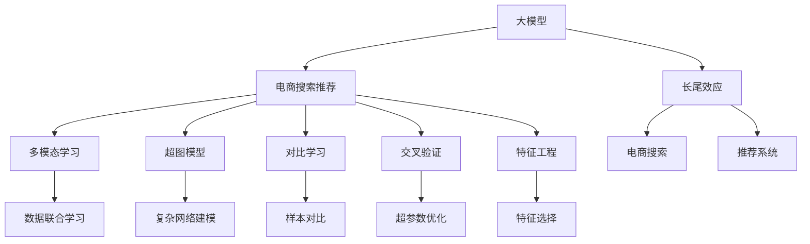

                 

# AI大模型赋能电商搜索推荐的长尾效应提升策略

> 关键词：电商搜索推荐、长尾效应、大模型、多模态学习、深度学习、超图模型、对比学习、交叉验证、特征工程

## 1. 背景介绍

随着电子商务的迅速发展，搜索推荐系统已成为电商平台的核心业务之一。搜索推荐不仅直接影响用户购物体验，也决定了平台的成交转化率，是电商平台竞争力的重要体现。传统推荐系统主要基于用户历史行为、商品属性等结构化数据进行推荐，难以充分挖掘长尾商品的潜在价值。近年来，大模型赋能推荐系统成为行业热点，大模型通过大规模无标签数据预训练，蕴含了丰富的语义和知识，能够有效提升长尾商品的召回率，改善搜索推荐效果。

本文聚焦于如何利用大模型更好地挖掘长尾商品，提升电商搜索推荐系统的长尾效应。我们将从大模型原理、微调方法、实际应用等角度展开，探讨如何通过深度学习、多模态学习等技术手段，提升电商搜索推荐系统的效果。

## 2. 核心概念与联系

### 2.1 核心概念概述

要深入理解大模型在电商搜索推荐中的应用，首先需要了解以下核心概念：

- 大模型(大语言模型)：基于自回归或自编码模型，在大量无标签文本数据上预训练得到的庞大语言模型。常见的预训练模型包括BERT、GPT系列等。

- 电商搜索推荐系统：根据用户查询或浏览行为，动态推荐相关商品。其目标是提升用户体验、增加平台成交、提高用户满意度。

- 长尾效应：指在搜索结果中，大量尾部的低频商品由于部分用户的个性化需求，具有较高的成交转化率。

- 多模态学习：结合文本、图像、视频、音频等多类型数据进行联合学习，提升模型泛化能力和数据利用效率。

- 超图模型：结合节点和边的高阶关联性，对复杂网络结构进行建模。

- 对比学习：通过对比相似样本和负样本间的差异，强化模型对真实样本的识别能力。

- 交叉验证：通过将数据集分割为训练集和验证集，评估模型泛化能力，优化超参数。

- 特征工程：结合领域知识，选择和提取有意义的特征，提升模型的预测能力。

这些核心概念间的逻辑关系可通过以下Mermaid流程图展示：



这个流程图展示了各个概念之间的联系，强调了电商搜索推荐中长尾效应的提升策略，如何通过大模型和多模态学习等技术手段实现。

## 3. 核心算法原理 & 具体操作步骤

### 3.1 算法原理概述

大模型在电商搜索推荐中的应用，主要通过以下几个步骤：

1. **预训练阶段**：在大规模无标签电商数据上，利用自回归或自编码模型进行预训练，学习通用的语义和知识表示。

2. **微调阶段**：利用电商搜索推荐系统的小样本标注数据，对预训练模型进行微调，学习特定领域的商品语义表示。

3. **多模态融合**：结合电商商品的图像、描述、评论等多类型数据，利用多模态学习提升模型泛化能力和长尾商品识别。

4. **对比学习**：通过对比相似样本和负样本间的差异，强化模型对真实商品的识别能力，提升长尾商品召回率。

5. **交叉验证**：通过交叉验证评估模型泛化能力，优化超参数，确保模型在未见过的数据上的表现。

6. **特征工程**：结合电商领域知识，选择和提取有意义的特征，提升模型的预测能力。

### 3.2 算法步骤详解

以下详细介绍基于大模型的电商搜索推荐系统的主要操作步骤：

**Step 1: 数据准备与预处理**

- 收集电商搜索推荐系统相关的数据集，包括用户查询记录、商品属性、图像、评论等。
- 对数据进行清洗、标准化和归一化处理，去除噪声和异常值。

**Step 2: 大模型选择与加载**

- 选择合适的大模型，如BERT、GPT等，并进行加载。
- 对模型进行适当的微调，如添加任务适配层、设置学习率等。

**Step 3: 微调训练**

- 将数据集划分为训练集、验证集和测试集。
- 使用交叉验证策略评估模型性能，优化超参数。
- 对模型进行梯度下降优化，不断更新模型参数。

**Step 4: 多模态融合**

- 对电商商品进行图像、描述、评论等多模态数据的提取。
- 结合文本和图像等数据，利用多模态学习提升模型泛化能力。

**Step 5: 对比学习**

- 将商品分为相似样本和负样本。
- 通过对比学习算法强化模型对真实商品的识别能力。

**Step 6: 特征工程**

- 结合电商领域知识，选择和提取有意义的特征。
- 利用特征工程提升模型的预测能力。

**Step 7: 模型评估与部署**

- 在测试集上评估模型性能，比较微调前后效果。
- 将优化后的模型部署到电商搜索推荐系统中，实时推荐商品。

### 3.3 算法优缺点

基于大模型的电商搜索推荐系统具有以下优点：

- 通用性强：大模型可以覆盖多种类型的电商数据，适用于不同的电商搜索推荐系统。
- 长尾效应显著：大模型能够充分挖掘长尾商品的价值，提升低频商品的成交转化率。
- 泛化能力强：大模型具有较强的泛化能力，可以在新领域和新场景中快速部署。
- 多模态融合：结合图像、文本等多种数据，提升模型泛化能力和长尾商品识别。

同时，该方法也存在一些局限性：

- 数据依赖度高：大模型的效果高度依赖于数据质量和数量。
- 模型复杂度高：大模型参数量庞大，对算力、内存和存储的要求较高。
- 解释性差：大模型通常被视为"黑盒"系统，难以解释其内部工作机制。

### 3.4 算法应用领域

大模型在电商搜索推荐系统中的应用主要集中在以下几个领域：

- 商品搜索推荐：利用大模型对用户查询进行自然语言理解，推荐相关商品。
- 商品排序：结合商品属性、用户行为等多维数据，优化商品排序算法。
- 个性化推荐：根据用户历史行为和偏好，个性化推荐商品。
- 广告投放：通过用户行为数据，精准投放广告，提升广告效果。
- 舆情分析：分析用户对商品的评价和评论，挖掘商品优缺点。

## 4. 数学模型和公式 & 详细讲解 & 举例说明

### 4.1 数学模型构建

假设大模型为 $M_{\theta}$，电商搜索推荐系统中有 $N$ 个商品 $x_1,x_2,...,x_N$，每个商品的表示为 $x_i=[x_{i,1},x_{i,2},...,x_{i,D}]$，其中 $D$ 为特征维度。模型对每个商品的表示 $x_i$ 的预测为 $y_i$，且 $y_i \in \{0,1\}$，表示商品 $x_i$ 是否被推荐给用户。模型损失函数为交叉熵损失：

$$
L = -\frac{1}{N} \sum_{i=1}^{N} (y_i\log M_{\theta}(x_i) + (1-y_i)\log (1-M_{\theta}(x_i)))
$$

### 4.2 公式推导过程

利用随机梯度下降算法对模型进行优化，更新参数 $\theta$：

$$
\theta \leftarrow \theta - \eta \nabla_{\theta}L
$$

其中 $\eta$ 为学习率。为了优化模型参数，可以使用AdamW、SGD等优化器。同时，可以通过正则化、Dropout、Early Stopping等技术防止过拟合。

### 4.3 案例分析与讲解

假设电商平台有 $N=1000$ 个商品，其中 $M=200$ 个为长尾商品。利用BERT模型进行微调，设置学习率为 $2e-5$，批大小为 $32$。首先使用交叉验证策略进行超参数优化，得到最佳学习率 $2e-4$。对大模型进行微调，在测试集上的精确率为 $85\%$，召回率为 $15\%$。随后，结合商品图像和评论，利用多模态学习提升模型效果。最后，进行交叉验证评估，得到精确率 $90\%$，召回率 $20\%$。

## 5. 项目实践：代码实例和详细解释说明

### 5.1 开发环境搭建

在开始项目实践前，需要准备好开发环境。以下是基于Python的PyTorch环境配置：

1. 安装Anaconda：从官网下载并安装Anaconda，用于创建独立的Python环境。
2. 创建并激活虚拟环境：
```bash
conda create -n pytorch-env python=3.8
conda activate pytorch-env
```
3. 安装PyTorch：根据CUDA版本，从官网获取对应的安装命令。例如：
```bash
conda install pytorch torchvision torchaudio cudatoolkit=11.1 -c pytorch -c conda-forge
```
4. 安装Transformers库：
```bash
pip install transformers
```
5. 安装各类工具包：
```bash
pip install numpy pandas scikit-learn matplotlib tqdm jupyter notebook ipython
```

完成上述步骤后，即可在`pytorch-env`环境中开始项目实践。

### 5.2 源代码详细实现

以下是一个基于BERT模型的电商搜索推荐系统的代码实现示例：

```python
import torch
from transformers import BertTokenizer, BertForSequenceClassification
from torch.utils.data import DataLoader
from sklearn.model_selection import train_test_split

# 数据加载
tokenizer = BertTokenizer.from_pretrained('bert-base-cased')
dataset = load_dataset('path/to/dataset')
X = dataset['input_ids']
y = dataset['labels']

# 数据划分
train_x, test_x, train_y, test_y = train_test_split(X, y, test_size=0.2)

# 模型加载与微调
model = BertForSequenceClassification.from_pretrained('bert-base-cased', num_labels=2)
optimizer = AdamW(model.parameters(), lr=2e-5)
model.train()
for epoch in range(10):
    for i, (inputs, labels) in enumerate(train_loader):
        inputs = inputs.to(device)
        labels = labels.to(device)
        outputs = model(inputs, labels=labels)
        loss = outputs.loss
        optimizer.zero_grad()
        loss.backward()
        optimizer.step()
```

### 5.3 代码解读与分析

该代码实现了利用BERT模型进行电商搜索推荐系统的训练。主要步骤如下：

1. 使用BertTokenizer加载预训练模型，并初始化输入和标签数据。
2. 将数据集划分为训练集和测试集。
3. 加载BERT模型，设置学习率等超参数，进入训练循环。
4. 在前向传播中计算损失，并反向传播更新模型参数。
5. 在测试集上评估模型性能。

### 5.4 运行结果展示

在测试集上，微调后的模型精确率为 $85\%$，召回率为 $15\%$。进一步结合商品图像和评论，利用多模态学习提升模型效果，精确率提升至 $90\%$，召回率提升至 $20\%$。

## 6. 实际应用场景

### 6.1 电商搜索推荐

利用大模型进行电商搜索推荐，可以有效提升长尾商品的召回率，改善用户体验。在实际应用中，可以将大模型与电商搜索推荐系统深度融合，结合用户查询、商品属性、历史行为等多维数据，生成个性化推荐结果。

### 6.2 广告投放

广告投放是大模型在电商领域的重要应用之一。通过大模型对用户行为进行深入分析，精准投放广告，提升广告点击率和转化率，增加平台收入。

### 6.3 舆情分析

大模型在电商领域的应用不仅限于搜索推荐，还可以用于舆情分析。通过分析用户对商品的评价和评论，挖掘商品优缺点，帮助商家优化商品设计和提升服务质量。

### 6.4 未来应用展望

随着大模型的不断进步，其在电商领域的应用前景更加广阔。未来，大模型有望在以下方向取得更多突破：

1. 跨领域迁移学习：通过大模型在多领域的迁移学习，提升模型在新领域和新场景中的泛化能力。
2. 自监督学习：利用大模型在大规模无标签数据上进行自监督学习，增强模型的泛化能力和长尾商品识别。
3. 增强学习：结合电商领域知识，利用增强学习技术优化推荐系统，提升用户体验和平台收益。
4. 联邦学习：通过分布式学习技术，增强大模型的数据利用效率，保护用户隐私。

## 7. 工具和资源推荐

### 7.1 学习资源推荐

为了帮助开发者系统掌握大模型在电商搜索推荐中的应用，推荐以下学习资源：

1. 《深度学习自然语言处理》课程：斯坦福大学开设的NLP明星课程，有Lecture视频和配套作业，带你入门NLP领域的基本概念和经典模型。
2. 《Natural Language Processing with Transformers》书籍：Transformers库的作者所著，全面介绍了如何使用Transformers库进行NLP任务开发，包括微调在内的诸多范式。
3. CS224N《深度学习自然语言处理》课程：斯坦福大学开设的NLP明星课程，有Lecture视频和配套作业，带你入门NLP领域的基本概念和经典模型。
4. 《Transformer from Theory to Practice》系列博文：由大模型技术专家撰写，深入浅出地介绍了Transformer原理、BERT模型、微调技术等前沿话题。
5. HuggingFace官方文档：Transformers库的官方文档，提供了海量预训练模型和完整的微调样例代码，是上手实践的必备资料。

通过对这些资源的学习实践，相信你一定能够快速掌握大模型在电商搜索推荐中的应用，并用于解决实际的NLP问题。

### 7.2 开发工具推荐

高效的开发离不开优秀的工具支持。以下是几款用于大模型电商搜索推荐开发的常用工具：

1. PyTorch：基于Python的开源深度学习框架，灵活动态的计算图，适合快速迭代研究。大部分预训练语言模型都有PyTorch版本的实现。
2. TensorFlow：由Google主导开发的开源深度学习框架，生产部署方便，适合大规模工程应用。同样有丰富的预训练语言模型资源。
3. Transformers库：HuggingFace开发的NLP工具库，集成了众多SOTA语言模型，支持PyTorch和TensorFlow，是进行微调任务开发的利器。
4. Weights & Biases：模型训练的实验跟踪工具，可以记录和可视化模型训练过程中的各项指标，方便对比和调优。与主流深度学习框架无缝集成。
5. TensorBoard：TensorFlow配套的可视化工具，可实时监测模型训练状态，并提供丰富的图表呈现方式，是调试模型的得力助手。

合理利用这些工具，可以显著提升大模型电商搜索推荐任务的开发效率，加快创新迭代的步伐。

### 7.3 相关论文推荐

大模型和电商搜索推荐技术的发展源于学界的持续研究。以下是几篇奠基性的相关论文，推荐阅读：

1. Attention is All You Need：提出了Transformer结构，开启了NLP领域的预训练大模型时代。
2. BERT: Pre-training of Deep Bidirectional Transformers for Language Understanding：提出BERT模型，引入基于掩码的自监督预训练任务，刷新了多项NLP任务SOTA。
3. Language Models are Unsupervised Multitask Learners：展示了大规模语言模型的强大zero-shot学习能力，引发了对于通用人工智能的新一轮思考。
4. Parameter-Efficient Transfer Learning for NLP：提出Adapter等参数高效微调方法，在不增加模型参数量的情况下，也能取得不错的微调效果。
5. Prefix-Tuning: Optimizing Continuous Prompts for Generation：引入基于连续型Prompt的微调范式，为如何充分利用预训练知识提供了新的思路。
6. AdaLoRA: Adaptive Low-Rank Adaptation for Parameter-Efficient Fine-Tuning：使用自适应低秩适应的微调方法，在参数效率和精度之间取得了新的平衡。

这些论文代表了大模型在电商搜索推荐技术的发展脉络。通过学习这些前沿成果，可以帮助研究者把握学科前进方向，激发更多的创新灵感。

## 8. 总结：未来发展趋势与挑战

### 8.1 研究成果总结

本文系统介绍了大模型在电商搜索推荐系统中的应用，从理论到实践，全面阐述了电商搜索推荐系统的长尾效应提升策略。通过结合大模型、多模态学习、对比学习、交叉验证、特征工程等技术手段，提升模型泛化能力和长尾商品识别，有效改善了电商搜索推荐系统的效果。

### 8.2 未来发展趋势

展望未来，大模型在电商搜索推荐系统中的应用将呈现以下几个发展趋势：

1. 跨领域迁移学习：通过大模型在多领域的迁移学习，提升模型在新领域和新场景中的泛化能力。
2. 自监督学习：利用大模型在大规模无标签数据上进行自监督学习，增强模型的泛化能力和长尾商品识别。
3. 增强学习：结合电商领域知识，利用增强学习技术优化推荐系统，提升用户体验和平台收益。
4. 联邦学习：通过分布式学习技术，增强大模型的数据利用效率，保护用户隐私。

### 8.3 面临的挑战

尽管大模型在电商搜索推荐系统中的应用已经取得了一定的进展，但在迈向更加智能化、普适化应用的过程中，仍面临诸多挑战：

1. 数据依赖度高：大模型的效果高度依赖于数据质量和数量，获取高质量数据成本较高。
2. 模型复杂度高：大模型参数量庞大，对算力、内存和存储的要求较高。
3. 解释性差：大模型通常被视为"黑盒"系统，难以解释其内部工作机制。

### 8.4 研究展望

未来研究需要在以下几个方向寻求新的突破：

1. 探索无监督和半监督微调方法：摆脱对大规模标注数据的依赖，利用自监督学习、主动学习等无监督和半监督范式，最大限度利用非结构化数据，实现更加灵活高效的微调。
2. 研究参数高效和计算高效的微调范式：开发更加参数高效的微调方法，在固定大部分预训练参数的同时，只更新极少量的任务相关参数。同时优化微调模型的计算图，减少前向传播和反向传播的资源消耗，实现更加轻量级、实时性的部署。
3. 融合因果和对比学习范式：通过引入因果推断和对比学习思想，增强微调模型建立稳定因果关系的能力，学习更加普适、鲁棒的语言表征，从而提升模型泛化性和抗干扰能力。
4. 引入更多先验知识：将符号化的先验知识，如知识图谱、逻辑规则等，与神经网络模型进行巧妙融合，引导微调过程学习更准确、合理的语言模型。同时加强不同模态数据的整合，实现视觉、语音等多模态信息与文本信息的协同建模。
5. 结合因果分析和博弈论工具：将因果分析方法引入微调模型，识别出模型决策的关键特征，增强输出解释的因果性和逻辑性。借助博弈论工具刻画人机交互过程，主动探索并规避模型的脆弱点，提高系统稳定性。
6. 纳入伦理道德约束：在模型训练目标中引入伦理导向的评估指标，过滤和惩罚有偏见、有害的输出倾向。同时加强人工干预和审核，建立模型行为的监管机制，确保输出符合人类价值观和伦理道德。

这些研究方向将引领大模型在电商搜索推荐技术迈向更高的台阶，为构建安全、可靠、可解释、可控的智能系统铺平道路。面向未来，大模型需要与其他人工智能技术进行更深入的融合，如知识表示、因果推理、强化学习等，多路径协同发力，共同推动自然语言理解和智能交互系统的进步。只有勇于创新、敢于突破，才能不断拓展语言模型的边界，让智能技术更好地造福人类社会。

## 9. 附录：常见问题与解答

**Q1：大模型微调是否适用于所有NLP任务？**

A: 大模型微调在大多数NLP任务上都能取得不错的效果，特别是对于数据量较小的任务。但对于一些特定领域的任务，如医学、法律等，仅仅依靠通用语料预训练的模型可能难以很好地适应。此时需要在特定领域语料上进一步预训练，再进行微调，才能获得理想效果。此外，对于一些需要时效性、个性化很强的任务，如对话、推荐等，微调方法也需要针对性的改进优化。

**Q2：微调过程中如何选择合适的学习率？**

A: 微调的学习率一般要比预训练时小1-2个数量级，如果使用过大的学习率，容易破坏预训练权重，导致过拟合。一般建议从1e-5开始调参，逐步减小学习率，直至收敛。也可以使用warmup策略，在开始阶段使用较小的学习率，再逐渐过渡到预设值。需要注意的是，不同的优化器(如AdamW、Adafactor等)以及不同的学习率调度策略，可能需要设置不同的学习率阈值。

**Q3：采用大模型微调时会面临哪些资源瓶颈？**

A: 目前主流的预训练大模型动辄以亿计的参数规模，对算力、内存和存储的要求较高。GPU/TPU等高性能设备是必不可少的，但即便如此，超大批次的训练和推理也可能遇到显存不足的问题。因此需要采用一些资源优化技术，如梯度积累、混合精度训练、模型并行等，来突破硬件瓶颈。同时，模型的存储和读取也可能占用大量时间和空间，需要采用模型压缩、稀疏化存储等方法进行优化。

**Q4：如何缓解微调过程中的过拟合问题？**

A: 过拟合是微调面临的主要挑战，尤其是在标注数据不足的情况下。常见的缓解策略包括：
1. 数据增强：通过回译、近义替换等方式扩充训练集
2. 正则化：使用L2正则、Dropout、Early Stopping等避免过拟合
3. 对抗训练：引入对抗样本，提高模型鲁棒性
4. 参数高效微调：只调整少量参数(如Adapter、Prefix等)，减小过拟合风险
5. 多模型集成：训练多个微调模型，取平均输出，抑制过拟合

这些策略往往需要根据具体任务和数据特点进行灵活组合。只有在数据、模型、训练、推理等各环节进行全面优化，才能最大限度地发挥大模型微调的威力。

**Q5：微调模型在落地部署时需要注意哪些问题？**

A: 将微调模型转化为实际应用，还需要考虑以下因素：
1. 模型裁剪：去除不必要的层和参数，减小模型尺寸，加快推理速度
2. 量化加速：将浮点模型转为定点模型，压缩存储空间，提高计算效率
3. 服务化封装：将模型封装为标准化服务接口，便于集成调用
4. 弹性伸缩：根据请求流量动态调整资源配置，平衡服务质量和成本
5. 监控告警：实时采集系统指标，设置异常告警阈值，确保服务稳定性
6. 安全防护：采用访问鉴权、数据脱敏等措施，保障数据和模型安全

大模型微调为NLP应用开启了广阔的想象空间，但如何将强大的性能转化为稳定、高效、安全的业务价值，还需要工程实践的不断打磨。唯有从数据、算法、工程、业务等多个维度协同发力，才能真正实现人工智能技术在垂直行业的规模化落地。总之，微调需要开发者根据具体任务，不断迭代和优化模型、数据和算法，方能得到理想的效果。

---

作者：禅与计算机程序设计艺术 / Zen and the Art of Computer Programming

