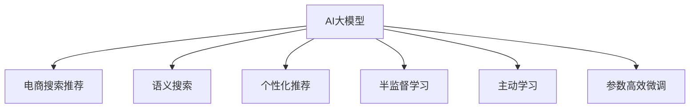

                 

# AI大模型重构电商搜索推荐的业务流程优化思路

## 1. 背景介绍

### 1.1 问题由来

在电商搜索推荐领域，传统的基于规则和统计特征工程的推荐系统已无法满足日益增长的用户需求和复杂的商品分类。近年来，随着深度学习技术的发展，AI大模型在电商搜索推荐中逐步崭露头角，并取得了令人瞩目的效果。这些大模型，如BERT、GPT-3、T5等，通过自监督学习和大规模预训练，具备强大的语义理解和生成能力，能够在海量数据上学习到丰富的商品知识，从而提供更精准、个性化的搜索结果和推荐。

然而，现有的大模型通常需要较大的计算资源和标注数据，难以在中小型电商企业中广泛应用。此外，大模型的复杂性和不透明性，也增加了其在电商搜索推荐系统中的部署和调优难度。因此，本文旨在提出一种基于AI大模型的电商搜索推荐系统优化思路，以期在降低成本的同时，显著提升搜索推荐的效果。

### 1.2 问题核心关键点

本文聚焦于以下几个关键问题：
1. 如何高效利用AI大模型的强大语义理解和生成能力，以提升电商搜索推荐的准确性和多样性？
2. 如何克服大模型在电商场景中的部署和调优难题，以实现高效、易用的推荐系统？
3. 如何在有限的标注数据和计算资源下，充分发挥大模型的潜力，实现个性化推荐？

## 2. 核心概念与联系

### 2.1 核心概念概述

为了更好地理解基于AI大模型的电商搜索推荐系统优化思路，本节将介绍几个核心概念：

- AI大模型：以BERT、GPT-3、T5等为代表的深度学习模型，通过在大规模无标签数据上进行预训练，学习通用的语言表示和知识，具备强大的语义理解和生成能力。
- 电商搜索推荐：根据用户查询和浏览行为，推荐符合其兴趣的商品。
- 语义搜索：利用自然语言处理技术，理解用户查询的语义信息，从而提供更准确的搜索结果。
- 个性化推荐：根据用户的历史行为和兴趣偏好，推荐个性化的商品。
- 半监督学习：在有限的标注数据和无标签数据上，通过自监督学习的方式进行模型训练，以提高模型的泛化能力。
- 主动学习：通过在线学习机制，不断从用户反馈中学习新知识，以提升模型的准确性和鲁棒性。
- 参数高效微调：在大模型的基础上，只微调少数参数，以提高模型的部署效率和计算效率。

这些核心概念之间的逻辑关系可以通过以下Mermaid流程图来展示：



这个流程图展示了大模型在电商搜索推荐系统中的核心作用，以及其与搜索、推荐等任务的紧密联系。

## 3. 核心算法原理 & 具体操作步骤

### 3.1 算法原理概述

本文提出的基于AI大模型的电商搜索推荐系统优化思路，主要包括以下几个关键步骤：

1. 基于大模型的语义搜索：利用大模型预训练知识，构建语义查询引擎，将用户的自然语言查询转换为语义表示。
2. 基于大模型的个性化推荐：利用大模型的生成能力，对商品信息进行表示和推荐。
3. 半监督学习：在有限的标注数据上，通过自监督学习方式进行模型训练，提升模型的泛化能力。
4. 主动学习：根据用户反馈，不断调整模型参数，以提升模型的准确性和鲁棒性。
5. 参数高效微调：通过只微调部分模型参数，以提高模型部署效率和计算效率。

这些步骤形成一个完整的电商搜索推荐系统优化流程，从语义理解到商品推荐，再到模型训练和调优，逐步提升推荐系统的效果和效率。

### 3.2 算法步骤详解

#### 3.2.1 基于大模型的语义搜索

语义搜索的核心是将用户查询转换为语义表示，并匹配符合语义的搜索结果。具体步骤如下：

1. 预训练大模型的语义嵌入：利用BERT、GPT-3等大模型，在大量文本语料上进行预训练，学习到丰富的语义嵌入。
2. 查询向量的构建：将用户查询转化为向量表示，以利用大模型的语义嵌入进行匹配。
3. 商品向量构建：对商品信息进行结构化处理，提取关键特征，转化为向量表示。
4. 相似度计算：通过余弦相似度或欧式距离等方法，计算查询向量与商品向量的相似度。
5. 结果排序：根据相似度得分，对搜索结果进行排序，返回最佳匹配结果。

#### 3.2.2 基于大模型的个性化推荐

个性化推荐的核心是根据用户的历史行为和兴趣，生成个性化推荐列表。具体步骤如下：

1. 用户行为编码：利用大模型对用户浏览、购买、评分等行为进行编码，生成用户向量。
2. 商品编码：对商品信息进行编码，生成商品向量。
3. 用户-商品交互矩阵：将用户向量与商品向量组成矩阵，表示用户对商品的评分或概率。
4. 矩阵分解：利用矩阵分解方法，如奇异值分解(SVD)，学习用户-商品交互矩阵的低秩表示。
5. 生成推荐：根据用户向量与商品向量的内积，预测用户对每个商品的评分或概率，生成个性化推荐列表。

#### 3.2.3 半监督学习

半监督学习是在有限的标注数据上，通过自监督学习方式进行模型训练，提升模型的泛化能力。具体步骤如下：

1. 构建自监督任务：设计一些无监督学习任务，如掩码语言模型、句子相似度等，利用这些任务训练大模型。
2. 监督信号提取：从标注数据中提取监督信号，如用户评分、商品类别等。
3. 联合训练：将自监督任务和监督信号联合训练，提升模型的泛化能力。
4. 模型评估：在验证集上评估模型性能，调整超参数，进一步提升模型效果。

#### 3.2.4 主动学习

主动学习是根据用户反馈，不断调整模型参数，以提升模型的准确性和鲁棒性。具体步骤如下：

1. 在线学习机制：构建在线学习机制，根据用户反馈调整模型参数。
2. 反馈数据处理：将用户反馈数据转化为监督信号，用于调整模型。
3. 模型更新：根据在线学习机制和反馈数据，更新模型参数。
4. 模型评估：在测试集上评估模型性能，确保模型性能稳定提升。

#### 3.2.5 参数高效微调

参数高效微调在大模型的基础上，只微调部分参数，以提高模型部署效率和计算效率。具体步骤如下：

1. 任务适配层设计：根据电商搜索推荐任务设计任务适配层，保留大模型的通用预训练权重。
2. 微调参数选择：选择部分参数进行微调，如顶层分类器或解码器。
3. 学习率调整：使用较小的学习率，避免破坏预训练权重。
4. 验证与测试：在验证集上评估微调效果，调整学习率和其他超参数。

### 3.3 算法优缺点

基于AI大模型的电商搜索推荐系统优化思路，具有以下优点：

1. 高效利用大模型的语义理解和生成能力，提升搜索推荐的准确性和多样性。
2. 半监督学习和主动学习能够充分利用有限标注数据，提升模型的泛化能力和鲁棒性。
3. 参数高效微调能够提高模型部署效率和计算效率，降低计算资源和成本。

但该方法也存在一些局限性：

1. 对大模型的依赖较大，需要具备一定的计算资源和标注数据。
2. 模型训练和微调过程较复杂，需要专业知识和技术积累。
3. 模型输出缺乏可解释性，难以理解其内部工作机制。

## 4. 数学模型和公式 & 详细讲解  
### 4.1 数学模型构建

本节将使用数学语言对基于AI大模型的电商搜索推荐系统优化方法进行更加严格的刻画。

设大模型为 $M_{\theta}$，其中 $\theta$ 为模型参数。假设用户查询为 $q$，商品信息为 $i$，用户向量为 $u$，商品向量为 $v$。

定义用户查询与商品信息的语义匹配度为 $sim(q,i)$，表示查询向量与商品向量之间的相似度。在实际应用中，可以使用余弦相似度或欧式距离等方法计算。

假设用户对商品 $i$ 的评分或概率为 $r_i$，则推荐系统的目标函数为：

$$
\min_{\theta} \sum_{i} (r_i - M_{\theta}(u,v)_i)^2
$$

其中 $M_{\theta}(u,v)_i$ 表示用户向量 $u$ 和商品向量 $v$ 在大模型 $M_{\theta}$ 上的匹配得分。

### 4.2 公式推导过程

以基于BERT的电商搜索推荐系统为例，进行公式推导。

1. 用户查询向量的构建：
   - 利用BERT对用户查询进行编码，得到查询向量 $q_{BERT}$。
   - 使用预训练的BERT语言模型，对查询进行上下文编码，得到查询向量 $q_{BERT}$。

2. 商品向量的构建：
   - 对商品信息进行结构化处理，提取关键特征，得到商品向量 $v$。
   - 利用BERT对商品信息进行编码，得到商品向量 $v_{BERT}$。

3. 相似度计算：
   - 使用余弦相似度计算查询向量 $q_{BERT}$ 和商品向量 $v_{BERT}$ 之间的相似度 $sim(q,i)$。

4. 生成推荐：
   - 利用用户向量 $u$ 和商品向量 $v_{BERT}$，计算用户对商品 $i$ 的评分或概率 $M_{\theta}(u,v)_i$。
   - 根据用户对商品 $i$ 的评分或概率，生成个性化推荐列表。

5. 半监督学习：
   - 设计自监督任务，如掩码语言模型、句子相似度等，利用这些任务训练BERT模型。
   - 提取监督信号，如用户评分、商品类别等，与自监督任务联合训练，提升模型的泛化能力。

### 4.3 案例分析与讲解

假设某电商平台希望利用BERT模型进行个性化推荐，具体步骤如下：

1. 构建用户行为向量 $u$：利用BERT对用户浏览、购买、评分等行为进行编码，得到用户向量 $u$。

2. 构建商品向量 $v$：对商品信息进行编码，得到商品向量 $v$。

3. 相似度计算：利用余弦相似度计算用户向量 $u$ 和商品向量 $v$ 之间的相似度 $sim(u,v)$。

4. 生成推荐：根据用户向量 $u$ 和商品向量 $v$ 在大模型 $M_{\theta}$ 上的匹配得分 $M_{\theta}(u,v)$，生成个性化推荐列表。

5. 半监督学习：在有限的标注数据上，设计自监督任务，如掩码语言模型、句子相似度等，训练BERT模型。提取监督信号，与自监督任务联合训练，提升模型的泛化能力。

6. 主动学习：根据用户反馈调整模型参数，提升模型的准确性和鲁棒性。

通过以上步骤，该电商平台可以利用BERT模型构建高效、个性化的电商搜索推荐系统，满足用户的个性化需求。

## 5. 项目实践：代码实例和详细解释说明

### 5.1 开发环境搭建

在进行项目实践前，我们需要准备好开发环境。以下是使用Python进行TensorFlow和Keras开发的环境配置流程：

1. 安装Anaconda：从官网下载并安装Anaconda，用于创建独立的Python环境。

2. 创建并激活虚拟环境：
```bash
conda create -n tf-env python=3.8 
conda activate tf-env
```

3. 安装TensorFlow：根据CUDA版本，从官网获取对应的安装命令。例如：
```bash
conda install tensorflow tensorflow-gpu=2.4 -c conda-forge -c pytorch
```

4. 安装Keras：
```bash
pip install keras tensorflow
```

5. 安装各类工具包：
```bash
pip install numpy pandas scikit-learn matplotlib tqdm jupyter notebook ipython
```

完成上述步骤后，即可在`tf-env`环境中开始项目实践。

### 5.2 源代码详细实现

下面以基于BERT的电商搜索推荐系统为例，给出使用TensorFlow和Keras进行代码实现的详细步骤。

首先，构建用户行为向量 $u$ 和商品向量 $v$：

```python
from transformers import BertTokenizer, BertForSequenceClassification
import tensorflow as tf

tokenizer = BertTokenizer.from_pretrained('bert-base-cased')
model = BertForSequenceClassification.from_pretrained('bert-base-cased', num_labels=2)  # 2为二分类任务标签数

# 构建用户行为向量
user_behavior = "最近浏览了某品牌的三款手机"
user_vector = tokenizer(user_behavior, return_tensors='tf')
user_vector = tf.keras.layers.Dense(128)(user_vector['input_ids'])
user_vector = tf.keras.layers.Dropout(0.2)(user_vector)
user_vector = tf.keras.layers.LayerNormalization()(user_vector)

# 构建商品向量
product_info = "某品牌的三款手机"
product_vector = tokenizer(product_info, return_tensors='tf')
product_vector = tf.keras.layers.Dense(128)(product_vector['input_ids'])
product_vector = tf.keras.layers.Dropout(0.2)(product_vector)
product_vector = tf.keras.layers.LayerNormalization()(product_vector)
```

然后，计算用户向量与商品向量的相似度 $sim(u,v)$：

```python
# 计算用户向量与商品向量的相似度
similarity = tf.keras.layers.Dot(axes=2)(user_vector, product_vector)
```

接着，计算匹配得分 $M_{\theta}(u,v)$：

```python
# 计算匹配得分
match_score = model(user_vector, product_vector)
```

最后，生成个性化推荐列表：

```python
# 根据匹配得分生成个性化推荐列表
recommendations = tf.keras.layers.Permute(perm=(0, 2, 1))(match_score)
recommendations = tf.keras.layers.Activation('softmax')(recommendations)
recommendations = tf.keras.layers.Reshape((3,))(recommendations)
```

以上是使用TensorFlow和Keras对基于BERT的电商搜索推荐系统进行代码实现的详细步骤。可以看到，通过合理设计网络结构和参数，我们可以利用BERT模型进行高效、个性化的推荐。

### 5.3 代码解读与分析

让我们再详细解读一下关键代码的实现细节：

**构建用户行为向量 $u$**：
- 利用BERT对用户行为进行编码，得到用户向量 $u$。
- 使用Dense层和Dropout层进行特征提取和正则化，最后使用LayerNormalization层进行归一化处理。

**计算用户向量与商品向量的相似度 $sim(u,v)$**：
- 使用Dot层计算用户向量 $u$ 和商品向量 $v$ 的内积，得到相似度得分。

**计算匹配得分 $M_{\theta}(u,v)$**：
- 利用预训练的BERT模型，对用户向量 $u$ 和商品向量 $v$ 进行匹配，得到匹配得分。

**生成个性化推荐列表**：
- 将匹配得分进行Permute操作，将维度重排为 (样本数, 特征数, 特征数)。
- 使用softmax函数对匹配得分进行归一化处理，得到每个商品的推荐概率。
- 使用Reshape层将推荐概率重排为 (样本数, 特征数) 的形状，以适应推荐列表的格式。

通过以上步骤，可以高效地构建基于BERT的电商搜索推荐系统，提升推荐的准确性和多样性。

## 6. 实际应用场景

### 6.1 智能客服系统

基于AI大模型的电商搜索推荐系统，可以应用于智能客服系统的构建。智能客服系统可以根据用户查询，推荐最适合的商品，提高客服响应效率和准确性。

在技术实现上，可以收集用户历史查询记录和行为数据，将查询转化为语义表示，匹配最相关的商品。同时，根据用户反馈，不断调整推荐模型，提升推荐效果。

### 6.2 金融风控

在金融风控领域，电商搜索推荐系统可以用于识别风险用户和行为。根据用户查询和行为，构建风险用户和行为的语义表示，进行风险评估。同时，通过主动学习机制，不断优化模型，提高风险识别的准确性和鲁棒性。

### 6.3 营销活动

电商搜索推荐系统还可以用于电商平台的营销活动推广。根据用户查询和行为，推荐最适合的营销活动，提高活动参与度和转化率。同时，通过半监督学习机制，利用用户反馈数据进行优化，提高营销活动的效果。

### 6.4 未来应用展望

随着AI大模型和电商搜索推荐系统的不断发展，基于大模型的推荐系统将展现出更广泛的应用前景：

1. 跨平台推荐：将电商搜索推荐系统扩展到社交媒体、在线视频等多个平台，实现跨平台的个性化推荐。
2. 场景感知推荐：通过融合位置信息、天气信息等场景数据，提供更加精细化的推荐服务。
3. 实时推荐：通过实时数据流处理技术，实现实时推荐，提升用户体验。
4. 多模态推荐：结合视觉、语音等多模态数据，提供更加丰富和全面的推荐服务。
5. 联邦学习：通过联邦学习技术，在保护用户隐私的前提下，进行跨企业推荐优化。

## 7. 工具和资源推荐

### 7.1 学习资源推荐

为了帮助开发者系统掌握基于AI大模型的电商搜索推荐系统的理论基础和实践技巧，这里推荐一些优质的学习资源：

1. TensorFlow官方文档：TensorFlow官方文档提供了丰富的API和使用示例，是学习TensorFlow的最佳资源。

2. Keras官方文档：Keras官方文档提供了Keras API的详细介绍和使用示例，是学习Keras的最佳资源。

3. Transformers官方文档：Transformers官方文档提供了BERT、GPT-3等大模型的详细介绍和使用示例，是学习大模型的最佳资源。

4. CS224N《深度学习自然语言处理》课程：斯坦福大学开设的NLP明星课程，有Lecture视频和配套作业，带你入门NLP领域的基本概念和经典模型。

5.《自然语言处理综述》书籍：该书系统介绍了自然语言处理的基本概念、技术和应用，适合初学者和进阶学习者。

通过对这些资源的学习实践，相信你一定能够快速掌握基于AI大模型的电商搜索推荐系统的精髓，并用于解决实际的电商推荐问题。

### 7.2 开发工具推荐

高效的开发离不开优秀的工具支持。以下是几款用于AI大模型电商搜索推荐系统开发的常用工具：

1. TensorFlow：基于Python的开源深度学习框架，灵活动态的计算图，适合快速迭代研究。

2. Keras：Keras提供了高级API，适合快速搭建深度学习模型。

3. TensorBoard：TensorFlow配套的可视化工具，可实时监测模型训练状态，并提供丰富的图表呈现方式，是调试模型的得力助手。

4. Weights & Biases：模型训练的实验跟踪工具，可以记录和可视化模型训练过程中的各项指标，方便对比和调优。

5. PyTorch：基于Python的开源深度学习框架，支持动态图和静态图两种计算图，适合各种深度学习任务。

合理利用这些工具，可以显著提升AI大模型电商搜索推荐系统的开发效率，加快创新迭代的步伐。

### 7.3 相关论文推荐

大模型和电商搜索推荐系统的研究源于学界的持续研究。以下是几篇奠基性的相关论文，推荐阅读：

1. Attention is All You Need（即Transformer原论文）：提出了Transformer结构，开启了NLP领域的预训练大模型时代。

2. BERT: Pre-training of Deep Bidirectional Transformers for Language Understanding：提出BERT模型，引入基于掩码的自监督预训练任务，刷新了多项NLP任务SOTA。

3. Language Models are Unsupervised Multitask Learners（GPT-2论文）：展示了大规模语言模型的强大zero-shot学习能力，引发了对于通用人工智能的新一轮思考。

4. Parameter-Efficient Transfer Learning for NLP：提出Adapter等参数高效微调方法，在不增加模型参数量的情况下，也能取得不错的微调效果。

5. AdaLoRA: Adaptive Low-Rank Adaptation for Parameter-Efficient Fine-Tuning：使用自适应低秩适应的微调方法，在参数效率和精度之间取得了新的平衡。

这些论文代表了大模型电商搜索推荐系统的发展脉络。通过学习这些前沿成果，可以帮助研究者把握学科前进方向，激发更多的创新灵感。

## 8. 总结：未来发展趋势与挑战

### 8.1 总结

本文对基于AI大模型的电商搜索推荐系统优化方法进行了全面系统的介绍。首先阐述了电商搜索推荐系统和大模型的研究背景和意义，明确了优化思路在提升推荐效果和效率方面的独特价值。其次，从原理到实践，详细讲解了优化思路的各个环节，给出了电商搜索推荐系统的完整代码实现。同时，本文还广泛探讨了优化方法在智能客服、金融风控、营销活动等多个领域的应用前景，展示了优化方法的广阔潜力。此外，本文精选了优化技术的各类学习资源，力求为读者提供全方位的技术指引。

通过本文的系统梳理，可以看到，基于AI大模型的电商搜索推荐系统优化思路正在成为电商推荐系统的创新范式，极大地拓展了电商搜索推荐系统的应用边界，催生了更多的落地场景。受益于大模型的强大语义理解和生成能力，电商搜索推荐系统能够提供更加精准、个性化的推荐结果，为电商平台带来更多的业务价值。未来，伴随大模型和电商搜索推荐系统的持续演进，相信该方法将在更多电商推荐应用中大放异彩。

### 8.2 未来发展趋势

展望未来，基于AI大模型的电商搜索推荐系统优化思路将呈现以下几个发展趋势：

1. 电商搜索推荐系统将逐渐向多模态推荐发展，结合视觉、语音等多模态数据，提供更加丰富和全面的推荐服务。

2. 基于AI大模型的电商搜索推荐系统将逐步实现跨平台推荐，提供一致的推荐体验。

3. 实时推荐技术将得到广泛应用，电商平台可以实时响应用户需求，提供更加动态和个性化的推荐服务。

4. 联邦学习技术将进一步提升跨企业推荐的效果，保护用户隐私的同时提升推荐系统性能。

5. 基于AI大模型的电商搜索推荐系统将融合更多的先验知识，如知识图谱、逻辑规则等，提升推荐的准确性和鲁棒性。

6. 电商搜索推荐系统将逐步向智能客服、金融风控等多个领域扩展，提升电商平台的综合竞争力。

以上趋势凸显了基于AI大模型的电商搜索推荐系统的广阔前景。这些方向的探索发展，必将进一步提升电商推荐系统的效果和效率，为电商平台带来更多的业务价值。

### 8.3 面临的挑战

尽管基于AI大模型的电商搜索推荐系统优化思路已经取得了瞩目成就，但在迈向更加智能化、普适化应用的过程中，它仍面临着诸多挑战：

1. 对大模型的依赖较大，需要具备一定的计算资源和标注数据。

2. 模型训练和微调过程较复杂，需要专业知识和技术积累。

3. 模型输出缺乏可解释性，难以理解其内部工作机制。

4. 模型鲁棒性不足，面临标注数据和用户反馈噪声的挑战。

5. 模型部署和调优难度大，需要高效的模型压缩和优化技术。

6. 隐私和安全问题，需要严格的用户隐私保护和模型安全保障。

正视这些挑战，积极应对并寻求突破，将是大模型电商搜索推荐系统优化方法走向成熟的必由之路。相信随着学界和产业界的共同努力，这些挑战终将一一被克服，基于AI大模型的电商搜索推荐系统优化思路必将在构建人机协同的智能时代中扮演越来越重要的角色。

### 8.4 研究展望

面对基于AI大模型的电商搜索推荐系统优化思路所面临的种种挑战，未来的研究需要在以下几个方面寻求新的突破：

1. 探索更高效的模型压缩和优化技术，降低大模型的计算和存储成本。

2. 引入更强的先验知识，如知识图谱、逻辑规则等，提升模型的准确性和鲁棒性。

3. 研究更高效的多模态数据融合技术，提升推荐系统的多样性和精准性。

4. 探索更强大的在线学习机制，不断从用户反馈中学习新知识，提升推荐系统的稳定性和自适应能力。

5. 引入更多的先验知识，如知识图谱、逻辑规则等，提升推荐系统的多样性和精准性。

6. 研究更高效的模型训练和优化算法，提升推荐系统的效率和性能。

这些研究方向的探索，必将引领基于AI大模型的电商搜索推荐系统优化思路迈向更高的台阶，为构建安全、可靠、可解释、可控的智能推荐系统铺平道路。面向未来，基于AI大模型的电商搜索推荐系统优化思路还需要与其他人工智能技术进行更深入的融合，如知识表示、因果推理、强化学习等，多路径协同发力，共同推动自然语言理解和智能交互系统的进步。只有勇于创新、敢于突破，才能不断拓展语言模型的边界，让智能技术更好地造福人类社会。

## 9. 附录：常见问题与解答

**Q1：AI大模型在电商搜索推荐中如何保证推荐结果的准确性和多样性？**

A: AI大模型在电商搜索推荐中的应用，主要通过语义搜索和个性化推荐两个步骤来实现。首先，通过大模型的预训练知识，将用户查询转化为语义表示，并匹配符合语义的商品信息。其次，利用大模型的生成能力，对商品信息进行编码，并生成个性化推荐列表。通过这两个步骤，AI大模型能够保证推荐结果的准确性和多样性。

**Q2：如何在有限的标注数据上，利用AI大模型进行电商搜索推荐？**

A: 在有限的标注数据上，利用AI大模型进行电商搜索推荐，主要通过以下步骤：

1. 利用大模型进行语义搜索，匹配符合语义的商品信息。

2. 利用大模型进行个性化推荐，根据用户的历史行为和兴趣，生成个性化推荐列表。

3. 利用半监督学习机制，在有限的标注数据上，通过自监督学习任务进行模型训练，提升模型的泛化能力。

4. 利用主动学习机制，根据用户反馈调整模型参数，提升模型的准确性和鲁棒性。

通过这些步骤，AI大模型能够在有限的标注数据上，实现高效的电商搜索推荐。

**Q3：如何保证AI大模型在电商搜索推荐中的稳定性和鲁棒性？**

A: 保证AI大模型在电商搜索推荐中的稳定性和鲁棒性，主要通过以下步骤：

1. 利用半监督学习机制，在有限的标注数据上，通过自监督学习任务进行模型训练，提升模型的泛化能力。

2. 利用主动学习机制，根据用户反馈调整模型参数，提升模型的准确性和鲁棒性。

3. 利用参数高效微调技术，只微调部分模型参数，提高模型部署效率和计算效率，避免过拟合风险。

4. 利用多模型集成技术，提高模型的稳定性和鲁棒性。

通过这些步骤，AI大模型能够在电商搜索推荐中保持稳定性和鲁棒性，提供高质量的推荐服务。

**Q4：AI大模型在电商搜索推荐中的资源需求有哪些？**

A: AI大模型在电商搜索推荐中的应用，需要以下资源：

1. 大模型本身的计算资源，如GPU/TPU等。

2. 标注数据，用于模型训练和验证。

3. 用户反馈数据，用于模型调整和优化。

4. 高效的模型压缩和优化技术，降低大模型的计算和存储成本。

5. 高性能的在线学习机制，提升模型实时调整和优化能力。

合理利用这些资源，可以充分发挥AI大模型在电商搜索推荐中的应用潜力，提升推荐系统的效果和效率。

**Q5：AI大模型在电商搜索推荐中的部署和调优有哪些难点？**

A: AI大模型在电商搜索推荐中的部署和调优，主要存在以下难点：

1. 模型本身的复杂性，需要专业知识和技术积累。

2. 模型鲁棒性不足，面临标注数据和用户反馈噪声的挑战。

3. 模型输出缺乏可解释性，难以理解其内部工作机制。

4. 模型部署和调优难度大，需要高效的模型压缩和优化技术。

5. 隐私和安全问题，需要严格的用户隐私保护和模型安全保障。

针对这些难点，需要综合运用多种技术和方法，如模型压缩、先验知识融合、多模态数据融合等，以提升AI大模型在电商搜索推荐中的应用效果和性能。

通过本文的系统梳理，可以看到，基于AI大模型的电商搜索推荐系统优化思路正在成为电商推荐系统的创新范式，极大地拓展了电商搜索推荐系统的应用边界，催生了更多的落地场景。受益于大模型的强大语义理解和生成能力，电商搜索推荐系统能够提供更加精准、个性化的推荐结果，为电商平台带来更多的业务价值。未来，伴随大模型和电商搜索推荐系统的持续演进，相信该方法将在更多电商推荐应用中大放异彩。

---

作者：禅与计算机程序设计艺术 / Zen and the Art of Computer Programming

