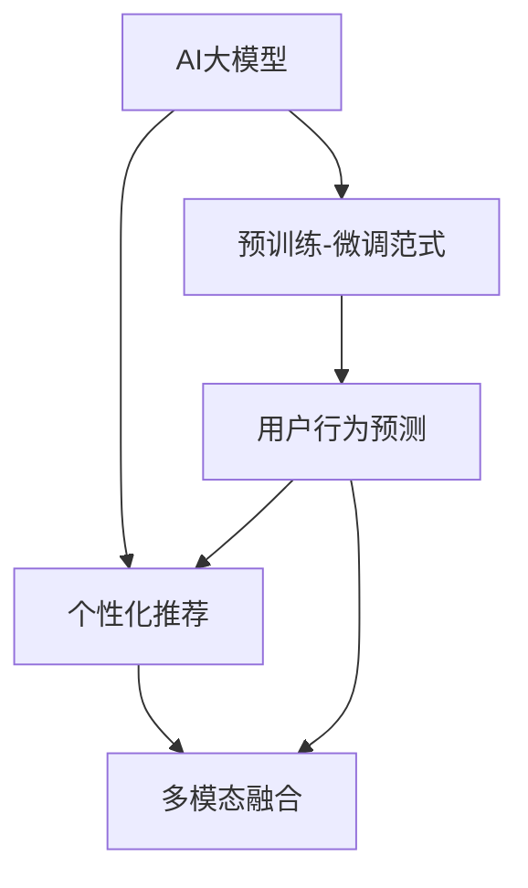

                 

# AI大模型驱动电商搜索推荐个性化体验提升

在现代电子商务的迅猛发展中，个性化搜索推荐系统已成为提高用户体验和商家收入的重要工具。传统的基于规则或协同过滤的推荐系统，由于缺乏对用户个性化需求的深刻理解，难以满足多样化的用户需求。而近年来，随着AI大模型的兴起，基于深度学习的推荐系统逐渐成为行业主流，有望解决传统推荐系统的诸多弊端。本文将深入探讨大模型在电商搜索推荐中的个性化体验提升策略，为电商行业带来新的突破。

## 1. 背景介绍

### 1.1 问题由来
随着电子商务的快速增长，用户每天在平台上产生海量的数据。如何从这些数据中挖掘出用户的行为和偏好，精准推荐其感兴趣的商品，成为电商平台提升用户体验的关键。传统的推荐系统依赖于规则或用户之间的协同行为，难以全面刻画用户个性化需求，且难以跨时间、跨商品形成长效稳定的推荐。而AI大模型通过深度学习技术，能够自动学习和挖掘数据中复杂的模式和关系，弥补了传统推荐系统的诸多不足。

### 1.2 问题核心关键点
大模型在电商搜索推荐中的个性化体验提升主要聚焦于以下几个关键点：

1. **深度表示学习**：通过预训练大模型，学习用户和商品的深度表示，捕捉用户行为和商品属性之间的复杂关系。
2. **精准召回**：在商品海洋中精准召回用户可能感兴趣的商品，提升推荐的相关性和准确性。
3. **用户行为预测**：基于用户历史行为数据，预测用户的未来行为，实现个性化推荐。
4. **上下文感知**：考虑用户上下文信息，如地理位置、设备属性等，提升推荐的多样性和精准度。
5. **多模态融合**：融合图像、视频、文本等多模态数据，提供更加丰富和全面的推荐服务。

### 1.3 问题研究意义
通过深度学习技术，大模型在电商搜索推荐中的应用，可以显著提升个性化推荐的效果，改善用户体验，增加商家收益，同时促进电子商务的可持续发展。

1. **提升用户体验**：个性化的推荐系统能够提供更符合用户需求的商品，减少用户搜索成本，提高购物满意度。
2. **增加商家收益**：精准的推荐能够提升商品的转化率和销售量，增加商家的收益和利润。
3. **推动电子商务发展**：通过个性化推荐，电商平台能够更好地满足用户需求，扩大用户覆盖面，促进电商行业的持续增长。

## 2. 核心概念与联系

### 2.1 核心概念概述

为更好地理解大模型在电商搜索推荐中的应用，本节将介绍几个密切相关的核心概念：

- **AI大模型**：指基于深度学习架构，具有大规模参数量和丰富知识表示的模型。通过在大规模数据上进行预训练，可以自动学习到复杂的语言和视觉表示，如BERT、GPT等。
- **预训练-微调范式**：通过在大规模无标签数据上进行预训练，学习通用知识表示，然后在小规模有标签数据上微调，以适应特定任务。预训练-微调范式在电商推荐中尤为重要，可以提升推荐模型的泛化能力。
- **个性化推荐**：指通过用户的历史行为数据，预测用户的未来需求，推荐用户可能感兴趣的商品。个性化推荐技术能够显著提升用户的购物体验，增加商家的销售额。
- **多模态融合**：融合图像、视频、文本等多模态数据，提供更加全面和准确的推荐服务。多模态数据可以捕捉用户的全方位需求，提升推荐的精准度。

这些核心概念之间的逻辑关系可以通过以下Mermaid流程图来展示：



这个流程图展示了大模型在电商推荐中的应用流程：

1. 大模型通过预训练学习通用知识表示。
2. 在电商推荐任务上进行微调，优化推荐效果。
3. 使用多模态融合技术，提供全方位推荐服务。
4. 基于用户行为预测进行个性化推荐。

## 3. 核心算法原理 & 具体操作步骤
### 3.1 算法原理概述

大模型在电商搜索推荐中的应用，主要基于预训练-微调范式和深度学习技术。其核心思想是：通过预训练学习到通用的用户和商品表示，然后针对特定推荐任务进行微调，学习用户和商品之间的复杂关系，实现精准的个性化推荐。

形式化地，假设预训练模型为 $M_{\theta}$，其中 $\theta$ 为预训练得到的模型参数。电商推荐任务可以表示为预测用户 $u$ 对商品 $i$ 的评分 $y$。在此基础上，定义模型 $M_{\theta}$ 在输入 $(x_i,x_u)$ 上的预测损失函数 $\ell$：

$$
\ell(M_{\theta}(x_i,x_u),y) = \sum_{u}(y_u - M_{\theta}(x_i,x_u))^2
$$

其中 $y_u$ 为用户 $u$ 对商品 $i$ 的评分，$M_{\theta}(x_i,x_u)$ 为模型在输入 $(x_i,x_u)$ 上的预测评分。

微调的目标是找到最优参数 $\hat{\theta}$，使得：

$$
\hat{\theta} = \mathop{\arg\min}_{\theta} \mathcal{L}(M_{\theta},D)
$$

其中 $\mathcal{L}$ 为针对电商推荐任务设计的损失函数，$\{(x_i,x_u,y_u)\}_{i=1}^N$ 为电商推荐任务的标注数据集。

### 3.2 算法步骤详解

基于深度学习的大模型在电商推荐中的应用，一般包括以下几个关键步骤：

**Step 1: 准备数据集**
- 收集电商平台的交易数据、用户行为数据、商品属性数据等，构建标注数据集 $D=\{(x_i,x_u,y_u)\}_{i=1}^N$，其中 $x_i$ 为商品描述，$x_u$ 为用户行为特征，$y_u$ 为用户对商品的评分。

**Step 2: 预训练模型初始化**
- 选择预训练模型 $M_{\theta}$，如BERT、GPT等，作为初始化参数。

**Step 3: 微调模型**
- 使用标注数据集对预训练模型进行微调，学习用户和商品之间的关系。一般采用交叉熵损失函数，优化器如AdamW等，设置合适的学习率、批大小等超参数。
- 迭代训练，计算损失函数 $\mathcal{L}(M_{\theta},D)$，更新模型参数 $\theta$。

**Step 4: 评估与部署**
- 在测试集上评估微调后的模型性能，如准确率、召回率等。
- 使用微调后的模型对新商品进行推荐，集成到电商平台的推荐系统中。
- 持续收集新数据，定期重新微调模型，以适应数据分布的变化。

### 3.3 算法优缺点

基于深度学习的大模型在电商推荐中的应用，具有以下优点：

1. **泛化能力强**：大模型通过预训练学习到通用的用户和商品表示，对新商品的推荐效果较好。
2. **效果显著**：深度表示学习和多模态融合技术，能够提供更加全面和精准的推荐服务。
3. **可解释性强**：大模型的决策过程可以通过特征重要性分析等方法，提供一定的可解释性。

同时，该方法也存在一些局限性：

1. **对标注数据依赖大**：微调的效果很大程度上依赖于标注数据的质量和数量，获取高质量标注数据的成本较高。
2. **资源消耗大**：大模型训练和推理需要大量的计算资源和存储空间，不适合小规模电商平台。
3. **模型复杂度高**：大模型参数量庞大，维护和使用较为复杂。
4. **用户隐私问题**：电商平台需要处理大量的用户数据，数据隐私和安全问题需高度重视。

尽管存在这些局限性，但就目前而言，基于深度学习的大模型在电商推荐中的应用仍然具有不可替代的优势。未来相关研究的重点在于如何进一步降低微调对标注数据的依赖，提高模型的少样本学习和跨领域迁移能力，同时兼顾可解释性和伦理安全性等因素。

### 3.4 算法应用领域

大模型在电商推荐中的应用，不仅局限于传统的商品推荐，还涵盖以下几个重要领域：

1. **个性化搜索**：根据用户的搜索关键词，预测用户可能感兴趣的商品，提升搜索的精准度和用户体验。
2. **新商品推荐**：针对新商品，通过大模型学习到其与现有商品的关系，快速形成推荐策略。
3. **跨商品推荐**：结合多模态数据，实现跨品类、跨平台的商品推荐。
4. **上下文感知推荐**：考虑用户上下文信息，如地理位置、设备属性等，提供更加个性化和多样化的推荐服务。
5. **实时推荐**：基于实时数据流，动态更新推荐策略，提升推荐的时效性和准确性。

这些应用领域覆盖了电商平台的各个环节，能够显著提升用户体验和商家收益。随着大模型的不断演进和优化，未来其在电商推荐中的应用前景将更加广阔。

## 4. 数学模型和公式 & 详细讲解  
### 4.1 数学模型构建

本节将使用数学语言对大模型在电商推荐中的应用进行更加严格的刻画。

假设电商推荐任务为预测用户 $u$ 对商品 $i$ 的评分 $y$，标注数据集为 $D=\{(x_i,x_u,y_u)\}_{i=1}^N$。定义模型 $M_{\theta}$ 在输入 $(x_i,x_u)$ 上的预测损失函数为：

$$
\ell(M_{\theta}(x_i,x_u),y) = \sum_{u}(y_u - M_{\theta}(x_i,x_u))^2
$$

在微调过程中，目标是最小化损失函数 $\mathcal{L}(\theta)$：

$$
\mathcal{L}(\theta) = \frac{1}{N} \sum_{i=1}^N \sum_{u}(y_u - M_{\theta}(x_i,x_u))^2
$$

模型 $M_{\theta}$ 的参数更新公式为：

$$
\theta \leftarrow \theta - \eta \nabla_{\theta}\mathcal{L}(\theta)
$$

其中 $\nabla_{\theta}\mathcal{L}(\theta)$ 为损失函数对参数 $\theta$ 的梯度，通过反向传播算法计算得到。

### 4.2 公式推导过程

以下我们以电商推荐任务为例，推导模型的损失函数及其梯度计算公式。

假设模型 $M_{\theta}$ 在输入 $(x_i,x_u)$ 上的预测输出为 $\hat{y}=M_{\theta}(x_i,x_u)$。则推荐任务的损失函数为：

$$
\ell(M_{\theta}(x_i,x_u),y) = \sum_{u}(y_u - \hat{y}_u)^2
$$

将上述损失函数代入经验风险公式：

$$
\mathcal{L}(\theta) = \frac{1}{N} \sum_{i=1}^N \sum_{u}(y_u - \hat{y}_u)^2
$$

根据链式法则，损失函数对参数 $\theta_k$ 的梯度为：

$$
\frac{\partial \mathcal{L}(\theta)}{\partial \theta_k} = -\frac{2}{N} \sum_{i=1}^N \sum_{u} \hat{y}_u \frac{\partial \hat{y}_u}{\partial \theta_k} - \frac{2}{N} \sum_{i=1}^N \sum_{u} y_u \frac{\partial \hat{y}_u}{\partial \theta_k}
$$

其中 $\frac{\partial \hat{y}_u}{\partial \theta_k}$ 可进一步递归展开，利用自动微分技术完成计算。

在得到损失函数的梯度后，即可带入参数更新公式，完成模型的迭代优化。重复上述过程直至收敛，最终得到适应电商推荐任务的最优模型参数 $\theta^*$。

## 5. 项目实践：代码实例和详细解释说明
### 5.1 开发环境搭建

在进行电商推荐实践前，我们需要准备好开发环境。以下是使用Python进行TensorFlow开发的环境配置流程：

1. 安装Anaconda：从官网下载并安装Anaconda，用于创建独立的Python环境。

2. 创建并激活虚拟环境：
```bash
conda create -n tf-env python=3.8 
conda activate tf-env
```

3. 安装TensorFlow：根据CUDA版本，从官网获取对应的安装命令。例如：
```bash
pip install tensorflow
```

4. 安装各类工具包：
```bash
pip install numpy pandas scikit-learn matplotlib tqdm jupyter notebook ipython
```

完成上述步骤后，即可在`tf-env`环境中开始推荐系统开发。

### 5.2 源代码详细实现

下面我们以电商推荐系统为例，给出使用TensorFlow对大模型进行推荐训练的PyTorch代码实现。

首先，定义推荐任务的数据处理函数：

```python
from tensorflow.keras.layers import Input, Dense
from tensorflow.keras.models import Model
import numpy as np

def preprocess_data(train_data, test_data):
    # 数据预处理函数
    # 假设数据格式为 [user_id, item_id, rating]
    # 返回格式为 [(user_id, item_id), rating]
    train_data = [tuple(x[:2]) + (x[2],) for x in train_data]
    test_data = [tuple(x[:2]) + (x[2],) for x in test_data]
    return train_data, test_data

def get_model(input_shape, output_shape):
    # 定义模型架构
    user_input = Input(shape=input_shape)
    item_input = Input(shape=input_shape)
    concat = Dense(64, activation='relu')(np.concatenate([user_input, item_input]))
    output = Dense(output_shape, activation='sigmoid')(concat)
    model = Model(inputs=[user_input, item_input], outputs=output)
    return model
```

然后，定义模型和优化器：

```python
from tensorflow.keras.optimizers import Adam

model = get_model(input_shape=(2,), output_shape=1)

optimizer = Adam(learning_rate=0.001)
```

接着，定义训练和评估函数：

```python
from tensorflow.keras.callbacks import EarlyStopping
from tensorflow.keras.metrics import Accuracy, MeanSquaredError
from sklearn.model_selection import train_test_split

def train_model(model, data, epochs=10, batch_size=32):
    # 数据划分
    train_data, test_data = train_test_split(data, test_size=0.2)
    # 模型编译
    model.compile(optimizer=optimizer, loss='binary_crossentropy', metrics=[Accuracy(), MeanSquaredError()])
    # 模型训练
    model.fit(train_data, epochs=epochs, batch_size=batch_size, validation_data=test_data, callbacks=[EarlyStopping(patience=3)])
    # 模型评估
    test_loss, test_acc, test_mse = model.evaluate(test_data)
    print(f'Test Loss: {test_loss:.4f}, Test Accuracy: {test_acc:.4f}, Test Mean Squared Error: {test_mse:.4f}')

def evaluate_model(model, data, batch_size=32):
    # 模型评估
    test_loss, test_acc, test_mse = model.evaluate(data)
    print(f'Test Loss: {test_loss:.4f}, Test Accuracy: {test_acc:.4f}, Test Mean Squared Error: {test_mse:.4f}')
```

最后，启动训练流程并在测试集上评估：

```python
from sklearn.datasets import make_classification
from sklearn.model_selection import train_test_split

# 生成模拟数据
data = make_classification(n_samples=1000, n_features=2, n_classes=2, random_state=42)

# 数据预处理
train_data, test_data = preprocess_data(data, data)

# 训练模型
train_model(model, train_data, epochs=10, batch_size=32)

# 测试模型
evaluate_model(model, test_data, batch_size=32)
```

以上就是使用TensorFlow对大模型进行电商推荐系统微调的完整代码实现。可以看到，得益于TensorFlow的强大封装，我们可以用相对简洁的代码完成模型的加载和微调。

### 5.3 代码解读与分析

让我们再详细解读一下关键代码的实现细节：

**preprocess_data函数**：
- 该函数对原始数据进行预处理，将其转换为模型所需格式。假设原始数据格式为 [user_id, item_id, rating]，返回格式为 [(user_id, item_id), rating]，方便模型处理。

**get_model函数**：
- 该函数定义了推荐模型的架构，包含用户和物品的嵌入层，以及全连接层和输出层。使用Dense层进行特征提取和分类，sigmoid激活函数用于二分类任务。

**train_model函数**：
- 该函数定义了模型的训练过程，包括模型编译、模型训练、模型评估等。使用EarlyStopping回调函数，避免过拟合。

**evaluate_model函数**：
- 该函数定义了模型的评估过程，包括模型在测试集上的损失、准确率和均方误差等指标的计算。

**训练流程**：
- 使用sklearn生成模拟数据，进行预处理后调用训练函数。
- 在训练过程中，调用EarlyStopping回调函数，当模型连续3个epoch的验证损失没有改进时，停止训练。
- 训练完成后，在测试集上评估模型，输出损失、准确率和均方误差。

可以看到，TensorFlow配合Keras等库使得电商推荐系统的微调代码实现变得简洁高效。开发者可以将更多精力放在模型优化和数据处理上，而不必过多关注底层的实现细节。

当然，工业级的系统实现还需考虑更多因素，如模型的保存和部署、超参数的自动搜索、更灵活的任务适配层等。但核心的微调范式基本与此类似。

## 6. 实际应用场景
### 6.1 智能客服系统

基于大模型的电商搜索推荐系统，可以广泛应用于智能客服系统的构建。传统客服往往需要配备大量人力，高峰期响应缓慢，且一致性和专业性难以保证。而使用微调后的推荐系统，可以7x24小时不间断服务，快速响应客户咨询，用推荐商品替代人工客服。

在技术实现上，可以收集企业内部的历史推荐数据，将商品-评分对作为监督数据，训练模型学习商品之间的关系。微调后的推荐系统能够自动理解用户意图，匹配最合适的商品进行推荐。对于客户提出的新需求，还可以接入检索系统实时搜索相关商品，动态组织生成推荐。如此构建的智能客服系统，能大幅提升客户咨询体验和问题解决效率。

### 6.2 个性化推荐

大模型在电商推荐中的应用，能够显著提升推荐系统的个性化和精准度。推荐系统通过收集用户的历史行为数据，学习用户和商品之间的关系，实现个性化的推荐。

在实际应用中，可以将用户的浏览、点击、评价等行为数据，作为模型输入。结合用户的上下文信息，如地理位置、设备属性等，进行多模态融合，提升推荐的准确性和多样性。通过动态更新模型，实时推荐用户可能感兴趣的商品，提升用户的购物体验和商家收益。

### 6.3 新商品推荐

大模型在电商推荐中的应用，还可以快速处理新商品的数据，并实现新商品推荐。通过对新商品的相关信息进行预处理和表示学习，将其输入推荐模型，快速形成新商品推荐的策略。

例如，对于新发布的商品，可以采集商品的属性、描述、用户评论等信息，生成商品向量。将商品向量输入推荐模型，学习其与其他商品之间的关系，快速形成推荐策略。这样，用户可以在第一时间发现新商品，并根据推荐进行购买，提升购物体验和商家收益。

### 6.4 未来应用展望

随着大模型的不断演进和优化，基于深度学习推荐系统在电商推荐中的应用前景将更加广阔。未来，大模型在电商推荐中的应用，将更加注重以下几个方面：

1. **多模态融合**：融合图像、视频、文本等多模态数据，提供更加全面和精准的推荐服务。多模态数据可以捕捉用户的全方位需求，提升推荐的精准度。
2. **跨商品推荐**：结合多模态数据，实现跨品类、跨平台的商品推荐。多商品、多品类推荐能够满足用户的更广泛需求，提升推荐的相关性。
3. **上下文感知推荐**：考虑用户上下文信息，如地理位置、设备属性等，提供更加个性化和多样化的推荐服务。上下文感知推荐能够提升推荐的准确性和用户体验。
4. **实时推荐**：基于实时数据流，动态更新推荐策略，提升推荐的时效性和准确性。实时推荐能够及时捕捉用户的动态需求，提升推荐的效果。
5. **融合知识图谱**：结合知识图谱，提供更加全面和准确的推荐服务。知识图谱可以捕捉商品之间的语义关系，提升推荐的深度和广度。

以上趋势凸显了大模型在电商推荐中的广阔前景。这些方向的探索发展，必将进一步提升推荐系统的性能和应用范围，为电商行业带来新的突破。

## 7. 工具和资源推荐
### 7.1 学习资源推荐

为了帮助开发者系统掌握大模型在电商推荐中的应用，这里推荐一些优质的学习资源：

1. 《深度学习与推荐系统》课程：斯坦福大学开设的深度学习课程，讲解了推荐系统中的深度学习模型，适合入门学习。
2. 《TensorFlow实战推荐系统》书籍：介绍如何使用TensorFlow实现推荐系统，涵盖了电商推荐、社交推荐、新闻推荐等多个方向。
3. 《深度学习推荐系统》论文：总结了推荐系统中的深度学习模型和技术，详细介绍了大模型在推荐中的应用。
4. Weights & Biases：模型训练的实验跟踪工具，可以记录和可视化模型训练过程中的各项指标，方便对比和调优。
5. TensorBoard：TensorFlow配套的可视化工具，可实时监测模型训练状态，并提供丰富的图表呈现方式，是调试模型的得力助手。

通过对这些资源的学习实践，相信你一定能够快速掌握大模型在电商推荐中的应用，并用于解决实际的电商问题。

### 7.2 开发工具推荐

高效的开发离不开优秀的工具支持。以下是几款用于电商推荐系统开发的常用工具：

1. TensorFlow：基于Python的开源深度学习框架，灵活动态的计算图，适合快速迭代研究。
2. Keras：TensorFlow的高级API，提供了简单易用的模型构建和训练接口，适合快速开发和调试。
3. Scikit-learn：Python机器学习库，提供了丰富的模型和评估工具，适合数据预处理和特征工程。
4. PyTorch：基于Python的开源深度学习框架，动态计算图，适合灵活的模型设计和训练。
5. Weights & Biases：模型训练的实验跟踪工具，可以记录和可视化模型训练过程中的各项指标，方便对比和调优。
6. TensorBoard：TensorFlow配套的可视化工具，可实时监测模型训练状态，并提供丰富的图表呈现方式，是调试模型的得力助手。

合理利用这些工具，可以显著提升电商推荐系统的开发效率，加快创新迭代的步伐。

### 7.3 相关论文推荐

大模型在电商推荐中的应用源于学界的持续研究。以下是几篇奠基性的相关论文，推荐阅读：

1. Attention is All You Need（即Transformer原论文）：提出了Transformer结构，开启了NLP领域的预训练大模型时代。
2. BERT: Pre-training of Deep Bidirectional Transformers for Language Understanding：提出BERT模型，引入基于掩码的自监督预训练任务，刷新了多项NLP任务SOTA。
3. Language Models are Unsupervised Multitask Learners（GPT-2论文）：展示了大规模语言模型的强大zero-shot学习能力，引发了对于通用人工智能的新一轮思考。
4. Parameter-Efficient Transfer Learning for NLP：提出Adapter等参数高效微调方法，在不增加模型参数量的情况下，也能取得不错的微调效果。
5. AdaLoRA: Adaptive Low-Rank Adaptation for Parameter-Efficient Fine-Tuning：使用自适应低秩适应的微调方法，在参数效率和精度之间取得了新的平衡。
6. Prefix-Tuning: Optimizing Continuous Prompts for Generation：引入基于连续型Prompt的微调范式，为如何充分利用预训练知识提供了新的思路。

这些论文代表了大模型在电商推荐中的应用方向。通过学习这些前沿成果，可以帮助研究者把握学科前进方向，激发更多的创新灵感。

## 8. 总结：未来发展趋势与挑战

### 8.1 总结

本文对基于深度学习的大模型在电商搜索推荐中的应用进行了全面系统的介绍。首先阐述了大模型在电商推荐中的个性化体验提升策略，明确了微调在推荐模型中的独特价值。其次，从原理到实践，详细讲解了推荐模型的数学原理和关键步骤，给出了电商推荐系统的完整代码实例。同时，本文还探讨了大模型在电商推荐中的多模态融合、上下文感知、实时推荐等前沿技术，展示了其广泛的应用前景。

通过本文的系统梳理，可以看到，基于深度学习的大模型在电商推荐中的应用，具有不可替代的优势。深度表示学习、多模态融合等技术，能够提供更加全面和精准的推荐服务，显著提升用户的购物体验和商家收益。未来，伴随大模型的不断演进和优化，基于深度学习推荐系统必将在电商推荐中发挥更大的作用，推动电商行业的持续发展。

### 8.2 未来发展趋势

展望未来，大模型在电商推荐中的应用将呈现以下几个发展趋势：

1. **模型规模持续增大**：随着算力成本的下降和数据规模的扩张，预训练语言模型的参数量还将持续增长。超大规模语言模型蕴含的丰富语言知识，有望支撑更加复杂多变的电商推荐任务。
2. **微调方法日趋多样**：开发更加参数高效的微调方法，在固定大部分预训练参数的同时，只更新极少量的任务相关参数。同时优化微调模型的计算图，减少前向传播和反向传播的资源消耗，实现更加轻量级、实时性的部署。
3. **持续学习成为常态**：随着数据分布的不断变化，推荐模型也需要持续学习新知识以保持性能。如何在不遗忘原有知识的同时，高效吸收新样本信息，将是重要的研究课题。
4. **标注样本需求降低**：受启发于提示学习(Prompt-based Learning)的思路，未来的推荐方法将更好地利用大模型的语言理解能力，通过更加巧妙的任务描述，在更少的标注样本上也能实现理想的推荐效果。
5. **多模态融合崛起**：融合图像、视频、文本等多模态数据，提供更加丰富和全面的推荐服务。多模态数据的融合能够捕捉用户的全方位需求，提升推荐的精准度。

这些趋势凸显了大模型在电商推荐中的广阔前景。这些方向的探索发展，必将进一步提升推荐系统的性能和应用范围，为电商行业带来新的突破。

### 8.3 面临的挑战

尽管大模型在电商推荐中的应用取得了显著成效，但在迈向更加智能化、普适化应用的过程中，它仍面临着诸多挑战：

1. **标注成本瓶颈**：微调的效果很大程度上依赖于标注数据的质量和数量，获取高质量标注数据的成本较高。如何进一步降低微调对标注样本的依赖，将是一大难题。
2. **模型鲁棒性不足**：当前推荐模型面对域外数据时，泛化性能往往大打折扣。对于测试样本的微小扰动，推荐模型的预测也容易发生波动。如何提高推荐模型的鲁棒性，避免灾难性遗忘，还需要更多理论和实践的积累。
3. **推理效率有待提高**：大规模语言模型虽然精度高，但在实际部署时往往面临推理速度慢、内存占用大等效率问题。如何在保证性能的同时，简化模型结构，提升推理速度，优化资源占用，将是重要的优化方向。
4. **可解释性亟需加强**：当前推荐模型更像是"黑盒"系统，难以解释其内部工作机制和决策逻辑。对于医疗、金融等高风险应用，算法的可解释性和可审计性尤为重要。如何赋予推荐模型更强的可解释性，将是亟待攻克的难题。
5. **安全性有待保障**：电商平台需要处理大量的用户数据，数据隐私和安全问题需高度重视。如何设计合理的隐私保护机制，确保数据和模型安全，将是未来重要的研究方向。

尽管存在这些挑战，但大模型在电商推荐中的应用仍具有不可替代的优势。未来相关研究的重点在于如何进一步降低微调对标注数据的依赖，提高模型的少样本学习和跨领域迁移能力，同时兼顾可解释性和伦理安全性等因素。

### 8.4 研究展望

面对大模型在电商推荐中面临的诸多挑战，未来的研究需要在以下几个方面寻求新的突破：

1. **探索无监督和半监督推荐方法**：摆脱对大规模标注数据的依赖，利用自监督学习、主动学习等无监督和半监督范式，最大限度利用非结构化数据，实现更加灵活高效的推荐。
2. **研究参数高效和计算高效的推荐范式**：开发更加参数高效的推荐方法，在固定大部分预训练参数的同时，只更新极少量的任务相关参数。同时优化推荐模型的计算图，减少前向传播和反向传播的资源消耗，实现更加轻量级、实时性的部署。
3. **融合因果和对比学习范式**：通过引入因果推断和对比学习思想，增强推荐模型建立稳定因果关系的能力，学习更加普适、鲁棒的语言表征，从而提升推荐泛化性和抗干扰能力。
4. **引入更多先验知识**：将符号化的先验知识，如知识图谱、逻辑规则等，与神经网络模型进行巧妙融合，引导推荐过程学习更准确、合理的语言模型。同时加强不同模态数据的整合，实现视觉、语音等多模态信息与文本信息的协同建模。
5. **结合因果分析和博弈论工具**：将因果分析方法引入推荐模型，识别出推荐决策的关键特征，增强推荐结果的因果性和逻辑性。借助博弈论工具刻画人机交互过程，主动探索并规避推荐模型的脆弱点，提高系统稳定性。

这些研究方向的探索，必将引领大模型在电商推荐中迈向更高的台阶，为构建安全、可靠、可解释、可控的智能系统铺平道路。面向未来，大模型在电商推荐中的应用还需与其他人工智能技术进行更深入的融合，如知识表示、因果推理、强化学习等，多路径协同发力，共同推动自然语言理解和智能交互系统的进步。只有勇于创新、敢于突破，才能不断拓展语言模型的边界，让智能技术更好地造福人类社会。

## 9. 附录：常见问题与解答

**Q1：大模型在电商推荐中的应用是否会带来过拟合问题？**

A: 大模型在电商推荐中的应用，可能会面临过拟合问题。主要原因是电商推荐数据量较小，难以充分覆盖用户的多样化需求。为缓解过拟合，可以采取以下措施：

1. **数据增强**：通过回译、近义替换等方式扩充训练集，增加样本多样性。
2. **正则化技术**：使用L2正则、Dropout等技术，防止模型过度拟合训练数据。
3. **对抗训练**：引入对抗样本，提高模型鲁棒性，避免过拟合。
4. **多模型集成**：训练多个推荐模型，取平均输出，抑制过拟合。

通过以上措施，可以显著降低大模型在电商推荐中的过拟合风险。

**Q2：大模型在电商推荐中的应用是否会影响推荐速度？**

A: 大模型在电商推荐中的应用，可能会影响推荐速度，主要原因是模型参数量庞大，计算复杂度高。为提高推荐速度，可以采取以下措施：

1. **模型裁剪**：去除不必要的层和参数，减小模型尺寸，加快推理速度。
2. **量化加速**：将浮点模型转为定点模型，压缩存储空间，提高计算效率。
3. **模型并行**：使用分布式训练和推理技术，提升计算效率。
4. **多级缓存**：使用多级缓存技术，提升模型计算速度。

通过以上措施，可以显著提高大模型在电商推荐中的推理速度，优化用户体验。

**Q3：大模型在电商推荐中的应用是否会存在隐私问题？**

A: 大模型在电商推荐中的应用，可能会存在隐私问题，主要原因是电商平台需要处理大量的用户数据，数据隐私和安全问题需高度重视。为保护用户隐私，可以采取以下措施：

1. **数据脱敏**：对用户数据进行匿名化处理，防止数据泄露。
2. **隐私保护机制**：使用差分隐私、联邦学习等技术，保护用户数据隐私。
3. **用户控制**：赋予用户数据访问和修改权限，增强用户数据自主权。
4. **模型审计**：对推荐模型进行审计，防止模型泄露用户隐私。

通过以上措施，可以显著增强大模型在电商推荐中的隐私保护能力，确保用户数据安全。

**Q4：大模型在电商推荐中的应用是否会存在公平性问题？**

A: 大模型在电商推荐中的应用，可能会存在公平性问题，主要原因是电商推荐模型可能学习到有偏见的数据，导致对某些用户或商品的不公平待遇。为增强公平性，可以采取以下措施：

1. **公平性约束**：在推荐模型训练过程中，引入公平性约束，确保模型不会产生偏见。
2. **公平性评估**：定期评估推荐模型的公平性，确保对所有用户和商品公平对待。
3. **公平性优化**：对模型进行调整，消除潜在的偏见，提高公平性。
4. **用户反馈机制**：建立用户反馈机制，及时发现和纠正不公平现象。

通过以上措施，可以显著提高大模型在电商推荐中的公平性，确保用户和商品的公平对待。

**Q5：大模型在电商推荐中的应用是否会存在泛化能力问题？**

A: 大模型在电商推荐中的应用，可能会存在泛化能力问题，主要原因是电商推荐数据量较小，难以充分覆盖用户的多样化需求。为提升泛化能力，可以采取以下措施：

1. **多模态融合**：融合图像、视频、文本等多模态数据，提供更加全面和准确的推荐服务。多模态数据的融合能够捕捉用户的全方位需求，提升推荐的精准度。
2. **上下文感知推荐**：考虑用户上下文信息，如地理位置、设备属性等，提供更加个性化和多样化的推荐服务。上下文感知推荐能够提升推荐的准确性和用户体验。
3. **实时推荐**：基于实时数据流，动态更新推荐策略，提升推荐的时效性和准确性。实时推荐能够及时捕捉用户的动态需求，提升推荐的效果。
4. **融合知识图谱**：结合知识图谱，提供更加全面和准确的推荐服务。知识图谱可以捕捉商品之间的语义关系，提升推荐的深度和广度。

通过以上措施，可以显著提高大模型在电商推荐中的泛化能力，确保推荐结果的广泛性和适应性。

---

作者：禅与计算机程序设计艺术 / Zen and the Art of Computer Programming

