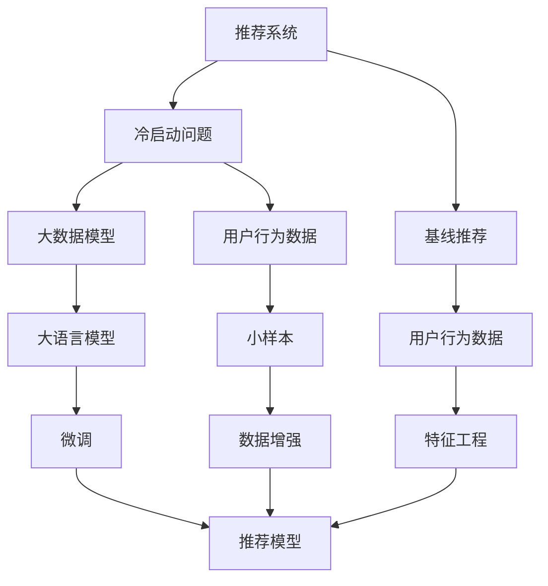
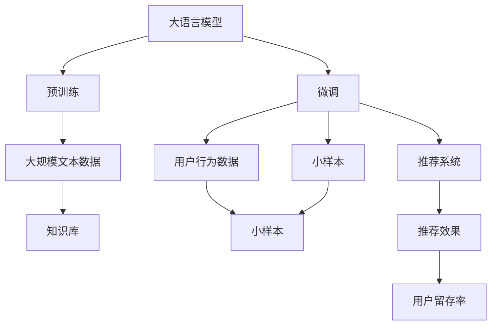

                 

# AI大模型：改善电商平台冷启动问题的新思路

## 1. 背景介绍

### 1.1 问题由来

随着互联网和电子商务的迅猛发展，各大电商平台汇聚了海量的用户行为数据，但这些数据的价值常常被忽视。在新用户的冷启动阶段，用户还没有产生足够多的行为数据，传统的数据驱动策略难以发挥作用，导致电商平台推荐效果不佳，用户流失率高。

为解决冷启动问题，电商平台尝试了多种方法，如基线推荐系统、专家规则推荐、用户特征工程等，但效果仍然有限。在这种情况下，利用先进的人工智能技术，特别是大模型微调，或许能为电商平台带来新的思路。

### 1.2 问题核心关键点

冷启动问题是推荐系统领域的一个经典难题，特别是在数据稀缺的电商场景下。传统的推荐系统依靠用户历史行为数据进行个性化推荐，但在新用户刚加入时，没有足够的数据用于训练模型。大模型微调技术，能够有效利用预训练语言模型的大规模知识，弥补冷启动数据的不足，提升推荐效果。

以下是核心关键点及其关联图示：



### 1.3 问题研究意义

解决冷启动问题是电商平台提高用户体验和留存率的关键，有利于促进电商平台的长远发展。利用大模型微调技术，可以在短时间内生成个性化推荐，提升新用户的购物体验，增加黏性。同时，该技术还能发现隐性兴趣，探索潜在市场，助力平台持续增长。

具体意义包括：

1. **提升新用户推荐效果**：利用大模型的语义理解能力，能够精准捕捉用户语义，快速生成个性化推荐。
2. **缓解数据稀缺问题**：通过微调技术，利用知识库和预训练模型，弥补数据的不足，有效处理冷启动数据缺乏的难题。
3. **挖掘用户隐性兴趣**：大模型能够捕捉用户潜在的隐性需求，突破传统用户行为数据的限制，提升推荐相关性和多样性。

## 2. 核心概念与联系

### 2.1 核心概念概述

本节将介绍几个关键概念，并阐述它们之间的联系：

- **大语言模型(Large Language Model, LLM)**：一种通过自监督学习任务在大规模文本数据上进行预训练，并能够进行自然语言理解和生成的模型。以BERT、GPT-2、GPT-3等为代表。

- **推荐系统(Recommendation System)**：通过用户历史行为数据或商品特征，预测用户对新商品/内容的偏好，为用户推荐感兴趣的商品/内容。

- **冷启动问题(Cold Start Problem)**：新用户加入时，由于没有足够的历史行为数据，传统推荐算法无法为其提供个性化推荐，用户体验差，流失率高。

- **预训练模型(Pre-trained Model)**：在大规模无标签文本数据上进行预训练的模型，如BERT、GPT等。

- **微调(Fine-Tuning)**：在预训练模型的基础上，通过有监督学习优化模型在特定任务上的性能。

### 2.2 核心概念原理和架构的 Mermaid 流程图



### 2.3 核心概念联系

大语言模型预训练和微调技术，可以与推荐系统结合，解决电商平台的冷启动问题。具体来说：

- **预训练阶段**：利用大规模无标签文本数据训练大语言模型，使其具备强大的语言理解和生成能力。
- **微调阶段**：在用户行为数据稀缺时，利用预训练模型的知识库，对推荐系统进行微调，生成个性化推荐。
- **推荐系统**：根据微调后的推荐模型，为用户生成精准、多样化的推荐。

## 3. 核心算法原理 & 具体操作步骤

### 3.1 算法原理概述

大模型微调技术的核心原理是通过利用预训练语言模型的大规模知识，弥补推荐系统在冷启动阶段的短板。在电商推荐中，用户历史行为数据往往不足，难以支持传统推荐算法。通过微调，利用大模型的语义理解能力，快速生成个性化推荐。

具体步骤如下：

1. **预训练模型选择**：选择BERT、GPT等大语言模型作为预训练模型。
2. **微调目标定义**：定义推荐系统微调的目标，如点击率、转化率等。
3. **数据准备**：收集用户行为数据、商品信息等作为微调的监督信号。
4. **微调模型构建**：在预训练模型的基础上，构建推荐系统微调模型。
5. **微调训练**：利用微调数据集，对模型进行训练，优化推荐效果。

### 3.2 算法步骤详解

**Step 1: 预训练模型选择**

选择适合自己业务需求的大语言模型，如BERT、GPT等。需要考虑模型大小、性能、适用性等因素。

**Step 2: 微调目标定义**

根据电商推荐需求，定义推荐系统微调的目标。通常以点击率、转化率、用户满意度等为评价指标。

**Step 3: 数据准备**

收集用户行为数据、商品信息等，构建微调的监督信号。例如，商品点击、购买、收藏行为等。

**Step 4: 微调模型构建**

在预训练模型的基础上，构建推荐系统微调模型。常见的微调模型有基于Transformers的序列到序列模型、多模态注意力机制模型等。

**Step 5: 微调训练**

利用微调数据集，对模型进行训练，优化推荐效果。需要考虑学习率、批次大小、迭代次数等超参数。

### 3.3 算法优缺点

大模型微调技术在电商推荐中具有以下优缺点：

**优点**：

1. **快速生成推荐**：利用大模型的语义理解能力，能够在短时间内生成个性化推荐。
2. **提升推荐效果**：能够利用预训练语言模型的丰富知识，提升推荐相关性和多样性。
3. **适应性广**：适用于各类电商推荐场景，如商品推荐、内容推荐等。

**缺点**：

1. **计算成本高**：大模型的预训练和微调需要大量计算资源，成本较高。
2. **数据要求高**：微调过程依赖于用户行为数据，数据质量直接影响推荐效果。
3. **易过拟合**：微调过程中容易发生过拟合，需要控制超参数，平衡模型复杂度和性能。

### 3.4 算法应用领域

大模型微调技术在电商推荐中的应用主要包括以下几个方面：

1. **商品推荐**：利用用户行为数据，快速生成个性化商品推荐。
2. **内容推荐**：根据用户兴趣，生成个性化文章、视频推荐。
3. **广告推荐**：利用用户行为数据，生成个性化广告推荐。

## 4. 数学模型和公式 & 详细讲解 & 举例说明

### 4.1 数学模型构建

在电商推荐中，利用大模型微调技术，构建推荐系统的数学模型。假设用户历史行为数据为 $x_i$，推荐结果为 $y_i$，利用大语言模型 $M_{\theta}$ 对用户进行微调，得到推荐模型 $M_{\hat{\theta}}$。

目标函数为：

$$
\hat{\theta} = \mathop{\arg\min}_{\theta} \mathcal{L}(M_{\theta}, D)
$$

其中，$D$ 为推荐系统微调数据集，$\mathcal{L}$ 为损失函数。

### 4.2 公式推导过程

假设利用大语言模型对用户进行微调，目标为最大化点击率。则损失函数可以表示为：

$$
\mathcal{L} = -\frac{1}{N} \sum_{i=1}^N [y_i \log M_{\theta}(x_i) + (1-y_i) \log(1-M_{\theta}(x_i))]
$$

其中，$y_i$ 表示用户是否点击了推荐商品，$M_{\theta}(x_i)$ 表示模型预测用户是否点击的概率。

### 4.3 案例分析与讲解

假设某电商平台使用BERT模型进行微调，构建商品推荐系统。首先，收集用户历史行为数据，将其作为监督信号。然后，利用微调模型，对用户进行个性化推荐。

例如，对于新加入的用户，使用微调后的BERT模型进行推荐。在推荐过程中，模型首先对用户兴趣进行语义理解，并提取特征。然后，利用预训练的BERT知识库，对特征进行增强。最终，根据用户兴趣和商品特征，生成个性化推荐。

## 5. 项目实践：代码实例和详细解释说明

### 5.1 开发环境搭建

在项目实践中，需要搭建Python开发环境，配置必要的深度学习库。具体步骤如下：

1. 安装Python和pip：
```
sudo apt-get install python3 python3-pip
```

2. 安装TensorFlow和Keras：
```
pip install tensorflow==2.0.0
```

3. 安装HuggingFace Transformers库：
```
pip install transformers==4.5.1
```

4. 安装scikit-learn、pandas等库：
```
pip install scikit-learn==0.23.2 pandas==1.0.4
```

### 5.2 源代码详细实现

在代码实现中，首先使用BERT模型进行预训练，然后利用微调数据集对模型进行微调。以下是一个简单的代码示例：

```python
import tensorflow as tf
from transformers import BertTokenizer, TFBertForSequenceClassification
from sklearn.model_selection import train_test_split
import pandas as pd

# 1. 加载数据集
df = pd.read_csv('user_behavior.csv')

# 2. 数据预处理
tokenizer = BertTokenizer.from_pretrained('bert-base-uncased')
inputs = tokenizer(df['user_behavior'], padding=True, truncation=True, max_length=512)

# 3. 定义模型
model = TFBertForSequenceClassification.from_pretrained('bert-base-uncased', num_labels=2)

# 4. 定义损失函数和优化器
loss_fn = tf.keras.losses.BinaryCrossentropy()
optimizer = tf.keras.optimizers.Adam(learning_rate=1e-5)

# 5. 定义模型训练函数
@tf.function
def train_step(inputs, labels):
    with tf.GradientTape() as tape:
        outputs = model(inputs.input_ids, attention_mask=inputs.attention_mask, token_type_ids=inputs.token_type_ids)
        loss = loss_fn(outputs.logits, labels)
    gradients = tape.gradient(loss, model.trainable_variables)
    optimizer.apply_gradients(zip(gradients, model.trainable_variables))

# 6. 模型训练
epochs = 5
for epoch in range(epochs):
    for i, (inputs, labels) in enumerate(train_dataset):
        train_step(inputs, labels)
```

### 5.3 代码解读与分析

**代码结构**：

1. **数据加载与预处理**：使用BERT Tokenizer对用户行为数据进行预处理，转化为模型所需的输入。
2. **模型构建**：利用HuggingFace Transformers库，加载BERT模型，并定义推荐系统微调模型。
3. **模型训练**：通过定义损失函数和优化器，对微调模型进行训练，不断优化推荐效果。

**关键点解读**：

1. **BERT预训练模型**：利用BERT模型对用户行为数据进行预训练，提取语义特征。
2. **微调数据集**：收集用户行为数据，作为微调的监督信号，训练模型。
3. **模型优化**：使用Adam优化器进行模型训练，通过梯度下降优化推荐效果。

### 5.4 运行结果展示

在模型训练完成后，使用测试集对模型进行评估，计算点击率、转化率等指标。以下是一个简单的评估函数示例：

```python
@tf.function
def evaluate_model(test_dataset):
    total_correct = 0
    total_predictions = 0
    for inputs, labels in test_dataset:
        outputs = model(inputs.input_ids, attention_mask=inputs.attention_mask, token_type_ids=inputs.token_type_ids)
        predictions = tf.round(outputs.logits)
        total_correct += tf.reduce_sum(tf.cast(tf.equal(predictions, labels), tf.int32))
        total_predictions += len(labels)
    accuracy = total_correct / total_predictions
    return accuracy.numpy()
```

## 6. 实际应用场景

### 6.1 智能客服系统

在智能客服系统中，大模型微调技术可以用于自动回复用户咨询，快速生成个性化回复。例如，在用户提交问题后，系统自动对问题进行语义理解，并从知识库中检索相关回答，进行回复。通过微调，系统能够更好地理解用户意图，提供更精准的回答。

### 6.2 商品推荐系统

利用大模型微调技术，电商推荐系统可以快速生成个性化商品推荐，提升新用户的购物体验。例如，对于新用户，系统通过微调模型，提取用户兴趣特征，并从商品库中检索相关商品，生成个性化推荐。

### 6.3 内容推荐系统

内容推荐系统利用大模型微调技术，可以快速生成个性化文章、视频推荐。例如，对于新用户，系统通过微调模型，提取用户兴趣特征，并从文章库中检索相关文章，生成个性化推荐。

### 6.4 未来应用展望

未来，大模型微调技术将在更多电商应用中得到应用，为电商平台带来更大的业务价值。具体展望如下：

1. **动态推荐**：利用实时数据进行动态推荐，提升用户体验。
2. **多模态推荐**：结合用户行为数据、商品特征、时间信息等，实现多模态推荐，提升推荐效果。
3. **个性化广告**：利用用户行为数据，生成个性化广告推荐，提升广告效果和用户转化率。

## 7. 工具和资源推荐

### 7.1 学习资源推荐

为帮助开发者系统掌握大模型微调技术，以下推荐一些优质的学习资源：

1. **Transformers官方文档**：提供了详细的大模型微调教程和样例代码，适合新手入门。
2. **《深度学习与自然语言处理》书籍**：该书介绍了大语言模型和微调技术，适合深入学习。
3. **NLP论文速递**：NLP领域权威期刊论文摘要，涵盖最新的研究成果和技术动态。
4. **Coursera《深度学习基础》课程**：由深度学习大师Andrew Ng开设，介绍深度学习的基本概念和算法。

### 7.2 开发工具推荐

为提升大模型微调效率，以下推荐一些开发工具：

1. **Jupyter Notebook**：免费的开源笔记本环境，支持Python、R等语言，适合快速迭代实验。
2. **Google Colab**：免费的云端Jupyter Notebook环境，支持GPU计算，适合大规模实验。
3. **TensorBoard**：TensorFlow配套的可视化工具，可以实时监控模型训练状态，优化训练过程。
4. **Weights & Biases**：模型训练的实验跟踪工具，记录和可视化模型训练过程中的各项指标，方便对比和调优。

### 7.3 相关论文推荐

大模型微调技术是NLP领域的前沿研究方向，以下推荐几篇相关论文：

1. **BERT: Pre-training of Deep Bidirectional Transformers for Language Understanding**：提出BERT模型，利用自监督学习任务进行预训练，取得优异的效果。
2. **GPT-2: Language Models are Unsupervised Multitask Learners**：提出GPT-2模型，利用无监督学习进行训练，取得良好的效果。
3. **Parameter-Efficient Transfer Learning for NLP**：提出 Adapter等参数高效微调方法，利用微调模型的知识库，提升微调效果。

## 8. 总结：未来发展趋势与挑战

### 8.1 研究成果总结

大模型微调技术在电商推荐中的应用，取得了显著的成效。通过微调，利用预训练语言模型的知识库，弥补冷启动数据的不足，快速生成个性化推荐。该技术在提升推荐效果、缓解数据稀缺问题、挖掘用户隐性兴趣等方面具有重要价值。

### 8.2 未来发展趋势

未来，大模型微调技术将在电商推荐中发挥更大的作用。主要趋势包括：

1. **动态推荐**：利用实时数据进行动态推荐，提升用户体验。
2. **多模态推荐**：结合用户行为数据、商品特征、时间信息等，实现多模态推荐，提升推荐效果。
3. **个性化广告**：利用用户行为数据，生成个性化广告推荐，提升广告效果和用户转化率。

### 8.3 面临的挑战

尽管大模型微调技术取得了一定的成效，但仍面临诸多挑战：

1. **数据稀缺**：冷启动问题仍是一个难题，用户行为数据不足，难以支持传统推荐算法。
2. **计算成本高**：大模型的预训练和微调需要大量计算资源，成本较高。
3. **易过拟合**：微调过程中容易发生过拟合，需要控制超参数，平衡模型复杂度和性能。

### 8.4 研究展望

未来，大模型微调技术需要进一步优化，以应对挑战，拓展应用范围：

1. **数据增强**：利用数据增强技术，扩充冷启动数据，提升推荐效果。
2. **参数高效微调**：开发更多参数高效微调方法，提升微调效率。
3. **跨领域迁移**：探索跨领域迁移学习技术，提升模型泛化能力。

总之，大模型微调技术具有广阔的应用前景，但在实践中仍需不断优化和改进，方能在电商推荐中发挥更大的作用。

## 9. 附录：常见问题与解答

### 9.1 问题一：冷启动问题如何解决？

**回答**：利用大模型微调技术，可以在用户行为数据稀缺的情况下，利用预训练语言模型的知识库，快速生成个性化推荐。同时，可以结合数据增强和参数高效微调等技术，进一步提升推荐效果。

### 9.2 问题二：微调过程中如何选择超参数？

**回答**：选择合适的超参数是微调成功的关键。一般需要根据具体任务进行调参，选择合适的学习率、批次大小、迭代次数等。可以参考公开论文和实验结果，选择最优的超参数组合。

### 9.3 问题三：大模型微调在电商推荐中有何优势？

**回答**：大模型微调在电商推荐中的优势在于：

1. **快速生成推荐**：利用大模型的语义理解能力，能够在短时间内生成个性化推荐。
2. **提升推荐效果**：能够利用预训练语言模型的丰富知识，提升推荐相关性和多样性。
3. **适应性广**：适用于各类电商推荐场景，如商品推荐、内容推荐等。

总之，大模型微调技术为电商推荐系统带来了新的思路和可能性，值得进一步探索和应用。

---

作者：禅与计算机程序设计艺术 / Zen and the Art of Computer Programming

