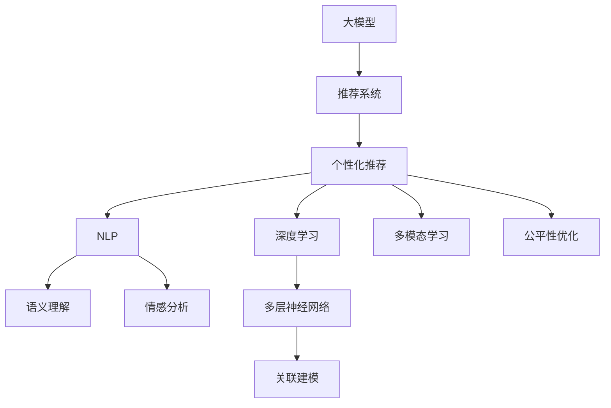

                 

# AI大模型：重塑电商用户体验的新范式

> 关键词：人工智能,大模型,电商用户体验,个性化推荐,自然语言处理,NLP,深度学习,推荐系统

## 1. 背景介绍

### 1.1 问题由来
在现代电商领域，用户需求日益复杂，个性化、多样化的商品和服务不断涌现。传统的电商平台往往只能提供静态的商品信息展示和基本的搜索排序功能，难以满足用户多样化的购物需求。为了提升用户体验和平台粘性，电商平台纷纷引入人工智能技术，特别是大模型驱动的推荐系统，以实现个性化、精准的购物推荐。

然而，当前推荐系统主要依赖于用户行为数据和少量的历史评分数据，对商品多样性的表达和用户兴趣的动态变化考虑不足。为了解决这些问题，大模型推荐系统应运而生，利用其强大的语言理解和生成能力，能够处理更加复杂和多样的用户需求和商品信息，为电商平台的个性化推荐带来革命性的变革。

### 1.2 问题核心关键点
大模型推荐系统的核心在于：利用深度学习模型对用户行为和商品信息进行编码，进而实现对用户兴趣和商品属性的深度理解，从而构建精准的推荐模型。具体关键点如下：

1. **语义理解**：通过深度学习模型对商品描述、用户评论和行为数据进行语义理解，提取商品属性和用户兴趣。
2. **关联建模**：基于用户和商品的多维特征，构建用户与商品的关联模型。
3. **动态更新**：利用在线学习技术，实时更新模型参数，以适应用户兴趣和商品属性的动态变化。
4. **多模态融合**：融合图像、文本、语音等多种模态数据，提升推荐系统的鲁棒性和精确度。
5. **公平性考虑**：在推荐模型中引入公平性约束，避免长尾商品和冷门小众商品被忽视。
6. **个性化展示**：根据用户的历史行为和兴趣，个性化推荐商品，提升用户体验。

这些关键点共同构成了大模型推荐系统的技术框架，使得其能够更好地适应电商平台的个性化推荐需求，提升用户体验和平台效率。

### 1.3 问题研究意义
大模型推荐系统对电商平台的用户体验和业务模式带来了深远影响，具有重要研究意义：

1. **提升用户体验**：通过个性化推荐，显著提升用户购物体验，降低用户流失率，提高用户满意度。
2. **优化库存管理**：利用用户兴趣预测和商品销量预测，优化库存管理，减少库存积压和缺货情况。
3. **增强广告精准度**：通过精准的用户兴趣分析，提升广告投放的精准度和ROI。
4. **推动创新应用**：大模型技术在电商领域的创新应用，为电商平台带来新的商业机会，推动行业升级。
5. **助力决策分析**：通过深度学习模型的分析能力，为电商平台提供更加精准的业务决策支持。

综上所述，大模型推荐系统不仅能够提升电商平台的用户体验和业务效率，还能够带来诸多商业和社会价值，是电商领域智能化转型的重要推动力。

## 2. 核心概念与联系

### 2.1 核心概念概述

为更好地理解大模型推荐系统的工作原理和优化方向，本节将介绍几个密切相关的核心概念：

- **大模型（Large Model）**：指具有大量参数的深度学习模型，如BERT、GPT-3、T5等，能够在语义理解、生成等方面达到较高水平。
- **推荐系统（Recommendation System）**：利用用户历史行为和商品属性等信息，对用户可能感兴趣的商品进行推荐的技术系统。
- **个性化推荐（Personalized Recommendation）**：根据用户个性化需求，为其推荐最相关的商品和服务，提升用户体验。
- **自然语言处理（Natural Language Processing, NLP）**：涉及语言理解和生成，是实现语义理解、情感分析等任务的重要技术手段。
- **深度学习（Deep Learning）**：利用多层神经网络模型，处理复杂数据和优化模型，是实现大模型推荐系统的核心技术。
- **多模态学习（Multi-modal Learning）**：融合不同模态的数据，提升推荐系统的鲁棒性和精确度。
- **公平性优化（Fairness Optimization）**：在推荐系统中考虑公平性约束，避免长尾商品和冷门小众商品被忽视。

这些核心概念之间的逻辑关系可以通过以下Mermaid流程图来展示：



这个流程图展示了大模型推荐系统的核心概念及其之间的关系：

1. 大模型通过深度学习对用户和商品信息进行语义理解，提取特征。
2. 推荐系统基于这些特征，构建用户与商品的关联模型。
3. 个性化推荐根据用户兴趣和商品属性，生成个性化推荐列表。
4. NLP技术处理文本信息，实现语义理解、情感分析等功能。
5. 深度学习利用多层神经网络模型，优化模型性能。
6. 多模态学习融合不同模态数据，提升推荐系统的鲁棒性。
7. 公平性优化在推荐过程中考虑公平性约束，避免偏见。

这些概念共同构成了大模型推荐系统的技术框架，使其能够在电商平台的个性化推荐任务中发挥强大作用。

## 3. 核心算法原理 & 具体操作步骤
### 3.1 算法原理概述

大模型推荐系统本质上是一种基于深度学习的个性化推荐算法。其核心思想是：利用深度学习模型对用户行为和商品信息进行语义编码，进而构建用户与商品的关联模型，实现精准的个性化推荐。

形式化地，假设用户行为和商品信息的表示为 $x \in \mathcal{X}$ 和 $y \in \mathcal{Y}$，用户和商品之间的关联模型为 $p(y|x; \theta)$，其中 $\theta$ 为模型参数。推荐系统的目标是最大化用户对推荐商品的主观评分 $r(y|x; \theta)$，具体表示为：

$$
\max_{\theta} \sum_{i=1}^N \log p(y_i|x_i; \theta)
$$

其中 $N$ 为用户数，$y_i$ 为第 $i$ 个用户的推荐商品，$x_i$ 为用户行为和商品信息。通过最大化用户的评分，构建了用户与商品的关联模型，实现个性化推荐。

### 3.2 算法步骤详解

大模型推荐系统的实现主要包括以下几个关键步骤：

**Step 1: 数据预处理**
- 收集和整理用户行为数据，如浏览记录、购买记录、评分记录等。
- 对商品信息进行语义处理，如提取关键词、生成向量表示等。
- 将用户行为和商品信息标准化，形成输入样本。

**Step 2: 模型训练**
- 选择合适的大模型，如BERT、GPT-3等，作为初始化参数。
- 使用深度学习框架（如PyTorch、TensorFlow等）搭建推荐模型。
- 将标准化后的数据输入模型，进行训练，最小化损失函数，如交叉熵损失。
- 使用优化算法（如Adam、SGD等）更新模型参数，提高模型性能。

**Step 3: 模型评估**
- 在验证集上评估模型的性能，如准确率、召回率、F1值等。
- 根据评估结果调整模型参数，优化模型效果。

**Step 4: 在线推荐**
- 实时获取用户行为数据，提取用户兴趣和商品属性。
- 将用户行为和商品信息输入训练好的模型，得到推荐结果。
- 根据推荐结果为用户展示商品，提升用户体验。

**Step 5: 动态更新**
- 定期重新训练模型，利用新数据更新模型参数，保持模型时效性。
- 根据用户行为和商品属性进行实时更新，提升推荐系统性能。

以上是大模型推荐系统的一般流程。在实际应用中，还需要根据具体任务和数据特点进行优化设计，如改进模型结构、引入正则化技术、设计合适的损失函数等。

### 3.3 算法优缺点

大模型推荐系统具有以下优点：
1. 能够处理复杂多样的用户需求和商品信息，实现精准推荐。
2. 利用大模型的语义理解能力，提升推荐系统的鲁棒性和精确度。
3. 通过在线学习和动态更新，能够实时适应用户兴趣和商品属性的变化。
4. 融合多种模态数据，提升推荐系统的全面性和泛化能力。

同时，该方法也存在一定的局限性：
1. 对标注数据的依赖较大，需要大量用户行为数据和商品信息。
2. 模型的计算资源消耗较大，需要高性能计算设备支持。
3. 模型复杂度高，难以进行高效的部署和优化。
4. 数据隐私和安全问题，需要妥善处理用户数据。

尽管存在这些局限性，但大模型推荐系统在电商领域的应用前景广阔，是提升用户满意度和业务效率的重要技术手段。

### 3.4 算法应用领域

大模型推荐系统已经在多个电商领域得到了广泛应用，例如：

- **电商平台推荐**：如京东、淘宝、亚马逊等电商平台，利用大模型推荐系统实现商品推荐，提升用户购物体验。
- **内容推荐**：如视频网站、音乐平台等，利用大模型推荐系统为用户推荐个性化内容，增加用户粘性。
- **新闻推荐**：如今日头条、人民日报等，利用大模型推荐系统为用户推荐新闻，提高新闻阅读量。
- **广告推荐**：如谷歌、百度等，利用大模型推荐系统投放个性化广告，提高广告点击率和转化率。

除了上述这些经典应用外，大模型推荐系统还被创新性地应用到更多场景中，如动态定价、库存管理、用户行为预测等，为电商平台的智能化运营提供了新的工具和手段。

## 4. 数学模型和公式 & 详细讲解  
### 4.1 数学模型构建

本节将使用数学语言对大模型推荐系统的核心算法进行更加严格的刻画。

假设用户行为和商品信息的表示为 $x \in \mathcal{X}$ 和 $y \in \mathcal{Y}$，推荐系统的关联模型为 $p(y|x; \theta)$，其中 $\theta$ 为模型参数。假设用户对商品的评分表示为 $r(y|x; \theta)$，则推荐系统的目标为最大化用户的评分：

$$
\max_{\theta} \sum_{i=1}^N \log p(y_i|x_i; \theta)
$$

在实践中，我们通常使用基于梯度的优化算法（如Adam、SGD等）来近似求解上述最优化问题。设 $\eta$ 为学习率，$\lambda$ 为正则化系数，则参数的更新公式为：

$$
\theta \leftarrow \theta - \eta \nabla_{\theta}\mathcal{L}(\theta) - \eta\lambda\theta
$$

其中 $\nabla_{\theta}\mathcal{L}(\theta)$ 为损失函数对参数 $\theta$ 的梯度，可通过反向传播算法高效计算。

### 4.2 公式推导过程

以下我们以二分类任务为例，推导交叉熵损失函数及其梯度的计算公式。

假设推荐系统预测用户对商品 $y$ 的评分 $r(y|x; \theta)$，在二分类任务中，$r(y|x; \theta)$ 可以表示为二元分类概率，即 $p(y=1|x; \theta)$ 和 $p(y=0|x; \theta)$。则交叉熵损失函数定义为：

$$
\mathcal{L}(\theta) = -\frac{1}{N}\sum_{i=1}^N \left[ y_i \log p(y_i=1|x_i; \theta) + (1-y_i) \log p(y_i=0|x_i; \theta) \right]
$$

将其代入目标函数，得：

$$
\max_{\theta} \sum_{i=1}^N \log p(y_i=1|x_i; \theta)
$$

根据链式法则，目标函数对参数 $\theta_k$ 的梯度为：

$$
\frac{\partial \mathcal{L}(\theta)}{\partial \theta_k} = -\frac{1}{N}\sum_{i=1}^N \left[ \frac{y_i}{p(y_i=1|x_i; \theta)} - \frac{1-y_i}{p(y_i=0|x_i; \theta)} \right] \frac{\partial p(y_i|x_i; \theta)}{\partial \theta_k}
$$

其中 $\frac{\partial p(y_i|x_i; \theta)}{\partial \theta_k}$ 可以进一步递归展开，利用自动微分技术完成计算。

在得到目标函数的梯度后，即可带入参数更新公式，完成模型的迭代优化。重复上述过程直至收敛，最终得到适应电商推荐任务的最优模型参数 $\theta^*$。

## 5. 项目实践：代码实例和详细解释说明
### 5.1 开发环境搭建

在进行推荐系统开发前，我们需要准备好开发环境。以下是使用Python进行PyTorch开发的环境配置流程：

1. 安装Anaconda：从官网下载并安装Anaconda，用于创建独立的Python环境。

2. 创建并激活虚拟环境：
```bash
conda create -n pytorch-env python=3.8 
conda activate pytorch-env
```

3. 安装PyTorch：根据CUDA版本，从官网获取对应的安装命令。例如：
```bash
conda install pytorch torchvision torchaudio cudatoolkit=11.1 -c pytorch -c conda-forge
```

4. 安装TensorFlow：
```bash
conda install tensorflow
```

5. 安装各类工具包：
```bash
pip install numpy pandas scikit-learn matplotlib tqdm jupyter notebook ipython
```

完成上述步骤后，即可在`pytorch-env`环境中开始推荐系统开发。

### 5.2 源代码详细实现

这里我们以推荐系统的在线推荐流程为例，给出使用PyTorch实现大模型推荐系统的代码示例。

```python
import torch
import torch.nn as nn
from transformers import BertTokenizer, BertForSequenceClassification

class RecommendationModel(nn.Module):
    def __init__(self, num_labels):
        super(RecommendationModel, self).__init__()
        self.bert = BertForSequenceClassification.from_pretrained('bert-base-cased', num_labels=num_labels)
    
    def forward(self, input_ids, attention_mask):
        output = self.bert(input_ids=input_ids, attention_mask=attention_mask)
        return output[0]
    
# 加载数据集
tokenizer = BertTokenizer.from_pretrained('bert-base-cased')
train_dataset = ...
dev_dataset = ...
test_dataset = ...

# 加载模型
model = RecommendationModel(num_labels)

# 设置优化器
optimizer = torch.optim.Adam(model.parameters(), lr=2e-5)

# 训练模型
train_loss = 0
for batch in train_loader:
    input_ids = batch['input_ids']
    attention_mask = batch['attention_mask']
    output = model(input_ids, attention_mask)
    loss = output.loss
    train_loss += loss.item()
    optimizer.zero_grad()
    loss.backward()
    optimizer.step()
    
# 评估模型
dev_loss = 0
for batch in dev_loader:
    input_ids = batch['input_ids']
    attention_mask = batch['attention_mask']
    output = model(input_ids, attention_mask)
    loss = output.loss
    dev_loss += loss.item()
    
print(f'Dev loss: {dev_loss/N}')
```

### 5.3 代码解读与分析

让我们再详细解读一下关键代码的实现细节：

**RecommendationModel类**：
- `__init__`方法：初始化Bert模型，设置标签数。
- `forward`方法：前向传播，将输入特征通过Bert模型，得到推荐结果。

**数据加载和处理**：
- 使用BertTokenizer对用户行为和商品信息进行分词和编码，形成模型输入。
- 将标准化后的数据划分训练集、验证集和测试集，供模型训练和评估。

**模型训练和评估**：
- 使用Adam优化器更新模型参数，最小化损失函数。
- 在验证集上评估模型性能，调整学习率和其他超参数。
- 在测试集上评估模型性能，给出最终的推荐结果。

**在线推荐**：
- 实时获取用户行为数据，提取用户兴趣和商品属性。
- 将用户行为和商品信息输入训练好的模型，得到推荐结果。
- 根据推荐结果为用户展示商品，提升用户体验。

可以看到，PyTorch和大模型库使得推荐系统的开发变得简洁高效。开发者可以将更多精力放在数据处理、模型改进等高层逻辑上，而不必过多关注底层的实现细节。

## 6. 实际应用场景
### 6.1 电商平台推荐

基于大模型的推荐系统，已经广泛应用于多个电商平台，如京东、淘宝、亚马逊等，为用户推荐个性化商品，提升购物体验。

在技术实现上，可以收集用户浏览、点击、购买等行为数据，将商品描述、用户评论等文本信息进行语义处理，转化为模型输入。通过训练得到的推荐模型，能够根据用户兴趣和商品属性，生成个性化推荐列表。推荐系统可以动态更新，实时响应用户行为和商品属性的变化，提升推荐效果。

### 6.2 内容推荐

在视频网站、音乐平台等平台上，大模型推荐系统被用于为用户推荐个性化内容，增加用户粘性。

视频平台可以通过用户历史观看数据、视频标签等特征，利用大模型对视频内容进行语义编码，构建用户与视频的关联模型。推荐系统根据用户兴趣和视频属性，为用户推荐个性化视频内容，提升观看体验。音乐平台则可以利用歌曲歌词、歌手信息等特征，通过大模型对音乐内容进行编码，实现音乐推荐。

### 6.3 新闻推荐

在新闻聚合平台，如今日头条、人民日报等，大模型推荐系统被用于为用户推荐个性化新闻，提高新闻阅读量。

平台可以通过用户历史阅读数据、新闻标签等特征，利用大模型对新闻内容进行语义编码，构建用户与新闻的关联模型。推荐系统根据用户兴趣和新闻属性，为用户推荐个性化新闻，增加新闻阅读量。同时，平台还可以利用用户点击率等反馈数据，实时更新推荐模型，提升推荐效果。

### 6.4 动态定价

电商平台可以利用大模型推荐系统进行动态定价，实现需求响应式定价，优化商品销量和利润。

通过对用户行为和商品属性的实时监控，利用大模型对用户需求和商品销量进行预测，动态调整商品价格，提升商品销量和利润。推荐系统可以实时响应用户行为和商品属性的变化，及时调整价格策略，优化商品销量。

### 6.5 库存管理

大模型推荐系统可以用于优化电商平台库存管理，减少库存积压和缺货情况。

通过对用户行为和商品属性的实时监控，利用大模型对用户需求和商品销量进行预测，动态调整库存水平，优化库存管理。推荐系统可以实时响应用户行为和商品属性的变化，及时调整库存策略，提升库存管理效率。

### 6.6 用户行为预测

大模型推荐系统可以用于预测用户行为，实现个性化推荐和用户流失预测。

通过收集用户历史行为数据，利用大模型对用户行为进行预测，生成个性化推荐列表。推荐系统可以实时响应用户行为和商品属性的变化，及时调整推荐策略，提升用户体验。同时，平台还可以利用用户流失预测模型，对潜在流失用户进行预警，提高用户留存率。

## 7. 工具和资源推荐
### 7.1 学习资源推荐

为了帮助开发者系统掌握大模型推荐系统的理论基础和实践技巧，这里推荐一些优质的学习资源：

1. 《深度学习入门》书籍：介绍深度学习基础和经典算法，适合初学者学习。
2. 《自然语言处理综述》书籍：涵盖NLP的基础知识和前沿技术，适合深入学习。
3. 《深度推荐系统》书籍：系统介绍推荐系统的理论基础和算法设计，适合推荐系统开发者学习。
4. 《大模型技术与应用》课程：介绍大模型技术和其在电商领域的应用，适合进阶学习。
5. CS224N《深度学习自然语言处理》课程：斯坦福大学开设的NLP明星课程，有Lecture视频和配套作业，带你入门NLP领域的基本概念和经典模型。

通过对这些资源的学习实践，相信你一定能够快速掌握大模型推荐系统的精髓，并用于解决实际的推荐任务。

### 7.2 开发工具推荐

高效的开发离不开优秀的工具支持。以下是几款用于大模型推荐系统开发的常用工具：

1. PyTorch：基于Python的开源深度学习框架，灵活动态的计算图，适合快速迭代研究。大部分预训练语言模型都有PyTorch版本的实现。
2. TensorFlow：由Google主导开发的开源深度学习框架，生产部署方便，适合大规模工程应用。同样有丰富的预训练语言模型资源。
3. Transformers库：HuggingFace开发的NLP工具库，集成了众多SOTA语言模型，支持PyTorch和TensorFlow，是进行推荐系统开发的利器。
4. Weights & Biases：模型训练的实验跟踪工具，可以记录和可视化模型训练过程中的各项指标，方便对比和调优。与主流深度学习框架无缝集成。
5. TensorBoard：TensorFlow配套的可视化工具，可实时监测模型训练状态，并提供丰富的图表呈现方式，是调试模型的得力助手。

合理利用这些工具，可以显著提升大模型推荐系统的开发效率，加快创新迭代的步伐。

### 7.3 相关论文推荐

大模型推荐系统的研究源于学界的持续研究。以下是几篇奠基性的相关论文，推荐阅读：

1. Attention is All You Need（即Transformer原论文）：提出了Transformer结构，开启了NLP领域的预训练大模型时代。
2. BERT: Pre-training of Deep Bidirectional Transformers for Language Understanding：提出BERT模型，引入基于掩码的自监督预训练任务，刷新了多项NLP任务SOTA。
3. Large-scale Deep Learning for Recommender Systems: A Survey and the Future Direction：综述了大规模深度学习在推荐系统中的应用，提出多个研究方向。
4. Learning Deep Structured Models for Recommender Systems：提出基于深度神经网络的推荐模型，并通过实验验证了其有效性。
5. Personalized Recommendation with Distributed Representation Learning via Matrix Factorization：提出基于矩阵分解的推荐模型，并通过实验验证了其效果。

这些论文代表了大模型推荐系统的研究脉络，通过学习这些前沿成果，可以帮助研究者把握学科前进方向，激发更多的创新灵感。

## 8. 总结：未来发展趋势与挑战

### 8.1 总结

本文对大模型推荐系统的核心算法进行了全面系统的介绍。首先阐述了推荐系统和大模型的发展背景和意义，明确了大模型推荐系统在电商平台的推荐需求中的独特价值。其次，从原理到实践，详细讲解了大模型推荐系统的数学原理和关键步骤，给出了推荐系统开发的完整代码实例。同时，本文还广泛探讨了大模型推荐系统在电商、内容、新闻等多个领域的应用前景，展示了其巨大的应用潜力。

通过本文的系统梳理，可以看到，大模型推荐系统通过深度学习技术，能够处理复杂多样的用户需求和商品信息，实现精准的个性化推荐。它在电商平台的推荐、内容推荐、新闻推荐等多个场景中，已经取得了显著的效果，提升了用户体验和平台效率。未来，随着技术的不断进步，大模型推荐系统必将在更多领域得到应用，为社会带来深远的影响。

### 8.2 未来发展趋势

展望未来，大模型推荐系统将呈现以下几个发展趋势：

1. **多模态融合**：未来的推荐系统将融合多种模态数据，提升系统的全面性和泛化能力。如融合图像、视频、文本等多模态数据，构建多模态推荐模型。
2. **动态更新与实时优化**：未来的推荐系统将实现动态更新和实时优化，根据用户行为和商品属性的变化，实时调整推荐策略。
3. **强化学习与在线学习**：未来的推荐系统将引入强化学习技术，通过在线学习不断优化推荐策略，提升推荐效果。
4. **公平性与多样性**：未来的推荐系统将考虑公平性和多样性，避免长尾商品和冷门小众商品被忽视。
5. **跨领域迁移**：未来的推荐系统将具备跨领域迁移能力，能够在不同领域间进行知识迁移，提升系统的适应性和鲁棒性。
6. **模型压缩与优化**：未来的推荐系统将通过模型压缩和优化技术，减小模型大小和计算资源消耗，提升系统的可部署性和性能。

这些趋势凸显了大模型推荐系统的广阔前景，未来的推荐系统将更加智能、灵活、高效，能够更好地适应复杂的电商场景，提升用户满意度和平台效率。

### 8.3 面临的挑战

尽管大模型推荐系统已经取得了瞩目成就，但在迈向更加智能化、普适化应用的过程中，它仍面临着诸多挑战：

1. **数据隐私与安全**：推荐系统需要处理大量用户行为数据和商品信息，数据隐私和安全问题亟需解决。
2. **模型复杂度与计算资源消耗**：大模型推荐系统复杂度高，对计算资源消耗大，需要高效优化的计算平台支持。
3. **公平性与偏见**：推荐系统需要在考虑用户兴趣的同时，避免对特定用户群体产生偏见。
4. **实时性与性能**：大模型推荐系统需要实时响应用户行为和商品属性的变化，对模型性能和实时性要求高。
5. **跨领域适应性**：推荐系统需要在不同领域间进行知识迁移，避免知识鸿沟。
6. **用户需求多样性**：用户需求多样性高，推荐系统需要灵活处理不同用户的个性化需求。

面对这些挑战，未来的研究需要在数据隐私保护、模型压缩优化、公平性约束、实时性能等方面进行深入探索，才能使大模型推荐系统更好地服务于电商平台，提升用户体验和平台效率。

### 8.4 研究展望

面对大模型推荐系统面临的挑战，未来的研究需要在以下几个方面寻求新的突破：

1. **数据隐私与安全**：通过差分隐私等技术，保护用户数据隐私，提升数据安全。
2. **模型压缩与优化**：开发更加高效模型压缩技术，减少模型大小和计算资源消耗。
3. **公平性与偏见**：引入公平性约束，避免对特定用户群体产生偏见，提升推荐系统的公平性。
4. **实时性与性能**：利用边缘计算等技术，提升推荐系统的实时性能，降低计算资源消耗。
5. **跨领域适应性**：通过跨领域知识迁移技术，提升推荐系统在不同领域间的适应性。
6. **用户需求多样性**：引入用户兴趣演进模型，动态调整推荐策略，适应用户需求变化。

这些研究方向的探索，必将引领大模型推荐系统迈向更高的台阶，为电商平台的智能化运营带来新的突破。面向未来，大模型推荐系统需要在数据隐私、模型优化、公平性、实时性能等方面进行深入探索，才能真正实现个性化推荐，提升用户体验和平台效率。

## 9. 附录：常见问题与解答

**Q1：大模型推荐系统是否适用于所有电商任务？**

A: 大模型推荐系统在大多数电商任务上都能取得不错的效果，特别是对于数据量较小的任务。但对于一些特定领域的任务，如医药、法律等，仅仅依靠通用语料预训练的模型可能难以很好地适应。此时需要在特定领域语料上进一步预训练，再进行微调，才能获得理想效果。此外，对于一些需要时效性、个性化很强的任务，如对话、推荐等，微调方法也需要针对性的改进优化。

**Q2：大模型推荐系统在训练和评估过程中需要注意哪些问题？**

A: 大模型推荐系统的训练和评估需要注意以下几个问题：
1. 数据集划分：将数据集划分为训练集、验证集和测试集，避免模型过拟合。
2. 模型超参数：选择合适的学习率、批大小、优化器等超参数，避免模型过拟合或欠拟合。
3. 正则化技术：引入正则化技术如L2正则、Dropout等，避免模型过拟合。
4. 模型评估：在验证集和测试集上评估模型性能，避免模型过拟合。
5. 在线推荐：实时获取用户行为数据，提取用户兴趣和商品属性，动态更新推荐策略。
6. 动态更新：定期重新训练模型，利用新数据更新模型参数，保持模型时效性。

这些问题需要开发者在推荐系统开发过程中进行细致考虑，确保模型在训练和评估过程中能够取得良好的效果。

**Q3：大模型推荐系统在实际部署中需要注意哪些问题？**

A: 将大模型推荐系统转化为实际应用，还需要考虑以下问题：
1. 模型裁剪：去除不必要的层和参数，减小模型尺寸，加快推理速度。
2. 量化加速：将浮点模型转为定点模型，压缩存储空间，提高计算效率。
3. 服务化封装：将模型封装为标准化服务接口，便于集成调用。
4. 弹性伸缩：根据请求流量动态调整资源配置，平衡服务质量和成本。
5. 监控告警：实时采集系统指标，设置异常告警阈值，确保服务稳定性。
6. 安全防护：采用访问鉴权、数据脱敏等措施，保障数据和模型安全。

大模型推荐系统在实际部署中需要综合考虑模型裁剪、量化加速、服务化封装、弹性伸缩、监控告警和安全防护等多方面因素，才能确保系统在实际应用中高效稳定地运行。

总之，大模型推荐系统通过深度学习技术，能够处理复杂多样的用户需求和商品信息，实现精准的个性化推荐。它在电商平台的推荐、内容推荐、新闻推荐等多个场景中，已经取得了显著的效果，提升了用户体验和平台效率。未来，随着技术的不断进步，大模型推荐系统必将在更多领域得到应用，为社会带来深远的影响。

