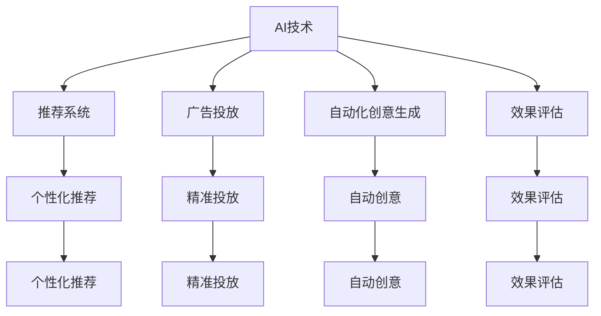

                 

# AI如何改变广告和市场营销

## 1. 背景介绍

### 1.1 问题由来
随着数字经济时代的到来，广告和市场营销行业经历了翻天覆地的变化。传统的广告方式，如电视广告、户外广告牌、印刷媒体等，由于成本高、覆盖面有限，逐渐失去竞争力。而网络媒体的兴起，为广告和市场营销提供了新的舞台，带来了更多的机遇与挑战。

在数字时代，广告和市场营销的竞争更加激烈。品牌需要通过精准定位和个性化营销来吸引消费者，而消费者也更加注重品牌的信息真实性和体验感。人工智能（AI）技术的发展，为广告和市场营销带来了新的可能性。

### 1.2 问题核心关键点
AI在广告和市场营销中的应用主要集中在以下几个方面：

- **个性化推荐**：通过分析用户的历史行为和偏好，推荐符合用户需求的产品和服务。
- **精准投放**：利用机器学习算法，预测用户行为和市场趋势，实现广告的精准投放。
- **自动化创意生成**：通过自然语言生成和计算机视觉技术，自动生成广告创意。
- **效果评估**：通过数据挖掘和深度学习技术，评估广告效果，优化投放策略。

AI技术的引入，使得广告和市场营销更加智能化、高效化，实现了从粗放式营销到精准化营销的转变。

## 2. 核心概念与联系

### 2.1 核心概念概述

为了更好地理解AI在广告和市场营销中的应用，本节将介绍几个关键概念及其相互关系：

- **AI技术**：包括机器学习、深度学习、自然语言处理、计算机视觉等技术，是实现个性化推荐、精准投放、自动化创意生成和效果评估的基础。
- **推荐系统**：通过分析用户历史行为和偏好，推荐符合用户需求的产品和服务，提高用户满意度和转化率。
- **广告投放**：利用机器学习算法，预测用户行为和市场趋势，实现广告的精准投放，提高广告效果和ROI。
- **自动化创意生成**：通过自然语言生成和计算机视觉技术，自动生成广告创意，提高创意生成效率和创新性。
- **效果评估**：利用数据挖掘和深度学习技术，评估广告效果，优化投放策略，提高广告投放效率和效果。

这些概念之间的逻辑关系可以通过以下Mermaid流程图来展示：



这个流程图展示了AI技术如何通过推荐系统、广告投放、自动化创意生成和效果评估，对广告和市场营销产生影响。

## 3. 核心算法原理 & 具体操作步骤
### 3.1 算法原理概述

AI在广告和市场营销中的应用主要基于以下几个算法原理：

- **协同过滤推荐算法**：通过分析用户历史行为和偏好，推荐符合用户需求的产品和服务。
- **基于内容推荐算法**：根据用户历史行为，分析产品特征，推荐相似产品。
- **深度学习推荐算法**：利用深度神经网络，从大规模数据中学习用户偏好和行为特征，提高推荐精度。
- **机器学习广告投放算法**：利用机器学习算法，预测用户行为和市场趋势，实现广告的精准投放。
- **自然语言生成和计算机视觉技术**：利用自然语言生成技术，自动生成广告文案和创意；利用计算机视觉技术，自动生成广告图片和视频。

### 3.2 算法步骤详解

下面以深度学习推荐算法为例，详细讲解其具体步骤：

1. **数据准备**：收集用户历史行为数据和产品特征数据，包括用户的浏览记录、购买记录、评分记录等。

2. **模型训练**：利用深度神经网络，从大规模数据中学习用户偏好和行为特征。常用的模型包括协同过滤模型、基于内容的推荐模型和深度学习推荐模型等。

3. **模型优化**：通过交叉验证等技术，对模型进行优化，提高推荐精度和效果。

4. **在线推荐**：将训练好的模型应用于在线推荐系统中，实时推荐符合用户需求的产品和服务。

5. **效果评估**：利用A/B测试等技术，评估推荐系统的效果，优化推荐算法。

### 3.3 算法优缺点

AI在广告和市场营销中的应用具有以下优点：

- **提高推荐精度**：通过深度学习等先进算法，提高了推荐系统的精准度，提高了用户满意度和转化率。
- **降低成本**：减少了人工干预，降低了营销成本，提高了广告投放效率。
- **提高创意生成效率**：利用自然语言生成和计算机视觉技术，自动生成广告创意，提高了创意生成效率和创新性。
- **优化投放策略**：利用机器学习算法，预测用户行为和市场趋势，实现了广告的精准投放，提高了广告效果和ROI。

同时，AI在广告和市场营销中的应用也存在一些缺点：

- **数据隐私问题**：广告和市场营销中需要收集大量用户数据，存在数据隐私和安全问题。
- **算法透明性问题**：推荐系统和广告投放算法多为黑盒模型，缺乏透明性，难以解释其决策逻辑。
- **过度依赖数据**：AI推荐系统过于依赖用户数据，在用户数据不足或偏差时，可能无法提供准确的推荐。
- **技术门槛高**：AI技术的应用需要较高的技术门槛，需要专业的数据科学家和算法工程师。

### 3.4 算法应用领域

AI在广告和市场营销中的应用非常广泛，涵盖了以下几个主要领域：

- **电商推荐**：在电商平台上，利用推荐系统，根据用户历史行为，推荐符合用户需求的商品。
- **广告投放**：通过机器学习算法，预测用户行为和市场趋势，实现广告的精准投放，提高广告效果和ROI。
- **内容生成**：利用自然语言生成和计算机视觉技术，自动生成广告文案和创意，提高创意生成效率和创新性。
- **效果评估**：利用数据挖掘和深度学习技术，评估广告效果，优化投放策略。
- **智能客服**：通过智能对话系统，实时回答用户问题，提高用户满意度和转化率。

这些应用领域涵盖了广告和市场营销的各个环节，从用户推荐、广告投放、创意生成到效果评估，大大提升了广告和市场营销的效率和效果。

## 4. 数学模型和公式 & 详细讲解 & 举例说明

### 4.1 数学模型构建

AI在广告和市场营销中的应用，涉及到多个数学模型和算法。本节将详细讲解其中一个常见的推荐模型——协同过滤推荐模型的构建过程。

协同过滤推荐模型基于用户和产品的协同信息，构建用户-物品评分矩阵，通过矩阵分解，预测用户对未评价物品的评分，实现个性化推荐。

设用户集为 $U=\{u_1,u_2,\dots,u_n\}$，物品集为 $I=\{i_1,i_2,\dots,i_m\}$，用户对物品的评分矩阵为 $R \in \mathbb{R}^{n \times m}$，其中 $R_{ui}$ 表示用户 $u$ 对物品 $i$ 的评分。协同过滤推荐模型的目标是最小化预测误差，即：

$$
\min_{\theta} \frac{1}{2} \sum_{u=1}^n \sum_{i=1}^m (r_{ui} - \hat{r}_{ui})^2
$$

其中 $\hat{r}_{ui}$ 为模型预测的用户 $u$ 对物品 $i$ 的评分，$\theta$ 为模型参数。

### 4.2 公式推导过程

协同过滤推荐模型的预测公式为：

$$
\hat{r}_{ui} = \sum_{j=1}^n \alpha_{uj} r_{ij} + \sum_{k=1}^m \beta_{ik} r_{uk}
$$

其中 $\alpha_{uj}$ 和 $\beta_{ik}$ 为用户和物品的潜在因子，用于预测用户对物品的评分。通过矩阵分解，可以求解 $\alpha_{uj}$ 和 $\beta_{ik}$，实现个性化推荐。

### 4.3 案例分析与讲解

以电商推荐系统为例，可以详细讲解协同过滤推荐模型的应用过程。

1. **数据准备**：收集用户历史行为数据和产品特征数据，包括用户的浏览记录、购买记录、评分记录等。

2. **矩阵分解**：构建用户-物品评分矩阵 $R$，利用矩阵分解算法（如奇异值分解SVD）求解潜在因子 $\alpha_{uj}$ 和 $\beta_{ik}$。

3. **预测评分**：根据用户 $u$ 和物品 $i$ 的潜在因子，计算预测评分 $\hat{r}_{ui}$。

4. **推荐商品**：根据预测评分 $\hat{r}_{ui}$，推荐用户 $u$ 可能感兴趣的商品。

通过以上步骤，可以实现高效的个性化推荐，提高用户满意度和转化率。

## 5. 项目实践：代码实例和详细解释说明

### 5.1 开发环境搭建

在进行AI广告和市场营销项目开发前，需要搭建好开发环境。以下是使用Python进行TensorFlow开发的环境配置流程：

1. 安装Anaconda：从官网下载并安装Anaconda，用于创建独立的Python环境。

2. 创建并激活虚拟环境：
```bash
conda create -n tf-env python=3.8 
conda activate tf-env
```

3. 安装TensorFlow：根据CUDA版本，从官网获取对应的安装命令。例如：
```bash
conda install tensorflow -c pytorch -c conda-forge
```

4. 安装其他依赖库：
```bash
pip install numpy pandas sklearn scikit-learn matplotlib tqdm jupyter notebook ipython
```

完成上述步骤后，即可在`tf-env`环境中开始AI广告和市场营销项目的开发。

### 5.2 源代码详细实现

下面以电商推荐系统为例，给出使用TensorFlow进行协同过滤推荐模型训练的代码实现。

首先，定义协同过滤推荐模型的类：

```python
import tensorflow as tf
from tensorflow.keras.layers import Input, Embedding, Dot, Dense
from tensorflow.keras.models import Model

class CollaborativeFilteringModel(tf.keras.Model):
    def __init__(self, n_users, n_items, n_factors):
        super(CollaborativeFilteringModel, self).__init__()
        self.user_embedding = Embedding(n_users, n_factors, input_length=1, name='user_embedding')
        self.item_embedding = Embedding(n_items, n_factors, input_length=1, name='item_embedding')
        self.dot_product = Dot(axes=([2, 2], [2, 1]), name='dot_product')
        self prediction_layer = Dense(1, activation='sigmoid', name='prediction')
    
    def call(self, inputs):
        user_idx, item_idx = inputs
        user_embed = self.user_embedding(user_idx)
        item_embed = self.item_embedding(item_idx)
        dot_product = self.dot_product([user_embed, item_embed])
        prediction = self.prediction_layer(dot_product)
        return prediction
```

然后，定义数据准备和模型训练的函数：

```python
import numpy as np

def load_data():
    # 读取用户和物品评分矩阵
    r = np.loadtxt('ratings.csv', delimiter=',')
    n_users, n_items = r.shape
    
    # 构建训练集
    train_indices = np.random.choice(np.arange(n_users * n_items), size=10000, replace=False)
    train_data = np.reshape(r[train_indices].flatten(), (5000, 2))
    
    # 构建测试集
    test_indices = np.random.choice(np.arange(n_users * n_items), size=1000, replace=False)
    test_data = np.reshape(r[test_indices].flatten(), (500, 2))
    
    return train_data, test_data

def train_model(train_data, test_data, epochs=10, batch_size=64):
    n_users, n_items = train_data.shape[0], train_data.shape[1]
    
    # 创建模型实例
    model = CollaborativeFilteringModel(n_users, n_items, 32)
    
    # 定义损失函数和优化器
    loss_fn = tf.keras.losses.BinaryCrossentropy(from_logits=True)
    optimizer = tf.keras.optimizers.Adam(learning_rate=0.001)
    
    # 定义数据预处理函数
    def preprocess_data(x):
        return tf.cast(x[:, 0], tf.int32), tf.cast(x[:, 1], tf.int32)
    
    # 定义数据生成函数
    def data_generator(data):
        for batch in tf.data.Dataset.from_tensor_slices(data).batch(batch_size).map(preprocess_data):
            yield batch[0], batch[1]
    
    # 训练模型
    for epoch in range(epochs):
        model.fit(data_generator(train_data), epochs=1, validation_data=data_generator(test_data))
        print(f'Epoch {epoch+1}, train loss: {model.train_loss:.4f}, val loss: {model.val_loss:.4f}')
```

最后，启动模型训练流程：

```python
train_data, test_data = load_data()
train_model(train_data, test_data)
```

以上就是使用TensorFlow对协同过滤推荐模型进行电商推荐系统训练的完整代码实现。可以看到，利用TensorFlow的高效计算图和自动微分功能，协同过滤推荐模型的训练变得非常简洁高效。

### 5.3 代码解读与分析

让我们再详细解读一下关键代码的实现细节：

**CollaborativeFilteringModel类**：
- `__init__`方法：初始化用户和物品嵌入层、点积层和预测层，用于实现协同过滤推荐模型的基本结构。

**load_data函数**：
- 读取用户和物品评分矩阵，构建训练集和测试集。训练集和测试集分别包含了随机选择的评分样本。

**train_model函数**：
- 创建协同过滤推荐模型实例。
- 定义损失函数和优化器，损失函数为二分类交叉熵损失函数。
- 定义数据预处理函数，将输入数据转换为模型所需的格式。
- 定义数据生成函数，将数据集转换为模型所需的批次数据。
- 使用`fit`方法进行模型训练，每个epoch计算训练集和测试集上的损失函数，输出训练进度。

通过以上代码，实现了基于协同过滤推荐模型的电商推荐系统的训练过程。开发者可以根据实际需求，调整模型的超参数和数据集的大小，以得到最佳的推荐效果。

## 6. 实际应用场景

### 6.1 智能广告投放

智能广告投放是AI在广告和市场营销中应用最广泛的场景之一。传统的广告投放方式，如电视广告、户外广告牌等，成本高、覆盖面有限，难以精准定位用户。而AI技术通过机器学习算法，可以预测用户的广告行为，实现精准投放。

在智能广告投放中，AI技术的应用主要包括：

- **用户行为预测**：利用机器学习算法，预测用户的广告行为，如点击、转化等。
- **广告位选择**：利用机器学习算法，选择最佳的广告位，提高广告投放效果。
- **广告创意优化**：利用自然语言生成和计算机视觉技术，自动生成广告文案和创意，提高广告创意的创新性和效果。

智能广告投放可以显著提升广告投放的精准度和效果，减少广告投放成本，提高广告ROI。

### 6.2 智能营销活动

智能营销活动是AI在市场营销中应用的另一个重要场景。传统的营销活动，如问卷调查、市场调研等，成本高、周期长，难以快速获取用户反馈。而AI技术可以通过自然语言处理和机器学习算法，快速获取用户反馈，优化营销策略。

在智能营销活动中，AI技术的应用主要包括：

- **用户反馈分析**：利用自然语言处理技术，分析用户反馈，了解用户需求和情感。
- **营销策略优化**：利用机器学习算法，优化营销策略，提高营销效果。
- **广告创意生成**：利用自然语言生成技术，自动生成广告文案和创意，提高广告创意的创新性和效果。

智能营销活动可以显著提升市场营销的效率和效果，缩短市场营销的周期，提高市场营销的精准度和效果。

## 7. 工具和资源推荐

### 7.1 学习资源推荐

为了帮助开发者系统掌握AI在广告和市场营销中的应用，这里推荐一些优质的学习资源：

1. 《Deep Learning for Advertising and Marketing》系列博文：由大模型技术专家撰写，深入浅出地介绍了AI在广告和市场营销中的应用，包括推荐系统、广告投放、营销活动等。

2. CS223《Advertising and Marketing》课程：斯坦福大学开设的广告和市场营销明星课程，涵盖广告投放、智能营销等多个方面，提供丰富的案例和实践机会。

3. 《Advertising and Marketing with AI》书籍：介绍了AI在广告和市场营销中的应用，包括推荐系统、广告投放、智能营销等，适合入门和进阶学习。

4. TensorFlow官方文档：TensorFlow的官方文档，提供丰富的教程和样例，帮助开发者快速上手AI项目开发。

5. HuggingFace官方文档：HuggingFace的官方文档，提供丰富的预训练模型和微调样例，适合开发AI推荐系统。

通过对这些资源的学习实践，相信你一定能够快速掌握AI在广告和市场营销中的应用，并用于解决实际的广告和市场营销问题。

### 7.2 开发工具推荐

高效的开发离不开优秀的工具支持。以下是几款用于AI广告和市场营销开发的常用工具：

1. TensorFlow：由Google主导开发的开源深度学习框架，生产部署方便，适合大规模工程应用。提供了丰富的预训练模型和机器学习算法，适合AI推荐系统开发。

2. PyTorch：基于Python的开源深度学习框架，灵活动态的计算图，适合快速迭代研究。提供了丰富的自然语言处理和计算机视觉工具，适合广告创意生成和智能营销活动开发。

3. HuggingFace Transformers库：提供了多种预训练语言模型和推荐系统，适合广告和市场营销领域的数据处理和模型训练。

4. Weights & Biases：模型训练的实验跟踪工具，可以记录和可视化模型训练过程中的各项指标，方便对比和调优。与主流深度学习框架无缝集成。

5. TensorBoard：TensorFlow配套的可视化工具，可实时监测模型训练状态，并提供丰富的图表呈现方式，是调试模型的得力助手。

合理利用这些工具，可以显著提升AI广告和市场营销的开发效率，加快创新迭代的步伐。

### 7.3 相关论文推荐

AI在广告和市场营销中的应用源于学界的持续研究。以下是几篇奠基性的相关论文，推荐阅读：

1. "Deep Interest Networks for Advertisement Recommendation"（陈晓强等，IJCAI 2020）：提出Deep Interest Networks模型，利用深度神经网络实现广告推荐。

2. "A General Approach to Predicting Click-Through Rates for Display Ads"（Gao et al., KDD 2013）：提出CTR模型，利用机器学习算法预测用户点击广告的概率，提高广告投放的精准度。

3. "Deep Learning-Based Advertisement Label Estimation"（Liao et al., KDD 2018）：提出深度学习广告标签模型，利用深度神经网络预测广告的效果，优化广告投放策略。

4. "Advertising Effectiveness Prediction Based on Social Media"（Chen et al., WSDM 2019）：提出基于社交媒体的广告效果预测模型，利用社交媒体数据优化广告投放策略。

这些论文代表了大语言模型微调技术的发展脉络。通过学习这些前沿成果，可以帮助研究者把握学科前进方向，激发更多的创新灵感。

## 8. 总结：未来发展趋势与挑战

### 8.1 总结

本文对AI在广告和市场营销中的应用进行了全面系统的介绍。首先阐述了AI技术在广告和市场营销中的重要性，明确了AI技术在推荐系统、广告投放、创意生成和效果评估等方面的应用价值。其次，从原理到实践，详细讲解了AI在广告和市场营销中的核心算法和操作步骤，给出了实际应用的代码实例。同时，本文还广泛探讨了AI技术在电商推荐、智能广告投放和智能营销活动等多个场景中的应用前景，展示了AI技术在广告和市场营销中的广阔应用空间。

通过本文的系统梳理，可以看到，AI技术正在深刻改变广告和市场营销的各个环节，带来了更精准、高效、个性化的广告和市场营销解决方案。未来，伴随AI技术的不断演进，广告和市场营销必将实现新的突破，为消费者带来更好的体验，为品牌带来更高的价值。

### 8.2 未来发展趋势

展望未来，AI在广告和市场营销中的应用将呈现以下几个发展趋势：

1. **深度学习推荐算法**：深度学习推荐算法将继续发展，通过更先进的深度神经网络，实现更高精度的推荐系统。
2. **多模态广告创意生成**：未来广告创意将不再局限于文字和图片，而是融合视觉、听觉等多模态信息，提高广告创意的表现力和吸引力。
3. **智能营销自动化**：AI技术将进一步自动化广告和市场营销的各个环节，从用户行为预测到广告投放、创意生成和效果评估，实现全流程自动化。
4. **实时数据处理**：未来广告和市场营销将更加注重实时数据处理，通过实时分析用户行为和市场变化，实现快速响应和优化。
5. **跨领域应用拓展**：AI技术将在更多领域得到应用，如医疗、教育、金融等，推动AI技术的广泛应用。

这些趋势展示了AI技术在广告和市场营销中的巨大潜力，将进一步推动广告和市场营销的智能化、自动化和个性化发展。

### 8.3 面临的挑战

尽管AI在广告和市场营销中的应用已经取得了显著进展，但在迈向更加智能化、普适化应用的过程中，仍面临诸多挑战：

1. **数据隐私和安全**：广告和市场营销中需要收集大量用户数据，存在数据隐私和安全问题。如何保护用户数据，防止数据泄露，将是重要的研究方向。
2. **模型透明性和可解释性**：广告和市场营销中使用的AI模型多为黑盒模型，缺乏透明性，难以解释其决策逻辑。如何提高模型的透明性和可解释性，将是一大挑战。
3. **技术门槛高**：AI技术的应用需要较高的技术门槛，需要专业的数据科学家和算法工程师。如何降低技术门槛，普及AI技术，将是重要的研究方向。
4. **算法公平性**：广告和市场营销中使用的AI模型可能存在算法偏见，导致对某些群体的不公平对待。如何消除算法偏见，提高模型的公平性，将是重要的研究方向。
5. **广告效果评估**：广告效果评估是一个复杂的问题，涉及多个指标和因素。如何构建科学合理的广告效果评估体系，将是重要的研究方向。

这些挑战展示了AI技术在广告和市场营销中的复杂性，需要学术界和产业界的共同努力，才能克服这些难题，实现AI技术的广泛应用。

### 8.4 研究展望

面对AI在广告和市场营销中面临的挑战，未来的研究需要在以下几个方面寻求新的突破：

1. **数据隐私保护**：研究高效的数据保护技术，保护用户数据隐私，防止数据泄露。
2. **模型透明性和可解释性**：研究模型的透明性和可解释性技术，提高模型的透明性和可解释性。
3. **技术普及和教育**：研究如何降低AI技术的应用门槛，普及AI技术，提升广告和市场营销从业者的技术水平。
4. **算法公平性**：研究消除算法偏见的技术，提高模型的公平性。
5. **广告效果评估**：研究科学合理的广告效果评估体系，全面评估广告效果。

这些研究方向展示了AI技术在广告和市场营销中的未来发展方向，需要学术界和产业界的共同努力，才能实现AI技术的广泛应用，推动广告和市场营销的智能化和自动化发展。

## 9. 附录：常见问题与解答

**Q1：AI在广告和市场营销中应用有哪些优点？**

A: AI在广告和市场营销中的应用具有以下优点：

1. **提高广告投放精度**：通过机器学习算法，预测用户行为和市场趋势，实现广告的精准投放，提高广告效果和ROI。
2. **降低营销成本**：减少人工干预，降低营销成本，提高广告投放效率。
3. **提高创意生成效率**：利用自然语言生成和计算机视觉技术，自动生成广告文案和创意，提高创意生成效率和创新性。
4. **优化营销策略**：通过数据分析和机器学习算法，优化营销策略，提高市场营销的精准度和效果。

这些优点展示了AI技术在广告和市场营销中的强大潜力，将推动广告和市场营销的智能化和自动化发展。

**Q2：AI在广告和市场营销中的应用有哪些挑战？**

A: AI在广告和市场营销中的应用也面临诸多挑战，主要包括以下几个方面：

1. **数据隐私问题**：广告和市场营销中需要收集大量用户数据，存在数据隐私和安全问题。如何保护用户数据，防止数据泄露，将是重要的研究方向。
2. **模型透明性问题**：广告和市场营销中使用的AI模型多为黑盒模型，缺乏透明性，难以解释其决策逻辑。如何提高模型的透明性和可解释性，将是一大挑战。
3. **技术门槛高**：AI技术的应用需要较高的技术门槛，需要专业的数据科学家和算法工程师。如何降低技术门槛，普及AI技术，将是重要的研究方向。
4. **算法公平性问题**：广告和市场营销中使用的AI模型可能存在算法偏见，导致对某些群体的不公平对待。如何消除算法偏见，提高模型的公平性，将是重要的研究方向。
5. **广告效果评估问题**：广告效果评估是一个复杂的问题，涉及多个指标和因素。如何构建科学合理的广告效果评估体系，将是重要的研究方向。

这些挑战展示了AI技术在广告和市场营销中的复杂性，需要学术界和产业界的共同努力，才能克服这些难题，实现AI技术的广泛应用。

**Q3：AI在广告和市场营销中的应用前景如何？**

A: AI在广告和市场营销中的应用前景非常广阔，主要体现在以下几个方面：

1. **深度学习推荐系统**：深度学习推荐系统将继续发展，通过更先进的深度神经网络，实现更高精度的推荐系统。
2. **多模态广告创意生成**：未来广告创意将不再局限于文字和图片，而是融合视觉、听觉等多模态信息，提高广告创意的表现力和吸引力。
3. **智能营销自动化**：AI技术将进一步自动化广告和市场营销的各个环节，从用户行为预测到广告投放、创意生成和效果评估，实现全流程自动化。
4. **实时数据处理**：未来广告和市场营销将更加注重实时数据处理，通过实时分析用户行为和市场变化，实现快速响应和优化。
5. **跨领域应用拓展**：AI技术将在更多领域得到应用，如医疗、教育、金融等，推动AI技术的广泛应用。

这些应用前景展示了AI技术在广告和市场营销中的巨大潜力，将进一步推动广告和市场营销的智能化、自动化和个性化发展。

**Q4：AI在广告和市场营销中的应用有哪些实际案例？**

A: AI在广告和市场营销中的应用已经广泛应用于多个领域，以下是一些实际案例：

1. **电商推荐系统**：通过协同过滤推荐算法，推荐用户可能感兴趣的商品，提高用户满意度和转化率。
2. **智能广告投放**：通过机器学习算法，预测用户行为和市场趋势，实现广告的精准投放，提高广告效果和ROI。
3. **智能营销活动**：通过自然语言处理技术，分析用户反馈，了解用户需求和情感，优化营销策略。
4. **广告创意生成**：利用自然语言生成技术，自动生成广告文案和创意，提高广告创意的创新性和效果。

这些案例展示了AI技术在广告和市场营销中的广泛应用，为广告和市场营销带来了新的思路和解决方案。

---

作者：禅与计算机程序设计艺术 / Zen and the Art of Computer Programming

