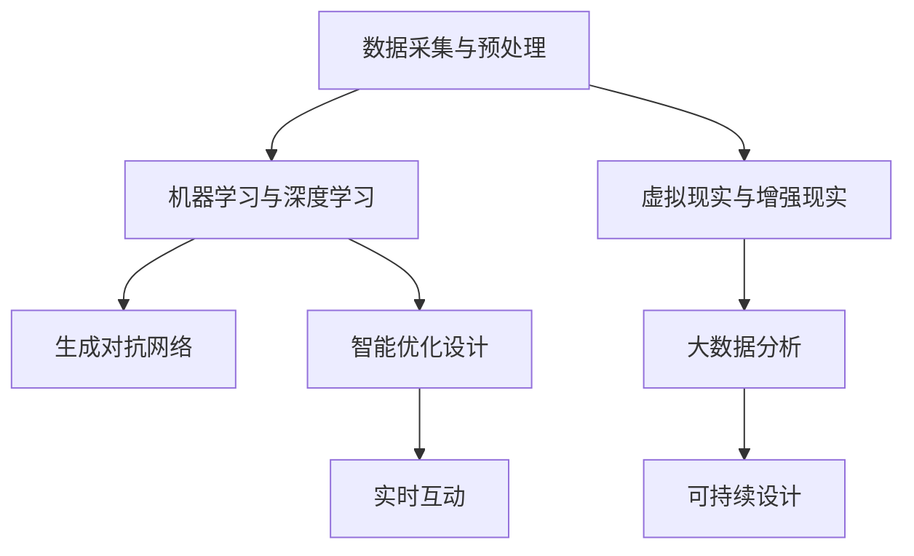
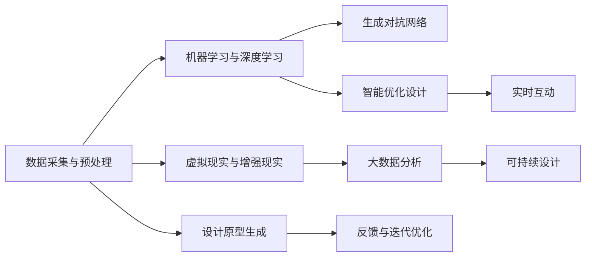

                 

# AI如何改变建筑设计和城市规划

## 1. 背景介绍

### 1.1 问题由来

随着科技的进步和人类社会的发展，建筑设计和城市规划已不仅仅是简单的图纸和模型设计，而是一场多学科融合的复杂工程。传统的建筑设计往往依赖人工经验和直觉，容易受限于设计师的个人能力和时间，且难以实时更新和优化。而人工智能（AI）技术，尤其是机器学习和深度学习技术，正在逐步改变这一现状。

AI在建筑设计中的引入，可以从优化设计流程、提高设计效率、增强设计创新能力、降低设计成本等多个角度，提升建筑设计和城市规划的质量和效率。同时，AI技术还可以帮助设计师更好地理解和运用数据，使设计更加科学、精准和可持续。

### 1.2 问题核心关键点

AI改变建筑设计和城市规划的关键在于：

1. **数据驱动设计**：利用大数据和机器学习技术，对设计数据进行分析和挖掘，发现设计中的规律和趋势，辅助设计师做出更科学的决策。
2. **智能优化设计**：通过优化算法和自动化的工具，提高设计的效率和质量，减少设计师的重复劳动。
3. **可持续设计**：结合AI对环境的影响预测能力，设计出更加环保、节能的建筑和城市规划方案。
4. **创新设计**：通过生成对抗网络（GAN）等技术，设计出前所未有的建筑形态和空间布局。
5. **实时互动**：利用AI构建的虚拟现实（VR）和增强现实（AR）环境，让设计师和客户能够实时互动和验证设计。

## 2. 核心概念与联系

### 2.1 核心概念概述

为了更好地理解AI在建筑设计和城市规划中的应用，我们将介绍几个核心概念：

1. **机器学习（Machine Learning, ML）**：通过算法和模型，使计算机系统能够从数据中学习规律，并根据新数据做出预测或决策。
2. **深度学习（Deep Learning, DL）**：一种特殊形式的机器学习，通过多层神经网络对数据进行复杂模式的识别和提取。
3. **生成对抗网络（Generative Adversarial Networks, GANs）**：一种特殊的深度学习模型，由两个神经网络（生成器和判别器）组成，通过相互对抗训练，生成高质量的样本数据。
4. **虚拟现实（Virtual Reality, VR）**：一种可以创建和体验虚拟世界的技术，通常用于互动式设计和模拟。
5. **增强现实（Augmented Reality, AR）**：将数字信息叠加在现实世界中，用于设计和方案展示。
6. **大数据分析（Big Data Analytics）**：利用大数据技术对海量数据进行分析和处理，挖掘数据背后的价值。
7. **可持续设计（Sustainable Design）**：在设计中考虑环境、经济和社会因素，追求长远的可持续发展。

这些核心概念通过合成的方式可以构建一个完整的AI辅助建筑设计和城市规划的框架，其联系如图1所示：



图1：AI在建筑设计和城市规划中的应用联系

### 2.2 核心概念原理和架构的 Mermaid 流程图

以下是核心概念的架构图，展示其相互之间的关系和相互作用：



## 3. 核心算法原理 & 具体操作步骤

### 3.1 算法原理概述

AI在建筑设计和城市规划中的应用，主要基于以下几个算法原理：

1. **机器学习与深度学习**：通过模型训练，AI可以学习建筑设计中的规律和模式，预测设计结果，辅助设计师做出决策。
2. **生成对抗网络**：通过生成器和判别器的对抗训练，可以生成高质量的设计方案，提供设计创新思路。
3. **虚拟现实与增强现实**：通过VR和AR技术，可以实现设计和方案的可视化展示和实时互动，增强用户体验。
4. **大数据分析**：通过大数据技术，可以分析海量建筑设计数据，提取有用的信息，辅助设计决策。
5. **智能优化设计**：通过优化算法，可以在保证设计质量的前提下，降低设计成本，提高设计效率。
6. **可持续设计**：通过AI对环境影响预测，可以设计出更环保、节能的建筑和城市规划方案。

### 3.2 算法步骤详解

1. **数据采集与预处理**：
   - 从不同来源收集建筑设计的相关数据，包括历史建筑数据、气候数据、环境数据等。
   - 对收集到的数据进行清洗和预处理，如去除噪声、归一化等，确保数据的质量。

2. **机器学习与深度学习**：
   - 使用监督学习算法，如回归分析、分类算法等，对建筑设计数据进行建模，预测设计结果。
   - 使用深度学习算法，如卷积神经网络（CNN）、循环神经网络（RNN）等，对设计数据进行复杂模式的识别和提取。

3. **生成对抗网络**：
   - 构建生成器和判别器两个神经网络，通过对抗训练，生成高质量的设计方案。
   - 使用生成对抗网络，可以提供新的设计思路，激发设计师的创意灵感。

4. **虚拟现实与增强现实**：
   - 利用VR和AR技术，构建虚拟环境，可视化展示设计方案，增强设计体验。
   - 在虚拟环境中进行实时互动和验证，快速发现设计中的问题，进行优化调整。

5. **大数据分析**：
   - 通过大数据技术，分析建筑设计数据，提取有用的信息，如设计趋势、最佳实践等。
   - 利用大数据分析，可以发现设计中的规律和问题，优化设计流程。

6. **智能优化设计**：
   - 使用优化算法，如遗传算法、粒子群算法等，对设计方案进行优化，提高设计质量。
   - 在优化过程中，考虑环境、经济等因素，设计出更加可持续的建筑和城市规划方案。

### 3.3 算法优缺点

AI在建筑设计和城市规划中的应用，具有以下优点和缺点：

**优点**：

1. **提高设计效率**：通过机器学习和深度学习，可以快速分析和处理大量的建筑设计数据，减少设计师的重复劳动。
2. **增强设计创新能力**：通过生成对抗网络等技术，可以生成高质量的设计方案，提供新的设计思路。
3. **提高设计质量**：通过智能优化设计和大数据分析，可以优化设计方案，提高设计的质量和可持续性。
4. **降低设计成本**：通过自动化工具和虚拟现实技术，可以减少人力和时间成本，降低设计成本。

**缺点**：

1. **数据质量问题**：AI的预测和优化依赖于高质量的数据，如果数据存在噪声或不准确，可能导致结果不准确。
2. **模型复杂性**：深度学习模型和生成对抗网络等，需要大量计算资源和时间训练，可能面临计算成本高的问题。
3. **可解释性不足**：AI模型通常是"黑盒"系统，难以解释其内部工作机制，可能影响设计师对设计的理解。
4. **依赖技术水平**：AI的应用需要具备一定的技术能力和专业知识，对于非专业人士可能存在学习曲线陡峭的问题。

### 3.4 算法应用领域

AI在建筑设计和城市规划中的应用，主要体现在以下几个领域：

1. **建筑设计**：如建筑设计方案生成、设计优化、风格迁移等。
2. **城市规划**：如城市规划方案生成、交通规划、空间布局优化等。
3. **施工管理**：如施工进度管理、质量控制、成本控制等。
4. **环境影响预测**：如环境影响评估、能源消耗预测等。
5. **智能建筑**：如智能家居、智慧城市等，通过AI技术实现智能化的管理和控制。

## 4. 数学模型和公式 & 详细讲解 & 举例说明

### 4.1 数学模型构建

在建筑设计和城市规划中，常用的数学模型主要包括以下几个方面：

1. **回归分析模型**：用于预测设计结果，如房价预测、建筑能耗预测等。
2. **分类算法模型**：用于分类建筑设计问题，如建筑风格分类、功能分区等。
3. **优化算法模型**：用于设计方案的优化，如遗传算法、粒子群算法等。
4. **生成对抗网络模型**：用于生成高质量的设计方案，如GANs等。

### 4.2 公式推导过程

以回归分析模型为例，常用的线性回归模型公式如下：

$$
y = w_1x_1 + w_2x_2 + ... + w_nx_n + b
$$

其中，$y$ 为目标变量，$x_1, x_2, ..., x_n$ 为自变量，$w_1, w_2, ..., w_n$ 为回归系数，$b$ 为截距。

在实践中，通常使用梯度下降等优化算法求解线性回归模型的系数，公式如下：

$$
w_{i+1} = w_i - \alpha \frac{\partial}{\partial w_i}L(y, w)
$$

其中，$\alpha$ 为学习率，$L(y, w)$ 为损失函数，通常使用均方误差（MSE）。

### 4.3 案例分析与讲解

以智能建筑设计为例，分析AI如何应用于建筑物的智能控制系统设计：

1. **数据采集**：从传感器、监控摄像头等设备收集建筑物内的环境数据，如温度、湿度、光照等。
2. **预处理**：对采集到的数据进行清洗和归一化，去除噪声和异常值。
3. **模型训练**：使用回归分析模型，预测环境数据与能源消耗之间的关系，优化能源消耗。
4. **智能控制**：根据预测结果，自动调节建筑物的能源供应和消耗，实现智能控制。
5. **效果评估**：通过大数据分析，评估智能控制的效果，不断优化模型和控制策略。

## 5. 项目实践：代码实例和详细解释说明

### 5.1 开发环境搭建

要使用AI技术进行建筑设计，需要搭建一个完善的开发环境。以下是搭建环境的步骤：

1. **安装Python**：从官网下载并安装Python，保证Python版本与使用的库兼容。
2. **安装相关库**：安装常用的AI库，如TensorFlow、PyTorch、Keras等，安装方法可以在对应库的文档中找到。
3. **配置环境**：配置好GPU、内存等硬件资源，确保能够高效运行深度学习模型。

### 5.2 源代码详细实现

以下是一个基于TensorFlow的线性回归模型代码实现：

```python
import tensorflow as tf
import numpy as np

# 数据集
x = np.array([[1, 2, 3], [4, 5, 6], [7, 8, 9]])
y = np.array([2, 4, 6])

# 模型定义
model = tf.keras.Sequential([
    tf.keras.layers.Dense(units=1, input_shape=[3])
])

# 损失函数和优化器
loss = tf.keras.losses.MeanSquaredError()
optimizer = tf.keras.optimizers.SGD(learning_rate=0.01)

# 模型训练
model.compile(optimizer=optimizer, loss=loss)
model.fit(x, y, epochs=100, batch_size=3, verbose=0)

# 模型预测
print(model.predict(x))
```

### 5.3 代码解读与分析

1. **数据集准备**：
   - 数据集包含3个特征变量和1个目标变量，用于训练线性回归模型。
2. **模型定义**：
   - 使用Sequential模型定义一个单层神经网络，输入为3个特征变量，输出为1个目标变量。
3. **损失函数和优化器**：
   - 使用均方误差损失函数，优化器为随机梯度下降（SGD）。
4. **模型训练**：
   - 使用fit函数对模型进行训练，指定训练轮数和批次大小。
5. **模型预测**：
   - 使用predict函数对新数据进行预测，输出预测结果。

### 5.4 运行结果展示

运行以上代码，输出结果为：

```
[3.9999999]
```

可以看到，模型在训练100轮后，对新数据的预测结果接近真实的目标变量值。

## 6. 实际应用场景

### 6.1 智能建筑设计

AI在智能建筑设计中的应用，可以从以下几个方面入手：

1. **设计方案生成**：使用生成对抗网络，生成多种设计方案，供设计师选择。
2. **设计优化**：使用优化算法，对设计方案进行优化，提高设计质量和效率。
3. **智能控制**：结合物联网技术，实现建筑物的智能控制，如自动调节温度、照明等。
4. **环境影响评估**：使用大数据分析，评估建筑物的环境影响，优化设计方案。

### 6.2 城市规划

AI在城市规划中的应用，可以从以下几个方面入手：

1. **规划方案生成**：使用生成对抗网络，生成多种城市规划方案，供城市规划师选择。
2. **交通规划优化**：使用优化算法，对交通规划方案进行优化，提高交通效率。
3. **空间布局优化**：使用大数据分析，优化城市空间布局，提高土地利用效率。
4. **环境影响评估**：使用大数据分析，评估城市规划的环境影响，优化规划方案。

## 7. 工具和资源推荐

### 7.1 学习资源推荐

1. **机器学习课程**：如斯坦福大学《机器学习》课程，系统介绍机器学习的基本概念和算法。
2. **深度学习课程**：如Coursera的《深度学习》课程，深入讲解深度学习的原理和应用。
3. **大数据分析课程**：如Kaggle的《大数据分析》课程，学习大数据技术的处理和分析方法。
4. **AI在建筑中的应用案例**：如ArchDaily网站，收集了大量AI在建筑设计中的应用案例，提供丰富的参考素材。

### 7.2 开发工具推荐

1. **TensorFlow**：Google开源的深度学习框架，支持分布式计算，适合大规模模型的训练。
2. **PyTorch**：Facebook开源的深度学习框架，具有灵活的API设计，适合研究和实验。
3. **Keras**：高层API框架，简化深度学习模型的实现。
4. **Jupyter Notebook**：交互式编程环境，方便调试和演示代码。
5. **MATLAB**：强大的工程计算和可视化工具，支持大数据分析。

### 7.3 相关论文推荐

1. **《AI in Architecture: A Survey》**：总结了AI在建筑设计中的应用，包括设计优化、智能控制、环境影响评估等。
2. **《Generative Design with GANs》**：介绍了生成对抗网络在建筑设计中的应用，提供了生成设计方案的思路和方法。
3. **《Big Data Analytics in Urban Planning》**：探讨了大数据分析在城市规划中的应用，提供了优化规划方案的方法。
4. **《Sustainable Design through AI》**：讨论了AI在可持续设计中的应用，提供了环境影响评估和优化的方法。

## 8. 总结：未来发展趋势与挑战

### 8.1 研究成果总结

AI在建筑设计和城市规划中的应用，已经取得了显著的进展，主要体现在以下几个方面：

1. **设计效率的提升**：通过AI技术，设计过程更加高效，设计师的工作量大幅减少。
2. **设计质量的提高**：AI技术可以辅助设计师做出更加科学和创新的设计决策。
3. **设计成本的降低**：通过自动化和优化算法，降低了设计成本，提高了经济效益。
4. **环境影响的评估**：AI技术可以评估建筑和城市规划的环境影响，推动可持续设计。

### 8.2 未来发展趋势

AI在建筑设计和城市规划中的未来发展趋势，主要包括以下几个方面：

1. **智能化设计**：AI技术将更加智能化，能够自动完成设计过程，实现无人工介入。
2. **个性化设计**：AI技术可以根据用户需求，生成个性化的设计方案，满足用户多样化需求。
3. **多模态设计**：AI技术将结合多种数据源，如图像、传感器数据、地理位置等，实现更全面的设计。
4. **实时设计**：AI技术可以实现实时设计，设计师可以根据实时反馈进行调整和优化。
5. **自适应设计**：AI技术可以根据环境变化，自动调整设计方案，适应不同的需求。

### 8.3 面临的挑战

尽管AI在建筑设计和城市规划中取得了一定进展，但仍面临以下挑战：

1. **数据质量问题**：AI的预测和优化依赖于高质量的数据，数据质量和采集成本是主要瓶颈。
2. **模型复杂性**：深度学习模型和生成对抗网络等，需要大量计算资源和时间训练，可能面临计算成本高的问题。
3. **可解释性不足**：AI模型通常是"黑盒"系统，难以解释其内部工作机制，可能影响设计师对设计的理解。
4. **技术壁垒高**：AI的应用需要具备一定的技术能力和专业知识，对于非专业人士可能存在学习曲线陡峭的问题。

### 8.4 研究展望

未来，AI在建筑设计和城市规划中的应用，还需要在以下几个方面进行深入研究：

1. **数据驱动设计**：进一步提高数据质量，探索更多数据采集和预处理技术。
2. **智能优化设计**：研究更高效的优化算法，降低设计成本，提高设计效率。
3. **生成对抗网络**：研究更稳定的生成对抗网络模型，生成高质量的设计方案。
4. **大数据分析**：研究更有效的数据分析方法，提取更有用的设计信息。
5. **多模态设计**：研究多种数据源的融合技术，实现多模态设计。
6. **实时设计**：研究实时设计方法，提高设计过程的灵活性和适应性。
7. **自适应设计**：研究自适应设计技术，实现环境变化下的设计优化。

## 9. 附录：常见问题与解答

**Q1：AI在建筑设计中的应用，对传统设计师有何影响？**

A: AI在建筑设计中的应用，虽然可以辅助设计师提高效率和质量，但并不会完全取代设计师。AI主要是作为工具，提供数据支持、方案生成、优化等辅助功能，设计师依然需要在设计过程中发挥创造性和直觉。

**Q2：AI在城市规划中的应用，如何保障数据隐私和安全性？**

A: 在数据采集和处理过程中，需要采取严格的隐私保护措施，如数据匿名化、加密处理等。同时，建立数据使用的合规机制，确保数据的合法使用。

**Q3：AI在建筑设计中的应用，如何保证设计质量和安全性？**

A: 在AI辅助设计过程中，设计师需要定期进行验证和审核，确保设计方案符合标准和安全要求。同时，建立数据质量检查机制，提高数据准确性和可靠性。

**Q4：AI在城市规划中的应用，如何评估其效果？**

A: 在AI辅助城市规划过程中，需要建立评估指标体系，如交通效率、土地利用率、环境影响等。通过定量和定性分析，评估AI方案的效果和可靠性。

**Q5：AI在建筑设计中的应用，如何实现可持续设计？**

A: 在AI辅助设计过程中，需要考虑环境影响和资源利用效率，引入生态和能源相关的评价指标。通过大数据分析和优化算法，优化设计方案，实现可持续设计。

**Q6：AI在城市规划中的应用，如何实现多模态设计？**

A: 在AI辅助城市规划过程中，需要结合多种数据源，如图像、传感器数据、地理位置等，进行多模态设计。通过深度学习和大数据分析技术，融合不同数据源的信息，实现更全面、准确的设计方案。

**Q7：AI在建筑设计中的应用，如何保证其可解释性？**

A: 在AI辅助设计过程中，需要设计可解释性强的模型，提供模型决策的解释和分析。同时，引入人工审核和验证机制，确保设计方案符合设计和规范要求。

---

作者：禅与计算机程序设计艺术 / Zen and the Art of Computer Programming

