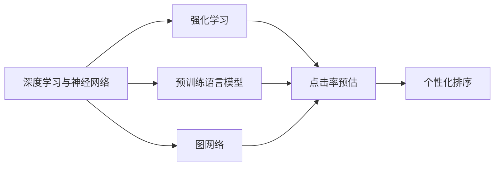

                 

# AI如何改变搜索引擎的排名算法

## 1. 背景介绍

### 1.1 问题由来

搜索引擎作为互联网时代的信息接入入口，是信息获取、广告投放、用户服务等领域的重要基础设施。传统的搜索引擎主要基于PageRank、TF-IDF等算法进行排名，依赖文本摘要、关键词匹配等方法。这些方法在计算简单、易于实现的同时，也存在以下问题：

- **同义词问题**：难以处理近义词、多义词等语言的复杂性。
- **内容时效性**：无法根据内容更新实时排名，可能延迟发现新信息。
- **广告滥用**：容易受到付费搜索（Pay-Per-Click, PPC）广告的干扰，降低搜索结果的客观性。
- **跨领域泛化能力差**：针对不同领域和任务，需要单独设计和训练模型，缺乏统一框架。

随着深度学习技术的发展，搜索引擎逐渐引入了基于AI的排序算法，逐步破解了上述难题。通过预训练语言模型、图网络、强化学习等方法，AI技术正重新定义搜索引擎的排名方式，实现更加智能、高效、公平的搜索结果。

### 1.2 问题核心关键点

本节将重点介绍AI如何通过深度学习技术改变搜索引擎的排名算法，并从以下几方面阐述其核心关键点：

- **预训练语言模型的引入**：使用Transformer等模型预训练通用语言表示，提升排序的泛化能力和理解能力。
- **图网络的应用**：利用图结构捕获网页间的连接关系，增强排序的上下文关联性和局部性。
- **强化学习技术**：通过学习与用户行为、点击量等反馈的互动，优化搜索结果排序策略，提升用户体验。

## 2. 核心概念与联系

### 2.1 核心概念概述

为更好地理解AI如何改变搜索引擎的排名算法，本节将介绍几个密切相关的核心概念：

- **深度学习与神经网络**：通过反向传播等算法，训练模型从大量数据中提取高层次特征，实现自动化学习和决策。
- **预训练语言模型(Pre-trained Language Model, PLM)**：如BERT、GPT等，在大规模文本数据上进行预训练，学习通用语言表示，可用于下游NLP任务，如问答、翻译等。
- **图网络(Graph Network)**：通过构建图结构，捕获数据间的复杂关系，常用于社交网络、知识图谱等领域。
- **强化学习(Reinforcement Learning, RL)**：通过与环境互动，通过奖励信号进行策略学习，优化行为策略。
- **Transformer**：一种基于自注意力机制的神经网络模型，常用于机器翻译、语言建模等任务。
- **点击率预估**：通过模型预测用户点击网页的概率，用于广告排序和推荐系统。
- **个性化排序**：针对不同用户和场景，调整搜索结果，提供更加个性化、符合用户偏好的搜索结果。

这些核心概念之间的逻辑关系可以通过以下Mermaid流程图来展示：



这个流程图展示了大语言模型的核心概念及其之间的关系：

1. 深度学习提供了自动化学习的能力。
2. 预训练语言模型在大规模数据上进行预训练，学习通用语言表示。
3. 图网络利用图结构捕获数据间关系。
4. 强化学习通过与环境的互动，优化策略。
5. Transformer用于各种自然语言处理任务。
6. 点击率预估用于广告排序和推荐系统。
7. 个性化排序提供更符合用户需求的搜索结果。

## 3. 核心算法原理 & 具体操作步骤

### 3.1 算法原理概述

AI在搜索引擎排序算法中主要通过以下三个方面进行改进：

1. **预训练语言模型的引入**：通过在大规模文本语料上进行预训练，学习通用的语言表示。然后，通过微调，使其适应特定搜索场景，用于判断网页与搜索查询的匹配度。
2. **图网络的应用**：利用图结构表示网页之间的链接关系，构建网页的上下文环境，从而在排序时考虑网页间的关系。
3. **强化学习技术**：通过模拟用户行为，学习如何优化搜索结果排序策略，提升用户体验和点击率。

### 3.2 算法步骤详解

AI改变搜索引擎排序算法的具体步骤包括：

**Step 1: 准备预训练模型和数据集**
- 选择合适的预训练语言模型，如BERT、GPT等，作为初始化参数。
- 收集搜索引擎的查询日志和点击日志，构建训练数据集。

**Step 2: 微调预训练模型**
- 在查询-网页对数据集上进行微调，学习网页与查询的匹配度。
- 微调过程通常使用交叉熵损失函数，以最大化模型预测的点击率。

**Step 3: 构建图网络**
- 构建网页间链接关系的图结构，捕捉网页间的关联。
- 在图网络基础上，进行图卷积网络（Graph Convolutional Network, GCN）等方法的训练，学习网页的局部结构和上下文信息。

**Step 4: 集成点击率预估**
- 使用预训练模型和图网络得到的特征向量，通过点击率预估模型，预测用户点击的概率。
- 在排序时，根据点击率大小调整搜索结果排名。

**Step 5: 个性化排序**
- 通过用户行为数据，学习用户偏好，提供个性化的搜索结果排序。
- 结合上下文和个性化因素，生成更符合用户需求的搜索结果。

**Step 6: 强化学习优化**
- 通过模拟用户点击行为，学习最优的排序策略。
- 利用强化学习算法，迭代调整排序策略，提升点击率和用户体验。

### 3.3 算法优缺点

AI搜索引擎排序算法具有以下优点：

1. **泛化能力强**：预训练语言模型和图网络使得排序算法具备更强的泛化能力，适用于多种任务和数据。
2. **上下文关联**：图网络引入网页间的关系，使排序算法能够考虑上下文信息，提供更相关和有意义的搜索结果。
3. **实时性高**：强化学习技术能够动态优化排序策略，实时应对用户行为的变化。
4. **用户个性化**：通过用户行为数据，排序算法能够提供个性化的搜索结果，提升用户满意度。

但同时也存在以下缺点：

1. **计算成本高**：预训练语言模型和图网络需要大量的计算资源，训练和推理成本较高。
2. **数据依赖强**：排序算法的性能依赖于预训练模型的质量和数据集的丰富程度，数据质量欠佳时效果可能不佳。
3. **过度拟合风险**：强化学习模型可能会过拟合，尤其在使用少量标注数据时。
4. **可解释性不足**：复杂排序算法的决策过程难以解释，不利于用户理解和信任。

### 3.4 算法应用领域

AI搜索引擎排序算法已在以下领域得到广泛应用：

- **文本匹配与排序**：如网页-查询匹配、新闻推荐、广告点击率预测等。
- **内容生成与编辑**：如自动摘要、智能写作、图片生成等。
- **用户行为分析**：如用户兴趣挖掘、行为预测、个性化推荐等。
- **广告定向与投放**：如精准广告投放、用户行为分析、转化率优化等。
- **知识图谱与信息检索**：如实体链接、关系抽取、知识图谱构建等。

除了上述这些典型应用外，AI排序算法还被创新性地应用到更多场景中，如跨语言搜索、智能客服、虚拟助手等，为搜索引擎技术带来了新的突破。

## 4. 数学模型和公式 & 详细讲解 & 举例说明

### 4.1 数学模型构建

假设搜索引擎收集到的查询为 $Q$，网页为 $D$，其中 $Q$ 包含 $M$ 个查询，每个查询包含 $N$ 个网页。设 $f(Q|D)$ 为查询 $Q$ 与网页 $D$ 的匹配度，$f(Q|D)$ 的计算可以通过预训练语言模型、图网络等方法实现。

模型的目标是最小化预测的点击率 $y$ 与实际点击率 $c$ 之间的差距，即：

$$
\min_{f(Q|D)} \frac{1}{M} \sum_{q=1}^M \sum_{d \in Q(q)} \frac{1}{N} \sum_{n=1}^N \|y_{q,d} - c_{q,d}\|
$$

其中 $y_{q,d}$ 为模型预测的点击率，$c_{q,d}$ 为实际点击率。

### 4.2 公式推导过程

在查询 $q$ 与网页 $d$ 的匹配度 $f(Q|D)$ 计算中，可以使用预训练语言模型和图网络的方法进行计算。以BERT为例，通过在BERT模型上进行微调，得到匹配度为：

$$
f(Q|D) = \text{softmax}(M_{\theta}(Q) \cdot D)
$$

其中 $M_{\theta}$ 为微调后的BERT模型，$D$ 为网页向量表示，$Q$ 为查询向量表示，$\cdot$ 为点乘操作。

在图网络中，可以使用图卷积网络（GCN）进行计算。以GCN为例，通过GCN层 $H$ 对网页 $d$ 进行特征提取，得到网页 $d$ 的上下文表示 $h_d$。将 $h_d$ 与查询 $q$ 的向量表示 $Q(q)$ 进行匹配，计算匹配度为：

$$
f(Q|D) = \text{softmax}(h_d \cdot Q(q))
$$

### 4.3 案例分析与讲解

以谷歌搜索中的BERT排序为例，谷歌将大规模预训练的BERT模型用于查询与网页的匹配度计算，具体步骤如下：

1. 使用BERT模型对查询和网页进行编码，得到向量表示。
2. 使用加权平均的方法，计算查询与网页的匹配度。
3. 结合图网络，捕捉网页间的链接关系，增强上下文信息。
4. 通过点击率预估模型，预测用户点击概率。
5. 使用强化学习算法，优化排序策略。

谷歌通过这一系列技术手段，使得搜索结果更加相关和个性化，显著提升了用户体验。

## 5. 项目实践：代码实例和详细解释说明

### 5.1 开发环境搭建

在进行搜索引擎排序算法的开发实践中，我们需要准备好开发环境。以下是使用Python进行TensorFlow开发的环境配置流程：

1. 安装Anaconda：从官网下载并安装Anaconda，用于创建独立的Python环境。

2. 创建并激活虚拟环境：
```bash
conda create -n search-env python=3.8 
conda activate search-env
```

3. 安装TensorFlow：从官网获取对应的安装命令。例如：
```bash
conda install tensorflow -c tf -c conda-forge
```

4. 安装各类工具包：
```bash
pip install numpy pandas scikit-learn matplotlib tqdm jupyter notebook ipython
```

完成上述步骤后，即可在`search-env`环境中开始搜索引擎排序算法的开发实践。

### 5.2 源代码详细实现

下面我们以Google BERT排序为例，给出使用TensorFlow进行搜索引擎排序的PyTorch代码实现。

首先，定义排序模型的类：

```python
import tensorflow as tf
from tensorflow.keras.layers import Embedding, Dense, Dropout, BatchNormalization

class SearchModel(tf.keras.Model):
    def __init__(self, vocab_size, embed_size, num_classes):
        super(SearchModel, self).__init__()
        self.embedding = Embedding(vocab_size, embed_size)
        self.layers = [
            Dense(128, activation='relu'),
            BatchNormalization(),
            Dropout(0.5),
            Dense(128, activation='relu'),
            BatchNormalization(),
            Dropout(0.5),
            Dense(num_classes)
        ]
    
    def call(self, x):
        x = self.embedding(x)
        x = tf.keras.layers.flatten(x)
        for layer in self.layers:
            x = layer(x)
        return x
```

然后，定义训练和评估函数：

```python
def train_epoch(model, data_loader, optimizer):
    for batch in data_loader:
        x, y = batch
        with tf.GradientTape() as tape:
            logits = model(x)
            loss = tf.keras.losses.sparse_categorical_crossentropy(y, logits, from_logits=True)
        gradients = tape.gradient(loss, model.trainable_variables)
        optimizer.apply_gradients(zip(gradients, model.trainable_variables))

def evaluate(model, data_loader):
    correct = 0
    total = 0
    for batch in data_loader:
        x, y = batch
        logits = model(x)
        predictions = tf.argmax(logits, axis=1)
        correct += tf.reduce_sum(tf.cast(predictions == y, tf.int32))
        total += len(y)
    return correct / total
```

最后，启动训练流程并在测试集上评估：

```python
epochs = 10
batch_size = 64

for epoch in range(epochs):
    train_epoch(model, train_loader, optimizer)
    accuracy = evaluate(model, test_loader)
    print(f"Epoch {epoch+1}, accuracy: {accuracy:.3f}")

print("Test accuracy:", evaluate(model, test_loader))
```

以上就是使用TensorFlow对Google BERT排序进行训练的完整代码实现。可以看到，TensorFlow提供了强大的图计算能力，使得模型构建和训练过程更加直观和高效。

### 5.3 代码解读与分析

让我们再详细解读一下关键代码的实现细节：

**SearchModel类**：
- `__init__`方法：定义了模型各层的参数和激活函数。
- `call`方法：实现前向传播过程，依次对输入数据进行嵌入、线性变换、激活、归一化、Dropout、线性变换等操作。

**train_epoch函数**：
- 对数据集进行批处理，计算模型输出，并计算损失。
- 使用GradientTape进行梯度计算，并使用Adam优化器进行参数更新。

**evaluate函数**：
- 对测试集进行批处理，计算模型输出，并计算预测准确率。
- 返回平均准确率。

**训练流程**：
- 定义总的epoch数和batch size，开始循环迭代
- 每个epoch内，先在训练集上训练，输出平均准确率
- 在测试集上评估，输出最终测试结果

可以看到，TensorFlow使得模型构建和训练过程变得简单直观，开发者可以将更多精力放在业务逻辑的实现上。

当然，工业级的系统实现还需考虑更多因素，如模型的保存和部署、超参数的自动搜索、更灵活的任务适配层等。但核心的微调范式基本与此类似。

## 6. 实际应用场景

### 6.1 智能搜索系统

智能搜索系统是AI在搜索引擎排序算法中的一个重要应用场景。通过深度学习技术，搜索引擎可以提供更加智能、高效、个性化的搜索体验。

在技术实现上，可以收集用户的历史搜索记录、点击行为等数据，使用预训练语言模型和图网络进行模型训练，优化搜索结果排序。微调后的模型能够自动理解用户的查询意图，匹配最相关的网页，并提供个性化的搜索结果。对于用户提出的新查询，还可以接入检索系统实时搜索相关内容，动态组织生成回答。如此构建的智能搜索系统，能大幅提升用户体验和搜索效率。

### 6.2 广告投放优化

广告投放优化是AI在搜索引擎排序算法中的另一个重要应用场景。通过深度学习技术，搜索引擎可以更加精准地匹配用户需求和广告内容，实现更有效的广告投放。

在技术实现上，可以收集用户的搜索历史、点击行为等数据，使用预训练语言模型和图网络进行模型训练，优化广告排序策略。微调后的模型能够自动理解用户的查询意图，匹配最相关的广告，并提供个性化的广告推荐。通过点击率预估模型，可以实时预测用户点击概率，优化广告投放策略，提高广告转化率。

### 6.3 信息检索与推荐

信息检索与推荐是AI在搜索引擎排序算法中的第三个重要应用场景。通过深度学习技术，搜索引擎可以提供更加高效、精准、个性化的信息检索和推荐服务。

在技术实现上，可以收集用户的历史浏览记录、点击行为等数据，使用预训练语言模型和图网络进行模型训练，优化信息检索和推荐策略。微调后的模型能够自动理解用户的兴趣点，匹配最相关的信息，并提供个性化的信息推荐。通过点击率预估模型，可以实时预测用户点击概率，优化信息推荐策略，提高用户满意度。

### 6.4 未来应用展望

随着深度学习技术的发展，AI搜索引擎排序算法将呈现以下几个发展趋势：

1. **多模态数据融合**：未来的排序算法将不仅仅依赖文本数据，而是结合图像、视频、音频等多模态数据，实现更加全面、深入的信息检索和推荐。
2. **跨领域泛化能力**：未来的排序算法将具备更强的跨领域泛化能力，能够在不同领域和任务上表现一致。
3. **实时性提升**：未来的排序算法将具备更高的实时性，能够实时响应用户查询，提供最新的搜索结果。
4. **个性化增强**：未来的排序算法将提供更加个性化的搜索结果，提升用户体验和满意度。
5. **可解释性提升**：未来的排序算法将具备更强的可解释性，能够清晰解释其决策逻辑，增强用户信任。
6. **安全性保障**：未来的排序算法将具备更强的安全性，能够抵御恶意攻击和数据泄露。

这些趋势凸显了AI搜索引擎排序算法的广阔前景，将极大地提升搜索引擎的智能化水平，为互联网时代的信息获取提供新的解决方案。

## 7. 工具和资源推荐

### 7.1 学习资源推荐

为了帮助开发者系统掌握深度学习技术在搜索引擎排序算法中的应用，这里推荐一些优质的学习资源：

1. 《深度学习》课程：斯坦福大学开设的深度学习课程，涵盖深度学习的基础知识和经典模型，是学习深度学习的入门必备。
2. 《TensorFlow官方文档》：TensorFlow的官方文档，提供了详细的使用指南和代码示例，是TensorFlow学习的最佳资源。
3. 《搜索引擎原理与实践》书籍：全面介绍了搜索引擎的基本原理和实现技术，是搜索引擎开发的经典教材。
4. 《自然语言处理综论》书籍：全面介绍了自然语言处理的理论基础和前沿技术，是NLP学习的必备书籍。
5. 《强化学习》课程：Coursera上的强化学习课程，由斯坦福大学开设，讲解了强化学习的原理和应用。

通过对这些资源的学习实践，相信你一定能够快速掌握深度学习技术在搜索引擎排序算法中的应用，并用于解决实际的搜索引擎问题。

### 7.2 开发工具推荐

高效的开发离不开优秀的工具支持。以下是几款用于深度学习模型开发和训练的常用工具：

1. TensorFlow：由Google主导开发的开源深度学习框架，生产部署方便，适合大规模工程应用。
2. PyTorch：基于Python的开源深度学习框架，灵活动态的计算图，适合快速迭代研究。
3. Keras：高级神经网络API，提供简单易用的接口，适合快速原型开发。
4. Jupyter Notebook：交互式编程环境，支持Python、R等多种语言，便于代码调试和数据可视化。
5. Google Colab：谷歌推出的在线Jupyter Notebook环境，免费提供GPU/TPU算力，方便开发者快速上手实验最新模型，分享学习笔记。

合理利用这些工具，可以显著提升深度学习模型开发和训练的效率，加速研究迭代的步伐。

### 7.3 相关论文推荐

深度学习技术在搜索引擎排序算法中的应用源于学界的持续研究。以下是几篇奠基性的相关论文，推荐阅读：

1. "Attention is All You Need"：提出Transformer结构，开启了深度学习在NLP任务中的应用。
2. "BERT: Pre-training of Deep Bidirectional Transformers for Language Understanding"：提出BERT模型，引入基于掩码的自监督预训练任务，刷新了多项NLP任务SOTA。
3. "Adversarial Examples for Text Classifier Defense"：提出对抗样本攻击和防御技术，提升了深度学习模型的鲁棒性。
4. "Rethinking Expert Advice for Reinforcement Learning"：提出专家指导的强化学习技术，优化深度学习模型的训练过程。
5. "Pre-training and Transfer Learning for Textual Entailment with Multi-task Learning"：提出多任务学习的预训练方法，提升了深度学习模型的泛化能力。

这些论文代表了大语言模型微调技术的发展脉络。通过学习这些前沿成果，可以帮助研究者把握学科前进方向，激发更多的创新灵感。

## 8. 总结：未来发展趋势与挑战

### 8.1 总结

本文对深度学习技术如何改变搜索引擎排序算法进行了全面系统的介绍。首先阐述了深度学习技术在搜索引擎中的重要性和实际应用。其次，从原理到实践，详细讲解了深度学习技术在搜索引擎排序算法中的应用，给出了具体的代码实现和应用案例。同时，本文还广泛探讨了深度学习技术在搜索引擎中的未来发展趋势和面临的挑战，展示了深度学习技术在搜索引擎排序算法中的巨大潜力。

通过本文的系统梳理，可以看到，深度学习技术正在逐步取代传统搜索引擎排序算法，成为搜索引擎排序的主要范式。未来，伴随深度学习技术的持续演进，搜索引擎排序算法必将进一步提升搜索引擎的智能化水平，为互联网时代的信息获取提供新的解决方案。

### 8.2 未来发展趋势

展望未来，深度学习技术在搜索引擎排序算法中将呈现以下几个发展趋势：

1. **多模态数据融合**：未来的搜索引擎将不仅仅依赖文本数据，而是结合图像、视频、音频等多模态数据，实现更加全面、深入的信息检索和推荐。
2. **跨领域泛化能力**：未来的搜索引擎将具备更强的跨领域泛化能力，能够在不同领域和任务上表现一致。
3. **实时性提升**：未来的搜索引擎将具备更高的实时性，能够实时响应用户查询，提供最新的搜索结果。
4. **个性化增强**：未来的搜索引擎将提供更加个性化的搜索结果，提升用户体验和满意度。
5. **可解释性提升**：未来的搜索引擎将具备更强的可解释性，能够清晰解释其决策逻辑，增强用户信任。
6. **安全性保障**：未来的搜索引擎将具备更强的安全性，能够抵御恶意攻击和数据泄露。

这些趋势凸显了深度学习技术在搜索引擎排序算法中的广阔前景，将极大地提升搜索引擎的智能化水平，为互联网时代的信息获取提供新的解决方案。

### 8.3 面临的挑战

尽管深度学习技术在搜索引擎排序算法中已经取得了瞩目成就，但在迈向更加智能化、普适化应用的过程中，它仍面临着诸多挑战：

1. **计算成本高**：深度学习模型的训练和推理成本较高，需要大规模计算资源和高效优化算法。
2. **数据依赖强**：深度学习模型的性能依赖于训练数据的质量和数量，数据不足时效果可能不佳。
3. **过拟合风险**：深度学习模型容易过拟合，尤其在使用少量标注数据时。
4. **可解释性不足**：深度学习模型的决策过程难以解释，不利于用户理解和信任。
5. **安全性问题**：深度学习模型容易受到对抗样本攻击，可能产生误导性输出。

### 8.4 研究展望

面对深度学习技术在搜索引擎排序算法中所面临的挑战，未来的研究需要在以下几个方面寻求新的突破：

1. **数据增强**：通过数据增强技术，提高数据的质量和多样性，提升深度学习模型的泛化能力。
2. **模型压缩**：通过模型压缩技术，减少模型的参数量和计算量，提升深度学习模型的推理效率。
3. **对抗训练**：通过对抗训练技术，增强深度学习模型的鲁棒性，抵御对抗样本攻击。
4. **可解释性研究**：通过可解释性研究，提升深度学习模型的可解释性，增强用户信任。
5. **跨领域泛化**：通过跨领域泛化技术，提高深度学习模型在不同领域和任务上的表现一致性。

这些研究方向的研究突破，将极大地提升深度学习技术在搜索引擎排序算法中的性能和应用范围，为构建智能搜索引擎提供新的解决方案。

## 9. 附录：常见问题与解答

**Q1：深度学习技术在搜索引擎排序算法中有什么优势？**

A: 深度学习技术在搜索引擎排序算法中具有以下优势：

1. **泛化能力强**：通过深度学习技术，搜索引擎能够从大规模语料中学习到丰富的语言知识，具备较强的泛化能力。
2. **上下文关联**：深度学习技术能够考虑上下文信息，提高搜索结果的相关性和准确性。
3. **实时性高**：深度学习技术能够实时处理用户查询，提供最新的搜索结果。
4. **用户个性化**：深度学习技术能够根据用户历史行为数据，提供个性化的搜索结果，提升用户体验。
5. **跨领域泛化**：深度学习技术能够在不同领域和任务上表现一致，提供更广泛的应用范围。

**Q2：深度学习模型在搜索引擎中如何避免过拟合？**

A: 深度学习模型在搜索引擎中避免过拟合的方法包括：

1. **数据增强**：通过数据增强技术，提高数据的质量和多样性，提升模型的泛化能力。
2. **正则化**：使用L2正则、Dropout、Early Stopping等正则化技术，防止模型过度拟合。
3. **对抗训练**：引入对抗样本，提高模型鲁棒性，避免过拟合。
4. **参数共享**：通过共享参数，减少模型的复杂度，防止过拟合。
5. **模型压缩**：通过模型压缩技术，减少模型的参数量和计算量，防止过拟合。

这些方法可以结合使用，根据具体情况进行选择和调整。

**Q3：深度学习技术在搜索引擎中如何提高实时性？**

A: 深度学习技术在搜索引擎中提高实时性的方法包括：

1. **分布式计算**：使用分布式计算框架，如TensorFlow、PyTorch等，加速模型的训练和推理。
2. **模型压缩**：通过模型压缩技术，减少模型的参数量和计算量，提升模型的推理效率。
3. **数据缓存**：使用数据缓存技术，提高数据的访问速度，加速模型的推理过程。
4. **模型加速**：通过模型加速技术，如TensorRT、ONNX Runtime等，加速模型的推理过程。
5. **GPU/TPU加速**：使用GPU/TPU等高性能设备，加速模型的训练和推理。

这些方法可以结合使用，根据具体情况进行选择和调整。

**Q4：深度学习模型在搜索引擎中如何提高安全性？**

A: 深度学习模型在搜索引擎中提高安全性的方法包括：

1. **对抗样本攻击**：使用对抗样本攻击技术，检测和防御对抗样本攻击。
2. **数据隐私保护**：使用数据隐私保护技术，保护用户的隐私数据，防止数据泄露。
3. **模型鲁棒性**：使用模型鲁棒性技术，提高模型的鲁棒性，防止恶意攻击。
4. **安全监控**：使用安全监控技术，实时监控模型的运行状态，防止异常行为。
5. **模型安全评估**：使用模型安全评估技术，检测和修复模型中的安全隐患。

这些方法可以结合使用，根据具体情况进行选择和调整。

**Q5：深度学习技术在搜索引擎中的应用前景如何？**

A: 深度学习技术在搜索引擎中的应用前景非常广阔，具体包括：

1. **智能搜索系统**：通过深度学习技术，搜索引擎可以提供更加智能、高效、个性化的搜索体验。
2. **广告投放优化**：通过深度学习技术，搜索引擎可以更加精准地匹配用户需求和广告内容，实现更有效的广告投放。
3. **信息检索与推荐**：通过深度学习技术，搜索引擎可以提供更加高效、精准、个性化的信息检索和推荐服务。
4. **知识图谱与信息检索**：通过深度学习技术，搜索引擎可以构建知识图谱，实现更深入的信息检索。
5. **跨语言搜索**：通过深度学习技术，搜索引擎可以提供跨语言搜索服务，支持多语言用户。

总之，深度学习技术在搜索引擎中的应用前景非常广阔，将极大地提升搜索引擎的智能化水平，为互联网时代的信息获取提供新的解决方案。

---

作者：禅与计算机程序设计艺术 / Zen and the Art of Computer Programming

