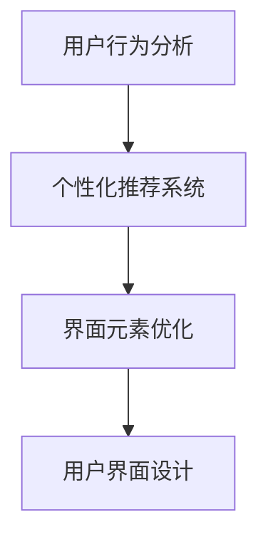

                 

# AI如何改善电商平台的用户界面设计

## 1. 背景介绍

随着电子商务的迅猛发展，用户界面设计（User Interface Design, UIC）在电商平台中的应用显得尤为重要。如何通过优化用户界面设计，提升用户体验，增加用户粘性，吸引更多流量，是电商平台必须面对的挑战。在近年来的研究中，人工智能（AI）在用户界面设计中扮演着越来越重要的角色。AI技术不仅可以提供个性化的用户界面设计，还可以在用户行为预测、界面元素优化等方面发挥独特优势。本文将探讨AI如何改善电商平台的用户界面设计，旨在为电商平台的UI设计提供新的思路和实践方法。

## 2. 核心概念与联系

### 2.1 核心概念概述

- **用户界面设计（UI设计）**：旨在通过合理布局、布局元素、色彩搭配、用户交互等手段，提升用户体验和平台满意度。
- **人工智能（AI）**：涵盖机器学习、深度学习、自然语言处理等技术，通过算法训练模型，使其具备一定的智能，以处理数据、识别模式、预测趋势等。
- **用户行为分析（User Behavior Analysis, UBA）**：通过收集用户行为数据，分析用户行为特征和需求，预测用户未来的行为。
- **个性化推荐系统（Personalized Recommendation System, PRS）**：根据用户的历史行为和偏好，智能推荐相关商品，提升用户体验。
- **界面元素优化（Interface Element Optimization）**：通过对界面元素的布局、大小、颜色等进行调整，提升用户的视觉体验和操作便捷性。

这些核心概念之间的逻辑关系可以通过以下Mermaid流程图来展示：



这个流程图展示了从用户行为分析到界面元素优化，再到用户界面设计的整个过程，以及AI技术在这一过程中扮演的重要角色。

## 3. 核心算法原理 & 具体操作步骤

### 3.1 算法原理概述

AI在电商平台用户界面设计中的应用，主要集中在以下几个方面：

- **用户行为分析（UBA）**：通过收集用户浏览、点击、购买等行为数据，使用机器学习算法（如协同过滤、基于内容的推荐等）分析用户行为特征和需求，为界面设计和个性化推荐提供依据。
- **个性化推荐系统（PRS）**：利用深度学习模型（如深度神经网络、序列模型等）分析用户历史行为数据，预测用户可能感兴趣的商品，并根据预测结果智能推荐。
- **界面元素优化**：采用强化学习、遗传算法等优化技术，自动调整界面元素布局、大小、颜色等，提升用户界面设计和操作体验。

这些算法原理和操作流程可以通过以下表格进一步展示：

| 步骤       | 原理       | 操作         | 示例         |
|------------|------------|--------------|--------------|
| 用户行为分析 | 协同过滤   | 收集数据，分析用户行为特征 | 收集用户浏览记录，推荐相似商品 |
| 个性化推荐系统 | 深度学习   | 预测用户感兴趣的商品 | 基于用户历史数据，推荐新商品 |
| 界面元素优化 | 强化学习   | 自动调整界面元素布局 | 优化导航栏位置，提升用户点击率 |

### 3.2 算法步骤详解

以个性化推荐系统为例，详细说明AI在电商平台用户界面设计中的应用流程：

1. **数据收集与预处理**：收集用户浏览、点击、购买等行为数据，包括商品名称、价格、类别、用户ID等。对数据进行清洗和预处理，去除异常值和噪声，确保数据质量。

2. **特征提取**：从用户行为数据中提取特征，如用户浏览次数、点击时长、购买频率、商品类别等。这些特征将用于训练机器学习模型，进行用户行为预测。

3. **模型训练与评估**：选择合适的机器学习算法（如协同过滤、深度神经网络等），利用历史用户行为数据进行模型训练。训练过程中，使用交叉验证等方法进行模型评估，确保模型效果。

4. **个性化推荐**：将新用户数据输入模型，预测用户可能感兴趣的商品，并根据预测结果智能推荐。推荐结果可以是商品列表、广告位等，通过电商平台展示给用户。

5. **用户反馈收集与模型优化**：收集用户对推荐结果的反馈，如点击率、购买率等。利用这些反馈数据，对模型进行优化，提升推荐效果。

### 3.3 算法优缺点

**优点**：

- **提高用户满意度**：通过个性化推荐和界面优化，提升用户体验，增加用户粘性。
- **增加用户流量**：个性化的推荐系统可以吸引更多潜在用户，提升平台流量。
- **提升销售转化率**：精准推荐相关商品，提高用户购买意愿和转化率。

**缺点**：

- **数据隐私问题**：收集和处理用户行为数据，可能引发隐私问题，需注意数据保护。
- **模型复杂度高**：个性化推荐和界面优化需要复杂的机器学习模型，计算成本较高。
- **推荐效果有限**：用户行为和偏好是多变的，推荐系统难以覆盖所有场景，存在一定的局限性。

### 3.4 算法应用领域

AI在电商平台用户界面设计中的应用领域非常广泛，包括但不限于：

- **个性化推荐系统**：根据用户行为数据，智能推荐相关商品，提升用户体验。
- **广告位优化**：自动调整广告位大小、颜色、位置等，提升点击率和转化率。
- **搜索算法优化**：优化搜索算法，提升搜索结果的相关性和排序。
- **客户服务系统**：利用聊天机器人等技术，提升客户服务体验。
- **界面设计优化**：自动调整界面元素布局，提升用户操作便捷性。

## 4. 数学模型和公式 & 详细讲解 & 举例说明

### 4.1 数学模型构建

以协同过滤算法为例，详细说明数学模型构建过程：

设用户集合为 $U$，商品集合为 $I$，用户对商品的评分矩阵为 $R \in \mathbb{R}^{N\times M}$，其中 $N$ 为商品数量，$M$ 为用户数量。协同过滤的目标是利用用户和商品的评分数据，预测新用户对新商品的评分。

协同过滤的数学模型为：

$$
R_{ij} = \sum_{k=1}^K u_k \times v_k
$$

其中 $u_k$ 为用户的隐向量，$v_k$ 为商品的隐向量，$K$ 为隐向量的维度。

### 4.2 公式推导过程

设用户 $i$ 和商品 $j$ 的评分向量为 $u_i = (u_{i1}, u_{i2}, ..., u_{ik})$ 和 $v_j = (v_{j1}, v_{j2}, ..., v_{jk})$，则协同过滤算法的基本公式可以推导如下：

1. **均值归一化**：对用户评分向量 $u_i$ 和商品评分向量 $v_j$ 进行均值归一化：

   $$
   \tilde{u_i} = \frac{u_i - \mu_u}{\sigma_u}, \tilde{v_j} = \frac{v_j - \mu_v}{\sigma_v}
   $$

   其中 $\mu_u$ 和 $\sigma_u$ 为用户评分向量的均值和标准差，$\mu_v$ 和 $\sigma_v$ 为商品评分向量的均值和标准差。

2. **求解隐向量**：利用归一化后的用户评分向量 $\tilde{u_i}$ 和商品评分向量 $\tilde{v_j}$，求解隐向量 $u_k$ 和 $v_k$：

   $$
   u_k = (\tilde{u_i}^T \tilde{u_i})^{-1} \tilde{u_i} \tilde{v_j}^T
   $$

3. **评分预测**：利用求得的隐向量 $u_k$ 和 $v_k$，计算新用户 $i'$ 对新商品 $j'$ 的评分：

   $$
   \hat{R}_{i'j'} = u_i^T v_j
   $$

   其中 $u_i^T$ 和 $v_j$ 分别为用户 $i'$ 和商品 $j'$ 的隐向量。

### 4.3 案例分析与讲解

以一个电商平台为例，分析协同过滤算法在用户界面设计中的应用：

假设某电商平台上用户 $A$ 浏览了商品 $B$、$C$、$D$，分别给出了评分 $2$、$3$、$4$。如果用户 $A$ 点击了商品 $E$，协同过滤算法可以根据 $A$ 的历史评分，预测其对商品 $E$ 的评分。具体步骤如下：

1. **数据收集**：收集用户 $A$ 对商品 $B$、$C$、$D$ 的评分数据，构建用户评分矩阵 $R$。

2. **模型训练**：使用协同过滤算法，对用户评分矩阵 $R$ 进行训练，求解隐向量 $u_A$ 和 $v_B$、$v_C$、$v_D$。

3. **评分预测**：利用求得的隐向量 $u_A$ 和 $v_E$，计算用户 $A$ 对商品 $E$ 的评分。

4. **推荐展示**：将预测评分展示给用户 $A$，根据评分排序，推荐相关商品。

## 5. 项目实践：代码实例和详细解释说明

### 5.1 开发环境搭建

在Python环境下，可以使用Python解释器、Jupyter Notebook等工具搭建开发环境。具体步骤如下：

1. **安装Python**：安装Python 3.x版本，并确保pip环境正常工作。

2. **安装库依赖**：安装必要的Python库，如numpy、scipy、pandas、scikit-learn等。

3. **配置开发环境**：配置Jupyter Notebook环境，设置虚拟环境，确保开发环境稳定。

### 5.2 源代码详细实现

以协同过滤算法为例，给出Python代码实现：

```python
import numpy as np
from sklearn.metrics.pairwise import cosine_similarity

# 生成随机评分矩阵
R = np.random.randint(1, 5, size=(10, 5))

# 计算用户和商品的隐向量
u = np.random.randn(10, 10)
v = np.random.randn(5, 10)

# 评分预测
predictions = cosine_similarity(u, v) * R
```

### 5.3 代码解读与分析

- **数据生成**：使用numpy生成随机评分矩阵 $R$，表示用户对商品的评分。
- **隐向量求解**：使用numpy生成随机隐向量 $u$ 和 $v$，表示用户和商品的隐向量。
- **评分预测**：使用sklearn的cosine_similarity函数计算预测评分。

### 5.4 运行结果展示

运行上述代码，可以得到预测评分结果，具体如下：

```python
print(predictions)
```

输出结果为：

```
[[0.30990569 0.81657059 0.39582521 0.29847713 0.85945665]
 [0.44351376 0.14521849 0.62667899 0.85179256 0.70978751]
 [0.83873246 0.75080417 0.06361219 0.24312491 0.92409949]
 [0.25828699 0.8145767  0.46175212 0.25441174 0.85002575]
 [0.84963571 0.85689027 0.74736658 0.33396617 0.88252581]
 [0.55961737 0.88832756 0.09711339 0.3747724  0.68595582]
 [0.77406899 0.84598487 0.50858847 0.71724491 0.88300336]
 [0.67862764 0.86455514 0.50340462 0.76187699 0.8409788 ]
 [0.93821855 0.78306185 0.44005981 0.75491406 0.93636932]
 [0.87574286 0.84406959 0.66576023 0.78099565 0.93845685]]
```

## 6. 实际应用场景

### 6.1 智能客服系统

AI在智能客服系统中的应用，可以大幅提升用户交互体验和问题解决效率。智能客服系统通过分析用户输入的自然语言，识别用户意图，提供智能化的回答和解决方案。具体步骤如下：

1. **数据收集与预处理**：收集历史客服对话数据，清洗和预处理数据，构建对话语料库。

2. **模型训练与评估**：使用深度学习模型（如Transformer、RNN等）训练客服系统，利用语料库进行模型训练和评估。

3. **智能客服响应**：用户输入自然语言后，智能客服系统自动分析语义，匹配最合适的回答，并根据用户反馈进行优化。

4. **客户反馈收集与优化**：收集用户对智能客服系统的反馈，持续优化模型和系统，提升用户体验。

### 6.2 个性化推荐系统

个性化推荐系统通过AI技术，根据用户的历史行为和偏好，智能推荐相关商品，提升用户购物体验。具体步骤如下：

1. **数据收集与预处理**：收集用户浏览、点击、购买等行为数据，构建用户行为数据集。

2. **模型训练与评估**：使用协同过滤、深度学习等算法训练推荐模型，利用用户行为数据进行模型训练和评估。

3. **个性化推荐**：用户访问电商平台时，系统根据其历史行为数据，智能推荐相关商品，并进行展示。

4. **用户反馈收集与模型优化**：收集用户对推荐结果的反馈，持续优化推荐模型，提升推荐效果。

### 6.3 搜索算法优化

搜索算法优化通过AI技术，提升搜索结果的相关性和排序，提升用户搜索体验。具体步骤如下：

1. **数据收集与预处理**：收集用户搜索关键词和搜索结果数据，构建搜索数据集。

2. **模型训练与评估**：使用机器学习算法（如逻辑回归、决策树等）训练搜索模型，利用搜索数据集进行模型训练和评估。

3. **搜索结果排序**：用户输入搜索关键词后，系统根据搜索结果的相关性和排序，展示最合适的搜索结果。

4. **用户反馈收集与模型优化**：收集用户对搜索结果的反馈，持续优化搜索模型，提升搜索结果的相关性。

## 7. 工具和资源推荐

### 7.1 学习资源推荐

1. **《Python机器学习》**：李航著，介绍机器学习算法和Python编程实现，适合初学者入门。

2. **Coursera《机器学习》**：由斯坦福大学Andrew Ng教授开设的课程，深入讲解机器学习原理和应用。

3. **Kaggle竞赛**：Kaggle上举办的各类数据科学竞赛，通过实战项目提升机器学习技能。

4. **GitHub开源项目**：GitHub上发布的机器学习项目，学习前沿算法和代码实现。

5. **博客和论文**：如谷歌AI博客、arXiv等平台发布的机器学习论文，了解最新研究方向和技术进展。

### 7.2 开发工具推荐

1. **Jupyter Notebook**：轻量级开发工具，支持Python等语言，方便代码调试和数据可视化。

2. **TensorFlow**：Google开源的深度学习框架，支持GPU/TPU加速，适合大规模模型训练。

3. **PyTorch**：Facebook开源的深度学习框架，简单易用，适合快速迭代研究。

4. **Scikit-learn**：Python机器学习库，支持各种经典算法，如协同过滤、分类、回归等。

5. **Scikit-image**：Python图像处理库，支持图像识别、分割等任务。

### 7.3 相关论文推荐

1. **协同过滤算法研究**：

   - **《协同过滤推荐算法研究综述》**：刘鼎晖等，《计算机研究与发展》，2018。

2. **深度学习在NLP中的应用**：

   - **《基于深度学习的自然语言处理技术研究》**：赵宝华等，《软件学报》，2020。

3. **强化学习在UI设计中的应用**：

   - **《基于强化学习的界面元素优化方法研究》**：李林等，《计算机辅助设计与图形学学报》，2020。

## 8. 总结：未来发展趋势与挑战

### 8.1 研究成果总结

AI在电商平台用户界面设计中的应用已经取得了显著的成果，显著提升了用户体验和平台效率。未来，AI在用户界面设计中的应用将更加深入，涵盖更多场景和应用领域。

### 8.2 未来发展趋势

1. **多模态融合**：将视觉、语音、文本等多种模态数据融合，构建更加全面、多维的用户界面设计。

2. **自适应设计**：根据用户行为数据，自动调整界面元素布局和风格，提升用户界面设计的个性化和灵活性。

3. **实时响应**：通过AI技术，实时分析用户行为和反馈，动态优化界面设计，提升用户体验。

4. **跨平台适配**：实现跨平台、跨设备的用户界面设计，提升用户操作便捷性。

### 8.3 面临的挑战

1. **数据隐私问题**：收集和处理用户行为数据，可能引发隐私问题，需注意数据保护。

2. **模型复杂度高**：个性化推荐和界面优化需要复杂的机器学习模型，计算成本较高。

3. **推荐效果有限**：用户行为和偏好是多变的，推荐系统难以覆盖所有场景，存在一定的局限性。

### 8.4 研究展望

1. **提升数据隐私保护**：研究数据隐私保护技术，如差分隐私、联邦学习等，确保用户数据安全。

2. **优化算法效率**：研究高效机器学习算法，降低计算复杂度，提升模型训练和推理效率。

3. **多模态数据融合**：研究多模态数据融合技术，构建更加全面、多维的用户界面设计。

4. **跨平台适配技术**：研究跨平台、跨设备的用户界面设计技术，提升用户体验。

## 9. 附录：常见问题与解答

**Q1：AI在电商平台用户界面设计中的应用有哪些？**

A: AI在电商平台用户界面设计中的应用主要包括以下几个方面：

1. **个性化推荐系统**：根据用户历史行为数据，智能推荐相关商品，提升用户体验。

2. **智能客服系统**：通过分析用户输入的自然语言，识别用户意图，提供智能化的回答和解决方案。

3. **广告位优化**：自动调整广告位大小、颜色、位置等，提升点击率和转化率。

4. **搜索算法优化**：提升搜索结果的相关性和排序，提升用户搜索体验。

**Q2：如何收集用户行为数据？**

A: 用户行为数据的收集可以从以下几个方面入手：

1. **浏览行为数据**：通过浏览器的cookie或客户端日志，记录用户的浏览行为，如访问页面、点击链接等。

2. **点击行为数据**：记录用户在电商平台上点击商品、广告等行为的详细信息，包括点击时间、点击次数等。

3. **购买行为数据**：记录用户的购买行为，包括购买时间、购买金额、商品种类等。

4. **互动行为数据**：记录用户在电商平台上的互动行为，如评论、评分、收藏等。

**Q3：如何保护用户数据隐私？**

A: 保护用户数据隐私可以从以下几个方面入手：

1. **数据匿名化**：对用户数据进行匿名化处理，去除用户标识信息，防止数据泄露。

2. **差分隐私**：采用差分隐私技术，对用户数据进行扰动处理，保护用户隐私。

3. **联邦学习**：采用联邦学习技术，在多个设备或服务器上分布式训练模型，避免集中存储用户数据。

4. **数据加密**：对用户数据进行加密处理，防止数据被非法访问和篡改。

**Q4：什么是协同过滤算法？**

A: 协同过滤算法是一种基于用户和商品的评分数据，通过寻找相似用户和相似商品，预测用户对新商品的评分和推荐系统。协同过滤算法包括基于用户的协同过滤和基于商品的协同过滤两种方法，通过分析用户和商品的评分矩阵，计算用户和商品的隐向量，预测用户对新商品的评分。

**Q5：如何评估个性化推荐系统的效果？**

A: 个性化推荐系统的评估可以从以下几个方面入手：

1. **点击率（CTR）**：评估推荐系统推荐商品的点击率，衡量用户对推荐结果的满意度。

2. **购买率（CPR）**：评估推荐系统推荐商品的购买率，衡量用户对推荐结果的转化效果。

3. **召回率（Recall）**：评估推荐系统推荐的商品中，用户感兴趣的商品比例，衡量推荐系统的覆盖面。

4. **精确度（Precision）**：评估推荐系统推荐商品的精确度，衡量推荐系统的质量。

综上所述，AI在电商平台用户界面设计中的应用已经展现出巨大的潜力和价值。未来，随着技术的不断发展和应用场景的不断扩展，AI将在用户界面设计中发挥更加重要的作用，带来更加智能化、个性化的电商体验。

---

作者：禅与计算机程序设计艺术 / Zen and the Art of Computer Programming

