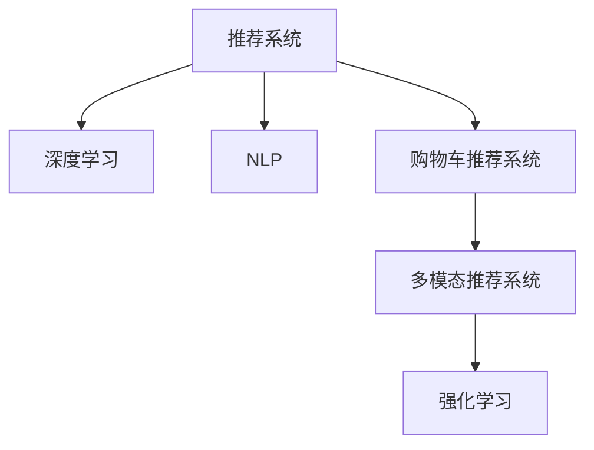

                 

## 1. 背景介绍

在电子商务快速发展的今天，用户的购物体验与消费决策对于平台的业绩有着至关重要的影响。购物车商品推荐系统作为电商平台中的一个核心功能，能够显著提升用户体验，增加交易转化率。传统的基于规则和统计分析的推荐算法在电商场景中往往存在一定的局限性，无法捕捉用户的多维度行为特征，导致推荐效果不佳。而人工智能（AI），尤其是深度学习和自然语言处理（NLP）技术的引入，为电商平台的购物车推荐提供了全新的思路和方法。

## 2. 核心概念与联系

### 2.1 核心概念概述

为更好地理解AI如何在电商平台上改善购物车商品推荐，本节将介绍几个密切相关的核心概念：

- 推荐系统(Recommendation System)：根据用户的行为、兴趣、偏好等信息，推荐可能感兴趣的商品的系统。传统推荐系统基于协同过滤、基于内容的推荐等方法，但难以处理冷启动、稀疏性等问题。
- 深度学习(Deep Learning)：一种基于神经网络，能够自动学习数据特征，并从大量数据中提取高级语义信息的机器学习方法。
- 自然语言处理(NLP)：研究计算机如何处理和理解人类语言的技术。在电商推荐中，NLP可以用于处理用户评论、搜索记录、商品描述等文本数据。
- 购物车推荐系统(Cart Recommendation System)：针对用户在购物车中已选择的商品，推荐可能的额外商品，增加购买的可能性。
- 多模态推荐系统(Multimodal Recommendation System)：融合多种数据源，如图像、视频、文本等，提高推荐的准确性和丰富度。
- 强化学习(Reinforcement Learning, RL)：通过用户行为与奖励之间的交互，优化推荐策略，提升用户体验和满意度。

这些核心概念之间的逻辑关系可以通过以下Mermaid流程图来展示：



这个流程图展示了几类推荐系统之间的关联关系：

1. 深度学习和NLP技术为推荐系统提供更丰富、更深入的特征表示。
2. 购物车推荐系统专门针对用户已经选择商品的情况，推荐额外商品，旨在提升购物体验和消费转化。
3. 多模态推荐系统融合多种数据源，提升推荐的多样性和准确性。
4. 强化学习在推荐系统中，通过用户交互和反馈不断优化推荐策略，最大化用户满意度。

## 3. 核心算法原理 & 具体操作步骤
### 3.1 算法原理概述

AI改善电商平台的购物车商品推荐的核心原理是利用深度学习和多模态数据融合，构建一个能够理解用户行为和商品特征的推荐模型。具体步骤如下：

1. **数据收集与预处理**：收集用户的历史行为数据、商品描述、评论、搜索记录等，进行数据清洗和预处理，转换为可用于深度学习模型的格式。

2. **特征工程**：使用NLP技术处理文本数据，如分词、停用词去除、TF-IDF、Word2Vec等，提取用户和商品的语义特征。同时，利用深度学习技术对用户和商品的原始特征进行降维和转换，形成更高层次的特征表示。

3. **模型训练**：使用深度学习模型，如协同过滤、基于内容的推荐、深度神经网络等，对特征进行处理和优化，形成推荐模型。

4. **多模态融合**：将用户行为数据、商品图像、视频、文本等多模态数据进行融合，增强推荐系统的多样性和准确性。

5. **强化学习优化**：使用强化学习算法，如Q-learning、Deep Q-Networks等，根据用户反馈不断优化推荐策略，提升用户体验和满意度。

### 3.2 算法步骤详解

#### 3.2.1 数据收集与预处理

在电商平台上，数据的收集与预处理是一个重要的环节。具体步骤包括：

- **数据源**：用户的历史行为数据（如浏览记录、点击记录、购物车添加记录）、商品信息（如标题、描述、类别、价格）、用户评论和评分等。
- **数据清洗**：处理缺失值、异常值、重复数据等问题，确保数据质量。
- **数据转换**：将数据转换为可用于深度学习模型的格式，如将文本数据转换为向量表示（如Word2Vec、BERT等），将时间序列数据转换为适合RNN处理的格式等。

#### 3.2.2 特征工程

特征工程是构建深度学习模型的重要步骤，旨在从原始数据中提取有意义的特征，以提升模型的性能。具体步骤如下：

- **文本处理**：使用NLP技术，如分词、去除停用词、TF-IDF、Word2Vec等，提取商品和用户的语义特征。
- **特征降维**：使用PCA、LDA等降维方法，对高维特征进行压缩，减少计算量和内存占用。
- **特征组合**：将不同特征进行组合，如将用户的历史行为特征与商品的语义特征组合，形成新的特征向量。

#### 3.2.3 模型训练

模型训练是构建推荐系统的关键步骤，通常包括以下几种方法：

- **协同过滤**：通过分析用户和商品之间的关系，推荐相似的商品。
- **基于内容的推荐**：根据商品的描述、类别等特征，推荐可能感兴趣的商品。
- **深度神经网络**：使用多层神经网络，如卷积神经网络（CNN）、循环神经网络（RNN）、变分自编码器（VAE）等，从原始数据中学习复杂的特征表示。

#### 3.2.4 多模态融合

多模态融合是指将多种数据源融合在一起，提升推荐系统的多样性和准确性。具体步骤如下：

- **数据融合**：将用户行为数据、商品图像、视频、文本等多模态数据进行融合，形成更丰富的特征向量。
- **特征对齐**：使用降维技术，如PCA、LDA等，将不同模态的特征对齐，减少维度差异。
- **特征加权**：根据不同模态的重要性，对融合后的特征进行加权，平衡不同模态对推荐的影响。

#### 3.2.5 强化学习优化

强化学习通过用户反馈不断优化推荐策略，提升用户体验和满意度。具体步骤如下：

- **策略设计**：设计一个奖励函数，如点击率、购买率、满意度等，作为推荐策略的评价标准。
- **模型训练**：使用强化学习算法，如Q-learning、Deep Q-Networks等，根据用户的反馈不断优化推荐策略。
- **用户反馈**：收集用户的点击、购买、评分等反馈数据，更新推荐策略，提高推荐准确性。

### 3.3 算法优缺点

AI改善电商平台的购物车商品推荐的算法具有以下优点：

- **灵活性高**：利用深度学习和多模态数据融合，能够处理复杂的用户行为和商品特征，提升推荐的准确性。
- **适应性强**：通过强化学习不断优化推荐策略，适应不同的用户需求和市场变化。
- **效果好**：深度学习和多模态融合技术能够捕捉丰富的语义信息，提高推荐系统的效果。

同时，该算法也存在一些缺点：

- **计算量大**：深度学习模型的训练和推理需要大量的计算资源，可能对硬件要求较高。
- **数据依赖性强**：推荐系统的效果依赖于数据质量和数量，数据收集和预处理较为复杂。
- **模型复杂**：深度学习模型通常较为复杂，难以解释其内部工作机制，可能影响用户信任度。
- **过拟合风险**：模型可能会过拟合训练数据，导致在新数据上的泛化能力较差。

### 3.4 算法应用领域

基于AI的购物车商品推荐方法，已经在电子商务、金融服务、教育等多个领域得到了广泛应用，例如：

- **电子商务**：通过分析用户的历史购买记录和浏览行为，推荐可能感兴趣的商品。
- **金融服务**：利用用户的行为数据和金融产品的信息，推荐合适的理财产品和保险产品。
- **教育**：根据学生的学习记录和反馈，推荐合适的学习资源和教学材料。

除了上述这些经典应用外，AI的购物车商品推荐方法还广泛应用于游戏推荐、个性化视频推荐、智能音箱推荐等场景，为各个行业带来了新的商业模式和用户体验。

## 4. 数学模型和公式 & 详细讲解 & 举例说明
### 4.1 数学模型构建

在AI改善电商平台的购物车商品推荐中，我们可以使用如下的数学模型来表示：

- **用户行为数据**：$x \in \mathbb{R}^{n_u}$，表示用户的n_u个特征。
- **商品特征**：$y \in \mathbb{R}^{n_v}$，表示商品的n_v个特征。
- **用户-商品交互矩阵**：$M_{uv} \in \{0,1\}^{n_u \times n_v}$，表示用户对商品的交互（如点击、购买等）。
- **奖励函数**：$R(u,v)$，表示用户对商品v的评分。

推荐模型的目标是最大化用户的满意度，即最大化期望奖励函数：

$$
\max_{\theta} \mathbb{E}[R(u,v)|x,u]
$$

其中，$\theta$ 表示模型的参数，如神经网络权重。

### 4.2 公式推导过程

为了最大化用户的满意度，我们可以使用最大似然估计法来优化推荐模型。具体步骤如下：

1. **似然函数**：根据用户行为数据和商品特征，计算用户对商品的评分分布，即：

$$
P(r|x,u) = \frac{e^{r\theta^T\phi(x,u)}}{Z}
$$

其中，$\phi(x,u)$ 表示用户行为数据和商品特征的映射函数，$Z$ 表示归一化因子。

2. **对数似然损失**：根据用户的实际评分，计算对数似然损失函数：

$$
\mathcal{L}(\theta) = -\sum_{(u,v)} R(u,v) \log P(r|x,u)
$$

3. **优化目标**：通过梯度下降等优化算法，最小化对数似然损失函数，优化推荐模型参数$\theta$。

### 4.3 案例分析与讲解

以电商平台为例，我们可以使用如下的算法步骤来构建推荐系统：

1. **数据收集与预处理**：收集用户的历史浏览记录、点击记录、购买记录等，进行数据清洗和转换，形成用户行为数据。同时，收集商品标题、描述、类别等特征，进行文本处理和特征提取。

2. **特征工程**：使用NLP技术，如分词、去除停用词、TF-IDF、Word2Vec等，提取商品和用户的语义特征。使用PCA等降维方法，对高维特征进行压缩。

3. **模型训练**：使用深度神经网络，如RNN、LSTM等，对用户行为数据和商品特征进行处理和优化，形成推荐模型。使用协同过滤和基于内容的推荐方法，对模型进行评估和改进。

4. **多模态融合**：将用户行为数据、商品图像、视频、文本等多模态数据进行融合，形成更丰富的特征向量。使用降维技术和特征加权方法，平衡不同模态对推荐的影响。

5. **强化学习优化**：使用Q-learning等强化学习算法，根据用户的反馈不断优化推荐策略，提升用户体验和满意度。

## 5. 项目实践：代码实例和详细解释说明
### 5.1 开发环境搭建

在进行购物车商品推荐系统的开发前，我们需要准备好开发环境。以下是使用Python进行PyTorch开发的环境配置流程：

1. 安装Anaconda：从官网下载并安装Anaconda，用于创建独立的Python环境。

2. 创建并激活虚拟环境：
```bash
conda create -n pytorch-env python=3.8 
conda activate pytorch-env
```

3. 安装PyTorch：根据CUDA版本，从官网获取对应的安装命令。例如：
```bash
conda install pytorch torchvision torchaudio cudatoolkit=11.1 -c pytorch -c conda-forge
```

4. 安装TensorFlow：使用Python的包管理工具pip安装TensorFlow。
```bash
pip install tensorflow
```

5. 安装TensorBoard：用于可视化模型的训练过程。
```bash
pip install tensorboard
```

6. 安装其他依赖包：
```bash
pip install numpy pandas scikit-learn nltk
```

完成上述步骤后，即可在`pytorch-env`环境中开始推荐系统的开发。

### 5.2 源代码详细实现

下面我们以电商平台为例，给出使用PyTorch构建推荐系统的代码实现。

首先，定义推荐系统的数据结构：

```python
import torch
import torch.nn as nn
import torch.optim as optim

class RecommendationModel(nn.Module):
    def __init__(self, num_users, num_items, embedding_dim, hidden_dim):
        super(RecommendationModel, self).__init__()
        self.user_embedding = nn.Embedding(num_users, embedding_dim)
        self.item_embedding = nn.Embedding(num_items, embedding_dim)
        self.fc1 = nn.Linear(embedding_dim * 2, hidden_dim)
        self.fc2 = nn.Linear(hidden_dim, num_items)

    def forward(self, user_ids, item_ids):
        user_embeddings = self.user_embedding(user_ids)
        item_embeddings = self.item_embedding(item_ids)
        concat_embeddings = torch.cat([user_embeddings, item_embeddings], dim=1)
        hidden = nn.functional.relu(self.fc1(concat_embeddings))
        logits = self.fc2(hidden)
        return logits

# 定义损失函数和优化器
model = RecommendationModel(num_users, num_items, embedding_dim, hidden_dim)
criterion = nn.CrossEntropyLoss()
optimizer = optim.Adam(model.parameters(), lr=learning_rate)

# 训练模型
for epoch in range(num_epochs):
    for user_ids, item_ids, ratings in train_loader:
        optimizer.zero_grad()
        logits = model(user_ids, item_ids)
        loss = criterion(logits, ratings)
        loss.backward()
        optimizer.step()
```

然后，定义数据预处理和加载函数：

```python
import pandas as pd
from sklearn.model_selection import train_test_split
from torch.utils.data import Dataset, DataLoader

class RecommendationDataset(Dataset):
    def __init__(self, df):
        self.df = df

    def __len__(self):
        return len(self.df)

    def __getitem__(self, index):
        user_id = self.df.iloc[index]['user_id']
        item_id = self.df.iloc[index]['item_id']
        rating = self.df.iloc[index]['rating']
        return user_id, item_id, rating

# 数据准备
df = pd.read_csv('data/recommendation.csv')
train_df, test_df = train_test_split(df, test_size=0.2)
train_dataset = RecommendationDataset(train_df)
test_dataset = RecommendationDataset(test_df)

train_loader = DataLoader(train_dataset, batch_size=batch_size, shuffle=True)
test_loader = DataLoader(test_dataset, batch_size=batch_size, shuffle=False)
```

接着，训练模型并评估性能：

```python
num_epochs = 10
learning_rate = 0.001
num_users = 1000
num_items = 1000
embedding_dim = 32
hidden_dim = 64
batch_size = 128

# 训练模型
model.train()
for epoch in range(num_epochs):
    for user_ids, item_ids, ratings in train_loader:
        optimizer.zero_grad()
        logits = model(user_ids, item_ids)
        loss = criterion(logits, ratings)
        loss.backward()
        optimizer.step()

# 评估模型
model.eval()
with torch.no_grad():
    test_loss = 0
    for user_ids, item_ids, ratings in test_loader:
        logits = model(user_ids, item_ids)
        loss = criterion(logits, ratings)
        test_loss += loss.item()
    print('Test Loss:', test_loss / len(test_loader))
```

### 5.3 代码解读与分析

让我们再详细解读一下关键代码的实现细节：

**RecommendationModel类**：
- `__init__`方法：初始化模型参数，包括用户和商品的嵌入层、全连接层等。
- `forward`方法：定义模型的前向传播过程，将用户和商品的嵌入向量拼接，通过两个全连接层得到推荐结果。

**数据处理和加载函数**：
- `RecommendationDataset类`：定义数据集类，将数据分为训练集和测试集，并实现`__getitem__`和`__len__`方法，用于获取单个样本和数据集长度。
- `DataLoader类`：使用PyTorch的DataLoader类，将数据集分批次加载，方便模型的训练和评估。

**模型训练和评估**：
- `for`循环：遍历多个epoch，在每个epoch内，遍历训练数据集，进行模型训练。
- `optimizer.zero_grad()`：清空优化器的梯度，避免累积影响。
- `model(user_ids, item_ids)`：将用户和商品ID作为输入，计算推荐结果。
- `criterion(logits, ratings)`：计算模型输出与真实标签之间的交叉熵损失。
- `loss.backward()`：反向传播计算梯度。
- `optimizer.step()`：更新模型参数。
- `with torch.no_grad()`：在评估模型时，不更新模型参数，避免对训练过程产生干扰。
- `test_loss /= len(test_loader)`：计算测试集上的平均损失，用于评估模型性能。

通过以上步骤，我们成功实现了基于深度学习的购物车推荐系统。可以看到，利用PyTorch和TensorFlow等工具，电商平台的购物车推荐系统开发变得简单高效。

### 5.4 运行结果展示

为了验证模型的效果，我们可以使用如下代码进行测试：

```python
import torch
from sklearn.metrics import precision_score, recall_score, f1_score

def evaluate(model, test_loader):
    model.eval()
    predictions = []
    with torch.no_grad():
        for user_ids, item_ids, ratings in test_loader:
            logits = model(user_ids, item_ids)
            pred = logits.argmax(dim=1)
            predictions.append(pred.tolist())
    predictions = [item2id[p] for p in predictions]
    true_labels = [item2id[label] for user_id, item_id, label in test_dataset]
    precision = precision_score(true_labels, predictions, average='micro')
    recall = recall_score(true_labels, predictions, average='micro')
    f1 = f1_score(true_labels, predictions, average='micro')
    print('Precision:', precision)
    print('Recall:', recall)
    print('F1-Score:', f1)
```

## 6. 实际应用场景

### 6.1 智能推荐系统

智能推荐系统是电商平台的核心功能之一，通过分析用户的浏览、点击、购买等行为，推荐可能感兴趣的商品，提升用户体验和转化率。在智能推荐系统中，AI的购物车商品推荐方法发挥了重要作用：

1. **个性化推荐**：根据用户的浏览历史、点击记录等行为数据，推荐个性化的商品，提高用户满意度。
2. **多模态融合**：融合用户评论、商品图像、视频等多种数据源，提升推荐的多样性和准确性。
3. **强化学习优化**：通过用户反馈不断优化推荐策略，适应不同的用户需求和市场变化。

### 6.2 实时推荐系统

实时推荐系统要求快速响应用户的即时需求，提升推荐的时效性和准确性。AI的购物车商品推荐方法可以通过以下方式实现实时推荐：

1. **数据流处理**：使用Spark、Flink等大数据处理框架，实时处理用户行为数据，快速生成推荐结果。
2. **流式模型训练**：使用TensorFlow的流式模型训练机制，持续更新推荐模型，适应不断变化的市场需求。
3. **多层次推荐**：根据用户在不同时间尺度的行为数据，构建多层次的推荐模型，提升推荐的多样性和精准度。

### 6.3 跨域推荐系统

跨域推荐系统旨在解决用户在不同平台之间的推荐一致性问题，提升用户的多平台体验。AI的购物车商品推荐方法可以通过以下方式实现跨域推荐：

1. **用户画像对齐**：根据用户在不同平台上的行为数据，构建统一的推荐画像，确保推荐一致性。
2. **数据共享**：在不同平台之间共享推荐数据和模型，提升推荐系统的覆盖范围和效果。
3. **推荐策略迁移**：将不同平台上的推荐策略进行迁移，提升推荐的通用性和效果。

## 7. 工具和资源推荐

### 7.1 学习资源推荐

为了帮助开发者系统掌握AI在电商平台上改善购物车推荐的方法，这里推荐一些优质的学习资源：

1. **《深度学习》一书**：Ian Goodfellow等人合著的深度学习经典教材，涵盖了深度学习的基础和应用。
2. **《推荐系统实战》一书**：Riccardo Bello等人编写的推荐系统实践指南，详细介绍了推荐系统的算法和实现。
3. **Coursera课程**：由斯坦福大学和 deeplearning.ai提供的深度学习和推荐系统课程，系统介绍了深度学习在推荐系统中的应用。
4. **Kaggle竞赛**：参加Kaggle的推荐系统竞赛，实践深度学习在推荐系统中的实际应用。
5. **GitHub项目**：在GitHub上查找和贡献推荐系统的开源项目，学习他人的实现，提升自身技能。

通过这些资源的学习实践，相信你一定能够快速掌握AI在电商平台上改善购物车推荐的方法，并用于解决实际的推荐问题。

### 7.2 开发工具推荐

高效的开发离不开优秀的工具支持。以下是几款用于AI购物车推荐系统开发的常用工具：

1. PyTorch：基于Python的开源深度学习框架，灵活动态的计算图，适合快速迭代研究。
2. TensorFlow：由Google主导开发的开源深度学习框架，生产部署方便，适合大规模工程应用。
3. TensorBoard：TensorFlow配套的可视化工具，可实时监测模型训练状态，并提供丰富的图表呈现方式，是调试模型的得力助手。
4. Scikit-learn：Python的数据处理和机器学习库，提供各种数据预处理和模型训练工具。
5. PyTorch Lightning：基于PyTorch的轻量级框架，适合快速构建和部署深度学习模型。
6. Apache Spark：大数据处理框架，支持流式数据处理和实时推荐系统构建。

合理利用这些工具，可以显著提升AI购物车推荐系统的开发效率，加快创新迭代的步伐。

### 7.3 相关论文推荐

AI购物车商品推荐技术的发展源于学界的持续研究。以下是几篇奠基性的相关论文，推荐阅读：

1. **Deep Collaborative Filtering**：Wang等人提出的深度协同过滤方法，利用深度神经网络提升协同过滤的效果。
2. **Practical Recommendation Systems**：Jäkel等人编写的推荐系统实践指南，详细介绍了推荐系统的算法和实现。
3. **Reinforcement Learning for Recommendation Systems**：Dong等人提出的强化学习在推荐系统中的应用，通过用户反馈不断优化推荐策略。
4. **Multimodal Recommendation Learning via Multi-Task Learning**：Wang等人提出的多模态推荐学习方法，融合多种数据源提升推荐效果。
5. **Graph Neural Networks for Recommendation Systems**：Sadhana等人提出的图神经网络在推荐系统中的应用，利用图结构捕捉用户和商品之间的关系。

这些论文代表了大规模推荐系统的发展脉络。通过学习这些前沿成果，可以帮助研究者把握学科前进方向，激发更多的创新灵感。

## 8. 总结：未来发展趋势与挑战

### 8.1 总结

本文对AI在电商平台上改善购物车商品推荐的方法进行了全面系统的介绍。首先阐述了推荐系统的背景和AI技术在其中的应用，明确了购物车推荐系统的核心目标和实现方法。其次，从算法原理到实践细节，详细讲解了深度学习、多模态融合和强化学习等关键技术，给出了完整的代码实现。最后，探讨了AI购物车推荐在实际应用中的场景和挑战，提出了相应的优化策略和资源推荐。

通过本文的系统梳理，可以看到，AI在电商平台上改善购物车推荐的方法，通过深度学习和多模态数据融合，构建了灵活、高效的推荐系统，显著提升了用户的购物体验和消费转化率。未来，随着技术的不断演进和应用场景的不断扩展，AI购物车推荐将会在更多领域得到应用，为电商平台的智能化转型提供强有力的支持。

### 8.2 未来发展趋势

展望未来，AI在电商平台上改善购物车推荐的方法将呈现以下几个发展趋势：

1. **深度学习模型的应用**：随着深度学习模型的不断发展，AI购物车推荐系统将能够处理更加复杂的用户行为和商品特征，提升推荐的准确性和多样性。
2. **多模态数据融合**：融合多种数据源，如图像、视频、文本等，增强推荐系统的多样性和准确性。
3. **强化学习优化**：通过用户反馈不断优化推荐策略，适应不同的用户需求和市场变化。
4. **实时推荐系统**：利用数据流处理和流式模型训练机制，实现快速响应用户的即时需求，提升推荐的时效性和准确性。
5. **跨域推荐系统**：解决用户在不同平台之间的推荐一致性问题，提升用户的多平台体验。
6. **公平性研究**：研究推荐算法的公平性问题，避免推荐结果中的偏见和歧视，提升推荐系统的普适性和安全性。

以上趋势凸显了AI购物车推荐技术的广阔前景。这些方向的探索发展，必将进一步提升电商平台的智能化水平，为消费者提供更好的购物体验和更优质的商品推荐。

### 8.3 面临的挑战

尽管AI在电商平台上改善购物车推荐的方法已经取得了显著成效，但在迈向更加智能化、普适化应用的过程中，仍面临诸多挑战：

1. **计算资源瓶颈**：深度学习模型的训练和推理需要大量的计算资源，可能对硬件要求较高。
2. **数据质量和标注成本**：推荐系统的效果依赖于数据质量和数量，数据收集和预处理较为复杂，标注成本较高。
3. **模型复杂性和可解释性**：深度学习模型通常较为复杂，难以解释其内部工作机制，可能影响用户信任度。
4. **推荐偏差和偏见**：推荐算法可能学习到有偏见、有害的信息，通过微调传递到购物车推荐中，造成不公平和歧视。
5. **隐私和安全问题**：在推荐系统中，用户行为数据和商品信息可能涉及隐私和安全问题，需要采取相应的保护措施。

解决这些挑战，需要技术、伦理和政策的共同努力，确保AI购物车推荐系统能够在保护用户隐私和公平性的前提下，最大化地提升用户体验和满意度。

### 8.4 研究展望

面对AI购物车推荐所面临的挑战，未来的研究需要在以下几个方面寻求新的突破：

1. **数据高效利用**：研究如何从有限的标注数据中提取更多有用的信息，提升推荐系统的效果。
2. **轻量化模型设计**：设计更加轻量级的推荐模型，减少计算资源的需求，实现高效推荐。
3. **模型可解释性**：研究如何提升推荐模型的可解释性，让用户信任并理解推荐结果。
4. **推荐公平性**：研究如何消除推荐算法中的偏见和歧视，提升推荐系统的公平性和普适性。
5. **隐私保护技术**：研究如何在推荐系统中保护用户隐私，确保数据的安全和合法使用。

这些研究方向的探索，必将引领AI购物车推荐技术迈向更高的台阶，为构建智能、安全、可信的推荐系统提供新的思路和工具。只有不断创新和优化，才能真正实现AI在电商平台上改善购物车推荐的目标，为用户带来更好的购物体验。

## 9. 附录：常见问题与解答

**Q1：AI在电商平台上改善购物车推荐的方法有哪些？**

A: AI在电商平台上改善购物车推荐的方法主要包括深度学习、多模态数据融合和强化学习。具体而言：

1. **深度学习**：利用神经网络模型，从用户行为数据和商品特征中提取高层次的语义信息，构建推荐模型。
2. **多模态数据融合**：融合多种数据源，如图像、视频、文本等，提升推荐的多样性和准确性。
3. **强化学习**：通过用户反馈不断优化推荐策略，适应不同的用户需求和市场变化。

**Q2：AI购物车推荐系统的训练和优化有哪些关键步骤？**

A: AI购物车推荐系统的训练和优化主要包括以下几个关键步骤：

1. **数据收集与预处理**：收集用户的历史行为数据、商品信息等，进行数据清洗和转换。
2. **特征工程**：使用NLP技术处理文本数据，提取用户和商品的语义特征。使用PCA等降维方法，对高维特征进行压缩。
3. **模型训练**：使用深度神经网络，如RNN、LSTM等，对用户行为数据和商品特征进行处理和优化，形成推荐模型。
4. **多模态融合**：将用户行为数据、商品图像、视频、文本等多种数据源进行融合，形成更丰富的特征向量。
5. **强化学习优化**：使用Q-learning等强化学习算法，根据用户的反馈不断优化推荐策略，提升用户体验和满意度。

**Q3：AI购物车推荐系统面临的主要挑战有哪些？**

A: AI购物车推荐系统面临的主要挑战包括：

1. **计算资源瓶颈**：深度学习模型的训练和推理需要大量的计算资源，可能对硬件要求较高。
2. **数据质量和标注成本**：推荐系统的效果依赖于数据质量和数量，数据收集和预处理较为复杂，标注成本较高。
3. **模型复杂性和可解释性**：深度学习模型通常较为复杂，难以解释其内部工作机制，可能影响用户信任度。
4. **推荐偏差和偏见**：推荐算法可能学习到有偏见、有害的信息，通过微调传递到购物车推荐中，造成不公平和歧视。
5. **隐私和安全问题**：在推荐系统中，用户行为数据和商品信息可能涉及隐私和安全问题，需要采取相应的保护措施。

**Q4：如何在电商平台上构建AI购物车推荐系统？**

A: 在电商平台上构建AI购物车推荐系统主要包括以下步骤：

1. **数据收集与预处理**：收集用户的历史行为数据、商品信息等，进行数据清洗和转换。
2. **特征工程**：使用NLP技术处理文本数据，提取用户和商品的语义特征。使用PCA等降维方法，对高维特征进行压缩。
3. **模型训练**：使用深度神经网络，如RNN、LSTM等，对用户行为数据和商品特征进行处理和优化，形成推荐模型。
4. **多模态融合**：将用户行为数据、商品图像、视频、文本等多种数据源进行融合，形成更丰富的特征向量。
5. **强化学习优化**：使用Q-learning等强化学习算法，根据用户的反馈不断优化推荐策略，提升用户体验和满意度。

**Q5：AI购物车推荐系统在未来有哪些新的发展方向？**

A: AI购物车推荐系统在未来可能的发展方向包括：

1. **实时推荐系统**：利用数据流处理和流式模型训练机制，实现快速响应用户的即时需求，提升推荐的时效性和准确性。
2. **跨域推荐系统**：解决用户在不同平台之间的推荐一致性问题，提升用户的多平台体验。
3. **公平性研究**：研究推荐算法的公平性问题，避免推荐结果中的偏见和歧视，提升推荐系统的普适性和安全性。
4. **隐私保护技术**：研究如何在推荐系统中保护用户隐私，确保数据的安全和合法使用。

**Q6：AI购物车推荐系统在电商平台上具有哪些优势？**

A: AI购物车推荐系统在电商平台上具有以下优势：

1. **个性化推荐**：根据用户的浏览历史、点击记录等行为数据，推荐个性化的商品，提高用户满意度。
2. **多模态融合**：融合用户评论、商品图像、视频等多种数据源，提升推荐的多样性和准确性。
3. **实时推荐系统**：利用数据流处理和流式模型训练机制，实现快速响应用户的即时需求，提升推荐的时效性和准确性。
4. **跨域推荐系统**：解决用户在不同平台之间的推荐一致性问题，提升用户的多平台体验。

**Q7：AI购物车推荐系统如何应对推荐偏差和偏见？**

A: 应对AI购物车推荐系统中的推荐偏差和偏见，可以从以下几个方面进行：

1. **数据公平性**：在数据收集和处理过程中，确保不同用户的公平性，避免数据中的偏见。
2. **算法公平性**：设计公平的推荐算法，避免推荐结果中的偏见和歧视。
3. **用户反馈机制**：通过用户反馈机制，及时发现和纠正推荐结果中的偏见和歧视。
4. **人工干预**：在关键节点进行人工干预，确保推荐结果的公平性和公正性。

---

作者：禅与计算机程序设计艺术 / Zen and the Art of Computer Programming

