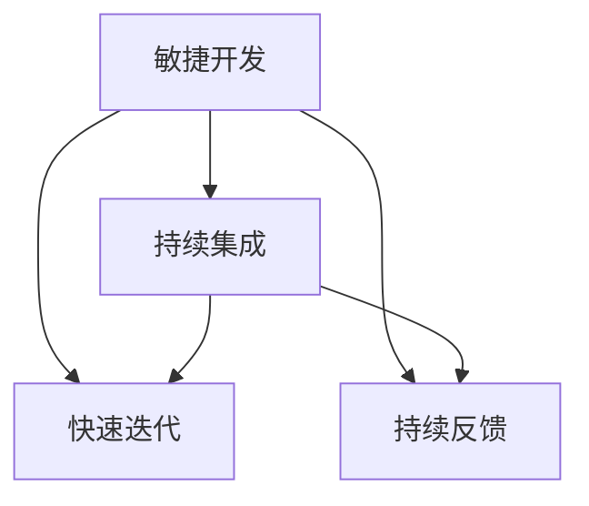

                 

# AI开发的敏捷迭代：Lepton AI的快速响应

> 关键词：敏捷开发, Lepton AI, 快速迭代, 响应速度, 持续集成, 自动化测试

## 1. 背景介绍

### 1.1 问题由来

在当今快速变化的科技环境中，软件产品的生命周期变得越来越短。AI技术尤其如此，算法模型需要不断更新，以应对新数据、新需求和新兴的业务场景。然而，传统的软件开发流程往往难以适应这种快速变化的环境，导致AI产品的开发和部署过程变得缓慢和冗长。

### 1.2 问题核心关键点

为应对这一挑战，敏捷开发方法应运而生，特别是在AI领域。敏捷开发的核心思想是将软件开发过程分解为多个短周期迭代，每个迭代周期通常为1-4周，确保快速响应市场需求和变化。这种快速迭代的方式可以显著提升AI产品的开发速度和质量，使其更好地适应市场和技术的发展。

敏捷开发的核心要素包括：

1. **快速迭代**：通过不断的小周期迭代，快速响应市场需求和变化。
2. **持续集成**：通过自动化测试和部署工具，确保每次迭代的质量和可靠性。
3. **团队协作**：通过跨职能团队的紧密合作，确保开发过程中各环节的无缝对接。
4. **持续反馈**：通过快速获取用户反馈，持续优化产品功能。

Lepton AI就是一家采用敏捷开发方法论的AI公司，致力于通过快速迭代，为用户提供高质量的AI解决方案。

## 2. 核心概念与联系

### 2.1 核心概念概述

为更好地理解敏捷开发在AI项目中的应用，本节将介绍几个关键概念及其联系：

- **敏捷开发(Agile Development)**：一种以人为核心，迭代、增量的软件开发方法，强调快速响应市场需求，持续优化产品功能。
- **持续集成(Continuous Integration, CI)**：通过自动化测试和部署工具，确保代码质量和可靠性的软件开发实践。
- **快速迭代(Fast Iteration)**：将软件开发过程分解为多个短期迭代周期，快速响应市场需求和变化。
- **持续反馈(Continuous Feedback)**：通过快速获取用户反馈，持续优化产品功能和性能。

这些核心概念之间的逻辑关系可以通过以下Mermaid流程图来展示：



这个流程图展示了几大核心概念及其之间的关系：

1. 敏捷开发是敏捷开发方法的核心，强调快速迭代和持续反馈。
2. 持续集成通过自动化测试和部署工具，确保每次迭代的质量和可靠性。
3. 快速迭代是敏捷开发的重要组成部分，通过小周期迭代，快速响应市场需求和变化。
4. 持续反馈通过快速获取用户反馈，持续优化产品功能和性能。

这些概念共同构成了敏捷开发的核心框架，使得AI产品在快速变化的市场环境中能够快速响应，持续优化。

## 3. 核心算法原理 & 具体操作步骤
### 3.1 算法原理概述

敏捷开发的核心在于快速迭代和持续反馈。其核心思想是将软件开发过程分解为多个短周期迭代，每个迭代周期通常为1-4周，确保快速响应市场需求和变化。这种快速迭代的方式可以显著提升AI产品的开发速度和质量，使其更好地适应市场和技术的发展。

敏捷开发的主要算法原理包括：

- **需求分析**：通过用户调研和市场分析，明确产品需求和目标。
- **任务划分**：将需求拆分为可执行的任务，分配给跨职能团队。
- **迭代周期**：将任务按小周期（1-4周）进行迭代，快速响应市场需求和变化。
- **持续集成**：通过自动化测试和部署工具，确保每次迭代的质量和可靠性。
- **持续反馈**：通过快速获取用户反馈，持续优化产品功能和性能。

### 3.2 算法步骤详解

敏捷开发的具体操作步骤如下：

1. **需求分析**：通过用户调研和市场分析，明确产品需求和目标。
2. **任务划分**：将需求拆分为可执行的任务，分配给跨职能团队。
3. **迭代周期**：将任务按小周期（1-4周）进行迭代，快速响应市场需求和变化。
4. **持续集成**：通过自动化测试和部署工具，确保每次迭代的质量和可靠性。
5. **持续反馈**：通过快速获取用户反馈，持续优化产品功能和性能。

以下是一个简化的敏捷开发操作步骤示例：

- **第1周**：需求分析、任务拆分。
- **第2-3周**：编码、测试。
- **第4周**：集成、反馈、优化。
- **第5周**：重复上述过程，进入下一轮迭代。

### 3.3 算法优缺点

敏捷开发的优点包括：

- **快速响应**：通过小周期迭代，能够快速响应市场需求和变化，提高产品竞争力。
- **高效协作**：跨职能团队紧密协作，确保开发过程中各环节的无缝对接。
- **持续优化**：通过快速获取用户反馈，持续优化产品功能和性能。

但同时，敏捷开发也存在一些局限性：

- **复杂管理**：敏捷开发涉及多个团队和任务，管理复杂度较高。
- **沟通成本**：频繁的团队会议和沟通，可能耗费大量时间。
- **资源紧张**：在多个项目同时进行时，资源分配可能变得紧张。

尽管存在这些局限性，但就目前而言，敏捷开发是AI产品开发最主流的方法之一，对于快速迭代和持续反馈具有重要意义。

### 3.4 算法应用领域

敏捷开发在AI领域具有广泛的应用前景，涵盖多个领域：

- **自然语言处理(NLP)**：通过快速迭代，不断优化语言模型和算法，提升文本处理和理解能力。
- **计算机视觉(CV)**：通过快速迭代，优化图像识别和处理算法，提高视觉任务的性能。
- **机器人技术(Robotics)**：通过快速迭代，改进机器人的感知和决策能力，提升自主性和智能水平。
- **智能推荐系统**：通过快速迭代，优化推荐算法，提高个性化推荐的精准度。
- **智能客服系统**：通过快速迭代，优化对话模型和系统架构，提升客户体验和问题解决效率。

## 4. 数学模型和公式 & 详细讲解  
### 4.1 数学模型构建

敏捷开发方法的核心在于快速迭代和持续反馈。其核心思想是将软件开发过程分解为多个短周期迭代，每个迭代周期通常为1-4周，确保快速响应市场需求和变化。这种快速迭代的方式可以显著提升AI产品的开发速度和质量，使其更好地适应市场和技术的发展。

敏捷开发的主要算法原理包括：

- **需求分析**：通过用户调研和市场分析，明确产品需求和目标。
- **任务划分**：将需求拆分为可执行的任务，分配给跨职能团队。
- **迭代周期**：将任务按小周期（1-4周）进行迭代，快速响应市场需求和变化。
- **持续集成**：通过自动化测试和部署工具，确保每次迭代的质量和可靠性。
- **持续反馈**：通过快速获取用户反馈，持续优化产品功能和性能。

### 4.2 公式推导过程

以下是一个简化的敏捷开发操作步骤示例：

- **第1周**：需求分析、任务拆分。
- **第2-3周**：编码、测试。
- **第4周**：集成、反馈、优化。
- **第5周**：重复上述过程，进入下一轮迭代。

### 4.3 案例分析与讲解

## 5. 项目实践：代码实例和详细解释说明
### 5.1 开发环境搭建

在进行敏捷开发实践前，我们需要准备好开发环境。以下是使用Python进行PyTorch开发的环境配置流程：

1. 安装Anaconda：从官网下载并安装Anaconda，用于创建独立的Python环境。

2. 创建并激活虚拟环境：
```bash
conda create -n pytorch-env python=3.8 
conda activate pytorch-env
```

3. 安装PyTorch：根据CUDA版本，从官网获取对应的安装命令。例如：
```bash
conda install pytorch torchvision torchaudio cudatoolkit=11.1 -c pytorch -c conda-forge
```

4. 安装Transformers库：
```bash
pip install transformers
```

5. 安装各类工具包：
```bash
pip install numpy pandas scikit-learn matplotlib tqdm jupyter notebook ipython
```

完成上述步骤后，即可在`pytorch-env`环境中开始敏捷开发实践。

### 5.2 源代码详细实现

下面我以命名实体识别(NER)任务为例，给出使用Transformers库对BERT模型进行敏捷开发的PyTorch代码实现。

首先，定义NER任务的数据处理函数：

```python
from transformers import BertTokenizer
from torch.utils.data import Dataset
import torch

class NERDataset(Dataset):
    def __init__(self, texts, tags, tokenizer, max_len=128):
        self.texts = texts
        self.tags = tags
        self.tokenizer = tokenizer
        self.max_len = max_len
        
    def __len__(self):
        return len(self.texts)
    
    def __getitem__(self, item):
        text = self.texts[item]
        tags = self.tags[item]
        
        encoding = self.tokenizer(text, return_tensors='pt', max_length=self.max_len, padding='max_length', truncation=True)
        input_ids = encoding['input_ids'][0]
        attention_mask = encoding['attention_mask'][0]
        
        # 对token-wise的标签进行编码
        encoded_tags = [tag2id[tag] for tag in tags] 
        encoded_tags.extend([tag2id['O']] * (self.max_len - len(encoded_tags)))
        labels = torch.tensor(encoded_tags, dtype=torch.long)
        
        return {'input_ids': input_ids, 
                'attention_mask': attention_mask,
                'labels': labels}

# 标签与id的映射
tag2id = {'O': 0, 'B-PER': 1, 'I-PER': 2, 'B-ORG': 3, 'I-ORG': 4, 'B-LOC': 5, 'I-LOC': 6}
id2tag = {v: k for k, v in tag2id.items()}

# 创建dataset
tokenizer = BertTokenizer.from_pretrained('bert-base-cased')

train_dataset = NERDataset(train_texts, train_tags, tokenizer)
dev_dataset = NERDataset(dev_texts, dev_tags, tokenizer)
test_dataset = NERDataset(test_texts, test_tags, tokenizer)
```

然后，定义模型和优化器：

```python
from transformers import BertForTokenClassification, AdamW

model = BertForTokenClassification.from_pretrained('bert-base-cased', num_labels=len(tag2id))

optimizer = AdamW(model.parameters(), lr=2e-5)
```

接着，定义训练和评估函数：

```python
from torch.utils.data import DataLoader
from tqdm import tqdm
from sklearn.metrics import classification_report

device = torch.device('cuda') if torch.cuda.is_available() else torch.device('cpu')
model.to(device)

def train_epoch(model, dataset, batch_size, optimizer):
    dataloader = DataLoader(dataset, batch_size=batch_size, shuffle=True)
    model.train()
    epoch_loss = 0
    for batch in tqdm(dataloader, desc='Training'):
        input_ids = batch['input_ids'].to(device)
        attention_mask = batch['attention_mask'].to(device)
        labels = batch['labels'].to(device)
        model.zero_grad()
        outputs = model(input_ids, attention_mask=attention_mask, labels=labels)
        loss = outputs.loss
        epoch_loss += loss.item()
        loss.backward()
        optimizer.step()
    return epoch_loss / len(dataloader)

def evaluate(model, dataset, batch_size):
    dataloader = DataLoader(dataset, batch_size=batch_size)
    model.eval()
    preds, labels = [], []
    with torch.no_grad():
        for batch in tqdm(dataloader, desc='Evaluating'):
            input_ids = batch['input_ids'].to(device)
            attention_mask = batch['attention_mask'].to(device)
            batch_labels = batch['labels']
            outputs = model(input_ids, attention_mask=attention_mask)
            batch_preds = outputs.logits.argmax(dim=2).to('cpu').tolist()
            batch_labels = batch_labels.to('cpu').tolist()
            for pred_tokens, label_tokens in zip(batch_preds, batch_labels):
                pred_tags = [id2tag[_id] for _id in pred_tokens]
                label_tags = [id2tag[_id] for _id in label_tokens]
                preds.append(pred_tags[:len(label_tags)])
                labels.append(label_tags)
                
    print(classification_report(labels, preds))
```

最后，启动训练流程并在测试集上评估：

```python
epochs = 5
batch_size = 16

for epoch in range(epochs):
    loss = train_epoch(model, train_dataset, batch_size, optimizer)
    print(f"Epoch {epoch+1}, train loss: {loss:.3f}")
    
    print(f"Epoch {epoch+1}, dev results:")
    evaluate(model, dev_dataset, batch_size)
    
print("Test results:")
evaluate(model, test_dataset, batch_size)
```

以上就是使用PyTorch对BERT进行命名实体识别任务敏捷开发的完整代码实现。可以看到，得益于Transformers库的强大封装，我们可以用相对简洁的代码完成BERT模型的加载和敏捷开发。

### 5.3 代码解读与分析

让我们再详细解读一下关键代码的实现细节：

**NERDataset类**：
- `__init__`方法：初始化文本、标签、分词器等关键组件。
- `__len__`方法：返回数据集的样本数量。
- `__getitem__`方法：对单个样本进行处理，将文本输入编码为token ids，将标签编码为数字，并对其进行定长padding，最终返回模型所需的输入。

**tag2id和id2tag字典**：
- 定义了标签与数字id之间的映射关系，用于将token-wise的预测结果解码回真实的标签。

**训练和评估函数**：
- 使用PyTorch的DataLoader对数据集进行批次化加载，供模型训练和推理使用。
- 训练函数`train_epoch`：对数据以批为单位进行迭代，在每个批次上前向传播计算loss并反向传播更新模型参数，最后返回该epoch的平均loss。
- 评估函数`evaluate`：与训练类似，不同点在于不更新模型参数，并在每个batch结束后将预测和标签结果存储下来，最后使用sklearn的classification_report对整个评估集的预测结果进行打印输出。

**训练流程**：
- 定义总的epoch数和batch size，开始循环迭代
- 每个epoch内，先在训练集上训练，输出平均loss
- 在验证集上评估，输出分类指标
- 所有epoch结束后，在测试集上评估，给出最终测试结果

可以看到，PyTorch配合Transformers库使得BERT敏捷开发的代码实现变得简洁高效。开发者可以将更多精力放在数据处理、模型改进等高层逻辑上，而不必过多关注底层的实现细节。

当然，工业级的系统实现还需考虑更多因素，如模型的保存和部署、超参数的自动搜索、更灵活的任务适配层等。但核心的敏捷开发范式基本与此类似。

## 6. 实际应用场景
### 6.1 智能客服系统

基于大语言模型微调的对话技术，可以广泛应用于智能客服系统的构建。传统客服往往需要配备大量人力，高峰期响应缓慢，且一致性和专业性难以保证。而使用敏捷开发的对话模型，可以7x24小时不间断服务，快速响应客户咨询，用自然流畅的语言解答各类常见问题。

在技术实现上，可以收集企业内部的历史客服对话记录，将问题和最佳答复构建成监督数据，在此基础上对预训练对话模型进行敏捷开发。敏捷开发的对话模型能够自动理解用户意图，匹配最合适的答案模板进行回复。对于客户提出的新问题，还可以接入检索系统实时搜索相关内容，动态组织生成回答。如此构建的智能客服系统，能大幅提升客户咨询体验和问题解决效率。

### 6.2 金融舆情监测

金融机构需要实时监测市场舆论动向，以便及时应对负面信息传播，规避金融风险。传统的人工监测方式成本高、效率低，难以应对网络时代海量信息爆发的挑战。基于敏捷开发的文本分类和情感分析技术，为金融舆情监测提供了新的解决方案。

具体而言，可以收集金融领域相关的新闻、报道、评论等文本数据，并对其进行主题标注和情感标注。在此基础上对预训练语言模型进行敏捷开发，使其能够自动判断文本属于何种主题，情感倾向是正面、中性还是负面。将敏捷开发后的模型应用到实时抓取的网络文本数据，就能够自动监测不同主题下的情感变化趋势，一旦发现负面信息激增等异常情况，系统便会自动预警，帮助金融机构快速应对潜在风险。

### 6.3 个性化推荐系统

当前的推荐系统往往只依赖用户的历史行为数据进行物品推荐，无法深入理解用户的真实兴趣偏好。基于敏捷开发的个性化推荐系统可以更好地挖掘用户行为背后的语义信息，从而提供更精准、多样的推荐内容。

在实践中，可以收集用户浏览、点击、评论、分享等行为数据，提取和用户交互的物品标题、描述、标签等文本内容。将文本内容作为模型输入，用户的后续行为（如是否点击、购买等）作为监督信号，在此基础上敏捷开发预训练语言模型。敏捷开发的模型能够从文本内容中准确把握用户的兴趣点。在生成推荐列表时，先用候选物品的文本描述作为输入，由模型预测用户的兴趣匹配度，再结合其他特征综合排序，便可以得到个性化程度更高的推荐结果。

### 6.4 未来应用展望

随着敏捷开发方法的不断完善，基于微调范式将在更多领域得到应用，为传统行业带来变革性影响。

在智慧医疗领域，基于敏捷开发的医疗问答、病历分析、药物研发等应用将提升医疗服务的智能化水平，辅助医生诊疗，加速新药开发进程。

在智能教育领域，敏捷开发的模型可应用于作业批改、学情分析、知识推荐等方面，因材施教，促进教育公平，提高教学质量。

在智慧城市治理中，敏捷开发的模型可应用于城市事件监测、舆情分析、应急指挥等环节，提高城市管理的自动化和智能化水平，构建更安全、高效的未来城市。

此外，在企业生产、社会治理、文娱传媒等众多领域，基于敏捷开发的AI应用也将不断涌现，为经济社会发展注入新的动力。相信随着预训练语言模型和微调方法的持续演进，基于敏捷开发的微调方法必将在构建人机协同的智能时代中扮演越来越重要的角色。

## 7. 工具和资源推荐
### 7.1 学习资源推荐

为了帮助开发者系统掌握敏捷开发的方法基础和实践技巧，这里推荐一些优质的学习资源：

1. 《敏捷软件开发：原则、模式与实践》书籍：全面介绍了敏捷开发的核心思想和实践方法，是敏捷开发学习的经典之作。
2. Scrum Guide：敏捷开发的权威指南，详细介绍了Scrum框架的使用方法和最佳实践。
3. DevOpsDays会议视频：DevOps Days是全球最大的DevOps会议之一，汇集了大量敏捷开发和持续集成领域的专家，分享了丰富的实践经验和案例。
4. GitHub和GitLab上的敏捷开发项目：GitHub和GitLab是全球最大的代码托管平台，提供了大量敏捷开发的项目示例和代码库，便于学习和参考。
5. Coursera上的敏捷开发课程：Coursera是一个全球知名的在线教育平台，提供大量敏捷开发和持续集成领域的课程，涵盖从入门到高级的各个层次。

通过对这些资源的学习实践，相信你一定能够快速掌握敏捷开发的方法论和实践技巧，并将其应用到实际的软件开发过程中。

### 7.2 开发工具推荐

高效的开发离不开优秀的工具支持。以下是几款用于敏捷开发开发的常用工具：

1. JIRA：一款功能强大的项目管理工具，支持敏捷开发、任务分配、进度跟踪等功能。
2. Confluence：一款协作平台，用于知识共享和团队沟通，适合敏捷团队使用。
3. GitHub：全球最大的代码托管平台，支持敏捷开发、持续集成、版本控制等功能。
4. Jenkins：一款开源的持续集成工具，支持自动化测试、部署、发布等功能。
5. Docker：一款容器化平台，支持应用程序的打包、部署和运行，适合敏捷开发和持续集成。

合理利用这些工具，可以显著提升敏捷开发的效率和质量，加快创新迭代的步伐。

### 7.3 相关论文推荐

敏捷开发方法论的发展源于学界的持续研究。以下是几篇奠基性的相关论文，推荐阅读：

1. Agile Development Methodologies：探讨敏捷开发的核心理念和实践方法。
2. Scrum: An Agile Framework for Assessment: A Case Study：通过案例研究，展示了Scrum框架在敏捷开发中的实际应用效果。
3. Agile Estimating and Planning：介绍了敏捷开发中的估算和规划方法，详细探讨了故事点和迭代计划。
4. Continuous Integration and Continuous Deployment：探讨了持续集成和持续部署在敏捷开发中的重要性。
5. DevOps Culture and its Impact on Agile Software Development：分析了DevOps文化对敏捷开发的影响，提出了敏捷开发与DevOps结合的最佳实践。

这些论文代表了大规模软件开发中的敏捷开发方法的发展脉络。通过学习这些前沿成果，可以帮助研究者把握学科前进方向，激发更多的创新灵感。

## 8. 总结：未来发展趋势与挑战

### 8.1 总结

本文对基于敏捷开发的AI产品开发方法进行了全面系统的介绍。首先阐述了敏捷开发方法的核心思想和实际应用效果，明确了敏捷开发在AI产品开发中的重要地位。其次，从原理到实践，详细讲解了敏捷开发方法的数学模型和操作步骤，给出了敏捷开发任务开发的完整代码实例。同时，本文还广泛探讨了敏捷开发方法在智能客服、金融舆情、个性化推荐等多个行业领域的应用前景，展示了敏捷开发方法的广阔应用空间。此外，本文精选了敏捷开发方法的学习资源，力求为读者提供全方位的技术指引。

通过本文的系统梳理，可以看到，敏捷开发方法正在成为AI产品开发的重要范式，极大地提升了AI产品的开发速度和质量，使其更好地适应市场和技术的发展。未来，伴随敏捷开发方法的不断演进，相信AI产品将在更多领域得到应用，为传统行业带来变革性影响。

### 8.2 未来发展趋势

展望未来，敏捷开发方法将呈现以下几个发展趋势：

1. **技术演进**：随着技术的发展，敏捷开发方法将更加注重自动化工具和人工智能的结合，提升开发效率和质量。
2. **文化融合**：敏捷开发方法将与DevOps文化深度融合，形成更加敏捷、高效的软件开发生命周期。
3. **多团队协作**：敏捷开发方法将支持更大规模、更复杂的多团队协作，实现更灵活的资源调配和任务分配。
4. **持续改进**：敏捷开发方法将更加注重持续改进和迭代优化，通过快速反馈和持续改进，不断提高产品性能和用户体验。
5. **跨领域应用**：敏捷开发方法将应用于更多领域，如医疗、教育、金融、制造等，带来更多的行业创新和突破。

以上趋势凸显了敏捷开发方法的广阔前景。这些方向的探索发展，必将进一步提升AI产品的开发速度和质量，使其更好地适应市场和技术的发展。

### 8.3 面临的挑战

尽管敏捷开发方法已经取得了显著成效，但在迈向更加智能化、普适化应用的过程中，它仍面临着诸多挑战：

1. **管理复杂度**：敏捷开发涉及多个团队和任务，管理复杂度较高。
2. **沟通成本**：频繁的团队会议和沟通，可能耗费大量时间。
3. **资源紧张**：在多个项目同时进行时，资源分配可能变得紧张。
4. **质量控制**：在快速迭代中，质量控制和测试的挑战增加，需要更多工具和方法。

尽管存在这些挑战，但就目前而言，敏捷开发方法是AI产品开发最主流的方法之一，对于快速迭代和持续反馈具有重要意义。

### 8.4 研究展望

面对敏捷开发方法所面临的挑战，未来的研究需要在以下几个方面寻求新的突破：

1. **自动化工具的开发**：开发更多的自动化工具，支持敏捷开发的全流程自动化，减少人工操作和沟通成本。
2. **人工智能的引入**：引入人工智能技术，如机器学习、自然语言处理等，辅助敏捷开发过程中的任务划分、需求分析等环节。
3. **持续集成和持续交付(CICD)**：进一步优化持续集成和持续交付流程，提升软件开发生命周期的效率和质量。
4. **多团队协作工具**：开发更多支持多团队协作的工具，实现更灵活的资源调配和任务分配。
5. **质量控制和测试方法**：开发更多高质量的测试方法，确保敏捷开发过程中软件的稳定性和可靠性。

这些研究方向的探索，必将引领敏捷开发方法迈向更高的台阶，为构建高效、灵活、可控的智能系统铺平道路。面向未来，敏捷开发方法还需要与其他人工智能技术进行更深入的融合，如知识表示、因果推理、强化学习等，多路径协同发力，共同推动自然语言理解和智能交互系统的进步。只有勇于创新、敢于突破，才能不断拓展语言模型的边界，让智能技术更好地造福人类社会。

## 9. 附录：常见问题与解答

**Q1：敏捷开发与传统的软件开发方法有何区别？**

A: 敏捷开发与传统的软件开发方法相比，最大的区别在于其迭代开发和持续反馈的特性。敏捷开发将软件开发过程分解为多个短周期迭代，每个迭代周期通常为1-4周，快速响应市场需求和变化。这种快速迭代的方式可以显著提升AI产品的开发速度和质量，使其更好地适应市场和技术的发展。

**Q2：敏捷开发适用于所有类型的项目吗？**

A: 敏捷开发方法适用于所有类型的项目，尤其是对于快速变化的市场和技术环境，敏捷开发的优势更为明显。但对于一些不需要快速迭代的项目，如基础设施类项目，传统的水瀑布模型可能更为合适。

**Q3：敏捷开发如何与DevOps融合？**

A: 敏捷开发与DevOps文化的深度融合，可以形成更加敏捷、高效的软件开发生命周期。通过持续集成和持续交付(CICD)流程的优化，可以加速软件开发和部署过程，提升软件质量和可靠性。

**Q4：敏捷开发在AI项目中的应用有哪些？**

A: 敏捷开发方法在AI项目中应用广泛，包括自然语言处理、计算机视觉、机器人技术、智能推荐系统、智能客服系统等。通过敏捷开发，可以更好地适应市场需求和变化，提升AI产品的开发速度和质量。

**Q5：敏捷开发需要哪些工具支持？**

A: 敏捷开发需要多种工具支持，包括项目管理工具、协作平台、持续集成和持续交付工具、容器化平台等。这些工具可以显著提升敏捷开发的效率和质量，加快创新迭代的步伐。

以上是基于敏捷开发方法的AI项目开发的全面系统介绍。通过本文的系统梳理，可以看到，敏捷开发方法正在成为AI产品开发的重要范式，极大地提升了AI产品的开发速度和质量，使其更好地适应市场和技术的发展。未来，伴随敏捷开发方法的不断演进，相信AI产品将在更多领域得到应用，为传统行业带来变革性影响。

