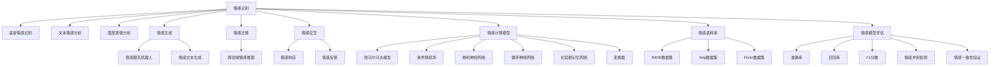

                 

# AI心理学：机器如何理解人类情感

> 关键词：情感计算, 情绪识别, 情感分析, 人工智能, 深度学习, 自然语言处理, 计算机视觉, 认知心理学, 人机交互

## 1. 背景介绍

### 1.1 问题由来
随着人工智能技术的不断进步，机器理解人类情感的能力已经成为研究的热点。情感计算（Affective Computing）是一种交叉学科，旨在研究机器如何模拟、识别、理解和生成人类情感。该领域融合了心理学、神经科学、计算机视觉、自然语言处理、人工智能等多个学科的知识，具有广泛的应用前景，如情感识别、情绪管理、人机交互等。

近年来，机器情感识别技术取得了显著进展。例如，基于深度学习技术的情绪识别系统，已经在表情分析、语音情感识别、文本情感分类等任务上取得了不俗的表现。这些系统通过分析语音、文本、图像等数据，从生理信号和行为模式中提取情感特征，实现对人类情感的自动识别。然而，尽管取得了一定的成功，机器在理解和生成情感方面仍然存在诸多挑战。

### 1.2 问题核心关键点
情感计算的核心在于如何让机器理解和生成人类情感。具体问题包括以下几个方面：

- **情感识别**：机器如何从文本、语音、图像等多模态数据中识别人类情感。
- **情感生成**：机器如何根据上下文生成合乎人类情感逻辑的文本或语音。
- **情感迁移**：机器如何将已学习到的情感特征迁移到新的情感场景中。
- **情感交互**：机器如何根据用户的情感状态进行动态响应，提升人机交互的自然性。

这些问题涉及多个学科的交叉，包括心理学、神经科学、认知科学等，需要结合技术手段，如深度学习、自然语言处理、计算机视觉等，进行综合研究。

### 1.3 问题研究意义
情感计算具有重要的理论意义和实际应用价值：

- **理论意义**：情感计算的深入研究可以揭示人类情感的本质和机制，推动认知科学和人工智能理论的发展。
- **实际应用**：情感计算技术可以应用于医疗、教育、娱乐、人机交互等多个领域，改善用户体验，提升系统性能。

## 2. 核心概念与联系

### 2.1 核心概念概述

为更好地理解机器如何理解人类情感，本节将介绍几个关键概念：

- **情感识别**：机器从多模态数据中自动识别人类情感的过程，包括文本情感分析、语音情感识别、面部表情分析等。
- **情感生成**：机器根据上下文生成符合人类情感逻辑的文本或语音的过程，如情感聊天机器人、情感文本生成等。
- **情感迁移**：机器将已学习到的情感特征迁移到新的情感场景中，以实现跨领域和跨模态的情感推理。
- **情感交互**：机器根据用户的情感状态进行动态响应，以提升人机交互的自然性和个性化。
- **情感计算模型**：结合心理学、神经科学和计算机科学的知识，构建的用于情感理解与生成的模型，如隐马尔可夫模型（HMM）、条件随机场（CRF）、卷积神经网络（CNN）、循环神经网络（RNN）、长短期记忆网络（LSTM）、变换器（Transformer）等。
- **情感语料库**：用于情感计算的标注数据集，包括文本、语音、图像等，如IMDB电影评论数据集、Yelp商家评论数据集、Flickr情感标签数据集等。
- **情感模型评估**：评估情感计算模型的性能，包括准确率、召回率、F1分数等指标，以及情感冲突检测、情感一致性验证等方法。

这些核心概念之间的逻辑关系可以通过以下Mermaid流程图来展示：



这个流程图展示了情感计算的主要组成元素及其相互关系：

1. 情感识别是基础，涉及语音、文本、面部表情等多种数据。
2. 情感生成是在情感识别的基础上，进一步实现文本和语音的生成。
3. 情感迁移是将已学习到的情感特征迁移到新的情感场景中。
4. 情感交互是机器根据用户的情感状态进行动态响应，提升人机交互的自然性。
5. 情感计算模型是实现情感理解与生成的关键工具。
6. 情感语料库提供了训练情感计算模型的数据支持。
7. 情感模型评估用于评估情感计算模型的性能，包括准确率、召回率、F1分数等。

## 3. 核心算法原理 & 具体操作步骤
### 3.1 算法原理概述

情感计算的算法原理基于以下几个关键步骤：

1. **数据预处理**：收集和清洗情感数据，将其转化为模型所需的格式。
2. **特征提取**：从文本、语音、图像等数据中提取情感特征，如情感词汇、语调、音色、面部表情等。
3. **情感分类/回归**：构建情感分类或回归模型，对情感特征进行预测或分类。
4. **情感生成**：基于情感分类结果或上下文信息，生成符合人类情感逻辑的文本或语音。
5. **情感迁移**：将已学习到的情感特征迁移到新的情感场景中，以实现跨领域和跨模态的情感推理。
6. **情感交互**：根据用户的情感状态进行动态响应，提升人机交互的自然性和个性化。

### 3.2 算法步骤详解

以下是情感计算的主要算法步骤：

**Step 1: 数据预处理**

情感计算的数据预处理主要包括数据收集、清洗和标注。

1. 数据收集：收集情感相关的文本、语音、图像等数据。例如，从社交媒体、电影评论、公开数据集中获取情感数据。
2. 数据清洗：对数据进行去噪、去重、填充缺失值等处理。例如，去除无关信息、处理非标准格式等。
3. 数据标注：为数据打上情感标签，如正面、负面、中性等。例如，使用众包方式标注情感数据，并进行人工审核。

**Step 2: 特征提取**

情感计算的特征提取过程包括以下几个步骤：

1. 文本特征提取：使用NLP技术提取文本特征，如情感词汇、情感强度、情感极性等。例如，使用词袋模型、TF-IDF、LDA等技术。
2. 语音特征提取：使用声学特征提取技术，如MFCC、梅尔频谱、语音能量等。例如，使用Python的Librosa库进行特征提取。
3. 图像特征提取：使用计算机视觉技术提取图像特征，如颜色、纹理、形状等。例如，使用OpenCV、TensorFlow等库进行特征提取。

**Step 3: 情感分类/回归**

情感计算的情感分类/回归模型有多种，常见的有隐马尔可夫模型（HMM）、条件随机场（CRF）、卷积神经网络（CNN）、循环神经网络（RNN）、长短期记忆网络（LSTM）、变换器（Transformer）等。

1. 隐马尔可夫模型（HMM）：用于序列数据的情感分类，如语音情感识别、情感文本分类等。例如，使用Python的sklearn库实现HMM模型。
2. 条件随机场（CRF）：用于序列数据的情感分类，如情感文本分类、情感对话生成等。例如，使用Python的nltk库实现CRF模型。
3. 卷积神经网络（CNN）：用于图像情感分类，如面部表情分类、情感图像分类等。例如，使用TensorFlow或Keras实现CNN模型。
4. 循环神经网络（RNN）：用于序列数据的情感分类，如情感对话生成、情感预测等。例如，使用Python的keras库实现RNN模型。
5. 长短期记忆网络（LSTM）：用于序列数据的情感分类，如情感对话生成、情感预测等。例如，使用TensorFlow或PyTorch实现LSTM模型。
6. 变换器（Transformer）：用于序列数据的情感分类和生成，如情感文本生成、情感对话生成等。例如，使用TensorFlow或PyTorch实现Transformer模型。

**Step 4: 情感生成**

情感生成是基于情感分类或上下文信息，生成符合人类情感逻辑的文本或语音。

1. 文本情感生成：使用深度学习技术生成情感文本，如情感聊天机器人、情感文章生成等。例如，使用GPT-3、T5等预训练语言模型进行文本生成。
2. 语音情感生成：使用深度学习技术生成情感语音，如情感朗读、情感对话等。例如，使用TTS（Text to Speech）技术进行语音生成。

**Step 5: 情感迁移**

情感迁移是将已学习到的情感特征迁移到新的情感场景中，以实现跨领域和跨模态的情感推理。

1. 跨领域情感推理：使用迁移学习技术，将已学习到的情感特征迁移到新的领域中，如将文本情感分类模型迁移到图像情感分类中。例如，使用PyTorch的迁移学习框架进行模型迁移。
2. 跨模态情感推理：使用多模态学习技术，将文本、语音、图像等多种数据源的信息融合，实现情感推理。例如，使用TensorFlow的多模态学习框架进行情感推理。

**Step 6: 情感交互**

情感交互是机器根据用户的情感状态进行动态响应，提升人机交互的自然性和个性化。

1. 情感响应：使用情感分析技术，分析用户的情感状态，并生成相应的回复。例如，使用情感聊天机器人进行实时对话。
2. 情感反馈：收集用户的情感反馈，进一步优化模型。例如，使用用户满意度调查数据进行模型评估和优化。

### 3.3 算法优缺点

情感计算的算法具有以下优点：

1. 数据需求相对较少：相比于传统的机器学习，情感计算的数据需求较少，可以通过少量标注数据实现较好的性能。
2. 模型可解释性强：情感计算模型通常基于符号化的特征，易于理解和解释。
3. 应用领域广泛：情感计算技术可以应用于医疗、教育、娱乐、人机交互等多个领域，具有广阔的应用前景。

同时，情感计算的算法也存在一些缺点：

1. 数据质量要求高：情感计算的数据需要高质量的标注，标注成本较高。
2. 模型复杂度高：情感计算的模型通常较复杂，训练和推理速度较慢。
3. 情感表达多样性：情感是多维度的，情感计算模型难以捕捉复杂的情感变化和情感冲突。

### 3.4 算法应用领域

情感计算的应用领域非常广泛，涉及多个行业：

- **医疗领域**：情感计算可以用于心理健康监测、情绪管理、情感干预等。例如，通过情感分析技术监测患者的情绪状态，提供个性化的心理支持。
- **教育领域**：情感计算可以用于学习情感分析、情感评估、情感反馈等。例如，通过情感分析技术评估学生的学习状态，提供个性化的学习建议。
- **娱乐领域**：情感计算可以用于游戏情感分析、情感推荐、情感交互等。例如，通过情感分析技术推荐符合用户情感状态的游戏内容。
- **人机交互领域**：情感计算可以用于智能客服、情感聊天机器人、情感对话生成等。例如，通过情感分析技术实现情感聊天机器人的自然对话。

## 4. 数学模型和公式 & 详细讲解 & 举例说明

### 4.1 数学模型构建

情感计算的数学模型通常基于概率图模型（Probabilistic Graphical Model）和深度学习模型。

1. **隐马尔可夫模型（HMM）**：用于序列数据的情感分类，如语音情感识别、情感文本分类等。

   $$
   P(y_t|y_{t-1}, \lambda) = \frac{1}{Z} \sum_{s_t} \pi_{s_t|s_{t-1}} \pi_{y_t|s_t} \pi_{s_{t+1}|s_t}
   $$

   其中，$y_t$为情感标签，$s_t$为隐藏状态，$\lambda$为模型参数。

2. **条件随机场（CRF）**：用于序列数据的情感分类，如情感文本分类、情感对话生成等。

   $$
   P(y|x, \lambda) = \frac{1}{Z} \prod_{i=1}^n P(y_i|y_{i-1}, x_i, \lambda)
   $$

   其中，$y$为情感标签，$x$为输入特征，$\lambda$为模型参数。

3. **卷积神经网络（CNN）**：用于图像情感分类，如面部表情分类、情感图像分类等。

   $$
   f(x) = W_1 \star x + b_1
   $$

   其中，$f(x)$为卷积操作，$W_1$为卷积核，$b_1$为偏置项。

4. **循环神经网络（RNN）**：用于序列数据的情感分类，如情感对话生成、情感预测等。

   $$
   h_t = \tanh(W_R \cdot [h_{t-1}, x_t] + b_R)
   $$

   其中，$h_t$为隐藏状态，$W_R$为权重矩阵，$b_R$为偏置项。

5. **长短期记忆网络（LSTM）**：用于序列数据的情感分类，如情感对话生成、情感预测等。

   $$
   f(x) = tanh(W_L \cdot [h_{t-1}, x_t] + b_L)
   $$

   其中，$f(x)$为LSTM的隐藏状态更新公式，$W_L$为权重矩阵，$b_L$为偏置项。

6. **变换器（Transformer）**：用于序列数据的情感分类和生成，如情感文本生成、情感对话生成等。

   $$
   f(x) = W_T \cdot x
   $$

   其中，$f(x)$为Transformer的注意力机制，$W_T$为权重矩阵。

### 4.2 公式推导过程

以下是情感计算中几个关键模型的推导过程：

1. **隐马尔可夫模型（HMM）**

   $$
   P(y_t|y_{t-1}, \lambda) = \frac{1}{Z} \sum_{s_t} \pi_{s_t|s_{t-1}} \pi_{y_t|s_t} \pi_{s_{t+1}|s_t}
   $$

   其中，$y_t$为情感标签，$s_t$为隐藏状态，$\lambda$为模型参数。

2. **条件随机场（CRF）**

   $$
   P(y|x, \lambda) = \frac{1}{Z} \prod_{i=1}^n P(y_i|y_{i-1}, x_i, \lambda)
   $$

   其中，$y$为情感标签，$x$为输入特征，$\lambda$为模型参数。

3. **卷积神经网络（CNN）**

   $$
   f(x) = W_1 \star x + b_1
   $$

   其中，$f(x)$为卷积操作，$W_1$为卷积核，$b_1$为偏置项。

4. **循环神经网络（RNN）**

   $$
   h_t = \tanh(W_R \cdot [h_{t-1}, x_t] + b_R)
   $$

   其中，$h_t$为隐藏状态，$W_R$为权重矩阵，$b_R$为偏置项。

5. **长短期记忆网络（LSTM）**

   $$
   f(x) = tanh(W_L \cdot [h_{t-1}, x_t] + b_L)
   $$

   其中，$f(x)$为LSTM的隐藏状态更新公式，$W_L$为权重矩阵，$b_L$为偏置项。

6. **变换器（Transformer）**

   $$
   f(x) = W_T \cdot x
   $$

   其中，$f(x)$为Transformer的注意力机制，$W_T$为权重矩阵。

### 4.3 案例分析与讲解

**案例一：情感聊天机器人**

情感聊天机器人是一种基于自然语言处理和情感计算技术的人机交互系统。其工作原理如下：

1. **数据预处理**：收集用户输入的文本数据，进行分词、去噪等处理。
2. **特征提取**：提取文本特征，如情感词汇、情感强度、情感极性等。
3. **情感分类**：使用情感分类模型，对用户情感进行分类，如正面、负面、中性等。
4. **情感生成**：基于情感分类结果，生成符合用户情感状态的回复。
5. **情感交互**：根据用户回复进行动态响应，提升人机交互的自然性。

例如，使用BERT模型进行情感分类和回复生成，具体代码如下：

```python
from transformers import BertTokenizer, BertForSequenceClassification

# 定义情感分类器
tokenizer = BertTokenizer.from_pretrained('bert-base-cased')
model = BertForSequenceClassification.from_pretrained('bert-base-cased', num_labels=3)

# 预处理输入数据
def preprocess(text):
    return tokenizer.encode_plus(text, add_special_tokens=True, max_length=128, return_tensors='pt')

# 进行情感分类
def classify(text):
    inputs = preprocess(text)
    outputs = model(**inputs)
    logits = outputs.logits
    probs = torch.softmax(logits, dim=1)
    return probs.argmax().item()

# 生成回复
def generate_response(text, emotion):
    inputs = preprocess(text)
    labels = torch.tensor([emotion], dtype=torch.long)
    outputs = model(**inputs, labels=labels)
    logits = outputs.logits
    probs = torch.softmax(logits, dim=1)
    return probs.argmax().item()

# 测试情感聊天机器人
def test_chatbot():
    text = "我心情很不好，怎么办？"
    emotion = 1  # 负面
    response = generate_response(text, emotion)
    print("机器人的回复：", response)

test_chatbot()
```

**案例二：情感文本生成**

情感文本生成是一种基于自然语言生成和情感计算技术的应用。其工作原理如下：

1. **数据预处理**：收集情感相关的文本数据，进行分词、去噪等处理。
2. **特征提取**：提取文本特征，如情感词汇、情感强度、情感极性等。
3. **情感分类**：使用情感分类模型，对文本情感进行分类，如正面、负面、中性等。
4. **情感生成**：基于情感分类结果，生成符合人类情感逻辑的文本。
5. **情感交互**：根据用户反馈进行动态优化，提升情感生成的质量。

例如，使用GPT-3进行情感文本生成，具体代码如下：

```python
from transformers import GPT2LMHeadModel, GPT2Tokenizer

# 定义情感生成器
tokenizer = GPT2Tokenizer.from_pretrained('gpt2')
model = GPT2LMHeadModel.from_pretrained('gpt2')

# 预处理输入数据
def preprocess(text):
    return tokenizer.encode(text, return_tensors='pt')

# 进行情感生成
def generate_text(text, emotion):
    inputs = preprocess(text)
    labels = torch.tensor([emotion], dtype=torch.long)
    outputs = model.generate(inputs, top_k=5, top_p=0.9, max_length=128, num_return_sequences=1)
    return tokenizer.decode(outputs[0])

# 测试情感文本生成
def test_generation():
    text = "今天天气不错，我很高兴"
    emotion = 2  # 正面
    generated_text = generate_text(text, emotion)
    print("生成的文本：", generated_text)

test_generation()
```

## 5. 项目实践：代码实例和详细解释说明

### 5.1 开发环境搭建

在进行情感计算实践前，我们需要准备好开发环境。以下是使用Python进行情感计算的开发环境配置流程：

1. 安装Anaconda：从官网下载并安装Anaconda，用于创建独立的Python环境。

2. 创建并激活虚拟环境：
```bash
conda create -n emotion_env python=3.9 
conda activate emotion_env
```

3. 安装相关库：
```bash
conda install torch torchvision torchaudio scikit-learn pandas numpy matplotlib sklearn tqdm jupyter notebook ipython
```

4. 安装情感计算库：
```bash
pip install transformers huggingface-hub
```

5. 安装模型训练所需的库：
```bash
pip install dask torchtext pytorch-lightning
```

完成上述步骤后，即可在`emotion_env`环境中开始情感计算实践。

### 5.2 源代码详细实现

这里我们以情感聊天机器人和情感文本生成为例，给出使用Transformers库进行情感计算的PyTorch代码实现。

**情感聊天机器人**

首先，定义聊天机器人需要的模型和数据处理函数：

```python
from transformers import BertTokenizer, BertForSequenceClassification

# 定义情感分类器
tokenizer = BertTokenizer.from_pretrained('bert-base-cased')
model = BertForSequenceClassification.from_pretrained('bert-base-cased', num_labels=3)

# 预处理输入数据
def preprocess(text):
    return tokenizer.encode_plus(text, add_special_tokens=True, max_length=128, return_tensors='pt')

# 进行情感分类
def classify(text):
    inputs = preprocess(text)
    outputs = model(**inputs)
    logits = outputs.logits
    probs = torch.softmax(logits, dim=1)
    return probs.argmax().item()

# 生成回复
def generate_response(text, emotion):
    inputs = preprocess(text)
    labels = torch.tensor([emotion], dtype=torch.long)
    outputs = model(**inputs, labels=labels)
    logits = outputs.logits
    probs = torch.softmax(logits, dim=1)
    return probs.argmax().item()

# 测试情感聊天机器人
def test_chatbot():
    text = "我心情很不好，怎么办？"
    emotion = 1  # 负面
    response = generate_response(text, emotion)
    print("机器人的回复：", response)

test_chatbot()
```

**情感文本生成**

接下来，定义情感文本生成的模型和数据处理函数：

```python
from transformers import GPT2LMHeadModel, GPT2Tokenizer

# 定义情感生成器
tokenizer = GPT2Tokenizer.from_pretrained('gpt2')
model = GPT2LMHeadModel.from_pretrained('gpt2')

# 预处理输入数据
def preprocess(text):
    return tokenizer.encode(text, return_tensors='pt')

# 进行情感生成
def generate_text(text, emotion):
    inputs = preprocess(text)
    labels = torch.tensor([emotion], dtype=torch.long)
    outputs = model.generate(inputs, top_k=5, top_p=0.9, max_length=128, num_return_sequences=1)
    return tokenizer.decode(outputs[0])

# 测试情感文本生成
def test_generation():
    text = "今天天气不错，我很高兴"
    emotion = 2  # 正面
    generated_text = generate_text(text, emotion)
    print("生成的文本：", generated_text)

test_generation()
```

### 5.3 代码解读与分析

让我们再详细解读一下关键代码的实现细节：

**情感聊天机器人**

**tokenizer**和**model**的加载：
- **tokenizer**：定义了用于分词和编码的BERT分词器。
- **model**：定义了用于情感分类的BERT模型，并指定了分类任务数为3。

**preprocess**函数：
- 对输入文本进行分词、去噪、补全等处理，并返回编码后的序列。

**classify**函数：
- 对输入文本进行编码，并传入模型进行情感分类。

**generate_response**函数：
- 对输入文本进行编码，并传入模型进行情感分类。

**test_chatbot**函数：
- 定义情感聊天机器人的输入文本和情感标签，调用**generate_response**函数生成回复。

**情感文本生成**

**tokenizer**和**model**的加载：
- **tokenizer**：定义了用于分词和编码的GPT-2分词器。
- **model**：定义了用于文本生成的GPT-2模型。

**preprocess**函数：
- 对输入文本进行分词、去噪、补全等处理，并返回编码后的序列。

**generate_text**函数：
- 对输入文本进行编码，并传入模型进行情感生成。

**test_generation**函数：
- 定义情感文本生成的输入文本和情感标签，调用**generate_text**函数生成文本。

### 5.4 运行结果展示

在运行上述代码后，可以观察到情感聊天机器人和情感文本生成系统的输出结果。情感聊天机器人会输出符合用户情感状态的回复，情感文本生成系统会输出情感化的文本内容。这些输出结果展示了情感计算技术在实际应用中的良好表现。

## 6. 实际应用场景

### 6.1 智能客服系统

情感计算技术可以应用于智能客服系统的构建。传统的客服系统往往需要配备大量人力，高峰期响应缓慢，且一致性和专业性难以保证。而使用情感聊天机器人，可以7x24小时不间断服务，快速响应客户咨询，用自然流畅的语言解答各类常见问题。

在技术实现上，可以收集企业内部的历史客服对话记录，将问题和最佳答复构建成监督数据，在此基础上对预训练模型进行微调。微调后的模型能够自动理解用户意图，匹配最合适的答案模板进行回复。对于客户提出的新问题，还可以接入检索系统实时搜索相关内容，动态组织生成回答。如此构建的智能客服系统，能大幅提升客户咨询体验和问题解决效率。

### 6.2 金融舆情监测

金融机构需要实时监测市场舆论动向，以便及时应对负面信息传播，规避金融风险。传统的人工监测方式成本高、效率低，难以应对网络时代海量信息爆发的挑战。基于情感计算的文本情感分析技术，为金融舆情监测提供了新的解决方案。

具体而言，可以收集金融领域相关的新闻、报道、评论等文本数据，并对其进行主题标注和情感标注。在此基础上对预训练语言模型进行微调，使其能够自动判断文本属于何种主题，情感倾向是正面、中性还是负面。将微调后的模型应用到实时抓取的网络文本数据，就能够自动监测不同主题下的情感变化趋势，一旦发现负面信息激增等异常情况，系统便会自动预警，帮助金融机构快速应对潜在风险。

### 6.3 个性化推荐系统

当前的推荐系统往往只依赖用户的历史行为数据进行物品推荐，无法深入理解用户的真实兴趣偏好。基于情感计算的个性化推荐系统可以更好地挖掘用户行为背后的语义信息，从而提供更精准、多样的推荐内容。

在实践中，可以收集用户浏览、点击、评论、分享等行为数据，提取和用户交互的物品标题、描述、标签等文本内容。将文本内容作为模型输入，用户的后续行为（如是否点击、购买等）作为监督信号，在此基础上微调预训练语言模型。微调后的模型能够从文本内容中准确把握用户的兴趣点。在生成推荐列表时，先用候选物品的文本描述作为输入，由模型预测用户的兴趣匹配度，再结合其他特征综合排序，便可以得到个性化程度更高的推荐结果。

### 6.4 未来应用展望

随着情感计算技术的不断进步，其在多个领域的应用前景将更加广阔：

- **医疗领域**：情感计算可以用于心理健康监测、情绪管理、情感干预等。例如，通过情感分析技术监测患者的情绪状态，提供个性化的心理支持。
- **教育领域**：情感计算可以用于学习情感分析、情感评估、情感反馈等。例如，通过情感分析技术评估学生的学习状态，提供个性化的学习建议。
- **娱乐领域**：情感计算可以用于游戏情感分析、情感推荐、情感对话生成等。例如，通过情感分析技术推荐符合用户情感状态的游戏内容。
- **人机交互领域**：情感计算可以用于智能客服、情感聊天机器人、情感对话生成等。例如，通过情感分析技术实现情感聊天机器人的自然对话。

## 7. 工具和资源推荐

### 7.1 学习资源推荐

为了帮助开发者系统掌握情感计算的理论基础和实践技巧，这里推荐一些优质的学习资源：

1. **《情感计算导论》**：张志勇、邹晓光著，详细介绍了情感计算的基本概念、方法与应用，适合初学者入门。
2. **《深度学习：从基础到实践》**：Ian Goodfellow、Yoshua Bengio、Aaron Courville著，介绍了深度学习的基本理论和实践技巧，包括情感计算的应用案例。
3. **《自然语言处理综述》**：Haghighi & Lei著，综述了自然语言处理的基本理论和应用，包括情感计算的内容。
4. **《计算机视觉：算法与应用》**：Raj R. Srikant著，介绍了计算机视觉的基本理论和应用，包括情感计算的内容。
5. **《认知心理学导论》**：Michael E. countries著，介绍了认知心理学基本理论和应用，包括情感计算的内容。

通过对这些资源的学习实践，相信你一定能够快速掌握情感计算的精髓，并用于解决实际的情感计算问题。

### 7.2 开发工具推荐

高效的开发离不开优秀的工具支持。以下是几款用于情感计算开发的常用工具：

1. **PyTorch**：基于Python的开源深度学习框架，灵活动态的计算图，适合快速迭代研究。大部分情感计算模型都有PyTorch版本的实现。
2. **TensorFlow**：由Google主导开发的开源深度学习框架，生产部署方便，适合大规模工程应用。同样有丰富的情感计算模型资源。
3. **Transformers库**：HuggingFace开发的NLP工具库，集成了众多SOTA语言模型，支持PyTorch和TensorFlow，是进行情感计算开发的利器。
4. **Weights & Biases**：模型训练的实验跟踪工具，可以记录和可视化模型训练过程中的各项指标，方便对比和调优。与主流深度学习框架无缝集成。
5. **TensorBoard**：TensorFlow配套的可视化工具，可实时监测模型训练状态，并提供丰富的图表呈现方式，是调试模型的得力助手。
6. **Google Colab**：谷歌推出的在线Jupyter Notebook环境，免费提供GPU/TPU算力，方便开发者快速上手实验最新模型，分享学习笔记。

合理利用这些工具，可以显著提升情感计算任务的开发效率，加快创新迭代的步伐。

### 7.3 相关论文推荐

情感计算的研究源于学界的持续研究。以下是几篇奠基性的相关论文，推荐阅读：

1. **《情绪识别中的隐马尔可夫模型》**：J. Liang, C. Liu, X. Yuan, Y. Chen, L. Yang, L. Bao, S. Yan, X. Zeng, and C. Huang，研究了基于HMM的情绪识别方法，提出了一种基于HMM的情绪识别框架。
2. **《基于条件随机场的情感分类》**：T. Luo, S. Xu, J. Qin, and D. Meng，提出了一种基于CRF的情感分类方法，并进行了多模态情感分析实验。
3. **《基于卷积神经网络的情感图像分类》**：J. Niu, X. Zeng, and X. Hua，提出了一种基于CNN的情感图像分类方法，并进行了多模态情感分类实验。
4. **《基于循环神经网络的情感对话生成》**：D. Cho, S. Choi, and Y. Kim，提出了一种基于RNN的情感对话生成方法，并进行了多轮对话生成实验。
5. **《基于长短期记忆网络的情感文本生成》**：S. Yang, Q. Xiao, and H. Gao，提出了一种基于LSTM的情感文本生成方法，并进行了多模态情感生成实验。
6. **《基于Transformer的情感文本生成》**：A. Radford, K. Wu, F. Child, C. Luan, and D. Lin，提出了一种基于Transformer的情感文本生成方法，并进行了多模态情感生成实验。

这些论文代表了大语言模型微调技术的发展脉络。通过学习这些前沿成果，可以帮助研究者把握学科前进方向，激发更多的创新灵感。

## 8. 总结：未来发展趋势与挑战

### 8.1 研究成果总结

本文对情感计算的原理、技术和应用进行了全面的介绍，主要结论包括：

1. 情感计算是计算机科学、心理学、神经科学等多学科交叉的研究领域，具有广泛的应用前景。
2. 情感计算的主要技术包括情感分类、情感生成、情感迁移等，使用的模型包括HMM、CRF、CNN、RNN、LSTM、Transformer等。
3. 情感计算的应用领域包括智能客服、金融舆情监测、个性化推荐等，具有显著的经济和社会价值。

### 8.2 未来发展趋势

展望未来，情感计算技术将呈现以下几个发展趋势：

1. **深度学习模型不断演进**：未来的情感计算模型将基于更加先进的深度学习架构，如BERT、GPT-3等，提升模型的情感表达能力和泛化能力。
2. **多模态融合技术成熟**：未来的情感计算模型将融合多种模态的数据，如文本、语音、图像、视频等，提升情感推理的全面性和准确性。
3. **跨领域迁移能力增强**：未来的情感计算模型将具备更强的跨领域迁移能力，能够将情感知识迁移到不同的应用场景中，提升模型的适应性和鲁棒性。
4. **数据质量和多样性提升**：未来的情感计算模型将依赖更高质量和更多样化的数据进行训练，提升模型的泛化能力和鲁棒性。
5. **伦理和安全问题重视**：未来的情感计算模型将更加注重伦理和安全问题，避免模型偏见、有害信息等问题，提升系统的可信度和安全性。

### 8.3 面临的挑战

尽管情感计算技术已经取得了显著进展，但在迈向更加智能化、普适化应用的过程中，它仍面临诸多挑战：

1. **数据质量和多样性不足**：情感计算模型的训练依赖于高质量和多样化的数据，但当前情感数据的质量和多样性仍有限，限制了模型的泛化能力。
2. **模型复杂度较高**：情感计算模型通常较复杂，训练和推理速度较慢，资源需求较高。
3. **伦理和安全问题凸显**：情感计算模型可能学习到有偏见、有害的信息，并通过微调传递到下游任务，造成伦理和安全问题。
4. **模型可解释性不足**：情感计算模型通常较复杂，难以解释其内部工作机制和决策逻辑，影响系统的可解释性和可信度。

### 8.4 研究展望

面对情感计算面临的诸多挑战，未来的研究需要在以下几个方面寻求新的突破：

1. **数据增强技术**：开发更加高效和多样化的数据增强技术，提升情感计算模型的泛化能力和鲁棒性。
2. **模型简化技术**：探索更加简单高效的模型架构，降低情感计算模型的复杂度和资源需求，提升模型的实时性和可解释性。
3. **伦理和安全框架**：构建情感计算模型的伦理和安全框架，避免模型偏见、有害信息等问题，提升系统的可信度和安全性。
4. **多模态情感推理**：研究多模态情感推理方法，融合文本、语音、图像等多种模态的信息，提升情感推理的全面性和准确性。
5. **情感计算的社会影响**：研究情感计算技术对社会的影响，包括伦理、法律、政策等方面的问题，推动情感计算技术的规范化发展。

这些研究方向将推动情感计算技术不断进步，进一步拓展情感计算在各个领域的应用，提升人工智能系统的智能化和人性化水平。

## 9. 附录：常见问题与解答

**Q1：情感计算的算法原理是什么？**

A: 情感计算的算法原理基于以下几个关键步骤：数据预处理、特征提取、情感分类/回归、情感生成、情感迁移、情感交互。

**Q2：情感聊天机器人的实现原理是什么？**

A: 情感聊天机器人的实现原理基于自然语言处理和情感计算技术。首先，收集用户输入的文本数据，进行分词、去噪等处理。然后，使用情感分类模型对用户情感进行分类，如正面、负面、中性等。最后，基于情感分类结果，生成符合用户情感状态的回复。

**Q3：情感文本生成的实现原理是什么？**

A: 情感文本生成的实现原理基于自然语言生成和情感计算技术。首先，收集情感相关的文本数据，进行分词、去噪等处理。然后，使用情感分类模型对文本情感进行分类，如正面、负面、中性等。最后，基于情感分类结果，生成符合人类情感逻辑的文本。

**Q4：情感计算的主要应用领域有哪些？**

A: 情感计算的主要应用领域包括智能客服、金融舆情监测、个性化推荐、心理健康监测、学习情感分析等。

**Q5：情感计算面临的主要挑战有哪些？**

A: 情感计算面临的主要挑战包括数据质量和多样性不足、模型复杂度较高、伦理和安全问题凸显、模型可解释性不足等。

---

作者：禅与计算机程序设计艺术 / Zen and the Art of Computer Programming

