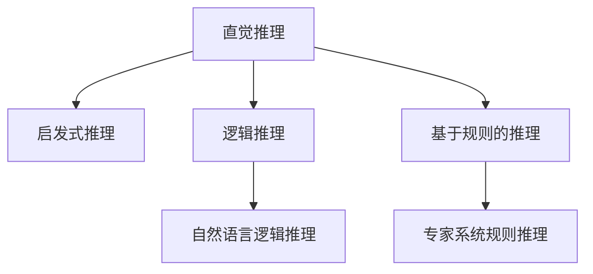

                 

# AI推理能力的认知基础:直觉推理和启发式推理

> 关键词：人工智能(AI)，推理能力，认知基础，直觉推理，启发式推理

## 1. 背景介绍

### 1.1 问题由来

推理能力是人工智能（AI）的核心能力之一，它使得机器能够理解和应用知识，解决复杂问题，做出合理决策。在近年来的人工智能研究中，直觉推理和启发式推理作为两种重要的推理方法，因其高效性和灵活性而备受关注。

直觉推理通常指基于直观经验和感觉的推理，不依赖严格的逻辑和规则。而启发式推理则是指在特定任务和环境下，通过逐步缩小搜索空间、试错、近似等手段，快速找到解决方案。两者共同构成了AI推理能力的认知基础。

### 1.2 问题核心关键点

直觉推理和启发式推理作为AI推理能力的重要组成部分，其核心关键点在于：

- **高效性**：直觉和启发式推理可以在没有详细规则和逻辑的情况下，快速做出决策，这在处理大规模复杂问题时尤为关键。
- **灵活性**：这些方法可以根据实际情况动态调整，适应不同的任务需求。
- **人机协同**：直觉和启发式推理能够补充正式逻辑和规则的缺陷，提高系统的整体性能。

这些关键点共同推动了AI推理能力的发展，使其在自然语言处理、计算机视觉、智能推荐、游戏AI等领域得到了广泛应用。

### 1.3 问题研究意义

研究直觉推理和启发式推理对于构建高效、灵活、可解释的AI系统具有重要意义：

1. **提升AI系统性能**：通过结合直觉和启发式推理，AI系统可以在更短的时间内处理更复杂的问题，提高整体性能。
2. **增强系统可解释性**：直觉和启发式推理为AI决策提供了更直观的解释，有助于理解和信任AI系统。
3. **促进人机协同**：这些方法使AI系统能够更好地与人类协同工作，提高工作效率和用户体验。
4. **推动AI伦理和安全**：通过更透明、可解释的推理过程，可以减少AI系统的偏见和滥用风险。

## 2. 核心概念与联系

### 2.1 核心概念概述

为了更好地理解直觉推理和启发式推理，我们首先介绍几个密切相关的核心概念：

- **直觉推理**：基于直观经验和感觉的推理方法，不依赖严格的逻辑和规则。例如，经验丰富的医生能够快速诊断病情，而不需要详细的诊断标准。
- **启发式推理**：在特定任务和环境下，通过逐步缩小搜索空间、试错、近似等手段，快速找到解决方案。例如，在迷宫中找到出口，通过不断尝试不同的路径，最终找到最短的解决方案。
- **逻辑推理**：基于形式化逻辑规则的推理方法，例如数学证明、自然语言逻辑推理等。其特点是严谨、可解释，但在处理复杂问题时可能效率较低。
- **基于规则的推理**：根据预定义的规则库进行推理，例如专家系统中的规则推理。其优点是可解释性强，但规则库的构建和维护成本较高。

这些概念之间的关系可以通过以下Mermaid流程图来展示：



这个流程图展示了几类推理方法之间的逻辑关系：

1. 直觉推理和启发式推理通常与逻辑推理和基于规则的推理相互补充，共同构成AI推理能力的基础。
2. 直觉推理通常基于经验和感觉，而启发式推理则依赖于逐步缩小搜索空间和试错机制。
3. 逻辑推理和基于规则的推理则依赖于严格的形式化规则和标准。

## 3. 核心算法原理 & 具体操作步骤

### 3.1 算法原理概述

直觉推理和启发式推理的算法原理主要涉及以下几个方面：

1. **直观经验**：直觉推理依赖于个体的经验和感觉，通过直觉判断和决策。
2. **启发式搜索**：启发式推理通过逐步缩小搜索空间，快速找到解决方案。
3. **试错学习**：启发式推理中的试错机制，使得系统能够从错误中学习，不断优化解法。
4. **知识表示**：通过符号化、概率化等方法，将知识表示为可计算的形式，方便推理过程的执行。
5. **结果评估**：通过评估机制，对推理结果进行验证和优化。

这些原理共同构成了直觉推理和启发式推理的核心框架，使得AI系统能够高效、灵活地处理复杂问题。

### 3.2 算法步骤详解

基于直觉推理和启发式推理的AI推理系统，一般包括以下几个关键步骤：

**Step 1: 数据准备**

- 收集和整理相关数据，确保数据的质量和多样性。
- 对数据进行预处理，包括清洗、标注、特征提取等。

**Step 2: 模型选择**

- 根据任务需求选择合适的直觉或启发式推理模型。
- 设计或选择适当的知识表示方法，如符号化表示、概率模型等。

**Step 3: 推理过程**

- 将任务定义和相关知识输入到推理模型中。
- 根据模型的推理机制，逐步执行推理过程。
- 在推理过程中，根据实际情况动态调整策略，优化推理结果。

**Step 4: 结果评估**

- 对推理结果进行评估，确保其正确性和合理性。
- 根据评估结果，调整推理过程，优化模型参数。

**Step 5: 迭代优化**

- 不断迭代推理过程，根据新数据和新任务，更新模型和推理策略。

### 3.3 算法优缺点

直觉推理和启发式推理具有以下优点：

1. **高效性**：在处理复杂问题时，直觉和启发式推理能够快速找到解决方案，减少计算和资源消耗。
2. **灵活性**：这些方法能够根据实际情况动态调整，适应不同的任务需求。
3. **可解释性**：直觉和启发式推理为决策提供了直观的解释，有助于理解和信任AI系统。

同时，这些方法也存在一些局限性：

1. **依赖于经验和知识**：直觉和启发式推理的效果很大程度上依赖于经验和知识的质量，难以在完全未知领域发挥作用。
2. **缺乏形式化规则**：这些方法缺乏严格的逻辑和规则，可能导致结果的不确定性和偏差。
3. **易受环境变化影响**：在环境变化较大的情况下，直觉和启发式推理的性能可能受到影响。

尽管存在这些局限性，但就目前而言，直觉推理和启发式推理仍是AI推理能力的重要组成部分，广泛应用于自然语言处理、计算机视觉、智能推荐等领域。

### 3.4 算法应用领域

直觉推理和启发式推理已经在诸多AI应用领域得到了广泛应用，例如：

- **自然语言处理**：在问答系统、机器翻译、文本生成等任务中，通过直觉和启发式推理，快速生成自然流畅的文本。
- **计算机视觉**：在图像识别、目标检测、图像生成等任务中，通过直觉和启发式推理，快速识别和生成图像。
- **智能推荐**：在电商推荐、音乐推荐、新闻推荐等任务中，通过直觉和启发式推理，根据用户偏好快速推荐商品或内容。
- **游戏AI**：在游戏AI中，通过直觉和启发式推理，快速制定游戏策略，提升游戏表现。
- **智能决策**：在金融、医疗、交通等领域，通过直觉和启发式推理，辅助决策，提高决策效率和准确性。

除了上述这些经典应用外，直觉推理和启发式推理还被创新性地应用到更多场景中，如无人驾驶、智能制造、智能客服等，为AI技术带来了全新的突破。

## 4. 数学模型和公式 & 详细讲解 & 举例说明

### 4.1 数学模型构建

本节将使用数学语言对直觉推理和启发式推理的数学模型进行更加严格的刻画。

设任务 $T$ 的输入为 $x$，推理结果为 $y$。根据直觉和启发式推理的原理，推理过程可以表示为：

$$
y = f(x, k)
$$

其中，$f$ 为推理函数，$k$ 为推理知识或经验。

### 4.2 公式推导过程

以启发式推理为例，我们以迷宫问题作为示例，推导启发式搜索的数学模型。

假设迷宫的大小为 $m\times n$，每个位置的状态表示为 $(x, y)$，其中 $x, y \in [0, m-1], [0, n-1]$。设起点为 $(0, 0)$，终点为 $(m-1, n-1)$。迷宫中的一些位置为障碍物，无法通行。

定义启发式函数 $h(x)$，表示从当前位置到终点的估计距离。启发式函数的选择通常基于经验或先验知识，例如曼哈顿距离、欧几里得距离等。

启发式搜索的过程可以表示为：

$$
y = \arg\min_{x} f(x, k) = \arg\min_{x} h(x) + g(x)
$$

其中，$g(x)$ 表示从起点到当前位置的实际代价，通常是步数或时间。启发式搜索的目标是最小化 $h(x) + g(x)$，即从起点到终点的实际代价和估计代价之和。

在具体实现中，可以使用A*算法、Dijkstra算法等启发式搜索算法，结合合适的启发式函数，快速找到最优路径。

### 4.3 案例分析与讲解

以A*算法为例，介绍其基本原理和实现步骤：

**A*算法**：
- **算法描述**：A*算法是一种基于启发式搜索的算法，通过估计每个节点的实际代价和估计代价，逐步扩展搜索树，找到最优路径。
- **实现步骤**：
  1. 初始化起点，将起点加入开放列表中。
  2. 从开放列表中选择具有最小 $h(x) + g(x)$ 值的位置作为当前节点。
  3. 根据当前节点的启发式函数 $h(x)$ 计算每个相邻节点的估计代价 $h(x) + g(x)$。
  4. 将相邻节点加入开放列表，并更新其状态。
  5. 如果找到终点，返回路径；否则重复步骤2-4，直到开放列表为空。

A*算法的核心在于启发式函数的选择和搜索策略的优化，通过选择合适的启发式函数和搜索顺序，可以显著提高搜索效率。

## 5. 项目实践：代码实例和详细解释说明

### 5.1 开发环境搭建

在进行直觉推理和启发式推理的实践前，我们需要准备好开发环境。以下是使用Python进行启发式搜索的开发环境配置流程：

1. 安装Anaconda：从官网下载并安装Anaconda，用于创建独立的Python环境。

2. 创建并激活虚拟环境：
```bash
conda create -n a_star_env python=3.8 
conda activate a_star_env
```

3. 安装相关库：
```bash
pip install numpy scipy matplotlib networkx
```

4. 安装启发式搜索库：
```bash
pip install astar
```

完成上述步骤后，即可在`a_star_env`环境中开始启发式搜索的实践。

### 5.2 源代码详细实现

下面我们以迷宫问题为例，给出使用A*算法进行启发式搜索的PyTorch代码实现。

```python
import astar
import networkx as nx
import numpy as np

# 创建迷宫图
G = nx.Graph()
for i in range(m, n):
    for j in range(n):
        G.add_node((i, j))
        G.add_edge((i, j), (i+1, j), weight=1)
        G.add_edge((i, j), (i, j+1), weight=1)
G.add_edge((0, 0), (1, 0), weight=1)
G.add_edge((0, 0), (0, 1), weight=1)

# 定义启发式函数
def heuristic(state):
    return abs(state[0] - (m-1)) + abs(state[1] - (n-1))

# 执行启发式搜索
path = astar.astar(start=(0, 0), heuristic=heuristic, cost=nx.get_edge_attributes(G, 'weight'))
```

这里我们首先创建了一个迷宫图，使用`networkx`库表示。然后定义了启发式函数`heuristic`，使用曼哈顿距离作为启发式估计。最后使用`astar`库的`astar`函数执行启发式搜索，返回最优路径。

### 5.3 代码解读与分析

让我们再详细解读一下关键代码的实现细节：

**启发式搜索代码**：
- `G`：使用`networkx`库创建迷宫图，每个节点表示迷宫中的一个位置，边表示可行路径。
- `heuristic`：定义启发式函数，计算从当前位置到终点的估计距离。
- `astar.astar`：使用`astar`库的`astar`函数，执行启发式搜索，返回最优路径。

可以看到，启发式搜索的实现相对简单，只需要定义好启发式函数，使用适当的库函数即可高效执行搜索。

## 6. 实际应用场景

### 6.1 自然语言处理

直觉推理和启发式推理在自然语言处理（NLP）领域有着广泛的应用，例如：

- **机器翻译**：在机器翻译任务中，通过直觉和启发式推理，快速生成自然流畅的翻译结果。
- **文本生成**：在文本生成任务中，通过直觉和启发式推理，快速生成高质量的文本内容。
- **问答系统**：在问答系统中，通过直觉和启发式推理，快速回答问题，提供合理的回答。

### 6.2 计算机视觉

直觉推理和启发式推理在计算机视觉领域也有着重要的应用，例如：

- **图像识别**：在图像识别任务中，通过直觉和启发式推理，快速识别图像中的对象。
- **目标检测**：在目标检测任务中，通过直觉和启发式推理，快速定位和识别图像中的目标。
- **图像生成**：在图像生成任务中，通过直觉和启发式推理，快速生成高质量的图像内容。

### 6.3 智能推荐

直觉推理和启发式推理在智能推荐领域也有着重要的应用，例如：

- **电商推荐**：在电商推荐任务中，通过直觉和启发式推理，快速推荐合适的商品给用户。
- **音乐推荐**：在音乐推荐任务中，通过直觉和启发式推理，快速推荐合适的音乐给用户。
- **新闻推荐**：在新闻推荐任务中，通过直觉和启发式推理，快速推荐相关的新闻给用户。

### 6.4 游戏AI

直觉推理和启发式推理在游戏AI中也有着重要的应用，例如：

- **策略游戏**：在游戏AI中，通过直觉和启发式推理，快速制定游戏策略，提高游戏表现。
- **动作游戏**：在游戏AI中，通过直觉和启发式推理，快速响应游戏环境，做出合理的决策。

### 6.5 智能决策

直觉推理和启发式推理在智能决策领域也有着重要的应用，例如：

- **金融决策**：在金融决策中，通过直觉和启发式推理，快速制定投资策略，提高决策效率和准确性。
- **医疗决策**：在医疗决策中，通过直觉和启发式推理，快速制定治疗方案，提高诊断和治疗效率。
- **交通决策**：在交通决策中，通过直觉和启发式推理，快速优化交通流量，提高交通效率和安全性。

## 7. 工具和资源推荐

### 7.1 学习资源推荐

为了帮助开发者系统掌握直觉推理和启发式推理的理论基础和实践技巧，这里推荐一些优质的学习资源：

1. **《人工智能：一种现代方法》**：斯坦福大学的三人合著书籍，系统讲解了AI的核心概念和算法，包括直觉推理和启发式推理。
2. **Coursera AI课程**：Coursera提供的AI相关课程，由斯坦福、MIT等名校开设，涵盖直觉推理和启发式推理等多个主题。
3. **Udacity AI纳米学位**：Udacity提供的AI相关课程，由Google、IBM等企业专家讲授，深入浅出地讲解了直觉推理和启发式推理。
4. **AI Journal**：IEEE旗下的AI领域顶级期刊，收录了大量关于直觉推理和启发式推理的研究论文，值得深入学习。

通过对这些资源的学习实践，相信你一定能够快速掌握直觉推理和启发式推理的精髓，并用于解决实际的NLP问题。

### 7.2 开发工具推荐

高效的开发离不开优秀的工具支持。以下是几款用于直觉推理和启发式推理开发的常用工具：

1. **Python**：Python语言简单易学，非常适合进行直觉推理和启发式推理的实现。
2. **Numpy和Scipy**：这两个库提供了高效的数学计算功能，适合进行启发式搜索和知识表示。
3. **Matplotlib**：用于绘制启发式搜索的路径图，便于分析和调试。
4. **Astar**：一个高效的开源启发式搜索库，适合实现各种启发式搜索算法。
5. **NetworkX**：用于创建和操作图结构，适合进行迷宫问题的建模和求解。

合理利用这些工具，可以显著提升直觉推理和启发式推理任务的开发效率，加快创新迭代的步伐。

### 7.3 相关论文推荐

直觉推理和启发式推理的发展源于学界的持续研究。以下是几篇奠基性的相关论文，推荐阅读：

1. **《Artificial Intelligence: A Modern Approach》**：Stuart Russell和Peter Norvig的著作，系统讲解了AI的核心概念和算法，包括直觉推理和启发式推理。
2. **《Search Algorithms for the Frame Problem》**：Peter J. Shenoy的论文，探讨了框架问题中的启发式搜索方法。
3. **《A* Search in Condensed Representation》**：Stuart Russell的论文，介绍了A*算法的核心思想和实现细节。
4. **《Human-Equivalent Rational Agents》**：Michael J. Lewis的论文，探讨了直觉推理和启发式推理的哲学基础和实际应用。

这些论文代表了大语言模型微调技术的发展脉络。通过学习这些前沿成果，可以帮助研究者把握学科前进方向，激发更多的创新灵感。

## 8. 总结：未来发展趋势与挑战

### 8.1 总结

本文对直觉推理和启发式推理进行了全面系统的介绍。首先阐述了直觉推理和启发式推理的研究背景和意义，明确了这些方法在AI推理能力中的重要地位。其次，从原理到实践，详细讲解了直觉推理和启发式推理的数学原理和关键步骤，给出了启发式搜索任务开发的完整代码实例。同时，本文还广泛探讨了直觉推理和启发式推理在自然语言处理、计算机视觉、智能推荐等多个领域的应用前景，展示了这些方法在实际应用中的巨大潜力。此外，本文精选了直觉推理和启发式推理的学习资源，力求为读者提供全方位的技术指引。

通过本文的系统梳理，可以看到，直觉推理和启发式推理在AI推理能力中占据了重要地位，它们的高效性和灵活性在处理复杂问题时尤为显著。直觉和启发式推理能够快速找到解决方案，提高系统的整体性能。未来，随着技术的发展，这些方法将在更多领域得到应用，为AI技术的产业化进程注入新的活力。

### 8.2 未来发展趋势

展望未来，直觉推理和启发式推理将在以下几个方面继续发展：

1. **自动化程度提升**：随着机器学习和深度学习技术的发展，未来的直觉推理和启发式推理将更多依赖于算法和模型，而非人工干预。自动化程度提升将使这些方法能够处理更复杂的任务，提高系统的效率和可靠性。
2. **跨领域融合**：直觉推理和启发式推理将在更多领域得到应用，如金融、医疗、交通等，与跨领域知识进行更深入的融合，提高系统的整体性能。
3. **多模态融合**：未来的直觉推理和启发式推理将更多融合多模态信息，如视觉、语音、文本等，实现更加全面、准确的推理过程。
4. **可解释性增强**：未来的直觉推理和启发式推理将更多注重可解释性，通过更透明、可解释的推理过程，增强系统的可信度和可解释性。
5. **安全性保障**：未来的直觉推理和启发式推理将更多注重安全性，通过防止模型的偏见和滥用，保障系统的安全性和公正性。

以上趋势凸显了直觉推理和启发式推理的广阔前景。这些方向的探索发展，必将进一步提升AI推理能力，推动AI技术的全面落地。

### 8.3 面临的挑战

尽管直觉推理和启发式推理在AI推理能力中占据重要地位，但在实际应用中也面临诸多挑战：

1. **鲁棒性和泛化性**：在复杂和变化多端的环境下，直觉推理和启发式推理的鲁棒性和泛化性能往往不足，需要进一步提升。
2. **数据质量和多样性**：这些方法的效果很大程度上依赖于数据的质量和多样性，在数据质量较差的场景下，效果可能不佳。
3. **计算和存储资源**：直觉推理和启发式推理通常需要较多的计算和存储资源，如何优化这些资源的使用，是一个重要研究方向。
4. **可解释性和透明度**：未来的推理过程需要更透明、可解释，如何实现这一点，需要更多的理论和技术支持。
5. **道德和安全**：直觉推理和启发式推理在应用过程中，需要考虑道德和安全问题，如何确保这些方法的公正性和安全性，也是一个重要研究方向。

这些挑战需要研究者和开发者共同努力，通过不断的探索和创新，克服这些挑战，推动直觉推理和启发式推理技术的发展。

### 8.4 研究展望

未来的研究将在以下几个方向进行深入探索：

1. **自动化直觉推理**：通过机器学习、深度学习等技术，自动化生成直觉推理过程，提高系统的效率和可靠性。
2. **跨领域启发式推理**：将直觉推理和启发式推理与跨领域知识进行深度融合，实现更加全面、准确的推理过程。
3. **多模态融合推理**：将视觉、语音、文本等多模态信息进行融合，实现更加全面、准确的推理过程。
4. **可解释性和透明度**：通过更透明、可解释的推理过程，增强系统的可信度和可解释性。
5. **道德和安全**：确保直觉推理和启发式推理的公正性和安全性，防止偏见和滥用。

这些研究方向将推动直觉推理和启发式推理技术的发展，使AI推理能力更加强大、可靠、可解释。

## 9. 附录：常见问题与解答

**Q1：直觉推理和启发式推理是否可以用于任何问题？**

A: 直觉推理和启发式推理虽然具有高效性和灵活性，但并不是所有问题都适合使用。这些问题需要满足以下条件：

1. 问题具有明确的目标，如迷宫中找到出口、文本生成等。
2. 问题具有可行的搜索空间，即可以通过启发式搜索找到解决方案。
3. 问题具有可度量的代价函数，以便在搜索过程中进行优化。

如果问题不符合上述条件，可能需要考虑其他推理方法，如逻辑推理、基于规则的推理等。

**Q2：如何选择合适的启发式函数？**

A: 选择合适的启发式函数是启发式搜索成功的关键。启发式函数的选择通常依赖于问题的特点和任务的需求，一般需要满足以下几个原则：

1. 近似性：启发式函数应该尽可能地接近问题的真实代价，但不能精确计算，否则算法效率可能较低。
2. 可计算性：启发式函数应该是可计算的，以便在搜索过程中快速计算和评估。
3. 导向性：启发式函数应该能够引导搜索过程，使算法更快地找到最优解。

常用的启发式函数包括曼哈顿距离、欧几里得距离、A*启发式函数等，需要根据具体问题选择合适的启发式函数。

**Q3：启发式搜索的效率如何提升？**

A: 启发式搜索的效率主要依赖于启发式函数和搜索策略的选择。以下是提升启发式搜索效率的几个方法：

1. 启发式函数优化：通过选择合适的启发式函数，使算法更快地找到最优解。
2. 搜索策略优化：通过改进搜索策略，如双向搜索、动态优先队列等，提高算法的效率。
3. 数据预处理：通过预处理数据，减少搜索空间，提高算法效率。
4. 并行计算：通过并行计算，加速搜索过程，提高算法效率。

通过以上方法，可以显著提升启发式搜索的效率，使其在处理大规模问题时更具优势。

**Q4：直觉推理和启发式推理是否可以应用于大型企业？**

A: 直觉推理和启发式推理可以应用于大型企业，特别是在需要快速决策和问题解决的场景中。例如，在金融风险管理、物流优化、供应链管理等任务中，直觉推理和启发式推理可以快速做出合理的决策，提高企业的运营效率和竞争力。

企业可以采用数据驱动的方法，将企业内部的历史数据和经验知识转化为直觉推理和启发式推理的模型，应用于实际业务中。这将有助于企业更好地应对复杂和变化多端的环境，提升决策的效率和准确性。

**Q5：直觉推理和启发式推理是否可以与机器学习结合？**

A: 直觉推理和启发式推理可以与机器学习结合，实现更加高效、灵活的推理过程。例如，在图像识别和目标检测任务中，可以使用卷积神经网络（CNN）等机器学习模型提取图像特征，然后通过直觉和启发式推理，快速找到目标位置和属性。

在文本生成和自然语言处理任务中，可以使用生成对抗网络（GAN）等机器学习模型生成文本，然后通过直觉和启发式推理，快速生成自然流畅的文本内容。

在智能推荐和决策任务中，可以使用强化学习等机器学习模型，结合直觉和启发式推理，提高推荐和决策的效率和准确性。

综上所述，直觉推理和启发式推理与机器学习技术的结合，将使AI系统更加强大、可靠、可解释。

---

作者：禅与计算机程序设计艺术 / Zen and the Art of Computer Programming

