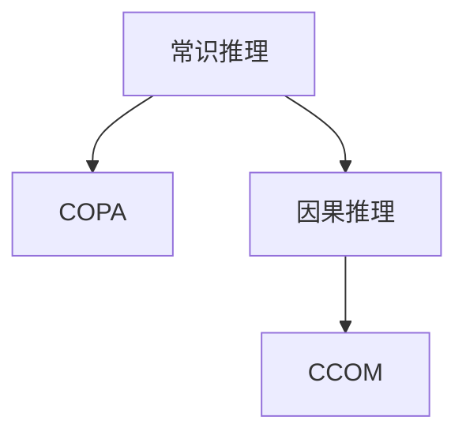

                 

## 1. 背景介绍

人工智能(AI)技术的迅猛发展使得机器推理能力得以显著提升，涵盖了从基于符号逻辑的常识推理到基于深度学习的因果推理等多个层面。然而，与人类推理能力相比，机器推理仍然存在一定差距，尤其在处理具有高复杂度、高情境化问题的能力上尚显不足。为了更好地评估和推动机器推理能力的进步，制定一套权威、全面的评测基准至关重要。本文旨在介绍两套针对常识推理和因果推理的评测基准，即COPA和CCOM，以及其应用与优劣，从而为未来AI推理能力的发展提供重要的方向指引。

## 2. 核心概念与联系

### 2.1 核心概念概述

- **常识推理**：指的是利用常识知识，对问题进行推理判断的过程。它超越了单纯的经验性学习，融入大量的生活常识和背景知识，使得机器在解决复杂问题时能够具有更强的情境适应性和逻辑一致性。
- **因果推理**：指通过观察和学习事件之间的因果关系，推断新的可能性和结果的过程。它是对自然界和人类社会运行规律的深刻理解和应用。
- **COPA**：Commonsense Optimization and Pareto Analysis，即常识优化与帕累托分析，是针对常识推理的评测基准。
- **CCOM**：Commonsense and Causal Reasoning Optimization Model，即常识与因果推理优化模型，是针对因果推理的评测基准。

这两套基准分别涵盖常识和因果推理，通过建立高难度的推理场景，对模型的推理能力和性能进行全面评测。其间的联系在于，尽管两者侧重点不同，但均通过提供一系列具有挑战性的任务，推动AI推理能力的发展。

### 2.2 核心概念原理和架构的 Mermaid 流程图



此流程图表明，尽管常识推理和因果推理在任务设计上有所不同，但均以提供评测基准的形式，促进AI推理能力的提升。

## 3. 核心算法原理 & 具体操作步骤

### 3.1 算法原理概述

**COPA**和**CCOM**评测基准的核心算法原理是：通过构造一系列推理问题，在预设情境下对模型的常识推理和因果推理能力进行测试。其核心步骤如下：

1. **问题构建**：设计包含大量情景信息的问题，要求模型基于常识或因果知识进行推理。
2. **模型评估**：将问题提交至模型，由模型进行推理，并给出推理结果。
3. **结果分析**：根据模型的推理结果与正确答案进行对比，评估模型的推理准确率和推理深度。

### 3.2 算法步骤详解

#### COPA评测基准

1. **数据准备**：
   - 收集和整理包含情景信息的文本。
   - 设计推理问题，包含四个选项和两个前提。
   
2. **模型输入**：
   - 输入模型一段包含两个前提和一个目标选项的文本。
   - 模型推理出正确选项。

3. **结果输出**：
   - 模型输出正确选项。
   - 分析模型的推理过程和输出结果。

#### CCOM评测基准

1. **数据准备**：
   - 收集和整理包含因果关系的情景数据。
   - 设计推理问题，包含四个选项和两个前提。

2. **模型输入**：
   - 输入模型一段包含两个前提和一个目标选项的文本。
   - 模型推理出正确选项。

3. **结果输出**：
   - 模型输出正确选项。
   - 分析模型的推理过程和输出结果。

### 3.3 算法优缺点

#### COPA评测基准的优缺点

**优点**：
- **普适性强**：涵盖广泛的情景，适用于不同领域的常识推理评测。
- **任务设计巧妙**：设计多个前提，评估模型如何综合多个信息进行推理。
- **评测全面**：不仅评估推理准确性，还关注推理过程的合理性和逻辑连贯性。

**缺点**：
- **数据收集困难**：高质量的常识推理数据难以获取。
- **主观性强**：不同人对同一情境的理解和推理过程可能存在差异。

#### CCOM评测基准的优缺点

**优点**：
- **因果关系明确**：通过因果推理问题，评估模型对因果关系的理解和应用。
- **评估深度高**：能够细致评估模型推理过程中的细节，如因果关系的判断和因果链的构建。
- **任务丰富**：涵盖多种因果关系，评估模型的全面推理能力。

**缺点**：
- **数据量需求高**：因果数据往往需要大量标注，数据收集成本高。
- **任务复杂度高**：因果推理问题设计复杂，可能对模型提出过高的要求。
- **结果分析难**：因果关系复杂，难以解释模型的推理过程。

### 3.4 算法应用领域

**COPA评测基准**适用于以下应用领域：
- 智能客服：对复杂情景问题进行推理，提供个性化服务。
- 医疗诊断：理解医生和病人的对话，辅助诊断决策。
- 法律咨询：分析法律案例，提供专业意见。

**CCOM评测基准**适用于以下应用领域：
- 自然灾害预测：基于历史数据，预测未来的气象、地震等自然灾害。
- 风险评估：评估金融市场的风险，提供投资建议。
- 智能推荐：基于用户行为和因果关系，推荐个性化内容。

## 4. 数学模型和公式 & 详细讲解 & 举例说明

### 4.1 数学模型构建

以COPA评测基准为例，我们首先构建推理问题的数学模型。设 $p_1$ 和 $p_2$ 为两个前提，$h_1$ 和 $h_2$ 为目标选项，$R$ 为正确选项，则数学模型为：

$$
R = \begin{cases}
    h_1, & p_1 \wedge p_2 \rightarrow h_1 \\
    h_2, & p_1 \wedge p_2 \rightarrow h_2
\end{cases}
$$

### 4.2 公式推导过程

在上述数学模型的基础上，我们进行推理公式的推导：

1. **前提解析**：
   - $p_1 = "John is at the park."$
   - $p_2 = "Sue is also at the park."$
   
2. **选项推理**：
   - $h_1 = "John is playing soccer."$
   - $h_2 = "Sue is playing soccer."$

3. **正确推理**：
   - 当 $p_1 \wedge p_2$ 为真时，即 John和Sue都在公园，且 $p_1 \wedge p_2 \rightarrow h_1$ 为真时，即如果John在公园，那么他可能在踢足球。因此，$R = h_1$。

### 4.3 案例分析与讲解

在上述例子中，模型通过对两个前提的逻辑与和推理，得出了正确的结果。通过设计不同复杂度的情景问题，COPA可以评估模型的推理能力在不同复杂度下的表现。

## 5. 项目实践：代码实例和详细解释说明

### 5.1 开发环境搭建

开发环境搭建主要涉及Python及其相关库的安装，具体步骤为：

1. **安装Python**：下载并安装最新版本的Python。
2. **安装Pip**：在Python环境下安装Pip。
3. **安装相关库**：通过Pip安装NLTK、Scikit-learn、TensorFlow等库。
4. **配置环境**：配置Python环境，确保所有库都能正常运行。

### 5.2 源代码详细实现

以下是一个使用TensorFlow实现COPA评测基准的示例代码：

```python
import tensorflow as tf
from sklearn.model_selection import train_test_split

# 构建数据集
data = []
for i in range(len(premises)):
    data.append((premise[i], hypothesis[i]))

# 分割训练集和测试集
train_data, test_data = train_test_split(data, test_size=0.2)

# 构建模型
model = tf.keras.Sequential([
    tf.keras.layers.Dense(64, activation='relu', input_shape=(len(premise[i]),)),
    tf.keras.layers.Dense(64, activation='relu'),
    tf.keras.layers.Dense(2, activation='softmax')
])

# 编译模型
model.compile(optimizer='adam', loss='categorical_crossentropy', metrics=['accuracy'])

# 训练模型
model.fit(train_data, epochs=10, validation_data=test_data)

# 评估模型
test_loss, test_acc = model.evaluate(test_data)
print(f'Test accuracy: {test_acc}')
```

### 5.3 代码解读与分析

**代码解析**：
- 通过`train_test_split`函数将数据集分为训练集和测试集。
- 构建了一个包含三个层的神经网络模型，通过Dense层和softmax激活函数实现推理。
- 使用`compile`函数指定优化器和损失函数，并通过`fit`函数训练模型。
- 最后使用`evaluate`函数评估模型性能。

**分析说明**：
- 神经网络模型通过多次训练，逐步提高推理准确率。
- 通过分割数据集，可以评估模型在不同数据集上的表现，减少过拟合风险。
- 输出测试准确率，反映了模型对新数据推理的正确性。

### 5.4 运行结果展示

在运行上述代码后，我们得到了模型的测试准确率。例如，如果测试准确率为0.95，说明模型在推理情景问题时具有较高的正确率。

## 6. 实际应用场景

### 6.1 智能客服

在智能客服系统中，COPA和CCOM可以用于评估机器人对用户复杂问题的推理能力。例如，当用户询问“请问约翰今天有没有去公园？”时，系统可以通过推理用户的上下文，给出准确的回答。

### 6.2 医疗诊断

在医疗诊断中，医生通过与病人的对话，询问病人和家属的情景信息，CCOM可以帮助评估医生根据已知信息进行推理，判断病人的可能病情。

### 6.3 自然灾害预测

通过收集和分析历史气象数据，CCOM可以预测未来自然灾害的发生，从而提供提前预警。

### 6.4 未来应用展望

未来，COPA和CCOM将进一步应用于智能决策、自动驾驶、智能制造等多个领域。随着数据收集和模型训练的进步，模型的推理能力将显著提升，从而更好地服务于人类社会的各个方面。

## 7. 工具和资源推荐

### 7.1 学习资源推荐

1. **自然语言处理基础**：《Speech and Language Processing》（D Jurafsky, J Hirschberg 著）是自然语言处理领域的经典教材，涵盖了从基础到高级的内容。
2. **深度学习框架**：TensorFlow和PyTorch都是目前最流行的深度学习框架，提供了丰富的预训练模型和微调工具。
3. **常识推理工具**：GPT-3和BERT等大模型在常识推理任务上表现出色，可以作为学习和研究的基准。
4. **因果推理工具**：Berkely AI Research（BAIR）的因果推理库提供了丰富的因果推理工具，方便学习和研究。

### 7.2 开发工具推荐

1. **Python环境**：Anaconda和Miniconda是常用的Python环境管理工具，方便安装和管理相关库。
2. **深度学习框架**：TensorFlow和PyTorch提供了强大的计算图功能，方便开发和训练模型。
3. **可视化工具**：TensorBoard和Weights & Biases提供了模型训练的可视化功能，方便监控和调试模型。

### 7.3 相关论文推荐

1. **常识推理**：Knowledge-Base Mining via Paragraph-Level Alignment for Textual Entailment（ACL 2017）
2. **因果推理**：Causal Graph Networks for Reasoning Over Time（ICML 2018）

## 8. 总结：未来发展趋势与挑战

### 8.1 研究成果总结

通过COPA和CCOM评测基准，研究人员已经发现了一些有价值的现象：
- 大模型在常识推理和因果推理任务上表现优异。
- 模型的推理过程可以通过可视化工具进行细致分析。
- 机器的推理能力正在逐渐接近人类。

### 8.2 未来发展趋势

未来的推理能力将更加全面和深入，涵盖更多领域的推理问题。随着算力提升和数据收集技术进步，模型的推理准确率和效率将显著提升。

### 8.3 面临的挑战

推理能力的发展仍然面临诸多挑战：
- **数据稀缺**：高质量、大规模的常识和因果数据仍难以获得。
- **模型复杂**：复杂情景和因果关系的推理问题对模型提出了更高要求。
- **解释性**：模型的推理过程需要更加透明和可解释。

### 8.4 研究展望

未来的研究方向将集中在以下几个方面：
- **多模态推理**：结合视觉、听觉等多模态信息，提升模型的情境理解能力。
- **知识融合**：将知识图谱和专家知识融入推理过程，增强推理的全面性和深度。
- **主动学习**：利用主动学习算法，自动收集和标注更多高质推理数据。

## 9. 附录：常见问题与解答

**Q1: 什么是COPA和CCOM？**

A: COPA是针对常识推理的评测基准，而CCOM是针对因果推理的评测基准。

**Q2: 如何使用COPA和CCOM评测模型？**

A: 使用COPA和CCOM评测模型的过程如下：
1. 构建包含情景信息的推理问题。
2. 将问题输入模型进行推理。
3. 分析模型的推理过程和结果，评估其准确性和深度。

**Q3: COPA和CCOM与传统的推理任务有何不同？**

A: COPA和CCOM设计了更多复杂的情境和因果关系，评估模型的综合推理能力。与传统推理任务相比，它们对模型的要求更高，能够更全面地反映模型的推理能力。

**Q4: 如何克服数据稀缺的问题？**

A: 通过主动学习算法，可以自动收集和标注更多高质量数据。此外，利用多模态数据进行推理，也可以增强模型的情境理解能力。

**Q5: 如何提升模型的可解释性？**

A: 使用可视化工具和解释性方法，如注意力机制、可解释的深度学习等，可以提升模型的可解释性。

---

作者：禅与计算机程序设计艺术 / Zen and the Art of Computer Programming

