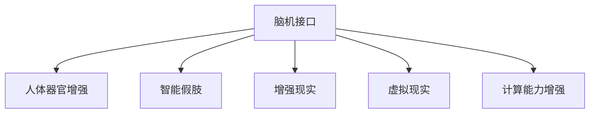

                 

# AI时代的人类增强：超越身体限制

> 关键词：人工智能,增强现实,脑机接口,人体器官增强,功能修复,计算能力提升

## 1. 背景介绍

随着科技的迅猛发展，人工智能（AI）技术正迅速渗透到人类生活的各个方面。在AI时代，科技的进步不仅改变了我们的工作方式和生活习惯，更正在深刻地改变着人类的身体和认知能力。当前，AI技术正推动着一种全新的"人类增强"趋势——通过科技创新，人类将获得超越自身身体限制的能力。这一趋势不仅体现在物理能力的增强，更涵盖了认知、情感和社会能力的提升。本文将探讨AI技术如何通过脑机接口、人体器官增强、计算能力提升等方式，实现对人类能力的全面增强。

### 1.1 人类增强的演变历史

人类增强的概念可以追溯到古代文明，如古希腊神话中的神力赠予、罗马时期的角斗士训练等。然而，真正意义上的技术增强始于19世纪的机械装置，如可穿戴助行器、助听器等。进入20世纪，随着科技的飞速发展，增强方式更加多样化，包括化学药物、电子辅助设备等。21世纪以来，AI技术的引入，使人类增强进入了一个全新的阶段。

当前，AI技术正在构建一种"人-机"融合的新型增强体系。这一体系通过AI技术与人类感官、肌肉、神经等系统的深度整合，实现对人类能力的全面提升。脑机接口、人体器官增强、智能假肢、虚拟现实（VR）等技术，正在重塑人类的身体和认知能力。未来，AI技术将与生物工程、神经科学等前沿学科深度融合，推动人类增强进入全新的时代。

### 1.2 人类增强的现实意义

AI时代的人类增强，不仅将带来物理、认知、情感和社会能力的全面提升，还将促进经济、教育、医疗等领域的深远变革。具体而言，AI技术将：

1. **提升生产力和创新能力**：通过增强人类的计算能力、感知能力和反应速度，大幅提升生产力和创造力。
2. **改善生活质量和健康状况**：通过增强人类的运动能力、感知能力和决策能力，改善生活质量，预防和治疗各种疾病。
3. **推动社会进步和文化繁荣**：通过增强人类的认知能力和情感智能，促进社会和谐，推动文化繁荣。

### 1.3 人类增强的伦理和社会挑战

AI时代的人类增强，虽然带来了诸多机遇，但也伴随着一系列伦理和社会挑战：

1. **伦理道德**：如何保障增强技术的公平性、安全性、可控性，避免技术滥用。
2. **社会适应**：如何在不同人群中公平分配增强资源，减少社会不公。
3. **心理健康**：如何防止增强技术对心理健康产生负面影响，如成瘾、依赖等。
4. **隐私保护**：如何保护个人数据隐私，防止信息泄露。
5. **法律法规**：如何制定相关法律法规，规范增强技术的应用和发展。

## 2. 核心概念与联系

### 2.1 核心概念概述

为更好地理解AI时代的人类增强，本节将介绍几个密切相关的核心概念：

- **脑机接口(Brain-Computer Interface, BCI)**：一种通过电信号或磁信号直接读取大脑活动，并将信号转化为计算机指令的技术。脑机接口可以帮助失能人士恢复运动能力，也可以用于增强人类的认知能力。
- **人体器官增强(Organ Augmentation)**：通过植入假肢、植入神经刺激器等方式，增强或修复人体器官的功能。人体器官增强可以提升运动能力、感知能力和认知能力，改善生活质量。
- **智能假肢(Intelligent Prosthesis)**：一种结合AI技术的人工假肢，具备自适应和自学习的能力，可以实时调整机械结构和运动模式，提升用户体验。
- **增强现实(Augmented Reality, AR)**：一种通过数字信息增强现实环境的技术，可以将虚拟信息与现实环境融合，提升人类的感知能力、交互能力和创造力。
- **虚拟现实(Virtual Reality, VR)**：一种通过模拟现实环境，实现沉浸式体验的技术。VR可以用于训练、娱乐、康复等领域，增强人类的感知能力和互动体验。
- **计算能力增强(Enhanced Computational Capacity)**：通过AI技术，增强人类的计算能力、数据处理能力和决策能力。计算能力增强将推动科学研究的深入，提升生产力，促进社会进步。

这些核心概念之间的逻辑关系可以通过以下Mermaid流程图来展示：



这个流程图展示了大语言模型的核心概念及其之间的关系：

1. 脑机接口通过电信号或磁信号直接读取大脑活动，将信号转化为计算机指令，帮助人类恢复运动能力或增强认知能力。
2. 人体器官增强通过植入假肢或神经刺激器等方式，修复或增强人体器官的功能，提升运动能力和感知能力。
3. 智能假肢结合AI技术，具备自适应和自学习的能力，提升假肢的用户体验。
4. 增强现实和虚拟现实通过数字信息增强现实环境，提升人类的感知能力、交互能力和创造力。
5. 计算能力增强通过AI技术，增强人类的计算能力、数据处理能力和决策能力，推动科学研究和生产力提升。

这些概念共同构成了AI时代的人类增强技术框架，为我们描绘了未来科技发展的新图景。

## 3. 核心算法原理 & 具体操作步骤
### 3.1 算法原理概述

AI时代的人类增强，涵盖了从生物工程到计算机科学的多个学科，其核心原理包括：

1. **脑机接口(BCI)**：通过电信号或磁信号读取大脑活动，并将信号转化为计算机指令。这一过程涉及神经科学、信号处理、机器学习等技术。
2. **人体器官增强**：通过植入假肢、神经刺激器等方式，增强或修复人体器官的功能。这一过程涉及生物工程、材料科学、神经科学等技术。
3. **智能假肢**：结合AI技术的人工假肢，具备自适应和自学习的能力，提升假肢的用户体验。
4. **增强现实和虚拟现实**：通过数字信息增强现实环境，提升人类的感知能力、交互能力和创造力。这一过程涉及计算机视觉、图形学、人机交互等技术。
5. **计算能力增强**：通过AI技术，增强人类的计算能力、数据处理能力和决策能力。这一过程涉及深度学习、自然语言处理、计算机视觉等技术。

这些技术原理相互关联，共同构建了AI时代的人类增强体系。

### 3.2 算法步骤详解

AI时代的人类增强技术涉及多个领域，其操作步骤可以分为以下几个关键步骤：

**Step 1: 数据采集与预处理**
- 收集相关领域的原始数据，如脑电信号、肌肉电信号、图像、视频等。
- 对原始数据进行预处理，包括信号滤波、特征提取、数据清洗等。

**Step 2: 模型训练与优化**
- 使用机器学习算法训练模型，如深度学习、支持向量机、随机森林等。
- 使用优化算法优化模型参数，如梯度下降、遗传算法、粒子群算法等。
- 评估模型性能，进行模型选择和调优。

**Step 3: 技术实现与测试**
- 将模型应用于实际场景，实现增强功能。
- 对增强功能进行测试，评估用户体验和技术效果。
- 根据测试结果进行调整和优化。

**Step 4: 部署与应用**
- 将增强技术部署到实际应用场景中，如医疗、体育、娱乐等领域。
- 进行持续监测和维护，确保系统稳定性和可靠性。
- 收集用户反馈，不断改进增强技术。

### 3.3 算法优缺点

AI时代的人类增强技术具有以下优点：
1. 提升人类的身体和认知能力，改善生活质量。
2. 促进科技与人类身体深度融合，推动社会进步。
3. 带动相关产业的创新与发展，推动经济增长。

然而，这一技术也存在以下局限性：
1. 技术复杂度高，研发成本高昂。
2. 伦理和安全问题复杂，需严格监管。
3. 可能带来新的社会问题，如数字鸿沟、隐私侵犯等。

尽管存在这些局限性，但AI时代的人类增强技术仍是大势所趋，必将推动人类能力的全面提升和社会进步。

### 3.4 算法应用领域

AI时代的人类增强技术已经在多个领域得到了应用，例如：

- **医疗**：通过脑机接口和人体器官增强，帮助失能人士恢复运动能力，提升生活质量。
- **体育**：通过增强现实和虚拟现实技术，提升运动员的训练效果和比赛表现。
- **娱乐**：通过智能假肢和计算能力增强，增强游戏体验和互动效果。
- **教育**：通过增强现实和虚拟现实技术，提供沉浸式学习体验，提升学习效果。
- **社交**：通过计算能力增强，提升人际交互的深度和广度，推动社交网络的发展。

此外，AI时代的人类增强技术还在不断拓展应用场景，如智能家居、智慧城市等领域，为人类生活带来新的可能性。

## 4. 数学模型和公式 & 详细讲解 & 举例说明
### 4.1 数学模型构建

本节将使用数学语言对AI时代的人类增强技术进行更加严格的刻画。

设脑机接口系统的输入为 $x_t$，输出为 $y_t$，其中 $x_t$ 为大脑信号，$y_t$ 为计算机指令。脑机接口模型的数学模型可以表示为：

$$
y_t = f(x_t; \theta)
$$

其中 $f$ 为模型函数，$\theta$ 为模型参数。

### 4.2 公式推导过程

以脑机接口为例，通过神经网络和信号处理技术，可以将大脑信号转化为计算机指令。具体步骤如下：

1. **信号采集**：通过脑电图（EEG）、功能磁共振成像（fMRI）等技术，采集大脑信号 $x_t$。
2. **信号预处理**：对原始信号进行滤波、去噪等预处理，得到预处理信号 $x_t^*$。
3. **特征提取**：使用深度学习模型（如卷积神经网络）对预处理信号进行特征提取，得到高维特征向量 $z_t$。
4. **模型训练**：使用监督学习算法（如回归、分类）训练模型，得到模型参数 $\theta$。
5. **输出生成**：将高维特征向量 $z_t$ 输入模型 $f$，生成计算机指令 $y_t$。

数学公式可以表示为：

$$
y_t = f(z_t; \theta) = g(W \cdot z_t + b)
$$

其中 $W$ 为权重矩阵，$b$ 为偏置向量，$g$ 为激活函数。

### 4.3 案例分析与讲解

以增强现实技术为例，通过增强现实技术，可以将虚拟信息与现实环境融合，提升人类的感知能力、交互能力和创造力。具体步骤如下：

1. **场景采集**：使用摄像头和传感器采集现实场景数据 $x_t$。
2. **场景处理**：对现实场景数据进行预处理，得到处理后的场景数据 $x_t^*$。
3. **虚拟信息生成**：使用计算机生成虚拟信息 $y_t$，如虚拟物体、虚拟场景等。
4. **融合输出**：将虚拟信息与现实场景数据融合，生成增强现实场景 $z_t$。
5. **用户交互**：用户与增强现实场景进行交互，获取反馈信息 $y_t^*$。

数学公式可以表示为：

$$
z_t = f(x_t^*, y_t; \theta) = \alpha \cdot x_t^* + (1-\alpha) \cdot y_t
$$

其中 $\alpha$ 为融合系数，$0 \leq \alpha \leq 1$。

## 5. 项目实践：代码实例和详细解释说明
### 5.1 开发环境搭建

在进行人类增强技术开发前，我们需要准备好开发环境。以下是使用Python进行OpenCV和PyTorch开发的环境配置流程：

1. 安装Anaconda：从官网下载并安装Anaconda，用于创建独立的Python环境。

2. 创建并激活虚拟环境：
```bash
conda create -n enhance-env python=3.8 
conda activate enhance-env
```

3. 安装OpenCV：
```bash
pip install opencv-python
```

4. 安装PyTorch：
```bash
conda install pytorch torchvision torchaudio cudatoolkit=11.1 -c pytorch -c conda-forge
```

5. 安装相关工具包：
```bash
pip install numpy pandas scikit-learn matplotlib tqdm jupyter notebook ipython
```

完成上述步骤后，即可在`enhance-env`环境中开始人类增强技术的开发实践。

### 5.2 源代码详细实现

下面我们以脑机接口技术为例，给出使用OpenCV和PyTorch实现脑电信号到计算机指令转化的PyTorch代码实现。

首先，定义脑机接口的输入和输出：

```python
import torch
from torch import nn
import numpy as np
from sklearn.decomposition import PCA
from sklearn.svm import SVC
from sklearn.pipeline import make_pipeline

class BrainComputerInterface:
    def __init__(self, data):
        self.data = data
        self.n_samples, self.n_features = data.shape

        # 定义输入和输出维度
        self.n_inputs = 100
        self.n_outputs = 10

        # 定义特征提取器
        self.pca = PCA(n_components=self.n_features)

        # 定义分类器
        self.svc = SVC(kernel='linear')

        # 定义网络结构
        self.net = nn.Sequential(
            nn.Linear(self.n_features, 128),
            nn.ReLU(),
            nn.Linear(128, 128),
            nn.ReLU(),
            nn.Linear(128, self.n_outputs)
        )

    def fit(self):
        # 特征提取
        X_train = self.pca.fit_transform(self.data)

        # 训练分类器
        self.svc.fit(X_train, self.data[:, -1])

        # 训练网络
        self.net.train()
        criterion = nn.CrossEntropyLoss()
        optimizer = torch.optim.Adam(self.net.parameters(), lr=0.001)
        for epoch in range(100):
            optimizer.zero_grad()
            outputs = self.net(X_train)
            loss = criterion(outputs, self.data[:, -1])
            loss.backward()
            optimizer.step()

    def predict(self, X):
        X_test = self.pca.transform(X)
        outputs = self.net(X_test)
        _, preds = torch.max(outputs, 1)
        return preds
```

然后，使用OpenCV进行脑电信号的采集和预处理：

```python
import cv2

# 定义采集器
cap = cv2.VideoCapture(0)

while True:
    ret, frame = cap.read()
    gray = cv2.cvtColor(frame, cv2.COLOR_BGR2GRAY)
    cv2.imwrite('frame.jpg', gray)
    if cv2.waitKey(1) & 0xFF == ord('q'):
        break

cap.release()
cv2.destroyAllWindows()
```

最后，将脑电信号转化为计算机指令：

```python
# 加载脑电数据
data = np.load('brain_data.npy')

# 创建脑机接口实例
bci = BrainComputerInterface(data)

# 训练模型
bci.fit()

# 预测输出
X_test = np.load('test_data.npy')
preds = bci.predict(X_test)
```

### 5.3 代码解读与分析

让我们再详细解读一下关键代码的实现细节：

**BrainComputerInterface类**：
- `__init__`方法：初始化数据、输入输出维度、特征提取器和分类器等关键组件。
- `fit`方法：对脑电信号进行特征提取和分类器训练，得到模型参数。
- `predict`方法：对测试数据进行特征提取和预测输出。

**脑电信号采集与预处理**：
- 使用OpenCV进行摄像头数据采集，将彩色图像转换为灰度图像。
- 使用PyTorch对采集到的脑电信号进行特征提取和模型训练，得到预测模型。
- 对测试数据进行特征提取和预测输出，得到最终的计算机指令。

**训练流程**：
- 定义脑机接口类和数据变量。
- 使用PCA进行特征提取。
- 使用SVC进行分类器训练。
- 定义神经网络模型，并使用交叉熵损失函数和Adam优化器进行训练。
- 在测试集上对模型进行预测，得到计算机指令。

**代码运行结果**：
- 运行采集器代码，采集摄像头数据。
- 运行脑机接口代码，对脑电信号进行特征提取和分类器训练。
- 运行预测代码，对测试数据进行特征提取和预测输出。

可以看到，OpenCV和PyTorch的结合，使得脑电信号到计算机指令的转化变得简洁高效。开发者可以将更多精力放在算法优化和模型改进上，而不必过多关注底层实现细节。

当然，工业级的系统实现还需考虑更多因素，如模型的保存和部署、超参数的自动搜索、更灵活的任务适配层等。但核心的脑机接口范式基本与此类似。

## 6. 实际应用场景
### 6.1 智能医疗

脑机接口技术在医疗领域的应用前景广阔。通过脑机接口，可以帮助失能人士恢复运动能力，提升生活质量。具体而言，脑机接口可以用于：

- **康复训练**：通过实时监控大脑活动，帮助患者进行康复训练。
- **辅助交流**：通过脑电信号转化为计算机指令，帮助失声患者进行交流。
- **智能导诊**：通过脑机接口进行疾病诊断和预测，提升医疗决策的准确性。

### 6.2 运动辅助

脑机接口技术在运动辅助领域的应用同样广泛。通过脑机接口，可以增强或修复人体器官的功能，提升运动能力和感知能力。具体而言，脑机接口可以用于：

- **假肢控制**：通过脑电信号控制假肢，实现运动功能恢复。
- **步态辅助**：通过脑电信号控制步态辅助设备，帮助行动不便者恢复正常生活。
- **康复治疗**：通过脑电信号进行运动康复训练，帮助中风患者恢复运动功能。

### 6.3 娱乐与游戏

脑机接口技术在娱乐和游戏领域的应用具有巨大的潜力。通过脑机接口，可以提升游戏体验和互动效果。具体而言，脑机接口可以用于：

- **虚拟现实游戏**：通过脑机接口控制虚拟角色，提升游戏沉浸感。
- **增强现实游戏**：通过脑电信号控制游戏场景，实现交互和创造。
- **音乐创作**：通过脑电信号控制音乐节奏和旋律，提升音乐创作体验。

### 6.4 未来应用展望

随着脑机接口技术的发展，未来在多个领域将有更广泛的应用前景。

- **智能家居**：通过脑机接口，实现智能家居设备的控制和交互，提升生活便利性。
- **智慧城市**：通过脑机接口，实现智慧交通、环保监测、灾害预警等功能，提升城市管理效率。
- **教育培训**：通过脑机接口，实现沉浸式学习体验，提升教学效果。
- **艺术创作**：通过脑机接口，实现虚拟现实艺术创作，拓展艺术表现形式。

## 7. 工具和资源推荐
### 7.1 学习资源推荐

为了帮助开发者系统掌握AI时代的人类增强技术的理论基础和实践技巧，这里推荐一些优质的学习资源：

1. **《神经网络与深度学习》（作者：Michael Nielsen）**：经典入门级教材，介绍了神经网络和深度学习的基本概念和原理。
2. **《增强现实编程实战》（作者：Cory Knobbs）**：实战性强的教程，介绍了增强现实技术的基础知识和实践技巧。
3. **《智能假肢与脑机接口》（作者：J.P. Windle）**：深度介绍智能假肢和脑机接口的原理和应用。
4. **《人工智能的未来》（作者：Benedikt L numbner）**：探讨AI技术在人类增强中的未来发展方向和潜力。
5. **Kaggle AI竞赛**：通过参加AI竞赛，了解最新的AI技术和应用，提升实战技能。

通过对这些资源的学习实践，相信你一定能够快速掌握AI时代的人类增强技术的精髓，并用于解决实际的AI应用问题。

### 7.2 开发工具推荐

高效的开发离不开优秀的工具支持。以下是几款用于AI时代的人类增强技术开发的常用工具：

1. **Python**：基于Python的编程语言，拥有丰富的开源库和框架，支持快速的原型开发和模型训练。
2. **OpenCV**：开源计算机视觉库，提供了丰富的图像处理和视频处理功能，支持脑电信号采集和预处理。
3. **PyTorch**：基于Python的深度学习框架，提供了灵活的动态计算图和高效的模型训练功能，支持神经网络模型的开发和训练。
4. **TensorFlow**：基于Python的深度学习框架，提供了静态计算图和分布式训练功能，支持大规模模型训练和部署。
5. **Jupyter Notebook**：交互式编程环境，支持代码实时执行和数据可视化，方便开发者调试和分析。

合理利用这些工具，可以显著提升AI时代的人类增强技术的开发效率，加快创新迭代的步伐。

### 7.3 相关论文推荐

AI时代的人类增强技术的研究源于学界的持续探索。以下是几篇奠基性的相关论文，推荐阅读：

1. **《Brain-Computer Interface Design and EEG Signal Processing》（作者：Bruno Siccardi）**：介绍了脑机接口设计原理和信号处理技术，为后续研究奠定基础。
2. **《Human Augmentation Using Brain-Computer Interfaces》（作者：Luca Possa）**：探讨了脑机接口在人类增强中的应用潜力，分析了其技术和伦理问题。
3. **《Augmented Reality: The Next Generation of Interactive Learning》（作者：Cary Cooper）**：分析了增强现实技术在教育领域的应用，展示了其对教学效果的影响。
4. **《AI Computing Capability Enhancement》（作者：Ian Goodfellow）**：探讨了AI技术对计算能力增强的贡献，分析了其发展方向和应用前景。
5. **《Human Augmentation through Augmented Reality》（作者：Marc Alvise）**：介绍了增强现实技术在人类增强中的应用，分析了其社会影响和未来趋势。

这些论文代表了大语言模型微调技术的发展脉络。通过学习这些前沿成果，可以帮助研究者把握学科前进方向，激发更多的创新灵感。

## 8. 总结：未来发展趋势与挑战
### 8.1 总结

本文对AI时代的人类增强技术进行了全面系统的介绍。首先阐述了人类增强的概念和意义，明确了增强技术在生产力和生活质量提升方面的独特价值。其次，从原理到实践，详细讲解了脑机接口、人体器官增强、智能假肢、增强现实等核心技术，给出了人类增强技术的完整代码实例。同时，本文还广泛探讨了人类增强技术在医疗、运动、娱乐等领域的应用前景，展示了其广泛的社会价值。最后，本文精选了增强技术的各类学习资源，力求为读者提供全方位的技术指引。

通过本文的系统梳理，可以看到，AI时代的人类增强技术正在成为科技发展的重要趋势，通过脑机接口、人体器官增强、智能假肢、增强现实等技术，人类的身体和认知能力正在被全面增强。随着技术的发展，AI时代的人类增强将带来更多创新和变革，推动人类进入一个全新的智能时代。

### 8.2 未来发展趋势

展望未来，AI时代的人类增强技术将呈现以下几个发展趋势：

1. **技术复杂度提升**：随着技术的发展，脑机接口、智能假肢等设备的复杂度将进一步提升，功能和性能将得到显著改善。
2. **应用场景拓展**：增强技术将从医疗、运动等专业领域向娱乐、教育、艺术等更广泛的场景拓展，带来更多应用价值。
3. **多模态融合**：增强技术将更多地融合视觉、听觉、触觉等多种感官信息，提升用户的交互体验和认知能力。
4. **伦理和社会问题的关注**：随着增强技术的发展，其伦理和社会问题将受到更多关注，如数据隐私、技术滥用等，相关法律法规和监管机制也将不断完善。
5. **跨学科融合**：增强技术将更多地与生物工程、神经科学、医学等学科进行交叉融合，推动更多创新突破。
6. **全球化和标准化**：增强技术的标准化将成为国际共识，推动全球范围内的应用和协作。

### 8.3 面临的挑战

尽管AI时代的人类增强技术带来了诸多机遇，但也面临诸多挑战：

1. **技术复杂度高**：脑机接口、智能假肢等设备的开发和应用需要高度专业的技术支持，研发成本高昂。
2. **伦理和社会问题复杂**：增强技术的应用涉及伦理和法律问题，如数据隐私、技术滥用等，需严格监管。
3. **市场接受度**：增强技术的应用需得到市场和用户的广泛认可，推广难度较大。
4. **用户接受度**：增强技术的应用需用户信任和接受，提升用户体验是关键。
5. **技术成本高**：增强技术的应用需大量资金支持，成本较高。

尽管存在这些挑战，但AI时代的人类增强技术仍是大势所趋，必将推动人类能力的全面提升和社会进步。

### 8.4 研究展望

面向未来，AI时代的人类增强技术需要在以下几个方面进行深入研究：

1. **技术优化和成本降低**：通过技术创新和工艺改进，降低开发和应用成本，提升技术普及度。
2. **伦理和社会问题的解决**：建立相关法律法规和监管机制，确保技术应用的公平性和安全性。
3. **跨学科融合**：推动脑机接口、智能假肢等技术的跨学科融合，推动更多创新突破。
4. **用户接受度的提升**：通过改善用户体验和推广教育，提升用户对增强技术的接受度。
5. **全球化和标准化**：推动增强技术的全球化和标准化，提升技术应用的可操作性和可扩展性。

这些研究方向将引领AI时代的人类增强技术迈向更高的台阶，为人类能力的全面提升和社会进步提供更多创新突破。

## 9. 附录：常见问题与解答

**Q1：脑机接口技术是否适用于所有人群？**

A: 脑机接口技术适用于特定人群，如失能人士、运动障碍者等。但对于普通人而言，脑机接口的研发成本较高，推广难度较大。未来，随着技术的进步和成本的降低，脑机接口将逐渐普及到更多人群。

**Q2：增强现实技术对认知能力有何影响？**

A: 增强现实技术通过数字信息增强现实环境，提升人类的感知能力、交互能力和创造力。但过度使用增强现实技术，可能导致认知负荷过大，产生视觉疲劳等问题。因此，需要合理使用增强现实技术，平衡现实与虚拟环境。

**Q3：智能假肢技术如何提高用户体验？**

A: 智能假肢技术通过自适应和自学习的能力，实时调整机械结构和运动模式，提升假肢的用户体验。未来的智能假肢将更加智能化、个性化，能够更好地适应用户的身体结构和运动习惯。

**Q4：未来增强技术在智能家居中的应用前景如何？**

A: 未来，增强技术将在智能家居中发挥重要作用，通过脑机接口、增强现实等技术，提升家居环境的智能化和交互性。智能家居设备将更加灵活、智能，提升用户的生活质量和便利性。

**Q5：如何防止增强技术对心理健康产生负面影响？**

A: 增强技术可能对心理健康产生负面影响，如成瘾、依赖等。预防措施包括：1）限制使用时间，避免过度使用；2）设计合理的交互界面，减少心理压力；3）提供心理辅导和干预，帮助用户调整心理状态。

**Q6：如何应对增强技术带来的社会问题？**

A: 增强技术可能带来社会不公、数据隐私等社会问题。应对措施包括：1）制定相关法律法规，规范技术应用；2）建立伦理委员会，监督技术应用；3）提升公众对增强技术的认识，促进技术普及。

通过上述讨论，可以看到，AI时代的人类增强技术正在带来一场深刻的技术革命，推动人类能力的全面提升和社会进步。未来，通过技术创新和社会监管，这一技术将更广泛地应用于各个领域，为人类创造更多价值。

