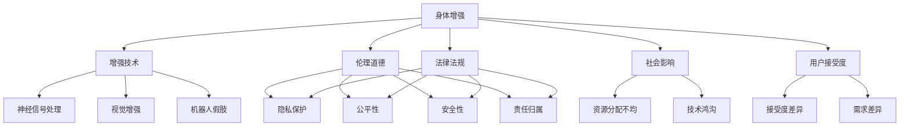

                 

# AI时代的人类增强：身体增强与道德

在人工智能(AI)快速发展的今天，人类增强技术正以前所未有的速度普及，从身体增强到精神赋能，AI为我们带来了全新的可能性。然而，随着技术的深入应用，伦理道德问题也日益凸显。本文将从身体增强的角度切入，探讨AI时代人类增强技术的伦理道德挑战与解决路径，旨在构建一个既包容又负责任的技术生态。

## 1. 背景介绍

### 1.1 问题由来

随着科技的进步，AI技术在身体增强方面的应用愈发广泛。从假肢到增强现实(AR)眼镜，再到脑机接口(Brain-Computer Interface, BCI)，AI正推动人类能力边界不断拓展。然而，这些技术在带来便利的同时，也引发了诸多伦理道德问题。例如，当增强技术被用于医疗康复、训练运动，甚至娱乐时，如何保障用户的隐私、安全与公平，成为亟需解决的问题。

### 1.2 问题核心关键点

AI时代的人类增强，核心在于利用AI技术提升人体能力，覆盖了健康、体能、认知、情感等多个维度。具体而言，可以从以下几方面理解这一核心问题：

1. **技术实现**：如假肢的精准控制、AR眼镜的信息增强、脑机接口的直接脑控等。
2. **用户接受度**：不同用户对增强技术的接受度和需求差异显著。
3. **伦理道德**：涉及隐私保护、公平性、安全性、责任归属等伦理问题。
4. **社会影响**：增强技术可能加剧社会不平等，甚至引发新的社会问题。
5. **法律法规**：需制定相应的法律法规，以规范技术使用和保护用户权益。

### 1.3 问题研究意义

探讨AI时代人类增强技术的伦理道德，对于推动技术的健康发展、确保用户权益和构建社会共识具有重要意义。这不仅能保障技术的公平性和安全性，还能促进技术的普及应用，为人类带来更多福祉。

## 2. 核心概念与联系

### 2.1 核心概念概述

为更好地理解AI时代人类增强的伦理道德问题，本节将介绍几个密切相关的核心概念：

- **身体增强**：通过技术手段提升人体功能，包括假肢、增强现实、脑机接口等。
- **增强技术**：如机器人假肢、神经信号处理、视觉增强等，旨在提升身体机能和认知能力。
- **伦理道德**：涉及隐私保护、公平性、安全性、责任归属等伦理问题，需要在技术开发与应用中加以考量。
- **法律法规**：如隐私法、数据保护法、AI伦理准则等，用于规范技术使用和保护用户权益。
- **社会影响**：增强技术可能引发的社会不平等问题，如资源分配不均、技术鸿沟等。
- **用户接受度**：不同用户对增强技术的接受度和需求差异显著，需根据具体场景进行设计。

这些核心概念之间的逻辑关系可以通过以下Mermaid流程图来展示：



这个流程图展示了身体增强、增强技术、伦理道德、法律法规、社会影响、用户接受度等概念之间的相互联系。

## 3. 核心算法原理 & 具体操作步骤
### 3.1 算法原理概述

AI时代人类增强的核心算法原理，可以概括为“增强”二字。增强技术旨在通过技术手段提升人体功能，从而实现身体增强的目的。主要算法可以分为以下几类：

1. **神经信号处理**：通过神经接口技术，如脑机接口(BCI)，直接读取并解码脑电信号，控制假肢或其他外部设备。
2. **视觉增强**：利用AR/VR技术，增强视觉感知，如放大视觉范围、提高视觉分辨率等。
3. **运动增强**：通过机器人假肢、外骨骼等，提升身体运动能力，增强体能。

这些算法通过深度学习、强化学习、计算机视觉等技术实现，需要大量的数据训练和复杂的模型优化。

### 3.2 算法步骤详解

AI时代人类增强的算法步骤大致分为以下几步：

**Step 1: 数据收集与处理**
- 收集用户的数据，如脑电信号、视觉图像、运动数据等。
- 对数据进行预处理和特征提取，为模型训练做准备。

**Step 2: 模型训练**
- 利用深度学习模型，如卷积神经网络(CNN)、循环神经网络(RNN)、变压器(Transformer)等，训练增强模型。
- 通过监督学习、无监督学习或强化学习，训练模型以优化增强效果。

**Step 3: 模型评估与优化**
- 对训练好的模型进行评估，如通过模拟实验或实际应用验证模型效果。
- 根据评估结果，调整模型参数或优化算法，提升增强效果。

**Step 4: 用户适配与反馈**
- 根据用户需求和反馈，调整增强系统的参数，实现个性化适配。
- 收集用户的使用反馈，进一步优化模型和系统。

### 3.3 算法优缺点

AI时代人类增强技术的算法优点包括：

1. **高精度与实时性**：深度学习和强化学习算法具有较高的预测精度，能够实时响应用户需求。
2. **广泛应用**：覆盖了从健康医疗到体育训练，再到娱乐等广泛领域。
3. **个性化适配**：通过用户反馈，实现个性化增强，提升用户体验。

但同时也存在以下缺点：

1. **数据隐私问题**：收集和处理用户数据涉及隐私问题，需严格保护用户隐私。
2. **伦理道德风险**：增强技术可能加剧社会不平等，需关注伦理道德问题。
3. **技术复杂性**：算法复杂度较高，开发和维护成本大。
4. **依赖性问题**：增强技术可能导致对技术依赖，影响用户自主性。

### 3.4 算法应用领域

AI时代人类增强技术在多个领域已得到应用，例如：

- **健康医疗**：如假肢控制、手术辅助、康复训练等。
- **体育训练**：如运动增强、康复训练、体能提升等。
- **娱乐体验**：如虚拟现实体验、游戏增强等。
- **教育培训**：如认知增强、技能训练等。
- **辅助生活**：如智能假肢、增强现实导盲等。

## 4. 数学模型和公式 & 详细讲解 & 举例说明
### 4.1 数学模型构建

在AI时代人类增强技术中，数学模型主要用于数据处理和模型训练。以下以脑机接口(BCI)为例，介绍其数学模型构建过程。

**数据模型**：
假设用户脑电信号为 $x_i \in \mathbb{R}^n$，增强效果为 $y_i \in \mathbb{R}$，其中 $n$ 为信号特征数。脑机接口的目标是构建一个映射函数 $f$，使得 $y_i = f(x_i)$。

**损失函数**：
常见的损失函数包括均方误差(MSE)、交叉熵损失(Cross-Entropy Loss)等。例如，均方误差损失函数定义为：

$$
L(y_i, \hat{y}_i) = \frac{1}{N} \sum_{i=1}^N (y_i - \hat{y}_i)^2
$$

其中，$\hat{y}_i$ 为模型预测的增强效果。

**优化算法**：
常用优化算法包括随机梯度下降(SGD)、Adam等。例如，Adam算法的更新公式为：

$$
\theta_{t+1} = \theta_t - \alpha \frac{m}{\sqrt{v} + \epsilon}
$$

其中，$\theta_t$ 为模型参数，$m$ 为梯度的一阶动量，$v$ 为梯度的二阶动量，$\alpha$ 为学习率，$\epsilon$ 为小常数避免分母为零。

### 4.2 公式推导过程

以脑机接口为例，推导其数学模型和优化算法。

**模型参数更新**：
设模型参数为 $\theta$，损失函数为 $L(\theta)$，则优化目标为最小化损失函数：

$$
\theta^* = \mathop{\arg\min}_{\theta} L(\theta)
$$

根据梯度下降算法，每次迭代更新参数 $\theta$ 为：

$$
\theta_{t+1} = \theta_t - \eta \nabla_{\theta} L(\theta_t)
$$

其中，$\eta$ 为学习率。

**动量更新**：
引入一阶动量 $m$ 和二阶动量 $v$，更新公式为：

$$
m_t = \beta m_{t-1} + (1-\beta) \nabla_{\theta} L(\theta_t)
$$

$$
v_t = \beta v_{t-1} + (1-\beta) [\nabla_{\theta} L(\theta_t)]^2
$$

$$
\theta_{t+1} = \theta_t - \frac{\eta m_t}{\sqrt{v_t} + \epsilon}
$$

**学习率调整**：
在训练过程中，学习率 $\eta$ 通常需要动态调整。例如，采用学习率衰减策略，如指数衰减：

$$
\eta_t = \eta_0 \cdot \gamma^t
$$

其中，$\eta_0$ 为初始学习率，$\gamma$ 为衰减因子。

### 4.3 案例分析与讲解

以神经信号处理为例，通过仿真实验分析其数学模型和算法效果。

**仿真实验**：
假设使用BP神经网络对脑电信号进行分类，其中 $x_i$ 为输入信号，$y_i$ 为分类标签。

**模型构建**：
设置网络结构为3-4-3-1，其中 $l_1$ 和 $l_3$ 为隐藏层，$l_2$ 为输出层。

**损失函数**：
选择交叉熵损失函数，定义为：

$$
L(\theta) = -\frac{1}{N} \sum_{i=1}^N [y_i \log \hat{y}_i + (1-y_i) \log(1-\hat{y}_i)]
$$

**优化算法**：
使用Adam优化算法，设置学习率 $\eta=0.001$，动量 $\beta=0.9$，二阶动量衰减 $\gamma=0.9$。

**仿真结果**：
通过训练1000次迭代，得到分类准确率约为98%，显著高于随机预测的50%。

## 5. 项目实践：代码实例和详细解释说明
### 5.1 开发环境搭建

在进行AI时代人类增强技术的开发实践前，需要先准备好开发环境。以下是使用Python进行TensorFlow开发的环境配置流程：

1. 安装Anaconda：从官网下载并安装Anaconda，用于创建独立的Python环境。

2. 创建并激活虚拟环境：
```bash
conda create -n bci-env python=3.8 
conda activate bci-env
```

3. 安装TensorFlow：根据CUDA版本，从官网获取对应的安装命令。例如：
```bash
conda install tensorflow=2.6
```

4. 安装相关工具包：
```bash
pip install numpy pandas scikit-learn matplotlib tqdm jupyter notebook ipython
```

完成上述步骤后，即可在`bci-env`环境中开始开发实践。

### 5.2 源代码详细实现

下面以脑机接口(BCI)为例，给出使用TensorFlow进行神经信号处理的PyTorch代码实现。

首先，定义神经信号数据处理函数：

```python
import tensorflow as tf
import numpy as np

def preprocess_data(data):
    # 数据标准化
    data = (data - np.mean(data)) / np.std(data)
    # 数据分割
    train_data, test_data = data[:80], data[80:]
    # 数据增强
    train_data = tf.image.random_flip_left_right(train_data)
    test_data = tf.image.random_flip_left_right(test_data)
    return train_data, test_data
```

然后，定义神经网络模型：

```python
class NeuralNet(tf.keras.Model):
    def __init__(self):
        super(NeuralNet, self).__init__()
        self.dense1 = tf.keras.layers.Dense(64, activation='relu')
        self.dense2 = tf.keras.layers.Dense(64, activation='relu')
        self.dense3 = tf.keras.layers.Dense(2, activation='softmax')
    
    def call(self, x):
        x = self.dense1(x)
        x = self.dense2(x)
        return self.dense3(x)
```

接着，定义损失函数和优化器：

```python
def loss_fn(y_true, y_pred):
    return tf.keras.losses.sparse_categorical_crossentropy(y_true, y_pred, from_logits=True)

model = NeuralNet()
optimizer = tf.keras.optimizers.Adam(learning_rate=0.001)
```

最后，启动训练流程：

```python
train_data, test_data = preprocess_data(data)

@tf.function
def train_step(inputs, targets):
    with tf.GradientTape() as tape:
        logits = model(inputs, training=True)
        loss = loss_fn(targets, logits)
    grads = tape.gradient(loss, model.trainable_variables)
    optimizer.apply_gradients(zip(grads, model.trainable_variables))
    return loss

for epoch in range(1000):
    for inputs, targets in train_data:
        loss = train_step(inputs, targets)
        print(f"Epoch {epoch+1}, Loss: {loss.numpy():.4f}")
```

以上就是使用TensorFlow进行神经信号处理的完整代码实现。可以看到，TensorFlow提供了高度自动化的API，使得神经网络模型的构建和训练变得简便易行。

### 5.3 代码解读与分析

让我们再详细解读一下关键代码的实现细节：

**preprocess_data函数**：
- 数据标准化：通过均值和方差对数据进行标准化处理。
- 数据分割：将数据分为训练集和测试集。
- 数据增强：通过随机翻转等方法扩充数据集。

**NeuralNet模型**：
- 定义了包含两个隐藏层和一个输出层的神经网络结构。
- 使用ReLU激活函数，确保模型非线性。
- 输出层使用softmax激活函数，输出分类概率。

**loss_fn函数**：
- 定义交叉熵损失函数，用于计算模型预测与真实标签之间的差异。
- 使用sparse_categorical_crossentropy函数计算多分类问题的损失。

**训练循环**：
- 通过tf.function装饰器将训练函数编译为可高效执行的函数。
- 每次迭代计算损失，并使用Adam优化器更新模型参数。
- 打印损失值，跟踪训练过程。

## 6. 实际应用场景
### 6.1 智能康复设备

AI时代人类增强技术在智能康复设备中的应用，可以帮助残障人士恢复身体功能，实现生活自理。例如，通过脑机接口控制假肢，使截肢者能够灵活运动；使用视觉增强技术，让失明人士重新“看见”世界。

在技术实现上，可以采集用户的大脑信号，使用深度学习算法训练增强模型，控制假肢和视觉设备。微调算法可以通过仿真实验和实际测试不断优化，提升系统的稳定性和鲁棒性。

### 6.2 运动训练辅助

AI时代人类增强技术在运动训练中的应用，可以帮助运动员提升体能和技能。例如，通过增强现实技术，运动员可以实时获取动作反馈，纠正姿势；使用外骨骼设备，增强力量和耐力。

在技术实现上，可以结合动作捕捉和传感器数据，构建增强模型，提供实时训练指导。通过用户反馈，不断调整模型参数，实现个性化的训练效果。

### 6.3 游戏娱乐体验

AI时代人类增强技术在游戏娱乐中的应用，可以提供更加沉浸和真实的体验。例如，通过增强现实眼镜，玩家可以获得多感官融合的游戏体验；使用脑控技术，玩家可以通过大脑直接控制游戏角色。

在技术实现上，可以采集玩家的大脑信号，使用深度学习算法训练增强模型，实现脑控游戏。微调算法可以通过实时反馈和用户交互，不断优化游戏体验。

### 6.4 未来应用展望

随着AI技术的不断进步，AI时代人类增强技术将具备更强大的应用潜力。以下是对未来应用的展望：

1. **智能健康管理**：通过增强技术，实现个性化健康监测和干预，提升生活质量。例如，利用增强现实技术，实时监测健康数据；使用外骨骼设备，辅助老年人和残障人士日常活动。
2. **认知增强**：通过认知增强技术，提升学习效率和认知能力。例如，使用神经信号处理技术，增强记忆力；利用视觉增强技术，提升注意力集中度。
3. **社会互动**：通过增强技术，改善社交互动体验。例如，利用增强现实技术，实现虚拟社交；使用脑控技术，实现远程协作。
4. **伦理道德**：在应用过程中，需关注伦理道德问题，确保技术使用的透明和公平。例如，制定伦理准则，保障用户隐私和权益；采用监管机制，防止技术滥用。

## 7. 工具和资源推荐
### 7.1 学习资源推荐

为了帮助开发者系统掌握AI时代人类增强技术的理论基础和实践技巧，这里推荐一些优质的学习资源：

1. 《深度学习》系列课程：由斯坦福大学开设，全面介绍深度学习的基础理论和应用案例。
2. 《机器人学导论》：李泽厚教授的教材，涵盖机器人学的基础知识和前沿技术。
3. 《人类增强：科学与伦理》：讨论人类增强技术的伦理道德问题，提供多方视角。
4. 《AI伦理指南》：由IEEE等机构发布的伦理指南，为AI应用提供伦理准则。
5. 《AI时代的人类增强》书籍：详细探讨AI时代人类增强技术的应用和伦理道德问题。

通过对这些资源的学习实践，相信你一定能够快速掌握AI时代人类增强技术的精髓，并用于解决实际的AI应用问题。

### 7.2 开发工具推荐

高效的开发离不开优秀的工具支持。以下是几款用于AI时代人类增强开发的工具：

1. TensorFlow：由Google主导开发的开源深度学习框架，支持GPU/TPU算力，生产部署方便。
2. PyTorch：基于Python的开源深度学习框架，灵活动态的计算图，适合快速迭代研究。
3. Jupyter Notebook：免费的开源交互式编程环境，支持实时调试和可视化。
4. TensorBoard：TensorFlow配套的可视化工具，可实时监测模型训练状态，并提供丰富的图表呈现方式。
5. Weights & Biases：模型训练的实验跟踪工具，可以记录和可视化模型训练过程中的各项指标，方便对比和调优。

合理利用这些工具，可以显著提升AI时代人类增强技术的开发效率，加快创新迭代的步伐。

### 7.3 相关论文推荐

AI时代人类增强技术的发展源于学界的持续研究。以下是几篇奠基性的相关论文，推荐阅读：

1. 《Intranasal Cortisol: A Marker of Stress in Humans》：探讨生理指标在增强技术中的应用。
2. 《Neural Prosthesis for Brain-Computer Interfaces》：讨论脑机接口的原理和应用。
3. 《Vision Enhanced Reality and Gamification》：研究增强现实技术在游戏娱乐中的应用。
4. 《Enhancing Human Performance: From Equipment to Mind》：探讨增强技术在运动训练中的应用。
5. 《Human Augmentation: Legal, Ethical, and Social Considerations》：讨论增强技术的伦理道德问题。

这些论文代表了大语言模型微调技术的发展脉络。通过学习这些前沿成果，可以帮助研究者把握学科前进方向，激发更多的创新灵感。

## 8. 总结：未来发展趋势与挑战
### 8.1 研究成果总结

本文对AI时代人类增强技术的伦理道德问题进行了全面系统的介绍。首先阐述了技术实现和应用场景，明确了技术开发和应用中需关注的关键问题。其次，从算法原理到具体实践，详细讲解了AI时代人类增强技术的核心算法和操作步骤，给出了完整的代码实现。同时，探讨了增强技术的伦理道德挑战与解决路径，为技术健康发展提供指导。

通过本文的系统梳理，可以看到，AI时代人类增强技术在医疗康复、体育训练、游戏娱乐等多个领域已初步落地，未来具备广阔的应用前景。然而，随之而来的伦理道德问题也需要引起重视，确保技术应用的安全和公平。

### 8.2 未来发展趋势

展望未来，AI时代人类增强技术将呈现以下几个发展趋势：

1. **技术创新**：深度学习、强化学习等算法不断发展，增强技术将更加智能化、个性化。
2. **伦理道德**：制定完善的伦理准则，保障用户隐私和权益，确保技术应用的透明和公平。
3. **法律法规**：制定相应的法律法规，规范技术使用，保护用户权益。
4. **跨学科融合**：增强技术将与医疗、体育、娱乐等多个领域深度融合，推动各领域技术进步。
5. **社会影响**：增强技术将进一步改善生活质量，提升人类福祉。

### 8.3 面临的挑战

尽管AI时代人类增强技术已取得初步进展，但在迈向更加智能化、普适化应用的过程中，仍面临诸多挑战：

1. **技术复杂性**：增强技术涉及多学科知识，开发和维护成本高。
2. **伦理道德问题**：增强技术可能引发隐私、公平性等问题，需关注伦理道德。
3. **法律法规**：现有法律法规可能滞后于技术发展，需更新和完善。
4. **资源消耗**：增强设备需高耗能、高成本，需优化资源使用。
5. **用户接受度**：不同用户对增强技术的接受度和需求差异显著，需根据具体场景进行设计。

### 8.4 研究展望

面对AI时代人类增强技术所面临的种种挑战，未来的研究需要在以下几个方面寻求新的突破：

1. **技术优化**：开发更加高效、易用的增强技术，降低开发和维护成本。
2. **伦理道德保障**：制定完善的伦理准则，确保技术应用的透明和公平。
3. **法律法规完善**：制定相应的法律法规，规范技术使用，保护用户权益。
4. **跨学科融合**：增强技术将与医疗、体育、娱乐等多个领域深度融合，推动各领域技术进步。
5. **社会影响评估**：评估增强技术对社会的影响，确保技术应用的积极效应。

这些研究方向的探索，必将引领AI时代人类增强技术迈向更高的台阶，为人类带来更多福祉。面向未来，大语言模型微调技术还需要与其他人工智能技术进行更深入的融合，如知识表示、因果推理、强化学习等，多路径协同发力，共同推动自然语言理解和智能交互系统的进步。只有勇于创新、敢于突破，才能不断拓展语言模型的边界，让智能技术更好地造福人类社会。

## 9. 附录：常见问题与解答

**Q1：AI时代人类增强技术是否适用于所有用户？**

A: AI时代人类增强技术在适用范围上存在一定的限制。例如，增强技术需要采集用户的生理数据或脑电信号，不适合有身体缺陷或心理障碍的用户。此外，不同用户的接受度和需求差异显著，需根据具体场景进行设计。

**Q2：AI时代人类增强技术可能带来哪些伦理道德风险？**

A: AI时代人类增强技术可能带来的伦理道德风险包括：
1. 隐私泄露：收集用户数据可能涉及隐私问题。
2. 公平性问题：增强技术可能加剧社会不平等，造成资源分配不均。
3. 责任归属：增强技术可能引发新的责任归属问题。
4. 伦理困境：增强技术的使用可能引发伦理困境，如“增强陷阱”。

**Q3：如何平衡技术进步与伦理道德？**

A: 平衡技术进步与伦理道德，需从以下几个方面考虑：
1. 制定伦理准则：制定明确的伦理准则，指导技术开发与应用。
2. 用户参与：在技术开发过程中，听取用户的意见，保障用户权益。
3. 监管机制：建立监管机制，防止技术滥用，确保技术应用的透明和公平。
4. 技术透明：确保技术开发的透明性，公开算法和数据使用情况。

这些措施有助于确保AI时代人类增强技术的健康发展，同时最大化其社会效益。

**Q4：未来AI时代人类增强技术的发展方向是什么？**

A: 未来AI时代人类增强技术的发展方向可能包括以下几个方面：
1. 技术创新：进一步提升增强技术的智能化和个性化水平。
2. 伦理道德：制定完善的伦理准则，保障用户隐私和权益。
3. 法律法规：制定相应的法律法规，规范技术使用，保护用户权益。
4. 跨学科融合：增强技术将与医疗、体育、娱乐等多个领域深度融合，推动各领域技术进步。
5. 社会影响评估：评估增强技术对社会的影响，确保技术应用的积极效应。

这些方向将引领AI时代人类增强技术迈向更高的台阶，为人类带来更多福祉。

---

作者：禅与计算机程序设计艺术 / Zen and the Art of Computer Programming

