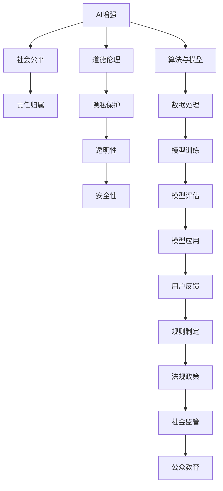

                 

# AI时代的人类增强：道德和社会的平衡

## 1. 背景介绍

### 1.1 问题由来

随着人工智能（AI）技术的发展，尤其是深度学习在多个领域的突破性应用，人类正逐渐步入“增强时代”。从医疗诊断、教育个性化，到自动驾驶、机器人，AI技术在提升效率、改善生活方面发挥了重要作用。然而，AI的发展也带来了一系列伦理和社会问题，如隐私保护、数据安全、公平性、责任归属等，需要我们在技术应用的同时，同步考虑道德和社会的平衡。

### 1.2 问题核心关键点

当前，AI在应用过程中面临的主要伦理和社会挑战包括：

- **隐私保护**：如何保护用户数据不被滥用，防止信息泄露和数据盗窃。
- **公平性和偏见**：AI系统是否会对某些群体产生偏见，是否具有普遍适用性。
- **责任归属**：当AI系统出现错误或导致损失时，责任应由谁承担。
- **透明性**：AI决策过程是否透明，是否能够解释和审查。
- **安全性**：AI系统是否安全可靠，能否应对突发状况和攻击。
- **人类替代风险**：AI是否会取代人类工作，引发就业和社会不稳定。

这些问题不仅关系到AI技术的健康发展，也关乎社会的长期稳定和公众的信任。因此，如何在提升AI效能的同时，兼顾伦理和社会公平，成为了当前和未来研究的重要课题。

### 1.3 问题研究意义

研究AI时代人类增强的道德和社会平衡，具有以下重要意义：

- **保障用户权益**：通过制定合理的伦理规范，保护用户隐私和数据安全，提升用户对AI系统的信任。
- **促进公平正义**：避免AI系统对特定群体的偏见，确保技术应用对所有人公平公正。
- **构建信任机制**：提高AI系统的透明性和可解释性，让公众理解和接受AI技术。
- **促进社会和谐**：平衡AI与人类关系，防止技术滥用，避免对社会稳定造成冲击。

## 2. 核心概念与联系

### 2.1 核心概念概述

要理解AI时代人类增强的道德和社会平衡，首先需要明确几个核心概念：

- **AI增强**：通过AI技术提升人类的能力，包括认知、决策、执行等方面。
- **道德伦理**：指导AI技术应用行为的原则和规范，保障技术的正向价值。
- **社会公平**：确保AI技术应用对不同群体公平，防止技术加剧社会不平等。
- **责任归属**：明确AI系统决策和行为的责任主体，避免责任模糊。
- **隐私保护**：保障用户个人信息的隐私安全，防止数据滥用。
- **透明性**：AI系统决策过程应透明，便于审查和解释。
- **安全性**：确保AI系统在各种情况下都能稳定运行，防范潜在风险。

这些概念通过一系列的规则、制度和技术手段相联系，共同构建起AI时代人类增强的伦理和社会框架。

### 2.2 核心概念原理和架构的 Mermaid 流程图



## 3. 核心算法原理 & 具体操作步骤

### 3.1 算法原理概述

AI时代的人类增强，涉及一系列的算法和模型设计。其中，数据处理、模型训练和评估是关键环节。以下是这些环节的算法原理概述：

1. **数据处理**：对原始数据进行清洗、去噪、归一化等预处理，确保数据质量和可用性。
2. **模型训练**：选择合适的算法和模型架构，在标注数据集上进行训练，优化模型参数，提升模型性能。
3. **模型评估**：通过测试集评估模型效果，确定模型的准确率、召回率、F1分数等性能指标。
4. **模型应用**：将训练好的模型部署到实际应用场景中，进行推理和决策。
5. **用户反馈**：收集用户对AI系统性能的反馈，用于模型迭代和优化。
6. **规则制定**：根据伦理和社会需求，制定AI系统的使用规则和行为规范。
7. **法规政策**：制定和实施相关法律法规，保障AI技术应用合法合规。
8. **社会监管**：建立有效的监管机制，对AI系统进行监控和审查。
9. **公众教育**：通过宣传和培训，提升公众对AI技术的理解和接受度。

### 3.2 算法步骤详解

以下是AI时代人类增强的详细步骤：

1. **需求分析**：明确AI系统的目标和应用场景，分析用户需求和预期效果。
2. **数据收集**：从不同渠道收集相关数据，确保数据的多样性和代表性。
3. **数据清洗**：对收集到的数据进行清洗和处理，去除噪声和异常值，确保数据质量。
4. **模型选择**：根据需求选择合适的算法和模型架构，如决策树、神经网络、深度学习等。
5. **模型训练**：在标注数据集上对模型进行训练，调整参数，优化性能。
6. **模型评估**：在测试集上评估模型性能，确定准确率、召回率等指标。
7. **模型优化**：根据评估结果，对模型进行优化和迭代，提升性能。
8. **模型部署**：将优化后的模型部署到实际应用场景中，进行推理和决策。
9. **用户反馈**：收集用户对AI系统性能的反馈，用于模型迭代和优化。
10. **规则制定**：根据伦理和社会需求，制定AI系统的使用规则和行为规范。
11. **法规政策**：制定和实施相关法律法规，保障AI技术应用合法合规。
12. **社会监管**：建立有效的监管机制，对AI系统进行监控和审查。
13. **公众教育**：通过宣传和培训，提升公众对AI技术的理解和接受度。

### 3.3 算法优缺点

AI时代人类增强的算法具有以下优点：

1. **高效性**：通过数据处理和模型训练，可以快速提升AI系统的效能。
2. **可解释性**：部分算法（如决策树、线性回归等）具有较好的可解释性，便于审查和理解。
3. **适应性强**：不同领域和应用场景可以灵活选择和调整算法，适应多样化的需求。
4. **透明性**：通过规则制定和公众教育，增强AI系统的透明性和公众信任。

然而，这些算法也存在一些缺点：

1. **过拟合风险**：在数据量不足的情况下，模型可能过拟合，影响泛化能力。
2. **隐私风险**：数据处理和模型训练可能泄露用户隐私信息，需加强隐私保护措施。
3. **公平性问题**：算法可能对特定群体产生偏见，需考虑公平性和无歧视性。
4. **责任归属模糊**：AI系统出错时责任归属不明确，需制定明确的责任机制。
5. **可解释性不足**：部分算法（如深度学习）具有黑盒特性，难以解释决策过程。
6. **安全性问题**：AI系统可能被攻击和滥用，需加强安全防护。

### 3.4 算法应用领域

AI时代人类增强的算法在多个领域都有广泛应用：

1. **医疗健康**：AI辅助诊断、个性化治疗、药物研发等。
2. **金融服务**：风险评估、欺诈检测、智能投顾等。
3. **教育培训**：个性化推荐、智能辅导、在线教学等。
4. **交通运输**：自动驾驶、智能调度、交通流量预测等。
5. **娱乐传媒**：内容推荐、智能搜索、虚拟现实等。
6. **工业制造**：智能检测、预测维护、优化生产等。
7. **公共安全**：安防监控、预测分析、应急响应等。

## 4. 数学模型和公式 & 详细讲解 & 举例说明

### 4.1 数学模型构建

AI时代人类增强的数学模型主要基于机器学习和深度学习算法。以下是几个核心模型的构建：

- **决策树**：通过树形结构表示决策过程，适用于分类和回归任务。
- **随机森林**：多棵决策树的集成，提高模型的准确性和鲁棒性。
- **神经网络**：多层感知机、卷积神经网络、循环神经网络等，适用于复杂的非线性建模。
- **深度学习**：多层次的非线性建模，如CNN、RNN、LSTM等，适用于图像、语音、文本等数据。
- **强化学习**：通过奖励机制训练模型，优化决策过程，适用于游戏、机器人等领域。

### 4.2 公式推导过程

以决策树为例，其构建过程如下：

1. 选择一个最优的特征作为根节点，将数据集分为两部分。
2. 对每部分数据递归地应用步骤1，构建子树。
3. 最终构建完整的决策树。

其数学模型可以表示为：

$$
\begin{aligned}
&\text{决策树}(T) = \text{根节点}(R) \\
&\text{根节点}(R) = \text{最优特征}(F) \\
&\text{最优特征}(F) = \text{arg\_max}(\text{信息增益}) \\
&\text{信息增益} = \text{熵}(D) - \sum_{i=1}^{n} \text{熵}(D_i) \\
&\text{熵}(D) = -\sum_{i=1}^{n} p_i \log p_i \\
&\text{子树}(T_i) = \text{根节点}(R_i) \\
&\text{根节点}(R_i) = \text{最优特征}(F_i) \\
&\text{最优特征}(F_i) = \text{arg\_max}(\text{信息增益}) \\
&\text{信息增益} = \text{熵}(D_i) - \sum_{j=1}^{m} \text{熵}(D_{ij})
\end{aligned}
$$

其中，$D$ 为原始数据集，$D_i$ 为选择特征 $F$ 后的子集，$p_i$ 为 $D_i$ 的概率分布。

### 4.3 案例分析与讲解

以医疗健康领域的AI应用为例，分析其伦理和社会平衡问题：

1. **隐私保护**：AI系统处理病患数据，需严格遵守隐私保护法规，确保数据安全。
2. **公平性**：AI系统不应因患者性别、年龄、种族等特征产生偏见，确保公平诊断。
3. **责任归属**：当AI系统出错导致误诊时，需明确责任归属，保护医生和患者权益。
4. **透明性**：AI系统应提供透明的决策过程，便于医生和患者理解。
5. **安全性**：AI系统需具备鲁棒性和可解释性，防止被攻击和滥用。

## 5. 项目实践：代码实例和详细解释说明

### 5.1 开发环境搭建

以下是在Python环境下搭建AI项目实践环境的步骤：

1. 安装Python：从官网下载安装Python 3.x版本。
2. 安装相关库：安装NumPy、Pandas、Scikit-learn、TensorFlow、Keras等常用库。
3. 配置环境：设置虚拟环境，安装所需依赖库，如Jupyter Notebook、TensorBoard等。
4. 数据准备：收集并清洗数据，确保数据质量和可用性。
5. 模型训练：选择合适的算法和模型架构，在标注数据集上进行训练。
6. 模型评估：在测试集上评估模型性能，确定准确率、召回率等指标。
7. 模型部署：将优化后的模型部署到实际应用场景中，进行推理和决策。
8. 用户反馈：收集用户对AI系统性能的反馈，用于模型迭代和优化。

### 5.2 源代码详细实现

以一个简单的决策树分类器为例，展示其实现过程：

```python
import numpy as np
from sklearn.tree import DecisionTreeClassifier

# 准备数据
X = np.array([[1, 2], [3, 4], [5, 6], [7, 8]])
y = np.array([0, 0, 1, 1])

# 训练模型
clf = DecisionTreeClassifier()
clf.fit(X, y)

# 测试模型
X_test = np.array([[3, 4], [6, 7]])
y_pred = clf.predict(X_test)

print(y_pred)
```

### 5.3 代码解读与分析

以上代码展示了决策树分类器的基本流程：

1. 准备数据：将输入数据和标签存入NumPy数组中。
2. 训练模型：创建决策树分类器，并在训练集上训练模型。
3. 测试模型：使用测试集对模型进行测试，获取预测结果。

## 6. 实际应用场景

### 6.4 未来应用展望

AI时代人类增强的伦理和社会平衡在多个领域有广阔的应用前景：

1. **医疗健康**：通过AI辅助诊断和治疗，提升医疗服务的普惠性和质量。
2. **金融服务**：通过AI风险评估和欺诈检测，提升金融系统的安全性和稳定性。
3. **教育培训**：通过AI个性化推荐和智能辅导，提升教育效果和学习体验。
4. **交通运输**：通过AI自动驾驶和智能调度，提升交通效率和安全性。
5. **娱乐传媒**：通过AI内容推荐和智能搜索，提升用户体验和媒体互动。
6. **工业制造**：通过AI智能检测和预测维护，提升生产效率和质量。
7. **公共安全**：通过AI安防监控和预测分析，提升社会治安和应急响应能力。

## 7. 工具和资源推荐

### 7.1 学习资源推荐

为了系统学习AI时代人类增强的伦理和社会平衡，以下推荐一些优质的学习资源：

1. **《AI时代的人类增强》书籍**：深入探讨AI技术在各个领域的应用及其伦理挑战。
2. **斯坦福大学《人工智能伦理》课程**：由斯坦福大学教授讲授，涵盖AI伦理的核心概念和经典案例。
3. **Coursera《AI伦理与法律》课程**：来自哈佛大学教授，深入讨论AI伦理和法律问题。
4. **Towards Data Science博客**：收录了大量关于AI伦理和法律的讨论和案例分析。
5. **AI伦理与安全工作坊**：定期举办的学术和工作坊，邀请专家和学者探讨AI伦理问题。

### 7.2 开发工具推荐

以下推荐一些常用的开发工具：

1. **Jupyter Notebook**：开源的交互式编程环境，适合数据处理和模型训练。
2. **TensorFlow**：开源的深度学习框架，支持多种模型和算法。
3. **PyTorch**：开源的深度学习框架，适合动态计算图和灵活模型构建。
4. **Scikit-learn**：开源的机器学习库，提供多种算法和工具。
5. **TensorBoard**：开源的可视化工具，用于监控和调试深度学习模型。
6. **Github**：代码托管平台，方便版本控制和团队协作。

### 7.3 相关论文推荐

以下推荐几篇关于AI时代人类增强伦理和社会平衡的论文：

1. **《公平机器学习综述》**：总结了公平机器学习的研究进展和应用案例。
2. **《AI伦理与安全》**：探讨了AI伦理和安全性的核心问题和技术挑战。
3. **《AI系统透明性与可解释性》**：研究了AI系统透明性和可解释性的方法和实践。
4. **《隐私保护与数据安全》**：讨论了数据隐私保护和数据安全的最新技术和策略。

## 8. 总结：未来发展趋势与挑战

### 8.1 研究成果总结

AI时代人类增强的伦理和社会平衡研究已经取得了丰硕成果，但仍有诸多挑战需要解决：

1. **隐私保护**：需要更高效的数据保护技术，确保用户数据安全。
2. **公平性**：需进一步研究算法公平性，减少偏见和歧视。
3. **责任归属**：需建立明确的责任机制，确保AI系统出错时有明确的责任主体。
4. **透明性**：需增强AI系统的透明性和可解释性，便于审查和理解。
5. **安全性**：需提高AI系统的安全性和鲁棒性，防止被攻击和滥用。

### 8.2 未来发展趋势

未来，AI时代人类增强的伦理和社会平衡将呈现以下发展趋势：

1. **数据隐私保护**：随着隐私保护技术的发展，数据安全将得到进一步保障。
2. **算法公平性**：研究更加公平和无偏的算法，确保AI系统对所有群体公平。
3. **责任机制明确**：建立明确的责任机制，确保AI系统出错时有明确的责任主体。
4. **透明性与可解释性**：增强AI系统的透明性和可解释性，便于审查和理解。
5. **安全性提升**：提高AI系统的安全性和鲁棒性，防止被攻击和滥用。

### 8.3 面临的挑战

尽管取得了一定进展，AI时代人类增强的伦理和社会平衡仍面临诸多挑战：

1. **数据隐私泄露**：大数据时代，数据隐私保护变得尤为困难。
2. **算法偏见问题**：现有算法可能存在偏见，影响公平性。
3. **责任归属不清**：AI系统出错时责任归属不明确，容易导致纠纷。
4. **可解释性不足**：部分算法难以解释，增加了用户的不信任。
5. **安全性不足**：AI系统可能被攻击和滥用，导致安全问题。

### 8.4 研究展望

未来研究需要在以下几个方面进一步突破：

1. **隐私保护技术**：开发更高效的数据保护技术，保障用户数据安全。
2. **公平算法研究**：研究更加公平和无偏的算法，提升算法公平性。
3. **责任机制设计**：建立明确的责任机制，确保AI系统出错时有明确的责任主体。
4. **透明性提升**：增强AI系统的透明性和可解释性，便于审查和理解。
5. **安全性强化**：提高AI系统的安全性和鲁棒性，防止被攻击和滥用。

## 9. 附录：常见问题与解答

### Q1：AI时代人类增强的伦理和社会平衡是否会限制AI技术的发展？

A: 不会。AI时代人类增强的伦理和社会平衡是为了保障技术应用的合法合规，提升公众对AI技术的信任，而不是限制技术发展。相反，这些研究能够帮助技术更好地融入社会，造福人类。

### Q2：如何平衡AI系统的高效性和公平性？

A: 在模型设计和训练过程中，需考虑公平性目标。如在数据预处理阶段，使用公平性约束条件，避免数据偏差。在模型评估阶段，引入公平性评估指标，调整模型参数。

### Q3：AI系统的透明性和可解释性如何实现？

A: 通过算法设计和使用可解释性模型，如决策树、线性回归等，增强AI系统的透明性。同时，提供模型解释工具，帮助用户理解AI决策过程。

### Q4：AI时代人类增强的应用中，如何确保用户数据隐私保护？

A: 通过数据匿名化、加密技术、差分隐私等手段，确保用户数据隐私保护。同时，制定严格的隐私保护法规和政策，规范数据处理和使用行为。

### Q5：AI时代人类增强的伦理和社会平衡研究有哪些挑战？

A: 隐私保护、算法公平性、责任归属、可解释性、安全性等都是面临的挑战。需要从技术、政策、法规等多个层面进行综合考虑和解决。

作者：禅与计算机程序设计艺术 / Zen and the Art of Computer Programming

